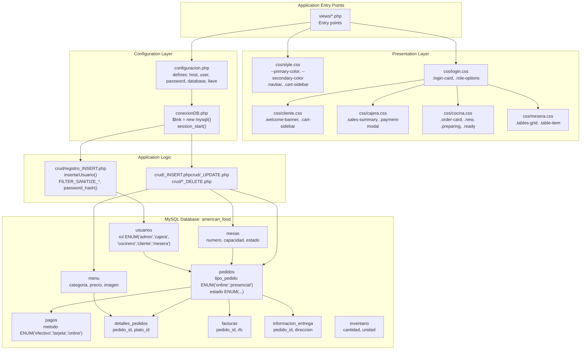
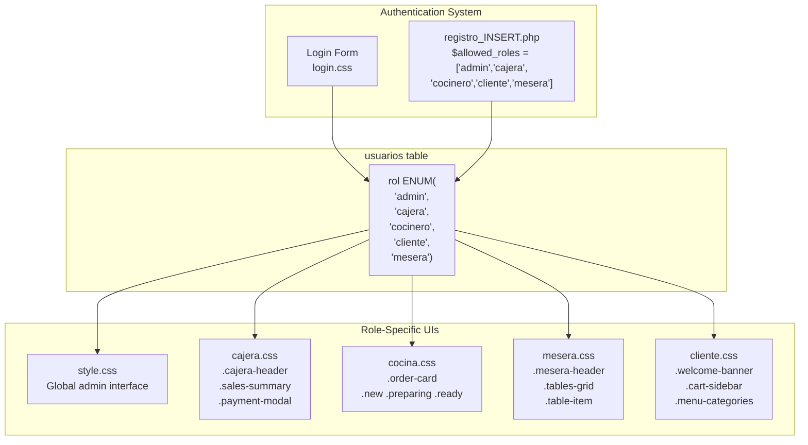
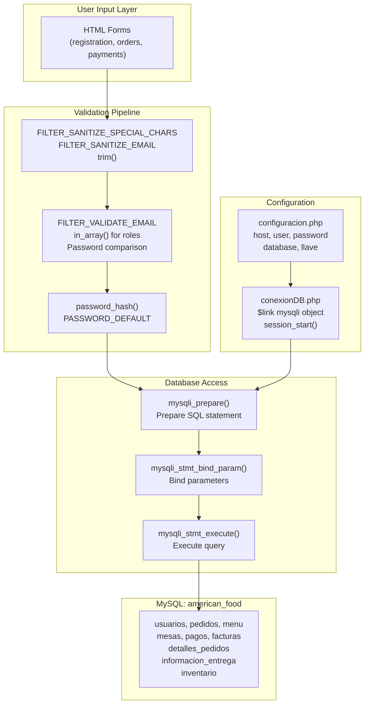

# Descripción general

> **Archivos fuente relevantes**
> * [config/conexiónDB.php](https://github.com/axchisan/AmericanFood/blob/67fea4d3/config/conexionDB.php)
> * [crud/registro_INSERT.php](https://github.com/axchisan/AmericanFood/blob/67fea4d3/crud/registro_INSERT.php)
> * [css/style.css](https://github.com/axchisan/AmericanFood/blob/67fea4d3/css/style.css)
> * [base de datos/comida_americana (6).sql](https://github.com/axchisan/AmericanFood/blob/67fea4d3/database/american_food (6).sql)
> 
> (sql)

## Propósito y alcance

El sistema **American Food** es una aplicación web integral para la gestión de operaciones de restaurantes. Proporciona interfaces específicas para cada rol, tanto para el personal (cajeros, cocineros, meseros, administradores) como para los clientes, para gestionar pedidos, pagos, la gestión de mesas, el seguimiento del inventario y la coordinación de la cocina. Este documento ofrece una descripción general de la arquitectura del sistema, sus componentes principales y sus características clave.

Para obtener información detallada sobre subsistemas específicos:

* Esquema y relaciones de la base de datos: consulte [Capa de base de datos](/axchisan/AmericanFood/2-database-layer)
* Configuración e inicialización: ver [Configuración y Bootstrap](/axchisan/AmericanFood/3-configuration-and-bootstrap)
* Servicios backend de PHP: ver [Servicios backend](/axchisan/AmericanFood/4-backend-services)
* Interfaces de usuario basadas en CSS: consulte [Arquitectura de frontend](/axchisan/AmericanFood/5-frontend-architecture)
* Autenticación de usuarios y control de acceso: consulte [Roles de usuario y control de acceso](/axchisan/AmericanFood/7-user-roles-and-access-control)
* Ciclo de vida de los pedidos y procesos de negocio: consulte [Flujos de trabajo empresariales](/axchisan/AmericanFood/8-business-workflows)

**Fuentes:** Análisis de la estructura del repositorio,[base de datos/comida_americana (6).sql](https://github.com/axchisan/AmericanFood/blob/67fea4d3/database/american_food (6).sql)

 [config/conexiónDB.php](https://github.com/axchisan/AmericanFood/blob/67fea4d3/config/conexionDB.php)

 [crud/registro_INSERT.php](https://github.com/axchisan/AmericanFood/blob/67fea4d3/crud/registro_INSERT.php)

 [css/style.css](https://github.com/axchisan/AmericanFood/blob/67fea4d3/css/style.css)

---

## Arquitectura del sistema

American Food implementa una arquitectura web tradicional de tres niveles con una clara separación entre las capas de presentación, lógica de aplicación y persistencia de datos. El sistema sigue un modelo de control de acceso basado en roles, donde cada tipo de usuario recibe una interfaz personalizada y optimizada para sus responsabilidades específicas.

### Diagrama de arquitectura: inicialización del sistema y estructura de archivos



**Fuentes:** [config/configuracion.php](https://github.com/axchisan/AmericanFood/blob/67fea4d3/config/configuracion.php)

 [config/conexi L1-L18](https://github.com/axchisan/AmericanFood/blob/67fea4d3/config/conexionDB.php#L1-L18)

 [crud/registro_INSERT.php L1-L73](https://github.com/axchisan/AmericanFood/blob/67fea4d3/crud/registro_INSERT.php#L1-L73)

 [css/style.css L1-L704](https://github.com/axchisan/AmericanFood/blob/67fea4d3/css/style.css#L1-L704)

 [css/login.css](https://github.com/axchisan/AmericanFood/blob/67fea4d3/css/login.css)

 [css/cliente.css](https://github.com/axchisan/AmericanFood/blob/67fea4d3/css/cliente.css)

 [css/cajera.css](https://github.com/axchisan/AmericanFood/blob/67fea4d3/css/cajera.css)

 [css/cocina.css](https://github.com/axchisan/AmericanFood/blob/67fea4d3/css/cocina.css)

 [css/mesera.css](https://github.com/axchisan/AmericanFood/blob/67fea4d3/css/mesera.css)

 [base L1-L488](https://github.com/axchisan/AmericanFood/blob/67fea4d3/database/american_food (6).sql#L1-L488)

---

## Componentes principales del sistema

### Configuración y sistema de arranque

La inicialización de la aplicación sigue una secuencia estricta:

| Paso | Componente | Archivo | Operaciones clave |
| --- | --- | --- | --- |
| 1 | Definir constantes | [config/configuracion.php](https://github.com/axchisan/AmericanFood/blob/67fea4d3/config/configuracion.php) | `define(host, '127.0.0.1')`, `define(user, 'root')`, `define(password, '')`, `define(database, 'american_food')`,`define(llave, '')` |
| 2 | Incluir configuración | Cualquier punto de entrada | `include_once 'configuracion.php'` |
| 3 | Inicializar sesión | [config/conexi L4-L6](https://github.com/axchisan/AmericanFood/blob/67fea4d3/config/conexionDB.php#L4-L6) | `if (session_status() === PHP_SESSION_NONE) session_start()` |
| 4 | Crear conexión a la base de datos | [config/conexi L8](https://github.com/axchisan/AmericanFood/blob/67fea4d3/config/conexionDB.php#L8-L8) | `$link = new mysqli(host, user, password, database)` |
| 5 | Manejo de errores | [config/conexi L10-L15](https://github.com/axchisan/AmericanFood/blob/67fea4d3/config/conexionDB.php#L10-L15) | Comprobar `$link->connect_errno`, configurar `$_SESSION['MensajeTexto']`, `exit`en caso de fallo |
| 6 | Establecer codificación de caracteres | [config/conexi L17](https://github.com/axchisan/AmericanFood/blob/67fea4d3/config/conexionDB.php#L17-L17) | `$link->set_charset("utf8")` |

The global `$link` mysqli object becomes available to all application code after the connection manager is included. See [Configuration and Bootstrap](/axchisan/AmericanFood/3-configuration-and-bootstrap) for details.

**Sources:** [config/configuracion.php](https://github.com/axchisan/AmericanFood/blob/67fea4d3/config/configuracion.php)

 [config/conexionDB.php L1-L18](https://github.com/axchisan/AmericanFood/blob/67fea4d3/config/conexionDB.php#L1-L18)

### Database Schema Summary

The `american_food` database contains 9 core tables with the `pedidos` table serving as the central hub:

```css
#mermaid-y020pxnffjs{font-family:ui-sans-serif,-apple-system,system-ui,Segoe UI,Helvetica;font-size:16px;fill:#333;}@keyframes edge-animation-frame{from{stroke-dashoffset:0;}}@keyframes dash{to{stroke-dashoffset:0;}}#mermaid-y020pxnffjs .edge-animation-slow{stroke-dasharray:9,5!important;stroke-dashoffset:900;animation:dash 50s linear infinite;stroke-linecap:round;}#mermaid-y020pxnffjs .edge-animation-fast{stroke-dasharray:9,5!important;stroke-dashoffset:900;animation:dash 20s linear infinite;stroke-linecap:round;}#mermaid-y020pxnffjs .error-icon{fill:#dddddd;}#mermaid-y020pxnffjs .error-text{fill:#222222;stroke:#222222;}#mermaid-y020pxnffjs .edge-thickness-normal{stroke-width:1px;}#mermaid-y020pxnffjs .edge-thickness-thick{stroke-width:3.5px;}#mermaid-y020pxnffjs .edge-pattern-solid{stroke-dasharray:0;}#mermaid-y020pxnffjs .edge-thickness-invisible{stroke-width:0;fill:none;}#mermaid-y020pxnffjs .edge-pattern-dashed{stroke-dasharray:3;}#mermaid-y020pxnffjs .edge-pattern-dotted{stroke-dasharray:2;}#mermaid-y020pxnffjs .marker{fill:#999;stroke:#999;}#mermaid-y020pxnffjs .marker.cross{stroke:#999;}#mermaid-y020pxnffjs svg{font-family:ui-sans-serif,-apple-system,system-ui,Segoe UI,Helvetica;font-size:16px;}#mermaid-y020pxnffjs p{margin:0;}#mermaid-y020pxnffjs .entityBox{fill:#ffffff;stroke:#dddddd;}#mermaid-y020pxnffjs .relationshipLabelBox{fill:#dddddd;opacity:0.7;background-color:#dddddd;}#mermaid-y020pxnffjs .relationshipLabelBox rect{opacity:0.5;}#mermaid-y020pxnffjs .labelBkg{background-color:rgba(221, 221, 221, 0.5);}#mermaid-y020pxnffjs .edgeLabel .label{fill:#dddddd;font-size:14px;}#mermaid-y020pxnffjs .label{font-family:ui-sans-serif,-apple-system,system-ui,Segoe UI,Helvetica;color:#333;}#mermaid-y020pxnffjs .edge-pattern-dashed{stroke-dasharray:8,8;}#mermaid-y020pxnffjs .node rect,#mermaid-y020pxnffjs .node circle,#mermaid-y020pxnffjs .node ellipse,#mermaid-y020pxnffjs .node polygon{fill:#ffffff;stroke:#dddddd;stroke-width:1px;}#mermaid-y020pxnffjs .relationshipLine{stroke:#999;stroke-width:1;fill:none;}#mermaid-y020pxnffjs .marker{fill:none!important;stroke:#999!important;stroke-width:1;}#mermaid-y020pxnffjs :root{--mermaid-font-family:"trebuchet ms",verdana,arial,sans-serif;}createsassigned_tocontainsreferenceshas_paymenthas_invoicehas_delivery_infousuariosintidPKvarcharnombrevarcharapellidovarcharcorreoUKvarcharusernameenumroladmin,cajera,cocinero,cliente,meseravarcharcontraseñapassword_hash()enumestadoactivo,inactivopedidosintidPKintmesa_idFKNULL for onlineintcliente_idFKNULL for presencialenumtipo_pedidoonline,presencialenumestadonuevo,pendiente_pago,pagado,en_preparacion,listo,enviado,entregado,canceladodatetimefecha_horadecimaltotaltextnotasvarcharmetodo_pagomesasintidPKintnumerointcapacidadenumubicacioninterior,terraza,bar,vipenumestadoactiva,inactivadetalles_pedidosintidPKintpedido_idFKintplato_idFKintcantidaddecimalprecio_unitariomenuintidPKvarcharnombretextdescripcionenumcategoriaentradas,principales,postres,bebidasdecimalpreciovarcharimagentinyintdisponiblepagosintidPKintpedido_idFKenummetodoefectivo,tarjeta,onlinedecimalmonto_recibidodecimalcambiodatetimefecha_horafacturasintidPKintpedido_idFKvarcharnombrevarcharrfcvarcharemailtextdireccionvarcharuso_cfdidatetimefechadecimaltotalenumestadopendiente,emitidainformacion_entregaintidPKintpedido_idFKvarcharnombretextdireccionvarchartelefonoinventariointidPKvarcharnombrevarcharcategoriadecimalcantidadenumunidadkg,g,l,ml,unidadesdecimalprecio_unitariovarcharproveedordecimalcantidad_minima
```

See [Database Layer](/axchisan/AmericanFood/2-database-layer) for comprehensive schema documentation.

**Sources:** [database/american_food L30-L483](https://github.com/axchisan/AmericanFood/blob/67fea4d3/database/american_food (6).sql#L30-L483)

---

## User Role System

The application implements role-based access control with 5 distinct user types, each with dedicated interface files and specific permissions:

### Role Configuration and Routing



| Role | Spanish Term | Interface File | Key Responsibilities | Database Access |
| --- | --- | --- | --- | --- |
| Admin | admin | [css/style.css](https://github.com/axchisan/AmericanFood/blob/67fea4d3/css/style.css) | Full system access | All tables |
| Cashier | cajera | [css/cajera.css](https://github.com/axchisan/AmericanFood/blob/67fea4d3/css/cajera.css) | Process payments, generate invoices | `pedidos`, `pagos`, `facturas` |
| Cook | cocinero | [css/cocina.css](https://github.com/axchisan/AmericanFood/blob/67fea4d3/css/cocina.css) | View orders, update preparation status | `pedidos`, `detalles_pedidos`, `menu` |
| Server | mesera | [css/mesera.css](https://github.com/axchisan/AmericanFood/blob/67fea4d3/css/mesera.css) | Manage tables, take orders | `mesas`, `pedidos`, `detalles_pedidos`, `menu` |
| Customer | cliente | [css/cliente.css](https://github.com/axchisan/AmericanFood/blob/67fea4d3/css/cliente.css) | Browse menu, place online orders | `menu`, `pedidos`, `informacion_entrega` |

The role validation occurs at user registration in [crud/registro_INSERT.php L51-L54](https://github.com/axchisan/AmericanFood/blob/67fea4d3/crud/registro_INSERT.php#L51-L54)

 using a whitelist array. See [User Roles and Access Control](/axchisan/AmericanFood/7-user-roles-and-access-control) for detailed permissions and authentication flow.

**Sources:** [crud/registro_INSERT.php L51-L54](https://github.com/axchisan/AmericanFood/blob/67fea4d3/crud/registro_INSERT.php#L51-L54)

 [database/american_food L287-L297](https://github.com/axchisan/AmericanFood/blob/67fea4d3/database/american_food (6).sql#L287-L297)

 [css/style.css](https://github.com/axchisan/AmericanFood/blob/67fea4d3/css/style.css)

 [css/cajera.css](https://github.com/axchisan/AmericanFood/blob/67fea4d3/css/cajera.css)

 [css/cocina.css](https://github.com/axchisan/AmericanFood/blob/67fea4d3/css/cocina.css)

 [css/mesera.css](https://github.com/axchisan/AmericanFood/blob/67fea4d3/css/mesera.css)

 [css/cliente.css](https://github.com/axchisan/AmericanFood/blob/67fea4d3/css/cliente.css)

---

## Technology Stack

### Backend Technologies

| Technology | Version/Details | Usage | Location |
| --- | --- | --- | --- |
| **PHP** | 8.2.4 | Server-side application logic | [crud/*.php](https://github.com/axchisan/AmericanFood/blob/67fea4d3/crud/*.php) |
| **MySQL/MariaDB** | 10.4.28-MariaDB | Data persistence | [database/american_food (6).sql](https://github.com/axchisan/AmericanFood/blob/67fea4d3/database/american_food (6).sql) |
| **mysqli** | Built-in | Database connectivity | [config/conexionDB.php L8](https://github.com/axchisan/AmericanFood/blob/67fea4d3/config/conexionDB.php#L8-L8) |
| **Session Management** | PHP native | User state, error messages | [config/conexionDB.php L4-L6](https://github.com/axchisan/AmericanFood/blob/67fea4d3/config/conexionDB.php#L4-L6) |
| **Password Hashing** | `PASSWORD_DEFAULT` (bcrypt) | Credential security | [crud/registro_INSERT.php L56](https://github.com/axchisan/AmericanFood/blob/67fea4d3/crud/registro_INSERT.php#L56-L56) |

### Frontend Technologies

| Technology | Version/Details | Usage | Location |
| --- | --- | --- | --- |
| **CSS3** | Modern CSS | Styling, layout, component system | [css/*.css](https://github.com/axchisan/AmericanFood/blob/67fea4d3/css/*.css) |
| **CSS Custom Properties** | `:root` variables | Color palette, theming | [css/style.css L3-L18](https://github.com/axchisan/AmericanFood/blob/67fea4d3/css/style.css#L3-L18) |
| **Responsive Design** | Media queries | Mobile adaptation (992px, 768px, 576px breakpoints) | [css/style.css L386-L460](https://github.com/axchisan/AmericanFood/blob/67fea4d3/css/style.css#L386-L460) |
| **Font Awesome 6** | Icon library | UI icons | [css/style.css L190-L196](https://github.com/axchisan/AmericanFood/blob/67fea4d3/css/style.css#L190-L196) |
| **Poppins Font** | Google Fonts | Typography | [css/style.css L22](https://github.com/axchisan/AmericanFood/blob/67fea4d3/css/style.css#L22-L22) |

### Security Technologies

| Feature | Implementation | Purpose | Reference |
| --- | --- | --- | --- |
| Input Sanitization | `FILTER_SANITIZE_SPECIAL_CHARS`, `FILTER_SANITIZE_EMAIL` | XSS prevention | [crud/registro_INSERT.php L33-L38](https://github.com/axchisan/AmericanFood/blob/67fea4d3/crud/registro_INSERT.php#L33-L38) |
| Email Validation | `FILTER_VALIDATE_EMAIL` | Data integrity | [crud/registro_INSERT.php L43-L45](https://github.com/axchisan/AmericanFood/blob/67fea4d3/crud/registro_INSERT.php#L43-L45) |
| Password Hashing | `password_hash($password, PASSWORD_DEFAULT)` | Credential protection | [crud/registro_INSERT.php L56](https://github.com/axchisan/AmericanFood/blob/67fea4d3/crud/registro_INSERT.php#L56-L56) |
| Prepared Statements | `mysqli_prepare()`, `mysqli_stmt_bind_param()` | SQL injection prevention | [crud/registro_INSERT.php L11-L18](https://github.com/axchisan/AmericanFood/blob/67fea4d3/crud/registro_INSERT.php#L11-L18) |
| Role Validation | Whitelist array check | Authorization | [crud/registro_INSERT.php L51-L54](https://github.com/axchisan/AmericanFood/blob/67fea4d3/crud/registro_INSERT.php#L51-L54) |
| Character Encoding | `$link->set_charset("utf8")` | UTF-8 support for Spanish | [config/conexionDB.php L17](https://github.com/axchisan/AmericanFood/blob/67fea4d3/config/conexionDB.php#L17-L17) |

See [Technology Stack](/axchisan/AmericanFood/1.2-technology-stack) for detailed specifications and [Security Practices](/axchisan/AmericanFood/4.2-security-practices) for security implementation details.

**Sources:** [config/conexionDB.php L8-L17](https://github.com/axchisan/AmericanFood/blob/67fea4d3/config/conexionDB.php#L8-L17)

 [crud/registro_INSERT.php L33-L59](https://github.com/axchisan/AmericanFood/blob/67fea4d3/crud/registro_INSERT.php#L33-L59)

 [css/style.css L1-L704](https://github.com/axchisan/AmericanFood/blob/67fea4d3/css/style.css#L1-L704)

 [database/american_food L1-L10](https://github.com/axchisan/AmericanFood/blob/67fea4d3/database/american_food (6).sql#L1-L10)

---

## Key Features

### Order Management

The system supports dual-track order processing:

**Online Orders** (`tipo_pedido='online'`):

* Customer browses menu via [css/cliente.css](https://github.com/axchisan/AmericanFood/blob/67fea4d3/css/cliente.css)  interface
* Cart system implemented in [css/style.css L576-L693](https://github.com/axchisan/AmericanFood/blob/67fea4d3/css/style.css#L576-L693)  as `.cart-sidebar`
* Order includes `cliente_id` and `informacion_entrega` delivery details
* Process tracked through states: `nuevo` → `pendiente_pago` → `pagado` → `en_preparacion` → `listo` → `enviado` → `entregado`

**In-Person Orders** (`tipo_pedido='presencial'`):

* Server assigns table via [css/mesera.css](https://github.com/axchisan/AmericanFood/blob/67fea4d3/css/mesera.css)  `.tables-grid` interface
* Order includes `mesa_id` from `mesas` table
* Cashier processes payment via [css/cajera.css](https://github.com/axchisan/AmericanFood/blob/67fea4d3/css/cajera.css)  `.payment-modal`
* States: `nuevo` → `en_preparacion` → `listo` → `entregado`

Both paths converge in the `pedidos` table and share the kitchen interface ([css/cocina.css](https://github.com/axchisan/AmericanFood/blob/67fea4d3/css/cocina.css)

) for preparation tracking. See [Order Processing Flow](/axchisan/AmericanFood/8.1-order-processing-flow) for complete lifecycle documentation.

**Sources:** [database/american_food L256-L266](https://github.com/axchisan/AmericanFood/blob/67fea4d3/database/american_food (6).sql#L256-L266)

 [css/cliente.css](https://github.com/axchisan/AmericanFood/blob/67fea4d3/css/cliente.css)

 [css/mesera.css](https://github.com/axchisan/AmericanFood/blob/67fea4d3/css/mesera.css)

 [css/cajera.css](https://github.com/axchisan/AmericanFood/blob/67fea4d3/css/cajera.css)

 [css/cocina.css](https://github.com/axchisan/AmericanFood/blob/67fea4d3/css/cocina.css)

 [css/style.css L576-L693](https://github.com/axchisan/AmericanFood/blob/67fea4d3/css/style.css#L576-L693)

### Payment Processing

The `pagos` table supports three payment methods:

| Method | Enum Value | Fields Used | Use Case |
| --- | --- | --- | --- |
| Cash | `'efectivo'` | `monto_recibido`, `cambio` | In-person payments with change calculation |
| Card | `'tarjeta'` | None (optional fields NULL) | Credit/debit card payments |
| Online | `'online'` | None (optional fields NULL) | Digital payments for online orders |

Cashier interface ([css/cajera.css L210-L237](https://github.com/axchisan/AmericanFood/blob/67fea4d3/css/cajera.css#L210-L237)

) provides payment processing modal. Payment records are created in [database/american_food L232-L238](https://github.com/axchisan/AmericanFood/blob/67fea4d3/database/american_food (6).sql#L232-L238)

 See [Payment Processing](/axchisan/AmericanFood/8.3-payment-processing) for workflow details.

**Sources:** [database/american_food L232-L248](https://github.com/axchisan/AmericanFood/blob/67fea4d3/database/american_food (6).sql#L232-L248)

 [css/cajera.css L210-L237](https://github.com/axchisan/AmericanFood/blob/67fea4d3/css/cajera.css#L210-L237)

### Table Management

The `mesas` table tracks restaurant seating with the following attributes:

* **Number**: Unique table identifier (`numero`)
* **Capacity**: Number of seats (`capacidad`)
* **Location**: Enum of `'interior'`, `'terraza'`, `'bar'`, `'vip'`
* **Status**: Enum of `'activa'`, `'inactiva'`

Server interface ([css/mesera.css L120-L202](https://github.com/axchisan/AmericanFood/blob/67fea4d3/css/mesera.css#L120-L202)

) displays tables in a grid with color-coded status indicators. See [Table Management](/axchisan/AmericanFood/8.4-table-management) for operational details.

**Sources:** [database/american_food L193-L223](https://github.com/axchisan/AmericanFood/blob/67fea4d3/database/american_food (6).sql#L193-L223)

 [css/mesera.css L120-L202](https://github.com/axchisan/AmericanFood/blob/67fea4d3/css/mesera.css#L120-L202)

### Kitchen Operations

Kitchen staff view orders through [css/cocina.css](https://github.com/axchisan/AmericanFood/blob/67fea4d3/css/cocina.css)

 interface with three visual states:

* **`.new`**: New orders received, border color differentiation
* **`.preparing`**: Orders in active preparation
* **`.ready`**: Orders completed and ready for service/delivery

Order cards (`.order-card`) display order details from `pedidos` and `detalles_pedidos` tables. State changes update the `pedidos.estado` field.

**Sources:** [css/cocina.css L1-L27](https://github.com/axchisan/AmericanFood/blob/67fea4d3/css/cocina.css#L1-L27)

 [database/american_food L256-L266](https://github.com/axchisan/AmericanFood/blob/67fea4d3/database/american_food (6).sql#L256-L266)

### Inventory Tracking

The `inventario` table manages stock with fields:

* **Item Details**: `nombre`, `categoria`
* **Quantity Tracking**: `cantidad`, `unidad` (enum: `'kg'`, `'g'`, `'l'`, `'ml'`, `'unidades'`)
* **Cost Management**: `precio_unitario`, `proveedor`
* **Alerts**: `cantidad_minima` for low-stock warnings

See [Supporting Tables](/axchisan/AmericanFood/2.4-supporting-tables) for complete inventory schema.

**Sources:** [database/american_food L139-L155](https://github.com/axchisan/AmericanFood/blob/67fea4d3/database/american_food (6).sql#L139-L155)

### Invoice Generation

The `facturas` table supports Mexican tax compliance (CFDI):

* **Customer Info**: `nombre`, `rfc` (tax ID), `email`, `direccion`
* **Tax Fields**: `uso_cfdi` for tax deduction classification
* **Linking**: Foreign key to `pedido_id`
* **Status**: Enum of `'pendiente'`, `'emitida'`

Cashier can generate invoices via [css/cajera.css](https://github.com/axchisan/AmericanFood/blob/67fea4d3/css/cajera.css)

 interface. See [Order Management Tables](/axchisan/AmericanFood/2.3-order-management-tables) for schema details.

**Sources:** [database/american_food L89-L108](https://github.com/axchisan/AmericanFood/blob/67fea4d3/database/american_food (6).sql#L89-L108)

 [css/cajera.css](https://github.com/axchisan/AmericanFood/blob/67fea4d3/css/cajera.css)

---

## CSS Component System

The frontend architecture implements a layered component system:

### Base Layer: css/style.css

Provides foundation for all interfaces:

* **Color Palette**: CSS custom properties `--primary-color: #FF6B35`, `--secondary-color: #C0392B`, etc. ([css/style.css L3-L18](https://github.com/axchisan/AmericanFood/blob/67fea4d3/css/style.css#L3-L18) )
* **Typography**: `font-family: 'Poppins'` with heading hierarchy ([css/style.css L21-L31](https://github.com/axchisan/AmericanFood/blob/67fea4d3/css/style.css#L21-L31) )
* **Global Components**: `.navbar`, `.footer`, `.btn-primary`, `.carousel` ([css/style.css L43-L460](https://github.com/axchisan/AmericanFood/blob/67fea4d3/css/style.css#L43-L460) )
* **Shared Cart System**: `.cart-sidebar`, `.cart-overlay`, `.cart-item` ([css/style.css L576-L693](https://github.com/axchisan/AmericanFood/blob/67fea4d3/css/style.css#L576-L693) )

### Authentication Layer: css/login.css

Standalone login/registration interface:

* `.login-card`: Card container for forms
* `.role-options`: Grid of role selection buttons
* `.password-strength`: Visual password strength indicator

### Role-Specific Layers

Each role has a dedicated CSS file extending the base layer:

| Interface | File | Key Classes | Purpose |
| --- | --- | --- | --- |
| Customer | [css/cliente.css](https://github.com/axchisan/AmericanFood/blob/67fea4d3/css/cliente.css) | `.welcome-banner`, `.menu-categories`, `.cart-sidebar`, `.reservation-list` | Menu browsing, cart, orders |
| Cashier | [css/cajera.css](https://github.com/axchisan/AmericanFood/blob/67fea4d3/css/cajera.css) | `.sales-summary`, `.payment-modal`, `.invoice-modal`, `.notifications-sidebar` | Financial operations |
| Kitchen | [css/cocina.css](https://github.com/axchisan/AmericanFood/blob/67fea4d3/css/cocina.css) | `.order-card`, `.order-header`, `.new`, `.preparing`, `.ready` | Order preparation |
| Server | [css/mesera.css](https://github.com/axchisan/AmericanFood/blob/67fea4d3/css/mesera.css) | `.tables-grid`, `.table-item`, `.orders-section`, `.menu-items-grid` | Table/order coordination |

See [Frontend Architecture](/axchisan/AmericanFood/5-frontend-architecture) for comprehensive component documentation.

**Sources:** [css/style.css L1-L704](https://github.com/axchisan/AmericanFood/blob/67fea4d3/css/style.css#L1-L704)

 [css/login.css](https://github.com/axchisan/AmericanFood/blob/67fea4d3/css/login.css)

 [css/cliente.css](https://github.com/axchisan/AmericanFood/blob/67fea4d3/css/cliente.css)

 [css/cajera.css](https://github.com/axchisan/AmericanFood/blob/67fea4d3/css/cajera.css)

 [css/cocina.css](https://github.com/axchisan/AmericanFood/blob/67fea4d3/css/cocina.css)

 [css/mesera.css](https://github.com/axchisan/AmericanFood/blob/67fea4d3/css/mesera.css)

---

## Security Considerations

The current codebase implements several security measures but requires hardening for production deployment:

### Implemented Security

✅ **Input Sanitization**: [crud/registro_INSERT.php L33-L38](https://github.com/axchisan/AmericanFood/blob/67fea4d3/crud/registro_INSERT.php#L33-L38)

 applies `FILTER_SANITIZE_SPECIAL_CHARS` and `FILTER_SANITIZE_EMAIL` to all user inputs

✅ **SQL Injection Prevention**: [crud/registro_INSERT.php L11-L18](https://github.com/axchisan/AmericanFood/blob/67fea4d3/crud/registro_INSERT.php#L11-L18)

 uses prepared statements with parameter binding (`mysqli_prepare()`, `mysqli_stmt_bind_param()`)

✅ **Password Security**: [crud/registro_INSERT.php L56](https://github.com/axchisan/AmericanFood/blob/67fea4d3/crud/registro_INSERT.php#L56-L56)

 hashes passwords with `password_hash($password, PASSWORD_DEFAULT)` (bcrypt)

✅ **Email Validation**: [crud/registro_INSERT.php L43-L45](https://github.com/axchisan/AmericanFood/blob/67fea4d3/crud/registro_INSERT.php#L43-L45)

 validates email format with `FILTER_VALIDATE_EMAIL`

✅ **Role Validation**: [crud/registro_INSERT.php L51-L54](https://github.com/axchisan/AmericanFood/blob/67fea4d3/crud/registro_INSERT.php#L51-L54)

 checks roles against whitelist array

✅ **UTF-8 Encoding**: [config/conexionDB.php L17](https://github.com/axchisan/AmericanFood/blob/67fea4d3/config/conexionDB.php#L17-L17)

 sets character encoding to prevent injection attacks

### Development Configuration Issues

⚠️ **Empty Database Password**: [config/configuracion.php](https://github.com/axchisan/AmericanFood/blob/67fea4d3/config/configuracion.php)

 defines `password` as empty string

⚠️ **Root Database Access**: Using `user = 'root'` with full privileges

⚠️ **Localhost Only**: `host = '127.0.0.1'` restricts access to local machine

⚠️ **Empty Security Key**: `llave` constant is empty, unused in codebase

⚠️ **Error Disclosure**: [config/conexionDB.php L10-L14](https://github.com/axchisan/AmericanFood/blob/67fea4d3/config/conexionDB.php#L10-L14)

 stores error messages in session but terminates immediately

See [Security Considerations](/axchisan/AmericanFood/9.1-security-considerations) for production hardening requirements and [Deployment and Configuration](/axchisan/AmericanFood/9-deployment-and-configuration) for environment setup.

**Sources:** [config/configuracion.php](https://github.com/axchisan/AmericanFood/blob/67fea4d3/config/configuracion.php)

 [config/conexionDB.php L1-L18](https://github.com/axchisan/AmericanFood/blob/67fea4d3/config/conexionDB.php#L1-L18)

 [crud/registro_INSERT.php L33-L59](https://github.com/axchisan/AmericanFood/blob/67fea4d3/crud/registro_INSERT.php#L33-L59)

---

## Data Flow Overview

The following diagram illustrates how data flows through the system from user input to database persistence:



**Key Data Flow Patterns:**

1. **Registration Flow**: [crud/registro_INSERT.php L32-L60](https://github.com/axchisan/AmericanFood/blob/67fea4d3/crud/registro_INSERT.php#L32-L60)  processes POST data through sanitization → validation → hashing → prepared statement → `usuarios` table
2. **Order Creation**: Form data → sanitization → INSERT into `pedidos` → INSERT into `detalles_pedidos` with foreign key relationship
3. **Procesamiento de pagos** : Selección de pedido → ingreso de importe → validación → INSERTAR en `pagos`→ ACTUALIZAR `pedidos.estado`a`'pagado'`
4. **Eliminaciones en cascada** : restricciones de clave externa que `ON DELETE CASCADE`garantizan la integridad referencial ([base L456-L469](https://github.com/axchisan/AmericanFood/blob/67fea4d3/database/american_food (6).sql#L456-L469) )

Consulte [Flujo de datos y persistencia](/axchisan/AmericanFood/4-backend-services) (Diagrama 4 en análisis de alto nivel) para ver la arquitectura de datos completa.

**Fuentes:** [crud/registro_INSERT.php L1-L73](https://github.com/axchisan/AmericanFood/blob/67fea4d3/crud/registro_INSERT.php#L1-L73)

 [config/conexi L1-L18](https://github.com/axchisan/AmericanFood/blob/67fea4d3/config/conexionDB.php#L1-L18)

 [config/configuracion.php](https://github.com/axchisan/AmericanFood/blob/67fea4d3/config/configuracion.php)

 [base L449-L483](https://github.com/axchisan/AmericanFood/blob/67fea4d3/database/american_food (6).sql#L449-L483)

---

## Empezando

Para comprender el sistema alimentario estadounidense, navegue a estas páginas en orden:

1. **[Arquitectura del sistema](/axchisan/AmericanFood/1.1-system-architecture)** : comprender la arquitectura de tres niveles y la separación de capas
2. **[Capa de base de datos](/axchisan/AmericanFood/2-database-layer)** : conozca el modelo de datos y las relaciones entre tablas
3. **[Configuración y Bootstrap](/axchisan/AmericanFood/3-configuration-and-bootstrap)** : comprenda cómo se inicializa la aplicación
4. **[Roles de usuario y control de acceso](/axchisan/AmericanFood/7-user-roles-and-access-control)** : conozca los cinco tipos de usuarios y sus permisos
5. **[Flujos de trabajo empresariales](/axchisan/AmericanFood/8-business-workflows)** : siga el procesamiento de pedidos desde su creación hasta su finalización
6. **[Arquitectura de interfaz de usuario](/axchisan/AmericanFood/5-frontend-architecture)** : explore el sistema de componentes CSS y las interfaces de usuario específicas de cada rol
7. **[Prácticas de seguridad](/axchisan/AmericanFood/4.2-security-practices)** : revisar las implementaciones de seguridad y los requisitos de fortalecimiento
8. **[Implementación y configuración](/axchisan/AmericanFood/9-deployment-and-configuration)** : preparar el sistema para la implementación en producción

Para obtener detalles a nivel de código:

* **Sistema de registro** :[crud/registro_INSERT.php L1-L73](https://github.com/axchisan/AmericanFood/blob/67fea4d3/crud/registro_INSERT.php#L1-L73)
* **Conexión a la base de datos** :[config/conexi L1-L18](https://github.com/axchisan/AmericanFood/blob/67fea4d3/config/conexionDB.php#L1-L18)
* **Hoja de estilo principal** :[css/style.css L1-L704](https://github.com/axchisan/AmericanFood/blob/67fea4d3/css/style.css#L1-L704)
* **Esquema de base de datos** :[base L1-L488](https://github.com/axchisan/AmericanFood/blob/67fea4d3/database/american_food (6).sql#L1-L488)

**Fuentes:** todas las páginas wiki y los archivos de fuentes primarias enumerados anteriormente