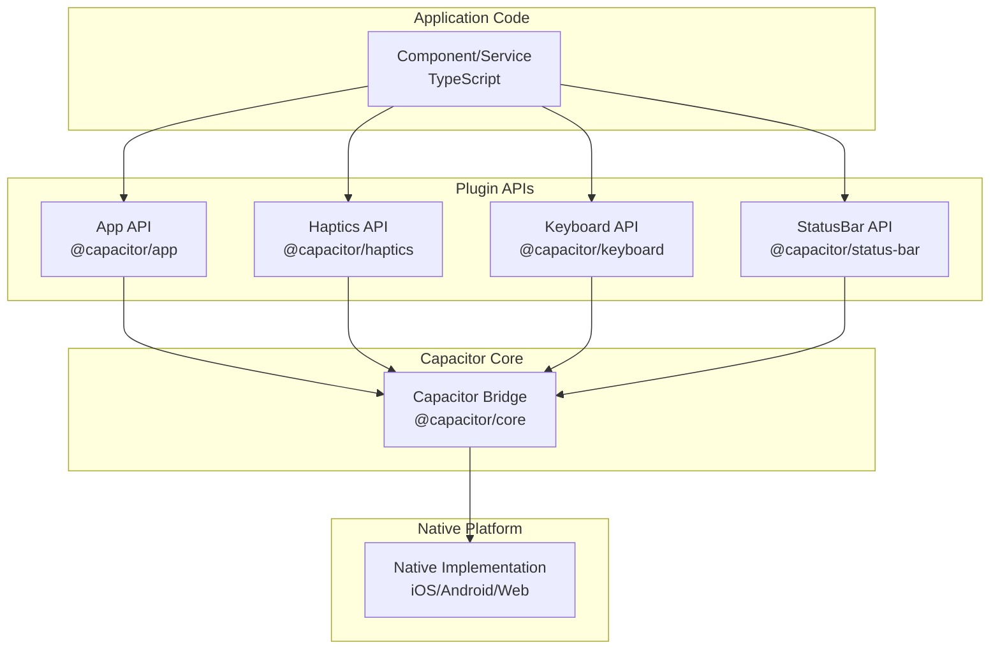
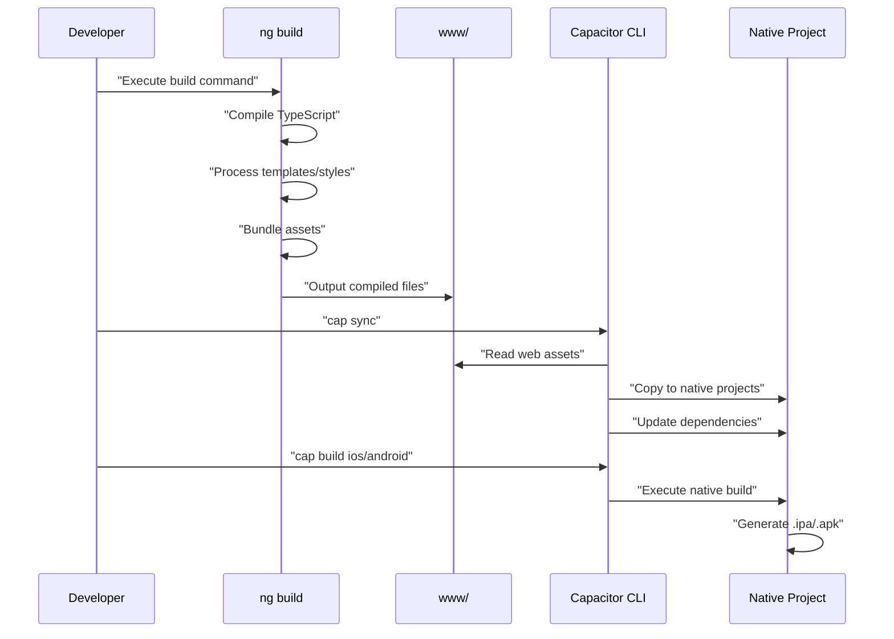
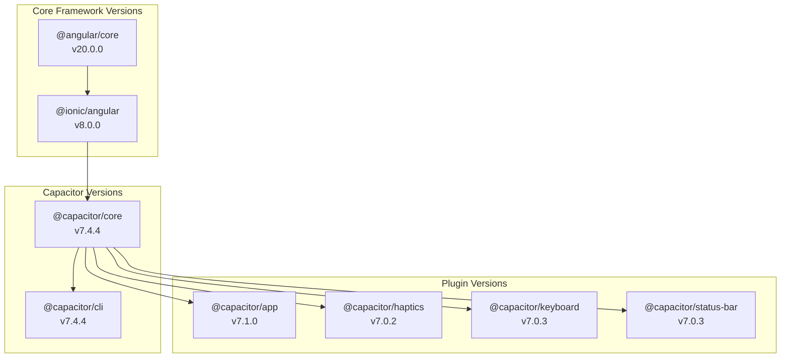

# Capacitor and Native Integration

> **Relevant source files**
> * [capacitor.config.ts](https://github.com/axchisan/MusicApp-Ionic/blob/0a2b054f/capacitor.config.ts)
> * [ionic.config.json](https://github.com/axchisan/MusicApp-Ionic/blob/0a2b054f/ionic.config.json)
> * [package.json](https://github.com/axchisan/MusicApp-Ionic/blob/0a2b054f/package.json)

## Purpose and Scope

This document describes the Capacitor native bridge configuration and integration in the MusicApp. Capacitor enables the Angular/Ionic web application to run as a native mobile application on iOS and Android, while providing access to native device features through a unified plugin API.

For information about the build process that generates Capacitor's web assets, see [Angular Build Configuration](/axchisan/MusicApp-Ionic/5.1-angular-build-configuration). For details on dependency management including Capacitor packages, see [Dependencies and Package Management](/axchisan/MusicApp-Ionic/5.2-dependencies-and-package-management).

---

## Capacitor Overview

Capacitor is a cross-platform native runtime that allows web applications to run as native iOS, Android, and Progressive Web Apps (PWAs). It provides a unified JavaScript API for accessing native device features while maintaining the application's web-based architecture.

The MusicApp uses Capacitor version 7.4.4 ([package.json L25](https://github.com/axchisan/MusicApp-Ionic/blob/0a2b054f/package.json#L25-L25)

) with several official plugins to enhance the mobile experience.

### Integration Architecture

```

```

**Sources:** [capacitor.config.ts L1-L9](https://github.com/axchisan/MusicApp-Ionic/blob/0a2b054f/capacitor.config.ts#L1-L9)

 [package.json L24-L28](https://github.com/axchisan/MusicApp-Ionic/blob/0a2b054f/package.json#L24-L28)

 [package.json L45](https://github.com/axchisan/MusicApp-Ionic/blob/0a2b054f/package.json#L45-L45)

---

## Configuration Structure

The Capacitor configuration is defined in `capacitor.config.ts`, which exports a `CapacitorConfig` object.

### Configuration Properties

| Property | Value | Purpose |
| --- | --- | --- |
| `appId` | `io.ionic.starter` | Unique identifier for the native app package |
| `appName` | `MusicApp` | Display name shown to users |
| `webDir` | `www` | Directory containing compiled web assets |

**Configuration File:**

```

```

### App Identifier

The `appId` property ([capacitor.config.ts L4](https://github.com/axchisan/MusicApp-Ionic/blob/0a2b054f/capacitor.config.ts#L4-L4)

) defines the bundle identifier for native applications:

* **iOS:** Used as the CFBundleIdentifier in Info.plist
* **Android:** Used as the applicationId in build.gradle
* **Format:** Reverse domain notation (e.g., `io.ionic.starter`)

The current value `io.ionic.starter` is the default Ionic template identifier and should be changed to a unique identifier before production deployment.

### Web Directory

The `webDir` property ([capacitor.config.ts L6](https://github.com/axchisan/MusicApp-Ionic/blob/0a2b054f/capacitor.config.ts#L6-L6)

) specifies where Capacitor reads the compiled web application. This must match the `outputPath` configured in [angular.json](/axchisan/MusicApp-Ionic/5.1-angular-build-configuration). The Angular build process outputs to `www/`, which Capacitor then packages into native applications.

**Sources:** [capacitor.config.ts L1-L9](https://github.com/axchisan/MusicApp-Ionic/blob/0a2b054f/capacitor.config.ts#L1-L9)

---

## Ionic-Capacitor Integration

The `ionic.config.json` file declares Capacitor as an active integration for the project.

```

```

This integration enables:

* Ionic CLI commands to manage Capacitor projects (`ionic cap add`, `ionic cap sync`)
* Automatic synchronization between web assets and native projects
* Live reload on physical devices during development
* Unified build and deployment workflows

**Sources:** [ionic.config.json L1-L7](https://github.com/axchisan/MusicApp-Ionic/blob/0a2b054f/ionic.config.json#L1-L7)

---

## Native Plugin Integration

The application includes four official Capacitor plugins that provide access to native device features.

### Plugin Architecture



**Sources:** [package.json L24-L28](https://github.com/axchisan/MusicApp-Ionic/blob/0a2b054f/package.json#L24-L28)

### Installed Plugins

#### @capacitor/app (v7.1.0)

Provides access to application lifecycle events and information.

**Capabilities:**

* App state changes (foreground/background)
* URL scheme handling (deep linking)
* App information retrieval
* Back button handling on Android

**Usage Pattern:**

```

```

#### @capacitor/haptics (v7.0.2)

Enables haptic feedback (vibrations) on supported devices.

**Capabilities:**

* Impact feedback (light, medium, heavy)
* Notification feedback (success, warning, error)
* Selection feedback
* Custom vibration patterns

**Usage Pattern:**

```

```

#### @capacitor/keyboard (v7.0.3)

Manages on-screen keyboard behavior and appearance.

**Capabilities:**

* Show/hide keyboard programmatically
* Keyboard height detection
* Keyboard visibility events
* Configure keyboard accessory bar

**Usage Pattern:**

```

```

#### @capacitor/status-bar (v7.0.3)

Controls the status bar appearance on mobile devices.

**Capabilities:**

* Show/hide status bar
* Change background color
* Set light/dark style
* Overlay mode configuration

**Usage Pattern:**

```

```

### Plugin Dependency Matrix

| Plugin | Version | iOS | Android | Web |
| --- | --- | --- | --- | --- |
| `@capacitor/app` | 7.1.0 | ✓ | ✓ | ✓ |
| `@capacitor/haptics` | 7.0.2 | ✓ | ✓ | ✗ |
| `@capacitor/keyboard` | 7.0.3 | ✓ | ✓ | ✗ |
| `@capacitor/status-bar` | 7.0.3 | ✓ | ✓ | ✗ |

**Sources:** [package.json L24-L28](https://github.com/axchisan/MusicApp-Ionic/blob/0a2b054f/package.json#L24-L28)

---

## Build Output and Deployment

### Web Asset Pipeline



**Sources:** [capacitor.config.ts L6](https://github.com/axchisan/MusicApp-Ionic/blob/0a2b054f/capacitor.config.ts#L6-L6)

 [angular.json (referenced)](https://github.com/axchisan/MusicApp-Ionic/blob/0a2b054f/angular.json (referenced))

### Deployment Workflow

1. **Development Build:** ``` ```
2. **Web Asset Compilation:** ``` ```
3. **Native Synchronization:** ``` ```
4. **Native Build:** ``` ```

### Directory Structure

After running `ng build` and `cap sync`, the project structure includes:

```python
MusicApp/
├── www/                    # Web assets (configured in capacitor.config.ts)
│   ├── index.html         # Entry point
│   ├── main-[hash].js     # Compiled Angular application
│   ├── styles-[hash].css  # Compiled styles
│   └── assets/            # Static resources
├── ios/                   # iOS native project (generated by cap add ios)
│   └── App/
│       └── public/        # Copied from www/
├── android/               # Android native project (generated by cap add android)
│   └── app/
│       └── src/main/assets/public/  # Copied from www/
└── capacitor.config.ts    # Defines webDir: 'www'
```

**Sources:** [capacitor.config.ts L6](https://github.com/axchisan/MusicApp-Ionic/blob/0a2b054f/capacitor.config.ts#L6-L6)

---

## Platform-Specific Considerations

### iOS Deployment

**Requirements:**

* Xcode 14+ installed
* macOS development environment
* Apple Developer account (for device testing and App Store)
* Valid provisioning profiles and certificates

**Commands:**

```

```

### Android Deployment

**Requirements:**

* Android Studio installed
* Android SDK 21+ (Android 5.0 Lollipop minimum)
* Java Development Kit (JDK) 11 or higher
* Android device or emulator for testing

**Commands:**

```

```

### Progressive Web App (PWA)

The `www/` directory can be deployed directly to a web server for PWA functionality. Capacitor plugins automatically provide fallback implementations or gracefully fail on web platforms when native features are unavailable.

**Sources:** [capacitor.config.ts L1-L9](https://github.com/axchisan/MusicApp-Ionic/blob/0a2b054f/capacitor.config.ts#L1-L9)

 [package.json L45](https://github.com/axchisan/MusicApp-Ionic/blob/0a2b054f/package.json#L45-L45)

---

## CLI Tools

The Capacitor CLI is installed as a development dependency ([package.json L45](https://github.com/axchisan/MusicApp-Ionic/blob/0a2b054f/package.json#L45-L45)

).

### Common Commands

| Command | Purpose |
| --- | --- |
| `npx cap add [platform]` | Add iOS or Android platform to project |
| `npx cap sync` | Copy web assets and sync plugins to all platforms |
| `npx cap sync [platform]` | Sync specific platform only |
| `npx cap open [platform]` | Open native IDE (Xcode or Android Studio) |
| `npx cap update` | Update Capacitor and plugins to latest compatible versions |
| `npx cap doctor` | Check environment and configuration for issues |

### Integration with npm Scripts

While not currently defined in [package.json L6-L12](https://github.com/axchisan/MusicApp-Ionic/blob/0a2b054f/package.json#L6-L12)

 Capacitor commands are typically added to npm scripts for convenience:

```

```

**Sources:** [package.json L45](https://github.com/axchisan/MusicApp-Ionic/blob/0a2b054f/package.json#L45-L45)

---

## Version Compatibility

The application uses Capacitor 7.x with Angular 20.x and Ionic 8.x. These versions are compatible and tested together.

### Dependency Versions



**All Capacitor packages share major version 7, ensuring API compatibility across core and plugins.**

**Sources:** [package.json L16-L28](https://github.com/axchisan/MusicApp-Ionic/blob/0a2b054f/package.json#L16-L28)

 [package.json L45](https://github.com/axchisan/MusicApp-Ionic/blob/0a2b054f/package.json#L45-L45)

---

## Summary

The MusicApp's Capacitor integration provides:

1. **Unified Configuration:** Single `capacitor.config.ts` file defining app identity and web asset location
2. **Native Plugins:** Four official plugins enabling app lifecycle, haptics, keyboard, and status bar control
3. **Cross-Platform Support:** Consistent API across iOS, Android, and web with platform-specific implementations
4. **Build Integration:** Seamless connection between Angular build output (`www/`) and native project synchronization
5. **Development Workflow:** CLI tools for managing native projects and keeping them synchronized with web assets

The configuration uses sensible defaults suitable for development, though the `appId` should be customized before production deployment.

**Sources:** [capacitor.config.ts L1-L9](https://github.com/axchisan/MusicApp-Ionic/blob/0a2b054f/capacitor.config.ts#L1-L9)

 [ionic.config.json L1-L7](https://github.com/axchisan/MusicApp-Ionic/blob/0a2b054f/ionic.config.json#L1-L7)

 [package.json L24-L45](https://github.com/axchisan/MusicApp-Ionic/blob/0a2b054f/package.json#L24-L45)