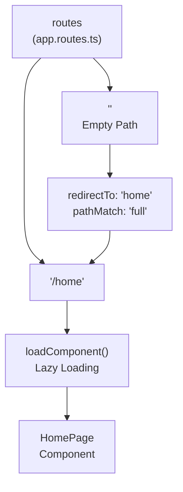
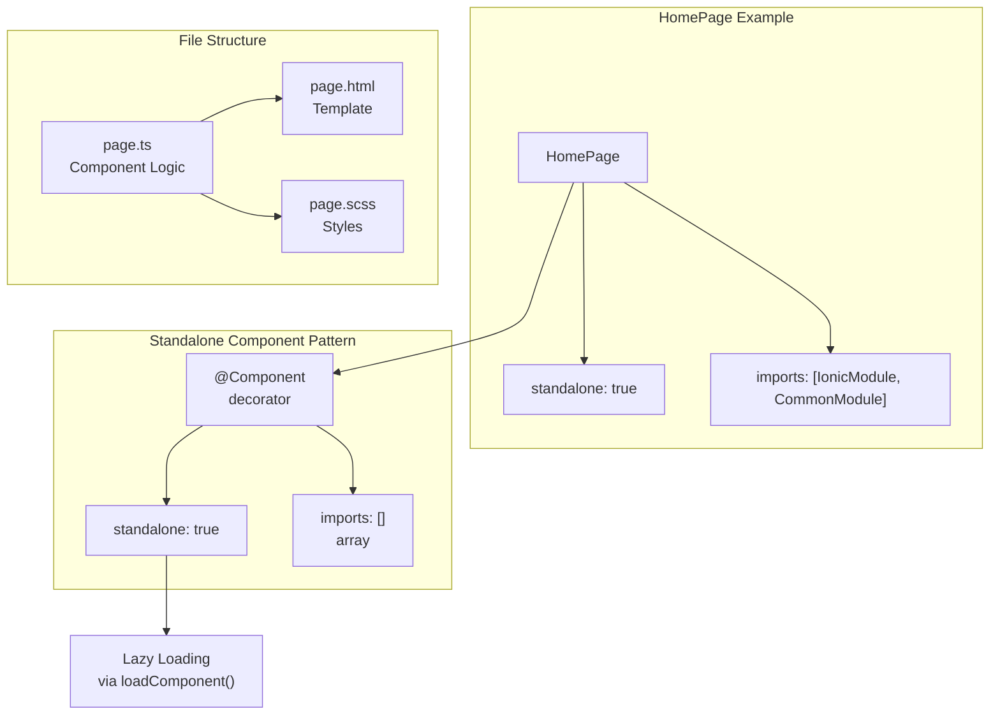
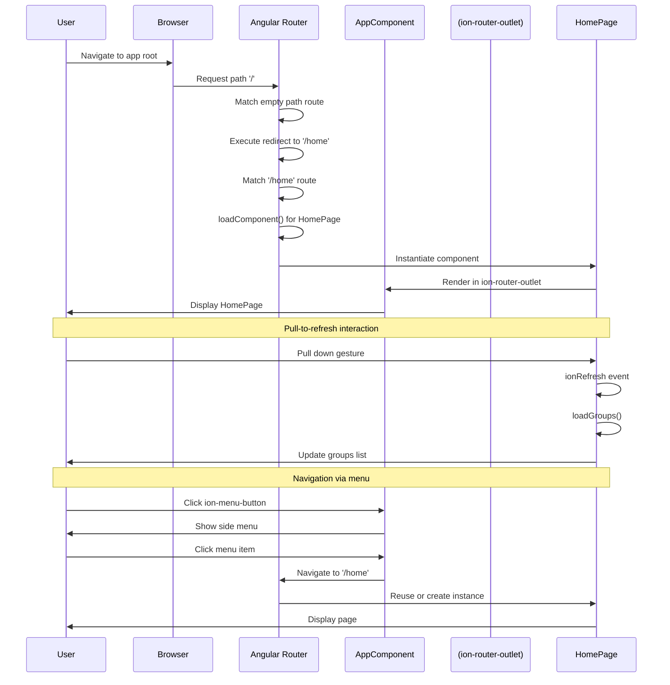
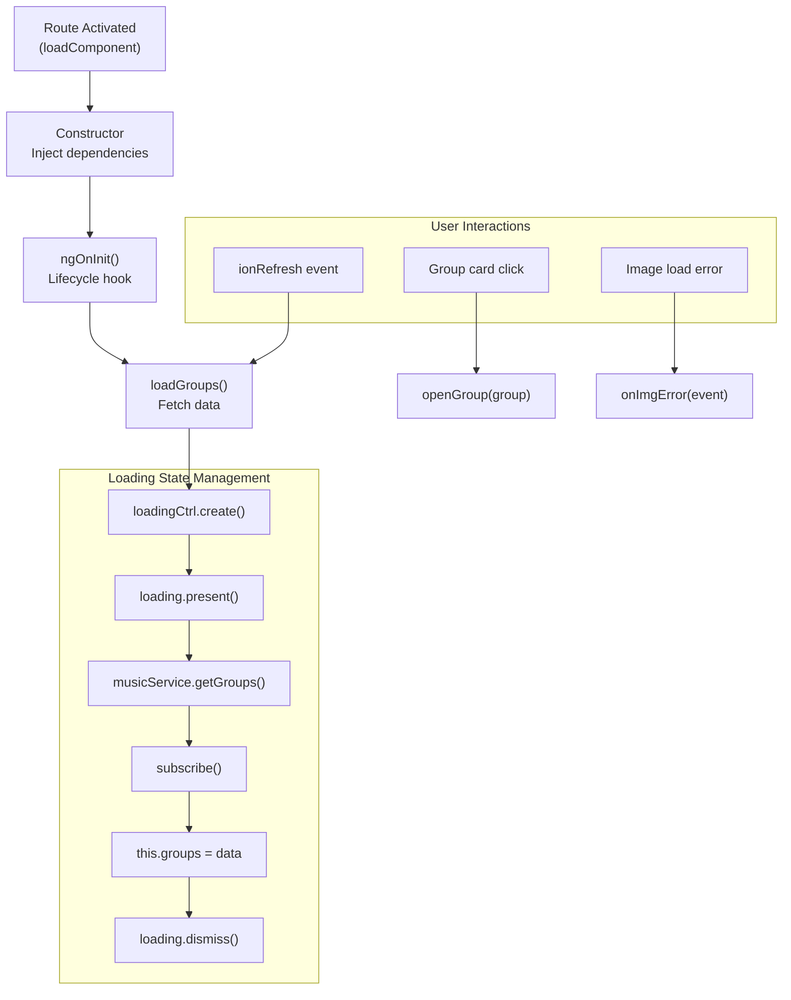

# Features and Pages

> **Relevant source files**
> * [src/app/app.routes.ts](https://github.com/axchisan/MusicApp-Ionic/blob/0a2b054f/src/app/app.routes.ts)
> * [src/app/home/home.page.html](https://github.com/axchisan/MusicApp-Ionic/blob/0a2b054f/src/app/home/home.page.html)
> * [src/app/home/home.page.ts](https://github.com/axchisan/MusicApp-Ionic/blob/0a2b054f/src/app/home/home.page.ts)

## Purpose and Scope

This document provides an overview of the application's feature modules and user-facing pages. It describes the current page structure, routing configuration, and how features are organized as standalone Angular components within the Ionic framework.

For detailed information about the home page implementation, see [Home Page - Groups List](/axchisan/MusicApp-Ionic/3.1-home-page-groups-list). For routing mechanics and navigation patterns, see [Routing and Navigation](/axchisan/MusicApp-Ionic/2.3-routing-and-navigation). For the application shell that hosts these pages, see [Application Shell](/axchisan/MusicApp-Ionic/2.2-application-shell).

---

## Application Structure

The MusicApp currently implements a single-page application structure with one primary feature page. The application follows a modular architecture where each page is implemented as a standalone Angular component, enabling lazy loading and independent feature development.

The application uses Angular's routing system to manage page navigation, with all routes defined in a central configuration file. Each page component is self-contained with its own template, styles, and business logic, following Angular's component-based architecture principles.

**Sources:** [src/app/app.routes.ts L1-L14](https://github.com/axchisan/MusicApp-Ionic/blob/0a2b054f/src/app/app.routes.ts#L1-L14)

---

## Route Configuration

The application's routing configuration defines the navigation structure and page loading strategy:

**Route Configuration Details**

The routing system consists of two route definitions in [src/app/app.routes.ts L3-L13](https://github.com/axchisan/MusicApp-Ionic/blob/0a2b054f/src/app/app.routes.ts#L3-L13)

:

| Route Path | Component | Loading Strategy | Purpose |
| --- | --- | --- | --- |
| `''` (empty) | N/A | Redirect | Default route that redirects to `/home` |
| `/home` | `HomePage` | Lazy loaded via `loadComponent()` | Main groups list page |

The empty path route [src/app/app.routes.ts L8-L12](https://github.com/axchisan/MusicApp-Ionic/blob/0a2b054f/src/app/app.routes.ts#L8-L12)

 uses `pathMatch: 'full'` to ensure exact matching and redirects to the home route. The home route [src/app/app.routes.ts L4-L7](https://github.com/axchisan/MusicApp-Ionic/blob/0a2b054f/src/app/app.routes.ts#L4-L7)

 uses dynamic import with `loadComponent()` to implement lazy loading, loading the `HomePage` component only when the route is accessed.

**Sources:** [src/app/app.routes.ts L1-L14](https://github.com/axchisan/MusicApp-Ionic/blob/0a2b054f/src/app/app.routes.ts#L1-L14)

---

## Current Pages

### Overview Table

| Page Name | Route | Component Class | Template | Styles |
| --- | --- | --- | --- | --- |
| Groups List | `/home` | `HomePage` | `home.page.html` | `home.page.scss` |

### HomePage - Groups List

The `HomePage` serves as the primary interface for displaying music groups. This standalone component is located at [src/app/home/home.page.ts L8-L14](https://github.com/axchisan/MusicApp-Ionic/blob/0a2b054f/src/app/home/home.page.ts#L8-L14)

 and implements the following features:

**Key Features:**

* Displays a scrollable list of music group cards
* Shows loading indicator during data fetch
* Implements pull-to-refresh functionality
* Handles empty state when no groups are available
* Provides group card interaction handlers

**Component Structure:**

```mermaid
flowchart TD

HomePageTS["HomePage<br>home.page.ts"]
HomePageHTML["Template<br>home.page.html"]
HomePageSCSS["Styles<br>home.page.scss"]
IonicModule["IonicModule"]
CommonModule["CommonModule"]
MusicService["MusicService"]
LoadingController["LoadingController"]
GroupsArray["groups: Group[]"]
LoadingState["loading: any"]
NgOnInit["ngOnInit()"]
LoadGroups["loadGroups()"]
OpenGroup["openGroup(group)"]
OnImgError["onImgError(event)"]

HomePageTS --> HomePageHTML
HomePageTS --> HomePageSCSS
HomePageTS --> IonicModule
HomePageTS --> CommonModule
HomePageTS --> MusicService
HomePageTS --> LoadingController
HomePageTS --> GroupsArray
HomePageTS --> LoadingState
HomePageTS --> NgOnInit
HomePageTS --> LoadGroups
HomePageTS --> OpenGroup
HomePageTS --> OnImgError

subgraph subGraph2 ["Lifecycle & Methods"]
    NgOnInit
    LoadGroups
    OpenGroup
    OnImgError
end

subgraph subGraph1 ["Data Flow"]
    GroupsArray
    LoadingState
end

subgraph subGraph0 ["Component Dependencies"]
    IonicModule
    CommonModule
    MusicService
    LoadingController
end
```

**Component Properties:**

* `groups: Group[]` [src/app/home/home.page.ts L23](https://github.com/axchisan/MusicApp-Ionic/blob/0a2b054f/src/app/home/home.page.ts#L23-L23)  - Array holding the list of music groups
* `loading: any` [src/app/home/home.page.ts L24](https://github.com/axchisan/MusicApp-Ionic/blob/0a2b054f/src/app/home/home.page.ts#L24-L24)  - Reference to the loading indicator

**Component Methods:**

* `ngOnInit()` [src/app/home/home.page.ts L31-L33](https://github.com/axchisan/MusicApp-Ionic/blob/0a2b054f/src/app/home/home.page.ts#L31-L33)  - Lifecycle hook that triggers initial data load
* `loadGroups()` [src/app/home/home.page.ts L35-L51](https://github.com/axchisan/MusicApp-Ionic/blob/0a2b054f/src/app/home/home.page.ts#L35-L51)  - Fetches group data from `MusicService`
* `openGroup(group: Group)` [src/app/home/home.page.ts L16-L18](https://github.com/axchisan/MusicApp-Ionic/blob/0a2b054f/src/app/home/home.page.ts#L16-L18)  - Handles group card click events
* `onImgError($event: ErrorEvent)` [src/app/home/home.page.ts L19-L21](https://github.com/axchisan/MusicApp-Ionic/blob/0a2b054f/src/app/home/home.page.ts#L19-L21)  - Handles image loading errors

For detailed documentation of the `HomePage` implementation, user interactions, and template structure, see [Home Page - Groups List](/axchisan/MusicApp-Ionic/3.1-home-page-groups-list).

**Sources:** [src/app/home/home.page.ts L1-L52](https://github.com/axchisan/MusicApp-Ionic/blob/0a2b054f/src/app/home/home.page.ts#L1-L52)

 [src/app/home/home.page.html L1-L38](https://github.com/axchisan/MusicApp-Ionic/blob/0a2b054f/src/app/home/home.page.html#L1-L38)

---

## Feature Organization Pattern

The application uses Angular's **standalone component** architecture, eliminating the need for NgModule declarations. Each page is a self-contained feature with its own dependencies explicitly declared.

**Key Characteristics:**

1. **Self-contained Dependencies:** Each component declares its own imports [src/app/home/home.page.ts L13](https://github.com/axchisan/MusicApp-Ionic/blob/0a2b054f/src/app/home/home.page.ts#L13-L13)  including framework modules like `IonicModule` and `CommonModule`
2. **Lazy Loading Ready:** The `standalone: true` flag [src/app/home/home.page.ts L12](https://github.com/axchisan/MusicApp-Ionic/blob/0a2b054f/src/app/home/home.page.ts#L12-L12)  enables the component to be lazy loaded using `loadComponent()` in the route configuration
3. **Organized File Structure:** Each page follows the convention: * `*.page.ts` - Component class and logic * `*.page.html` - HTML template * `*.page.scss` - Scoped styles
4. **Service Injection:** Services like `MusicService` and `LoadingController` are injected via constructor [src/app/home/home.page.ts L26-L29](https://github.com/axchisan/MusicApp-Ionic/blob/0a2b054f/src/app/home/home.page.ts#L26-L29)

**Sources:** [src/app/home/home.page.ts L8-L14](https://github.com/axchisan/MusicApp-Ionic/blob/0a2b054f/src/app/home/home.page.ts#L8-L14)

 [src/app/app.routes.ts L5-L7](https://github.com/axchisan/MusicApp-Ionic/blob/0a2b054f/src/app/app.routes.ts#L5-L7)

---

## Navigation Patterns

The application implements standard Ionic navigation patterns within the Angular Router framework:

**Navigation Entry Points:**

1. **Direct URL Access:** Users accessing the root URL (`/`) are automatically redirected to `/home` [src/app/app.routes.ts L9-L12](https://github.com/axchisan/MusicApp-Ionic/blob/0a2b054f/src/app/app.routes.ts#L9-L12)
2. **Side Menu Navigation:** The menu button in the page header [src/app/home/home.page.html L3-L5](https://github.com/axchisan/MusicApp-Ionic/blob/0a2b054f/src/app/home/home.page.html#L3-L5)  opens the application side menu, which contains navigation links
3. **Pull-to-Refresh:** The `ion-refresher` component [src/app/home/home.page.html L12-L14](https://github.com/axchisan/MusicApp-Ionic/blob/0a2b054f/src/app/home/home.page.html#L12-L14)  triggers the `loadGroups()` method to refresh page data without navigation
4. **Programmatic Navigation:** Components can inject Angular's `Router` service to navigate programmatically (not currently used but available)

**Sources:** [src/app/app.routes.ts L1-L14](https://github.com/axchisan/MusicApp-Ionic/blob/0a2b054f/src/app/app.routes.ts#L1-L14)

 [src/app/home/home.page.html L1-L38](https://github.com/axchisan/MusicApp-Ionic/blob/0a2b054f/src/app/home/home.page.html#L1-L38)

---

## Page Lifecycle and Data Flow

Each page follows Angular's component lifecycle with Ionic enhancements:

**Lifecycle Sequence:**

1. **Component Instantiation:** When the route is activated, Angular instantiates the component class via constructor [src/app/home/home.page.ts L26-L29](https://github.com/axchisan/MusicApp-Ionic/blob/0a2b054f/src/app/home/home.page.ts#L26-L29)
2. **Dependency Injection:** Required services (`MusicService`, `LoadingController`) are injected
3. **Initialization:** The `ngOnInit()` hook [src/app/home/home.page.ts L31-L33](https://github.com/axchisan/MusicApp-Ionic/blob/0a2b054f/src/app/home/home.page.ts#L31-L33)  is called, triggering `loadGroups()`
4. **Data Loading:** The `loadGroups()` method [src/app/home/home.page.ts L35-L51](https://github.com/axchisan/MusicApp-Ionic/blob/0a2b054f/src/app/home/home.page.ts#L35-L51) : * Creates and presents a loading indicator [src/app/home/home.page.ts L36-L39](https://github.com/axchisan/MusicApp-Ionic/blob/0a2b054f/src/app/home/home.page.ts#L36-L39) * Calls `musicService.getGroups()` [src/app/home/home.page.ts L41](https://github.com/axchisan/MusicApp-Ionic/blob/0a2b054f/src/app/home/home.page.ts#L41-L41) * Subscribes to the Observable [src/app/home/home.page.ts L41-L50](https://github.com/axchisan/MusicApp-Ionic/blob/0a2b054f/src/app/home/home.page.ts#L41-L50) * Updates the `groups` array [src/app/home/home.page.ts L43](https://github.com/axchisan/MusicApp-Ionic/blob/0a2b054f/src/app/home/home.page.ts#L43-L43) * Dismisses the loading indicator [src/app/home/home.page.ts L44](https://github.com/axchisan/MusicApp-Ionic/blob/0a2b054f/src/app/home/home.page.ts#L44-L44)
5. **Rendering:** Angular's change detection updates the template with the loaded data

**Sources:** [src/app/home/home.page.ts L26-L51](https://github.com/axchisan/MusicApp-Ionic/blob/0a2b054f/src/app/home/home.page.ts#L26-L51)

---

## Future Extensibility

The current architecture supports easy addition of new feature pages:

**Adding a New Page:**

1. Create page component files following the naming convention (e.g., `detail.page.ts`, `detail.page.html`, `detail.page.scss`)
2. Configure the component as standalone with required imports
3. Add a route entry in [src/app/app.routes.ts L3-L13](https://github.com/axchisan/MusicApp-Ionic/blob/0a2b054f/src/app/app.routes.ts#L3-L13)  with lazy loading
4. Add navigation links in the side menu or from existing pages

**Example Future Pages:**

| Potential Page | Route | Purpose |
| --- | --- | --- |
| Group Detail | `/group/:id` | Display detailed information about a specific music group |
| Favorites | `/favorites` | List of user's favorite groups |
| Search | `/search` | Search functionality for finding groups |
| Settings | `/settings` | Application preferences and configuration |

The standalone component pattern and lazy loading strategy ensure that new pages can be added without modifying existing features or increasing the initial bundle size.

**Sources:** [src/app/app.routes.ts L1-L14](https://github.com/axchisan/MusicApp-Ionic/blob/0a2b054f/src/app/app.routes.ts#L1-L14)

 [src/app/home/home.page.ts L8-L14](https://github.com/axchisan/MusicApp-Ionic/blob/0a2b054f/src/app/home/home.page.ts#L8-L14)