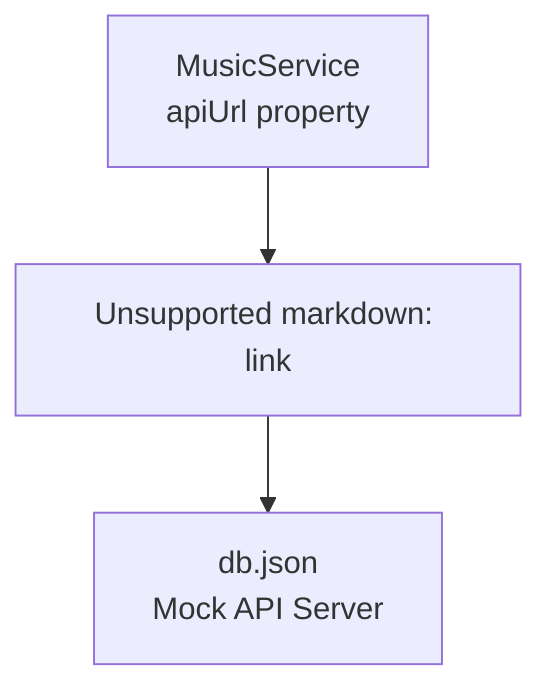
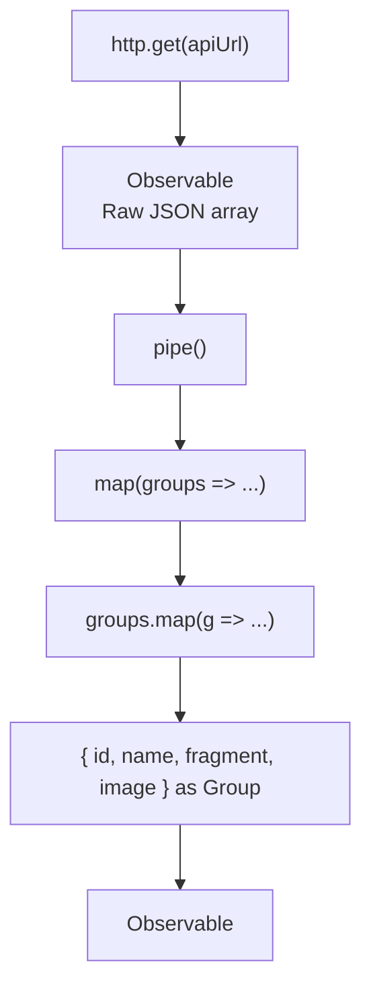
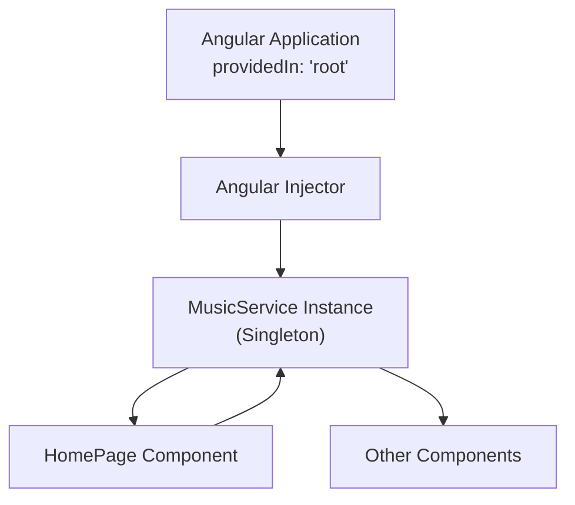

# Music Service

> **Relevant source files**
> * [db.json](https://github.com/axchisan/MusicApp-Ionic/blob/0a2b054f/db.json)
> * [src/app/models/group.model.ts](https://github.com/axchisan/MusicApp-Ionic/blob/0a2b054f/src/app/models/group.model.ts)
> * [src/app/services/music.service.ts](https://github.com/axchisan/MusicApp-Ionic/blob/0a2b054f/src/app/services/music.service.ts)

## Purpose and Scope

The `MusicService` is the primary data access service responsible for retrieving music group data from the mock API backend. This service encapsulates all HTTP communication logic, implements reactive data streams using RxJS Observables, and provides type-safe data transformation from raw API responses to structured `Group` model objects.

This document covers the service implementation, HTTP client integration, and data transformation pipeline. For information about the `Group` model structure, see [Data Models](/axchisan/MusicApp-Ionic/4.1-data-models). For details about the mock API backend, see [Mock API and Development Data](/axchisan/MusicApp-Ionic/4.3-mock-api-and-development-data). For information about how the service is consumed by UI components, see [Home Page - Groups List](/axchisan/MusicApp-Ionic/3.1-home-page-groups-list).

**Sources:** [src/app/services/music.service.ts L1-L26](https://github.com/axchisan/MusicApp-Ionic/blob/0a2b054f/src/app/services/music.service.ts#L1-L26)

---

## Service Architecture

The `MusicService` is an Angular injectable service configured with `providedIn: 'root'`, making it a singleton available throughout the application without requiring explicit registration in any module's providers array. This root-level registration ensures that all components sharing the service access the same instance, maintaining consistent state and reducing memory overhead.

### Service Class Structure

```

```

**Sources:** [src/app/services/music.service.ts L7-L14](https://github.com/axchisan/MusicApp-Ionic/blob/0a2b054f/src/app/services/music.service.ts#L7-L14)

### Injectable Configuration

| Property | Value | Purpose |
| --- | --- | --- |
| Decorator | `@Injectable` | Marks class as available for dependency injection |
| `providedIn` | `'root'` | Registers service at application root level (singleton) |
| Constructor Injection | `HttpClient` | Receives Angular's HTTP client for API communication |

The service declares a private property `apiUrl` set to `'http://localhost:3000/groups'`, which defines the mock API endpoint. This hardcoded URL is suitable for development but would typically be moved to environment configuration files for production deployments.

**Sources:** [src/app/services/music.service.ts L7-L12](https://github.com/axchisan/MusicApp-Ionic/blob/0a2b054f/src/app/services/music.service.ts#L7-L12)

---

## HTTP Communication

The `MusicService` leverages Angular's `HttpClient` to perform HTTP GET requests to the mock API. The `HttpClient` is injected through the constructor and provides a reactive, Observable-based API for asynchronous HTTP operations.

### API Endpoint Configuration



**Sources:** [src/app/services/music.service.ts L12](https://github.com/axchisan/MusicApp-Ionic/blob/0a2b054f/src/app/services/music.service.ts#L12-L12)

 [db.json L1-L64](https://github.com/axchisan/MusicApp-Ionic/blob/0a2b054f/db.json#L1-L64)

### HTTP GET Request Implementation

The `getGroups()` method initiates the HTTP communication:

```

```

This method performs the following steps:

1. Invokes `this.http.get<any[]>(this.apiUrl)` to request data from the API
2. Receives an Observable stream of the raw API response
3. Applies RxJS transformation operators via the `pipe()` method
4. Returns the transformed Observable to the caller

The generic type parameter `<any[]>` in the `http.get()` call indicates that the initial response is treated as an array of untyped objects. This decision provides flexibility for subsequent transformation while acknowledging that the API response structure may not perfectly match the `Group` interface.

**Sources:** [src/app/services/music.service.ts L16-L25](https://github.com/axchisan/MusicApp-Ionic/blob/0a2b054f/src/app/services/music.service.ts#L16-L25)

---

## Data Transformation Pipeline

The service implements a data transformation pipeline using RxJS operators to convert raw API responses into type-safe `Group` objects. This approach ensures that consuming components always receive properly structured data conforming to the application's type system.

### Transformation Flow



**Sources:** [src/app/services/music.service.ts L17-L24](https://github.com/axchisan/MusicApp-Ionic/blob/0a2b054f/src/app/services/music.service.ts#L17-L24)

### RxJS Map Operator Implementation

The transformation uses a nested mapping strategy:

**Outer Map (Line 18):** Operates on the entire array response

```

```

**Inner Map (Line 18):** Transforms each individual group object

```

```

This double-map pattern serves two purposes:

1. **Array transformation:** The outer `map` operator from RxJS transforms the Observable stream
2. **Object mapping:** The inner `map` method on the JavaScript array restructures each object

### Type Assertion

The transformation concludes with a TypeScript type assertion `as Group`, which informs the compiler that the resulting object structure conforms to the `Group` interface. This assertion is safe because the mapping explicitly assigns all required properties from the source object.

| Source Property | Target Property | Type |
| --- | --- | --- |
| `g.id` | `id` | `number` |
| `g.name` | `name` | `string` |
| `g.fragment` | `fragment` | `string` |
| `g.image` | `image` | `string` |

**Sources:** [src/app/services/music.service.ts L18-L23](https://github.com/axchisan/MusicApp-Ionic/blob/0a2b054f/src/app/services/music.service.ts#L18-L23)

 [src/app/models/group.model.ts L1-L6](https://github.com/axchisan/MusicApp-Ionic/blob/0a2b054f/src/app/models/group.model.ts#L1-L6)

---

## Observable Pattern Implementation

The `MusicService` returns an `Observable<Group[]>` rather than directly returning data or using Promises. This design choice aligns with Angular's reactive programming paradigm and provides several advantages:

### Observable Characteristics

```

```

**Sources:** [src/app/services/music.service.ts L16-L25](https://github.com/axchisan/MusicApp-Ionic/blob/0a2b054f/src/app/services/music.service.ts#L16-L25)

### Observable Benefits

| Benefit | Implementation Detail |
| --- | --- |
| **Lazy Execution** | HTTP request not sent until subscription occurs |
| **Cancellation** | Unsubscribing cancels in-flight HTTP requests |
| **Operator Composition** | `pipe()` allows chaining transformations (map, filter, etc.) |
| **Error Handling** | Error propagation through Observable stream |
| **Multiple Subscribers** | Each subscription triggers a new HTTP request (cold Observable) |

### Cold Observable Behavior

The Observable returned by `getGroups()` is a "cold" Observable, meaning each subscription triggers a new HTTP GET request. If multiple components subscribe simultaneously, multiple requests are sent to the API. For applications requiring shared data streams, this behavior could be modified using operators like `shareReplay()`.

**Sources:** [src/app/services/music.service.ts L16-L17](https://github.com/axchisan/MusicApp-Ionic/blob/0a2b054f/src/app/services/music.service.ts#L16-L17)

---

## Integration with Components

The `MusicService` is consumed by UI components through Angular's dependency injection system. Components declare the service as a constructor parameter, and Angular automatically provides the singleton instance.

### Injection Pattern



**Sources:** [src/app/services/music.service.ts L7-L8](https://github.com/axchisan/MusicApp-Ionic/blob/0a2b054f/src/app/services/music.service.ts#L7-L8)

### Typical Component Usage Pattern

Components follow this pattern when consuming the service:

1. **Injection:** Service injected via constructor
2. **Invocation:** Call `getGroups()` method (typically in `ngOnInit()`)
3. **Subscription:** Subscribe to the returned Observable
4. **Data Assignment:** Assign emitted data to component property
5. **Template Binding:** Template renders data using Angular bindings

### Data Flow Example

```

```

**Sources:** [src/app/services/music.service.ts L1-L26](https://github.com/axchisan/MusicApp-Ionic/blob/0a2b054f/src/app/services/music.service.ts#L1-L26)

---

## Error Handling Considerations

The current `MusicService` implementation does not include explicit error handling logic. HTTP requests can fail for various reasons (network issues, server errors, malformed responses), and these errors propagate through the Observable stream to subscribers.

### Error Propagation Behavior

When an HTTP error occurs:

1. The `HttpClient` catches the error and converts it to an Observable error
2. The error passes through the `pipe()` without being caught
3. The error is emitted to the subscriber's error callback
4. The Observable completes in an error state

### Current Error Handling Gap

| Error Type | Current Behavior | Recommended Enhancement |
| --- | --- | --- |
| Network Failure | Error propagates to component | Add `catchError` operator |
| 404 Not Found | Error propagates to component | Add retry logic |
| Timeout | Error propagates to component | Add timeout operator |
| Malformed JSON | Error propagates to component | Add data validation |
| CORS Issues | Error propagates to component | Document backend requirements |

### Potential Enhancement Location

Error handling operators would be added to the `pipe()` chain in [src/app/services/music.service.ts L17](https://github.com/axchisan/MusicApp-Ionic/blob/0a2b054f/src/app/services/music.service.ts#L17-L17)

:

```

```

Components consuming the service should implement error callbacks in their subscriptions to handle these propagated errors gracefully.

**Sources:** [src/app/services/music.service.ts L16-L25](https://github.com/axchisan/MusicApp-Ionic/blob/0a2b054f/src/app/services/music.service.ts#L16-L25)

---

## Service Dependencies

The following table summarizes the dependencies and relationships of the `MusicService`:

| Dependency | Type | Purpose | Import Path |
| --- | --- | --- | --- |
| `Injectable` | Angular Decorator | Enables dependency injection | `@angular/core` |
| `HttpClient` | Angular Service | Performs HTTP requests | `@angular/common/http` |
| `Observable` | RxJS Class | Reactive data stream | `rxjs` |
| `map` | RxJS Operator | Data transformation | `rxjs` |
| `Group` | Application Interface | Type definition for group objects | `../models/group.model` |

**Sources:** [src/app/services/music.service.ts L1-L5](https://github.com/axchisan/MusicApp-Ionic/blob/0a2b054f/src/app/services/music.service.ts#L1-L5)

---

## API Contract

The service expects the API endpoint at `http://localhost:3000/groups` to return a JSON array with the following structure:

### Expected Response Format

```

```

### Sample Response Data

The mock API in [db.json L2-L63](https://github.com/axchisan/MusicApp-Ionic/blob/0a2b054f/db.json#L2-L63)

 provides 10 music groups matching this structure. Each group object contains:

* **id:** Unique numeric identifier
* **name:** Group or artist name (e.g., "Queen", "The Beatles")
* **fragment:** Brief description text
* **image:** URL to album cover or group photo (Wikipedia URLs)

### Response Validation

The service currently assumes all response data conforms to the expected structure. Missing or additional properties in the API response are silently handled by the mapping function, which only extracts the four specified properties (`id`, `name`, `fragment`, `image`).

**Sources:** [db.json L1-L64](https://github.com/axchisan/MusicApp-Ionic/blob/0a2b054f/db.json#L1-L64)

 [src/app/services/music.service.ts L18-L23](https://github.com/axchisan/MusicApp-Ionic/blob/0a2b054f/src/app/services/music.service.ts#L18-L23)