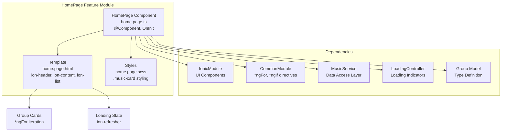
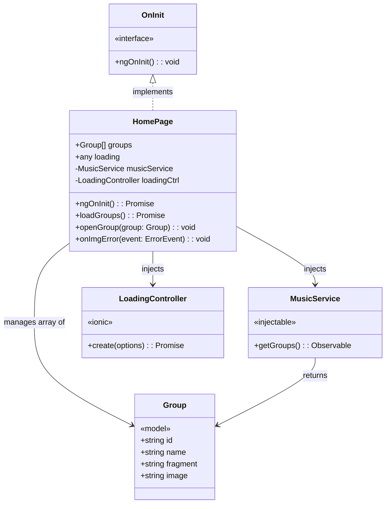
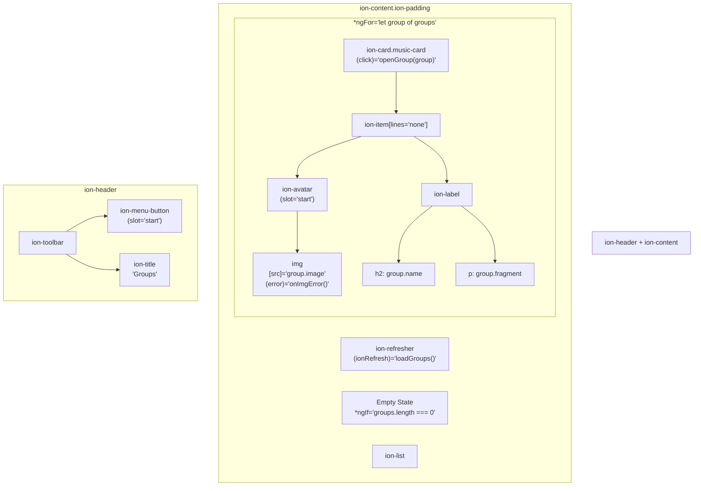
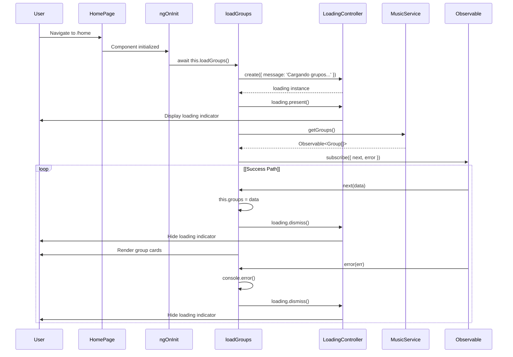
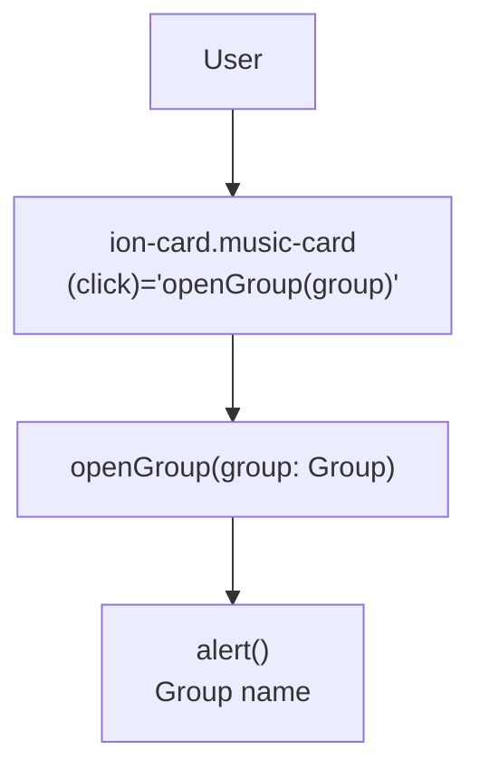
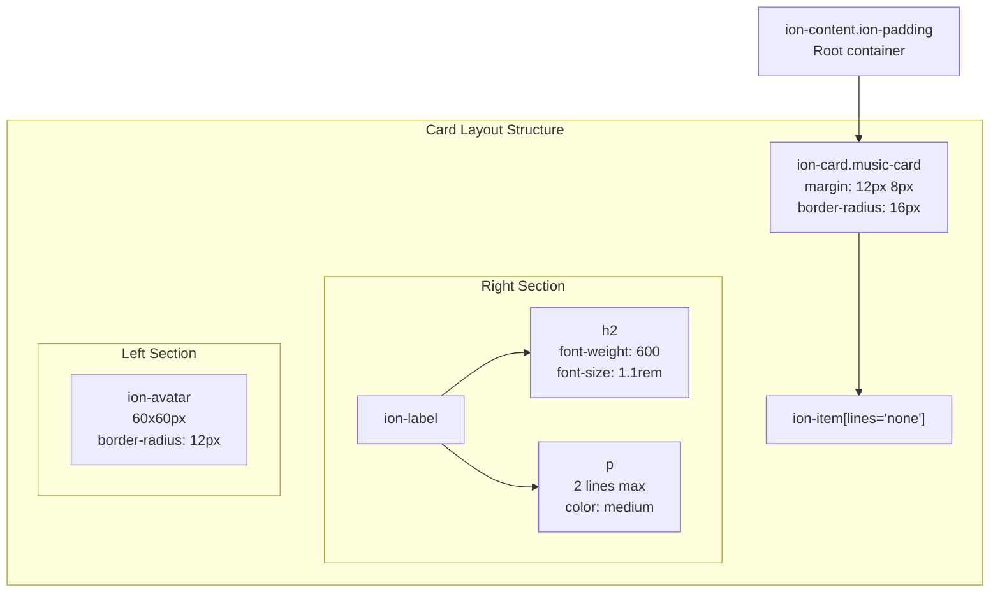
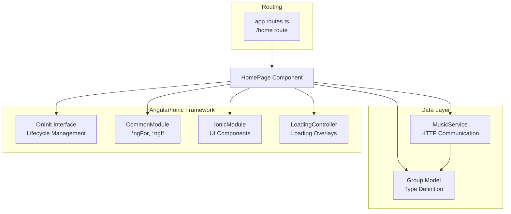

# Página de inicio - Lista de grupos

> **Archivos fuente relevantes**
> * [src/app/home/home.page.html](https://github.com/axchisan/MusicApp-Ionic/blob/0a2b054f/src/app/home/home.page.html)
> * [src/app/home/home.page.scss](https://github.com/axchisan/MusicApp-Ionic/blob/0a2b054f/src/app/home/home.page.scss)
> * [src/app/home/home.page.ts](https://github.com/axchisan/MusicApp-Ionic/blob/0a2b054f/src/app/home/home.page.ts)

## Propósito y alcance

Este documento describe el `HomePage`componente, que sirve como punto de entrada principal y ruta predeterminada de la aplicación MusicApp. La página de inicio muestra una lista desplegable de grupos de música, cada uno representado como una tarjeta interactiva que muestra el avatar, el nombre y un fragmento de descripción del grupo. Esta página muestra la obtención de datos de `MusicService`, la gestión del estado de carga, la funcionalidad de extracción para actualizar y los patrones básicos de interacción del usuario.

Para obtener información sobre la configuración de enrutamiento que carga esta página, consulte [Enrutamiento y navegación](/axchisan/MusicApp-Ionic/2.3-routing-and-navigation) . Para obtener más información sobre la `MusicService`integración de API, consulte [Servicio de música](/axchisan/MusicApp-Ionic/4.2-music-service) . Para conocer la `Group`estructura del modelo, consulte [Modelos de datos](/axchisan/MusicApp-Ionic/4.1-data-models) .

**Fuentes:** [src/app/home/home.page.ts L1-L52](https://github.com/axchisan/MusicApp-Ionic/blob/0a2b054f/src/app/home/home.page.ts#L1-L52)

---

## Descripción general de los componentes

Este `HomePage`es un componente Angular independiente que sigue el patrón de estructura de página de Ionic. Consta de tres archivos principales que trabajan juntos para ofrecer una funcionalidad completa.



**Metadatos del componente**

| Propiedad | Valor | Ubicación |
| --- | --- | --- |
| Selector | `app-home` | [src/app/home/home.page.ts L9](https://github.com/axchisan/MusicApp-Ionic/blob/0a2b054f/src/app/home/home.page.ts#L9-L9) |
| Plantilla | `home.page.html` | [src/app/home/home.page.ts L10](https://github.com/axchisan/MusicApp-Ionic/blob/0a2b054f/src/app/home/home.page.ts#L10-L10) |
| Estilos | `home.page.scss` | [src/app/home/home.page.ts L11](https://github.com/axchisan/MusicApp-Ionic/blob/0a2b054f/src/app/home/home.page.ts#L11-L11) |
| Tipo | Componente independiente | [src/app/home/home.page.ts L12](https://github.com/axchisan/MusicApp-Ionic/blob/0a2b054f/src/app/home/home.page.ts#L12-L12) |
| Importaciones | `IonicModule`,`CommonModule` | [src/app/home/home.page.ts L13](https://github.com/axchisan/MusicApp-Ionic/blob/0a2b054f/src/app/home/home.page.ts#L13-L13) |

**Fuentes:** [src/app/home/home.page.ts L8-L14](https://github.com/axchisan/MusicApp-Ionic/blob/0a2b054f/src/app/home/home.page.ts#L8-L14)

---

## Arquitectura de componentes

La `HomePage`clase implementa el `OnInit`gancho del ciclo de vida y administra los datos del grupo a través de la inyección de dependencia.



**Propiedades de clase**

| Propiedad | Tipo | Acceso | Objetivo | Ubicación |
| --- | --- | --- | --- | --- |
| `groups` | `Group[]` | público | Las tiendas trajeron grupos de música | [src/app/home/home.page.ts L23](https://github.com/axchisan/MusicApp-Ionic/blob/0a2b054f/src/app/home/home.page.ts#L23-L23) |
| `loading` | `any` | público | Referencia al indicador de carga | [src/app/home/home.page.ts L24](https://github.com/axchisan/MusicApp-Ionic/blob/0a2b054f/src/app/home/home.page.ts#L24-L24) |
| `musicService` | `MusicService` | privado | Servicio de obtención de datos | [src/app/home/home.page.ts L27](https://github.com/axchisan/MusicApp-Ionic/blob/0a2b054f/src/app/home/home.page.ts#L27-L27) |
| `loadingCtrl` | `LoadingController` | privado | Controlador para cargar la interfaz de usuario | [src/app/home/home.page.ts L28](https://github.com/axchisan/MusicApp-Ionic/blob/0a2b054f/src/app/home/home.page.ts#L28-L28) |

**Métodos**

| Método | Parámetros | Tipo de retorno | Objetivo | Ubicación |
| --- | --- | --- | --- | --- |
| `ngOnInit` | ninguno | `Promise<void>` | Gancho de ciclo de vida que activa la carga inicial de datos | [src/app/home/home.page.ts L31-L33](https://github.com/axchisan/MusicApp-Ionic/blob/0a2b054f/src/app/home/home.page.ts#L31-L33) |
| `loadGroups` | ninguno | `Promise<void>` | Obtiene grupos y administra el estado de carga | [src/app/home/home.page.ts L35-L51](https://github.com/axchisan/MusicApp-Ionic/blob/0a2b054f/src/app/home/home.page.ts#L35-L51) |
| `openGroup` | `group: Group` | `void` | Controlador para clics en tarjetas de grupo | [src/app/home/home.page.ts L16-L18](https://github.com/axchisan/MusicApp-Ionic/blob/0a2b054f/src/app/home/home.page.ts#L16-L18) |
| `onImgError` | `event: ErrorEvent` | `void` | Controlador de errores de carga de imágenes | [src/app/home/home.page.ts L19-L21](https://github.com/axchisan/MusicApp-Ionic/blob/0a2b054f/src/app/home/home.page.ts#L19-L21) |

**Fuentes:** [src/app/home/home.page.ts L15-L52](https://github.com/axchisan/MusicApp-Ionic/blob/0a2b054f/src/app/home/home.page.ts#L15-L52)

---

## Estructura de la plantilla

La plantilla sigue el diseño de página estándar de Ionic con un encabezado, un área de contenido y una lista de tarjetas incorporada.



**Secciones de plantilla**

### Sección de encabezado

* **Ubicación:** [src/app/home/home.page.html L1-L8](https://github.com/axchisan/MusicApp-Ionic/blob/0a2b054f/src/app/home/home.page.html#L1-L8)
* **Componentes:** `ion-header` , `ion-toolbar`, `ion-menu-button`,`ion-title`
* **Propósito:** Muestra el título de la página "Grupos" y proporciona acceso al menú lateral

### Sección de contenido

* **Ubicación:** [src/app/home/home.page.html L10-L38](https://github.com/axchisan/MusicApp-Ionic/blob/0a2b054f/src/app/home/home.page.html#L10-L38)
* **Elemento raíz:** `ion-content` con `ion-padding`clase
* **Características principales:** Extraer para actualizar, manejo de estado vacío, lista desplazable

### Tirar para actualizar

* **Ubicación:** [src/app/home/home.page.html L12-L14](https://github.com/axchisan/MusicApp-Ionic/blob/0a2b054f/src/app/home/home.page.html#L12-L14)
* **Componente:** `ion-refresher` con`slot="fixed"`
* **Vinculación de eventos:** `(ionRefresh)="loadGroups()"`
* **Propósito:** Permite a los usuarios actualizar manualmente los datos del grupo

### Estado vacío

* **Ubicación:** [src/app/home/home.page.html L16-L18](https://github.com/axchisan/MusicApp-Ionic/blob/0a2b054f/src/app/home/home.page.html#L16-L18)
* **Condición:** `*ngIf="groups.length === 0 && !loading"`
* **Message:** "No hay grupos disponibles."

### Group Cards List

* **Location:** [src/app/home/home.page.html L20-L36](https://github.com/axchisan/MusicApp-Ionic/blob/0a2b054f/src/app/home/home.page.html#L20-L36)
* **Container:** `ion-list`
* **Iteration:** `*ngFor="let group of groups"`
* **Card Structure:** * `ion-card` with class `music-card` and `button` attribute * Click handler: `(click)="openGroup(group)"` * Contains `ion-item` with `lines="none"` * Avatar image with error handler: `(error)="onImgError($event)"` * Group name displayed in `h2`: `{{ group.name }}` * Group description in `p`: `{{ group.fragment }}`

**Sources:** [src/app/home/home.page.html L1-L38](https://github.com/axchisan/MusicApp-Ionic/blob/0a2b054f/src/app/home/home.page.html#L1-L38)

---

## Data Loading Flow

The `HomePage` implements a comprehensive data loading pattern with user feedback and error handling.



### Loading Flow Details

**Step 1: Initialization** ([src/app/home/home.page.ts L31-L33](https://github.com/axchisan/MusicApp-Ionic/blob/0a2b054f/src/app/home/home.page.ts#L31-L33)

)

* `ngOnInit()` lifecycle hook is invoked when component initializes
* Immediately calls `await this.loadGroups()` to fetch data

**Step 2: Loading Indicator** ([src/app/home/home.page.ts L36-L39](https://github.com/axchisan/MusicApp-Ionic/blob/0a2b054f/src/app/home/home.page.ts#L36-L39)

)

* Creates loading overlay with message "Cargando grupos..."
* Presents loading indicator to user before making HTTP request
* Uses Ionic's `LoadingController` for consistent UI

**Step 3: Data Fetching** ([src/app/home/home.page.ts L41](https://github.com/axchisan/MusicApp-Ionic/blob/0a2b054f/src/app/home/home.page.ts#L41-L41)

)

* Calls `this.musicService.getGroups()` which returns an `Observable<Group[]>`
* Observable pattern allows for reactive data handling

**Step 4: Subscription Handling** ([src/app/home/home.page.ts L41-L50](https://github.com/axchisan/MusicApp-Ionic/blob/0a2b054f/src/app/home/home.page.ts#L41-L50)

)

* Subscribes to observable with success and error callbacks
* **Success callback**: Assigns data to `this.groups` array, dismisses loading
* **Error callback**: Logs error to console, dismisses loading

**Pull-to-Refresh Variant**

* Same `loadGroups()` method is reused for pull-to-refresh
* Triggered by user pulling down on content area
* Event binding: [src/app/home/home.page.html L12](https://github.com/axchisan/MusicApp-Ionic/blob/0a2b054f/src/app/home/home.page.html#L12-L12)

**Sources:** [src/app/home/home.page.ts L31-L51](https://github.com/axchisan/MusicApp-Ionic/blob/0a2b054f/src/app/home/home.page.ts#L31-L51)

 [src/app/home/home.page.html L12-L14](https://github.com/axchisan/MusicApp-Ionic/blob/0a2b054f/src/app/home/home.page.html#L12-L14)

---

## User Interactions

The HomePage provides two primary user interaction patterns.

### Group Card Selection



**Click Handler Implementation**

* **Location:** [src/app/home/home.page.ts L16-L18](https://github.com/axchisan/MusicApp-Ionic/blob/0a2b054f/src/app/home/home.page.ts#L16-L18)
* **Method:** `openGroup(group: Group)`
* **Current Behavior:** Displays browser alert with group name
* **Alert Message:** `"Abriendo detalles de: ${group.name}"`
* **Note:** This is a placeholder implementation; production code would navigate to detail page

**Card Interaction Features**

* Cards have `button` attribute for accessibility [src/app/home/home.page.html L21](https://github.com/axchisan/MusicApp-Ionic/blob/0a2b054f/src/app/home/home.page.html#L21-L21)
* Visual feedback on press through CSS transform [src/app/home/home.page.scss L35-L37](https://github.com/axchisan/MusicApp-Ionic/blob/0a2b054f/src/app/home/home.page.scss#L35-L37)
* Entire card area is clickable for better UX

### Image Error Handling

**Error Handler Implementation**

* **Location:** [src/app/home/home.page.ts L19-L21](https://github.com/axchisan/MusicApp-Ionic/blob/0a2b054f/src/app/home/home.page.ts#L19-L21)
* **Method:** `onImgError($event: ErrorEvent)`
* **Template Binding:** [src/app/home/home.page.html L27](https://github.com/axchisan/MusicApp-Ionic/blob/0a2b054f/src/app/home/home.page.html#L27-L27)
* **Current Behavior:** Throws error (stub implementation)
* **Purpose:** Provides hook for fallback image or error UI

### Pull-to-Refresh

**Implementation**

* **Component:** `ion-refresher` [src/app/home/home.page.html L12-L14](https://github.com/axchisan/MusicApp-Ionic/blob/0a2b054f/src/app/home/home.page.html#L12-L14)
* **Event:** `(ionRefresh)="loadGroups()"`
* **Behavior:** Reloads group data when user pulls down on content
* **Note:** Refresher automatically completes when data load finishes

**Sources:** [src/app/home/home.page.ts L16-L21](https://github.com/axchisan/MusicApp-Ionic/blob/0a2b054f/src/app/home/home.page.ts#L16-L21)

 [src/app/home/home.page.html L12-L14](https://github.com/axchisan/MusicApp-Ionic/blob/0a2b054f/src/app/home/home.page.html#L12-L14)

 [src/app/home/home.page.html L21](https://github.com/axchisan/MusicApp-Ionic/blob/0a2b054f/src/app/home/home.page.html#L21-L21)

 [src/app/home/home.page.html L27](https://github.com/axchisan/MusicApp-Ionic/blob/0a2b054f/src/app/home/home.page.html#L27-L27)

---

## Styling and Visual Design

The HomePage uses custom SCSS to create visually appealing, modern music cards with smooth interactions.

### Music Card Styling

The `.music-card` class defines the visual appearance of each group card.

**Card Container** ([src/app/home/home.page.scss L28-L37](https://github.com/axchisan/MusicApp-Ionic/blob/0a2b054f/src/app/home/home.page.scss#L28-L37)

)

| Property | Value | Purpose |
| --- | --- | --- |
| `margin` | `12px 8px` | Spacing between cards |
| `border-radius` | `16px` | Rounded corners for modern look |
| `overflow` | `hidden` | Clips content to rounded border |
| `box-shadow` | `0 4px 12px rgba(0, 0, 0, 0.1)` | Subtle elevation effect |
| `transition` | `transform 0.2s, box-shadow 0.2s` | Smooth animation on interaction |

**Active State Animation** ([src/app/home/home.page.scss L35-L37](https://github.com/axchisan/MusicApp-Ionic/blob/0a2b054f/src/app/home/home.page.scss#L35-L37)

)

```

```

Provides tactile feedback by slightly shrinking card on press.

**Avatar Styling** ([src/app/home/home.page.scss L39-L47](https://github.com/axchisan/MusicApp-Ionic/blob/0a2b054f/src/app/home/home.page.scss#L39-L47)

)

| Property | Value | Purpose |
| --- | --- | --- |
| `margin` | `8px` | Space around avatar |
| `width` | `60px` | Fixed avatar size |
| `height` | `60px` | Square aspect ratio |
| `object-fit` | `cover` | Maintains image aspect ratio |
| `border-radius` | `12px` | Rounded corners (not circular) |

**Label Content** ([src/app/home/home.page.scss L49-L64](https://github.com/axchisan/MusicApp-Ionic/blob/0a2b054f/src/app/home/home.page.scss#L49-L64)

)

**Group Name (`h2`):**

* Font weight: `600` (semi-bold)
* Font size: `1.1rem`
* Margin: `0 0 4px 0` (small bottom spacing)

**Description Fragment (`p`):**

* Font size: `0.9rem`
* Color: `var(--ion-color-medium)` (theme-aware)
* Text truncation: 2 lines using webkit line clamp
* Properties for ellipsis: * `display: -webkit-box` * `-webkit-line-clamp: 2` * `-webkit-box-orient: vertical` * `overflow: hidden`

### Layout Structure



**Legacy Container Styles**
The stylesheet also contains unused container styles ([src/app/home/home.page.scss L1-L27](https://github.com/axchisan/MusicApp-Ionic/blob/0a2b054f/src/app/home/home.page.scss#L1-L27)

) that appear to be from the default Ionic page template. These center content vertically but are not applied to any elements in the current template.

**Sources:** [src/app/home/home.page.scss L28-L64](https://github.com/axchisan/MusicApp-Ionic/blob/0a2b054f/src/app/home/home.page.scss#L28-L64)

---

## Empty State and Error Handling

The HomePage implements conditional rendering for different application states.

### Empty State Display

**Condition:** [src/app/home/home.page.html L16-L18](https://github.com/axchisan/MusicApp-Ionic/blob/0a2b054f/src/app/home/home.page.html#L16-L18)

```

```

**Logic:**

* Only displays when `groups` array is empty AND not currently loading
* Uses `ion-text-center` for centered text alignment
* Message: "No hay grupos disponibles." (Spanish: "No groups available")

### Error Handling in Data Loading

**Error Callback:** [src/app/home/home.page.ts L46-L49](https://github.com/axchisan/MusicApp-Ionic/blob/0a2b054f/src/app/home/home.page.ts#L46-L49)

```

```

**Behavior:**

* Logs error to browser console with message "Error cargando grupos"
* Dismisses loading indicator so UI doesn't remain in loading state
* Does not display error message to user (console only)
* Does not prevent empty state message from showing if `groups` array is empty

### Image Loading Errors

**Handler Stub:** [src/app/home/home.page.ts L19-L21](https://github.com/axchisan/MusicApp-Ionic/blob/0a2b054f/src/app/home/home.page.ts#L19-L21)

```

```

**Current State:**

* Method signature exists but is not implemented
* Template binds to this handler: [src/app/home/home.page.html L27](https://github.com/axchisan/MusicApp-Ionic/blob/0a2b054f/src/app/home/home.page.html#L27-L27)
* Currently throws error if image fails to load
* **Recommended Implementation:** Set fallback image or hide avatar

### State Management Summary

| State | Condition | UI Display | Location |
| --- | --- | --- | --- |
| Loading | `loading` indicator active | "Cargando grupos..." overlay | [src/app/home/home.page.ts L36-L39](https://github.com/axchisan/MusicApp-Ionic/blob/0a2b054f/src/app/home/home.page.ts#L36-L39) |
| Empty | `groups.length === 0 && !loading` | "No hay grupos disponibles." | [src/app/home/home.page.html L16-L18](https://github.com/axchisan/MusicApp-Ionic/blob/0a2b054f/src/app/home/home.page.html#L16-L18) |
| Success | `groups.length > 0` | List of group cards | [src/app/home/home.page.html L20-L36](https://github.com/axchisan/MusicApp-Ionic/blob/0a2b054f/src/app/home/home.page.html#L20-L36) |
| Error | HTTP request fails | Console error, empty state | [src/app/home/home.page.ts L46-L49](https://github.com/axchisan/MusicApp-Ionic/blob/0a2b054f/src/app/home/home.page.ts#L46-L49) |
| Image Error | Image fails to load | Throws error (unhandled) | [src/app/home/home.page.ts L19-L21](https://github.com/axchisan/MusicApp-Ionic/blob/0a2b054f/src/app/home/home.page.ts#L19-L21) |

**Sources:** [src/app/home/home.page.ts L19-L21](https://github.com/axchisan/MusicApp-Ionic/blob/0a2b054f/src/app/home/home.page.ts#L19-L21)

 [src/app/home/home.page.ts L46-L49](https://github.com/axchisan/MusicApp-Ionic/blob/0a2b054f/src/app/home/home.page.ts#L46-L49)

 [src/app/home/home.page.html L16-L18](https://github.com/axchisan/MusicApp-Ionic/blob/0a2b054f/src/app/home/home.page.html#L16-L18)

---

## Component Integration Points

The HomePage integrates with multiple application subsystems.



**Framework Dependencies**

* **OnInit:** Lifecycle hook for initialization logic
* **CommonModule:** Required for `*ngFor` and `*ngIf` directives in template
* **IonicModule:** Provides all `ion-*` components used in template
* **LoadingController:** Injectable service for creating loading overlays

**Data Layer Dependencies**

* **MusicService:** Primary data source, injected via constructor [src/app/home/home.page.ts L27](https://github.com/axchisan/MusicApp-Ionic/blob/0a2b054f/src/app/home/home.page.ts#L27-L27)
* **Group Model:** TypeScript interface for type safety [src/app/home/home.page.ts L5](https://github.com/axchisan/MusicApp-Ionic/blob/0a2b054f/src/app/home/home.page.ts#L5-L5)

**Routing Integration**

* Cargado mediante carga diferida en la configuración de enrutamiento (ver [Enrutamiento y navegación](/axchisan/MusicApp-Ionic/2.3-routing-and-navigation) )
* La ruta predeterminada redirecciona a`/home`
* Accesible a través de la navegación del menú lateral

**Fuentes:** [src/app/home/home.page.ts L2-L14](https://github.com/axchisan/MusicApp-Ionic/blob/0a2b054f/src/app/home/home.page.ts#L2-L14)

 [src/app/home/home.page.ts L26-L29](https://github.com/axchisan/MusicApp-Ionic/blob/0a2b054f/src/app/home/home.page.ts#L26-L29)

---

## Resumen

El `HomePage`componente funciona como la página de inicio principal de MusicApp, implementando una interfaz clara y basada en listas para explorar grupos musicales. Las decisiones arquitectónicas clave incluyen:

1. **Arquitectura de componentes independientes:** utiliza el patrón de componentes independientes de Angular con importaciones explícitas[src/app/home/home.page.ts L12-L13](https://github.com/axchisan/MusicApp-Ionic/blob/0a2b054f/src/app/home/home.page.ts#L12-L13)
2. **Carga reactiva de datos:** aprovecha los observables de RxJS para la obtención asincrónica de datos[src/app/home/home.page.ts L41-L50](https://github.com/axchisan/MusicApp-Ionic/blob/0a2b054f/src/app/home/home.page.ts#L41-L50)
3. **Comentarios del usuario:** proporciona indicadores de carga durante la obtención de datos y la funcionalidad de extracción para actualizar[src/app/home/home.page.html L12-L14](https://github.com/axchisan/MusicApp-Ionic/blob/0a2b054f/src/app/home/home.page.html#L12-L14)
4. **Visual Polish:** Custom SCSS crea diseños de tarjetas modernos e interactivos con animaciones fluidas[src/app/home/home.page.scss L28-L64](https://github.com/axchisan/MusicApp-Ionic/blob/0a2b054f/src/app/home/home.page.scss#L28-L64)
5. **Interfaz de usuario defensiva:** gestiona los estados vacíos con elegancia y mensajes fáciles de usar.[src/app/home/home.page.html L16-L18](https://github.com/axchisan/MusicApp-Ionic/blob/0a2b054f/src/app/home/home.page.html#L16-L18)

El componente sigue las mejores prácticas de Ionic/Angular, con una clara separación de las preocupaciones entre plantilla, lógica y estilos. Las mejoras futuras podrían incluir la implementación del `onImgError`controlador con imágenes de respaldo y la sustitución del método basado en alertas `openGroup`por una navegación adecuada a una página de detalles.