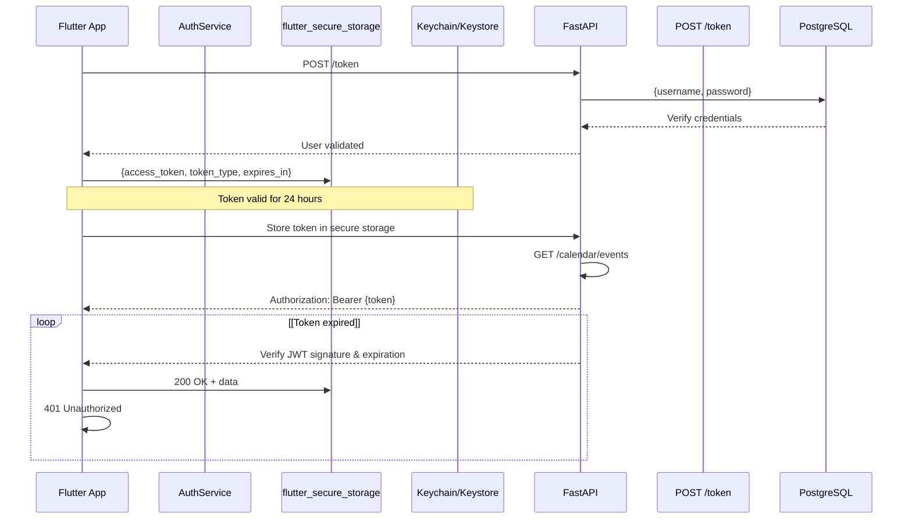
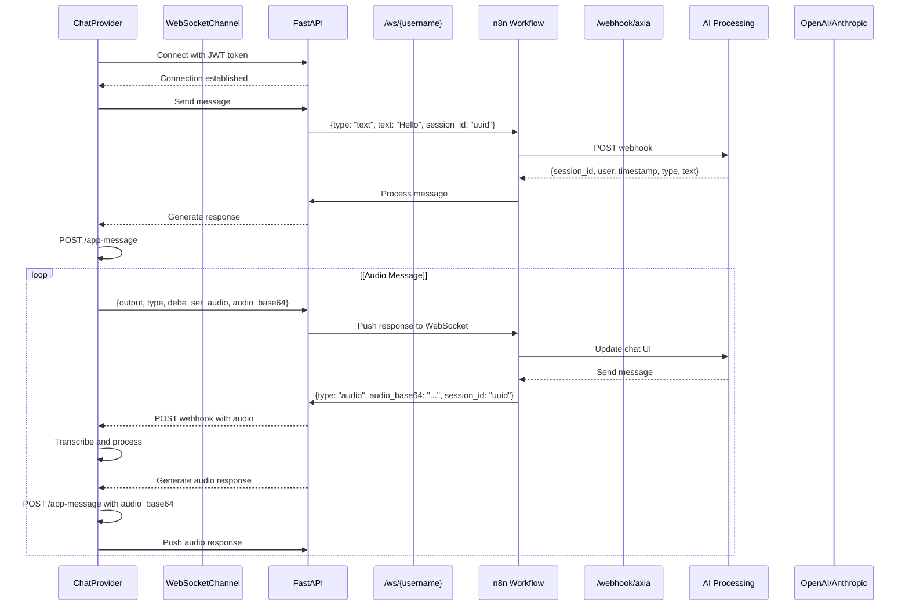

# API Reference

> **Relevant source files**
> * [ARCHITECTURE.md](https://github.com/axchisan/AxIA/blob/1fe26c44/ARCHITECTURE.md)

This document provides complete reference documentation for the AxIA API, covering both REST HTTP endpoints and WebSocket real-time communication protocols. The API is implemented using FastAPI and serves as the communication layer between the Flutter mobile application and the n8n workflow engine.

For detailed information about specific topics, see:

* REST endpoint specifications → [REST Endpoints](/axchisan/AxIA/8.1-rest-endpoints)
* WebSocket connection and message protocol → [WebSocket Protocol](/axchisan/AxIA/8.2-websocket-protocol)
* JSON message schemas and data structures → [Message Data Structures](/axchisan/AxIA/8.3-message-data-structures)
* Authentication implementation details → [Authentication & Security](/axchisan/AxIA/4-authentication-and-security)

## API Architecture

The AxIA API follows a three-tier architecture where FastAPI acts as an authenticated gateway between the mobile client and AI processing backend.

**Diagram: API System Architecture**

```

```

**Sources:** [ARCHITECTURE.md L1-L241](https://github.com/axchisan/AxIA/blob/1fe26c44/ARCHITECTURE.md#L1-L241)

## Authentication Overview

All API endpoints except `/token` and `/health` require JWT authentication. The authentication flow uses Bearer tokens for REST endpoints and query parameter tokens for WebSocket connections.

**Diagram: Authentication Flow**



**Sources:** [ARCHITECTURE.md L3-L15](https://github.com/axchisan/AxIA/blob/1fe26c44/ARCHITECTURE.md#L3-L15)

 [ARCHITECTURE.md L119-L129](https://github.com/axchisan/AxIA/blob/1fe26c44/ARCHITECTURE.md#L119-L129)

## REST API Endpoints

The following table summarizes all REST endpoints exposed by the FastAPI backend:

| Endpoint | Method | Auth Required | Purpose | Request Body | Response |
| --- | --- | --- | --- | --- | --- |
| `/token` | POST | No | Obtain JWT token | `{username, password}` | `{access_token, token_type, expires_in}` |
| `/health` | GET | No | Health check | None | `{status, timestamp}` |
| `/calendar/events` | GET | Yes (Bearer) | Retrieve calendar events | None | `List[CalendarEvent]` |
| `/tasks` | GET | Yes (Bearer) | Retrieve user tasks | None | `List[Task]` |
| `/tasks` | POST | Yes (Bearer) | Create new task | `{title, description, due_date}` | `Task` |
| `/messages/{session_id}` | GET | Yes (Bearer) | Retrieve chat history | None | `List[Message]` |
| `/send-message` | POST | No | Send message (alternative) | `{text, audio_base64, type}` | `{session_id, output, type, timestamp}` |
| `/app-message` | POST | No | Receive n8n response | `{output, type, debe_ser_audio, audio_base64}` | Webhook callback |

**Sources:** [ARCHITECTURE.md L54-L89](https://github.com/axchisan/AxIA/blob/1fe26c44/ARCHITECTURE.md#L54-L89)

### Authentication Endpoint

**POST /token**

Authenticates user credentials and returns a JWT access token with 24-hour expiration.

```

```

The returned `access_token` must be included in subsequent requests using the `Authorization: Bearer {token}` header or as a query parameter for WebSocket connections.

**Sources:** [ARCHITECTURE.md L57-L59](https://github.com/axchisan/AxIA/blob/1fe26c44/ARCHITECTURE.md#L57-L59)

### Calendar Endpoints

**GET /calendar/events**

Retrieves calendar events for the authenticated user.

```

```

**Sources:** [ARCHITECTURE.md L70-L72](https://github.com/axchisan/AxIA/blob/1fe26c44/ARCHITECTURE.md#L70-L72)

### Tasks Endpoints

**GET /tasks**

Retrieves all tasks for the authenticated user.

```

```

**POST /tasks**

Creates a new task for the authenticated user.

```

```

**Sources:** [ARCHITECTURE.md L74-L81](https://github.com/axchisan/AxIA/blob/1fe26c44/ARCHITECTURE.md#L74-L81)

### Messages Endpoints

**GET /messages/{session_id}**

Retrieves message history for a specific chat session.

```

```

**Sources:** [ARCHITECTURE.md L83-L85](https://github.com/axchisan/AxIA/blob/1fe26c44/ARCHITECTURE.md#L83-L85)

### Health Check

**GET /health**

Returns system health status. Does not require authentication.

```

```

**Sources:** [ARCHITECTURE.md L87-L88](https://github.com/axchisan/AxIA/blob/1fe26c44/ARCHITECTURE.md#L87-L88)

## WebSocket Protocol

The WebSocket endpoint provides bidirectional real-time communication for chat functionality. Unlike REST endpoints, the WebSocket uses query parameter authentication.

**WebSocket /ws/{username}?token={jwt_token}**

**Connection URL Format:**

```yaml
wss://apiaxia.axchisan.com/ws/duvan?token=eyJhbGciOiJIUzI1NiIsInR5cCI6IkpXVCJ9...
```

**Diagram: WebSocket Message Flow**



**Sources:** [ARCHITECTURE.md L17-L33](https://github.com/axchisan/AxIA/blob/1fe26c44/ARCHITECTURE.md#L17-L33)

 [ARCHITECTURE.md L61-L64](https://github.com/axchisan/AxIA/blob/1fe26c44/ARCHITECTURE.md#L61-L64)

### WebSocket Message Format

**Text Message (Client → Server):**

```

```

**Audio Message (Client → Server):**

```

```

**Response Message (Server → Client):**

```

```

**Audio Response Message (Server → Client):**

```

```

**Sources:** [ARCHITECTURE.md L61-L64](https://github.com/axchisan/AxIA/blob/1fe26c44/ARCHITECTURE.md#L61-L64)

 [ARCHITECTURE.md L110-L117](https://github.com/axchisan/AxIA/blob/1fe26c44/ARCHITECTURE.md#L110-L117)

## n8n Webhook Integration

The FastAPI backend forwards WebSocket messages to n8n for AI processing. The n8n workflow must respond by calling back to the `/app-message` endpoint.

**n8n Webhook URL:**

```yaml
http://n8n:5678/webhook/axia
```

**Payload to n8n (from FastAPI):**

```

```

**Expected Response from n8n (via POST /app-message):**

```

```

The `debe_ser_audio` field indicates whether the Flutter client should automatically play the audio response. When `true`, the client uses the `just_audio` player to immediately render the audio.

**Sources:** [ARCHITECTURE.md L91-L117](https://github.com/axchisan/AxIA/blob/1fe26c44/ARCHITECTURE.md#L91-L117)

## Error Handling

### HTTP Status Codes

| Status Code | Meaning | Common Causes |
| --- | --- | --- |
| 200 | OK | Request successful |
| 401 | Unauthorized | Missing, invalid, or expired JWT token |
| 403 | Forbidden | Valid token but insufficient permissions |
| 404 | Not Found | Resource does not exist |
| 422 | Unprocessable Entity | Invalid request body format |
| 500 | Internal Server Error | Backend processing failure |

### WebSocket Error Handling

**Connection Errors:**

* `onError` event triggers in `ChatProvider`
* Red reconnection banner displayed in `ChatScreen`
* User can manually trigger `reconnect()` method

**Token Expiration:**

```

```

The client must:

1. Clear token from `flutter_secure_storage`
2. Close WebSocket connection
3. Redirect user to `LoginScreen`

**Sources:** [ARCHITECTURE.md L131-L145](https://github.com/axchisan/AxIA/blob/1fe26c44/ARCHITECTURE.md#L131-L145)

## Rate Limiting and Quotas

Currently, the API does not implement rate limiting. However, WebSocket connections are limited to one active connection per user. Attempting to establish multiple concurrent connections will close existing connections.

## API Versioning

The current API is unversioned. All endpoints use the base URL without a version prefix:

```
https://apiaxia.axchisan.com/{endpoint}
```

Future API versions will use the format:

```
https://apiaxia.axchisan.com/v2/{endpoint}
```

## Environment Configuration

API configuration is managed through environment variables and hardcoded constants.

**Backend (.env):**

```

```

**Flutter (ApiConfig):**

```

```

**Sources:** [ARCHITECTURE.md L212-L225](https://github.com/axchisan/AxIA/blob/1fe26c44/ARCHITECTURE.md#L212-L225)

## Security Considerations

### Token Security

* JWT tokens expire after 24 hours
* Tokens stored in platform-specific secure storage (iOS Keychain, Android Keystore)
* No automatic token refresh; users must re-authenticate on expiration

### Transport Security

* All HTTP traffic uses HTTPS/TLS
* WebSocket connections use WSS (WebSocket Secure)
* CORS configured for production environment

### Password Security

* Passwords hashed using bcrypt before database storage
* Plain-text passwords never logged or stored

**Sources:** [ARCHITECTURE.md L227-L233](https://github.com/axchisan/AxIA/blob/1fe26c44/ARCHITECTURE.md#L227-L233)

## Performance Characteristics

* **WebSocket Latency:** Average 50-200ms for message round-trip
* **REST Latency:** Average 100-300ms for authenticated requests
* **Connection Reuse:** WebSocket maintained as singleton in `ChatProvider`
* **Message Caching:** Chat history cached locally using Hive database
* **Lazy Loading:** ListView.builder used for efficient message rendering

**Sources:** [ARCHITECTURE.md L235-L240](https://github.com/axchisan/AxIA/blob/1fe26c44/ARCHITECTURE.md#L235-L240)

---

For implementation details and code examples, see the subsections:

* [REST Endpoints](/axchisan/AxIA/8.1-rest-endpoints) - Detailed REST API specifications
* [WebSocket Protocol](/axchisan/AxIA/8.2-websocket-protocol) - WebSocket connection lifecycle and protocol details
* [Message Data Structures](/axchisan/AxIA/8.3-message-data-structures) - Complete JSON schemas and data models