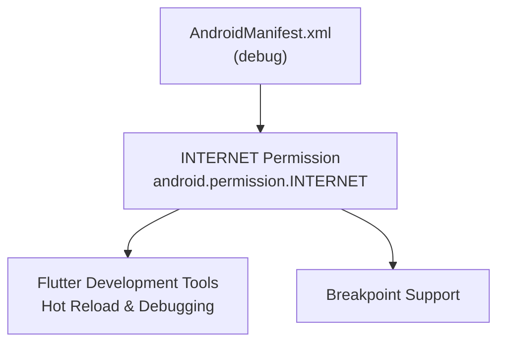
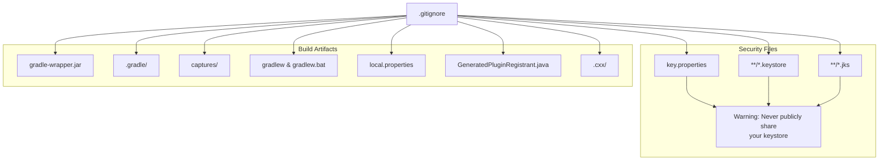
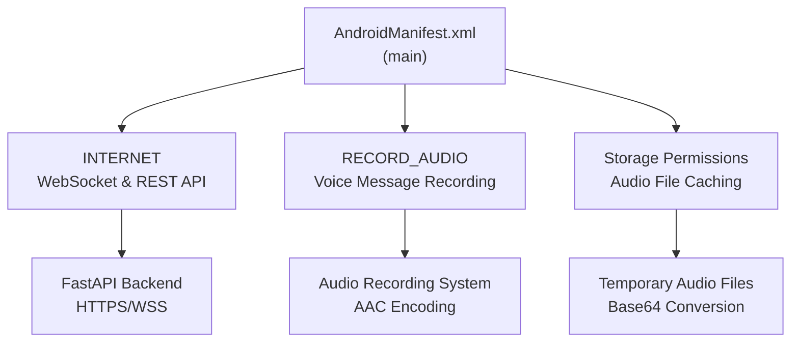
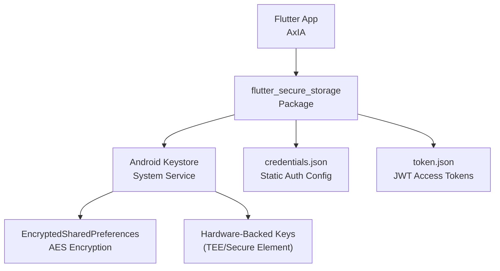
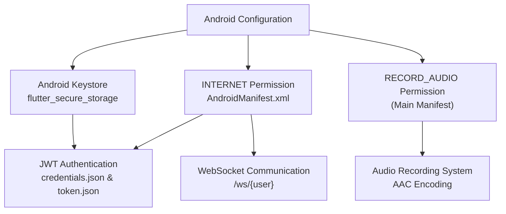

# Android Setup

> **Relevant source files**
> * [android/.gitignore](https://github.com/axchisan/AxIA/blob/1fe26c44/android/.gitignore)
> * [android/app/src/debug/AndroidManifest.xml](https://github.com/axchisan/AxIA/blob/1fe26c44/android/app/src/debug/AndroidManifest.xml)

## Purpose and Scope

This document covers the Android-specific configuration required for the AxIA Flutter application. It details the Android project structure, manifest permissions, build configuration, and security considerations specific to the Android platform.

For general Flutter project configuration, see [Project Configuration](/axchisan/AxIA/2.1-project-configuration). For secure credential storage implementation, see [Secure Credential Storage](/axchisan/AxIA/4.2-secure-credential-storage). For iOS platform configuration, see the iOS Setup documentation (not yet available).

---

## Android Project Structure

The AxIA Android configuration follows the standard Flutter Android project structure with platform-specific configurations that enable secure storage, audio recording, and network communication.

### Directory Organization

```

```

**Sources:** [android/.gitignore L1-L15](https://github.com/axchisan/AxIA/blob/1fe26c44/android/.gitignore#L1-L15)

 [android/app/src/debug/AndroidManifest.xml L1-L8](https://github.com/axchisan/AxIA/blob/1fe26c44/android/app/src/debug/AndroidManifest.xml#L1-L8)

---

## Debug Manifest Configuration

The debug manifest provides minimal configuration specifically for development builds. This manifest is merged with the main manifest during debug builds.

### Debug Manifest Structure



The debug manifest contains a single critical permission:

| Permission | Purpose | Required For |
| --- | --- | --- |
| `android.permission.INTERNET` | Network communication | Flutter development tools, hot reload, debugging, breakpoint support |

**Key Configuration:**

* **Location:** [android/app/src/debug/AndroidManifest.xml L1-L8](https://github.com/axchisan/AxIA/blob/1fe26c44/android/app/src/debug/AndroidManifest.xml#L1-L8)
* **Namespace:** `http://schemas.android.com/apk/res/android`
* **Permission Declaration:** [android/app/src/debug/AndroidManifest.xml L6](https://github.com/axchisan/AxIA/blob/1fe26c44/android/app/src/debug/AndroidManifest.xml#L6-L6)

The `INTERNET` permission in the debug manifest is specifically documented as required for the Flutter tool to communicate with the running application during development [android/app/src/debug/AndroidManifest.xml L2-L5](https://github.com/axchisan/AxIA/blob/1fe26c44/android/app/src/debug/AndroidManifest.xml#L2-L5)

**Sources:** [android/app/src/debug/AndroidManifest.xml L1-L8](https://github.com/axchisan/AxIA/blob/1fe26c44/android/app/src/debug/AndroidManifest.xml#L1-L8)

---

## Build Configuration and Security

The Android build system uses Gradle for compilation and packaging. Security-sensitive files are explicitly excluded from version control to prevent credential exposure.

### Gitignore Patterns

The Android gitignore configuration protects sensitive build artifacts and security credentials:



### Protected File Categories

| Category | Files | Purpose |
| --- | --- | --- |
| **Gradle Build** | `gradle-wrapper.jar`, `.gradle/`, `gradlew*` | Build system executables and cache |
| **Local Config** | `local.properties` | Machine-specific SDK paths |
| **Generated** | `GeneratedPluginRegistrant.java`, `.cxx/` | Auto-generated Flutter and native code |
| **Debug Artifacts** | `captures/` | Performance profiling and debugging data |
| **Security** | `key.properties`, `*.keystore`, `*.jks` | Signing keys and credentials |

### Keystore Security

The gitignore explicitly protects keystore files with multiple patterns:

* **Single Pattern:** `key.properties` [android/.gitignore L12](https://github.com/axchisan/AxIA/blob/1fe26c44/android/.gitignore#L12-L12)
* **Recursive Patterns:** `**/*.keystore` and `**/*.jks` [android/.gitignore L13-L14](https://github.com/axchisan/AxIA/blob/1fe26c44/android/.gitignore#L13-L14)

A comment in the gitignore references Flutter's keystore documentation: "Remember to never publicly share your keystore" [android/.gitignore L10-L11](https://github.com/axchisan/AxIA/blob/1fe26c44/android/.gitignore#L10-L11)

**Sources:** [android/.gitignore L1-L15](https://github.com/axchisan/AxIA/blob/1fe26c44/android/.gitignore#L1-L15)

---

## Required Permissions

The AxIA Android application requires specific permissions for its core functionality. While the debug manifest shows only the `INTERNET` permission, the main application manifest (not provided in the files) would typically include additional permissions for production use.

### Expected Permission Requirements

Based on the AxIA system architecture, the main manifest would require:



| Permission | Android Constant | Required For | System Reference |
| --- | --- | --- | --- |
| Internet | `android.permission.INTERNET` | WebSocket connections, REST API calls, JWT authentication | [Authentication Flow](/axchisan/AxIA/4.1-jwt-token-flow), [WebSocket Communication](/axchisan/AxIA/5.1-websocket-communication) |
| Record Audio | `android.permission.RECORD_AUDIO` | Voice message recording, AAC encoding | [Audio Recording](/axchisan/AxIA/6.1-audio-recording) |
| Storage | Storage permissions | Temporary audio file caching | [Audio Processing](/axchisan/AxIA/6.1-audio-recording) |

**Runtime Permission Handling:**

The Flutter application handles runtime permission requests through the `permission_handler` package. For `RECORD_AUDIO`, the app must request permission before accessing the microphone [Audio Recording System](/axchisan/AxIA/6.1-audio-recording).

**Sources:** [android/app/src/debug/AndroidManifest.xml L6](https://github.com/axchisan/AxIA/blob/1fe26c44/android/app/src/debug/AndroidManifest.xml#L6-L6)

 system architecture diagrams

---

## Secure Storage Integration

The Android platform provides secure credential storage through the Android Keystore system, accessed via the `flutter_secure_storage` package.

### Android Keystore Architecture



### Storage Implementation Details

| Component | Android Implementation | Security Level |
| --- | --- | --- |
| **Storage Backend** | `EncryptedSharedPreferences` | AES-256 encryption |
| **Key Storage** | Android Keystore | Hardware-backed (if available) |
| **Credentials File** | `credentials.json` | Username/password for token acquisition |
| **Token File** | `token.json` | JWT tokens with 24-hour expiration |

The Android Keystore system provides:

* **Hardware-backed encryption keys** on supported devices
* **Automatic key generation** per application
* **Key isolation** preventing access by other apps
* **Biometric authentication integration** (optional)

**Sources:** System architecture Diagram 2 (Authentication & Security Flow), [Secure Credential Storage](/axchisan/AxIA/4.2-secure-credential-storage)

---

## Build Types and Configurations

Flutter Android projects support multiple build types, each with its own manifest and configuration.

### Build Type Comparison

| Build Type | Manifest Location | Purpose | Typical Use |
| --- | --- | --- | --- |
| **Debug** | `src/debug/AndroidManifest.xml` | Development builds with debug symbols | Local development, hot reload |
| **Profile** | `src/profile/AndroidManifest.xml` | Performance profiling builds | Performance testing, optimization |
| **Release** | `src/main/AndroidManifest.xml` | Production builds, optimized | App store distribution |

### Debug Build Configuration

Debug builds merge the debug manifest [android/app/src/debug/AndroidManifest.xml L1-L8](https://github.com/axchisan/AxIA/blob/1fe26c44/android/app/src/debug/AndroidManifest.xml#L1-L8)

 with the main manifest, providing:

* Flutter DevTools connectivity
* Hot reload support
* Debugger attachment
* Full logging output

The `INTERNET` permission is essential for these features [android/app/src/debug/AndroidManifest.xml L2-L5](https://github.com/axchisan/AxIA/blob/1fe26c44/android/app/src/debug/AndroidManifest.xml#L2-L5)

**Sources:** [android/app/src/debug/AndroidManifest.xml L1-L8](https://github.com/axchisan/AxIA/blob/1fe26c44/android/app/src/debug/AndroidManifest.xml#L1-L8)

---

## Development Workflow

### Local Development Setup

When setting up AxIA for Android development:

1. **Verify Android SDK:** Ensure `local.properties` points to the correct Android SDK path (this file is auto-generated and gitignored [android/.gitignore L6](https://github.com/axchisan/AxIA/blob/1fe26c44/android/.gitignore#L6-L6) )
2. **Install Dependencies:** Run `flutter pub get` to install Flutter packages, which generates `GeneratedPluginRegistrant.java` [android/.gitignore L7](https://github.com/axchisan/AxIA/blob/1fe26c44/android/.gitignore#L7-L7)
3. **Debug Build:** Use `flutter run` for debug builds with hot reload enabled via the `INTERNET` permission [android/app/src/debug/AndroidManifest.xml L6](https://github.com/axchisan/AxIA/blob/1fe26c44/android/app/src/debug/AndroidManifest.xml#L6-L6)
4. **Plugin Registration:** Flutter automatically generates plugin registration code, which is excluded from version control [android/.gitignore L7](https://github.com/axchisan/AxIA/blob/1fe26c44/android/.gitignore#L7-L7)

### Security Considerations

For production builds:

1. **Generate Keystore:** Create a signing keystore using Android Studio or `keytool`
2. **Configure `key.properties`:** Store keystore path and credentials (this file is gitignored [android/.gitignore L12](https://github.com/axchisan/AxIA/blob/1fe26c44/android/.gitignore#L12-L12) )
3. **Secure Keystore Files:** Ensure `*.keystore` and `*.jks` files are never committed [android/.gitignore L13-L14](https://github.com/axchisan/AxIA/blob/1fe26c44/android/.gitignore#L13-L14)
4. **Reference Documentation:** Follow Flutter's official keystore documentation mentioned in the gitignore [android/.gitignore L11](https://github.com/axchisan/AxIA/blob/1fe26c44/android/.gitignore#L11-L11)

**Sources:** [android/.gitignore L1-L15](https://github.com/axchisan/AxIA/blob/1fe26c44/android/.gitignore#L1-L15)

 [android/app/src/debug/AndroidManifest.xml L1-L8](https://github.com/axchisan/AxIA/blob/1fe26c44/android/app/src/debug/AndroidManifest.xml#L1-L8)

---

## Integration with AxIA Systems

The Android configuration supports AxIA's core functionality:



### System Dependencies

| Android Feature | AxIA System | Documentation Reference |
| --- | --- | --- |
| Android Keystore | Secure credential storage, JWT tokens | [Secure Credential Storage](/axchisan/AxIA/4.2-secure-credential-storage) |
| `INTERNET` permission | WebSocket connections, REST API | [WebSocket Communication](/axchisan/AxIA/5.1-websocket-communication) |
| `RECORD_AUDIO` permission | Voice message recording | [Audio Recording](/axchisan/AxIA/6.1-audio-recording) |
| Build security (gitignore) | Production signing keys | [Repository Management](/axchisan/AxIA/11-repository-management) |

**Sources:** [android/.gitignore L1-L15](https://github.com/axchisan/AxIA/blob/1fe26c44/android/.gitignore#L1-L15)

 [android/app/src/debug/AndroidManifest.xml L1-L8](https://github.com/axchisan/AxIA/blob/1fe26c44/android/app/src/debug/AndroidManifest.xml#L1-L8)

 system architecture diagrams