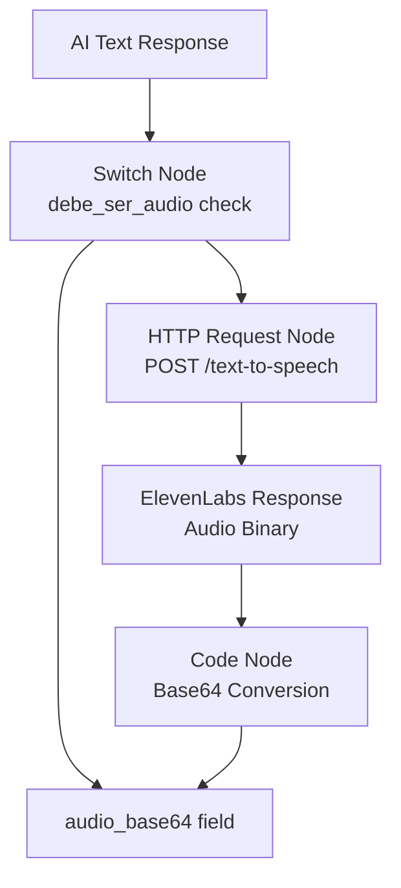
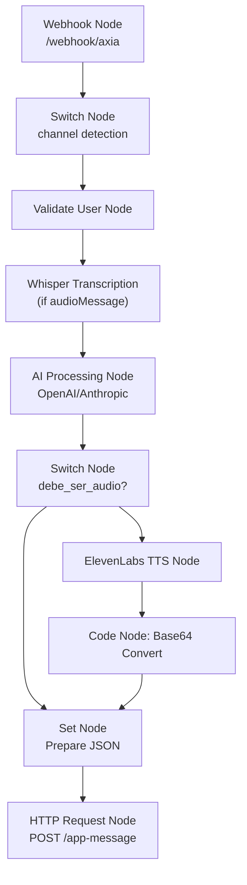
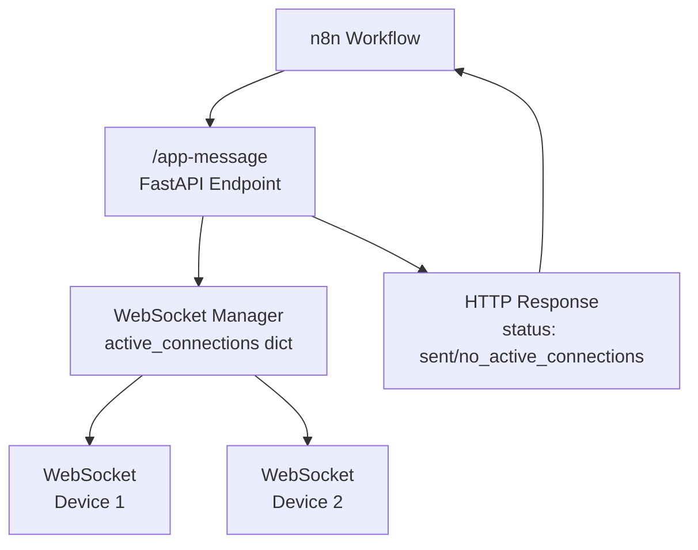

# Audio Backend Integration

> **Relevant source files**
> * [AUDIO_IMPLEMENTATION_GUIDE.md](https://github.com/axchisan/AxIA/blob/1fe26c44/AUDIO_IMPLEMENTATION_GUIDE.md)
> * [N8N_CONFIGURATION_FINAL.md](https://github.com/axchisan/AxIA/blob/1fe26c44/N8N_CONFIGURATION_FINAL.md)

## Purpose and Scope

This document covers the backend processing and transmission of audio data in the AxIA system, specifically focusing on:

* Base64 audio encoding and transmission protocol over WebSocket
* ElevenLabs text-to-speech (TTS) integration for generating audio responses
* Whisper speech-to-text transcription for processing audio inputs
* n8n workflow configuration for audio processing
* The `/app-message` HTTP endpoint for delivering responses to connected clients

For client-side audio recording implementation, see [Audio Recording](/axchisan/AxIA/6.1-audio-recording). For audio playback controls and UI, see [Audio Playback](/axchisan/AxIA/6.2-audio-playback). For WebSocket protocol details, see [WebSocket Protocol](/axchisan/AxIA/8.2-websocket-protocol).

---

## Audio Transmission Protocol

AxIA transmits audio data as Base64-encoded strings within JSON messages over WebSocket. This approach enables binary audio transmission through text-based protocols without requiring multipart/form-data or separate file upload endpoints.

### Encoding Format

Audio files are recorded in AAC/M4A format at 128kbps, 44.1kHz sampling rate. The binary audio data is converted to Base64 before transmission, resulting in approximately 33% size increase over raw binary.

### Message Format: Sending Audio from App

When a user records an audio message, the app sends this structure via WebSocket:

```

```

**Key Fields:**

* `event`: Always `"messages.upsert"` to indicate new message
* `channel`: Set to `"app"` to distinguish from WhatsApp/Telegram channels
* `data.messageType`: `"audioMessage"` triggers audio-specific processing in n8n
* `data.message.base64`: Base64-encoded AAC/M4A audio data

**Sources:** [AUDIO_IMPLEMENTATION_GUIDE.md L113-L125](https://github.com/axchisan/AxIA/blob/1fe26c44/AUDIO_IMPLEMENTATION_GUIDE.md#L113-L125)

### Message Format: Receiving Audio from Backend

When the backend responds with audio (generated via TTS), it sends:

```

```

**Key Fields:**

* `output`: Text representation of the audio content
* `type`: Set to `"audio"` when audio data is present
* `debe_ser_audio`: Boolean flag indicating client should auto-play audio
* `audio_base64`: Base64-encoded audio response (takes precedence over `audio_url`)
* `audio_url`: Optional URL to hosted audio file (currently unused)
* `session_id`: Unique message identifier for tracking

**Sources:** [AUDIO_IMPLEMENTATION_GUIDE.md L136-L144](https://github.com/axchisan/AxIA/blob/1fe26c44/AUDIO_IMPLEMENTATION_GUIDE.md#L136-L144)

 [N8N_CONFIGURATION_FINAL.md L200-L209](https://github.com/axchisan/AxIA/blob/1fe26c44/N8N_CONFIGURATION_FINAL.md#L200-L209)

---

## Complete Audio Processing Flow

```

```

**Sources:** [AUDIO_IMPLEMENTATION_GUIDE.md L99-L150](https://github.com/axchisan/AxIA/blob/1fe26c44/AUDIO_IMPLEMENTATION_GUIDE.md#L99-L150)

 [N8N_CONFIGURATION_FINAL.md L1-L232](https://github.com/axchisan/AxIA/blob/1fe26c44/N8N_CONFIGURATION_FINAL.md#L1-L232)

---

## Audio Input Processing with Whisper

When n8n receives an audio message from the app, it transcribes the audio using Whisper (OpenAI's speech-to-text model).

### Whisper Transcription Node

The n8n workflow includes a Whisper API node configured as follows:

| Parameter | Value |
| --- | --- |
| **Method** | POST |
| **URL** | Whisper API endpoint |
| **Input Format** | Base64 audio string |
| **Output** | Transcribed text |
| **Language** | Auto-detect or Spanish (configurable) |

The transcription node receives the Base64 audio from the webhook payload:

```

```

After transcription, the text is passed to the AI processing nodes (OpenAI/Anthropic) for generating a response.

**Sources:** [AUDIO_IMPLEMENTATION_GUIDE.md L129-L133](https://github.com/axchisan/AxIA/blob/1fe26c44/AUDIO_IMPLEMENTATION_GUIDE.md#L129-L133)

 [N8N_CONFIGURATION_FINAL.md L52-L73](https://github.com/axchisan/AxIA/blob/1fe26c44/N8N_CONFIGURATION_FINAL.md#L52-L73)

---

## Audio Output Generation with ElevenLabs

When the AI determines a response should be delivered as audio (based on user preferences or conversation context), n8n converts the text response to speech using ElevenLabs TTS.

### ElevenLabs HTTP Request Configuration

**Diagram: ElevenLabs TTS Integration**



**Sources:** [N8N_CONFIGURATION_FINAL.md L76-L120](https://github.com/axchisan/AxIA/blob/1fe26c44/N8N_CONFIGURATION_FINAL.md#L76-L120)

### ElevenLabs API Request

**Endpoint:** `POST https://api.elevenlabs.io/v1/text-to-speech/{voice_id}`

**Headers:**

```

```

**Request Body:**

```

```

**Response Format:** Binary audio file (configured in n8n as "File" response)

**Sources:** [N8N_CONFIGURATION_FINAL.md L83-L106](https://github.com/axchisan/AxIA/blob/1fe26c44/N8N_CONFIGURATION_FINAL.md#L83-L106)

### Base64 Conversion in n8n

After receiving the audio binary from ElevenLabs, a Code node converts it to Base64:

```

```

This Base64 string is then included in the response payload sent to `/app-message`.

**Sources:** [N8N_CONFIGURATION_FINAL.md L108-L120](https://github.com/axchisan/AxIA/blob/1fe26c44/N8N_CONFIGURATION_FINAL.md#L108-L120)

---

## n8n Audio Processing Pipeline

**Diagram: n8n Workflow Audio Nodes**



**Sources:** [N8N_CONFIGURATION_FINAL.md L151-L182](https://github.com/axchisan/AxIA/blob/1fe26c44/N8N_CONFIGURATION_FINAL.md#L151-L182)

### Channel Detection Logic

The initial Switch node routes messages based on the `channel` field:

| Condition | Channel Value | Routing |
| --- | --- | --- |
| Rule 1 | `channel == "app"` | Output 0 (App processing) |
| Rule 2 | `channel == "whatsapp"` | Output 1 (WhatsApp processing) |
| Rule 3 | `channel == "telegram"` | Output 2 (Telegram processing) |

For app messages, the workflow extracts the username and session_id:

```

```

**Sources:** [N8N_CONFIGURATION_FINAL.md L23-L40](https://github.com/axchisan/AxIA/blob/1fe26c44/N8N_CONFIGURATION_FINAL.md#L23-L40)

 [N8N_CONFIGURATION_FINAL.md L49-L73](https://github.com/axchisan/AxIA/blob/1fe26c44/N8N_CONFIGURATION_FINAL.md#L49-L73)

### Audio Response Decision

The workflow determines whether to generate audio based on:

1. The `debe_ser_audio` flag from AI response
2. User preferences stored in the database
3. Message type (audio input typically receives audio output)

```

```

**Sources:** [N8N_CONFIGURATION_FINAL.md L62-L73](https://github.com/axchisan/AxIA/blob/1fe26c44/N8N_CONFIGURATION_FINAL.md#L62-L73)

---

## Backend Endpoint: /app-message

The `/app-message` endpoint receives responses from n8n and delivers them to connected WebSocket clients.

### Endpoint Specification

**URL:** `POST https://apiaxia.axchisan.com/app-message`

**Authentication:** None required (called by n8n, not client)

**Headers:**

```

```

**Request Body Schema:**

| Field | Type | Required | Description |
| --- | --- | --- | --- |
| `username` | string | Yes | Target user's username |
| `session_id` | string | Yes | Message session identifier |
| `output` | string | Yes | Response text content |
| `type` | string | Yes | `"text"` or `"audio"` |
| `debe_ser_audio` | boolean | Yes | Auto-play flag for client |
| `audio_url` | string \| null | No | Optional URL to hosted audio |
| `audio_base64` | string \| null | No | Base64-encoded audio data |

**Sources:** [N8N_CONFIGURATION_FINAL.md L3-L20](https://github.com/axchisan/AxIA/blob/1fe26c44/N8N_CONFIGURATION_FINAL.md#L3-L20)

 [N8N_CONFIGURATION_FINAL.md L138-L149](https://github.com/axchisan/AxIA/blob/1fe26c44/N8N_CONFIGURATION_FINAL.md#L138-L149)

### WebSocket Relay Mechanism

**Diagram: `/app-message` Processing**



The endpoint performs the following operations:

1. **Extract username** from request body
2. **Lookup active WebSocket connections** in `active_connections` dictionary
3. **Send message to all connected devices** for that user
4. **Return status** indicating delivery success

**Response when delivered:**

```

```

**Response when no active connections:**

```

```

**Sources:** [N8N_CONFIGURATION_FINAL.md L232-L237](https://github.com/axchisan/AxIA/blob/1fe26c44/N8N_CONFIGURATION_FINAL.md#L232-L237)

---

## Audio Payload Examples

### Text Response (No Audio)

```

```

**Sources:** [N8N_CONFIGURATION_FINAL.md L186-L196](https://github.com/axchisan/AxIA/blob/1fe26c44/N8N_CONFIGURATION_FINAL.md#L186-L196)

### Audio Response with Base64

```

```

**Sources:** [N8N_CONFIGURATION_FINAL.md L199-L209](https://github.com/axchisan/AxIA/blob/1fe26c44/N8N_CONFIGURATION_FINAL.md#L199-L209)

---

## Testing Audio Integration

### Testing with curl

Test the `/app-message` endpoint directly:

```

```

**Expected Response:**

* If user is connected: `{"status": "sent", "connections": 1}`
* If user is not connected: `{"status": "no_active_connections"}`

**Sources:** [N8N_CONFIGURATION_FINAL.md L214-L228](https://github.com/axchisan/AxIA/blob/1fe26c44/N8N_CONFIGURATION_FINAL.md#L214-L228)

### Audio Processing Test Checklist

| Test Case | Expected Behavior |
| --- | --- |
| Send audio message from app | Audio appears as "🎤 Mensaje de voz" in chat |
| Whisper transcription | AI receives transcribed text for processing |
| Text response with `debe_ser_audio: false` | Response displays as Markdown text |
| Text response with `debe_ser_audio: true` | Response plays as audio automatically |
| Audio Base64 transmission | No file corruption, playable in app |

**Sources:** [AUDIO_IMPLEMENTATION_GUIDE.md L173-L186](https://github.com/axchisan/AxIA/blob/1fe26c44/AUDIO_IMPLEMENTATION_GUIDE.md#L173-L186)

---

## Key Implementation Notes

1. **Username Matching:** The `username` in `/app-message` must exactly match the authenticated username in the WebSocket connection
2. **Multiple Devices:** The endpoint automatically broadcasts to all active WebSocket connections for a given user
3. **Base64 Priority:** When both `audio_base64` and `audio_url` are present, the client uses `audio_base64`
4. **No Authentication on Endpoint:** The `/app-message` endpoint does not require Bearer token authentication since it's called by n8n, not by end users
5. **Temporary File Cleanup:** Audio files are automatically deleted after Base64 conversion to prevent storage bloat

**Sources:** [N8N_CONFIGURATION_FINAL.md L232-L237](https://github.com/axchisan/AxIA/blob/1fe26c44/N8N_CONFIGURATION_FINAL.md#L232-L237)

 [AUDIO_IMPLEMENTATION_GUIDE.md L168-L169](https://github.com/axchisan/AxIA/blob/1fe26c44/AUDIO_IMPLEMENTATION_GUIDE.md#L168-L169)