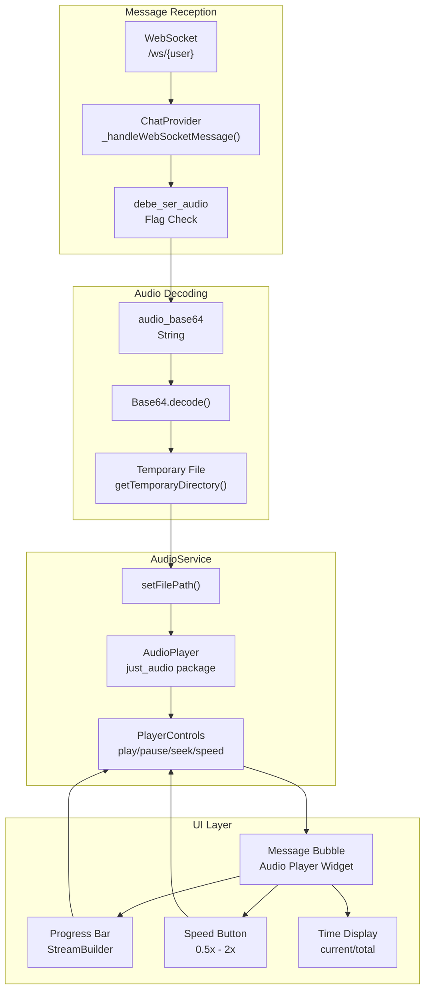
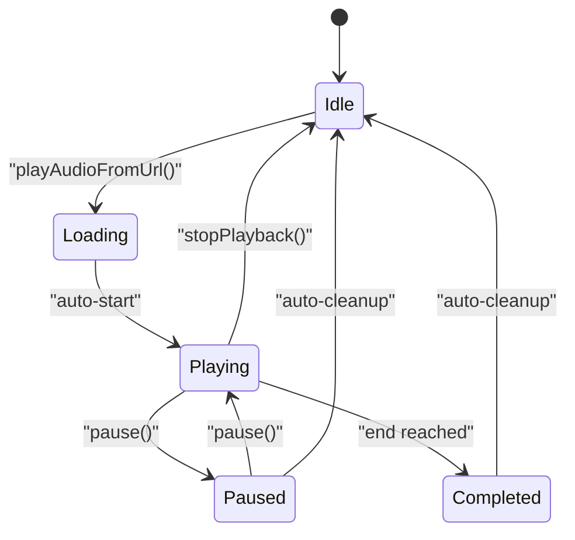
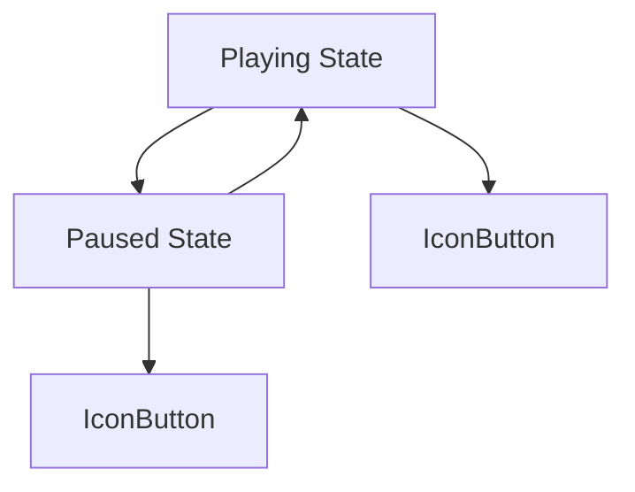
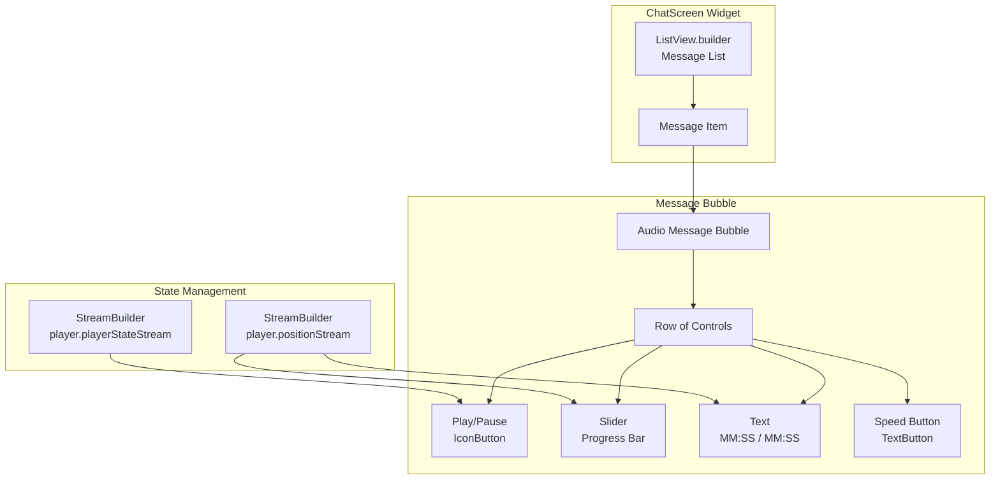
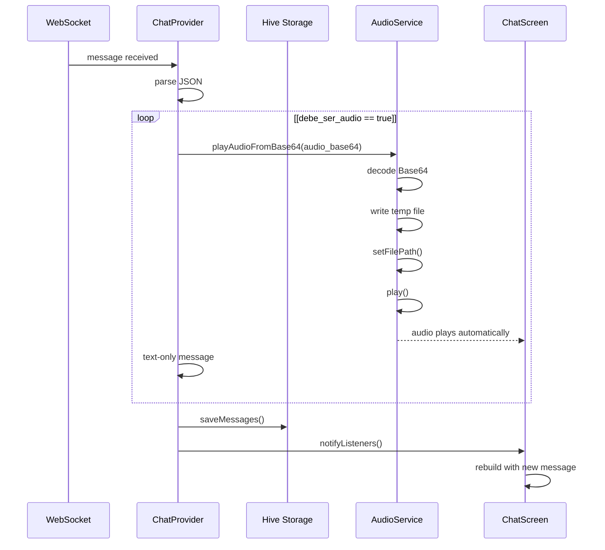
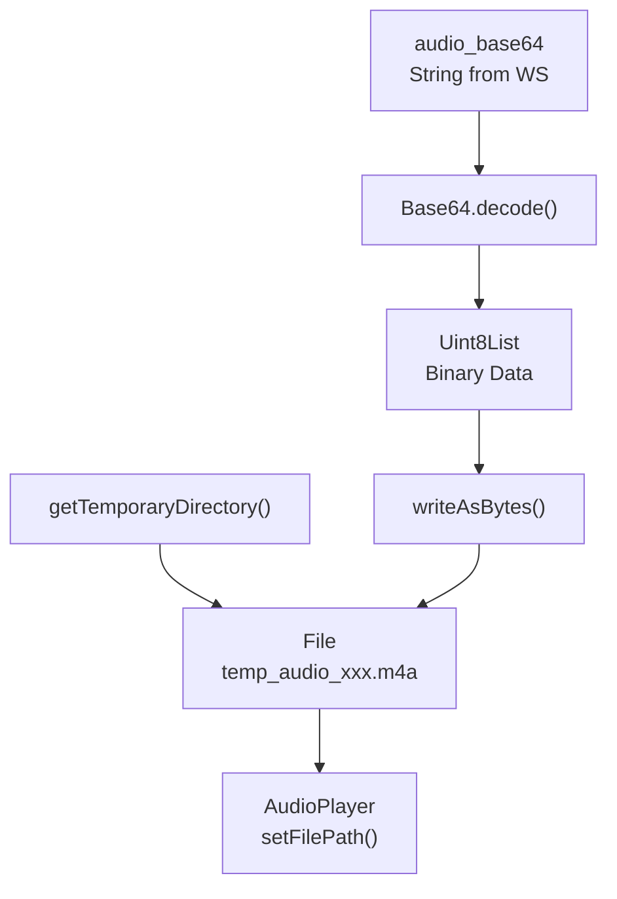
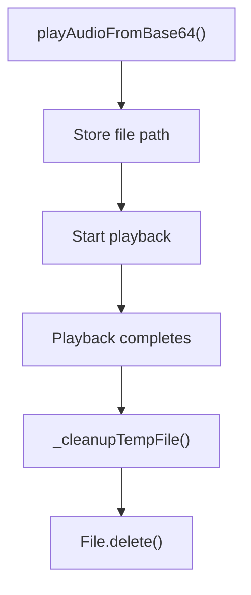

# Audio Playback

> **Relevant source files**
> * [AUDIO_IMPLEMENTATION_GUIDE.md](https://github.com/axchisan/AxIA/blob/1fe26c44/AUDIO_IMPLEMENTATION_GUIDE.md)
> * [CHANGELOG_MEJORAS_CHAT.md](https://github.com/axchisan/AxIA/blob/1fe26c44/CHANGELOG_MEJORAS_CHAT.md)

## Purpose and Scope

This document covers the audio playback system in AxIA's Flutter application, detailing how audio responses from the AI assistant are received, decoded, and played back to the user. It explains the `just_audio` package integration, advanced player controls (speed adjustment, seeking, progress tracking), and UI components.

For information about audio recording from the user, see [Audio Recording](/axchisan/AxIA/6.1-audio-recording). For details on backend audio generation with ElevenLabs and Base64 transmission, see [Audio Backend Integration](/axchisan/AxIA/6.3-audio-backend-integration).

---

## Audio Playback Architecture

The audio playback system uses the `just_audio` package to provide a full-featured audio player with advanced controls embedded directly in chat message bubbles.



**Audio Playback Data Flow**
This diagram shows how audio responses flow from WebSocket reception through Base64 decoding to playback with UI controls.

Sources: [AUDIO_IMPLEMENTATION_GUIDE.md L1-L211](https://github.com/axchisan/AxIA/blob/1fe26c44/AUDIO_IMPLEMENTATION_GUIDE.md#L1-L211)

 [CHANGELOG_MEJORAS_CHAT.md L1-L199](https://github.com/axchisan/AxIA/blob/1fe26c44/CHANGELOG_MEJORAS_CHAT.md#L1-L199)

---

## AudioService Playback Implementation

The `AudioService` class manages all audio playback operations using the `just_audio` package.

### Core Components

| Component | Package | Purpose |
| --- | --- | --- |
| `AudioPlayer` | `just_audio: ^0.9.40` | Cross-platform audio playback engine |
| `Base64` decoder | `dart:convert` | Converts Base64 strings to binary |
| `path_provider` | `^2.1.5` | Access to temporary file directory |

### Playback Methods

The service provides multiple methods for different audio sources:

**From Base64 String:**

```
playAudioFromBase64(String base64Audio)
```

1. Decodes Base64 to bytes
2. Writes to temporary file
3. Sets file path on player
4. Starts playback
5. Schedules cleanup

**From URL:**

```
playAudioFromUrl(String url)
```

1. Sets URL directly on player
2. Starts playback

**Cleanup:**

```
_cleanupTempFile()
```

Automatically deletes temporary audio files after playback completes.

Sources: [lib/services/audio_service.dart](https://github.com/axchisan/AxIA/blob/1fe26c44/lib/services/audio_service.dart)

 [AUDIO_IMPLEMENTATION_GUIDE.md L73-L83](https://github.com/axchisan/AxIA/blob/1fe26c44/AUDIO_IMPLEMENTATION_GUIDE.md#L73-L83)

### Player State Management



**AudioPlayer State Transitions**

Sources: [lib/services/audio_service.dart](https://github.com/axchisan/AxIA/blob/1fe26c44/lib/services/audio_service.dart)

 [CHANGELOG_MEJORAS_CHAT.md L19-L31](https://github.com/axchisan/AxIA/blob/1fe26c44/CHANGELOG_MEJORAS_CHAT.md#L19-L31)

---

## Player Controls

The audio player provides six distinct playback speeds and full seek controls.

### Speed Control

| Speed | Use Case |
| --- | --- |
| 0.5x | Slow for comprehension |
| 0.75x | Slightly slower |
| 1.0x | Normal speed (default) |
| 1.25x | Slightly faster |
| 1.5x | Fast listening |
| 2.0x | Maximum speed |

**Implementation:**

```
setSpeed(double speed)
player.setSpeed(speed)
```

The speed button cycles through these options, displayed as "1.0x", "1.5x", etc.

### Seeking

**User-initiated seeking:**

* Progress bar tap: jump to position
* Progress bar drag: scrub through audio

**Programmatic seeking:**

```
seek(Duration position)
player.seek(position)
```

### Play/Pause Toggle



**Play/Pause Button Logic**

Sources: [lib/services/audio_service.dart](https://github.com/axchisan/AxIA/blob/1fe26c44/lib/services/audio_service.dart)

 [CHANGELOG_MEJORAS_CHAT.md L22-L30](https://github.com/axchisan/AxIA/blob/1fe26c44/CHANGELOG_MEJORAS_CHAT.md#L22-L30)

### Progress Tracking

The player exposes three streams for real-time updates:

| Stream | Type | Content |
| --- | --- | --- |
| `positionStream` | `Stream<Duration>` | Current playback position |
| `durationStream` | `Stream<Duration?>` | Total audio duration |
| `playerStateStream` | `Stream<PlayerState>` | Playing/paused/buffering/completed |

UI components use `StreamBuilder` widgets to reactively update based on these streams.

Sources: [lib/screens/chat/chat_screen.dart](https://github.com/axchisan/AxIA/blob/1fe26c44/lib/screens/chat/chat_screen.dart)

 [CHANGELOG_MEJORAS_CHAT.md L22-L30](https://github.com/axchisan/AxIA/blob/1fe26c44/CHANGELOG_MEJORAS_CHAT.md#L22-L30)

---

## UI Integration

The audio player is embedded directly in chat message bubbles for AxIA's audio responses.

### Chat Screen Integration



**Audio Player UI Component Hierarchy**

Sources: [lib/screens/chat/chat_screen.dart](https://github.com/axchisan/AxIA/blob/1fe26c44/lib/screens/chat/chat_screen.dart)

 [CHANGELOG_MEJORAS_CHAT.md L19-L31](https://github.com/axchisan/AxIA/blob/1fe26c44/CHANGELOG_MEJORAS_CHAT.md#L19-L31)

### Widget Layout

The audio player widget is composed of several elements arranged horizontally:

| Element | Width | Function |
| --- | --- | --- |
| Play/Pause Button | 40px | Toggle playback |
| Progress Slider | Flexible | Seek and display progress |
| Time Display | Auto | Show "current / total" |
| Speed Button | 60px | Cycle through speeds |

**Visual Design:**

* Bubble background: `Colors.deepPurple.shade100`
* Button colors: Deep purple theme
* Progress bar: Deep purple accent
* Compact layout: fits in chat bubble

Sources: [lib/screens/chat/chat_screen.dart](https://github.com/axchisan/AxIA/blob/1fe26c44/lib/screens/chat/chat_screen.dart)

 [CHANGELOG_MEJORAS_CHAT.md L57-L63](https://github.com/axchisan/AxIA/blob/1fe26c44/CHANGELOG_MEJORAS_CHAT.md#L57-L63)

### Time Formatting

Time is displayed in MM:SS format for both current position and total duration:

```yaml
_formatDuration(Duration duration)
returns: "MM:SS"
example: "02:34" for 2 minutes 34 seconds
```

Sources: [lib/screens/chat/chat_screen.dart](https://github.com/axchisan/AxIA/blob/1fe26c44/lib/screens/chat/chat_screen.dart)

---

## Audio Message Reception Flow

This section details how audio messages are received from the backend and automatically played.

### WebSocket Message Structure

When the backend sends an audio response, the message includes:

```json
{
  "output": "Text transcription of audio",
  "type": "audio",
  "debe_ser_audio": true,
  "audio_base64": "[BASE64_ENCODED_AUDIO]",
  "session_id": "123456"
}
```

| Field | Type | Purpose |
| --- | --- | --- |
| `output` | String | Text version of the response |
| `type` | String | Message type: "audio" or "text" |
| `debe_ser_audio` | Boolean | Whether to auto-play |
| `audio_base64` | String | Base64-encoded audio data |
| `session_id` | String | Session identifier |

Sources: [AUDIO_IMPLEMENTATION_GUIDE.md L136-L144](https://github.com/axchisan/AxIA/blob/1fe26c44/AUDIO_IMPLEMENTATION_GUIDE.md#L136-L144)

 [CHANGELOG_MEJORAS_CHAT.md L132-L156](https://github.com/axchisan/AxIA/blob/1fe26c44/CHANGELOG_MEJORAS_CHAT.md#L132-L156)

### Auto-Play Logic



**Auto-Play Decision Flow**

The `ChatProvider._handleWebSocketMessage()` method checks the `debe_ser_audio` flag and triggers automatic playback when true.

Sources: [lib/providers/chat_provider.dart](https://github.com/axchisan/AxIA/blob/1fe26c44/lib/providers/chat_provider.dart)

 [AUDIO_IMPLEMENTATION_GUIDE.md L128-L149](https://github.com/axchisan/AxIA/blob/1fe26c44/AUDIO_IMPLEMENTATION_GUIDE.md#L128-L149)

### Base64 Decoding Process



**Base64 to Playback Pipeline**

The system writes decoded audio to temporary storage because `just_audio` requires file paths or URLs—it cannot play directly from memory buffers.

Sources: [lib/services/audio_service.dart](https://github.com/axchisan/AxIA/blob/1fe26c44/lib/services/audio_service.dart)

 [AUDIO_IMPLEMENTATION_GUIDE.md L73-L83](https://github.com/axchisan/AxIA/blob/1fe26c44/AUDIO_IMPLEMENTATION_GUIDE.md#L73-L83)

---

## Player Instance Management

### Single AudioPlayer Instance

The `AudioService` maintains a single `AudioPlayer` instance for the entire application:

```
AudioPlayer _player = AudioPlayer()
```

**Benefits:**

* Prevents multiple simultaneous playbacks
* Simplifies state management
* Reduces resource usage

**Behavior:**

* Starting new playback automatically stops current playback
* No need for explicit cleanup between messages

### Memory Management

**Temporary File Cleanup:**



**Automatic Cleanup Flow**

Files are deleted after playback completes to avoid filling device storage with temporary audio files.

Sources: [lib/services/audio_service.dart](https://github.com/axchisan/AxIA/blob/1fe26c44/lib/services/audio_service.dart)

 [AUDIO_IMPLEMENTATION_GUIDE.md L167-L169](https://github.com/axchisan/AxIA/blob/1fe26c44/AUDIO_IMPLEMENTATION_GUIDE.md#L167-L169)

---

## Usage Examples

### Playback from Chat Message

When a message with audio arrives:

1. `ChatProvider` receives WebSocket message
2. Checks `message['debe_ser_audio']` flag
3. If true, calls `audioService.playAudioFromBase64(message['audio_base64'])`
4. Audio plays automatically
5. User sees player controls in message bubble

### Manual Playback Control

User interactions with the audio player:

| Action | Result |
| --- | --- |
| Tap play button | Audio starts/resumes |
| Tap pause button | Audio pauses |
| Drag progress bar | Audio seeks to position |
| Tap speed button | Speed cycles: 1x → 1.25x → 1.5x → 2x → 0.5x → 0.75x → 1x |

Sources: [lib/screens/chat/chat_screen.dart](https://github.com/axchisan/AxIA/blob/1fe26c44/lib/screens/chat/chat_screen.dart)

 [CHANGELOG_MEJORAS_CHAT.md L27-L30](https://github.com/axchisan/AxIA/blob/1fe26c44/CHANGELOG_MEJORAS_CHAT.md#L27-L30)

---

## Error Handling

The audio playback system handles several error conditions:

| Error | Handling |
| --- | --- |
| Invalid Base64 | Logs error, does not play |
| File write failure | Logs error, returns without playing |
| Player initialization failure | Logs error, shows text fallback |
| Unsupported format | `just_audio` handles automatically |

All errors are logged with `[AudioService]` prefix for debugging.

Sources: [AUDIO_IMPLEMENTATION_GUIDE.md L188-L197](https://github.com/axchisan/AxIA/blob/1fe26c44/AUDIO_IMPLEMENTATION_GUIDE.md#L188-L197)

---

## Performance Characteristics

### Playback Latency

| Stage | Typical Duration |
| --- | --- |
| Base64 decode | < 50ms |
| File write | < 100ms |
| Player setup | < 50ms |
| Audio start | < 100ms |
| **Total** | **< 300ms** |

### Resource Usage

* **Memory**: Minimal, audio streamed from file
* **Storage**: Temporary files deleted after playback
* **CPU**: Decoding handled by native platform code
* **Battery**: Efficient native audio APIs

Sources: [AUDIO_IMPLEMENTATION_GUIDE.md L166-L171](https://github.com/axchisan/AxIA/blob/1fe26c44/AUDIO_IMPLEMENTATION_GUIDE.md#L166-L171)

 [CHANGELOG_MEJORAS_CHAT.md L160-L169](https://github.com/axchisan/AxIA/blob/1fe26c44/CHANGELOG_MEJORAS_CHAT.md#L160-L169)

---

## Platform Support

The `just_audio` package provides cross-platform audio playback:

| Platform | Audio Backend | Supported Formats |
| --- | --- | --- |
| Android | ExoPlayer | AAC, MP3, OGG, WAV, etc. |
| iOS | AVPlayer | AAC, MP3, WAV, ALAC, etc. |
| Web | HTML5 Audio | MP3, AAC (browser-dependent) |

**AxIA Audio Format:**

* Primary: AAC/M4A (from ElevenLabs)
* Bitrate: Typically 128kbps
* Sample rate: 44.1kHz

Sources: [AUDIO_IMPLEMENTATION_GUIDE.md L28-L31](https://github.com/axchisan/AxIA/blob/1fe26c44/AUDIO_IMPLEMENTATION_GUIDE.md#L28-L31)

 [pubspec.yaml](https://github.com/axchisan/AxIA/blob/1fe26c44/pubspec.yaml)

---

## Related Systems

The audio playback system integrates with:

* **[WebSocket Communication](/axchisan/AxIA/5.1-websocket-communication)**: Receives audio messages
* **[ChatProvider](/axchisan/AxIA/5-real-time-chat-system)**: Manages message state and triggers playback
* **[Audio Recording](/axchisan/AxIA/6.1-audio-recording)**: Complementary input system
* **[Audio Backend Integration](/axchisan/AxIA/6.3-audio-backend-integration)**: Backend audio generation with ElevenLabs

Sources: [AUDIO_IMPLEMENTATION_GUIDE.md L1-L211](https://github.com/axchisan/AxIA/blob/1fe26c44/AUDIO_IMPLEMENTATION_GUIDE.md#L1-L211)

 [CHANGELOG_MEJORAS_CHAT.md L1-L199](https://github.com/axchisan/AxIA/blob/1fe26c44/CHANGELOG_MEJORAS_CHAT.md#L1-L199)