# Audio System

> **Relevant source files**
> * [AUDIO_IMPLEMENTATION_GUIDE.md](https://github.com/axchisan/AxIA/blob/1fe26c44/AUDIO_IMPLEMENTATION_GUIDE.md)
> * [CHANGELOG_MEJORAS_CHAT.md](https://github.com/axchisan/AxIA/blob/1fe26c44/CHANGELOG_MEJORAS_CHAT.md)

## Purpose and Scope

This document describes the audio recording and playback system in the AxIA Flutter application, including the `AudioService` class, audio encoding/decoding, Base64 transmission protocol, and backend integration with ElevenLabs TTS and Whisper transcription services. For WebSocket message transport details, see [Real-time Chat System](/axchisan/AxIA/5-real-time-chat-system). For UI components and user interactions, see [Chat UI Enhancements](/axchisan/AxIA/5.3-chat-ui-enhancements).

**Sources:** [AUDIO_IMPLEMENTATION_GUIDE.md L1-L212](https://github.com/axchisan/AxIA/blob/1fe26c44/AUDIO_IMPLEMENTATION_GUIDE.md#L1-L212)

 [CHANGELOG_MEJORAS_CHAT.md L1-L200](https://github.com/axchisan/AxIA/blob/1fe26c44/CHANGELOG_MEJORAS_CHAT.md#L1-L200)

---

## System Architecture

The audio system consists of three primary layers: recording/playback services, Base64 encoding for transmission, and backend processing for transcription and text-to-speech conversion.


**Sources:** [AUDIO_IMPLEMENTATION_GUIDE.md L5-L23](https://github.com/axchisan/AxIA/blob/1fe26c44/AUDIO_IMPLEMENTATION_GUIDE.md#L5-L23)

 [AUDIO_IMPLEMENTATION_GUIDE.md L99-L150](https://github.com/axchisan/AxIA/blob/1fe26c44/AUDIO_IMPLEMENTATION_GUIDE.md#L99-L150)

 [CHANGELOG_MEJORAS_CHAT.md L6-L31](https://github.com/axchisan/AxIA/blob/1fe26c44/CHANGELOG_MEJORAS_CHAT.md#L6-L31)

---

## Dependencies

The audio system relies on four primary Flutter packages:

| Package | Version | Purpose |
| --- | --- | --- |
| `record` | 5.1.2 | Cross-platform audio recording with AAC encoding |
| `just_audio` | 0.9.40 | Advanced audio playback with speed/seek controls |
| `path_provider` | 2.1.5 | Access to temporary file directories |
| `permission_handler` | 12.0.1 | Runtime permission requests for microphone access |

**Additional dependency:**

* `flutter_markdown` (0.7.4+1) for rendering text responses with markdown formatting

**Sources:** [AUDIO_IMPLEMENTATION_GUIDE.md L5-L23](https://github.com/axchisan/AxIA/blob/1fe26c44/AUDIO_IMPLEMENTATION_GUIDE.md#L5-L23)

---

## AudioService Class Structure

The `AudioService` class encapsulates all audio operations and is located at `lib/services/audio_service.dart`. It provides a singleton-like interface for recording and playback operations.

```mermaid
classDiagram
    class AudioService {
        -AudioRecorder _audioRecorder
        -AudioPlayer _audioPlayer
        -String? _audioPath
        -bool _isRecording
        -Duration _recordingDuration
        +startRecording() : Future<void>
        +stopRecordingAndGetBase64() : Future<String?>
        +requestPermission() : Future<bool>
        +playAudioFromBase64(String) : Future<void>
        +playAudioFromUrl(String) : Future<void>
        +pausePlayback() : Future<void>
        +resumePlayback() : Future<void>
        +stopPlayback() : Future<void>
        +seekTo(Duration) : Future<void>
        +setSpeed(double) : Future<void>
        +getRecordingDuration() : Duration
        +dispose() : void
    }
    class AudioRecorder {
        «external: record package»
        +start()
        +stop()
        +hasPermission()
    }
    class AudioPlayer {
        «external: just_audio package»
        +setFilePath()
        +setUrl()
        +play()
        +pause()
        +seek()
        +setSpeed()
        +dispose()
    }
    AudioService --> AudioRecorder
    AudioService --> AudioPlayer
```



**Sources:** [AUDIO_IMPLEMENTATION_GUIDE.md L45-L83](https://github.com/axchisan/AxIA/blob/1fe26c44/AUDIO_IMPLEMENTATION_GUIDE.md#L45-L83)

 [CHANGELOG_MEJORAS_CHAT.md L78-L83](https://github.com/axchisan/AxIA/blob/1fe26c44/CHANGELOG_MEJORAS_CHAT.md#L78-L83)

---

## Audio Recording Flow

The recording system implements a press-and-hold interface with optional slide-to-lock functionality to prevent accidental cancellation of longer recordings.

```mermaid
sequenceDiagram
  participant User
  participant ChatScreen
  participant chat_screen.dart
  participant AudioService
  participant audio_service.dart
  participant record.AudioRecorder
  participant path_provider
  participant dart:convert.base64
  participant ChatProvider

  User->>ChatScreen: Press & Hold mic button
  ChatScreen->>AudioService: requestPermission()
  AudioService->>record.AudioRecorder: hasPermission()
  record.AudioRecorder-->>AudioService: true/false
  loop [Permission Granted]
    ChatScreen->>AudioService: startRecording()
    AudioService->>path_provider: getTemporaryDirectory()
    path_provider-->>AudioService: /temp/path
    AudioService->>record.AudioRecorder: start(path: "/temp/recording.m4a")
    record.AudioRecorder-->>AudioService: Recording started
    AudioService->>AudioService: Start timer (MM:SS)
    User->>ChatScreen: Slide up (optional)
    ChatScreen->>ChatScreen: Lock recording state
    User->>ChatScreen: Release button
    ChatScreen->>AudioService: stopRecordingAndGetBase64()
    AudioService->>record.AudioRecorder: stop()
    record.AudioRecorder-->>AudioService: Audio file saved
    AudioService->>AudioService: Read file bytes
    AudioService->>dart:convert.base64: base64.encode(bytes)
    dart:convert.base64-->>AudioService: Base64 string
    AudioService->>AudioService: Delete temp file
    AudioService-->>ChatScreen: Base64 audio data
    ChatScreen->>ChatProvider: sendAudioMessage(audioBase64)
    AudioService-->>ChatScreen: false
    ChatScreen->>User: Show permission error
  end
```

### Recording Configuration

The recording system uses the following technical specifications:

| Parameter | Value | Rationale |
| --- | --- | --- |
| Format | AAC (M4A container) | iOS/Android compatibility, good compression |
| Bitrate | 128 kbps | Balance between quality and file size |
| Sample Rate | 44.1 kHz | Standard audio quality |
| Storage | Temporary directory | Auto-cleanup, no permanent storage needed |
| Auto-Cancel | < 1 second | Prevents accidental micro-recordings |

### Timer Implementation

The recording timer displays elapsed time in MM:SS format and updates every 100ms during active recording. The timer state is maintained in `ChatScreen` and displayed as an overlay on the recording button.

**Sources:** [AUDIO_IMPLEMENTATION_GUIDE.md L27-L31](https://github.com/axchisan/AxIA/blob/1fe26c44/AUDIO_IMPLEMENTATION_GUIDE.md#L27-L31)

 [AUDIO_IMPLEMENTATION_GUIDE.md L53-L71](https://github.com/axchisan/AxIA/blob/1fe26c44/AUDIO_IMPLEMENTATION_GUIDE.md#L53-L71)

 [CHANGELOG_MEJORAS_CHAT.md L6-L18](https://github.com/axchisan/AxIA/blob/1fe26c44/CHANGELOG_MEJORAS_CHAT.md#L6-L18)

---

## Audio Playback Flow

The playback system provides advanced controls including variable speed playback (0.5x to 2.0x) and seek functionality.

```mermaid
sequenceDiagram
  participant User
  participant ChatScreen
  participant ChatProvider
  participant AudioService
  participant dart:convert.base64
  participant path_provider
  participant just_audio.AudioPlayer

  ChatProvider->>ChatScreen: New message with audio_base64
  loop [Auto-play enabled (debe_ser_audio: true)]
    ChatScreen->>AudioService: playAudioFromBase64(audioBase64)
    User->>ChatScreen: Tap play button
    ChatScreen->>AudioService: playAudioFromBase64(audioBase64)
    AudioService->>dart:convert.base64: base64.decode(audioBase64)
    dart:convert.base64-->>AudioService: Audio bytes
    AudioService->>path_provider: getTemporaryDirectory()
    path_provider-->>AudioService: /temp/path
    AudioService->>AudioService: Write bytes to /temp/audio.m4a
    AudioService->>just_audio.AudioPlayer: setFilePath("/temp/audio.m4a")
    AudioService->>just_audio.AudioPlayer: play()
    just_audio.AudioPlayer-->>User: Audio playback starts
    User->>ChatScreen: Adjust speed (0.5x-2.0x)
    ChatScreen->>AudioService: setSpeed(speed)
    AudioService->>just_audio.AudioPlayer: setSpeed(speed)
    User->>ChatScreen: Seek via progress bar
    ChatScreen->>AudioService: seekTo(position)
    AudioService->>just_audio.AudioPlayer: seek(position)
    User->>ChatScreen: Pause/Resume
    ChatScreen->>AudioService: pausePlayback() / resumePlayback()
    AudioService->>just_audio.AudioPlayer: pause() / play()
  end
  just_audio.AudioPlayer->>just_audio.AudioPlayer: Playback complete
  AudioService->>AudioService: Delete temp file
```

### Playback Speed Options

The `just_audio` package supports the following playback speeds, selectable via a cycle button in the audio player UI:

```
0.5x → 0.75x → 1.0x → 1.25x → 1.5x → 2.0x → (cycle back to 0.5x)
```

Each speed adjustment maintains the audio pitch (no chipmunk effect).

### Progress Display

The audio player UI displays:

* Current playback position (MM:SS)
* Total duration (MM:SS)
* Visual progress bar with drag-to-seek capability
* Play/Pause toggle button
* Speed indicator button

**Sources:** [AUDIO_IMPLEMENTATION_GUIDE.md L73-L83](https://github.com/axchisan/AxIA/blob/1fe26c44/AUDIO_IMPLEMENTATION_GUIDE.md#L73-L83)

 [CHANGELOG_MEJORAS_CHAT.md L19-L31](https://github.com/axchisan/AxIA/blob/1fe26c44/CHANGELOG_MEJORAS_CHAT.md#L19-L31)

---

## Base64 Transmission Protocol

All audio data is transmitted as Base64-encoded strings via WebSocket to avoid binary transmission complexity and maintain JSON compatibility.

### Outgoing Audio Message Format

When the user sends an audio message, the `ChatProvider` constructs the following WebSocket message:

```json
{
  "event": "messages.upsert",
  "channel": "app",
  "data": {
    "message": {
      "base64": "[AUDIO_BASE64_DATA]"
    },
    "messageType": "audioMessage"
  }
}
```

### Incoming Audio Response Format

When the backend responds with audio, the message structure is:

```json
{
  "output": "Transcription or text version",
  "type": "audio",
  "debe_ser_audio": true,
  "audio_base64": "[AUDIO_BASE64_DATA]",
  "audio_url": null,
  "session_id": "unique_session_id"
}
```

| Field | Type | Purpose |
| --- | --- | --- |
| `output` | string | Text transcription of audio response |
| `type` | string | "audio" or "text" - response format |
| `debe_ser_audio` | boolean | Controls auto-play behavior in client |
| `audio_base64` | string \| null | Base64-encoded audio data |
| `audio_url` | string \| null | Alternative URL-based audio (unused) |
| `session_id` | string | Session identifier for message correlation |

The `debe_ser_audio` flag triggers automatic playback in the Flutter client, enabling hands-free conversational mode.

**Sources:** [AUDIO_IMPLEMENTATION_GUIDE.md L113-L149](https://github.com/axchisan/AxIA/blob/1fe26c44/AUDIO_IMPLEMENTATION_GUIDE.md#L113-L149)

 [CHANGELOG_MEJORAS_CHAT.md L133-L156](https://github.com/axchisan/AxIA/blob/1fe26c44/CHANGELOG_MEJORAS_CHAT.md#L133-L156)

---

## Permission Management

Audio recording requires runtime permissions on both Android and iOS platforms.

### Android Configuration

Permissions declared in `android/app/src/main/AndroidManifest.xml`:

```
<uses-permission android:name="android.permission.RECORD_AUDIO"/>
<uses-permission android:name="android.permission.MODIFY_AUDIO_SETTINGS"/>
```

### iOS Configuration

Permission description in `ios/Runner/Info.plist`:

```xml
<key>NSMicrophoneUsageDescription</key>
<string>AxIA necesita acceso al micrófono para grabar mensajes de voz</string>
```

### Runtime Permission Flow


The permission is requested only once per app installation. If denied, subsequent attempts show an error message directing users to device settings.

**Sources:** [AUDIO_IMPLEMENTATION_GUIDE.md L85-L97](https://github.com/axchisan/AxIA/blob/1fe26c44/AUDIO_IMPLEMENTATION_GUIDE.md#L85-L97)

---

## Backend Integration

The audio system integrates with n8n workflows that orchestrate AI processing, transcription, and text-to-speech conversion.

### Architecture Flow

```mermaid
flowchart TD

APP_SEND["sendAudioMessage()<br>Base64 audio"]
APP_RECV["playAudioFromBase64()<br>Receives response"]
WS_IN["WebSocket /ws/{user}<br>Receives audio message"]
WS_OUT["POST /app-message<br>Sends audio response"]
WEBHOOK["Webhook Node<br>/webhook/axia"]
SWITCH["Switch Node<br>channel detection"]
WHISPER["Whisper Integration<br>Audio → Text"]
AI["AI Processing<br>OpenAI/Anthropic"]
TTS["ElevenLabs Node<br>Text → Audio"]
B64_ENCODE["Base64 Encode<br>Audio binary → string"]

APP_SEND --> WS_IN
WS_IN --> WEBHOOK
B64_ENCODE --> WS_OUT
WS_OUT --> APP_RECV

subgraph subGraph2 ["n8n Workflow"]
    WEBHOOK
    SWITCH
    WHISPER
    AI
    TTS
    B64_ENCODE
    WEBHOOK --> SWITCH
    SWITCH --> WHISPER
    WHISPER --> AI
    AI --> TTS
    TTS --> B64_ENCODE
end

subgraph subGraph1 ["FastAPI Backend"]
    WS_IN
    WS_OUT
end

subgraph Client ["Client"]
    APP_SEND
    APP_RECV
end
```



### Whisper Transcription

When an audio message arrives with `messageType: "audioMessage"`, n8n:

1. Decodes the Base64 audio data
2. Sends audio to Whisper API for speech-to-text transcription
3. Passes transcribed text to AI processing nodes

### ElevenLabs TTS

For audio responses, n8n:

1. Receives text output from AI processing
2. Sends text to ElevenLabs API for voice synthesis
3. Receives audio binary response
4. Encodes audio to Base64
5. Includes Base64 string in response payload with `debe_ser_audio: true`

The ElevenLabs voice model and settings are configured within the n8n workflow nodes.

**Sources:** [AUDIO_IMPLEMENTATION_GUIDE.md L127-L150](https://github.com/axchisan/AxIA/blob/1fe26c44/AUDIO_IMPLEMENTATION_GUIDE.md#L127-L150)

---

## File Management

The audio system uses temporary file storage with automatic cleanup to prevent storage accumulation.

### Temporary File Lifecycle


### Storage Locations

| Platform | Temporary Directory |
| --- | --- |
| Android | `/data/user/0/com.example.axia/cache/` |
| iOS | `/var/mobile/Containers/Data/Application/[UUID]/Library/Caches/` |

Files are named with timestamp-based identifiers (e.g., `recording_1234567890.m4a`) to avoid conflicts during concurrent operations.

### Cleanup Triggers

Automatic cleanup occurs at:

1. **After recording:** Immediately after Base64 encoding and before WebSocket transmission
2. **After playback:** When `AudioPlayer.dispose()` is called or playback completes
3. **On error:** Any exception during recording/playback triggers cleanup

Manual cleanup is not required - the system handles all file lifecycle management.

**Sources:** [AUDIO_IMPLEMENTATION_GUIDE.md L167-L169](https://github.com/axchisan/AxIA/blob/1fe26c44/AUDIO_IMPLEMENTATION_GUIDE.md#L167-L169)

---

## UI Integration in ChatScreen

The audio system integrates into `ChatScreen` through several UI components and gesture handlers.

### Dynamic Button System

The message input area displays different buttons based on state:

| Condition | Button Displayed | Action |
| --- | --- | --- |
| Text field empty | Microphone icon | Press & hold to record |
| Text field has content | Send icon | Tap to send text message |
| Recording active | Red pulsing mic | Release to send, slide up to lock |
| Recording locked | Send icon | Tap to send locked recording |

### Recording Gesture States


### Audio Message Bubble

Audio messages in the chat display:

* Speaker icon (user messages) or AxIA icon (assistant messages)
* Duration label (MM:SS)
* Play/Pause button
* Progress bar with seek capability
* Speed control button (0.5x through 2.0x)
* Current time / Total time indicators

The UI automatically scrolls to new messages using `jumpTo()` for performance, avoiding animation overhead.

**Sources:** [CHANGELOG_MEJORAS_CHAT.md L35-L43](https://github.com/axchisan/AxIA/blob/1fe26c44/CHANGELOG_MEJORAS_CHAT.md#L35-L43)

 [CHANGELOG_MEJORAS_CHAT.md L58-L83](https://github.com/axchisan/AxIA/blob/1fe26c44/CHANGELOG_MEJORAS_CHAT.md#L58-L83)

---

## Performance Optimizations

Several optimizations ensure smooth audio operations without UI lag:

### Rendering Optimizations

| Optimization | Implementation | Benefit |
| --- | --- | --- |
| Simplified animations | Removed complex animation controllers | Reduced frame drops |
| `jumpTo()` scroll | Replaced `animateTo()` with `jumpTo()` | Instant scroll without animation overhead |
| Reduced logging | Removed debug `print()` statements | Cleaner console, less I/O blocking |
| Button size increase | 56x56 px touch targets | Better touch response |

### Audio Processing Optimizations

* **Base64 encoding:** Performed asynchronously to avoid blocking UI thread
* **Temporary file I/O:** Uses `async` file operations throughout
* **Player initialization:** Lazy initialization only when audio playback is needed
* **Memory management:** Immediate disposal of `AudioPlayer` instances after use

### State Management

The `ChatProvider` maintains audio state separate from message state, allowing:

* Multiple audio messages to exist without state conflicts
* Independent playback controls per message
* Efficient re-rendering of only affected UI components

**Sources:** [CHANGELOG_MEJORAS_CHAT.md L49-L63](https://github.com/axchisan/AxIA/blob/1fe26c44/CHANGELOG_MEJORAS_CHAT.md#L49-L63)

---

## Error Handling

The audio system implements comprehensive error handling for common failure scenarios:

### Common Error Scenarios

| Error Type | Cause | Handling |
| --- | --- | --- |
| Permission denied | User denies microphone access | Display error message, prompt settings |
| Recording failure | Device microphone unavailable | Log error, disable recording UI |
| Playback failure | Corrupted Base64 or unsupported format | Log error, show error indicator in UI |
| File system error | Insufficient storage or permissions | Cleanup and retry, fallback to error state |
| WebSocket disconnection | Network failure during audio send | Queue message for retry, show offline indicator |

### Debug Logging

The system logs critical audio events while suppressing verbose debug output. Log patterns include:

```
[AudioService] Recording started
[AudioService] Recording stopped: 5.3s
[AudioService] Playback error: Invalid Base64
```

Backend logging is set to WARNING level to reduce console noise while preserving error tracking.

**Sources:** [AUDIO_IMPLEMENTATION_GUIDE.md L187-L202](https://github.com/axchisan/AxIA/blob/1fe26c44/AUDIO_IMPLEMENTATION_GUIDE.md#L187-L202)

 [CHANGELOG_MEJORAS_CHAT.md L85-L89](https://github.com/axchisan/AxIA/blob/1fe26c44/CHANGELOG_MEJORAS_CHAT.md#L85-L89)

---

## Testing Guidelines

### Recording Test Procedure

1. Open chat screen
2. Press and hold microphone button
3. Verify timer starts (00:00, 00:01, 00:02...)
4. Speak for 2-3 seconds
5. Release button
6. Confirm message appears as "🎤 Mensaje de voz"
7. Verify message sent via WebSocket

### Playback Test Procedure

1. Send text message to trigger audio response
2. Verify n8n returns `debe_ser_audio: true`
3. Confirm audio plays automatically
4. Test play/pause button
5. Test seek bar drag functionality
6. Cycle through speed options (0.5x → 2.0x)
7. Verify time display updates correctly

### Backend Integration Test

1. Send audio message from app
2. Check n8n webhook receives correct Base64 data
3. Verify Whisper transcription completes
4. Confirm ElevenLabs generates audio response
5. Validate Base64 response reaches app
6. Test audio playback of response

**Sources:** [AUDIO_IMPLEMENTATION_GUIDE.md L173-L185](https://github.com/axchisan/AxIA/blob/1fe26c44/AUDIO_IMPLEMENTATION_GUIDE.md#L173-L185)