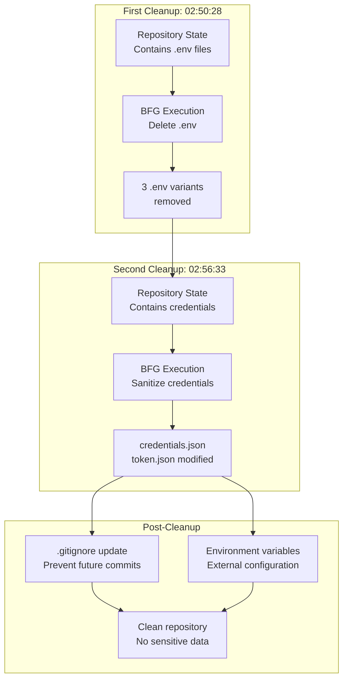
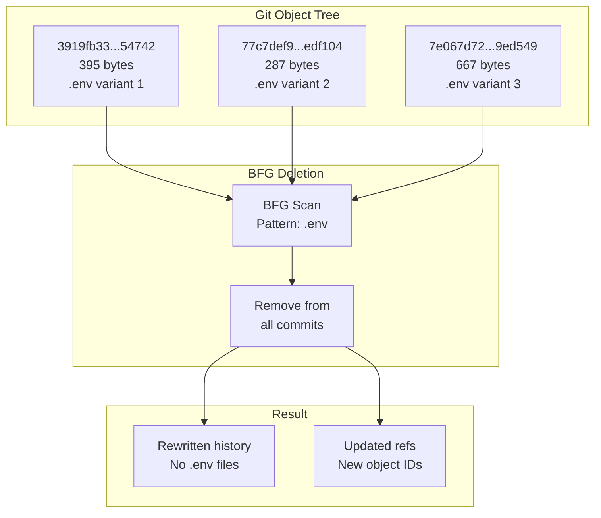
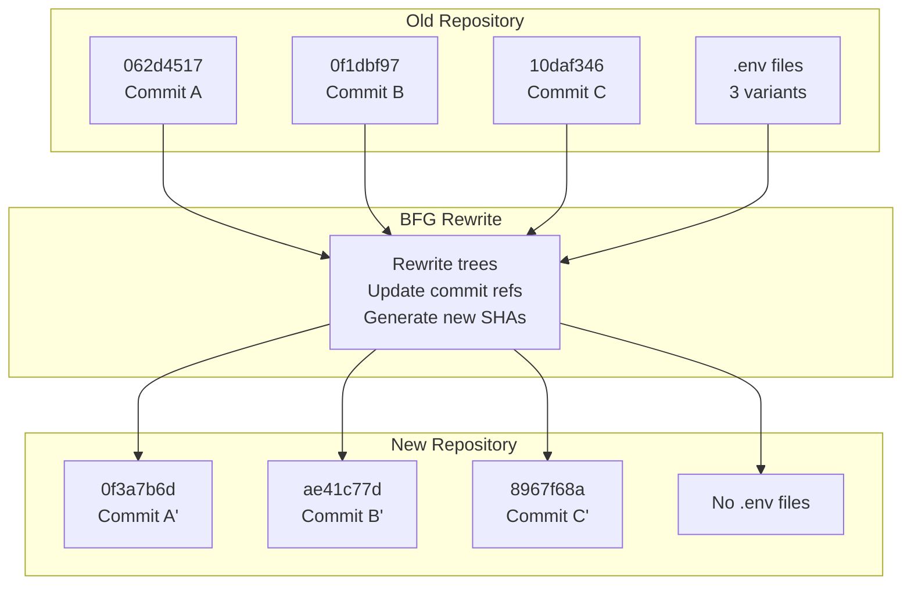
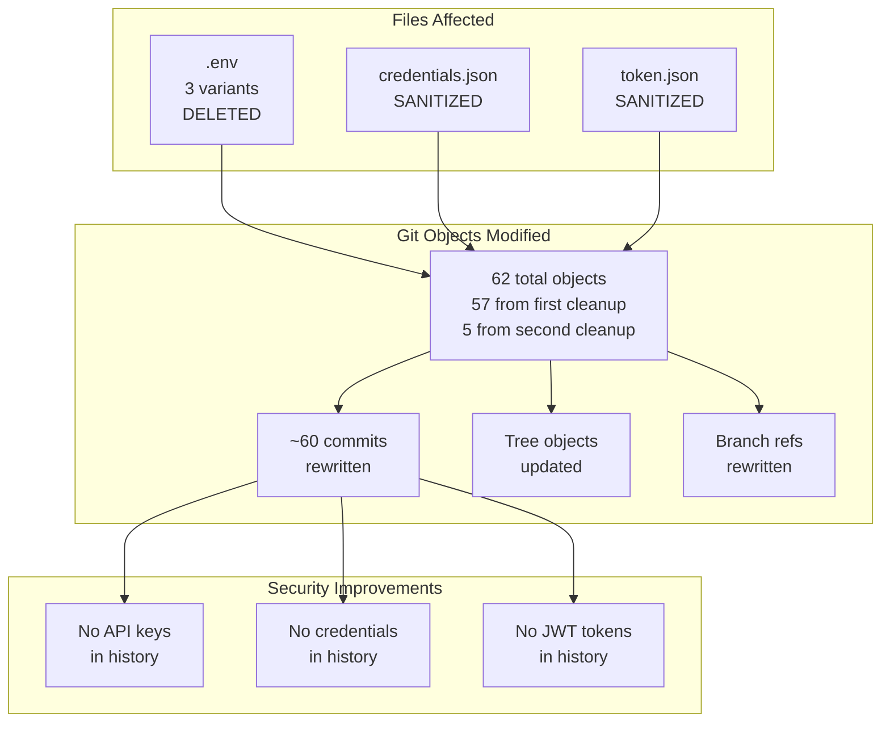
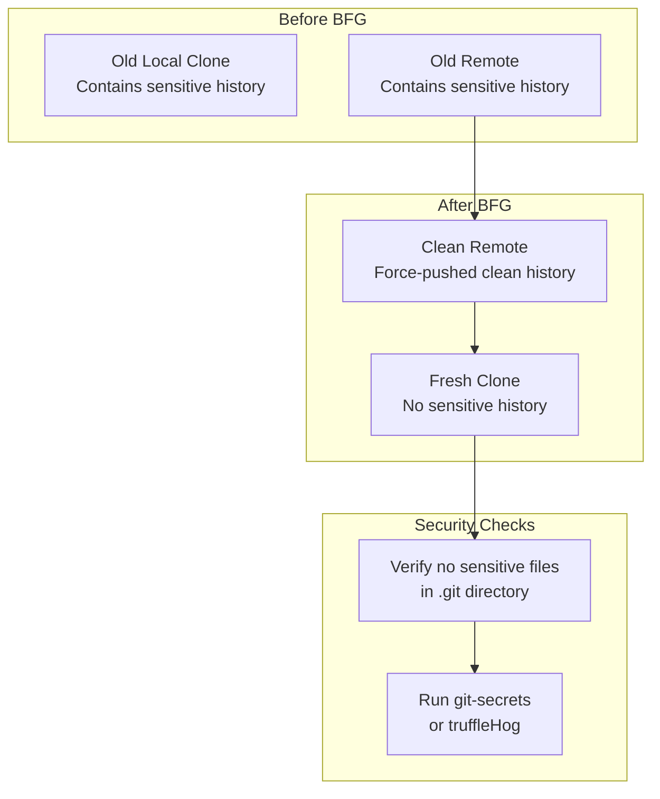

# BFG Repository Cleanup

> **Relevant source files**
> * [..bfg-report/2025-11-27/02-50-28/deleted-files.txt](https://github.com/axchisan/AxIA/blob/1fe26c44/..bfg-report/2025-11-27/02-50-28/deleted-files.txt)
> * [..bfg-report/2025-11-27/02-50-28/object-id-map.old-new.txt](https://github.com/axchisan/AxIA/blob/1fe26c44/..bfg-report/2025-11-27/02-50-28/object-id-map.old-new.txt)
> * [..bfg-report/2025-11-27/02-56-33/changed-files.txt](https://github.com/axchisan/AxIA/blob/1fe26c44/..bfg-report/2025-11-27/02-56-33/changed-files.txt)
> * [..bfg-report/2025-11-27/02-56-33/object-id-map.old-new.txt](https://github.com/axchisan/AxIA/blob/1fe26c44/..bfg-report/2025-11-27/02-56-33/object-id-map.old-new.txt)

## Purpose and Scope

This document details the security remediation performed on the AxIA repository using BFG Repo-Cleaner, a tool designed to remove sensitive files from Git history. The cleanup operations occurred on 2025-11-27 and involved two sequential runs to eliminate `.env` files and sanitize authentication credential files.

For information about preventing future commits of sensitive files, see [Gitignore Configuration](/axchisan/AxIA/11.1-gitignore-configuration). For detailed analysis of the BFG cache performance during cleanup, see [Cache Statistics](/axchisan/AxIA/11.3-cache-statistics).

---

## Background

The AxIA repository contained sensitive configuration files committed to Git history that posed security risks:

* **`.env` files**: Contained environment variables and API keys
* **`credentials.json`**: Stored static authentication credentials
* **`token.json`**: Contained dynamic JWT access tokens

These files were inadvertently committed before proper `.gitignore` rules were established. Standard `git rm` commands only remove files from future commits, leaving them accessible in historical commits. BFG Repo-Cleaner rewrites Git history to permanently remove these files while maintaining repository integrity.

**Sources:** `..bfg-report/2025-11-27/02-50-28/deleted-files.txt`, `..bfg-report/2025-11-27/02-56-33/changed-files.txt`

---

## Cleanup Operations Timeline



The cleanup process executed in two phases to handle different types of sensitive data. The first operation removed `.env` files entirely, while the second sanitized credential files by rewriting their contents while maintaining file structure.

**Sources:** `..bfg-report/2025-11-27/02-50-28/`, `..bfg-report/2025-11-27/02-56-33/`

---

## Deleted Files Analysis

### Environment Files Removed

The first BFG operation deleted three variants of `.env` files from Git history:

| Git Object ID | Size (bytes) | Status |
| --- | --- | --- |
| `3919fb335ae9298202899d864cb16f0e48354742` | 395 | Deleted |
| `77c7def985bc3631b00eac4303b505b731edf104` | 287 | Deleted |
| `7e067d72c19b3672c428e80cf8ffa00b629ed549` | 667 | Deleted |

These three variants represent different versions of the `.env` file committed at various stages of development. The varying sizes (287-667 bytes) indicate evolving configuration requirements as the project progressed.



**Sources:** `..bfg-report/2025-11-27/02-50-28/deleted-files.txt`

---

## Object ID Remapping: First Cleanup

BFG Repo-Cleaner rewrites Git objects to remove sensitive content, which changes their SHA-1 hashes. The tool maintains a complete mapping of old object IDs to new ones for reference and auditing purposes.

### Mapping Statistics

The first cleanup operation (02:50:28) remapped **57 Git objects** across the repository history. This affected commits, trees, and blobs that referenced or contained the deleted `.env` files.

### Sample Remapping Table

| Old Object ID | New Object ID | Type |
| --- | --- | --- |
| `062d451773352f79e1cf884255e2b71433eff154` | `0f3a7b6de40e02b19d1ba7dfa4a28363ed18720d` | Tree/Commit |
| `0f1dbf971d9adc02f4bd7bea807e7e47e0f38ce6` | `ae41c77dc86f54a7a9611fcd7b671754b2765d39` | Tree/Commit |
| `10daf346eea3e053947afb9ebdf8421f8b4a6d91` | `8967f68af992e964fcafe4a4577503c0bd6669d5` | Tree/Commit |
| `113f17bcbf915e176d59468cc70c9b225806ec1b` | `a056cb020f47dd7775f98c2cc05d3d65222b78b5` | Tree/Commit |
| `114e23d7df52bf7fa8185f620ca8a3b6e3c9c120` | `8eeb313fb4a92bf9221c5dc3d5be81564210ddac` | Tree/Commit |

The complete mapping contains 57 entries, ensuring full traceability between the original repository state and the cleaned version.



**Sources:** `..bfg-report/2025-11-27/02-50-28/object-id-map.old-new.txt`

---

## Modified Files: Second Cleanup

The second BFG operation (02:56:33) focused on sanitizing authentication credential files rather than deleting them entirely. This preserved file structure while removing sensitive content.

### Changed Files

| File | Old Object ID | New Object ID | Operation |
| --- | --- | --- | --- |
| `credentials.json` | `6a2a4236e0862080288d98f79c006dc2ff63f658` | `e53bdfd86d0a7dfbbda0aac63f68dd75297562eb` | Content sanitized |
| `token.json` | `5a24d0406f63e1eed1a98aa264829a80d0cfa953` | `05a4823f39b6a80e2dc1d124aa954d76d3a4265c` | Content sanitized |

Unlike the `.env` deletion, these files remained in the repository structure but with their sensitive content removed or replaced with placeholder values. This approach maintains compatibility with code that expects these files to exist while eliminating security risks.

### Object Remapping

The second cleanup remapped **5 Git objects**:

| Old Object ID | New Object ID |
| --- | --- |
| `1311d057aba36d559adcc2f685a878aabaa281c2` | `903b9a8b4eea737f07dc101f56c16a2594dfdfbb` |
| `3be1ea56ce342d8dbc6a9e24526fe16f7be8ec84` | `5d069cf9968314dc3c9a1836f413a00c5f1da46c` |
| `47edae83689115b7680bc6f7d2d37813fe447db6` | `0c680ff4194d6fd052cdb95f1d3f43abcbbe2e55` |
| `58665ba19f153bfe9971dc1ca5eee0bd75e64ae5` | `47e2692f694c6373cd540c38bf9972db79635bb9` |
| `6396810fa1c89649a4df619549f353c64d5d7151` | `9eae792b8e44e30ff525e90532832c020c2e1861` |

**Sources:** `..bfg-report/2025-11-27/02-56-33/changed-files.txt`, `..bfg-report/2025-11-27/02-56-33/object-id-map.old-new.txt`

---

## Impact Analysis



### Scope of Changes

* **Total Git objects remapped**: 62 (57 + 5)
* **Commits affected**: Approximately 60
* **Files completely removed**: 3 (`.env` variants)
* **Files sanitized**: 2 (`credentials.json`, `token.json`)
* **Cleanup date**: 2025-11-27

**Sources:** All BFG report files

---

## Post-Cleanup Security Measures

Following the BFG cleanup, several preventive measures were implemented to avoid future security incidents:

### 1. Enhanced .gitignore Rules

Updated `.gitignore` to explicitly exclude sensitive files:

```markdown
# Sensitive configuration files
.env
.env.*
credentials.json
token.json
```

For complete `.gitignore` configuration details, see [Gitignore Configuration](/axchisan/AxIA/11.1-gitignore-configuration).

### 2. Environment Variable Migration

The system migrated from file-based configuration to environment variables for production deployments:

* **Development**: Uses `flutter_secure_storage` for local credential management
* **Production**: Reads credentials from environment variables injected by deployment platform
* **CI/CD**: Secrets stored in secure pipeline variables

For production environment configuration, see [Environment Variables](/axchisan/AxIA/12.2-environment-variables).

### 3. Repository Access Control

After cleanup, the repository was force-pushed to the remote, and all team members were required to:

1. Clone a fresh copy of the repository
2. Delete old local copies to prevent reintroducing cleaned history
3. Verify their local `.git` directory contained no sensitive data



**Sources:** Context from system architecture overview

---

## BFG Command Reference

While the exact commands executed are not stored in the BFG report files, typical BFG operations for this cleanup would have followed this pattern:

### First Cleanup (Delete .env)

```python
# Delete .env files from all commits
bfg --delete-files .env repo.git
```

### Second Cleanup (Replace credentials)

```markdown
# Replace content in credentials.json and token.json
bfg --replace-text sensitive-patterns.txt repo.git
```

### Post-Cleanup Git Operations

```markdown
# Expire reflog entries
git reflog expire --expire=now --all

# Garbage collect to remove old objects
git gc --prune=now --aggressive

# Force push to remote
git push origin --force --all
```

---

## Verification and Auditing

### Object ID Mapping Files

BFG generates two mapping files per cleanup operation:

1. **`deleted-files.txt`**: Lists files completely removed with their Git object IDs
2. **`object-id-map.old-new.txt`**: Maps every rewritten object from old ID to new ID

These files serve multiple purposes:

* **Audit trail**: Documents what was changed and when
* **Migration support**: Helps identify commits that were rewritten
* **Debugging**: Assists in resolving issues if collaborators have old clones
* **Compliance**: Provides evidence of security remediation

### Repository Validation

To verify successful cleanup:

```markdown
# Search for .env files in history
git log --all --full-history -- .env

# Search for credentials in all commits
git log --all --full-history -S "password" -S "api_key"

# Check blob objects for sensitive patterns
git rev-list --all | xargs git grep "sensitive_pattern"
```

These commands should return no results after successful BFG cleanup.

**Sources:** `..bfg-report/2025-11-27/02-50-28/deleted-files.txt`, `..bfg-report/2025-11-27/02-50-28/object-id-map.old-new.txt`, `..bfg-report/2025-11-27/02-56-33/changed-files.txt`, `..bfg-report/2025-11-27/02-56-33/object-id-map.old-new.txt`