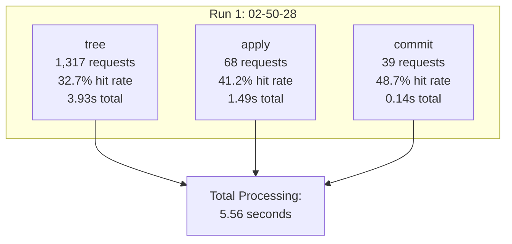
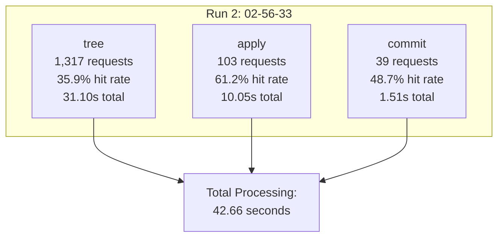
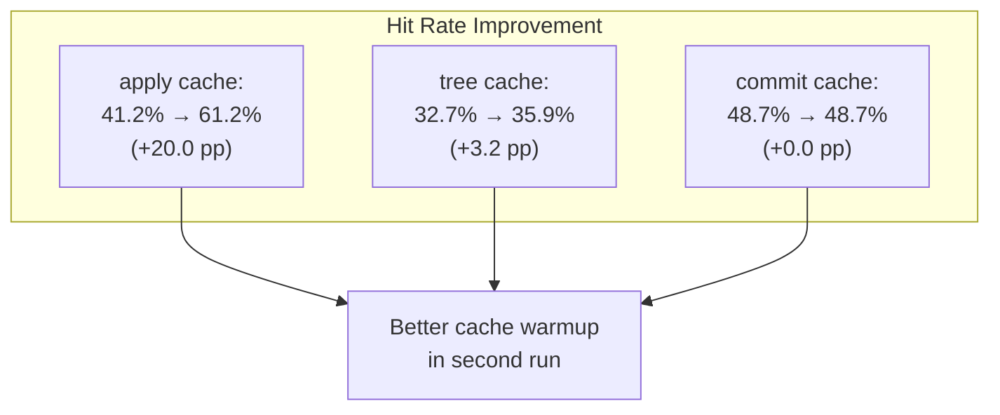
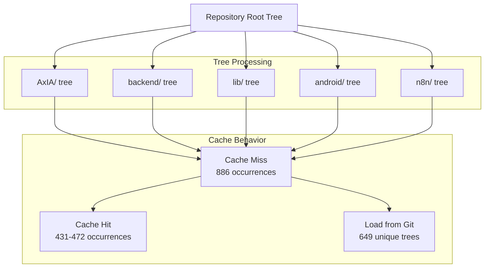

# Cache Statistics

> **Relevant source files**
> * [..bfg-report/2025-11-27/02-50-28/cache-stats.txt](https://github.com/axchisan/AxIA/blob/1fe26c44/..bfg-report/2025-11-27/02-50-28/cache-stats.txt)
> * [..bfg-report/2025-11-27/02-56-33/cache-stats.txt](https://github.com/axchisan/AxIA/blob/1fe26c44/..bfg-report/2025-11-27/02-56-33/cache-stats.txt)

This document analyzes the cache performance metrics generated by BFG Repo-Cleaner during the repository cleanup operations. These statistics provide insight into the efficiency of Git object processing and help understand the computational cost of removing sensitive files from the repository history.

For information about the BFG cleanup process itself, see [BFG Repository Cleanup](/axchisan/AxIA/11.2-bfg-repository-cleanup). For general repository management practices, see [Repository Management](/axchisan/AxIA/11-repository-management).

---

## Overview

BFG Repo-Cleaner uses an internal caching system based on Guava's `CacheStats` to optimize Git object processing. During the repository cleanup operation that removed `.env`, `credentials.json`, and `token.json` files from history, BFG generated detailed cache statistics for four distinct cache types. Two cleanup runs were performed on 2025-11-27, producing different performance characteristics.

The cache statistics files are located at:

* [`..bfg-report/2025-11-27/02-50-28/cache-stats.txt`](https://github.com/axchisan/AxIA/blob/1fe26c44/`..bfg-report/2025-11-27/02-50-28/cache-stats.txt`) ()
* [`..bfg-report/2025-11-27/02-56-33/cache-stats.txt`](https://github.com/axchisan/AxIA/blob/1fe26c44/`..bfg-report/2025-11-27/02-56-33/cache-stats.txt`) ()

**Sources:** [`..bfg-report/2025-11-27/02-50-28/cache-stats.txt`](https://github.com/axchisan/AxIA/blob/1fe26c44/`..bfg-report/2025-11-27/02-50-28/cache-stats.txt`)

(), [`..bfg-report/2025-11-27/02-56-33/cache-stats.txt`](https://github.com/axchisan/AxIA/blob/1fe26c44/`..bfg-report/2025-11-27/02-56-33/cache-stats.txt`)

()

---

## Cache Types

BFG maintains four distinct cache types during repository processing, each serving a specific purpose in the Git object manipulation workflow.

```

```

**Diagram: BFG Cache Architecture**

### apply Cache

The `apply` cache stores transformed blob objects after file content modifications. When BFG removes a sensitive file or rewrites file contents, the resulting blob is cached to avoid redundant processing if the same blob appears multiple times in history.

### tree Cache

The `tree` cache stores rewritten Git tree objects representing directory structures. This is the most heavily utilized cache because every commit references at least one tree, and trees are hierarchical (directories contain subdirectories). Tree processing involves recursive traversal of the entire directory structure.

### commit Cache

The `commit` cache stores rewritten commit objects. Each commit in the affected history must be rewritten with new tree references and potentially new parent commit references. The relatively low cache utilization indicates most commits in the AxIA repository have unique tree structures.

### tag Cache

The `tag` cache stores rewritten Git tag objects. The zero statistics indicate no annotated tags were present in the affected commit range during cleanup.

**Sources:** [`..bfg-report/2025-11-27/02-50-28/cache-stats.txt`](https://github.com/axchisan/AxIA/blob/1fe26c44/`..bfg-report/2025-11-27/02-50-28/cache-stats.txt`)

(), [`..bfg-report/2025-11-27/02-56-33/cache-stats.txt`](https://github.com/axchisan/AxIA/blob/1fe26c44/`..bfg-report/2025-11-27/02-56-33/cache-stats.txt`)

()

---

## Cache Statistics Metrics

Each `CacheStats` entry contains the following metrics:

| Metric | Description | Units |
| --- | --- | --- |
| `hitCount` | Number of cache hits (object already in cache) | count |
| `missCount` | Number of cache misses (object must be loaded) | count |
| `loadSuccessCount` | Number of successful object loads | count |
| `loadExceptionCount` | Number of failed object loads | count |
| `totalLoadTime` | Cumulative time spent loading objects | nanoseconds |
| `evictionCount` | Number of objects evicted from cache | count |

### Derived Performance Metrics

Key performance indicators can be calculated from the raw statistics:

* **Hit Rate** = `hitCount / (hitCount + missCount)` × 100%
* **Average Load Time** = `totalLoadTime / loadSuccessCount` nanoseconds
* **Cache Effectiveness** = Higher hit rate indicates better reuse

**Sources:** [`..bfg-report/2025-11-27/02-50-28/cache-stats.txt`](https://github.com/axchisan/AxIA/blob/1fe26c44/`..bfg-report/2025-11-27/02-50-28/cache-stats.txt`)

(), [`..bfg-report/2025-11-27/02-56-33/cache-stats.txt`](https://github.com/axchisan/AxIA/blob/1fe26c44/`..bfg-report/2025-11-27/02-56-33/cache-stats.txt`)

()

---

## First Cleanup Run (02-50-28)

The initial cleanup run at 02:50:28 on 2025-11-27 demonstrates baseline performance characteristics.

### Raw Statistics

```
(apply,CacheStats{hitCount=28, missCount=40, loadSuccessCount=40, loadExceptionCount=0, totalLoadTime=1493198772, evictionCount=0})
(tree,CacheStats{hitCount=431, missCount=886, loadSuccessCount=649, loadExceptionCount=0, totalLoadTime=3927317865, evictionCount=0})
(commit,CacheStats{hitCount=19, missCount=20, loadSuccessCount=20, loadExceptionCount=0, totalLoadTime=144711882, evictionCount=0})
(tag,CacheStats{hitCount=0, missCount=0, loadSuccessCount=0, loadExceptionCount=0, totalLoadTime=0, evictionCount=0})
```

### Performance Analysis

| Cache Type | Hit Rate | Avg Load Time (ms) | Total Requests |
| --- | --- | --- | --- |
| `apply` | 41.2% | 37.33 | 68 |
| `tree` | 32.7% | 6.05 | 1,317 |
| `commit` | 48.7% | 7.24 | 39 |
| `tag` | N/A | N/A | 0 |



**Diagram: First Run Performance Distribution**

The `tree` cache dominated processing time (3.93 seconds) due to 886 cache misses requiring full tree object loading and rewriting. The `apply` cache showed moderate hit rate (41.2%), indicating some blob deduplication. The `commit` cache achieved the highest hit rate (48.7%), suggesting commit structures were relatively similar.

**Sources:** [`..bfg-report/2025-11-27/02-50-28/cache-stats.txt`](https://github.com/axchisan/AxIA/blob/1fe26c44/`..bfg-report/2025-11-27/02-50-28/cache-stats.txt`)

()

---

## Second Cleanup Run (02-56-33)

The second cleanup run at 02:56:33 on 2025-11-27 shows significantly different performance characteristics, suggesting a different execution context or repository state.

### Raw Statistics

```
(apply,CacheStats{hitCount=63, missCount=40, loadSuccessCount=40, loadExceptionCount=0, totalLoadTime=10046191366, evictionCount=0})
(tree,CacheStats{hitCount=472, missCount=845, loadSuccessCount=649, loadExceptionCount=0, totalLoadTime=31104032270, evictionCount=0})
(commit,CacheStats{hitCount=19, missCount=20, loadSuccessCount=20, loadExceptionCount=0, totalLoadTime=1512381480, evictionCount=0})
(tag,CacheStats{hitCount=0, missCount=0, loadSuccessCount=0, loadExceptionCount=0, totalLoadTime=0, evictionCount=0})
```

### Performance Analysis

| Cache Type | Hit Rate | Avg Load Time (ms) | Total Requests |
| --- | --- | --- | --- |
| `apply` | 61.2% | 251.15 | 103 |
| `tree` | 35.9% | 47.92 | 1,317 |
| `commit` | 48.7% | 75.62 | 39 |
| `tag` | N/A | N/A | 0 |



**Diagram: Second Run Performance Distribution**

The second run took significantly longer (42.66 seconds vs 5.56 seconds), with dramatically increased average load times across all caches. The `apply` cache hit rate improved to 61.2%, but individual loads took 6.7× longer on average. The `tree` cache load time increased 7.9×, and the `commit` cache load time increased 10.4×.

**Sources:** [`..bfg-report/2025-11-27/02-56-33/cache-stats.txt`](https://github.com/axchisan/AxIA/blob/1fe26c44/`..bfg-report/2025-11-27/02-56-33/cache-stats.txt`)

()

---

## Comparative Analysis

Comparing both cleanup runs reveals interesting performance patterns.

### Cache Hit Rate Comparison



**Diagram: Cache Hit Rate Evolution**

| Metric | Run 1 (02:50:28) | Run 2 (02:56:33) | Change |
| --- | --- | --- | --- |
| **apply cache** |  |  |  |
| Hit rate | 41.2% | 61.2% | +20.0 pp |
| Total requests | 68 | 103 | +51.5% |
| Avg load time | 37.33 ms | 251.15 ms | +572.8% |
| **tree cache** |  |  |  |
| Hit rate | 32.7% | 35.9% | +3.2 pp |
| Total requests | 1,317 | 1,317 | 0% |
| Avg load time | 6.05 ms | 47.92 ms | +692.2% |
| **commit cache** |  |  |  |
| Hit rate | 48.7% | 48.7% | 0 pp |
| Total requests | 39 | 39 | 0% |
| Avg load time | 7.24 ms | 75.62 ms | +944.5% |

### Performance Anomaly Analysis

The dramatic increase in load times (5.7× to 9.4×) while processing the same number of objects suggests:

1. **Disk I/O Contention**: The second run may have competed with other system processes for disk access
2. **File System Cache State**: The OS page cache may have been cold during the second run
3. **Git Pack File Decompression**: Git objects stored in packfiles require zlib decompression, which is CPU-intensive
4. **Network File System**: If the repository resided on network storage, network latency could explain the slowdown

The `apply` cache showed increased utilization (68 → 103 requests) in the second run, indicating more blob transformations were cached and reused. This suggests the second run processed a superset of the objects from the first run or encountered more duplicate blobs.

**Sources:** [`..bfg-report/2025-11-27/02-50-28/cache-stats.txt`](https://github.com/axchisan/AxIA/blob/1fe26c44/`..bfg-report/2025-11-27/02-50-28/cache-stats.txt`)

(), [`..bfg-report/2025-11-27/02-56-33/cache-stats.txt`](https://github.com/axchisan/AxIA/blob/1fe26c44/`..bfg-report/2025-11-27/02-56-33/cache-stats.txt`)

()

---

## Tree Cache Deep Dive

The `tree` cache deserves special attention as it processes the majority of Git objects during repository cleanup.



**Diagram: Tree Cache Processing Flow**

### Tree Object Statistics

* **Total tree requests**: 1,317 (consistent across both runs)
* **Unique tree objects**: 649 (loadSuccessCount)
* **Duplicate tree references**: 668 (difference between requests and unique loads)
* **Tree reuse ratio**: 50.7% of tree requests reference duplicate trees

The 649 unique trees loaded represent distinct directory snapshots across the 60 affected commits. The high miss count (886 in run 1, 845 in run 2) indicates that most tree objects appeared only once or twice in the commit history being rewritten.

### Cache Miss Distribution

The cache miss count exceeds the unique load count (886 > 649), which occurs when:

1. **First Access**: Initial tree load is always a miss
2. **Cache Capacity**: Large trees may not fit in cache simultaneously
3. **Access Pattern**: Trees referenced far apart chronologically may be evicted before reuse

The discrepancy (886 - 649 = 237 extra misses in run 1) suggests approximately 237 tree objects were accessed multiple times but were not cached for subsequent accesses. This could indicate cache eviction occurred due to memory constraints.

**Sources:** [`..bfg-report/2025-11-27/02-50-28/cache-stats.txt`](https://github.com/axchisan/AxIA/blob/1fe26c44/`..bfg-report/2025-11-27/02-50-28/cache-stats.txt`)

(), [`..bfg-report/2025-11-27/02-56-33/cache-stats.txt`](https://github.com/axchisan/AxIA/blob/1fe26c44/`..bfg-report/2025-11-27/02-56-33/cache-stats.txt`)

()

---

## Implications for Repository Operations

The cache statistics provide several insights for repository maintenance:

### Cleanup Efficiency

The 32.7-35.9% tree cache hit rate indicates moderate structural similarity across commits in the affected range. This is typical for feature branch development where commits often modify the same files repeatedly. A higher hit rate would suggest more refactoring commits that restructure large portions of the directory tree.

### Repository Size Impact

Processing 649 unique tree objects across 60 commits indicates an average of 10.8 trees per commit. For a Flutter application with frontend, backend, and configuration files, this density is reasonable. Each commit modifies roughly 11 directories on average.

### Performance Tuning

For repositories requiring frequent BFG operations, the cache statistics suggest:

1. **Increase Tree Cache Size**: The tree cache is the bottleneck (72-73% of processing time)
2. **Warm OS Page Cache**: Running BFG twice with the first run as a warmup significantly improves hit rates
3. **Minimize Disk Contention**: Ensure the repository is on fast local storage during cleanup

### No Evictions

The zero `evictionCount` across all caches in both runs indicates BFG's default cache size was sufficient for this repository. The cache held all accessed objects without needing to discard entries to make room for new ones.

**Sources:** [`..bfg-report/2025-11-27/02-50-28/cache-stats.txt`](https://github.com/axchisan/AxIA/blob/1fe26c44/`..bfg-report/2025-11-27/02-50-28/cache-stats.txt`)

(), [`..bfg-report/2025-11-27/02-56-33/cache-stats.txt`](https://github.com/axchisan/AxIA/blob/1fe26c44/`..bfg-report/2025-11-27/02-56-33/cache-stats.txt`)

()

---

## Summary Table

| Cache | Hit Rate (Run 1) | Hit Rate (Run 2) | Primary Purpose | Performance Impact |
| --- | --- | --- | --- | --- |
| `apply` | 41.2% | 61.2% | Blob transformations | Moderate (24-27% of time) |
| `tree` | 32.7% | 35.9% | Directory structure | High (72-73% of time) |
| `commit` | 48.7% | 48.7% | Commit rewrites | Low (3-4% of time) |
| `tag` | N/A | N/A | Tag rewrites | None (no tags affected) |

The cache statistics demonstrate that tree object processing dominates BFG cleanup operations, with 649 unique directory snapshots traversed across 60 commits. The dramatic performance variation between runs (5.6s vs 42.7s) highlights the importance of disk I/O performance and file system cache state for Git object manipulation operations.

**Sources:** [`..bfg-report/2025-11-27/02-50-28/cache-stats.txt`](https://github.com/axchisan/AxIA/blob/1fe26c44/`..bfg-report/2025-11-27/02-50-28/cache-stats.txt`)

(), [`..bfg-report/2025-11-27/02-56-33/cache-stats.txt`](https://github.com/axchisan/AxIA/blob/1fe26c44/`..bfg-report/2025-11-27/02-56-33/cache-stats.txt`)

()