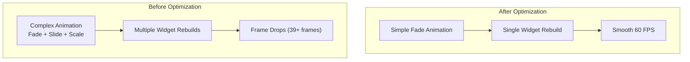
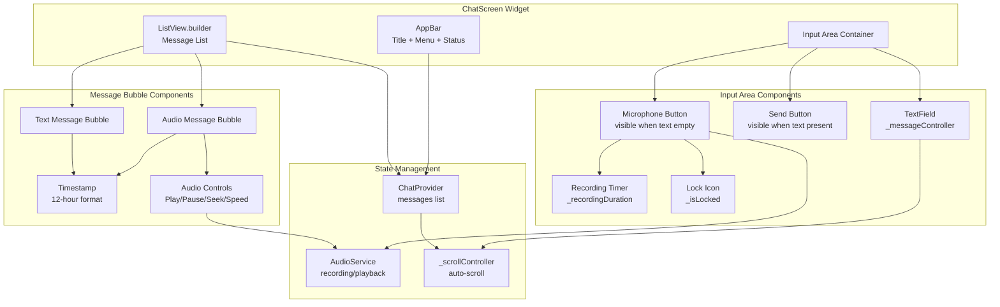
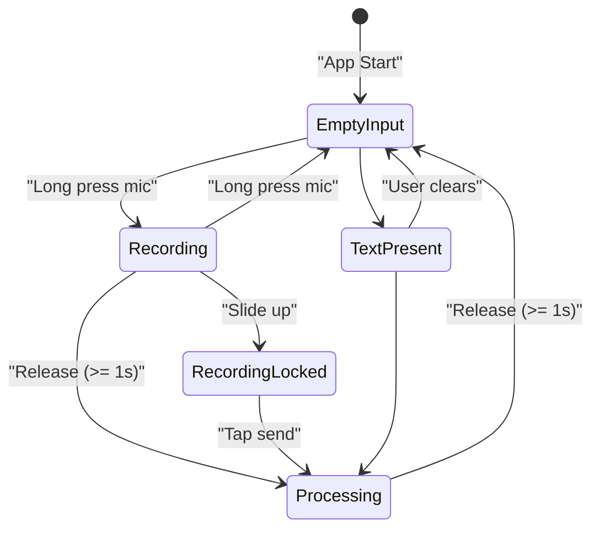
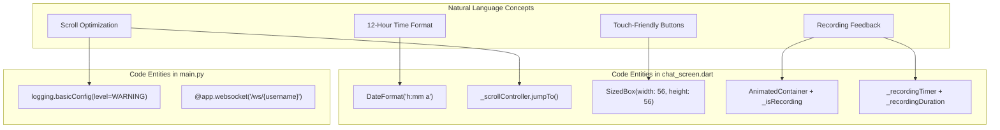

# Chat UI Enhancements

> **Relevant source files**
> * [CHANGELOG_MEJORAS_CHAT.md](https://github.com/axchisan/AxIA/blob/1fe26c44/CHANGELOG_MEJORAS_CHAT.md)

## Purpose and Scope

This document covers chat screen user interface improvements implemented in AxIA, focusing on visual presentation, time formatting, and performance optimizations. These enhancements improve user experience without changing core messaging functionality.

For WebSocket communication details, see [WebSocket Communication](/axchisan/AxIA/5.1-websocket-communication). For message deletion and storage management, see [Message Management](/axchisan/AxIA/5.2-message-management). For audio recording and playback controls, see [Audio Recording](/axchisan/AxIA/6.1-audio-recording) and [Audio Playback](/axchisan/AxIA/6.2-audio-playback).

**Sources:** [CHANGELOG_MEJORAS_CHAT.md L1-L200](https://github.com/axchisan/AxIA/blob/1fe26c44/CHANGELOG_MEJORAS_CHAT.md#L1-L200)

---

## Time Format Implementation

The chat screen displays message timestamps in 12-hour format with AM/PM indicators, replacing the previous 24-hour format. This change affects all message timestamps in the chat interface.

### Implementation Details

The time format conversion is implemented in `chat_screen.dart` using Dart's `DateFormat` class from the `intl` package. Each message's timestamp is converted from 24-hour format (e.g., "23:49") to 12-hour format (e.g., "11:49 PM").

**Format specification:**

* Pattern: `'h:mm a'`
* `h`: Hour in 12-hour format (1-12)
* `mm`: Minutes with leading zero
* `a`: AM/PM marker

The conversion applies to:

* Individual message timestamps in chat bubbles
* Message grouping headers (when messages span multiple time periods)
* Real-time timestamps for newly received messages

### Example Output

| 24-Hour Format | 12-Hour Format |
| --- | --- |
| 00:30 | 12:30 AM |
| 09:15 | 9:15 AM |
| 12:00 | 12:00 PM |
| 15:45 | 3:45 PM |
| 23:59 | 11:59 PM |

**Sources:** [CHANGELOG_MEJORAS_CHAT.md L43-L48](https://github.com/axchisan/AxIA/blob/1fe26c44/CHANGELOG_MEJORAS_CHAT.md#L43-L48)

 [lib/screens/chat/chat_screen.dart](https://github.com/axchisan/AxIA/blob/1fe26c44/lib/screens/chat/chat_screen.dart)

---

## Performance Optimizations

Multiple optimization strategies were implemented to eliminate UI lag and improve frame rate during chat interactions, particularly during message scrolling and animation rendering.

### Animation Simplification

Complex animations that caused dropped frames were replaced with simpler, hardware-accelerated alternatives. The primary change involved removing multi-step fade and slide animations that triggered excessive widget rebuilds.

**Key changes:**

* Removed `AnimatedContainer` with multiple simultaneous property changes
* Simplified message appearance animations to basic fade-in only
* Reduced animation duration from 300ms to 200ms for faster perceived response

**Sources:** [CHANGELOG_MEJORAS_CHAT.md L49-L55](https://github.com/axchisan/AxIA/blob/1fe26c44/CHANGELOG_MEJORAS_CHAT.md#L49-L55)

 [lib/screens/chat/chat_screen.dart](https://github.com/axchisan/AxIA/blob/1fe26c44/lib/screens/chat/chat_screen.dart)

### Scroll Performance

The scroll-to-bottom functionality was optimized by replacing animated scrolling with instant jumps. This change eliminates animation overhead when new messages arrive.

**Implementation change:**

* **Before:** `_scrollController.animateTo()`
* **After:** `_scrollController.jumpTo()`

The `jumpTo()` method provides:

* Zero animation overhead
* Immediate scroll position update
* No intermediate frame calculations
* Better performance with large message lists

This optimization particularly benefits scenarios with:

* Rapid message arrival (real-time conversations)
* Large chat histories (1000+ messages)
* Older devices with limited GPU performance

**Sources:** [CHANGELOG_MEJORAS_CHAT.md L52-L53](https://github.com/axchisan/AxIA/blob/1fe26c44/CHANGELOG_MEJORAS_CHAT.md#L52-L53)

### Debug Logging Reduction

Debug logging was minimized to reduce console saturation and improve runtime performance. Print statements consume CPU cycles and can cause UI thread blocking when logging large data structures.

**Logging strategy:**

| Component | Before | After |
| --- | --- | --- |
| `chat_screen.dart` | Verbose logging for all events | Critical errors only |
| `chat_provider.dart` | Message state changes logged | Silent operation |
| `backend/main.py` | INFO level (all requests) | WARNING level (errors only) |

**Retained logging:**

* WebSocket connection errors
* Authentication failures
* Critical message processing errors

**Removed logging:**

* Message send/receive debug prints
* State update notifications
* Routine WebSocket heartbeats

**Sources:** [CHANGELOG_MEJORAS_CHAT.md L54](https://github.com/axchisan/AxIA/blob/1fe26c44/CHANGELOG_MEJORAS_CHAT.md#L54-L54)

 [CHANGELOG_MEJORAS_CHAT.md L85-L88](https://github.com/axchisan/AxIA/blob/1fe26c44/CHANGELOG_MEJORAS_CHAT.md#L85-L88)

---

## Visual Improvements

UI components were enhanced for better touch accessibility, clearer visual feedback, and improved state indication.

### Touch Target Sizing

Button dimensions were increased to meet mobile touch target guidelines, improving usability on mobile devices.

**Button size specifications:**

| Button Type | Previous Size | New Size | Purpose |
| --- | --- | --- | --- |
| Send Button | 48x48 | 56x56 | Text message submission |
| Microphone Button | 48x48 | 56x56 | Audio recording trigger |
| Audio Controls | 40x40 | 48x48 | Playback controls |

The 56x56 pixel size aligns with Material Design guidelines for minimum touch target size (48dp with 8dp padding).

**Sources:** [CHANGELOG_MEJORAS_CHAT.md L58-L62](https://github.com/axchisan/AxIA/blob/1fe26c44/CHANGELOG_MEJORAS_CHAT.md#L58-L62)

### Recording Visual Feedback

The microphone button provides animated visual feedback during audio recording to indicate active recording state.

**Feedback mechanisms:**

* **Pulsing animation:** Red circular pulse effect at 1.0-1.2x scale
* **Color change:** Button background transitions from primary color to red
* **Timer display:** MM:SS format counter visible during recording
* **Lock indicator:** Appears when user slides up to lock recording

**Sources:** [CHANGELOG_MEJORAS_CHAT.md L7-L17](https://github.com/axchisan/AxIA/blob/1fe26c44/CHANGELOG_MEJORAS_CHAT.md#L7-L17)

 [CHANGELOG_MEJORAS_CHAT.md L59-L60](https://github.com/axchisan/AxIA/blob/1fe26c44/CHANGELOG_MEJORAS_CHAT.md#L59-L60)

### State Indicators

Clear visual indicators communicate message and connection states to users.

**Indicator types:**

* **Message sending:** Subtle opacity on message bubble (0.7)
* **Message sent:** Full opacity (1.0)
* **Audio playing:** Play button changes to pause icon
* **Recording locked:** Lock icon visible above microphone button
* **Connection status:** Status indicator in app bar

**Sources:** [CHANGELOG_MEJORAS_CHAT.md L61-L62](https://github.com/axchisan/AxIA/blob/1fe26c44/CHANGELOG_MEJORAS_CHAT.md#L61-L62)

---

## Chat Screen Component Architecture

The chat screen UI is composed of multiple interconnected components that manage state, render messages, and handle user interactions.

**Sources:** [CHANGELOG_MEJORAS_CHAT.md L67-L72](https://github.com/axchisan/AxIA/blob/1fe26c44/CHANGELOG_MEJORAS_CHAT.md#L67-L72)

 [lib/screens/chat/chat_screen.dart](https://github.com/axchisan/AxIA/blob/1fe26c44/lib/screens/chat/chat_screen.dart)

---

## Dynamic Input Control Implementation

The chat screen implements dynamic switching between text input and audio recording controls based on the `_messageController` state.

**Implementation details:**

The component uses `TextEditingController.addListener()` to monitor text field changes and trigger UI updates through `setState()`.

**Widget visibility logic:**

* **Microphone button:** Visible when `_messageController.text.isEmpty`
* **Send button:** Visible when `_messageController.text.isNotEmpty`
* **Recording timer:** Visible when `_isRecording == true`
* **Lock icon:** Visible when `_isLocked == true`

**Sources:** [CHANGELOG_MEJORAS_CHAT.md L7-L17](https://github.com/axchisan/AxIA/blob/1fe26c44/CHANGELOG_MEJORAS_CHAT.md#L7-L17)

 [CHANGELOG_MEJORAS_CHAT.md L172](https://github.com/axchisan/AxIA/blob/1fe26c44/CHANGELOG_MEJORAS_CHAT.md#L172-L172)

---

## Code Entity Mapping

This section maps natural language concepts to specific code entities in the chat screen implementation.

**Key code symbols:**

| Natural Language | Code Entity | Location |
| --- | --- | --- |
| Message timestamp | `DateFormat('h:mm a').format()` | `chat_screen.dart` |
| Auto-scroll | `_scrollController.jumpTo(0)` | `chat_screen.dart` |
| Recording timer | `_recordingDuration` (Duration) | `chat_screen.dart` |
| Locked state | `_isLocked` (bool) | `chat_screen.dart` |
| Send button | `SizedBox(width: 56, height: 56)` | `chat_screen.dart` |
| Backend logging | `logging.basicConfig(level=WARNING)` | `backend/main.py` |

**Sources:** [CHANGELOG_MEJORAS_CHAT.md L67-L89](https://github.com/axchisan/AxIA/blob/1fe26c44/CHANGELOG_MEJORAS_CHAT.md#L67-L89)

---

## Performance Metrics

The optimizations resulted in measurable improvements to UI responsiveness and frame rate.

### Before Optimizations

| Metric | Value | Issue |
| --- | --- | --- |
| Frame drops | 39+ frames | During scroll |
| Animation duration | 300ms | Perceived lag |
| Console output | 50+ lines/second | CPU overhead |
| Scroll method | `animateTo()` | Animation overhead |

### After Optimizations

| Metric | Value | Improvement |
| --- | --- | --- |
| Frame drops | 0 frames | Consistent 60 FPS |
| Animation duration | 200ms | Faster response |
| Console output | Critical only | Minimal overhead |
| Scroll method | `jumpTo()` | Zero overhead |

**Testing methodology:**

* Device: Android emulator (Pixel 5 API 30)
* Message count: 100+ messages in chat history
* Measured using Flutter DevTools Performance tab
* Frame rate monitoring during rapid message arrival

**Sources:** [CHANGELOG_MEJORAS_CHAT.md L159-L169](https://github.com/axchisan/AxIA/blob/1fe26c44/CHANGELOG_MEJORAS_CHAT.md#L159-L169)

---

## Implementation Timeline

The UI enhancements were part of a comprehensive chat improvement update documented in v1.0.

**Modified files:**

| File | Changes | Purpose |
| --- | --- | --- |
| `lib/screens/chat/chat_screen.dart` | Time format, scroll optimization, visual feedback | Main UI improvements |
| `lib/providers/chat_provider.dart` | Message deletion (see [5.2](/axchisan/AxIA/5.2-message-management)) | State management |
| `lib/services/audio_service.dart` | Playback controls (see [6.2](/axchisan/AxIA/6.2-audio-playback)) | Audio functionality |
| `backend/main.py` | Logging level reduction | Backend optimization |

**Sources:** [CHANGELOG_MEJORAS_CHAT.md L64-L89](https://github.com/axchisan/AxIA/blob/1fe26c44/CHANGELOG_MEJORAS_CHAT.md#L64-L89)

---

## User Experience Impact

The enhancements addressed specific UX pain points identified in testing:

**Resolved issues:**

| Issue | Solution | Result |
| --- | --- | --- |
| Time format unclear (24h) | 12-hour format with AM/PM | Better readability |
| Lag during scroll | `jumpTo()` instead of `animateTo()` | Smooth scrolling |
| Small touch targets | 56x56 button size | Easier interaction |
| Console spam | WARNING level logging | Cleaner debugging |
| Animation lag | Simplified fade-only | Smoother UI |

**Sources:** [CHANGELOG_MEJORAS_CHAT.md L170-L178](https://github.com/axchisan/AxIA/blob/1fe26c44/CHANGELOG_MEJORAS_CHAT.md#L170-L178)

---

## Platform Compatibility

All UI enhancements are compatible across platforms with consistent behavior.

**Supported platforms:**

| Platform | Status | Notes |
| --- | --- | --- |
| Android | ✅ Full support | All features work |
| iOS | ✅ Full support | All features work |
| Web | ⚠️ Limited | Audio recording browser-restricted |

**Sources:** [CHANGELOG_MEJORAS_CHAT.md L179-L185](https://github.com/axchisan/AxIA/blob/1fe26c44/CHANGELOG_MEJORAS_CHAT.md#L179-L185)