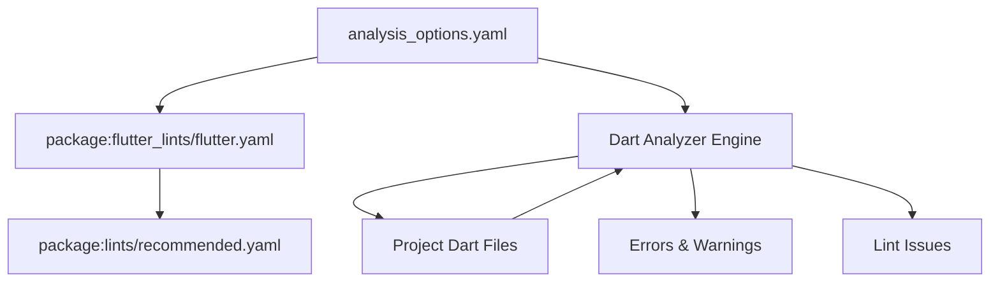
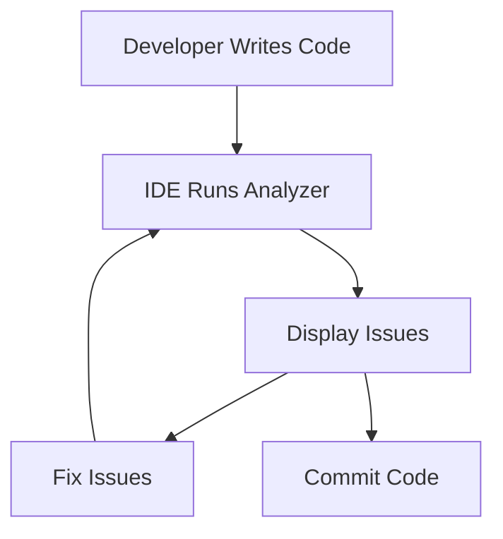
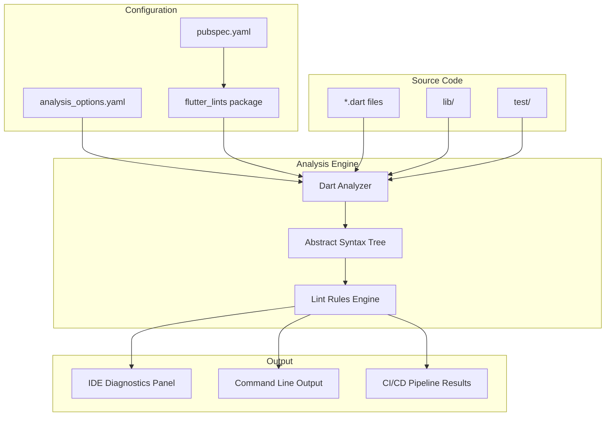

# Code Analysis

> **Relevant source files**
> * [analysis_options.yaml](https://github.com/axchisan/AxIA/blob/1fe26c44/analysis_options.yaml)

## Purpose and Scope

This document explains the Dart analyzer configuration for the AxIA Flutter application. It covers the static analysis rules, lint configurations, and error handling policies defined in the project. For information about Flutter project metadata and version management, see [Flutter Metadata](/axchisan/AxIA/10.2-flutter-metadata). For general project configuration details, see [Project Configuration](/axchisan/AxIA/2.1-project-configuration).

---

## Overview

The AxIA project uses the Dart analyzer to perform static analysis on all Dart code. The analyzer identifies potential errors, warnings, and code quality issues before runtime, helping maintain code consistency and catch bugs early in the development process.

The analyzer can be invoked through:

* IDE integration (VS Code, Android Studio, IntelliJ)
* Command line via `flutter analyze`
* Continuous integration pipelines

All analyzer behavior is configured through the `analysis_options.yaml` file located at the project root.

**Sources:** [analysis_options.yaml L1-L14](https://github.com/axchisan/AxIA/blob/1fe26c44/analysis_options.yaml#L1-L14)

---

## Configuration Structure

### File Organization

The analyzer configuration file follows a standard YAML structure with two primary sections:

```yaml
analyzer:
  # Error-level customizations
  
include: package:flutter_lints/flutter.yaml

linter:
  # Lint rule customizations
```

This hierarchical structure separates:

1. **Analyzer settings** - Controls error severity levels
2. **Base rule set** - Imports recommended Flutter lints
3. **Linter customizations** - Enables/disables specific rules

**Sources:** [analysis_options.yaml L10-L33](https://github.com/axchisan/AxIA/blob/1fe26c44/analysis_options.yaml#L10-L33)

---

## Flutter Lints Package

### Base Rule Set

The project uses the official `flutter_lints` package as its foundation:

```yaml
include: package:flutter_lints/flutter.yaml
```

This package provides a curated set of lint rules specifically designed for Flutter applications. It includes:

* Dart language best practices
* Flutter-specific coding patterns
* Recommended code style conventions
* Common error prevention rules

The `flutter_lints` package is maintained by the Flutter team and represents their official recommendations for code quality.



**Diagram: Analyzer Configuration Chain**

The configuration cascades from the most general (recommended lints) through Flutter-specific rules to project-specific customizations.

**Sources:** [analysis_options.yaml L14](https://github.com/axchisan/AxIA/blob/1fe26c44/analysis_options.yaml#L14-L14)

---

## Error Severity Customization

### Ignored Error Categories

The project customizes error severity for specific analyzer diagnostics:

| Error Code | Default Severity | Custom Severity | Rationale |
| --- | --- | --- | --- |
| `unused_import` | warning | ignore | Allows temporary imports during development |
| `unused_local_variable` | warning | ignore | Permits debugging variables that aren't used |

Configuration in code:

```yaml
analyzer:
  errors:
    unused_import: ignore
    unused_local_variable: ignore
```

These customizations reduce noise during active development while not compromising actual error detection. Developers can still see these issues in their IDE's hint system, but they won't cause `flutter analyze` to fail in CI/CD pipelines.

**Sources:** [analysis_options.yaml L10-L13](https://github.com/axchisan/AxIA/blob/1fe26c44/analysis_options.yaml#L10-L13)

---

## Lint Rules System

### Rule Customization Mechanism

The `linter` section allows enabling or disabling individual lint rules:

```yaml
linter:
  rules:
    # avoid_print: false  # Uncomment to disable the `avoid_print` rule
    # prefer_single_quotes: true  # Uncomment to enable the `prefer_single_quotes` rule
```

Currently, the project uses all default rules from `flutter_lints` without additional customizations. The commented examples demonstrate how to:

1. **Disable a rule**: Set to `false`
2. **Enable a rule**: Set to `true` (if not already enabled by base package)

### Common Lint Rule Categories

While AxIA doesn't customize individual rules, the inherited `flutter_lints` package includes rules in these categories:

| Category | Purpose | Example Rules |
| --- | --- | --- |
| Error Prevention | Catch potential runtime errors | `prefer_is_empty`, `avoid_null_checks_in_equality_operators` |
| Style Consistency | Enforce naming conventions | `camelcase_types`, `library_names` |
| Best Practices | Promote maintainable code | `use_key_in_widget_constructors`, `avoid_print` |
| Performance | Identify inefficient patterns | `avoid_unnecessary_containers` |

**Sources:** [analysis_options.yaml L16-L29](https://github.com/axchisan/AxIA/blob/1fe26c44/analysis_options.yaml#L16-L29)

---

## Inline Suppression

### Per-Line Suppression

Developers can suppress specific lint rules for individual lines:

```python
// ignore: avoid_print
print('Debug message');
```

This approach is useful for legitimate exceptions where the rule shouldn't apply.

### Per-File Suppression

To suppress a rule for an entire file:

```python
// ignore_for_file: avoid_print

void main() {
  print('Application starting');
  print('Loading configuration');
}
```

The file-level directive appears at the top of the Dart file and applies to all code within that file.

**Sources:** [analysis_options.yaml L22-L25](https://github.com/axchisan/AxIA/blob/1fe26c44/analysis_options.yaml#L22-L25)

---

## Analysis Workflow

### Development Workflow



**Diagram: Real-time Analysis Loop**

The analyzer runs continuously in the IDE, providing immediate feedback as developers write code.

### Command Line Usage

```markdown
# Analyze entire project
flutter analyze

# Analyze with verbose output
flutter analyze --verbose

# Write analysis results to file
flutter analyze > analysis_report.txt
```

Exit codes:

* `0` - No issues found
* `1` - Errors or warnings detected
* `2` - Analysis could not complete

---

## Integration Points

### Analyzer Components



**Diagram: Analyzer System Architecture**

This diagram shows how configuration files, source code, and the analyzer engine interact to produce diagnostics in various development contexts.

**Sources:** [analysis_options.yaml L1-L33](https://github.com/axchisan/AxIA/blob/1fe26c44/analysis_options.yaml#L1-L33)

---

## Configuration Reference

### Complete File Structure

```yaml
# File header with documentation
# Location: analysis_options.yaml:1-6

analyzer:
  # Error severity overrides
  errors:
    unused_import: ignore
    unused_local_variable: ignore

# Base rule set inclusion
include: package:flutter_lints/flutter.yaml

linter:
  # Project-specific rule customizations
  rules:
    # Currently using all default rules
    # Examples for future customization provided
```

**Sources:** [analysis_options.yaml L1-L33](https://github.com/axchisan/AxIA/blob/1fe26c44/analysis_options.yaml#L1-L33)

---

## Best Practices

### When to Customize Rules

**Recommended customizations:**

* Suppressing false positives specific to your project architecture
* Enabling stricter rules for critical code paths
* Disabling rules that conflict with team coding standards

**Not recommended:**

* Disabling rules to avoid fixing legitimate issues
* Creating inconsistent standards across team members
* Ignoring error prevention rules

### Maintaining Configuration

1. **Review periodically** - As `flutter_lints` updates, review new rules
2. **Document exceptions** - Add comments explaining why rules are disabled
3. **Team consensus** - Ensure all developers agree on customizations
4. **Keep minimal** - Only customize what's necessary

---

## Related Files

| File | Purpose | Relationship |
| --- | --- | --- |
| `pubspec.yaml` | Declares `flutter_lints` dependency | Provides lint rule package |
| `.dart_tool/` | Contains analyzer cache | Generated by analyzer |
| `lib/**/*.dart` | Application source code | Analyzed files |
| `test/**/*.dart` | Test code | Analyzed files |

---

## Summary

The AxIA project uses a standard, minimal analyzer configuration that:

1. Inherits all rules from `flutter_lints` package
2. Ignores `unused_import` and `unused_local_variable` warnings for development flexibility
3. Provides inline suppression mechanisms for exceptional cases
4. Integrates with IDE and CI/CD workflows
5. Maintains code quality without creating unnecessary friction

This configuration balances code quality enforcement with developer productivity, ensuring consistent code standards across the project while allowing reasonable flexibility during development.

**Sources:** [analysis_options.yaml L1-L33](https://github.com/axchisan/AxIA/blob/1fe26c44/analysis_options.yaml#L1-L33)