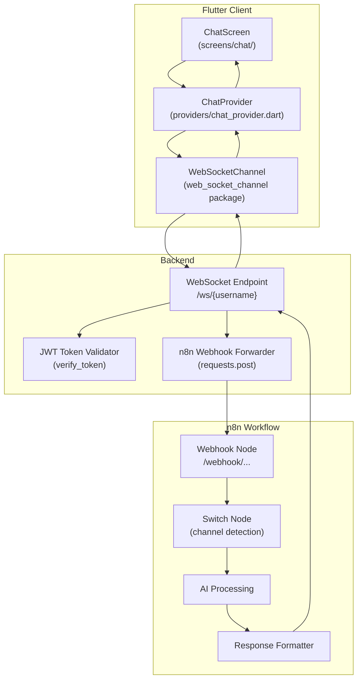
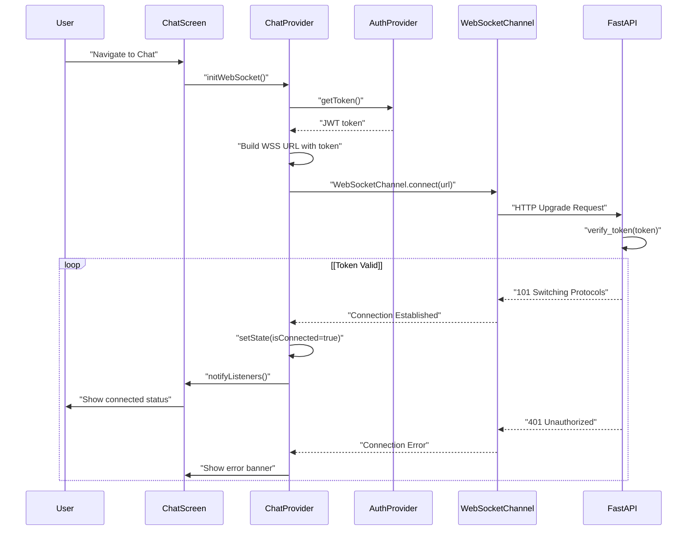
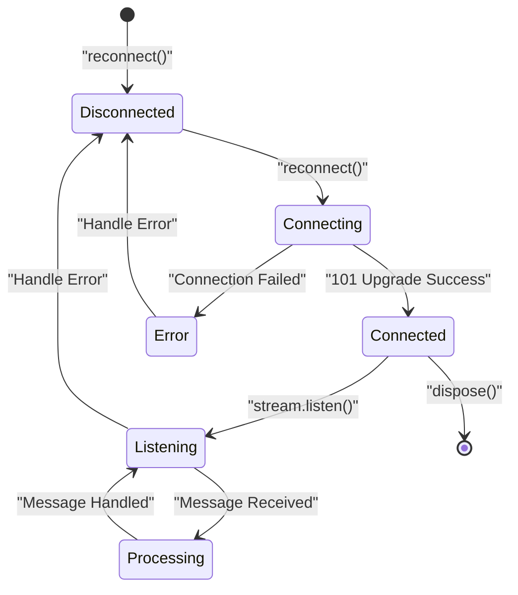
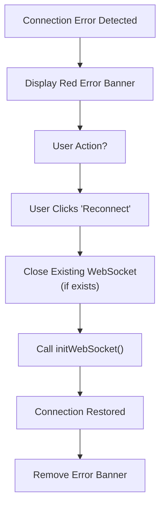
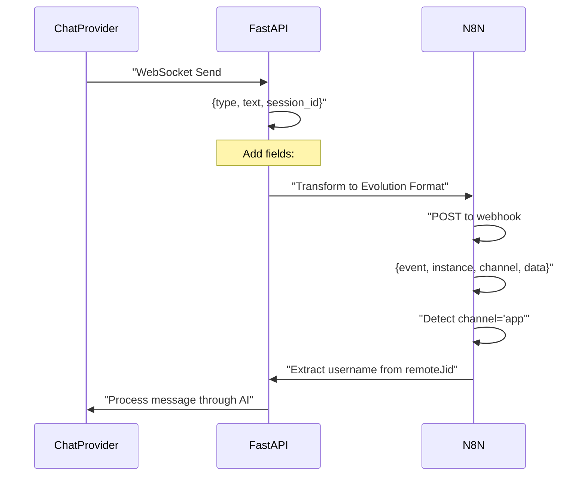
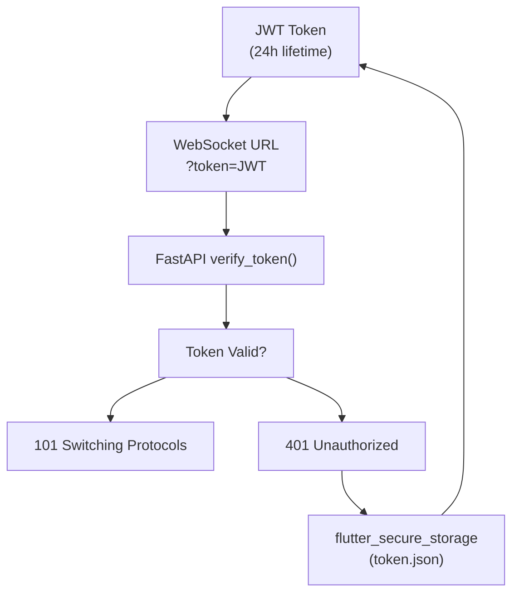
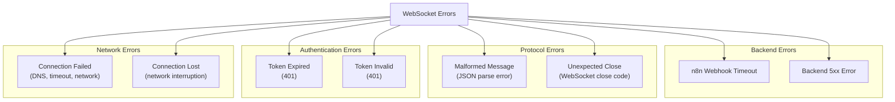
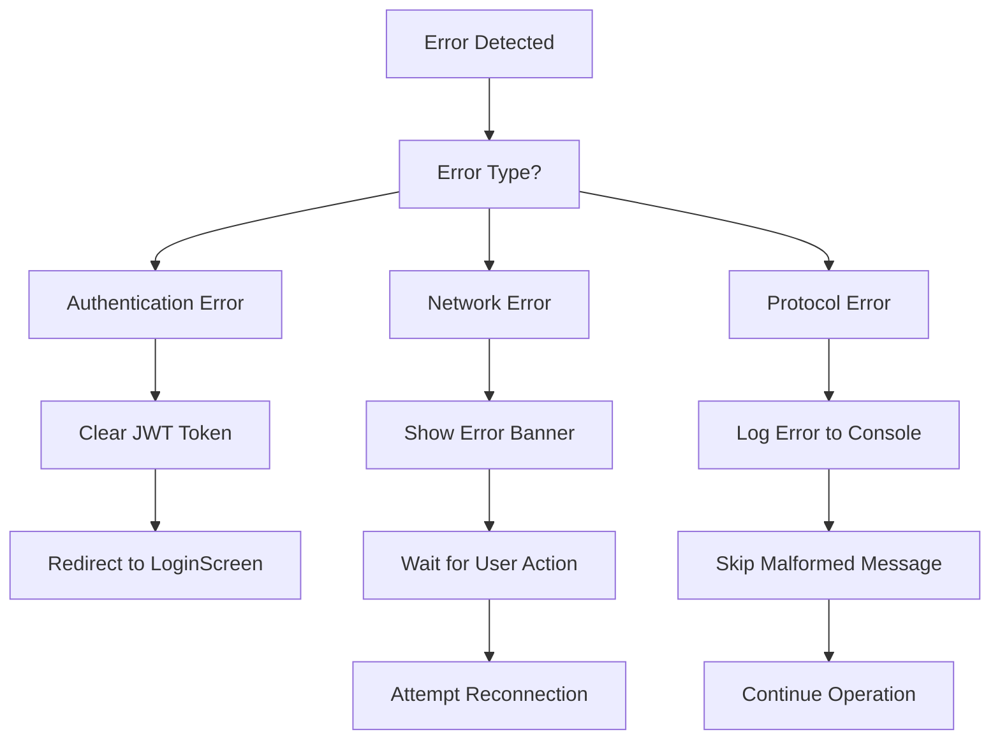
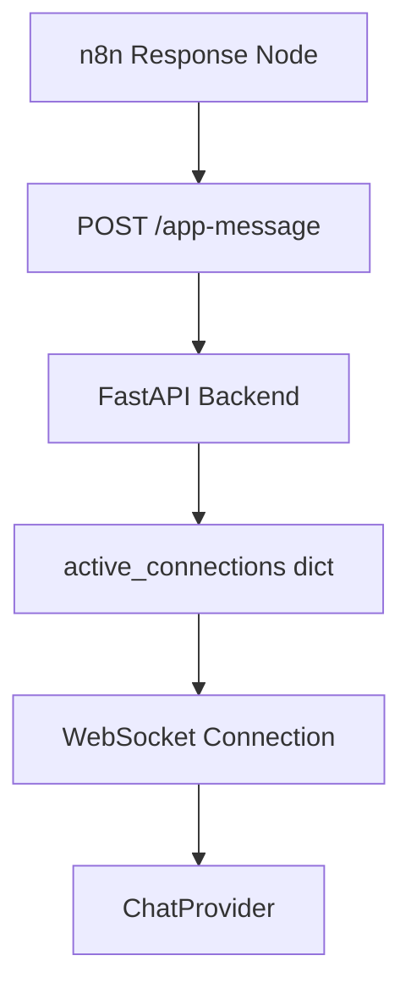

# Comunicación WebSocket

> **Archivos fuente relevantes**
> * [ARQUITECTURA.md](https://github.com/axchisan/AxIA/blob/1fe26c44/ARCHITECTURE.md)
> * [GUÍA DE INTEGRACIÓN N8N.md](https://github.com/axchisan/AxIA/blob/1fe26c44/N8N_INTEGRATION_GUIDE.md)

## Propósito y alcance

Este documento explica la capa de comunicación WebSocket, que permite la mensajería bidireccional en tiempo real entre el cliente móvil de Flutter y el backend de FastAPI. Abarca el ciclo de vida de la conexión, la especificación del protocolo de mensajes, los mecanismos de autenticación y las estrategias de gestión de errores.

Para obtener información sobre el almacenamiento de mensajes y el almacenamiento en caché local, consulte [Administración de mensajes](/axchisan/AxIA/5.2-message-management) . Para obtener más información sobre la interfaz de usuario del chat y la lógica de visualización, consulte [Mejoras de la interfaz de usuario del chat](/axchisan/AxIA/5.3-chat-ui-enhancements) .

---

## Arquitectura de conexión WebSocket

La implementación de WebSocket proporciona comunicación persistente en tiempo real, eliminando la necesidad de sondeo HTTP y reduciendo la latencia de los mensajes. La conexión funciona como un canal bidireccional para mensajes de texto y audio.

### Componentes del sistema



**Fuentes:** [ARCHITECTURE.md L17-L33](https://github.com/axchisan/AxIA/blob/1fe26c44/ARCHITECTURE.md#L17-L33)

 [GU L1-L61](https://github.com/axchisan/AxIA/blob/1fe26c44/N8N_INTEGRATION_GUIDE.md#L1-L61)

---

## Establecimiento de conexión

### Formato de URL de conexión

La conexión WebSocket utiliza una URL WebSocket (WSS) segura con autenticación JWT incorporada:

```
wss://apiaxia.axchisan.com/ws/{username}?token={jwt_token}
```

**Componentes de la URL:**

| Componente | Descripción | Ejemplo |
| --- | --- | --- |
| Protocolo | WebSocket seguro | `wss://` |
| Anfitrión | Dominio de API de backend | `apiaxia.axchisan.com` |
| Camino | Punto final de WebSocket | `/ws/{username}` |
| Parámetro de consulta | Token de autenticación JWT | `?token=eyJ0eXAi...` |

**Fuentes:** [ARCHITECTURE.md L22](https://github.com/axchisan/AxIA/blob/1fe26c44/ARCHITECTURE.md#L22-L22)

 [lib/config/api_config.dart](https://github.com/axchisan/AxIA/blob/1fe26c44/lib/config/api_config.dart)

### Secuencia de inicialización de la conexión



**Fuentes:** [ARCHITECTURE.md L119-L129](https://github.com/axchisan/AxIA/blob/1fe26c44/ARCHITECTURE.md#L119-L129)

 [lib/proveedores/chat_provider.dart](https://github.com/axchisan/AxIA/blob/1fe26c44/lib/providers/chat_provider.dart)

### Mapeo de entidades de código

El establecimiento de la conexión implica estas entidades de código clave:

| Entidad de código | Ruta del archivo | Responsabilidad |
| --- | --- | --- |
| `ChatProvider.initWebSocket()` | `lib/providers/chat_provider.dart` | Inicializa la conexión WebSocket |
| `ApiConfig.wsUrl` | `lib/config/api_config.dart` | Proporciona la URL base de WebSocket |
| `AuthProvider.getToken()` | `lib/providers/auth_provider.dart` | Recupera JWT del almacenamiento seguro |
| `WebSocketChannel.connect()` | Paquete externo | Crea una conexión WebSocket |
| `/ws/{username}`punto final | `backend/main.py` | Controlador de ruta FastAPI WebSocket |
| `verify_token()` | `backend/main.py` | Función de validación JWT |

**Fuentes:** [ARCHITECTURE.md L148-L188](https://github.com/axchisan/AxIA/blob/1fe26c44/ARCHITECTURE.md#L148-L188)

 [lib/proveedores/](https://github.com/axchisan/AxIA/blob/1fe26c44/lib/providers/)

 [backend/main.py](https://github.com/axchisan/AxIA/blob/1fe26c44/backend/main.py)

---

## Gestión del ciclo de vida de la conexión

### Gestión del Estado

Mantiene el `ChatProvider`estado de la conexión WebSocket y maneja eventos del ciclo de vida:



**Fuentes:** [lib/proveedores/chat_provider.dart](https://github.com/axchisan/AxIA/blob/1fe26c44/lib/providers/chat_provider.dart)

### Eventos del ciclo de vida de la conexión

| Evento | Desencadenar | Entrenador de animales | Acción |
| --- | --- | --- | --- |
| `onListen` | Comienza la suscripción a streaming | Inicialización de ChatProvider | Configurar el receptor de mensajes |
| `onMessage` | Datos recibidos de WebSocket | `stream.listen()`llamar de vuelta | Analizar y procesar el mensaje |
| `onDone` | Conexión cerrada limpiamente | `onDone`llamar de vuelta | Actualizar la interfaz de usuario, mostrar la opción de reconexión |
| `onError` | Error o fallo de conexión | `onError`llamar de vuelta | Mostrar banner de error, registrar error |
| `onReconnect` | El usuario activa la reconexión | `ChatProvider.reconnect()` | Cerrar conexión antigua, crear una nueva |

**Fuentes:** [ARCHITECTURE.md L133-L145](https://github.com/axchisan/AxIA/blob/1fe26c44/ARCHITECTURE.md#L133-L145)

 [lib/proveedores/chat_provider.dart](https://github.com/axchisan/AxIA/blob/1fe26c44/lib/providers/chat_provider.dart)

### Lógica de reconexión



**Fuentes:** [ARCHITECTURE.md L133-L145](https://github.com/axchisan/AxIA/blob/1fe26c44/ARCHITECTURE.md#L133-L145)

 [lib/proveedores/chat_provider.dart](https://github.com/axchisan/AxIA/blob/1fe26c44/lib/providers/chat_provider.dart)

---

## Especificación del protocolo de mensajes

### Outgoing Message Format (Client → Backend)

The Flutter client sends messages to the backend WebSocket endpoint using JSON format:

#### Text Message Structure

```json
{
  "type": "text",
  "text": "mensaje del usuario",
  "session_id": "uuid-v4-string",
  "timestamp": "2024-11-26T12:34:56.789Z"
}
```

#### Audio Message Structure

```json
{
  "type": "audio",
  "audio_base64": "BASE64_ENCODED_AUDIO_DATA",
  "session_id": "uuid-v4-string",
  "timestamp": "2024-11-26T12:34:56.789Z"
}
```

**Field Descriptions:**

| Field | Type | Required | Description |
| --- | --- | --- | --- |
| `type` | String | Yes | Message type: `"text"` or `"audio"` |
| `text` | String | If type=text | Message content in plain text |
| `audio_base64` | String | If type=audio | Base64-encoded audio file (AAC format) |
| `session_id` | String | Yes | Unique conversation session identifier |
| `timestamp` | String | Yes | ISO 8601 timestamp of message creation |

**Sources:** [ARCHITECTURE.md L56-L68](https://github.com/axchisan/AxIA/blob/1fe26c44/ARCHITECTURE.md#L56-L68)

 [ARCHITECTURE.md L99-L108](https://github.com/axchisan/AxIA/blob/1fe26c44/ARCHITECTURE.md#L99-L108)

### Message Flow: Client to n8n

When the backend receives a WebSocket message, it transforms it into the Evolution API-compatible format before forwarding to n8n:



**Sources:** [N8N_INTEGRATION_GUIDE.md L8-L61](https://github.com/axchisan/AxIA/blob/1fe26c44/N8N_INTEGRATION_GUIDE.md#L8-L61)

 [ARCHITECTURE.md L91-L117](https://github.com/axchisan/AxIA/blob/1fe26c44/ARCHITECTURE.md#L91-L117)

### n8n Webhook Payload Format

The backend transforms client messages into this Evolution API-compatible format:

#### Text Message to n8n

```json
{
  "event": "messages.upsert",
  "instance": "AxIAPersonal",
  "channel": "app",
  "data": {
    "key": {
      "remoteJid": "app:AxchiSan@axia.app",
      "fromMe": false,
      "id": "1732659417635"
    },
    "pushName": "AxchiSan",
    "message": {
      "conversation": "mensaje de texto"
    },
    "messageType": "conversation",
    "messageTimestamp": 1732659417,
    "source": "flutter_app"
  },
  "destination": "https://n8n.axchisan.com/webhook/...",
  "date_time": "2025-11-27T00:16:57.635730",
  "sender": "AxchiSan@axia.app"
}
```

#### Audio Message to n8n

```json
{
  "event": "messages.upsert",
  "instance": "AxIAPersonal",
  "channel": "app",
  "data": {
    "key": {
      "remoteJid": "app:AxchiSan@axia.app",
      "fromMe": false,
      "id": "1732659500000"
    },
    "pushName": "AxchiSan",
    "message": {
      "base64": "BASE64_AUDIO_DATA_HERE"
    },
    "messageType": "audioMessage",
    "messageTimestamp": 1732659500,
    "source": "flutter_app"
  },
  "destination": "https://n8n.axchisan.com/webhook/...",
  "date_time": "2025-11-27T00:18:20.000000",
  "sender": "AxchiSan@axia.app"
}
```

**Key Distinguishing Fields:**

| Field | Purpose | App Value | WhatsApp Value |
| --- | --- | --- | --- |
| `channel` | Platform identifier | `"app"` | Not present |
| `data.key.remoteJid` | User identifier | `app:username@axia.app` | `phone@s.whatsapp.net` |
| `data.source` | Message origin | `"flutter_app"` | `"android"` |
| `sender` | Sender identifier | `username@axia.app` | `phone@s.whatsapp.net` |

**Sources:** [N8N_INTEGRATION_GUIDE.md L8-L71](https://github.com/axchisan/AxIA/blob/1fe26c44/N8N_INTEGRATION_GUIDE.md#L8-L71)

### Incoming Message Format (Backend → Client)

The backend sends responses back through the WebSocket connection:

```json
{
  "output": "Respuesta de AxIA aquí",
  "type": "text",
  "debe_ser_audio": false,
  "audio_base64": null,
  "session_id": "uuid-v4-string",
  "timestamp": "2024-11-26T12:35:01.234Z"
}
```

**Audio Response Format:**

```json
{
  "output": "Transcripción del audio generado",
  "type": "audio",
  "debe_ser_audio": true,
  "audio_base64": "BASE64_ENCODED_AUDIO_RESPONSE",
  "session_id": "uuid-v4-string",
  "timestamp": "2024-11-26T12:35:05.678Z"
}
```

**Field Descriptions:**

| Field | Type | Description |
| --- | --- | --- |
| `output` | String | Response text content or audio transcription |
| `type` | String | Response type: `"text"` or `"audio"` |
| `debe_ser_audio` | Boolean | Flag indicating whether client should auto-play audio |
| `audio_base64` | String\|null | Base64-encoded audio response (if type=audio) |
| `session_id` | String | Session identifier matching the request |
| `timestamp` | String | ISO 8601 timestamp of response generation |

**Sources:** [N8N_INTEGRATION_GUIDE.md L142-L162](https://github.com/axchisan/AxIA/blob/1fe26c44/N8N_INTEGRATION_GUIDE.md#L142-L162)

 [ARCHITECTURE.md L110-L117](https://github.com/axchisan/AxIA/blob/1fe26c44/ARCHITECTURE.md#L110-L117)

---

## Authentication Mechanism

### JWT Token in WebSocket Connection

The WebSocket connection uses query parameter authentication rather than HTTP headers, as WebSocket upgrade requests have limited header control:

```yaml
wss://apiaxia.axchisan.com/ws/duvan?token=eyJ0eXAiOiJKV1QiLCJhbGc...
```

**Authentication Flow:**



**Sources:** [ARCHITECTURE.md L228-L234](https://github.com/axchisan/AxIA/blob/1fe26c44/ARCHITECTURE.md#L228-L234)

 [lib/providers/auth_provider.dart](https://github.com/axchisan/AxIA/blob/1fe26c44/lib/providers/auth_provider.dart)

 [backend/main.py](https://github.com/axchisan/AxIA/blob/1fe26c44/backend/main.py)

### Token Expiration Handling

JWT tokens expire after 24 hours. The WebSocket connection does not automatically refresh tokens:

| Scenario | Behavior | User Action Required |
| --- | --- | --- |
| Token valid | Connection succeeds | None |
| Token expired (during connection) | Connection rejected with 401 | Re-login via LoginScreen |
| Token expires (during active session) | Connection drops with error | Re-login via error banner |
| Token invalid | Connection rejected with 401 | Re-login via LoginScreen |

**Sources:** [ARCHITECTURE.md L138-L141](https://github.com/axchisan/AxIA/blob/1fe26c44/ARCHITECTURE.md#L138-L141)

 [ARCHITECTURE.md L229](https://github.com/axchisan/AxIA/blob/1fe26c44/ARCHITECTURE.md#L229-L229)

---

## Error Handling

### Error Categories



**Sources:** [ARCHITECTURE.md L131-L145](https://github.com/axchisan/AxIA/blob/1fe26c44/ARCHITECTURE.md#L131-L145)

 [lib/providers/chat_provider.dart](https://github.com/axchisan/AxIA/blob/1fe26c44/lib/providers/chat_provider.dart)

### Error Handling Implementation

**Code Entity Responsibilities:**

| Error Type | Detection Point | Handler | User Feedback |
| --- | --- | --- | --- |
| Connection failure | `WebSocketChannel.connect()` | `onError` callback | Red banner: "Connection error" |
| Token expiration | Backend validation | 401 response → `onError` | Redirect to LoginScreen |
| Message send failure | `sink.add()` exception | try-catch in `sendMessage()` | Toast: "Failed to send message" |
| Message receive error | `stream.listen()` error | `onError` callback | Log error, skip message |
| Connection drop | Stream completion | `onDone` callback | Red banner with "Reconnect" button |

**Sources:** [ARCHITECTURE.md L133-L145](https://github.com/axchisan/AxIA/blob/1fe26c44/ARCHITECTURE.md#L133-L145)

 [lib/providers/chat_provider.dart](https://github.com/axchisan/AxIA/blob/1fe26c44/lib/providers/chat_provider.dart)

### Error Recovery Strategies



**Sources:** [ARCHITECTURE.md L138-L145](https://github.com/axchisan/AxIA/blob/1fe26c44/ARCHITECTURE.md#L138-L145)

 [lib/providers/chat_provider.dart](https://github.com/axchisan/AxIA/blob/1fe26c44/lib/providers/chat_provider.dart)

---

## Performance Considerations

### Connection Persistence

The WebSocket connection remains open throughout the chat session, providing:

| Benefit | Comparison to HTTP Polling | Implementation |
| --- | --- | --- |
| Lower latency | ~50-100ms vs 1000-5000ms | Single persistent connection |
| Reduced overhead | No repeated HTTP headers | Binary frame protocol |
| True real-time | Instant message delivery | Server push capability |
| Lower server load | 1 connection vs N requests | Agrupación de conexiones en el backend |

**Fuentes:** [ARCHITECTURE.md L237-L240](https://github.com/axchisan/AxIA/blob/1fe26c44/ARCHITECTURE.md#L237-L240)

### Mejores prácticas para la gestión de conexiones

La implementación sigue estas prácticas:

1. **Conexión Singleton** : solo una conexión WebSocket por sesión de usuario
2. **Inicialización diferida** : conexión creada cuando se accede a ChatScreen por primera vez
3. **Limpieza adecuada** : Conexión cerrada en`ChatProvider.dispose()`
4. **Gestión de memoria** : suscripción al flujo de mensajes cancelada al desecharse
5. **Recuperación de errores** : reconexión manual en lugar de bucles de reintentos automáticos

**Fuentes:** [ARCHITECTURE.md L240](https://github.com/axchisan/AxIA/blob/1fe26c44/ARCHITECTURE.md#L240-L240)

 [lib/proveedores/chat_provider.dart](https://github.com/axchisan/AxIA/blob/1fe26c44/lib/providers/chat_provider.dart)

---

## Punto final del WebSocket de back-end

### Ruta de WebSocket de FastAPI

El punto final WebSocket de backend maneja la actualización de la conexión, la autenticación, el reenvío de mensajes y el enrutamiento de respuestas:

**Firma del punto final:**

```
WebSocket /ws/{username}?token={jwt_token}
```

**Responsabilidades clave:**

| Operación | Descripción | Referencia de código |
| --- | --- | --- |
| Actualización de la conexión | Aceptar solicitud de actualización de WebSocket | `/ws/{username}`manejador de ruta |
| Validación de tokens | Verificar el token JWT desde el parámetro de consulta | `verify_token(token)`función |
| Recepción de mensajes | Recibir mensajes JSON del cliente | `await websocket.receive_text()` |
| reenvío n8n | Mensaje POST a la URL del webhook n8n | `requests.post(N8N_WEBHOOK_URL)` |
| Enrutamiento de respuesta | Enviar respuesta n8n al cliente | `await websocket.send_text()` |
| Seguimiento de conexión | Mantener activo el registro de conexión | `active_connections: Dict[str, WebSocket]` |

**Fuentes:** [ARCHITECTURE.md L54-L89](https://github.com/axchisan/AxIA/blob/1fe26c44/ARCHITECTURE.md#L54-L89)

 [backend/main.py](https://github.com/axchisan/AxIA/blob/1fe26c44/backend/main.py)

### Flujo de procesamiento de mensajes de backend

```mermaid
sequenceDiagram
  participant WebSocket Client
  participant FastAPI Endpoint
  participant /ws/{username}
  participant verify_token()
  participant Message Transformer
  participant n8n Webhook
  participant /app-message Endpoint

  WebSocket Client->>FastAPI Endpoint: "WebSocket Upgrade + JWT"
  FastAPI Endpoint->>verify_token(): "validate token"
  verify_token()-->>FastAPI Endpoint: "Valid/Invalid"
  loop [Message Loop]
    FastAPI Endpoint-->>WebSocket Client: "101 Switching Protocols"
    FastAPI Endpoint->>FastAPI Endpoint: "Store in active_connections"
    WebSocket Client->>FastAPI Endpoint: "JSON Message"
    FastAPI Endpoint->>Message Transformer: "Convert to Evolution format"
    Message Transformer->>n8n Webhook: "POST webhook"
    n8n Webhook->>n8n Webhook: "Process with AI"
    n8n Webhook->>/app-message Endpoint: "POST /app-message"
    /app-message Endpoint->>FastAPI Endpoint: "Forward to WebSocket"
    FastAPI Endpoint->>WebSocket Client: "Send response"
    FastAPI Endpoint-->>WebSocket Client: "401 Unauthorized"
  end
```

**Fuentes:** [ARCHITECTURE.md L17-L33](https://github.com/axchisan/AxIA/blob/1fe26c44/ARCHITECTURE.md#L17-L33)

 [GU L167-L174](https://github.com/axchisan/AxIA/blob/1fe26c44/N8N_INTEGRATION_GUIDE.md#L167-L174)

---

## Integración con la detección de canales n8n

El flujo de trabajo n8n utiliza el `channel`campo para distinguir entre los mensajes de la aplicación AxIA y otras plataformas (WhatsApp, Telegram):

### Lógica de detección de canales

**Configuración del nodo de conmutación:**

| Regla | Condición | Producción | Destino |
| --- | --- | --- | --- |
| Canal de aplicaciones | `$json.body.channel === 'app'` | 0 | Rama de procesamiento de aplicaciones |
| WhatsApp | `$json.body.channel`no está definido | 1 | Sucursal de procesamiento de WhatsApp |
| Telegrama | `$json.body.channel === 'telegram'` | 2 | Rama de procesamiento de telegramas |

**Fuentes:** [GU L73-L188](https://github.com/axchisan/AxIA/blob/1fe26c44/N8N_INTEGRATION_GUIDE.md#L73-L188)

### Extracción de usuarios de remoteJid

Diferentes canales utilizan diferentes `remoteJid`formatos:

| Canal | Formato remoteJid | Lógica de extracción | Ejemplo |
| --- | --- | --- | --- |
| Aplicación | `app:username@axia.app` | Dividir por `:`, tomar [1], dividir por `@`, tomar [0] | `app:AxchiSan@axia.app`→`AxchiSan` |
| WhatsApp | `phone:id@s.whatsapp.net` | Dividir por `@`, tomar [0], dividir por `:`, tomar [0] | `573183038190:24@s.whatsapp.net`→`573183038190` |
| Telegrama | Formato específico de la plataforma | Extracción específica de la plataforma | Varía |

**Fuentes:** [GU L87-L138](https://github.com/axchisan/AxIA/blob/1fe26c44/N8N_INTEGRATION_GUIDE.md#L87-L138)

### Enrutamiento de respuesta de regreso a la aplicación

Cuando n8n completa el procesamiento, envía la respuesta a la aplicación a través del `/app-message`punto final:



**Fuentes:** [GU L140-L162](https://github.com/axchisan/AxIA/blob/1fe26c44/N8N_INTEGRATION_GUIDE.md#L140-L162)

 [backend/main.py](https://github.com/axchisan/AxIA/blob/1fe26c44/backend/main.py)