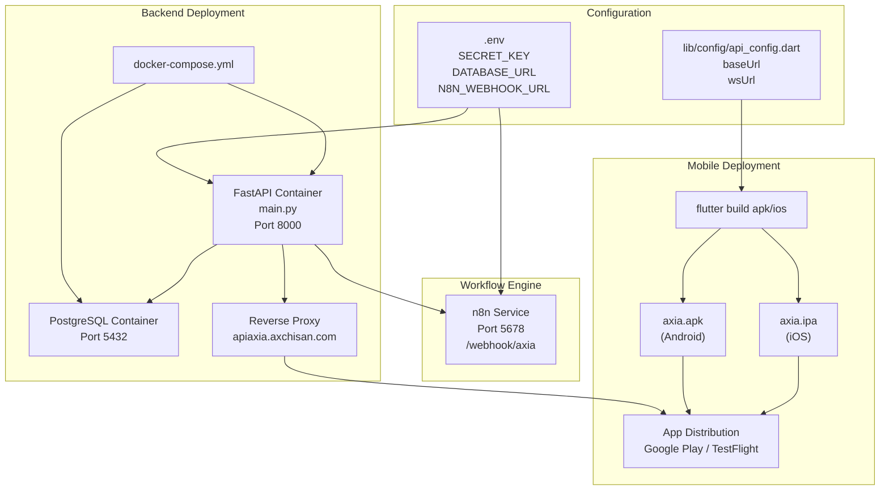
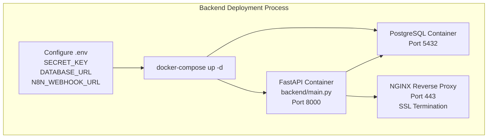
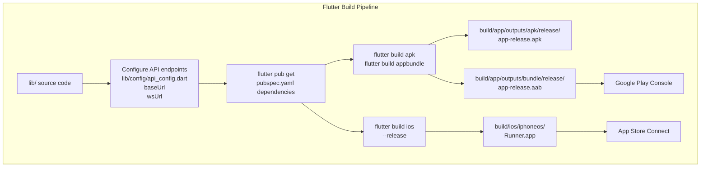
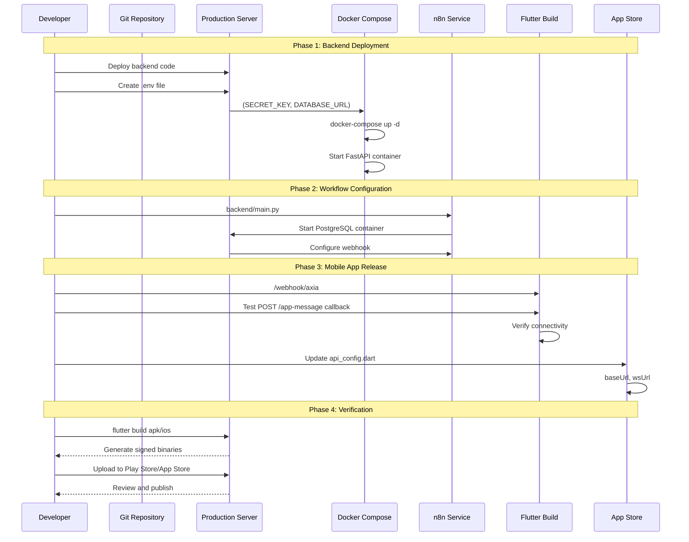

# Deployment

> **Relevant source files**
> * [..bfg-report/2025-11-27/02-50-28/deleted-files.txt](https://github.com/axchisan/AxIA/blob/1fe26c44/..bfg-report/2025-11-27/02-50-28/deleted-files.txt)
> * [ARCHITECTURE.md](https://github.com/axchisan/AxIA/blob/1fe26c44/ARCHITECTURE.md)

## Purpose and Scope

This page provides a production deployment guide for the AxIA system, covering the deployment workflow for all three tiers: FastAPI backend, n8n workflow engine, and Flutter mobile application. It presents an overview of the deployment architecture, prerequisites, and verification procedures.

For detailed backend deployment instructions including Docker Compose configuration and PostgreSQL setup, see [Backend Deployment](/axchisan/AxIA/12.1-backend-deployment). For comprehensive environment variable configuration and secrets management, see [Environment Variables](/axchisan/AxIA/12.2-environment-variables).

## Deployment Architecture Overview

The AxIA system deploys as three independent components that communicate over HTTPS/WSS protocols. The FastAPI backend and PostgreSQL database run in Docker containers, n8n operates as a separate service (containerized or cloud-hosted), and the Flutter application builds as native mobile binaries for Android and iOS.

**Deployment Topology Diagram**



**Sources:** [ARCHITECTURE.md L199-L241](https://github.com/axchisan/AxIA/blob/1fe26c44/ARCHITECTURE.md#L199-L241)

## Deployment Prerequisites

The following components must be available before deploying the AxIA system:

| Component | Requirement | Purpose |
| --- | --- | --- |
| Docker & Docker Compose | v20.10+ / v2.0+ | Container orchestration for backend services |
| PostgreSQL | v13+ | Database for user data, messages, tasks, calendar |
| n8n Instance | v1.0+ | Workflow automation and AI processing |
| Flutter SDK | v3.0+ | Mobile app compilation |
| SSL Certificate | Valid TLS cert | HTTPS/WSS encryption for apiaxia.axchisan.com |
| Domain Name | Registered domain | Backend endpoint accessibility |

**Sources:** [ARCHITECTURE.md L199-L241](https://github.com/axchisan/AxIA/blob/1fe26c44/ARCHITECTURE.md#L199-L241)

## Backend Deployment Overview

The FastAPI backend deploys using Docker Compose, which orchestrates the `main.py` FastAPI application and PostgreSQL database as linked containers. The deployment process involves:

1. Configuring environment variables (see [Environment Variables](/axchisan/AxIA/12.2-environment-variables))
2. Running `docker-compose up -d` to start containers
3. Verifying database connectivity and migrations
4. Configuring reverse proxy for HTTPS termination



The FastAPI application exposes the following endpoints for external access:

* `POST /token` - JWT authentication endpoint
* `WebSocket /ws/{username}` - Real-time chat connection
* `GET /health` - Health check endpoint
* `POST /app-message` - n8n callback endpoint
* REST API endpoints for tasks, calendar, messages (see [REST Endpoints](/axchisan/AxIA/8.1-rest-endpoints))

For complete backend deployment instructions including Docker configuration, database initialization, and n8n integration, see [Backend Deployment](/axchisan/AxIA/12.1-backend-deployment).

**Sources:** [ARCHITECTURE.md L199-L210](https://github.com/axchisan/AxIA/blob/1fe26c44/ARCHITECTURE.md#L199-L210)

 [ARCHITECTURE.md L54-L89](https://github.com/axchisan/AxIA/blob/1fe26c44/ARCHITECTURE.md#L54-L89)

## Environment Configuration Overview

Production deployments require careful management of environment variables and secrets. The system uses `.env` files for backend configuration and `lib/config/api_config.dart` for Flutter configuration. Sensitive files are excluded from version control via `.gitignore`.

**Critical Configuration Files:**

| File | Purpose | Storage Location |
| --- | --- | --- |
| `backend/.env` | Backend secrets (SECRET_KEY, DATABASE_URL) | Server filesystem, not in Git |
| `lib/config/api_config.dart` | API endpoints (baseUrl, wsUrl) | Git repository (no secrets) |
| `credentials.json` | Static user credentials | flutter_secure_storage (device) |
| `token.json` | Dynamic JWT tokens | flutter_secure_storage (device) |

The repository underwent security remediation using BFG Repo-Cleaner to remove `.env` files from Git history. Production deployments must create `.env` files manually on the server.

For detailed environment variable configuration, secrets management, and `.env` file structure, see [Environment Variables](/axchisan/AxIA/12.2-environment-variables).

**Sources:** [ARCHITECTURE.md L213-L225](https://github.com/axchisan/AxIA/blob/1fe26c44/ARCHITECTURE.md#L213-L225)

 [..bfg-report/2025-11-27/02-50-28/deleted-files.txt L1-L4](https://github.com/axchisan/AxIA/blob/1fe26c44/..bfg-report/2025-11-27/02-50-28/deleted-files.txt#L1-L4)

## Flutter Application Deployment

The Flutter mobile application builds as native binaries for Android (APK/AAB) and iOS (IPA). The deployment process differs by platform but follows a common configuration pattern.

### Build Process



### Configuration Steps

1. **Update API Configuration** - Modify `lib/config/api_config.dart` with production endpoints: ```javascript static const String baseUrl = 'https://apiaxia.axchisan.com'; static const String wsUrl = 'wss://apiaxia.axchisan.com/ws'; ```
2. **Install Dependencies** - Execute `flutter pub get` to resolve all packages defined in `pubspec.yaml`
3. **Build Platform-Specific Binaries:** * **Android:** `flutter build apk` for APK or `flutter build appbundle` for Google Play * **iOS:** `flutter build ios --release` for App Store submission
4. **Configure Platform Permissions** (see [Android Setup](/axchisan/AxIA/9.1-android-setup)): * Android: Microphone, internet, and storage permissions in `AndroidManifest.xml` * iOS: Microphone usage description in `Info.plist`

**Sources:** [ARCHITECTURE.md L206-L210](https://github.com/axchisan/AxIA/blob/1fe26c44/ARCHITECTURE.md#L206-L210)

 [ARCHITECTURE.md L221-L225](https://github.com/axchisan/AxIA/blob/1fe26c44/ARCHITECTURE.md#L221-L225)

## Deployment Workflow

The complete deployment workflow coordinates backend infrastructure, workflow engine, and mobile application releases:



**Sources:** [ARCHITECTURE.md L199-L241](https://github.com/axchisan/AxIA/blob/1fe26c44/ARCHITECTURE.md#L199-L241)

## Verification and Health Checks

After deployment, verify all components are functioning correctly using the following procedures:

### Backend Health Check

The FastAPI backend exposes a health check endpoint at `GET /health`:

```json
{
  "status": "ok",
  "timestamp": "2024-11-26T12:00:00Z"
}
```

Test connectivity:

```
curl https://apiaxia.axchisan.com/health
```

### Authentication Flow Test

Verify JWT authentication by obtaining a token:

```
curl -X POST https://apiaxia.axchisan.com/token \
  -H "Content-Type: application/x-www-form-urlencoded" \
  -d "username=testuser&password=testpass"
```

Expected response:

```json
{
  "access_token": "eyJhbGciOiJIUzI1NiIsInR5cCI6IkpXVCJ9...",
  "token_type": "bearer",
  "expires_in": 86400
}
```

### WebSocket Connection Test

Verify WebSocket connectivity using the obtained JWT token:

```
wscat -c "wss://apiaxia.axchisan.com/ws/testuser?token=<JWT_TOKEN>"
```

Send a test message:

```json
{
  "type": "text",
  "text": "Hello AxIA",
  "session_id": "test-session-123",
  "timestamp": "2024-11-26T12:00:00Z"
}
```

### n8n Webhook Verification

Test the n8n webhook integration by sending a POST request:

```
curl -X POST https://n8n-instance.com/webhook/axia \
  -H "Content-Type: application/json" \
  -d '{
    "session_id": "test-123",
    "user": "testuser",
    "type": "text",
    "text": "Test message",
    "timestamp": "2024-11-26T12:00:00Z"
  }'
```

Verify that n8n processes the message and calls back to `POST /app-message` on the FastAPI backend.

### Mobile App Verification

After installing the Flutter application:

1. **Launch Application** - Verify `SplashScreen` loads and redirects appropriately
2. **Login Test** - Authenticate with credentials stored in `credentials.json`
3. **WebSocket Connection** - Verify `ChatScreen` establishes WebSocket connection
4. **Message Exchange** - Send text and audio messages, verify responses
5. **Secure Storage** - Confirm JWT token persists in `flutter_secure_storage`

**Sources:** [ARCHITECTURE.md L54-L89](https://github.com/axchisan/AxIA/blob/1fe26c44/ARCHITECTURE.md#L54-L89)

 [ARCHITECTURE.md L119-L142](https://github.com/axchisan/AxIA/blob/1fe26c44/ARCHITECTURE.md#L119-L142)

## Deployment Checklist

Before considering deployment complete, verify all items in this checklist:

### Backend Infrastructure

* Docker Compose containers running (`docker ps` shows FastAPI and PostgreSQL)
* PostgreSQL database initialized with schema
* `.env` file configured with production secrets
* HTTPS reverse proxy configured with valid SSL certificate
* `GET /health` returns 200 OK

### Workflow Engine

* n8n service accessible at configured URL
* Webhook endpoint `/webhook/axia` responds to POST requests
* n8n can successfully call `POST /app-message` on FastAPI
* AI integrations (OpenAI/Anthropic) configured with API keys
* ElevenLabs TTS and Whisper transcription credentials configured

### Mobile Application

* `lib/config/api_config.dart` points to production endpoints
* Platform permissions configured (microphone, internet)
* Signed release builds generated (APK/AAB for Android, IPA for iOS)
* App successfully authenticates and obtains JWT token
* WebSocket connection establishes from mobile device
* Text and audio messages transmit successfully

### Security

* All `.env` files excluded from Git (`.gitignore` configured)
* JWT secret key is cryptographically secure (not default value)
* Database credentials use strong passwords
* CORS configuration restricts origins in production
* SSL/TLS certificates valid and not expired

### Monitoring

* Health check endpoint monitored for uptime
* WebSocket connection metrics tracked
* n8n workflow execution logs reviewed for errors
* Mobile app crash reporting configured

**Sources:** [ARCHITECTURE.md L227-L240](https://github.com/axchisan/AxIA/blob/1fe26c44/ARCHITECTURE.md#L227-L240)

 [..bfg-report/2025-11-27/02-50-28/deleted-files.txt L1-L4](https://github.com/axchisan/AxIA/blob/1fe26c44/..bfg-report/2025-11-27/02-50-28/deleted-files.txt#L1-L4)

## Rollback Procedures

In case of deployment issues, follow these rollback procedures:

### Backend Rollback

```html
# Stop current containers
docker-compose down

# Restore previous version
git checkout <previous-commit>

# Redeploy
docker-compose up -d
```

### Mobile App Rollback

* **Google Play:** Use release management to roll back to previous version
* **App Store:** Submit previous build for review (iOS does not support instant rollback)

### Database Rollback

Database migrations should be reversible. If schema changes cause issues:

```html
# Connect to PostgreSQL container
docker exec -it <postgres-container> psql -U <user> -d axia_db

# Run rollback migration scripts
```

**Sources:** [ARCHITECTURE.md L199-L210](https://github.com/axchisan/AxIA/blob/1fe26c44/ARCHITECTURE.md#L199-L210)