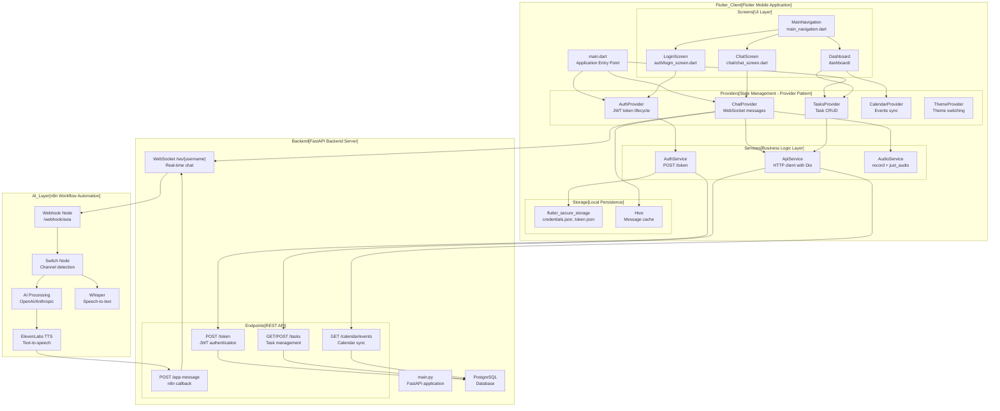
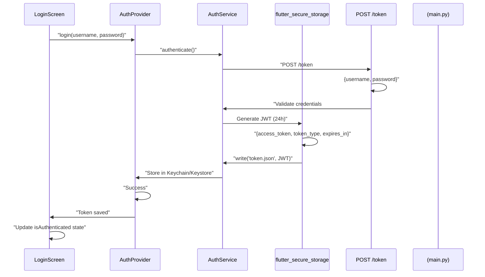
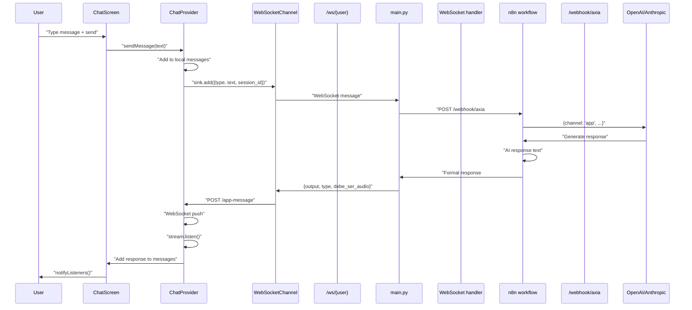
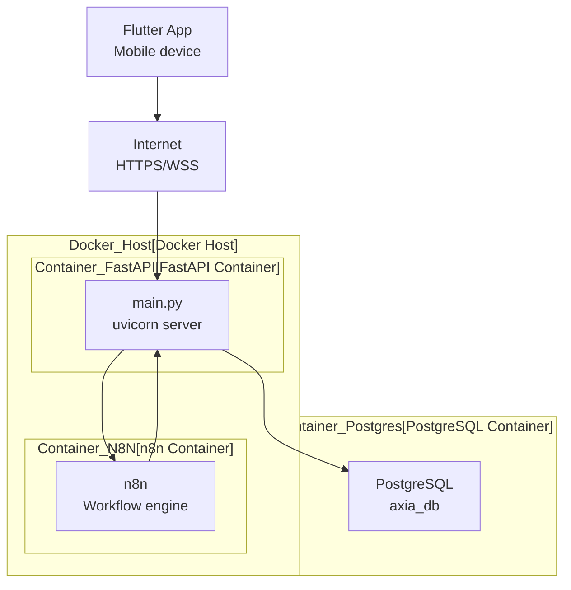

# Descripción general

> **Archivos fuente relevantes**
> * [ARQUITECTURA.md](https://github.com/axchisan/AxIA/blob/1fe26c44/ARCHITECTURE.md)
> * [LÉAME.md](https://github.com/axchisan/AxIA/blob/1fe26c44/README.md)

## Propósito y alcance

AxIA es una aplicación móvil de asistente personal de IA desarrollada con Flutter que ofrece chat en tiempo real, gestión de tareas, integración de calendario y comunicación por audio. Este documento ofrece una visión general de la arquitectura de todo el sistema, incluyendo el frontend de Flutter, el backend FastAPI y el motor de automatización de flujos de trabajo n8n.

Para obtener información detallada sobre subsistemas específicos, consulte:

* Estructura de la aplicación Flutter: [Aplicación Flutter](/axchisan/AxIA/3.1-flutter-application)
* Implementación de API de backend: [FastAPI Backend](/axchisan/AxIA/3.2-fastapi-backend)
* Automatización del flujo de trabajo con IA: [motor de flujo de trabajo n8n](/axchisan/AxIA/3.3-n8n-workflow-engine)
* Mecanismos de autenticación: [Autenticación y seguridad](/axchisan/AxIA/4-authentication-and-security)
* Comunicación WebSocket: [Sistema de chat en tiempo real](/axchisan/AxIA/5-real-time-chat-system)

**Fuentes:** [README.md L1-L4](https://github.com/axchisan/AxIA/blob/1fe26c44/README.md#L1-L4)

 [ARCHITECTURE.md L1-L2](https://github.com/axchisan/AxIA/blob/1fe26c44/ARCHITECTURE.md#L1-L2)

---

## Arquitectura del sistema

AxIA implementa una arquitectura de tres niveles que separa las preocupaciones entre las capas de cliente, servidor y procesamiento de IA. El sistema prioriza la comunicación en tiempo real mediante conexiones WebSocket, la gestión segura de credenciales mediante almacenes de claves específicos de la plataforma y el procesamiento asíncrono de IA mediante flujos de trabajo basados ​​en webhooks.

**Fuentes:** [ARCHITECTURE.md L1-L241](https://github.com/axchisan/AxIA/blob/1fe26c44/ARCHITECTURE.md#L1-L241)

 [README.md L52-L78](https://github.com/axchisan/AxIA/blob/1fe26c44/README.md#L52-L78)

### Topología de componentes



**Fuentes:** [ARCHITECTURE.md L148-L197](https://github.com/axchisan/AxIA/blob/1fe26c44/ARCHITECTURE.md#L148-L197)

 [README.md L112-L136](https://github.com/axchisan/AxIA/blob/1fe26c44/README.md#L112-L136)

---

## Arquitectura de tres niveles

### Nivel 1: Cliente Flutter

La aplicación Flutter funciona como capa de presentación y lógica del cliente, implementando el patrón Proveedor para la gestión de estados. El cliente mantiene conexiones WebSocket persistentes para el chat en tiempo real y utiliza puntos finales HTTP REST para operaciones CRUD en tareas y eventos del calendario.

**Componentes clave:**

| Componente | Ubicación | Responsabilidad |
| --- | --- | --- |
| `AuthProvider` | `lib/providers/auth_provider.dart` | Ciclo de vida del token JWT, estado de autenticación |
| `ChatProvider` | `lib/providers/chat_provider.dart` | Gestión de conexiones WebSocket, manejo de mensajes |
| `AuthService` | `lib/services/auth_service.dart` | Ejecuta `POST /token`la autenticación |
| `ApiService` | `lib/services/api_service.dart` | Envoltorio de cliente HTTP que utiliza el paquete Dio |
| `AudioService` | `lib/services/audio_service.dart` | Grabación con `record`paquete, reproducción con`just_audio` |
| `flutter_secure_storage` | Llavero/almacén de claves de la plataforma | Tiendas `credentials.json`y`token.json` |
| `Hive` | Base de datos NoSQL local | Almacena en caché los mensajes de chat para acceder sin conexión |

El punto de entrada de la aplicación `main.dart`inicializa todos los proveedores y determina el enrutamiento en función del estado de autenticación a través de `SplashScreen`la lógica.

**Fuentes:** [ARCHITECTURE.md L148-L197](https://github.com/axchisan/AxIA/blob/1fe26c44/ARCHITECTURE.md#L148-L197)

 [ARCHITECTURE.md L6-L15](https://github.com/axchisan/AxIA/blob/1fe26c44/ARCHITECTURE.md#L6-L15)

 [README.md L52-L78](https://github.com/axchisan/AxIA/blob/1fe26c44/README.md#L52-L78)

### Nivel 2: Backend de FastAPI

El backend FastAPI ( `backend/main.py`) funciona como puerta de enlace de autenticación y enrutador de mensajes. Valida tokens JWT, gestiona sesiones de usuario, redirige mensajes a flujos de trabajo n8n y mantiene conexiones WebSocket bidireccionales con clientes móviles.

**Puntos finales clave:**

| Punto final | Método | Función | Autenticación |
| --- | --- | --- | --- |
| `/token` | CORREO | Emite tokens JWT (vencimiento en 24 horas) | Nombre de usuario/contraseña |
| `/ws/{username}` | WebSocket | Mensajería bidireccional en tiempo real | JWT en parámetro de consulta |
| `/send-message` | CORREO | Alternativa a WebSocket para el envío de mensajes | Token al portador |
| `/tasks` | OBTENER/PUBLICAR | Operaciones CRUD de tareas | Token al portador |
| `/calendar/events` | CONSEGUIR | Recuperación de eventos del calendario | Token al portador |
| `/messages/{session_id}` | CONSEGUIR | Recuperación de mensajes históricos | Token al portador |
| `/app-message` | CORREO | devolución de llamada de webhook n8n para respuestas | Interno |
| `/health` | CONSEGUIR | Punto final de verificación de estado | Ninguno |

The backend forwards incoming WebSocket messages to n8n at `http://n8n:5678/webhook/axia` and receives processed responses via `POST /app-message`, which are then pushed back to the client through the WebSocket channel.

**Sources:** [ARCHITECTURE.md L54-L89](https://github.com/axchisan/AxIA/blob/1fe26c44/ARCHITECTURE.md#L54-L89)

 [ARCHITECTURE.md L17-L33](https://github.com/axchisan/AxIA/blob/1fe26c44/ARCHITECTURE.md#L17-L33)

### Tier 3: n8n Workflow Engine

The n8n workflow engine orchestrates AI processing, handling transcription, text generation, and speech synthesis. The workflow receives messages through a webhook node at `/webhook/axia`, routes them based on channel detection (app, WhatsApp, Telegram), and processes them through AI service nodes.

**Workflow Nodes:**

| Node | Function | Integration |
| --- | --- | --- |
| Webhook Node | Receives messages from FastAPI | `POST /webhook/axia` |
| Switch Node | Routes by `channel` field | Multi-platform support |
| AI Processing | Text generation and analysis | OpenAI API or Anthropic Claude |
| Whisper Node | Audio transcription | Whisper speech-to-text |
| ElevenLabs Node | Speech synthesis | ElevenLabs TTS API |
| HTTP Response | Callback to FastAPI | `POST /app-message` |

The workflow receives messages with structure:

```json
{
  "session_id": "uuid",
  "user": "username",
  "timestamp": "ISO8601",
  "type": "text|audio",
  "text": "message content",
  "audio_base64": "base64 audio data"
}
```

And returns responses with structure:

```
{
  "output": "AI response text",
  "type": "text|audio",
  "debe_ser_audio": boolean,
  "audio_base64": "base64 audio data"
}
```

**Sources:** [ARCHITECTURE.md L91-L118](https://github.com/axchisan/AxIA/blob/1fe26c44/ARCHITECTURE.md#L91-L118)

 [ARCHITECTURE.md L35-L53](https://github.com/axchisan/AxIA/blob/1fe26c44/ARCHITECTURE.md#L35-L53)

---

## Communication Patterns

### Authentication Flow



**Sources:** [ARCHITECTURE.md L3-L15](https://github.com/axchisan/AxIA/blob/1fe26c44/ARCHITECTURE.md#L3-L15)

 [ARCHITECTURE.md L119-L130](https://github.com/axchisan/AxIA/blob/1fe26c44/ARCHITECTURE.md#L119-L130)

### Real-time Message Flow



**Sources:** [ARCHITECTURE.md L17-L33](https://github.com/axchisan/AxIA/blob/1fe26c44/ARCHITECTURE.md#L17-L33)

 [ARCHITECTURE.md L35-L53](https://github.com/axchisan/AxIA/blob/1fe26c44/ARCHITECTURE.md#L35-L53)

---

## Technology Stack

### Frontend Technologies

| Technology | Version | Purpose |
| --- | --- | --- |
| Flutter | 3.4.0+ | Mobile framework |
| Dart | 3.2.0+ | Programming language |
| Provider | ^6.2.1 | State management pattern |
| `flutter_secure_storage` | Latest | Platform keychain/keystore access |
| Hive | ^2.2.3 | Local NoSQL database |
| Dio | ^5.4.2 | HTTP client with interceptors |
| `record` | Latest | Audio recording (AAC/M4A) |
| `just_audio` | Latest | Audio playback with speed control |
| `web_socket_channel` | Latest | WebSocket client |
| Google Fonts | ^6.2.1 | Space Grotesk typography |

**Sources:** [README.md L52-L78](https://github.com/axchisan/AxIA/blob/1fe26c44/README.md#L52-L78)

### Backend Technologies

| Technology | Purpose |
| --- | --- |
| FastAPI | Python async web framework |
| PostgreSQL | Relational database |
| JWT | Token-based authentication (24h expiration) |
| Docker Compose | Container orchestration |
| n8n | Workflow automation and AI orchestration |

**Sources:** [ARCHITECTURE.md L199-L225](https://github.com/axchisan/AxIA/blob/1fe26c44/ARCHITECTURE.md#L199-L225)

 [README.md L62-L67](https://github.com/axchisan/AxIA/blob/1fe26c44/README.md#L62-L67)

### External Services

| Service | Function | Usage |
| --- | --- | --- |
| OpenAI API | Text generation | AI chat responses |
| Anthropic Claude | Alternative text generation | AI processing |
| ElevenLabs | Text-to-speech | Voice response generation |
| Whisper | Speech-to-text | Audio message transcription |

**Sources:** System diagrams provided in context

---

## Security Architecture

AxIA implements defense-in-depth security with multiple layers:

1. **Transport Security**: All communication uses HTTPS/WSS with TLS encryption
2. **Authentication**: JWT tokens with 24-hour expiration, generated via `POST /token`
3. **Credential Storage**: `credentials.json` and `token.json` stored in `flutter_secure_storage`, utilizing iOS Keychain and Android Keystore
4. **Authorization**: Bearer token validation on all protected endpoints
5. **WebSocket Security**: JWT embedded in WebSocket connection query parameters (`/ws/{user}?token={jwt}`)

Token expiration triggers re-authentication rather than automatic refresh, forcing users to re-enter credentials for enhanced security.

**Sources:** [ARCHITECTURE.md L227-L234](https://github.com/axchisan/AxIA/blob/1fe26c44/ARCHITECTURE.md#L227-L234)

 [ARCHITECTURE.md L119-L146](https://github.com/axchisan/AxIA/blob/1fe26c44/ARCHITECTURE.md#L119-L146)

---

## Data Persistence

### Client-side Storage

| Storage Type | Technology | Data Stored |
| --- | --- | --- |
| Secure Storage | `flutter_secure_storage` | `credentials.json`, `token.json` (JWT) |
| Local Database | Hive | Chat message cache for offline access |
| Preferences | Shared Preferences | Theme settings, user preferences |

### Server-side Storage

| Storage Type | Technology | Data Stored |
| --- | --- | --- |
| Relational DB | PostgreSQL | Usuarios, tareas, eventos del calendario, historial de mensajes |

**Fuentes:** [ARCHITECTURE.md L236-L241](https://github.com/axchisan/AxIA/blob/1fe26c44/ARCHITECTURE.md#L236-L241)

Diagramas de sistemas

---

## Flujo de trabajo de desarrollo

La aplicación sigue un enfoque de desarrollo por fases:

**Fase 1 (actual)** : Implementación completa de la interfaz de usuario con datos simulados y gestión de estado basada en el proveedor

**Fase 2** : Integración de backend con FastAPI, base de datos PostgreSQL y autenticación JWT

**Fase 3** : Integración del flujo de trabajo n8n para el procesamiento de IA, incluidos OpenAI/Anthropic y ElevenLabs/Whisper

**Fase 4** : Funciones avanzadas que incluyen activación por voz en tiempo real, sincronización de WhatsApp/correo electrónico y análisis

**Fuentes:** [README.md L138-L175](https://github.com/axchisan/AxIA/blob/1fe26c44/README.md#L138-L175)

---

## Arquitectura de implementación

La implementación de producción utiliza Docker Compose para orquestar múltiples servicios:



La configuración del entorno se gestiona a través de `.env`archivos que contienen:

* `SECRET_KEY`: Clave de firma JWT
* `N8N_WEBHOOK_URL`: punto final del webhook n8n
* `DATABASE_URL`: Cadena de conexión de PostgreSQL

**Fuentes:** [ARCHITECTURE.md L199-L225](https://github.com/axchisan/AxIA/blob/1fe26c44/ARCHITECTURE.md#L199-L225)