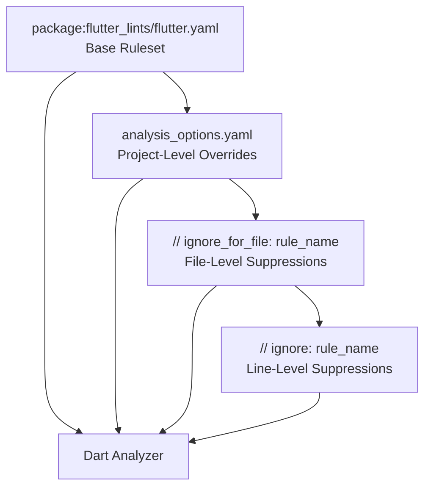
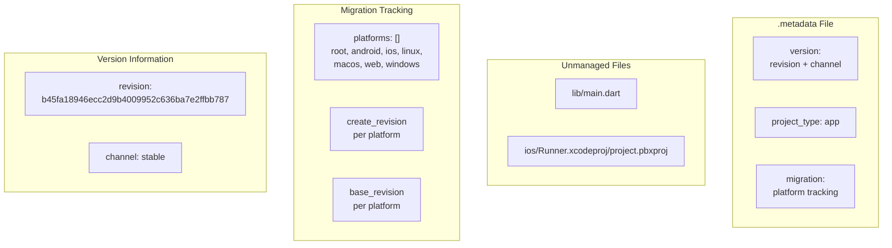
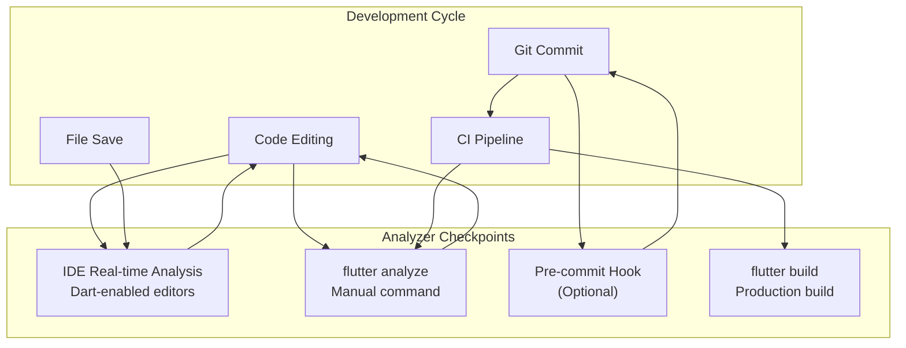
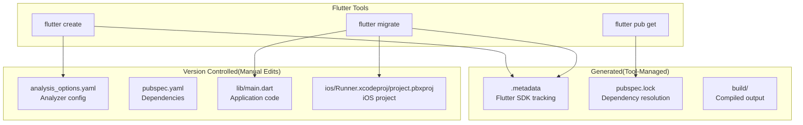

# Development Guidelines

> **Relevant source files**
> * [.metadata](https://github.com/axchisan/AxIA/blob/1fe26c44/.metadata)
> * [analysis_options.yaml](https://github.com/axchisan/AxIA/blob/1fe26c44/analysis_options.yaml)

## Purpose and Scope

This document defines the code quality standards, linting rules, and development best practices for the AxIA Flutter application. It covers the Dart analyzer configuration, Flutter project metadata tracking, and automated code quality enforcement mechanisms.

For backend-specific deployment and configuration, see [Backend Deployment](/axchisan/AxIA/12.1-backend-deployment). For security best practices around credential management, see [Secure Credential Storage](/axchisan/AxIA/4.2-secure-credential-storage).

---

## Code Quality Standards

The AxIA project enforces code quality through static analysis using the Dart analyzer and the `flutter_lints` package. The analyzer runs automatically in IDEs and can be invoked manually via `flutter analyze` command.

### Dart Analyzer Configuration

The project uses [analysis_options.yaml L1-L33](https://github.com/axchisan/AxIA/blob/1fe26c44/analysis_options.yaml#L1-L33)

 to configure the Dart analyzer. The configuration is based on the recommended Flutter lints package, which provides a curated set of lint rules designed for Flutter applications.

**Key Configuration Elements:**

| Configuration | Value | Purpose |
| --- | --- | --- |
| Base ruleset | `package:flutter_lints/flutter.yaml` | Activates recommended Flutter lints |
| `unused_import` | `ignore` | Allows unused imports during development |
| `unused_local_variable` | `ignore` | Allows unused local variables during development |

The relaxed error settings for `unused_import` and `unused_local_variable` [analysis_options.yaml L11-L13](https://github.com/axchisan/AxIA/blob/1fe26c44/analysis_options.yaml#L11-L13)

 facilitate rapid prototyping and iterative development by preventing build failures from temporarily unused code during refactoring.

### Lint Rule Customization

The analyzer configuration supports three levels of lint rule customization:



**Sources:** [analysis_options.yaml L8-L29](https://github.com/axchisan/AxIA/blob/1fe26c44/analysis_options.yaml#L8-L29)

#### Project-Level Overrides

The `linter.rules` section [analysis_options.yaml L16-L29](https://github.com/axchisan/AxIA/blob/1fe26c44/analysis_options.yaml#L16-L29)

 allows enabling or disabling specific lint rules for the entire project. Commented examples show how to disable `avoid_print` or enable `prefer_single_quotes`:

```yaml
rules:
  # avoid_print: false  # Uncomment to disable the `avoid_print` rule
  # prefer_single_quotes: true  # Uncomment to enable the `prefer_single_quotes` rule
```

#### Inline Suppressions

For granular control, developers can suppress specific lints inline:

* `// ignore: name_of_lint` - Suppresses lint for a single line
* `// ignore_for_file: name_of_lint` - Suppresses lint for entire file

This approach is documented in [analysis_options.yaml L22-L26](https://github.com/axchisan/AxIA/blob/1fe26c44/analysis_options.yaml#L22-L26)

**Sources:** [analysis_options.yaml L1-L33](https://github.com/axchisan/AxIA/blob/1fe26c44/analysis_options.yaml#L1-L33)

---

## Flutter Project Metadata

The `.metadata` file tracks Flutter project properties used by the Flutter tooling for capability assessment, version management, and automated upgrades.

### Flutter Project Metadata Structure



**Sources:** [.metadata L1-L46](https://github.com/axchisan/AxIA/blob/1fe26c44/.metadata#L1-L46)

### Version Management

The `version` section [.metadata L6-L8](https://github.com/axchisan/AxIA/blob/1fe26c44/.metadata#L6-L8)

 records the exact Flutter SDK revision and release channel:

| Property | Value | Description |
| --- | --- | --- |
| `revision` | `b45fa18946ecc2d9b4009952c636ba7e2ffbb787` | Flutter SDK commit hash |
| `channel` | `stable` | Release channel (stable, beta, dev, master) |

This information ensures all developers use the same Flutter version, preventing inconsistencies from SDK differences.

**Sources:** [.metadata L6-L8](https://github.com/axchisan/AxIA/blob/1fe26c44/.metadata#L6-L8)

### Migration Tracking

The `migration` section [.metadata L13-L35](https://github.com/axchisan/AxIA/blob/1fe26c44/.metadata#L13-L35)

 tracks platform-specific configurations for the `flutter migrate` command:

#### Platform Support Matrix

The project supports seven platforms, each tracked with its creation and base revision:

| Platform | Create Revision | Base Revision | Status |
| --- | --- | --- | --- |
| root | b45fa18946ecc2d9b4009952c636ba7e2ffbb787 | b45fa18946ecc2d9b4009952c636ba7e2ffbb787 | Active |
| android | b45fa18946ecc2d9b4009952c636ba7e2ffbb787 | b45fa18946ecc2d9b4009952c636ba7e2ffbb787 | Active |
| ios | b45fa18946ecc2d9b4009952c636ba7e2ffbb787 | b45fa18946ecc2d9b4009952c636ba7e2ffbb787 | Active |
| linux | b45fa18946ecc2d9b4009952c636ba7e2ffbb787 | b45fa18946ecc2d9b4009952c636ba7e2ffbb787 | Configured |
| macos | b45fa18946ecc2d9b4009952c636ba7e2ffbb787 | b45fa18946ecc2d9b4009952c636ba7e2ffbb787 | Configured |
| web | b45fa18946ecc2d9b4009952c636ba7e2ffbb787 | b45fa18946ecc2d9b4009952c636ba7e2ffbb787 | Configured |
| windows | b45fa18946ecc2d9b4009952c636ba7e2ffbb787 | b45fa18946ecc2d9b4009952c636ba7e2ffbb787 | Configured |

All platforms share the same revision, indicating they were initialized simultaneously from the same Flutter SDK version.

**Sources:** [.metadata L13-L35](https://github.com/axchisan/AxIA/blob/1fe26c44/.metadata#L13-L35)

#### Unmanaged Files

The `unmanaged_files` section [.metadata L39-L45](https://github.com/axchisan/AxIA/blob/1fe26c44/.metadata#L39-L45)

 declares files that should be ignored by the `flutter migrate` tool:

* `lib/main.dart` - Application entry point with custom modifications
* `ios/Runner.xcodeproj/project.pbxproj` - iOS project configuration with custom settings

These files contain project-specific customizations that should not be overwritten during automated Flutter SDK migrations.

**Sources:** [.metadata L39-L45](https://github.com/axchisan/AxIA/blob/1fe26c44/.metadata#L39-L45)

---

## Development Workflow Best Practices

### Analyzer Integration

The Dart analyzer integrates with the development workflow at multiple points:



**Sources:** [analysis_options.yaml L1-L6](https://github.com/axchisan/AxIA/blob/1fe26c44/analysis_options.yaml#L1-L6)

### Recommended Development Practices

#### 1. Enable Real-time Analysis

Configure your IDE to use the Dart analyzer for real-time feedback. Supported IDEs include:

* Android Studio / IntelliJ IDEA with Dart plugin
* Visual Studio Code with Dart extension
* Sublime Text with LSP-Dart

Reference: [analysis_options.yaml L4-L5](https://github.com/axchisan/AxIA/blob/1fe26c44/analysis_options.yaml#L4-L5)

#### 2. Run Manual Analysis Before Commits

Execute `flutter analyze` before committing code to catch issues early:

```
flutter analyze
```

This command uses the configuration in [analysis_options.yaml L1-L33](https://github.com/axchisan/AxIA/blob/1fe26c44/analysis_options.yaml#L1-L33)

 to check all Dart code in the project.

#### 3. Address Analyzer Warnings

While `unused_import` and `unused_local_variable` are set to `ignore` [analysis_options.yaml L11-L13](https://github.com/axchisan/AxIA/blob/1fe26c44/analysis_options.yaml#L11-L13)

 developers should still clean up unused code before final commits to maintain code quality.

#### 4. Document Intentional Suppressions

When using inline suppressions (`// ignore:` or `// ignore_for_file:`), add a comment explaining why the lint is being suppressed:

```python
// ignore: avoid_print
print(debugInfo); // Required for debugging production issues
```

This practice helps reviewers understand the rationale for bypassing lint rules.

**Sources:** [analysis_options.yaml L22-L26](https://github.com/axchisan/AxIA/blob/1fe26c44/analysis_options.yaml#L22-L26)

---

## File Modification Guidelines

### Version-Controlled vs. Generated Files

The project distinguishes between manually maintained files and Flutter-generated files:



**Sources:** [.metadata L1-L46](https://github.com/axchisan/AxIA/blob/1fe26c44/.metadata#L1-L46)

 [analysis_options.yaml L1-L33](https://github.com/axchisan/AxIA/blob/1fe26c44/analysis_options.yaml#L1-L33)

### Modifying Analysis Options

To change lint rules:

1. Edit [analysis_options.yaml L27-L29](https://github.com/axchisan/AxIA/blob/1fe26c44/analysis_options.yaml#L27-L29)  to add or modify rules
2. Run `flutter analyze` to verify the configuration
3. Fix any new issues surfaced by enabled rules
4. Commit the changes to version control

### Updating Flutter SDK Version

When upgrading the Flutter SDK:

1. Run `flutter upgrade` to update to the latest version
2. The `.metadata` file will automatically update with new revision [.metadata L6-L8](https://github.com/axchisan/AxIA/blob/1fe26c44/.metadata#L6-L8)
3. Run `flutter pub upgrade` to update dependencies
4. Test thoroughly, especially if migration warnings appear
5. Commit `.metadata` and `pubspec.lock` changes

**Sources:** [.metadata L1-L46](https://github.com/axchisan/AxIA/blob/1fe26c44/.metadata#L1-L46)

---

## Code Analysis Configuration Reference

### Analyzer Error Levels

The analyzer supports multiple error severity levels:

| Level | Effect | Use Case |
| --- | --- | --- |
| `error` | Build failure | Critical issues that must be fixed |
| `warning` | IDE warning indicator | Important issues that should be fixed |
| `info` | IDE information indicator | Code improvements suggestions |
| `ignore` | No feedback | Explicitly disabled checks |

The AxIA project uses `ignore` for `unused_import` and `unused_local_variable` [analysis_options.yaml L11-L13](https://github.com/axchisan/AxIA/blob/1fe26c44/analysis_options.yaml#L11-L13)

 to maintain development velocity while prototyping.

### Flutter Lints Package

The `package:flutter_lints/flutter.yaml` [analysis_options.yaml L14](https://github.com/axchisan/AxIA/blob/1fe26c44/analysis_options.yaml#L14-L14)

 provides:

* **Core Dart lints**: Language best practices
* **Flutter-specific lints**: Framework-specific patterns
* **UI lints**: Widget usage recommendations
* **Performance lints**: Efficiency guidelines

This package is maintained by the Flutter team and updated with each Flutter release to reflect current best practices.

**Sources:** [analysis_options.yaml L8-L14](https://github.com/axchisan/AxIA/blob/1fe26c44/analysis_options.yaml#L8-L14)

---

## Maintaining Code Quality

### Pre-merge Checklist

Before merging code to main branch:

* `flutter analyze` passes without errors
* All tests pass (`flutter test`)
* Unused imports removed (even if not enforced)
* Unused variables removed (even if not enforced)
* Inline suppressions documented with comments
* Code formatted (`flutter format .`)

### Periodic Maintenance

#### Quarterly Review

Every three months:

1. Review `analysis_options.yaml` for outdated suppressions
2. Check if new lint rules should be enabled
3. Update `flutter_lints` package to latest version
4. Run `flutter analyze` and address any new warnings

#### Flutter SDK Updates

When updating Flutter SDK major versions:

1. Review [.metadata L1-L46](https://github.com/axchisan/AxIA/blob/1fe26c44/.metadata#L1-L46)  to confirm new revision
2. Check for breaking changes in analyzer rules
3. Run `flutter migrate` if prompted
4. Update documentation if new platforms are added [.metadata L14-L35](https://github.com/axchisan/AxIA/blob/1fe26c44/.metadata#L14-L35)

**Sources:** [.metadata L1-L46](https://github.com/axchisan/AxIA/blob/1fe26c44/.metadata#L1-L46)

 [analysis_options.yaml L1-L33](https://github.com/axchisan/AxIA/blob/1fe26c44/analysis_options.yaml#L1-L33)

---

## Related Documentation

* For child pages with detailed configuration: * [Code Analysis](/axchisan/AxIA/10.1-code-analysis) - Deep dive into analyzer configuration and lint rules * [Flutter Metadata](/axchisan/AxIA/10.2-flutter-metadata) - Detailed explanation of `.metadata` file structure
* For platform-specific configurations: * [Android Setup](/axchisan/AxIA/9.1-android-setup) - Android manifest and permissions
* For repository management: * [Gitignore Configuration](/axchisan/AxIA/11.1-gitignore-configuration) - Files excluded from version control