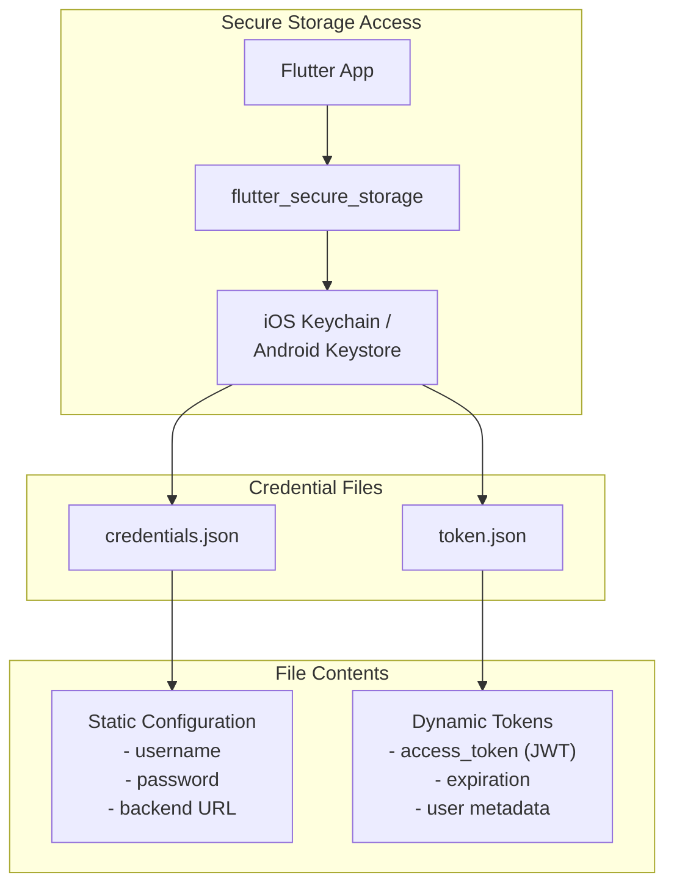
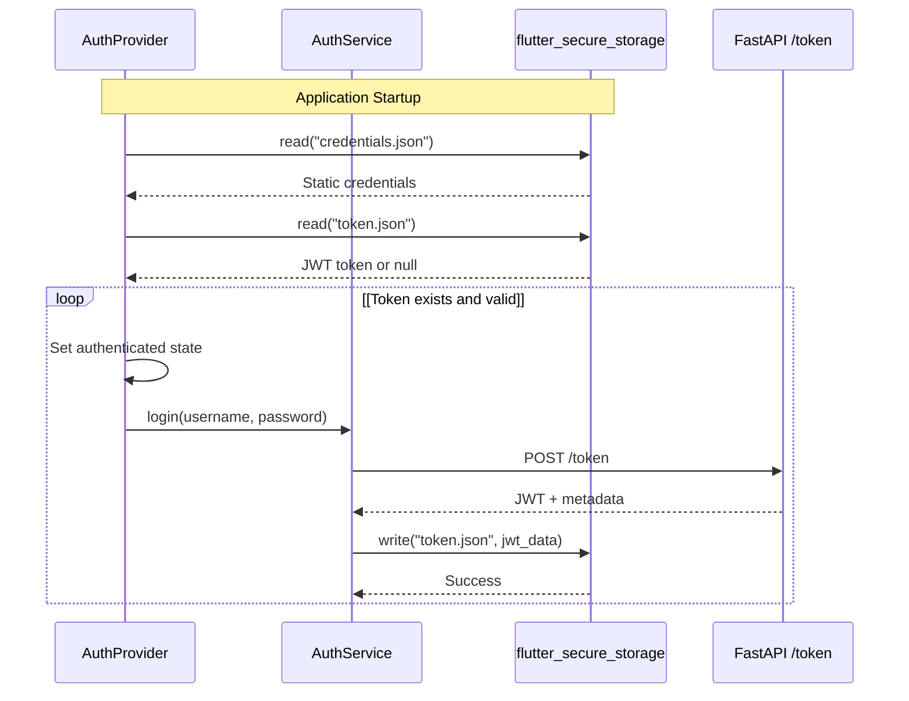
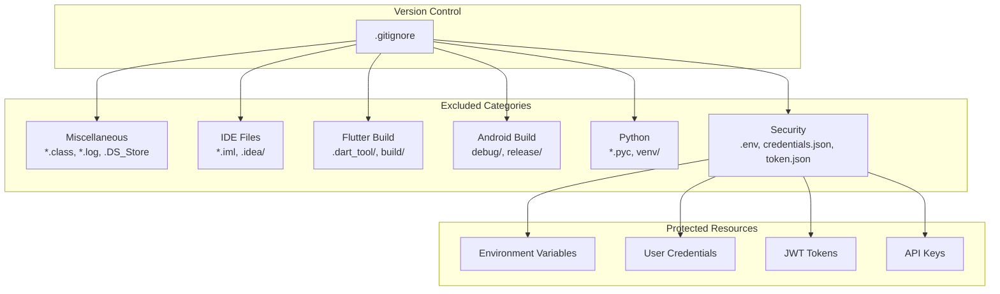
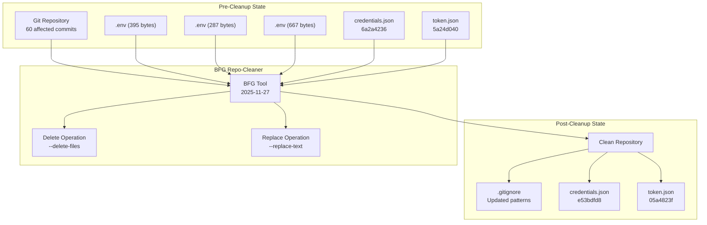
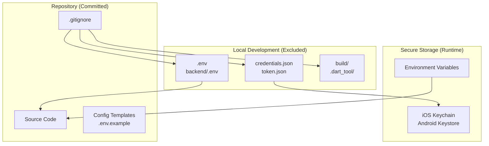

# Environment Setup

> **Relevant source files**
> * [..bfg-report/2025-11-27/02-50-28/deleted-files.txt](https://github.com/axchisan/AxIA/blob/1fe26c44/..bfg-report/2025-11-27/02-50-28/deleted-files.txt)
> * [..bfg-report/2025-11-27/02-56-33/changed-files.txt](https://github.com/axchisan/AxIA/blob/1fe26c44/..bfg-report/2025-11-27/02-56-33/changed-files.txt)
> * [.gitignore](https://github.com/axchisan/AxIA/blob/1fe26c44/.gitignore)

## Purpose and Scope

This document details the environment configuration for the AxIA system, including environment variables, credentials management, and version control exclusion patterns. It covers how sensitive data is stored, accessed, and protected from accidental exposure in the repository.

For information about secure credential storage on the device using `flutter_secure_storage`, see [Secure Credential Storage](/axchisan/AxIA/4.2-secure-credential-storage). For production deployment configuration, see [Environment Variables](/axchisan/AxIA/12.2-environment-variables). For authentication token flow, see [JWT Token Flow](/axchisan/AxIA/4.1-jwt-token-flow).

---

## Environment Variables

AxIA uses environment variables for backend configuration, particularly in the FastAPI backend and n8n workflow engine. These variables store sensitive configuration data that should never be committed to version control.

### Environment Variable Storage Locations

| Component | File Location | Purpose |
| --- | --- | --- |
| FastAPI Backend | `backend/.env` | Database connection, JWT secrets, API keys |
| n8n Workflows | `.env` (root) | Workflow credentials, webhook URLs |
| Flutter App | Not used directly | Uses `credentials.json` and `token.json` instead |

**Sources:** [.gitignore L18](https://github.com/axchisan/AxIA/blob/1fe26c44/.gitignore#L18-L18)

 [.gitignore L50](https://github.com/axchisan/AxIA/blob/1fe26c44/.gitignore#L50-L50)

---

## Credentials Management

The Flutter application manages authentication credentials through two JSON files stored in platform-specific secure storage. These files are accessed through the `flutter_secure_storage` package and are never committed to version control.

### Credential File Structure



**Credential Management Flow in Code**



### credentials.json

This file stores static authentication configuration that persists across app installations (if backed up). It is written once during initial setup and read on every app startup.

**Typical Structure:**

```json
{
  "username": "user@example.com",
  "password": "hashed_or_encrypted_password",
  "backend_url": "https://api.axia.example.com"
}
```

### token.json

This file stores the dynamic JWT access token obtained from the backend. It is updated whenever the user authenticates or the token is refreshed.

**Typical Structure:**

```json
{
  "access_token": "eyJhbGciOiJIUzI1NiIsInR5cCI6IkpXVCJ9...",
  "token_type": "bearer",
  "expires_at": "2025-11-28T12:00:00Z",
  "user_id": "user123"
}
```

**Sources:** [.gitignore L51-L52](https://github.com/axchisan/AxIA/blob/1fe26c44/.gitignore#L51-L52)

 [..bfg-report/2025-11-27/02-56-33/changed-files.txt L1-L2](https://github.com/axchisan/AxIA/blob/1fe26c44/..bfg-report/2025-11-27/02-56-33/changed-files.txt#L1-L2)

---

## Gitignore Configuration

The `.gitignore` file prevents sensitive files and build artifacts from being committed to version control. It is organized by file type and framework.

### Critical Security Patterns

These patterns prevent sensitive data from being committed:

| Pattern | Files Excluded | Reason |
| --- | --- | --- |
| `.env` | Environment variable files (root) | Contains API keys, secrets |
| `backend/.env` | Backend environment configuration | Database credentials, JWT secret |
| `credentials.json` | Flutter app credentials | User authentication data |
| `token.json` | JWT access tokens | Active session tokens |

**Sources:** [.gitignore L18](https://github.com/axchisan/AxIA/blob/1fe26c44/.gitignore#L18-L18)

 [.gitignore L50-L52](https://github.com/axchisan/AxIA/blob/1fe26c44/.gitignore#L50-L52)

### Build Artifact Patterns

| Category | Patterns | Description |
| --- | --- | --- |
| Flutter/Dart | `.dart_tool/`, `.pub-cache/`, `build/` | Compiled code, dependencies |
| Android | `/android/app/debug`, `/android/app/release` | Android build outputs |
| Python | `*.pyc`, `venv/`, `.venv` | Python bytecode, virtual environments |
| IDE | `.idea/`, `*.iml` | IntelliJ/Android Studio files |

**Sources:** [.gitignore L1-L53](https://github.com/axchisan/AxIA/blob/1fe26c44/.gitignore#L1-L53)

### Complete Gitignore Structure



**Sources:** [.gitignore L1-L53](https://github.com/axchisan/AxIA/blob/1fe26c44/.gitignore#L1-L53)

---

## Security Remediation History

The AxIA repository underwent a security cleanup on 2025-11-27 using BFG Repo-Cleaner to remove sensitive files that were previously committed to Git history.

### Files Removed from History

#### Environment Files

Three versions of `.env` files were completely removed from all commits:

| Object Hash | Size (bytes) | File |
| --- | --- | --- |
| `3919fb335ae9298202899d864cb16f0e48354742` | 395 | `.env` |
| `77c7def985bc3631b00eac4303b505b731edf104` | 287 | `.env` |
| `7e067d72c19b3672c428e80cf8ffa00b629ed549` | 667 | `.env` |

**Sources:** [..bfg-report/2025-11-27/02-50-28/deleted-files.txt L1-L3](https://github.com/axchisan/AxIA/blob/1fe26c44/..bfg-report/2025-11-27/02-50-28/deleted-files.txt#L1-L3)

#### Credential Files

Two credential files had their contents rewritten across all historical commits:

| Original Object Hash | New Object Hash | File |
| --- | --- | --- |
| `6a2a4236e0862080288d98f79c006dc2ff63f658` | `e53bdfd86d0a7dfbbda0aac63f68dd75297562eb` | `credentials.json` |
| `5a24d0406f63e1eed1a98aa264829a80d0cfa953` | `05a4823f39b6a80e2dc1d124aa954d76d3a4265c` | `token.json` |

**Sources:** [..bfg-report/2025-11-27/02-56-33/changed-files.txt L1-L2](https://github.com/axchisan/AxIA/blob/1fe26c44/..bfg-report/2025-11-27/02-56-33/changed-files.txt#L1-L2)

### Security Cleanup Process



**Sources:** [..bfg-report/2025-11-27/02-50-28/deleted-files.txt L1-L3](https://github.com/axchisan/AxIA/blob/1fe26c44/..bfg-report/2025-11-27/02-50-28/deleted-files.txt#L1-L3)

 [..bfg-report/2025-11-27/02-56-33/changed-files.txt L1-L2](https://github.com/axchisan/AxIA/blob/1fe26c44/..bfg-report/2025-11-27/02-56-33/changed-files.txt#L1-L2)

---

## Environment Setup Best Practices

### For Development

1. **Never commit sensitive files**: Always verify `.gitignore` patterns before committing
2. **Use local environment files**: Create `.env` files locally, never share them via version control
3. **Use secure storage**: Store credentials in `credentials.json` and `token.json` only through `flutter_secure_storage`
4. **Rotate tokens regularly**: JWT tokens expire after 24 hours; implement proper refresh logic

### For Production Deployment

1. **Use environment variables**: Replace `.env` files with environment variables in production
2. **Secure secret management**: Use platforms like AWS Secrets Manager or HashiCorp Vault
3. **Separate configurations**: Maintain distinct credentials for development, staging, and production
4. **Audit access**: Regularly review who has access to production credentials

### File Organization



**Sources:** [.gitignore L1-L53](https://github.com/axchisan/AxIA/blob/1fe26c44/.gitignore#L1-L53)

---

## Summary

Environment setup in AxIA emphasizes security through:

* **Exclusion**: Sensitive files are never committed via comprehensive `.gitignore` patterns
* **Secure storage**: Credentials use platform-native secure storage (Keychain/Keystore)
* **Remediation**: Historical leaks were cleaned using BFG Repo-Cleaner
* **Best practices**: Clear separation between development and production configurations

The system stores configuration in three distinct layers:

1. **Static credentials** in `credentials.json` for authentication
2. **Dynamic tokens** in `token.json` for session management
3. **Environment variables** in `.env` files for backend services

All sensitive files are protected through `.gitignore` and accessed only through appropriate secure channels.

**Sources:** [.gitignore L1-L53](https://github.com/axchisan/AxIA/blob/1fe26c44/.gitignore#L1-L53)

 [..bfg-report/2025-11-27/02-50-28/deleted-files.txt L1-L3](https://github.com/axchisan/AxIA/blob/1fe26c44/..bfg-report/2025-11-27/02-50-28/deleted-files.txt#L1-L3)

 [..bfg-report/2025-11-27/02-56-33/changed-files.txt L1-L2](https://github.com/axchisan/AxIA/blob/1fe26c44/..bfg-report/2025-11-27/02-56-33/changed-files.txt#L1-L2)