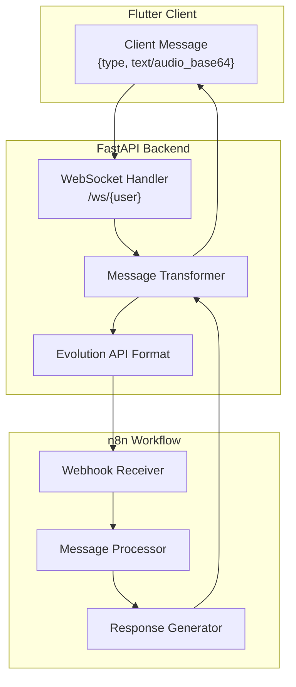
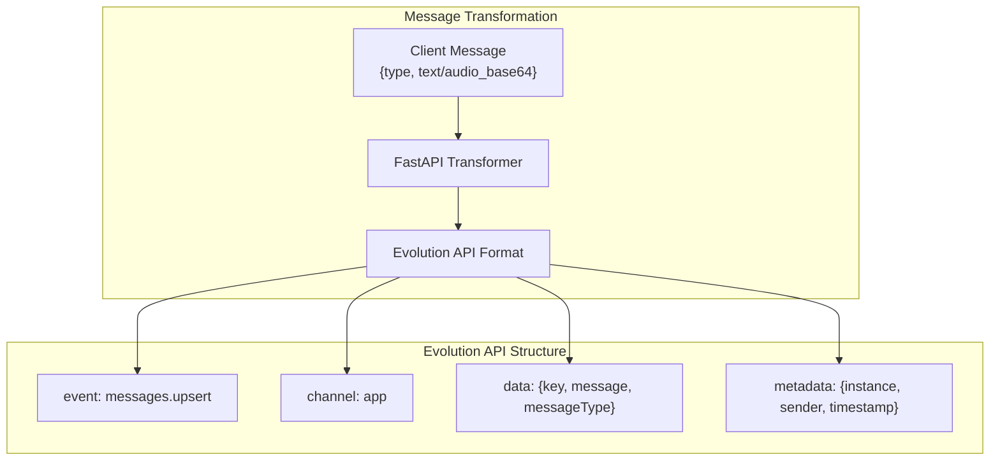
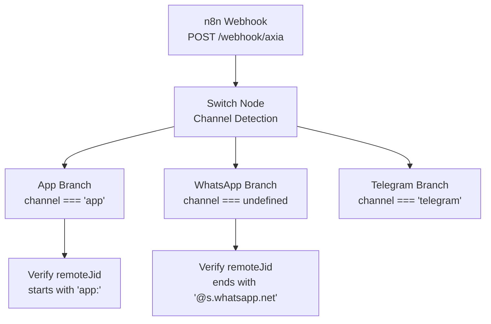
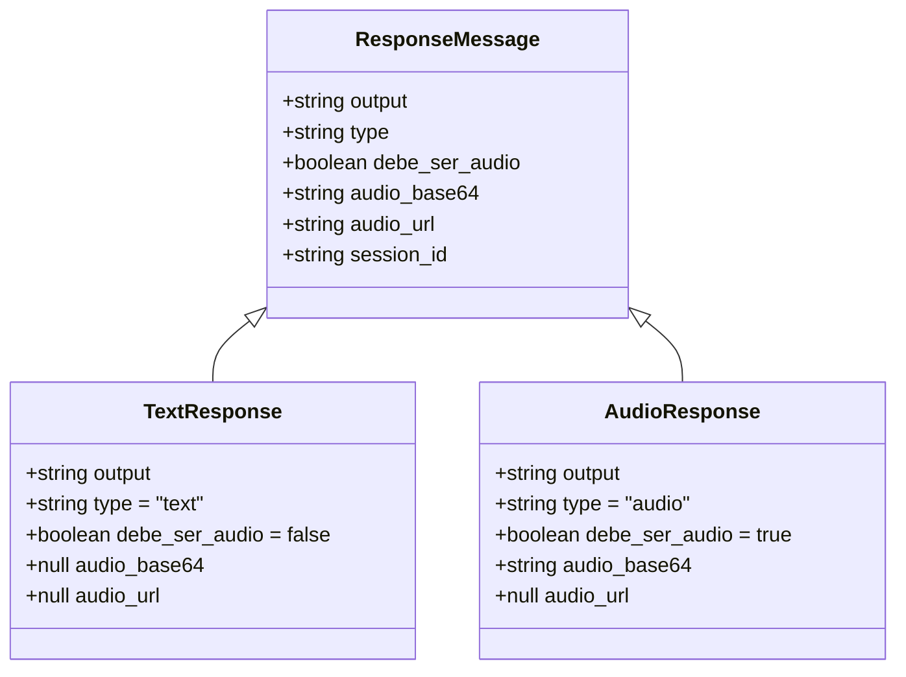
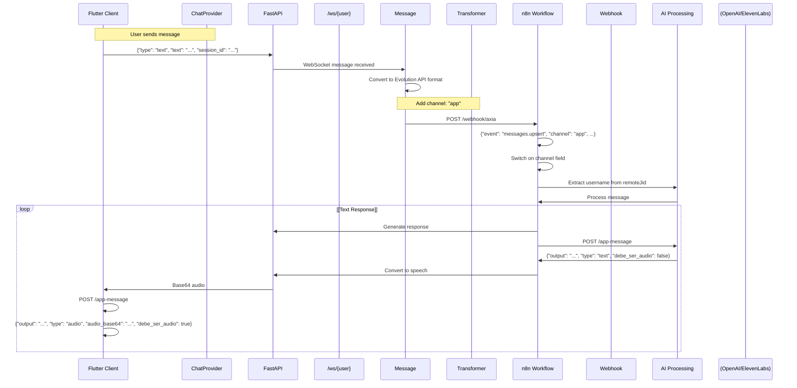

# Estructuras de datos de mensajes

> **Archivos fuente relevantes**
> * [GUÍA DE IMPLEMENTACIÓN DE AUDIO.md](https://github.com/axchisan/AxIA/blob/1fe26c44/AUDIO_IMPLEMENTATION_GUIDE.md)
> * [GUÍA DE INTEGRACIÓN N8N.md](https://github.com/axchisan/AxIA/blob/1fe26c44/N8N_INTEGRATION_GUIDE.md)

## Propósito y alcance

Este documento define los esquemas JSON para todos los tipos de mensajes intercambiados entre el cliente Flutter de AxIA, el backend FastAPI y el motor de flujo de trabajo n8n. Especifica la estructura exacta de los mensajes de texto, los mensajes de audio y las respuestas de IA en cada etapa del flujo de comunicación.

Para obtener información sobre el protocolo de comunicación WebSocket y el ciclo de vida de la conexión, consulte [el protocolo WebSocket](/axchisan/AxIA/8.2-websocket-protocol) . Para obtener más información sobre los puntos de conexión de la API REST, consulte [los puntos de conexión REST](/axchisan/AxIA/8.1-rest-endpoints) . Para obtener información sobre la implementación de la codificación y reproducción de audio, consulte [la integración de backend de audio](/axchisan/AxIA/6.3-audio-backend-integration) .

---

## Descripción general del flujo de mensajes

Los mensajes se transforman a través de tres formatos distintos a medida que fluyen a través del sistema:



**Fuentes:** [GU L1-L256](https://github.com/axchisan/AxIA/blob/1fe26c44/N8N_INTEGRATION_GUIDE.md#L1-L256)

 [GU L99-L150](https://github.com/axchisan/AxIA/blob/1fe26c44/AUDIO_IMPLEMENTATION_GUIDE.md#L99-L150)

---

## Formato del mensaje de cliente → backend

### Estructura del mensaje WebSocket

El cliente Flutter envía mensajes a través de WebSocket en un formato simplificado:

```

```

### Esquema de mensaje de texto

| Campo | Tipo | Requerido | Descripción |
| --- | --- | --- | --- |
| `type` | cadena | Sí | Identificador del tipo de mensaje. Valor:`"text"` |
| `text` | cadena | Sí | Contenido de texto simple del mensaje |
| `session_id` | cadena | Sí | Identificador de sesión de cliente para seguimiento de mensajes |

**Ejemplo:**

```json
{
  "type": "text",
  "text": "que correos he recibido hoy",
  "session_id": "1732659417635"
}
```

### Esquema de mensaje de audio

| Campo | Tipo | Requerido | Descripción |
| --- | --- | --- | --- |
| `type` | cadena | Sí | Identificador del tipo de mensaje. Valor:`"audio"` |
| `audio_base64` | cadena | Sí | Datos de audio AAC/M4A codificados en Base64 |
| `session_id` | cadena | Sí | Identificador de sesión de cliente para seguimiento de mensajes |

**Ejemplo:**

```json
{
  "type": "audio",
  "audio_base64": "AAAAGGZ0eXBNNEEgAAACAGlzb21pc28yAAA...",
  "session_id": "1732659500000"
}
```

**Especificaciones de codificación de audio:**

* **Formato:** AAC (contenedor M4A)
* **Tasa de bits:** 128 kbps
* **Frecuencia de muestreo:** 44,1 kHz
* **Codificación:** Base64 (RFC 4648)

**Fuentes:** [GU L113-L125](https://github.com/axchisan/AxIA/blob/1fe26c44/AUDIO_IMPLEMENTATION_GUIDE.md#L113-L125)

 [GU L36-L62](https://github.com/axchisan/AxIA/blob/1fe26c44/N8N_INTEGRATION_GUIDE.md#L36-L62)

---

## Backend → Formato de webhook n8n

### Capa de compatibilidad de la API de Evolution

El backend FastAPI transforma los mensajes del cliente al formato Evolution API para mantener la compatibilidad con los flujos de trabajo n8n existentes que procesan mensajes de WhatsApp.



### Esquema de carga útil de webhook completo

| Campo | Tipo | Requerido | Descripción |
| --- | --- | --- | --- |
| `event` | cadena | Sí | Tipo de evento. Siempre`"messages.upsert"` |
| `instance` | cadena | Sí | Identificador de instancia. Valor:`"AxIAPersonal"` |
| `channel` | cadena | Sí | Discriminador de canal. Valor:`"app"` |
| `data` | objeto | Sí | Objeto de datos del mensaje (ver más abajo) |
| `destination` | cadena | Sí | URL del webhook n8n |
| `date_time` | cadena | Sí | Marca de tiempo ISO 8601 |
| `sender` | cadena | Sí | Identificador del remitente en formato`username@axia.app` |

### Esquema de objeto de datos

| Campo | Tipo | Requerido | Descripción |
| --- | --- | --- | --- |
| `key` | objeto | Sí | Objeto clave del mensaje (ver más abajo) |
| `pushName` | cadena | Sí | Nombre para mostrar del remitente |
| `message` | objeto | Sí | Objeto de contenido del mensaje (ver más abajo) |
| `messageType` | cadena | Sí | `"conversation"`o`"audioMessage"` |
| `messageTimestamp` | entero | Sí | Marca de tiempo de Unix (segundos) |
| `source` | cadena | Sí | Identificador de origen. Valor:`"flutter_app"` |

### Esquema de objeto clave

| Campo | Tipo | Requerido | Descripción |
| --- | --- | --- | --- |
| `remoteJid` | cadena | Sí | JID remoto en formato`app:username@axia.app` |
| `fromMe` | booleano | Sí | Dirección del mensaje. Siempre `false`para mensajes entrantes. |
| `id` | cadena | Sí | ID del mensaje (marca de tiempo en milisegundos) |

### Objeto de contenido del mensaje

**Para mensajes de texto:**

| Campo | Tipo | Requerido | Descripción |
| --- | --- | --- | --- |
| `conversation` | cadena | Sí | Contenido del texto |

**Para mensajes de audio:**

| Campo | Tipo | Requerido | Descripción |
| --- | --- | --- | --- |
| `base64` | cadena | Sí | Datos de audio codificados en Base64 |

### Ejemplo de mensaje de texto

```json
{
  "event": "messages.upsert",
  "instance": "AxIAPersonal",
  "channel": "app",
  "data": {
    "key": {
      "remoteJid": "app:AxchiSan@axia.app",
      "fromMe": false,
      "id": "1732659417635"
    },
    "pushName": "AxchiSan",
    "message": {
      "conversation": "que correos he recibido hoy"
    },
    "messageType": "conversation",
    "messageTimestamp": 1732659417,
    "source": "flutter_app"
  },
  "destination": "https://n8n.axchisan.com/webhook/15f68f4b-70e3-48eb-ae7d-d36d0a630118",
  "date_time": "2025-11-27T00:16:57.635730",
  "sender": "AxchiSan@axia.app"
}
```

### Ejemplo de mensaje de audio

```json
{
  "event": "messages.upsert",
  "instance": "AxIAPersonal",
  "channel": "app",
  "data": {
    "key": {
      "remoteJid": "app:AxchiSan@axia.app",
      "fromMe": false,
      "id": "1732659500000"
    },
    "pushName": "AxchiSan",
    "message": {
      "base64": "AAAAGGZ0eXBNNEEgAAACAGlzb21pc28yAAA..."
    },
    "messageType": "audioMessage",
    "messageTimestamp": 1732659500,
    "source": "flutter_app"
  },
  "destination": "https://n8n.axchisan.com/webhook/15f68f4b-70e3-48eb-ae7d-d36d0a630118",
  "date_time": "2025-11-27T00:18:20.000000",
  "sender": "AxchiSan@axia.app"
}
```

**Fuentes:** [GU L8-L62](https://github.com/axchisan/AxIA/blob/1fe26c44/N8N_INTEGRATION_GUIDE.md#L8-L62)

 [GU L63-L71](https://github.com/axchisan/AxIA/blob/1fe26c44/N8N_INTEGRATION_GUIDE.md#L63-L71)

---

## Detección y enrutamiento de canales

### Campos discriminadores de canales

El `channel`campo y `remoteJid`el formato permiten a n8n distinguir entre diferentes fuentes de mensajes:

| Fuente | `channel` | `remoteJid`Formato | `source` |
| --- | --- | --- | --- |
| Aplicación AxIA | `"app"` | `app:username@axia.app` | `"flutter_app"` |
| WhatsApp | `undefined` | `573183038190:24@s.whatsapp.net` | `"android"` |
| Telegrama | `"telegram"` | Varía | Varía |



### Expresión de cambio n8n

El flujo de trabajo n8n utiliza esta expresión para extraer el nombre de usuario:

```javascript
{{
  $if($('Webhook').isExecuted, 
    (() => {
      const remoteJid = $('Webhook').item.json.body.data.key.remoteJid;
      const channel = $('Webhook').item.json.body.channel;
      
      // If from app, extract username
      if (channel === 'app' || remoteJid.startsWith('app:')) {
        return remoteJid.split(':')[1].split('@')[0];
      }
      
      // If from WhatsApp, use legacy logic
      return remoteJid.split('@')[0].split(':')[0];
    })(), 
    ''
  )
}}
```

**Fuentes:** [GU L72-L138](https://github.com/axchisan/AxIA/blob/1fe26c44/N8N_INTEGRATION_GUIDE.md#L72-L138)

---

## n8n → Formato de respuesta de backend

### Esquema del mensaje de respuesta

El flujo de trabajo n8n devuelve respuestas a través de HTTP POST al `/app-message`punto final:

| Campo | Tipo | Requerido | Descripción |
| --- | --- | --- | --- |
| `output` | cadena | Sí | Contenido del texto de respuesta (puede contener Markdown) |
| `type` | cadena | Sí | Tipo de respuesta: `"text"`o`"audio"` |
| `debe_ser_audio` | booleano | Sí | Indica si el cliente debe reproducir audio automáticamente |
| `audio_base64` | cadena | No | Respuesta de audio codificada en Base64 (si el tipo es `"audio"`) |
| `audio_url` | cadena | No | URL HTTP al archivo de audio (obsoleto, usar `audio_base64`) |
| `session_id` | cadena | No | ID de sesión original para correlación |



### Ejemplo de respuesta de texto

```json
{
  "output": "Tu respuesta aquí",
  "type": "text",
  "debe_ser_audio": false,
  "audio_url": null,
  "session_id": "1732659417635"
}
```

### Ejemplo de respuesta de audio

```json
{
  "output": "Texto de la respuesta",
  "type": "audio",
  "debe_ser_audio": true,
  "audio_base64": "SUQzBAAAAAAAI1RTU0UAAAAPAAADTGF2ZjU4Ljc2LjEwMAAAAAAAAAAA...",
  "audio_url": null,
  "session_id": "1732659500000"
}
```

### Matriz de comportamiento de respuesta

| `type` | `debe_ser_audio` | Comportamiento del cliente |
| --- | --- | --- |
| `"text"` | `false` | Mostrar texto con renderizado Markdown |
| `"text"` | `true` | Mostrar texto Y reproducir audio si está disponible |
| `"audio"` | `false` | Mostrar texto, audio disponible para reproducción manual |
| `"audio"` | `true` | Mostrar texto y reproducir audio automáticamente |

**Fuentes:** [GU L140-L162](https://github.com/axchisan/AxIA/blob/1fe26c44/N8N_INTEGRATION_GUIDE.md#L140-L162)

 [GU L136-L150](https://github.com/axchisan/AxIA/blob/1fe26c44/AUDIO_IMPLEMENTATION_GUIDE.md#L136-L150)

---

## Diagrama de flujo de mensajes completo



**Fuentes:** [GU L1-L256](https://github.com/axchisan/AxIA/blob/1fe26c44/N8N_INTEGRATION_GUIDE.md#L1-L256)

 [GU L99-L150](https://github.com/axchisan/AxIA/blob/1fe26c44/AUDIO_IMPLEMENTATION_GUIDE.md#L99-L150)

---

## Referencia de campo

### Tipos de campos estándar

| Nombre del campo | Tipo | Formato | Restricciones |
| --- | --- | --- | --- |
| `session_id` | cadena | Marca de tiempo (milisegundos) | Longitud: 13 dígitos |
| `messageTimestamp` | entero | Marca de tiempo de Unix (segundos) | entero positivo |
| `date_time` | cadena | ISO 8601 | Formato:`YYYY-MM-DDTHH:mm:ss.ffffff` |
| `audio_base64` | cadena | Base64 | Codificación RFC 4648, sin saltos de línea |
| `remoteJid` | cadena | Formato JID personalizado | Aplicación: `app:user@axia.app`WhatsApp:`phone@s.whatsapp.net` |

### Soporte de Markdown en outputel campo

El `output`campo admite Markdown con estilo GitHub:

* **Encabezados:** `### Heading`
* **Atrevido:** `**text**`
* **Itálico:** `_text_`
* **Código:** ``code``
* **Liza:** `✅ Item`
* **Emojis:** `📋 📅 ✅`

**Ejemplo:**

```css
{
  "output": "### 📋 Título Principal\n\n**Texto en negrita**\n_Texto en cursiva_\n`código`\n\n✅ Item de lista\n📅 Otro item",
  "type": "text",
  "debe_ser_audio": false
}
```

**Fuentes:** [GU L152-L165](https://github.com/axchisan/AxIA/blob/1fe26c44/AUDIO_IMPLEMENTATION_GUIDE.md#L152-L165)

---

## Reglas de validación

### Validación de mensajes del cliente

**Mensajes de texto:**

* `type`debe ser exactamente`"text"`
* `text`debe ser una cadena no vacía
* `session_id`debe ser único por mensaje
* Longitud máxima `text`: ilimitada (sin restricción explícita)

**Mensajes de audio:**

* `type`debe ser exactamente`"audio"`
* `audio_base64`debe ser una cadena Base64 válida
* El audio decodificado debe tener un formato AAC/M4A válido
* Duración máxima del audio: No exigida por el cliente

### Validación de webhook de backend

**Campos obligatorios:**

* `event`debe ser igual`"messages.upsert"`
* `channel`debe ser igual `"app"`para los mensajes de la aplicación
* `data.key.remoteJid`debe comenzar con `"app:"`cuando `channel`es`"app"`
* `data.messageType`debe ser `"conversation"`o`"audioMessage"`

**Reglas de consistencia:**

* Si `messageType`es `"conversation"`, `data.message`debe contener `conversation`el campo
* Si `messageType`es `"audioMessage"`, `data.message`debe contener `base64`el campo

### Validación de respuesta

**Campos obligatorios:**

* `output`debe ser una cadena no vacía
* `type`debe ser `"text"`o`"audio"`
* `debe_ser_audio`debe ser booleano

**Requisitos condicionales:**

* Si `type`es `"audio"`y `debe_ser_audio`es `true`, `audio_base64`se `audio_url`debe proporcionar o
* `audio_base64`Debe ser Base64 válido si está presente

**Fuentes:** [GU L8-L71](https://github.com/axchisan/AxIA/blob/1fe26c44/N8N_INTEGRATION_GUIDE.md#L8-L71)

 [GU L113-L125](https://github.com/axchisan/AxIA/blob/1fe26c44/AUDIO_IMPLEMENTATION_GUIDE.md#L113-L125)

---

## Manejo de errores

### Formato de mensaje no válido

Cuando el backend recibe un mensaje de WebSocket no válido:

```json
{
  "error": "Invalid message format",
  "details": "Missing required field: session_id",
  "timestamp": 1732659417
}
```

### Errores de webhook n8n

Cuando falla el procesamiento del webhook n8n:

```json
{
  "output": "Lo siento, hubo un error procesando tu mensaje.",
  "type": "text",
  "debe_ser_audio": false,
  "error": true,
  "error_message": "AI processing timeout"
}
```

### Errores de decodificación de audio

Cuando la decodificación de audio Base64 falla en el cliente:

* El cliente registra el error en la consola
* Muestra un mensaje de texto de respaldo
* No hay mecanismo de reintento automático

**Fuentes:** [GU L214-L244](https://github.com/axchisan/AxIA/blob/1fe26c44/N8N_INTEGRATION_GUIDE.md#L214-L244)