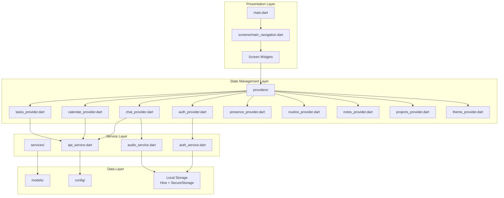
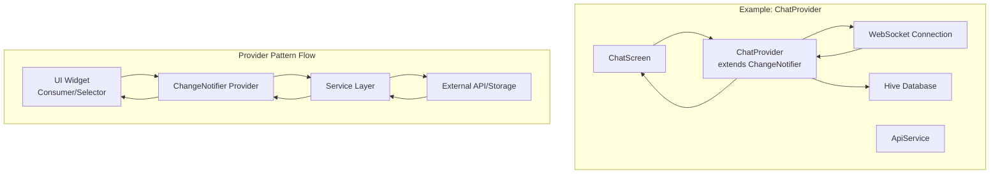
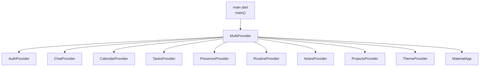
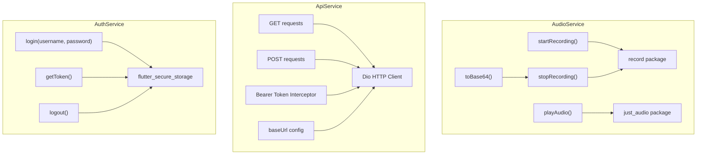
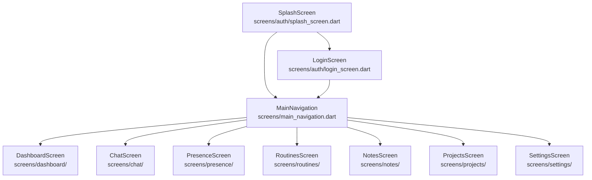
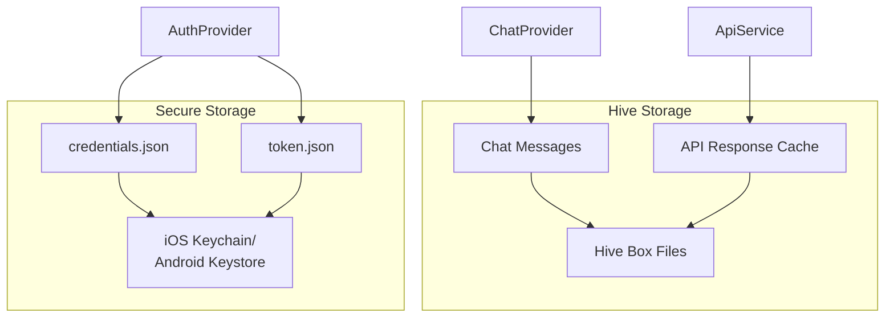

# Flutter Application

> **Relevant source files**
> * [.metadata](https://github.com/axchisan/AxIA/blob/1fe26c44/.metadata)
> * [ARCHITECTURE.md](https://github.com/axchisan/AxIA/blob/1fe26c44/ARCHITECTURE.md)
> * [README.md](https://github.com/axchisan/AxIA/blob/1fe26c44/README.md)

## Purpose and Scope

This document describes the Flutter frontend application structure, including the Provider-based state management architecture, service layer organization, screen hierarchy, and configuration system. The Flutter app serves as the mobile client interface for the AxIA personal AI assistant system.

For backend API details, see [FastAPI Backend](/axchisan/AxIA/3.2-fastapi-backend). For n8n workflow integration, see [n8n Workflow Engine](/axchisan/AxIA/3.3-n8n-workflow-engine). For authentication implementation details, see [Authentication & Security](/axchisan/AxIA/4-authentication-and-security).

## Project Structure Overview

The Flutter application follows a layered architecture with clear separation between presentation, business logic, and data access:



**Directory Structure**

Sources: [ARCHITECTURE.md L148-L197](https://github.com/axchisan/AxIA/blob/1fe26c44/ARCHITECTURE.md#L148-L197)

The application is organized into distinct directories by responsibility:

| Directory | Purpose | Key Files |
| --- | --- | --- |
| `lib/` | Root application directory | `main.dart` |
| `lib/config/` | Configuration and theming | `api_config.dart`, `theme/` |
| `lib/models/` | Data models | `chat_message.dart`, `presence_status.dart`, `routine.dart`, `note.dart`, `project.dart`, `client.dart` |
| `lib/providers/` | State management providers | 9 provider files for different features |
| `lib/services/` | Business logic and API integration | `auth_service.dart`, `api_service.dart`, `audio_service.dart` |
| `lib/screens/` | UI screens organized by feature | `auth/`, `dashboard/`, `chat/`, `presence/`, `routines/`, `notes/`, `projects/`, `settings/` |
| `lib/widgets/` | Reusable UI components | `common/` subdirectory |

## State Management Architecture

The application uses the Provider pattern for state management, creating a clear separation between UI and business logic. Each provider manages its own domain state and coordinates with services for data operations.



Sources: [ARCHITECTURE.md L162-L171](https://github.com/axchisan/AxIA/blob/1fe26c44/ARCHITECTURE.md#L162-L171)

 [README.md L69-L78](https://github.com/axchisan/AxIA/blob/1fe26c44/README.md#L69-L78)

### Provider Responsibilities

Each provider follows a consistent pattern of managing state, coordinating with services, and notifying listeners:

| Provider | File | Responsibilities |
| --- | --- | --- |
| `AuthProvider` | `providers/auth_provider.dart` | JWT token management, login/logout flow, authentication state |
| `ChatProvider` | `providers/chat_provider.dart` | WebSocket connection management, message history, real-time chat state |
| `CalendarProvider` | `providers/calendar_provider.dart` | Calendar event fetching and display |
| `TasksProvider` | `providers/tasks_provider.dart` | Task CRUD operations, task list state |
| `PresenceProvider` | `providers/presence_provider.dart` | User presence status (Available, Focus, Away, Busy) |
| `RoutineProvider` | `providers/routine_provider.dart` | Habit tracking for routines (Karate, Code, English, Meditation) |
| `NotesProvider` | `providers/notes_provider.dart` | Private notes management, tagging, search |
| `ProjectsProvider` | `providers/projects_provider.dart` | Project portfolio management for Axchisan.com |
| `ThemeProvider` | `providers/theme_provider.dart` | Dark/light theme switching |

Sources: [ARCHITECTURE.md L162-L171](https://github.com/axchisan/AxIA/blob/1fe26c44/ARCHITECTURE.md#L162-L171)

### Provider Initialization

Providers are initialized in the main application entry point using `MultiProvider`:



Sources: [README.md L115-L117](https://github.com/axchisan/AxIA/blob/1fe26c44/README.md#L115-L117)

## Service Layer

The service layer encapsulates business logic and external integrations, providing a clean API for providers to consume. Services are implemented as singletons to maintain state and connection pooling.

### Service Architecture



Sources: [ARCHITECTURE.md L172-L175](https://github.com/axchisan/AxIA/blob/1fe26c44/ARCHITECTURE.md#L172-L175)

### Service Responsibilities

| Service | File | Key Functionality |
| --- | --- | --- |
| `AuthService` | `services/auth_service.dart` | Authenticates with FastAPI `/token` endpoint, stores JWT in secure storage, manages token lifecycle |
| `ApiService` | `services/api_service.dart` | HTTP client wrapper using Dio, adds Bearer token to requests, handles `/calendar/events`, `/tasks`, `/messages/{session_id}` endpoints |
| `AudioService` | `services/audio_service.dart` | Records audio using AAC encoding, converts to Base64 for WebSocket transmission, plays audio responses with speed control |

Sources: [ARCHITECTURE.md L172-L175](https://github.com/axchisan/AxIA/blob/1fe26c44/ARCHITECTURE.md#L172-L175)

### API Configuration

The `ApiConfig` class centralizes API endpoint configuration:

**Endpoints**

```
POST /token              - Authentication, returns JWT
WebSocket /ws/{user}     - Real-time chat connection
POST /send-message       - HTTP message fallback
GET /calendar/events     - Calendar integration
GET /tasks              - Task retrieval
POST /tasks             - Task creation
GET /messages/{session_id} - Message history
GET /health             - Health check
```

Sources: [ARCHITECTURE.md L54-L89](https://github.com/axchisan/AxIA/blob/1fe26c44/ARCHITECTURE.md#L54-L89)

 [ARCHITECTURE.md L223-L225](https://github.com/axchisan/AxIA/blob/1fe26c44/ARCHITECTURE.md#L223-L225)

Configuration is stored in `config/api_config.dart`:

* Base URL: `https://apiaxia.axchisan.com`
* WebSocket URL: `wss://apiaxia.axchisan.com/ws`

Sources: [ARCHITECTURE.md L223-L225](https://github.com/axchisan/AxIA/blob/1fe26c44/ARCHITECTURE.md#L223-L225)

## Screen Organization

Screens are organized by feature area within the `screens/` directory. The main navigation structure uses a bottom navigation bar for primary features.

### Screen Hierarchy



Sources: [ARCHITECTURE.md L119-L129](https://github.com/axchisan/AxIA/blob/1fe26c44/ARCHITECTURE.md#L119-L129)

 [ARCHITECTURE.md L176-L187](https://github.com/axchisan/AxIA/blob/1fe26c44/ARCHITECTURE.md#L176-L187)

### Authentication Flow

The application implements a splash screen pattern for initial authentication checking:

1. **SplashScreen** displays on app launch
2. `AuthProvider.checkAuthentication()` verifies stored JWT token
3. Valid token → Navigate to `MainNavigation`
4. Invalid/missing token → Navigate to `LoginScreen`
5. User enters credentials → `POST /token` to FastAPI backend
6. Token stored in `flutter_secure_storage` (Keychain/Keystore)
7. Redirect to `MainNavigation` → `DashboardScreen`

Sources: [ARCHITECTURE.md L119-L129](https://github.com/axchisan/AxIA/blob/1fe26c44/ARCHITECTURE.md#L119-L129)

### Screen Features

| Screen | Directory | Key Features |
| --- | --- | --- |
| Dashboard | `screens/dashboard/` | Greeting card based on time of day, task/message overview, quick actions |
| Chat | `screens/chat/` | Real-time WebSocket chat, audio recording/playback, message actions (copy, delete), typing indicators |
| Presence | `screens/presence/` | 4 status modes (Available, Focus, Away, Busy), custom away messages, platform sync |
| Routines | `screens/routines/` | 4 tracked routines (Karate, Code, English, Meditation), streak tracking, daily progress |
| Notes | `screens/notes/` | Private encrypted notes, pinning, tagging, search functionality |
| Projects | `screens/projects/` | Axchisan.com project portfolio, client management, technology tracking |
| Settings | `screens/settings/` | Voice configuration for AxIA, AI personalization, sync settings |

Sources: [README.md L7-L50](https://github.com/axchisan/AxIA/blob/1fe26c44/README.md#L7-L50)

 [ARCHITECTURE.md L176-L187](https://github.com/axchisan/AxIA/blob/1fe26c44/ARCHITECTURE.md#L176-L187)

## UI Component System

The application uses a modular component system with reusable widgets implementing glassmorphism design patterns.

### Common Components

| Component | Usage | Description |
| --- | --- | --- |
| `GlassCard` | Background cards | Glassmorphism effect with blur and semi-transparent background |
| `GradientButton` | Primary actions | Buttons with violet gradient and elevation |
| `AnimatedStatusIndicator` | Presence display | Animated indicator for user status |
| `ProgressRing` | Routine tracking | Circular progress indicator for habits |
| `CustomSearchField` | Search functionality | Search input with icon and styling |
| `EmptyState` | List placeholders | Empty state with icon and message |
| `TagChip` | Note tags | Chip-style tags with colors |

Sources: [README.md L207-L214](https://github.com/axchisan/AxIA/blob/1fe26c44/README.md#L207-L214)

These components are located in `widgets/common/` and implement the application's design system with Space Grotesk typography and violet/purple color scheme.

Sources: [README.md L196-L206](https://github.com/axchisan/AxIA/blob/1fe26c44/README.md#L196-L206)

 [README.md L207-L214](https://github.com/axchisan/AxIA/blob/1fe26c44/README.md#L207-L214)

## Project Configuration

The Flutter project is configured with comprehensive metadata tracking and platform support.

### Flutter Project Metadata

The `.metadata` file tracks the Flutter SDK version and platform configurations:

* **Flutter Revision**: `b45fa18946ecc2d9b4009952c636ba7e2ffbb787`
* **Channel**: `stable`
* **Project Type**: `app`
* **Supported Platforms**: Android, iOS, Linux, macOS, Web, Windows

Sources: [.metadata L1-L46](https://github.com/axchisan/AxIA/blob/1fe26c44/.metadata#L1-L46)

Platform creation and base revisions are tracked for migration purposes. The file explicitly excludes `lib/main.dart` and `ios/Runner.xcodeproj/project.pbxproj` from automatic migration management.

Sources: [.metadata L37-L45](https://github.com/axchisan/AxIA/blob/1fe26c44/.metadata#L37-L45)

### Key Dependencies

The application relies on several critical Flutter packages:

| Package | Version | Purpose |
| --- | --- | --- |
| `provider` | ^6.2.1 | State management pattern implementation |
| `speech_to_text` | ^6.6.3 | Voice command recognition |
| `flutter_tts` | ^5.8.1 | Text-to-speech for AxIA responses |
| `google_fonts` | ^6.2.1 | Space Grotesk typography |
| `flutter_animate` | ^4.5.0 | Premium UI animations |
| `shimmer` | ^3.0.0 | Skeleton loading states |
| `dio` | ^5.4.2 | HTTP client for API calls |
| `hive` | ^2.2.3 | Local NoSQL database |
| `flutter_secure_storage` | Latest | Keychain/Keystore credential storage |
| `record` | Latest | Audio recording with AAC encoding |
| `just_audio` | Latest | Audio playback with speed control |

Sources: [README.md L68-L78](https://github.com/axchisan/AxIA/blob/1fe26c44/README.md#L68-L78)

 [ARCHITECTURE.md L232-L240](https://github.com/axchisan/AxIA/blob/1fe26c44/ARCHITECTURE.md#L232-L240)

### Theme Configuration

The application implements a dark-first theme with the following color palette:

* **Primary**: Violet `#7C3AED`
* **Secondary**: Dark Violet `#6D28D9`
* **Accent**: Neon Purple `#BB86FC`, Cyan `#00D9FF`
* **Background**: Near Black `#0F0F1E`
* **Typography**: Space Grotesk (Bold for headings, Regular for body)

Sources: [README.md L196-L206](https://github.com/axchisan/AxIA/blob/1fe26c44/README.md#L196-L206)

Theme configuration is managed by `ThemeProvider` with support for dark/light mode switching, though the application defaults to dark mode for a premium aesthetic.

Sources: [README.md L10-L11](https://github.com/axchisan/AxIA/blob/1fe26c44/README.md#L10-L11)

 [README.md L56-L61](https://github.com/axchisan/AxIA/blob/1fe26c44/README.md#L56-L61)

## Data Models

Models define the data structures used throughout the application:

| Model | File | Description |
| --- | --- | --- |
| `ChatMessage` | `models/chat_message.dart` | Represents a single chat message with text/audio content, timestamp, sender information |
| `PresenceStatus` | `models/presence_status.dart` | User availability status enum (Available, Focus, Away, Busy) |
| `Routine` | `models/routine.dart` | Habit tracking data with streak count and completion status |
| `Note` | `models/note.dart` | Private note with title, content, tags, pinned status |
| `Project` | `models/project.dart` | Project information with client, technologies, progress |
| `Client` | `models/client.dart` | Client data for project management |

Sources: [ARCHITECTURE.md L156-L161](https://github.com/axchisan/AxIA/blob/1fe26c44/ARCHITECTURE.md#L156-L161)

## Local Storage Strategy

The application uses two storage mechanisms:

1. **Hive Database**: Fast, lightweight NoSQL database for caching chat messages and application data
2. **Flutter Secure Storage**: Platform-specific secure storage (iOS Keychain, Android Keystore) for sensitive credentials



Sources: [ARCHITECTURE.md L228-L233](https://github.com/axchisan/AxIA/blob/1fe26c44/ARCHITECTURE.md#L228-L233)

 [ARCHITECTURE.md L236-L240](https://github.com/axchisan/AxIA/blob/1fe26c44/ARCHITECTURE.md#L236-L240)

This dual-storage approach ensures sensitive authentication data is protected while maintaining fast access to cached application data for offline support.

Sources: [ARCHITECTURE.md L236-L240](https://github.com/axchisan/AxIA/blob/1fe26c44/ARCHITECTURE.md#L236-L240)