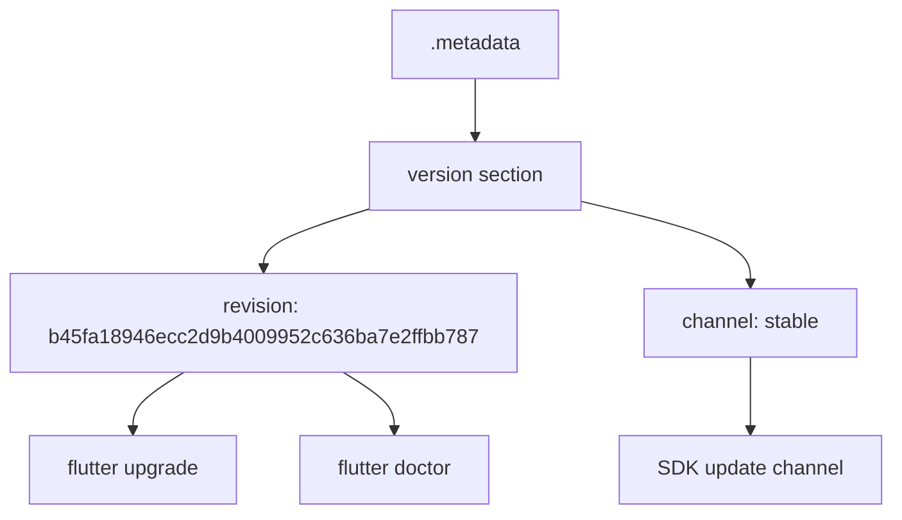
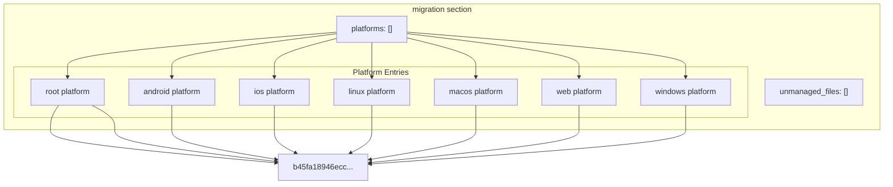
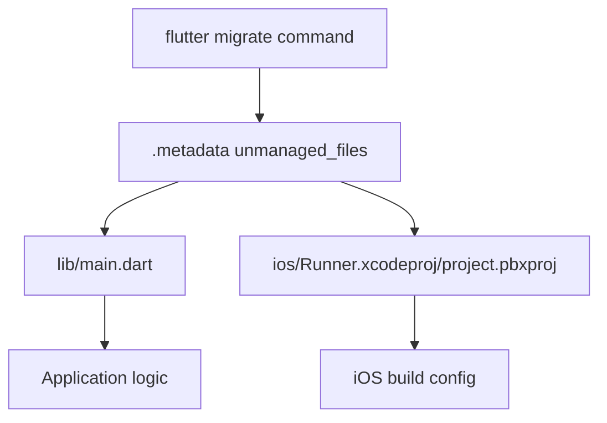
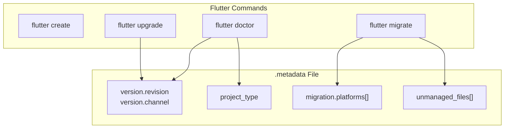

# Flutter Metadata

> **Relevant source files**
> * [.metadata](https://github.com/axchisan/AxIA/blob/1fe26c44/.metadata)

## Purpose and Scope

This document explains the `.metadata` file in the AxIA Flutter project. This file is automatically generated and maintained by the Flutter toolchain to track project properties, platform migrations, and version information. It enables the Flutter SDK to assess project capabilities, perform version upgrades, and manage platform-specific configurations.

For general project configuration and pubspec.yaml details, see [Project Configuration](/axchisan/AxIA/2.1-project-configuration). For code analysis settings, see [Code Analysis](/axchisan/AxIA/10.1-code-analysis).

---

## File Overview

The `.metadata` file is located at the project root and serves as the Flutter tool's central registry for tracking project state. This file **must be version controlled** and **should not be manually edited** as stated in [.metadata L1-L4](https://github.com/axchisan/AxIA/blob/1fe26c44/.metadata#L1-L4)

| Property | Purpose |
| --- | --- |
| **Location** | `.metadata` (project root) |
| **Ownership** | Flutter SDK tools |
| **Version Control** | Required |
| **Manual Editing** | Prohibited |
| **Format** | YAML |

**Sources:** [.metadata L1-L46](https://github.com/axchisan/AxIA/blob/1fe26c44/.metadata#L1-L46)

---

## Version Management

The `version` section tracks the exact Flutter SDK revision and release channel used to create and maintain the project.



### Version Fields

The version section contains two critical fields defined in [.metadata L6-L8](https://github.com/axchisan/AxIA/blob/1fe26c44/.metadata#L6-L8)

:

| Field | Value | Purpose |
| --- | --- | --- |
| `revision` | `b45fa18946ecc2d9b4009952c636ba7e2ffbb787` | Full Git commit SHA of the Flutter SDK used |
| `channel` | `stable` | Release channel (stable, beta, dev, or master) |

The `revision` field references a specific commit in the Flutter framework repository. This ensures reproducible builds and allows the Flutter tool to detect when SDK upgrades are available or necessary.

**Sources:** [.metadata L6-L8](https://github.com/axchisan/AxIA/blob/1fe26c44/.metadata#L6-L8)

---

## Project Type Declaration

The `project_type` field identifies the Flutter project category, which determines available commands and platform support.

```yaml
project_type: app
```

For AxIA, the project type is `app` as defined in [.metadata L10](https://github.com/axchisan/AxIA/blob/1fe26c44/.metadata#L10-L10)

 This distinguishes it from other Flutter project types:

| Project Type | Description |
| --- | --- |
| `app` | Complete Flutter application (AxIA's type) |
| `package` | Reusable Dart/Flutter package |
| `plugin` | Platform-specific plugin package |
| `module` | Flutter module for embedding in native apps |

The `app` type enables full platform support and indicates this is a standalone application rather than a library component.

**Sources:** [.metadata L10](https://github.com/axchisan/AxIA/blob/1fe26c44/.metadata#L10-L10)

---

## Migration Tracking System

The `migration` section maintains a detailed history of platform support additions and SDK revisions for migration purposes. This enables the `flutter migrate` command to safely upgrade platform-specific code.

### Migration Structure Diagram



### Platform Entry Structure

Each platform entry in [.metadata L14-L35](https://github.com/axchisan/AxIA/blob/1fe26c44/.metadata#L14-L35)

 contains three fields:

| Field | Description |
| --- | --- |
| `platform` | Platform identifier (root, android, ios, linux, macos, web, windows) |
| `create_revision` | Flutter SDK revision when platform was added to project |
| `base_revision` | Flutter SDK revision for baseline platform code |

**Sources:** [.metadata L12-L35](https://github.com/axchisan/AxIA/blob/1fe26c44/.metadata#L12-L35)

---

## Platform Metadata

AxIA tracks metadata for seven platforms, all initialized with the same Flutter SDK revision `b45fa18946ecc2d9b4009952c636ba7e2ffbb787`.

### Platform Tracking Table

| Platform | Create Revision | Base Revision | Lines |
| --- | --- | --- | --- |
| `root` | b45fa18946... | b45fa18946... | [15-17](https://github.com/axchisan/AxIA/blob/1fe26c44/15-17) |
| `android` | b45fa18946... | b45fa18946... | [18-20](https://github.com/axchisan/AxIA/blob/1fe26c44/18-20) |
| `ios` | b45fa18946... | b45fa18946... | [21-23](https://github.com/axchisan/AxIA/blob/1fe26c44/21-23) |
| `linux` | b45fa18946... | b45fa18946... | [24-26](https://github.com/axchisan/AxIA/blob/1fe26c44/24-26) |
| `macos` | b45fa18946... | b45fa18946... | [27-29](https://github.com/axchisan/AxIA/blob/1fe26c44/27-29) |
| `web` | b45fa18946... | b45fa18946... | [30-32](https://github.com/axchisan/AxIA/blob/1fe26c44/30-32) |
| `windows` | b45fa18946... | b45fa18946... | [33-35](https://github.com/axchisan/AxIA/blob/1fe26c44/33-35) |

### Platform Usage in AxIA

Based on the project structure, AxIA actively uses:

* **android** - Primary mobile platform (see [Android Setup](/axchisan/AxIA/9.1-android-setup))
* **ios** - Secondary mobile platform
* **root** - Core Dart/Flutter code

The other platforms (linux, macos, web, windows) have tracked metadata but are not actively configured for deployment in the current version.

**Sources:** [.metadata L14-L35](https://github.com/axchisan/AxIA/blob/1fe26c44/.metadata#L14-L35)

---

## Unmanaged Files Configuration

The `unmanaged_files` section allows developers to exclude specific files from Flutter's migration tool processing. This prevents the `flutter migrate` command from overwriting customized files.



### Excluded Files

AxIA defines two unmanaged files in [.metadata L43-L45](https://github.com/axchisan/AxIA/blob/1fe26c44/.metadata#L43-L45)

:

| File | Reason for Exclusion |
| --- | --- |
| `lib/main.dart` | Contains custom application entry point and initialization logic |
| `ios/Runner.xcodeproj/project.pbxproj` | Contains custom iOS project configuration and build settings |

These files contain project-specific customizations that should not be overwritten during Flutter SDK migrations.

**Sources:** [.metadata L37-L45](https://github.com/axchisan/AxIA/blob/1fe26c44/.metadata#L37-L45)

---

## Flutter Tool Integration

The `.metadata` file integrates with several Flutter CLI commands to maintain project consistency and enable safe upgrades.

### Tool Usage Diagram



### Command Behaviors

| Command | `.metadata` Usage |
| --- | --- |
| `flutter create` | Generates initial `.metadata` with current SDK revision and enabled platforms |
| `flutter upgrade` | Updates `version.revision` and `version.channel` fields after SDK upgrade |
| `flutter migrate` | Reads `migration.platforms[]` to determine which platform code to update; skips files in `unmanaged_files[]` |
| `flutter doctor` | Verifies project compatibility with installed Flutter SDK by comparing revisions |
| `flutter pub get` | Reads `project_type` to determine dependency resolution behavior |

### Version Control Requirements

The `.metadata` file **must be committed to version control** for several reasons:

1. **Team Synchronization** - Ensures all developers use compatible Flutter SDK versions
2. **CI/CD Reproducibility** - Build servers can verify correct Flutter version
3. **Migration Safety** - Tracks platform addition history for safe upgrades
4. **SDK Compatibility** - Documents minimum Flutter version requirements

**Sources:** [.metadata L1-L46](https://github.com/axchisan/AxIA/blob/1fe26c44/.metadata#L1-L46)

---

## Best Practices

### Do Not Manually Edit

The Flutter tools automatically maintain the `.metadata` file. Manual editing can cause:

* Migration tool failures
* Incorrect platform capability detection
* SDK version conflicts
* Loss of platform tracking history

**Exception:** The `unmanaged_files` section is the only user-editable portion, as noted in [.metadata L37-L38](https://github.com/axchisan/AxIA/blob/1fe26c44/.metadata#L37-L38)

### Adding Platforms

When adding a new platform (e.g., adding iOS support to an Android-only project):

```sql
flutter create --platforms=ios .
```

This command automatically updates `.metadata` with the new platform entry, including appropriate `create_revision` and `base_revision` values.

### SDK Upgrades

After upgrading Flutter SDK:

```
flutter upgrade
```

The tool automatically updates [.metadata L7-L8](https://github.com/axchisan/AxIA/blob/1fe26c44/.metadata#L7-L8)

 to reflect the new Flutter version, maintaining consistency across the project.

### Excluding Custom Files

To exclude additional files from migration:

1. Edit [.metadata L43-L45](https://github.com/axchisan/AxIA/blob/1fe26c44/.metadata#L43-L45)
2. Add file paths relative to project root
3. Commit the updated `.metadata`

This is the **only recommended manual edit** to the `.metadata` file.

**Sources:** [.metadata L1-L46](https://github.com/axchisan/AxIA/blob/1fe26c44/.metadata#L1-L46)

---

## Summary

The `.metadata` file serves as Flutter's project state registry, tracking:

* **Flutter SDK version** via `revision` and `channel` fields
* **Project classification** via `project_type: app`
* **Platform support history** via `migration.platforms[]` entries
* **Custom file exclusions** via `unmanaged_files[]`

This metadata enables Flutter tools to perform safe upgrades, maintain platform compatibility, and preserve custom configurations across SDK migrations. The file requires version control but prohibits manual editing except for the `unmanaged_files` section.

**Sources:** [.metadata L1-L46](https://github.com/axchisan/AxIA/blob/1fe26c44/.metadata#L1-L46)