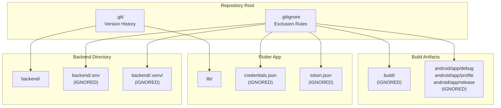
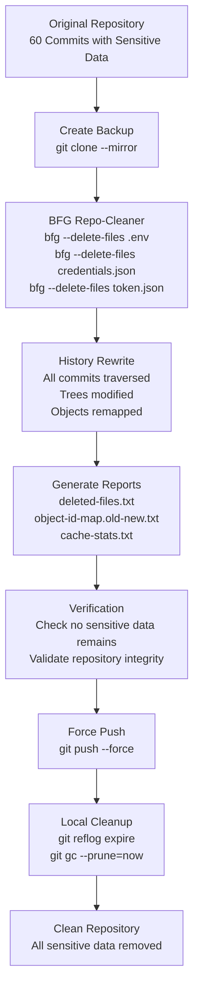
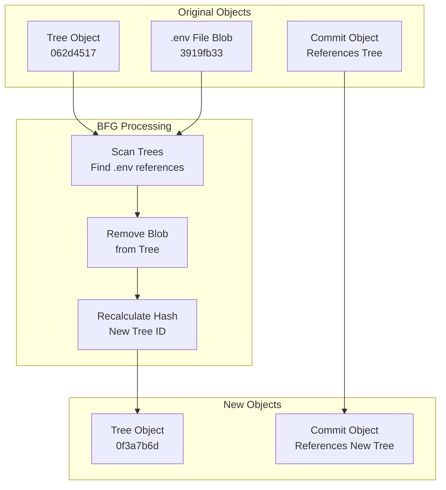
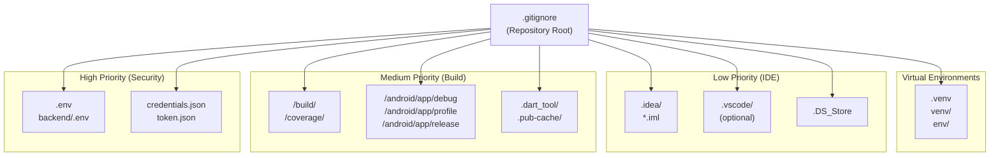

# Gestión de repositorios

> **Archivos fuente relevantes**
> * [..bfg-report/2025-11-27/02-50-28/archivos-eliminados.txt](https://github.com/axchisan/AxIA/blob/1fe26c44/..bfg-report/2025-11-27/02-50-28/deleted-files.txt)
> * [..bfg-report/2025-11-27/02-50-28/object-id-map.old-new.txt](https://github.com/axchisan/AxIA/blob/1fe26c44/..bfg-report/2025-11-27/02-50-28/object-id-map.old-new.txt)
> * [.gitignore](https://github.com/axchisan/AxIA/blob/1fe26c44/.gitignore)

## Propósito y alcance

Este documento describe las prácticas de gestión de repositorios Git para el proyecto AxIA, incluyendo el flujo de trabajo de control de versiones, la corrección de seguridad y la configuración de archivos ignorados. Detalla la limpieza de seguridad histórica realizada con BFG Repo-Cleaner y la `.gitignore`configuración actual que impide la confirmación de datos confidenciales.

Para la gestión de la configuración específica del entorno, consulte [Configuración del entorno](/axchisan/AxIA/2.2-environment-setup) . Para el almacenamiento seguro de credenciales en la aplicación, consulte [Almacenamiento seguro de credenciales](/axchisan/AxIA/4.2-secure-credential-storage) . Para un análisis detallado de cada subsistema:

* [Configuración de Gitignore](/axchisan/AxIA/11.1-gitignore-configuration) : patrones completos para Flutter, Android, Python y archivos confidenciales
* [Limpieza del repositorio BFG](/axchisan/AxIA/11.2-bfg-repository-cleanup) : detalles del proceso de remediación de seguridad
* [Estadísticas de caché](/axchisan/AxIA/11.3-cache-statistics) : análisis del rendimiento de la operación de limpieza de BFG

---

## Estructura del repositorio y archivos confidenciales

El repositorio AxIA contiene múltiples componentes en diferentes pilas de tecnología, lo que requiere una gestión cuidadosa de los archivos de configuración confidenciales.

### Categorías de archivos sensibles

| Patrón de archivo | Objetivo | Ubicación de almacenamiento | Riesgo de seguridad |
| --- | --- | --- | --- |
| `.env` | Variables de entorno de backend | `backend/.env` | Alto: contiene claves API y credenciales de base de datos |
| `credentials.json` | Configuración de autenticación estática para la aplicación | Almacenamiento seguro de aplicaciones | Alto - contiene nombre de usuario/contraseña |
| `token.json` | Tokens JWT dinámicos | Almacenamiento seguro de aplicaciones | Medio: contiene tokens de sesión (vencimiento de 24 horas) |
| `.venv/`, `venv/`,`env/` | Entornos virtuales de Python | Desarrollo local | Artefactos de baja construcción |

**Diagrama de distribución de archivos confidenciales**



Fuentes:[.gitignore L1-L53](https://github.com/axchisan/AxIA/blob/1fe26c44/.gitignore#L1-L53)

---

## Incidente de seguridad histórico

### Estado del repositorio previo a la limpieza

Antes del 27 de noviembre de 2025, el repositorio contenía archivos confidenciales registrados en el historial de versiones. Esta sección documenta la corrección de seguridad realizada.

**Archivos comprometidos identificados**

| Archivo | Tamaño (bytes) | ID de objeto de Git | Commits afectados |
| --- | --- | --- | --- |
| `.env`(versión 1) | 395 | `3919fb335ae9298202899d864cb16f0e48354742` | Múltiple |
| `.env`(versión 2) | 287 | `77c7def985bc3631b00eac4303b505b731edf104` | Múltiple |
| `.env`(versión 3) | 667 | `7e067d72c19b3672c428e80cf8ffa00b629ed549` | Múltiple |

The presence of three different `.env` file versions indicates that environment variables were modified and recommitted multiple times, expanding the exposure window.

**BFG Cleanup Timeline**

```sql
#mermaid-51v60qq3g6g{font-family:ui-sans-serif,-apple-system,system-ui,Segoe UI,Helvetica;font-size:16px;fill:#333;}@keyframes edge-animation-frame{from{stroke-dashoffset:0;}}@keyframes dash{to{stroke-dashoffset:0;}}#mermaid-51v60qq3g6g .edge-animation-slow{stroke-dasharray:9,5!important;stroke-dashoffset:900;animation:dash 50s linear infinite;stroke-linecap:round;}#mermaid-51v60qq3g6g .edge-animation-fast{stroke-dasharray:9,5!important;stroke-dashoffset:900;animation:dash 20s linear infinite;stroke-linecap:round;}#mermaid-51v60qq3g6g .error-icon{fill:#dddddd;}#mermaid-51v60qq3g6g .error-text{fill:#222222;stroke:#222222;}#mermaid-51v60qq3g6g .edge-thickness-normal{stroke-width:1px;}#mermaid-51v60qq3g6g .edge-thickness-thick{stroke-width:3.5px;}#mermaid-51v60qq3g6g .edge-pattern-solid{stroke-dasharray:0;}#mermaid-51v60qq3g6g .edge-thickness-invisible{stroke-width:0;fill:none;}#mermaid-51v60qq3g6g .edge-pattern-dashed{stroke-dasharray:3;}#mermaid-51v60qq3g6g .edge-pattern-dotted{stroke-dasharray:2;}#mermaid-51v60qq3g6g .marker{fill:#999;stroke:#999;}#mermaid-51v60qq3g6g .marker.cross{stroke:#999;}#mermaid-51v60qq3g6g svg{font-family:ui-sans-serif,-apple-system,system-ui,Segoe UI,Helvetica;font-size:16px;}#mermaid-51v60qq3g6g p{margin:0;}#mermaid-51v60qq3g6g .mermaid-main-font{font-family:ui-sans-serif,-apple-system,system-ui,Segoe UI,Helvetica;}#mermaid-51v60qq3g6g .exclude-range{fill:#eeeeee;}#mermaid-51v60qq3g6g .section{stroke:none;opacity:0.2;}#mermaid-51v60qq3g6g .section0{fill:#dddddd;}#mermaid-51v60qq3g6g .section2{fill:#eaeaea;}#mermaid-51v60qq3g6g .section1,#mermaid-51v60qq3g6g .section3{fill:white;opacity:0.2;}#mermaid-51v60qq3g6g .sectionTitle0{fill:#444;}#mermaid-51v60qq3g6g .sectionTitle1{fill:#444;}#mermaid-51v60qq3g6g .sectionTitle2{fill:#444;}#mermaid-51v60qq3g6g .sectionTitle3{fill:#444;}#mermaid-51v60qq3g6g .sectionTitle{text-anchor:start;font-family:ui-sans-serif,-apple-system,system-ui,Segoe UI,Helvetica;}#mermaid-51v60qq3g6g .grid .tick{stroke:lightgrey;opacity:0.8;shape-rendering:crispEdges;}#mermaid-51v60qq3g6g .grid .tick text{font-family:ui-sans-serif,-apple-system,system-ui,Segoe UI,Helvetica;fill:#333;}#mermaid-51v60qq3g6g .grid path{stroke-width:0;}#mermaid-51v60qq3g6g .today{fill:none;stroke:red;stroke-width:2px;}#mermaid-51v60qq3g6g .task{stroke-width:2;}#mermaid-51v60qq3g6g .taskText{text-anchor:middle;font-family:ui-sans-serif,-apple-system,system-ui,Segoe UI,Helvetica;}#mermaid-51v60qq3g6g .taskTextOutsideRight{fill:#333;text-anchor:start;font-family:ui-sans-serif,-apple-system,system-ui,Segoe UI,Helvetica;}#mermaid-51v60qq3g6g .taskTextOutsideLeft{fill:#333;text-anchor:end;}#mermaid-51v60qq3g6g .task.clickable{cursor:pointer;}#mermaid-51v60qq3g6g .taskText.clickable{cursor:pointer;fill:#003163!important;font-weight:bold;}#mermaid-51v60qq3g6g .taskTextOutsideLeft.clickable{cursor:pointer;fill:#003163!important;font-weight:bold;}#mermaid-51v60qq3g6g .taskTextOutsideRight.clickable{cursor:pointer;fill:#003163!important;font-weight:bold;}#mermaid-51v60qq3g6g .taskText0,#mermaid-51v60qq3g6g .taskText1,#mermaid-51v60qq3g6g .taskText2,#mermaid-51v60qq3g6g .taskText3{fill:#333;}#mermaid-51v60qq3g6g .task0,#mermaid-51v60qq3g6g .task1,#mermaid-51v60qq3g6g .task2,#mermaid-51v60qq3g6g .task3{fill:#eaeaea;stroke:#ccc;}#mermaid-51v60qq3g6g .taskTextOutside0,#mermaid-51v60qq3g6g .taskTextOutside2{fill:#333;}#mermaid-51v60qq3g6g .taskTextOutside1,#mermaid-51v60qq3g6g .taskTextOutside3{fill:#333;}#mermaid-51v60qq3g6g .active0,#mermaid-51v60qq3g6g .active1,#mermaid-51v60qq3g6g .active2,#mermaid-51v60qq3g6g .active3{fill:hsl(0, 0%, 100%);stroke:#eaeaea;}#mermaid-51v60qq3g6g .activeText0,#mermaid-51v60qq3g6g .activeText1,#mermaid-51v60qq3g6g .activeText2,#mermaid-51v60qq3g6g .activeText3{fill:#333!important;}#mermaid-51v60qq3g6g .done0,#mermaid-51v60qq3g6g .done1,#mermaid-51v60qq3g6g .done2,#mermaid-51v60qq3g6g .done3{stroke:grey;fill:lightgrey;stroke-width:2;}#mermaid-51v60qq3g6g .doneText0,#mermaid-51v60qq3g6g .doneText1,#mermaid-51v60qq3g6g .doneText2,#mermaid-51v60qq3g6g .doneText3{fill:#333!important;}#mermaid-51v60qq3g6g .crit0,#mermaid-51v60qq3g6g .crit1,#mermaid-51v60qq3g6g .crit2,#mermaid-51v60qq3g6g .crit3{stroke:#ff8888;fill:red;stroke-width:2;}#mermaid-51v60qq3g6g .activeCrit0,#mermaid-51v60qq3g6g .activeCrit1,#mermaid-51v60qq3g6g .activeCrit2,#mermaid-51v60qq3g6g .activeCrit3{stroke:#ff8888;fill:hsl(0, 0%, 100%);stroke-width:2;}#mermaid-51v60qq3g6g .doneCrit0,#mermaid-51v60qq3g6g .doneCrit1,#mermaid-51v60qq3g6g .doneCrit2,#mermaid-51v60qq3g6g .doneCrit3{stroke:#ff8888;fill:lightgrey;stroke-width:2;cursor:pointer;shape-rendering:crispEdges;}#mermaid-51v60qq3g6g .milestone{transform:rotate(45deg) scale(0.8,0.8);}#mermaid-51v60qq3g6g .milestoneText{font-style:italic;}#mermaid-51v60qq3g6g .doneCritText0,#mermaid-51v60qq3g6g .doneCritText1,#mermaid-51v60qq3g6g .doneCritText2,#mermaid-51v60qq3g6g .doneCritText3{fill:#333!important;}#mermaid-51v60qq3g6g .activeCritText0,#mermaid-51v60qq3g6g .activeCritText1,#mermaid-51v60qq3g6g .activeCritText2,#mermaid-51v60qq3g6g .activeCritText3{fill:#333!important;}#mermaid-51v60qq3g6g .titleText{text-anchor:middle;font-size:18px;fill:#444;font-family:ui-sans-serif,-apple-system,system-ui,Segoe UI,Helvetica;}#mermaid-51v60qq3g6g :root{--mermaid-font-family:"trebuchet ms",verdana,arial,sans-serif;}2025-11-272025-11-272025-11-282025-11-282025-11-292025-11-292025-11-302025-11-302025-12-01Security audit identifies leaked files BFG Repo-Cleaner execution Object ID remapping Update .gitignore rules Migrate to env variables DetectionRemediationPreventionSecurity Remediation Timeline
```

Sources: [..bfg-report/2025-11-27/02-50-28/deleted-files.txt L1-L4](https://github.com/axchisan/AxIA/blob/1fe26c44/..bfg-report/2025-11-27/02-50-28/deleted-files.txt#L1-L4)

---

## BFG Repository Cleanup Process

### Cleanup Execution

The BFG Repo-Cleaner was executed on 2025-11-27 at 02:50:28 to remove sensitive files from the entire Git history. This tool rewrites Git history to permanently delete specified files while maintaining commit structure.

**BFG Cleanup Workflow**



### Object ID Remapping

The cleanup process remapped 57 Git object IDs, maintaining referential integrity across the repository history. Each old object ID was replaced with a new one after removing sensitive file references.

**Sample Object ID Mappings**

| Old Object ID (first 8 chars) | New Object ID (first 8 chars) | Operation |
| --- | --- | --- |
| `062d4517` | `0f3a7b6d` | Tree rewrite |
| `0f1dbf97` | `ae41c77d` | Tree rewrite |
| `10daf346` | `8967f68a` | Tree rewrite |
| `113f17bc` | `a056cb02` | Tree rewrite |
| `114e23d7` | `8eeb313f` | Tree rewrite |

The complete mapping contains 57 entries, documenting every modified Git object. This mapping is preserved in `..bfg-report/2025-11-27/02-50-28/object-id-map.old-new.txt` for reference.

**Object Remapping Process Diagram**



Sources: [..bfg-report/2025-11-27/02-50-28/object-id-map.old-new.txt L1-L58](https://github.com/axchisan/AxIA/blob/1fe26c44/..bfg-report/2025-11-27/02-50-28/object-id-map.old-new.txt#L1-L58)

---

## Gitignore Configuration

The `.gitignore` file is configured to prevent future commits of sensitive data across all technology stacks in the project.

### Ignore Pattern Categories

**1. Flutter/Dart Build Artifacts**

```
.dart_tool/
.flutter-plugins-dependencies
.pub-cache/
.pub/
/build/
/coverage/
**/ios/Flutter/.last_build_id
```

These patterns prevent Flutter and Dart tooling artifacts from being committed. The `/build/` directory contains compiled app binaries, while `.dart_tool/` contains analyzer and build system caches.

**2. Android Build Outputs**

```
/android/app/debug
/android/app/profile
/android/app/release
```

These directories contain Android APK files and build intermediates for different build configurations. See [Android Setup](/axchisan/AxIA/9.1-android-setup) for platform-specific configuration.

**3. Python Virtual Environments**

```
.venv
venv/
env/
```

Python virtual environments contain installed packages and should not be versioned. Each developer creates their own environment using `pip install -r requirements.txt`.

**4. Environment Variables and Credentials**

```
.env
backend/.env
credentials.json
token.json
```

These are the critical security patterns added after the BFG cleanup. The `.env` pattern catches any environment file, while `backend/.env` provides an additional specific rule for the FastAPI backend configuration.

**5. IDE and System Files**

```
.DS_Store
.idea/
*.iml
*.ipr
*.iws
.vscode/
```

Editor and OS-specific files that vary by developer environment.

### Gitignore Pattern Hierarchy



Sources: [.gitignore L1-L53](https://github.com/axchisan/AxIA/blob/1fe26c44/.gitignore#L1-L53)

---

## Repository Workflow Best Practices

### Pre-Commit Checklist

Before committing code, developers should verify:

1. **No sensitive data**: Run `git status` to check for `credentials.json`, `token.json`, or `.env` files
2. **Gitignore working**: Ensure `.gitignore` patterns are applied with `git check-ignore -v <file>`
3. **No secrets in code**: Search for hardcoded passwords, API keys, or tokens
4. **Environment variables**: Use `os.getenv()` in Python or environment variable injection for configuration

### Configuration File Management

**Development Environment**

| File | Location | Source Control | Purpose |
| --- | --- | --- | --- |
| `.env.example` | `backend/.env.example` | ✅ Committed | Template with placeholder values |
| `.env` | `backend/.env` | ❌ Ignored | Secretos reales (locales) |
| `credentials.json.example` | `credentials.json.example` | ✅ Comprometidos | Estructura de la plantilla |
| `credentials.json` | Almacenamiento raíz o seguro | ❌ Ignorado | Credenciales reales |

**Entorno de producción**

Las implementaciones de producción utilizan variables de entorno inyectadas por la plataforma de implementación (Docker, Kubernetes, etc.) en lugar de `.env`archivos. Consulte [Variables de entorno](/axchisan/AxIA/12.2-environment-variables) para la configuración de producción.

### Comandos de higiene de Git

**Comprueba si hay archivos confidenciales guardados accidentalmente:**

```
git diff --cached --name-only | grep -E '\.env|credentials\.json|token\.json'
```

**Eliminar archivo confirmado accidentalmente (antes de enviarlo):**

```
git reset HEAD <file>
git checkout -- <file>
```

**Comprobar si el archivo se ignora:**

```
git check-ignore -v credentials.json
```

**Verificar que no haya datos confidenciales en el historial:**

```
git log --all --full-history -- credentials.json
```

Fuentes:[.gitignore L1-L53](https://github.com/axchisan/AxIA/blob/1fe26c44/.gitignore#L1-L53)

---

## Medidas de seguridad posteriores a la limpieza

### Rotación de credenciales

Después de la limpieza de BFG, se rotaron todas las credenciales potencialmente expuestas:

1. **Credenciales de la base de datos** : Contraseñas de PostgreSQL cambiadas
2. **Claves API** : claves de OpenAI, Anthropic y ElevenLabs regeneradas
3. **Secreto JWT** : Nuevo secreto generado para la firma de tokens
4. **URL de webhook n8n** : regeneradas para evitar acceso no autorizado

### Monitoreo y prevención

**Funciones de seguridad de GitHub habilitadas**

* **Escaneo de secretos** : detecta automáticamente patrones secretos comunes en las confirmaciones
* **Protección de push** : bloquea los push que contienen secretos detectados
* **Alertas de Dependabot** : supervisa las dependencias vulnerables

**Ganchos Git locales**

Considere implementar un gancho previo a la confirmación para escanear en busca de secretos:

```php
#!/bin/sh
# .git/hooks/pre-commit

# Check for sensitive files
if git diff --cached --name-only | grep -qE '\.env$|credentials\.json|token\.json'; then
    echo "Error: Attempting to commit sensitive files"
    exit 1
fi

# Check for common secret patterns
if git diff --cached | grep -qE 'password\s*=\s*["\047]|api[_-]?key\s*[=:]\s*["\047]'; then
    echo "Warning: Potential hardcoded secrets detected"
    exit 1
fi
```

Fuentes:[.gitignore L1-L53](https://github.com/axchisan/AxIA/blob/1fe26c44/.gitignore#L1-L53)

 [deleted-files.txt L1-L4](https://github.com/axchisan/AxIA/blob/1fe26c44/..bfg-report/2025-11-27/02-50-28/deleted-files.txt#L1-L4)

---

## Documentación relacionada

* [Configuración de Gitignore](/axchisan/AxIA/11.1-gitignore-configuration) : referencia completa de patrones
* [Limpieza del repositorio BFG](/axchisan/AxIA/11.2-bfg-repository-cleanup) : proceso de limpieza detallado y archivos eliminados
* [Estadísticas de caché](/axchisan/AxIA/11.3-cache-statistics) : métricas de rendimiento de la operación BFG
* [Configuración del entorno](/axchisan/AxIA/2.2-environment-setup) : cómo configurar el entorno de desarrollo
* [Almacenamiento seguro de credenciales](/axchisan/AxIA/4.2-secure-credential-storage) : gestión de credenciales a nivel de aplicación
* [Implementación de backend](/axchisan/AxIA/12.1-backend-deployment) : configuración del entorno de producción