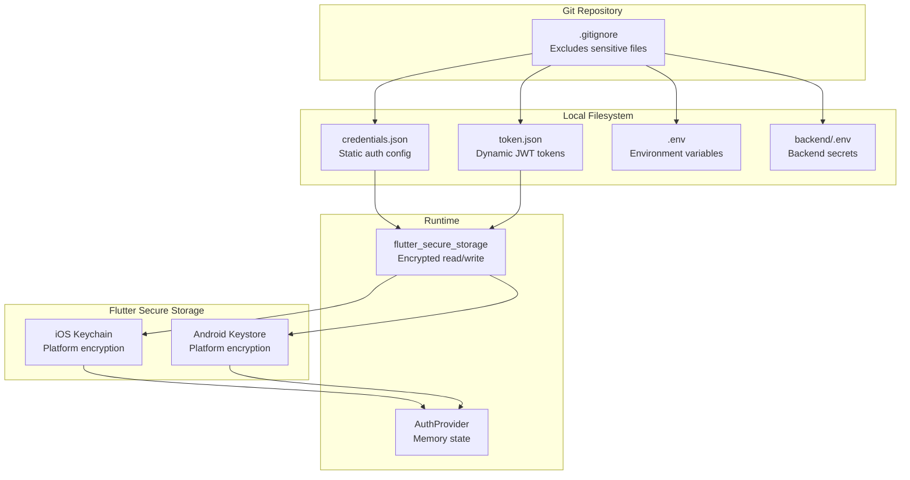

# Getting Started

> **Relevant source files**
> * [.gitignore](https://github.com/axchisan/AxIA/blob/1fe26c44/.gitignore)
> * [.metadata](https://github.com/axchisan/AxIA/blob/1fe26c44/.metadata)
> * [README.md](https://github.com/axchisan/AxIA/blob/1fe26c44/README.md)

This page provides a comprehensive guide for developers to set up the AxIA development environment, understand the project structure, and begin contributing to the codebase. It covers prerequisites, installation steps, project organization, and initial development workflow.

For detailed configuration of Flutter project settings and metadata, see [Project Configuration](/axchisan/AxIA/2.1-project-configuration). For environment variables and credentials management, see [Environment Setup](/axchisan/AxIA/2.2-environment-setup). For the complete system architecture, see [System Architecture](/axchisan/AxIA/3-system-architecture).

---

## Prerequisites

Before setting up the AxIA development environment, ensure your system meets the following requirements:

| Requirement | Version | Purpose |
| --- | --- | --- |
| **Flutter SDK** | 3.4.0+ | Cross-platform mobile framework |
| **Dart SDK** | 3.2.0+ | Programming language (bundled with Flutter) |
| **Android SDK** | API Level 21+ | Android development and emulation |
| **iOS SDK** | 12.0+ | iOS development (macOS only) |
| **Git** | Latest | Version control |
| **IDE** | VS Code or Android Studio | Development environment |

The project is built on Flutter stable channel with revision `b45fa18946ecc2d9b4009952c636ba7e2ffbb787`, as specified in [.metadata L7-L8](https://github.com/axchisan/AxIA/blob/1fe26c44/.metadata#L7-L8)

**Sources:** [.metadata L1-L46](https://github.com/axchisan/AxIA/blob/1fe26c44/.metadata#L1-L46)

 [README.md L83-L85](https://github.com/axchisan/AxIA/blob/1fe26c44/README.md#L83-L85)

---

## Quick Setup

### 1. Clone Repository

```

```

### 2. Install Dependencies

```

```

This command downloads all packages specified in `pubspec.yaml`, including:

* `provider` for state management
* `speech_to_text` for voice recognition
* `flutter_tts` for text-to-speech
* `google_fonts` for typography
* `flutter_animate` for animations
* `shimmer` for loading states
* `dio` for HTTP client
* `hive` for local storage

### 3. Verify Installation

```

```

Ensure all required components show checkmarks, particularly Flutter, Android toolchain, and connected devices.

### 4. Run Application

```

```

For verbose output during development:

```

```

**Sources:** [README.md L89-L103](https://github.com/axchisan/AxIA/blob/1fe26c44/README.md#L89-L103)

---

## Initial Setup Flow

```

```

**Sources:** [README.md L89-L103](https://github.com/axchisan/AxIA/blob/1fe26c44/README.md#L89-L103)

 [.gitignore L30-L38](https://github.com/axchisan/AxIA/blob/1fe26c44/.gitignore#L30-L38)

 [.metadata L1-L46](https://github.com/axchisan/AxIA/blob/1fe26c44/.metadata#L1-L46)

---

## Project Structure

The AxIA codebase follows a modular Flutter architecture organized by feature and responsibility:

```mermaid
flowchart TD

ROOT["AxIA Repository Root"]
LIB["lib/<br>Application source code"]
MAIN["lib/main.dart<br>Entry point"]
CONFIG["lib/config/<br>Theme & configuration"]
MODELS["lib/models/<br>Data models"]
PROVIDERS["lib/providers/<br>State management"]
SCREENS["lib/screens/<br>UI screens"]
WIDGETS["lib/widgets/<br>Reusable components"]
SERVICES["lib/services/<br>Business logic"]
UTILS["lib/utils/<br>Helpers & utilities"]
BACKEND["backend/<br>FastAPI application"]
N8N["n8n/<br>Workflow configurations"]
ANDROID["android/<br>Android configuration"]
IOS["ios/<br>iOS configuration"]
METADATA_NODE[".metadata<br>Flutter tracking"]
GITIGNORE_NODE[".gitignore<br>Git exclusions"]
README_NODE["README.md<br>Documentation"]

ROOT --> LIB
ROOT --> BACKEND
ROOT --> N8N
ROOT --> ANDROID
ROOT --> IOS
ROOT --> METADATA_NODE
ROOT --> GITIGNORE_NODE
ROOT --> README_NODE

subgraph Configuration ["Configuration"]
    METADATA_NODE
    GITIGNORE_NODE
    README_NODE
end

subgraph subGraph2 ["Platform Specific"]
    ANDROID
    IOS
end

subgraph subGraph1 ["Backend Services"]
    BACKEND
    N8N
end

subgraph subGraph0 ["Flutter Application"]
    LIB
    MAIN
    CONFIG
    MODELS
    PROVIDERS
    SCREENS
    WIDGETS
    SERVICES
    UTILS
    LIB --> MAIN
    LIB --> CONFIG
    LIB --> MODELS
    LIB --> PROVIDERS
    LIB --> SCREENS
    LIB --> WIDGETS
    LIB --> SERVICES
    LIB --> UTILS
end
```



**Sources:** [README.md L114-L136](https://github.com/axchisan/AxIA/blob/1fe26c44/README.md#L114-L136)

---

## Key Directory Descriptions

| Directory | Purpose | Key Files/Subdirectories |
| --- | --- | --- |
| `lib/` | Flutter application source code | All Dart code |
| `lib/main.dart` | Application entry point | Main widget and app initialization |
| `lib/config/theme/` | Color schemes and typography | `Space Grotesk` font configuration |
| `lib/models/` | Data structures | Message, Task, User models |
| `lib/providers/` | State management | `AuthProvider`, `ChatProvider`, `ThemeProvider` |
| `lib/screens/` | UI screens | Dashboard, Chat, Settings, etc. |
| `lib/screens/main_navigation.dart` | Bottom navigation | Main tab navigation |
| `lib/widgets/common/` | Reusable UI components | Buttons, cards, inputs |
| `lib/widgets/glass_morphism/` | Glassmorphism effects | `GlassCard`, transparency effects |
| `lib/widgets/animations/` | Custom animations | Fade, slide, scale animations |
| `lib/services/` | Business logic services | Audio, notifications, API clients |
| `lib/utils/` | Utility functions | Formatters, validators, constants |
| `backend/` | FastAPI REST/WebSocket server | Authentication, message routing |
| `n8n/` | AI workflow configurations | Webhook handlers, channel routing |
| `android/` | Android platform code | Manifest, permissions, build config |
| `ios/` | iOS platform code | Info.plist, entitlements |

**Sources:** [README.md L114-L136](https://github.com/axchisan/AxIA/blob/1fe26c44/README.md#L114-L136)

---

## Configuration Files

### .metadata

The `.metadata` file tracks Flutter project properties and migration history. It is automatically managed by Flutter tooling and should not be manually edited.

**Key Properties:**

* **Revision:** `b45fa18946ecc2d9b4009952c636ba7e2ffbb787` - Flutter SDK commit
* **Channel:** `stable` - Release channel
* **Project Type:** `app` - Mobile application
* **Platforms:** Android, iOS, Linux, macOS, Web, Windows

All platforms share the same base revision, indicating the project was created with Flutter 3.x stable. The file explicitly excludes `lib/main.dart` and iOS project files from migration management [.metadata L44-L45](https://github.com/axchisan/AxIA/blob/1fe26c44/.metadata#L44-L45)

**Sources:** [.metadata L1-L46](https://github.com/axchisan/AxIA/blob/1fe26c44/.metadata#L1-L46)

### .gitignore

The `.gitignore` file defines version control exclusion patterns to prevent committing:

**Build Artifacts:** [.gitignore L30-L49](https://github.com/axchisan/AxIA/blob/1fe26c44/.gitignore#L30-L49)

* `.dart_tool/` - Dart build cache
* `.flutter-plugins-dependencies` - Plugin metadata
* `.pub-cache/` - Package cache
* `build/` - Compiled output
* `coverage/` - Test coverage reports

**Sensitive Files:** [.gitignore L18-L52](https://github.com/axchisan/AxIA/blob/1fe26c44/.gitignore#L18-L52)

* `.env` - Environment variables
* `backend/.env` - Backend configuration
* `credentials.json` - Authentication credentials
* `token.json` - JWT tokens

**Platform Artifacts:** [.gitignore L46-L49](https://github.com/axchisan/AxIA/blob/1fe26c44/.gitignore#L46-L49)

* `android/app/debug/`, `android/app/profile/`, `android/app/release/` - Android builds

**Development Tools:** [.gitignore L19-L28](https://github.com/axchisan/AxIA/blob/1fe26c44/.gitignore#L19-L28)

* `.idea/` - IntelliJ IDEA configuration
* `.vscode/` - VS Code settings (optional, commented out)

**Sources:** [.gitignore L1-L53](https://github.com/axchisan/AxIA/blob/1fe26c44/.gitignore#L1-L53)

---

## Sensitive File Management

AxIA uses secure storage for sensitive data, with multiple layers of protection:



**Critical Files to Never Commit:**

* `credentials.json` - Contains username/password for backend authentication
* `token.json` - Stores JWT access tokens (24-hour lifespan)
* `.env`, `backend/.env` - API keys, database URLs, secrets
* `android/app/debug/`, `android/app/profile/`, `android/app/release/` - Compiled binaries

These files are protected by [.gitignore L18-L52](https://github.com/axchisan/AxIA/blob/1fe26c44/.gitignore#L18-L52)

 and secured at runtime using `flutter_secure_storage` package integration with platform keystores.

**Sources:** [.gitignore L50-L52](https://github.com/axchisan/AxIA/blob/1fe26c44/.gitignore#L50-L52)

 [README.md L105-L110](https://github.com/axchisan/AxIA/blob/1fe26c44/README.md#L105-L110)

---

## Development Workflow

### Hot Reload

Flutter's hot reload enables rapid iteration during development:

```

```

Press `r` in the terminal to hot reload, or `R` for a full restart. Hot reload preserves application state while updating code changes in seconds.

### Code Analysis

Run static analysis to catch potential issues:

```

```

The project uses `flutter_lints` package for lint rules. Analysis configuration is managed through `analysis_options.yaml` (see [Code Analysis](/axchisan/AxIA/10.1-code-analysis)).

### Building for Release

**Android:**

```

```

**iOS:**

```

```

Release builds are optimized with code obfuscation and require appropriate signing configurations.

**Sources:** [README.md L176-L192](https://github.com/axchisan/AxIA/blob/1fe26c44/README.md#L176-L192)

---

## Supported Platforms

AxIA supports multiple platforms with different levels of functionality:

| Platform | Status | Primary Use Case |
| --- | --- | --- |
| **Android** | ✅ Primary | Mobile phone, main target platform |
| **iOS** | ✅ Primary | iPhone, main target platform |
| **Web** | ⚠️ Limited | Browser-based access, reduced audio features |
| **Windows** | 🔧 Experimental | Desktop development and testing |
| **macOS** | 🔧 Experimental | iOS development environment |
| **Linux** | 🔧 Experimental | Server-side testing |

All platforms are registered in [.metadata L14-L35](https://github.com/axchisan/AxIA/blob/1fe26c44/.metadata#L14-L35)

 with identical base revisions, but mobile platforms (Android/iOS) receive priority for feature development and testing.

**Sources:** [.metadata L14-L35](https://github.com/axchisan/AxIA/blob/1fe26c44/.metadata#L14-L35)

---

## Required Permissions

### Android Permissions

Located in `android/app/src/main/AndroidManifest.xml`:

* `RECORD_AUDIO` - Audio message recording
* `INTERNET` - API communication
* `ACCESS_NETWORK_STATE` - Connection monitoring

### iOS Permissions

Located in `ios/Runner/Info.plist`:

* `NSMicrophoneUsageDescription` - Microphone access for voice commands
* `NSLocalNetworkUsageDescription` - Local network access

**Sources:** [README.md L216-L231](https://github.com/axchisan/AxIA/blob/1fe26c44/README.md#L216-L231)

---

## First Run Experience

When running AxIA for the first time:

1. **Dependency Resolution:** Flutter downloads all packages from `pub.dev`
2. **Platform Build:** Gradle (Android) or Xcode (iOS) compiles native code
3. **Credential Prompt:** Application may request authentication credentials
4. **Permission Requests:** OS prompts for microphone, network access
5. **Initial Sync:** Empty state displayed until backend connection established

If you encounter build errors, verify:

* Flutter doctor shows all green checkmarks
* Android SDK installed with API 21+
* iOS deployment target set to 12.0+
* Network connectivity for package downloads

---

## Next Steps

After completing initial setup:

1. **Configure Environment** - Set up credentials and API endpoints ([Environment Setup](/axchisan/AxIA/2.2-environment-setup))
2. **Understand Architecture** - Review the three-tier system design ([System Architecture](/axchisan/AxIA/3-system-architecture))
3. **Explore Flutter App** - Navigate the Provider-based state management ([Flutter Application](/axchisan/AxIA/3.1-flutter-application))
4. **Backend Integration** - Connect to FastAPI and n8n services ([FastAPI Backend](/axchisan/AxIA/3.2-fastapi-backend), [n8n Workflow Engine](/axchisan/AxIA/3.3-n8n-workflow-engine))
5. **Authentication Flow** - Implement JWT token management ([Authentication & Security](/axchisan/AxIA/4-authentication-and-security))
6. **Chat Implementation** - Build real-time WebSocket communication ([Real-time Chat System](/axchisan/AxIA/5-real-time-chat-system))
7. **Audio Features** - Integrate recording and playback ([Audio System](/axchisan/AxIA/6-audio-system))

**Sources:** [README.md L1-L247](https://github.com/axchisan/AxIA/blob/1fe26c44/README.md#L1-L247)

 [.metadata L1-L46](https://github.com/axchisan/AxIA/blob/1fe26c44/.metadata#L1-L46)

 [.gitignore L1-L53](https://github.com/axchisan/AxIA/blob/1fe26c44/.gitignore#L1-L53)