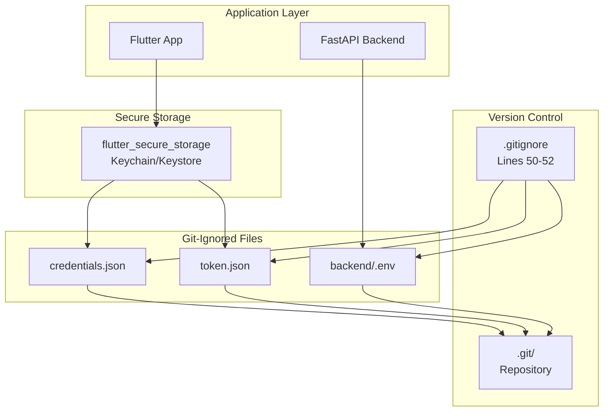
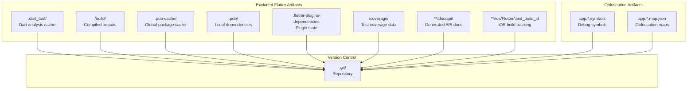
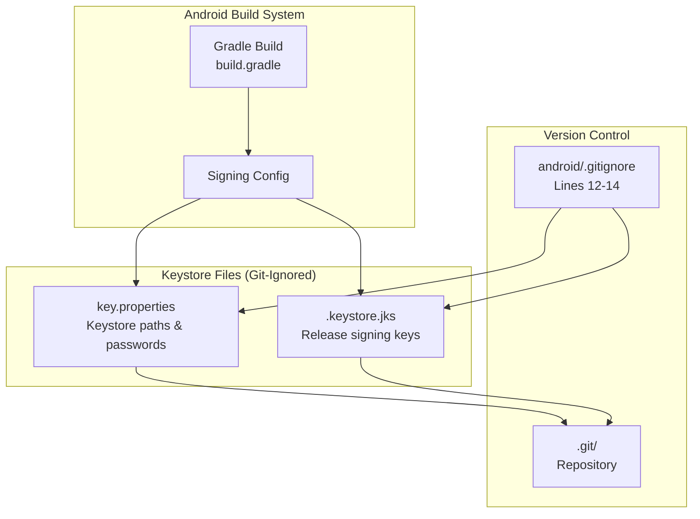
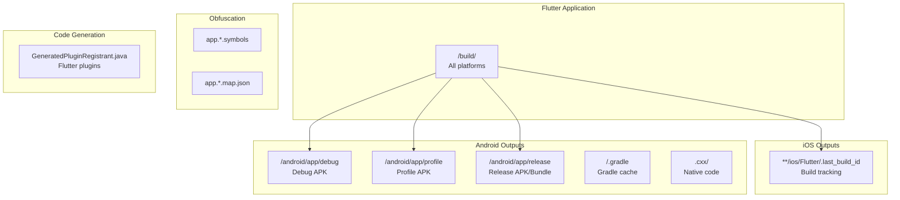

# Gitignore Configuration

> **Relevant source files**
> * [.gitignore](https://github.com/axchisan/AxIA/blob/1fe26c44/.gitignore)
> * [android/.gitignore](https://github.com/axchisan/AxIA/blob/1fe26c44/android/.gitignore)

## Purpose and Scope

This document explains the `.gitignore` configuration patterns used in the AxIA repository to prevent unnecessary and sensitive files from being committed to version control. The gitignore system operates at two levels: the root Flutter project (`.gitignore`) and the Android platform subdirectory (`android/.gitignore`).

The configuration specifically addresses:

* **Security-critical files**: Authentication credentials, environment variables, and keystores
* **Platform-specific build artifacts**: Flutter, Android, and Python outputs
* **Development environment files**: IDE configurations and temporary files

For information about secure credential storage implementation, see [Secure Credential Storage](/axchisan/AxIA/4.2-secure-credential-storage). For the repository cleanup that removed historical sensitive data, see [BFG Repository Cleanup](/axchisan/AxIA/11.2-bfg-repository-cleanup). For environment variable configuration, see [Environment Setup](/axchisan/AxIA/2.2-environment-setup).

---

## Root Gitignore Structure

The root `.gitignore` file [.gitignore L1-L53](https://github.com/axchisan/AxIA/blob/1fe26c44/.gitignore#L1-L53)

 organizes exclusion patterns into distinct categories based on file type and security level.

### Gitignore Pattern Categories

```mermaid
flowchart TD

ROOT[".gitignore<br>(Root Level)"]
SEC_ENV["Backend Environment<br>backend/.env"]
SEC_CRED["Authentication Credentials<br>credentials.json"]
SEC_TOKEN["JWT Tokens<br>token.json"]
DART[".dart_tool/"]
BUILD["/build/"]
PUB[".pub-cache/<br>.pub/"]
PLUGINS[".flutter-plugins-dependencies"]
COVERAGE["/coverage/"]
ANDROID_DEBUG["/android/app/debug"]
ANDROID_PROFILE["/android/app/profile"]
ANDROID_RELEASE["/android/app/release"]
IOS_BUILD["**/ios/Flutter/.last_build_id"]
VSCODE[".vscode/<br>(Optional)"]
IDEA[".idea/<br>*.iml, *.ipr, *.iws"]
VENV[".venv<br>venv/<br>env/"]
MISC[".log.pyc<br>.DS_Store"]

ROOT --> SEC_ENV
ROOT --> SEC_CRED
ROOT --> SEC_TOKEN
ROOT --> DART
ROOT --> BUILD
ROOT --> PUB
ROOT --> PLUGINS
ROOT --> COVERAGE
ROOT --> ANDROID_DEBUG
ROOT --> ANDROID_PROFILE
ROOT --> ANDROID_RELEASE
ROOT --> IOS_BUILD
ROOT --> VSCODE
ROOT --> IDEA
ROOT --> VENV
ROOT --> MISC

subgraph subGraph3 ["Development Files"]
    VSCODE
    IDEA
    VENV
    MISC
end

subgraph subGraph2 ["Platform Build Outputs"]
    ANDROID_DEBUG
    ANDROID_PROFILE
    ANDROID_RELEASE
    IOS_BUILD
end

subgraph subGraph1 ["Flutter Build Artifacts"]
    DART
    BUILD
    PUB
    PLUGINS
    COVERAGE
end

subgraph subGraph0 ["Security Critical"]
    SEC_ENV
    SEC_CRED
    SEC_TOKEN
end
```



**Sources:** [.gitignore L1-L53](https://github.com/axchisan/AxIA/blob/1fe26c44/.gitignore#L1-L53)

---

## Security-Critical Patterns

The most critical gitignore entries protect authentication and configuration files that contain sensitive data. These patterns were added following the BFG repository cleanup to prevent future exposure.

### Protected Security Files

| Pattern | Location | Purpose | Security Level |
| --- | --- | --- | --- |
| `backend/.env` | Backend directory | Database credentials, API keys | **Critical** |
| `credentials.json` | Root directory | FastAPI authentication credentials | **Critical** |
| `token.json` | Root directory | JWT access tokens | **High** |
| `.env` | Root directory | General environment variables | **High** |

### Security File Protection Flow



These patterns [.gitignore L50-L52](https://github.com/axchisan/AxIA/blob/1fe26c44/.gitignore#L50-L52)

 prevent the following files from being committed:

* **`backend/.env`**: Contains database connection strings, secret keys, and external API credentials
* **`credentials.json`**: Stores static username/password pairs for FastAPI authentication
* **`token.json`**: Contains dynamic JWT tokens with 24-hour expiration

**Sources:** [.gitignore L50-L52](https://github.com/axchisan/AxIA/blob/1fe26c44/.gitignore#L50-L52)

---

## Flutter and Dart Patterns

Flutter-specific patterns exclude build outputs, dependency caches, and generated files that should not be version-controlled.

### Flutter Build and Dependency Exclusions



| Pattern | Line | Regeneration Source | Purpose |
| --- | --- | --- | --- |
| `.dart_tool/` | 33 | Dart analyzer | Analysis cache |
| `.flutter-plugins-dependencies` | 34 | Flutter tool | Plugin dependency tracking |
| `.pub-cache/` | 35 | Pub package manager | Global package cache |
| `.pub/` | 36 | Pub package manager | Local package state |
| `/build/` | 37 | Flutter build system | Compiled application outputs |
| `/coverage/` | 38 | Flutter test | Code coverage reports |
| `**/doc/api/` | 31 | Dartdoc | Generated API documentation |
| `**/ios/Flutter/.last_build_id` | 32 | Flutter iOS build | Build tracking metadata |

**Sources:** [.gitignore L30-L44](https://github.com/axchisan/AxIA/blob/1fe26c44/.gitignore#L30-L44)

---

## Android Platform Patterns

The Android-specific gitignore file [android/.gitignore L1-L15](https://github.com/axchisan/AxIA/blob/1fe26c44/android/.gitignore#L1-L15)

 excludes Gradle build artifacts and security-sensitive keystore files.

### Android Build and Security Exclusions

| Pattern | Line | Purpose | Security Impact |
| --- | --- | --- | --- |
| `gradle-wrapper.jar` | 1 | Gradle wrapper binary | None (redistributable) |
| `/.gradle` | 2 | Gradle build cache | Performance |
| `/captures/` | 3 | Android Studio screen captures | None |
| `/gradlew` | 4 | Gradle wrapper script | None (generated) |
| `/gradlew.bat` | 5 | Windows Gradle wrapper | None (generated) |
| `/local.properties` | 6 | SDK paths (machine-specific) | Configuration |
| `GeneratedPluginRegistrant.java` | 7 | Flutter plugin registry | Generated |
| `.cxx/` | 8 | C++ build outputs | Performance |
| `key.properties` | 12 | Keystore configuration | **Critical** |
| `**/*.keystore` | 13 | Release signing keys | **Critical** |
| `**/*.jks` | 14 | Java keystores | **Critical** |

### Android Keystore Protection

The Android gitignore specifically protects signing keys used for app distribution:



The comment [android/.gitignore L10-L11](https://github.com/axchisan/AxIA/blob/1fe26c44/android/.gitignore#L10-L11)

 explicitly warns: "Remember to never publicly share your keystore." These patterns prevent accidental exposure of:

* **`key.properties`**: Contains keystore passwords and file paths
* **`*.keystore` / `*.jks`**: Binary keystore files containing release signing certificates

**Sources:** [android/.gitignore L1-L15](https://github.com/axchisan/AxIA/blob/1fe26c44/android/.gitignore#L1-L15)

---

## Python Backend Patterns

The root gitignore includes Python-specific patterns to support the FastAPI backend and n8n integration.

### Python Virtual Environment Exclusions

| Pattern | Line | Purpose |
| --- | --- | --- |
| `.venv` | 15 | Python virtual environment (common naming) |
| `venv/` | 16 | Python virtual environment (standard naming) |
| `env/` | 17 | Python virtual environment (alternative naming) |
| `.env` | 18 | Environment variable file |
| `*.pyc` | 4 | Compiled Python bytecode |
| `*.log` | 3 | Python log files |

These patterns [.gitignore L3-L18](https://github.com/axchisan/AxIA/blob/1fe26c44/.gitignore#L3-L18)

 ensure Python dependencies and environment configurations remain local to each development machine, preventing conflicts between different Python versions or operating systems.

**Sources:** [.gitignore L3-L18](https://github.com/axchisan/AxIA/blob/1fe26c44/.gitignore#L3-L18)

---

## IDE and Development Tools

The gitignore accommodates multiple development environments used across the team.

### Supported IDE Patterns

| IDE/Tool | Patterns | Lines | Status |
| --- | --- | --- | --- |
| **IntelliJ IDEA** | `*.iml`, `*.ipr`, `*.iws`, `.idea/` | 20-23 | Active |
| **VS Code** | `.vscode/` | 28 | Commented out (team preference) |
| **Xcode** | `.swiftpm/` | 12 | Active |
| **Android Studio** | `/android/app/{debug,profile,release}` | 47-49 | Active |
| **Atom** | `.atom/` | 7 | Legacy |

The VS Code pattern is commented out [.gitignore L25-L28](https://github.com/axchisan/AxIA/blob/1fe26c44/.gitignore#L25-L28)

 with the rationale: "The .vscode folder contains launch configuration and tasks you configure in VS Code which you may wish to be included in version control." This allows teams to share debugging configurations while excluding other IDE metadata.

### Miscellaneous Development Files

| Pattern | Line | Purpose |
| --- | --- | --- |
| `*.class` | 2 | Java compiled classes |
| `*.log` | 3 | Log files from any tool |
| `*.swp` | 5 | Vim swap files |
| `.DS_Store` | 6 | macOS Finder metadata |
| `.history` | 10 | File history tracking |
| `.svn/` | 11 | Subversion metadata (legacy) |
| `.buildlog/` | 9 | Build logs |
| `migrate_working_dir/` | 13 | Migration temporary directory |

**Sources:** [.gitignore L1-L28](https://github.com/axchisan/AxIA/blob/1fe26c44/.gitignore#L1-L28)

---

## Build Artifact Exclusions

Both gitignore files systematically exclude all build outputs to keep the repository clean and reduce merge conflicts.

### Complete Build Output Hierarchy



All build artifacts are automatically regenerated by their respective build systems:

* **Flutter**: `flutter build` regenerates `/build/` and platform-specific outputs
* **Gradle**: `./gradlew assembleDebug` recreates Android build artifacts
* **Xcode**: `flutter build ios` regenerates iOS outputs

**Sources:** [.gitignore L37-L49](https://github.com/axchisan/AxIA/blob/1fe26c44/.gitignore#L37-L49)

 [android/.gitignore L1-L8](https://github.com/axchisan/AxIA/blob/1fe26c44/android/.gitignore#L1-L8)

---

## Pattern Priority and Specificity

Gitignore patterns follow a specific precedence order to handle edge cases and overrides.

### Pattern Specificity Rules

| Pattern Type | Example | Effect |
| --- | --- | --- |
| **Exact file name** | `token.json` | Ignores file at any depth |
| **Directory-specific** | `backend/.env` | Ignores only `backend/.env`, not `.env` elsewhere |
| **Wildcard extension** | `*.pyc` | Ignores all `.pyc` files recursively |
| **Directory tree** | `**/doc/api/` | Ignores `doc/api/` at any depth |
| **Rooted path** | `/build/` | Ignores only `/build/` at repository root |

The root `.gitignore` uses both specific paths (`backend/.env` [.gitignore L50](https://github.com/axchisan/AxIA/blob/1fe26c44/.gitignore#L50-L50)

) and general patterns (`*.log` [.gitignore L3](https://github.com/axchisan/AxIA/blob/1fe26c44/.gitignore#L3-L3)

) to balance precision and maintainability.

**Sources:** [.gitignore L1-L53](https://github.com/axchisan/AxIA/blob/1fe26c44/.gitignore#L1-L53)

---

## Best Practices and Recommendations

Based on the current configuration and repository security requirements:

### Security Checklist

1. **Verify sensitive files are ignored:** ``` git check-ignore credentials.json token.json backend/.env ``` All three should return the filename if properly ignored.
2. **Check for accidental commits:** ``` git ls-files | grep -E "(credentials\.json|token\.json|\.env$)" ``` Should return no results in a clean repository.
3. **Test before committing:** ``` git status --ignored ``` Review the "Ignored files" section to ensure sensitive data is excluded.

### Common Pitfalls

| Issue | Symptom | Solution |
| --- | --- | --- |
| `.env` at wrong level | `backend/.env` committed | Use `backend/.env` pattern, not just `.env` |
| Keystore committed | `*.jks` appears in `git status` | Ensure `android/.gitignore` is present |
| Token file tracked | `token.json` shows as modified | Run `git rm --cached token.json` |
| VS Code config ignored | Team can't share launch configs | Uncomment `.vscode/` exclusion |

### Maintenance Guidelines

* **Before adding patterns**: Check if the file type is already covered by wildcards (e.g., `*.log` covers all log files)
* **After cleanup operations**: Update gitignore to prevent re-introduction (see [BFG Repository Cleanup](/axchisan/AxIA/11.2-bfg-repository-cleanup))
* **For new platforms**: Add platform-specific subdirectory gitignore files (e.g., `ios/.gitignore` if needed)
* **Environment variables**: Always use `backend/.env` for backend-specific configs, `.env` for general configs

**Sources:** [.gitignore L1-L53](https://github.com/axchisan/AxIA/blob/1fe26c44/.gitignore#L1-L53)

 [android/.gitignore L1-L15](https://github.com/axchisan/AxIA/blob/1fe26c44/android/.gitignore#L1-L15)

---

## Related Configuration

This gitignore configuration works in conjunction with:

* **[Secure Credential Storage](/axchisan/AxIA/4.2-secure-credential-storage)**: How `credentials.json` and `token.json` are encrypted and managed
* **[Environment Setup](/axchisan/AxIA/2.2-environment-setup)**: Environment variable configuration and `.env` file structure
* **[BFG Repository Cleanup](/axchisan/AxIA/11.2-bfg-repository-cleanup)**: Historical removal of sensitive files from Git history
* **[Android Setup](/axchisan/AxIA/9.1-android-setup)**: Android-specific security and keystore management