# Grabación de audio

> **Archivos fuente relevantes**
> * [GUÍA DE IMPLEMENTACIÓN DE AUDIO.md](https://github.com/axchisan/AxIA/blob/1fe26c44/AUDIO_IMPLEMENTATION_GUIDE.md)
> * [REGISTRO DE CAMBIOS_MEJORAS_CHAT.md](https://github.com/axchisan/AxIA/blob/1fe26c44/CHANGELOG_MEJORAS_CHAT.md)

## Propósito y alcance

Este documento describe la implementación de la grabación de audio en AxIA, incluyendo la `AudioService`clase, los controles de gestos de la interfaz de usuario, la gestión de permisos y la administración de archivos. El sistema de grabación captura los mensajes de voz del usuario y los convierte a audio codificado en Base64 para su transmisión mediante WebSocket.

Para la función de reproducción de audio, consulte [Reproducción de audio](/axchisan/AxIA/6.2-audio-playback) . Para la integración con ElevenLabs y Whisper, consulte [Integración de audio](/axchisan/AxIA/6.3-audio-backend-integration) . Para el protocolo de mensajes WebSocket, consulte [Comunicación WebSocket](/axchisan/AxIA/5.1-websocket-communication) .

---

## Arquitectura de grabación

El sistema de grabación de audio está integrado en el `record`paquete (v5.1.2) y consta de tres componentes principales:

| Componente | Objetivo | Ubicación |
| --- | --- | --- |
| `AudioService` | Lógica de grabación central, gestión de archivos, conversión a Base64 | `lib/services/audio_service.dart` |
| `ChatScreen`Interfaz de usuario | Manejo de gestos del usuario, visualización del temporizador, retroalimentación visual | `lib/screens/chat/chat_screen.dart` |
| `ChatProvider` | Orquestación de mensajes, transmisión WebSocket | `lib/providers/chat_provider.dart` |

### Diagrama de arquitectura de grabación


**Fuentes:** [GU L1-L50](https://github.com/axchisan/AxIA/blob/1fe26c44/AUDIO_IMPLEMENTATION_GUIDE.md#L1-L50)

 [CHANGELOG_MEJORAS_CHAT.md L5-L18](https://github.com/axchisan/AxIA/blob/1fe26c44/CHANGELOG_MEJORAS_CHAT.md#L5-L18)

---

## Estructura de la clase AudioService

La `AudioService`clase en[lib/servicios/servicio_de_audio.dart](https://github.com/axchisan/AxIA/blob/1fe26c44/lib/services/audio_service.dart)

Gestiona todas las operaciones de grabación. Mantiene el estado del `record`paquete y gestiona todo el ciclo de vida de la grabación.

### Métodos y responsabilidades clave


| Método | Objetivo | Devoluciones |
| --- | --- | --- |
| `requestPermission()` | Solicita acceso al micrófono desde el sistema operativo | `bool`- permiso concedido |
| `startRecording()` | Comienza la grabación AAC en el directorio temporal | `void` |
| `stopRecordingAndGetBase64()` | Detiene la grabación y la convierte a Base64 | `String?`- Audio base64 |
| `getRecordingDuration()` | Devuelve el tiempo de grabación transcurrido | `int`- segundos |
| `_startTimer()` | Inicializa el contador de duración | `void` |
| `_stopTimer()` | Detiene y reinicia el temporizador | `void` |
| `_convertToBase64()` | Lee el archivo temporal y lo codifica en Base64 | `String?` |

**Fuentes:** [GU L45-L71](https://github.com/axchisan/AxIA/blob/1fe26c44/AUDIO_IMPLEMENTATION_GUIDE.md#L45-L71)

 [CHANGELOG_MEJORAS_CHAT.md L76-L83](https://github.com/axchisan/AxIA/blob/1fe26c44/CHANGELOG_MEJORAS_CHAT.md#L76-L83)

---

## Ciclo de vida de la grabación

El proceso de grabación sigue una máquina de estados con fases diferenciadas:

### Máquina de estados de grabación


### Lógica de duración de la grabación

El sistema implementa cancelación inteligente para evitar grabaciones cortas accidentales:

* **< 1 segundo** : se cancela automáticamente, no se envía ningún mensaje
* **>= 1 segundo** : Grabación válida, procede a la codificación
* **Visualización del temporizador** : se actualiza cada 100 ms en formato MM:SS

**Fuentes:** [CHANGELOG_MEJORAS_CHAT.md L5-L18](https://github.com/axchisan/AxIA/blob/1fe26c44/CHANGELOG_MEJORAS_CHAT.md#L5-L18)

 [lib/pantallas/chat/chat_screen.dart](https://github.com/axchisan/AxIA/blob/1fe26c44/lib/screens/chat/chat_screen.dart)

---

## Sistema de gestos de interfaz de usuario

The recording UI in `ChatScreen` implements three gesture patterns:

### Gesture Interaction Flow


### Gesture Implementation Details

The gesture detection uses Flutter's `GestureDetector` widget with the following handlers:

| Handler | Trigger | Action |
| --- | --- | --- |
| `onLongPressStart` | User presses mic button | Request permission, start recording |
| `onLongPressMoveUpdate` | User drags while holding | Check for slide-up gesture (dy < -50) |
| `onLongPressEnd` | User releases button | Stop recording if not locked |
| Manual tap | User taps send (locked mode) | Stop recording and send |

The slide-to-lock threshold is **50 pixels upward** (negative dy value). When locked, a lock icon (🔒) appears, and the recording continues until the user manually taps the send button.

**Sources:** [CHANGELOG_MEJORAS_CHAT.md L5-L18](https://github.com/axchisan/AxIA/blob/1fe26c44/CHANGELOG_MEJORAS_CHAT.md#L5-L18)

 [lib/screens/chat/chat_screen.dart](https://github.com/axchisan/AxIA/blob/1fe26c44/lib/screens/chat/chat_screen.dart)

---

## Timer and Duration Tracking

The recording timer provides real-time feedback on recording duration:

### Timer Implementation

The timer uses a `Timer.periodic` with 100ms intervals:


### Duration Format

The timer displays in **MM:SS format**:

* 5 seconds → `00:05`
* 1 minute 30 seconds → `01:30`
* 10 minutes 45 seconds → `10:45`

The formatting logic calculates:

* Minutes: `duration ~/ 60`
* Seconds: `duration % 60`
* Both padded to 2 digits with leading zeros

**Sources:** [CHANGELOG_MEJORAS_CHAT.md L8-L9](https://github.com/axchisan/AxIA/blob/1fe26c44/CHANGELOG_MEJORAS_CHAT.md#L8-L9)

 [lib/services/audio_service.dart](https://github.com/axchisan/AxIA/blob/1fe26c44/lib/services/audio_service.dart)

---

## Permission Handling

Audio recording requires microphone permissions, configured per platform:

### Permission Configuration

| Platform | Configuration File | Permission Declaration |
| --- | --- | --- |
| Android | `android/app/src/main/AndroidManifest.xml` | `<uses-permission android:name="android.permission.RECORD_AUDIO"/>` |
| Android | `android/app/src/main/AndroidManifest.xml` | `<uses-permission android:name="android.permission.MODIFY_AUDIO_SETTINGS"/>` |
| iOS | `ios/Runner/Info.plist` | `NSMicrophoneUsageDescription` key |

### Permission Request Flow

```mermaid
sequenceDiagram
  participant User
  participant AudioService.requestPermission()
  participant permission_handler
  participant Operating System

  User->>AudioService.requestPermission(): Press microphone button
  AudioService.requestPermission()->>permission_handler: Permission.microphone.status
  loop [Permission Not Determined]
    permission_handler->>Operating System: Show permission dialog
    Operating System->>User: "Allow AxIA to access microphone?"
    User->>Operating System: Grant/Deny
    Operating System-->>permission_handler: PermissionStatus
    permission_handler-->>AudioService.requestPermission(): PermissionStatus.granted
    permission_handler-->>AudioService.requestPermission(): PermissionStatus.denied
    AudioService.requestPermission()->>User: Show settings prompt
  end
  permission_handler-->>AudioService.requestPermission(): Return bool
  AudioService.requestPermission()-->>User: Begin recording or show error
```

### iOS Permission Message

The `NSMicrophoneUsageDescription` in [ios/Runner/Info.plist](https://github.com/axchisan/AxIA/blob/1fe26c44/ios/Runner/Info.plist)

 displays:

> "AxIA necesita acceso al micrófono para grabar mensajes de voz..."

This message appears in the iOS permission dialog when the app first requests microphone access.

**Sources:** [AUDIO_IMPLEMENTATION_GUIDE.md L85-L97](https://github.com/axchisan/AxIA/blob/1fe26c44/AUDIO_IMPLEMENTATION_GUIDE.md#L85-L97)

 [android/app/src/main/AndroidManifest.xml](https://github.com/axchisan/AxIA/blob/1fe26c44/android/app/src/main/AndroidManifest.xml)

 [ios/Runner/Info.plist](https://github.com/axchisan/AxIA/blob/1fe26c44/ios/Runner/Info.plist)

---

## Audio Format and Quality

The recording system uses AAC encoding with specific quality parameters:

### Recording Specifications

| Parameter | Value | Rationale |
| --- | --- | --- |
| **Format** | AAC/M4A | Cross-platform compatibility (iOS + Android) |
| **Bitrate** | 128 kbps | Balance between quality and file size |
| **Sample Rate** | 44.1 kHz | Standard audio quality |
| **Channels** | Mono | Voice recording (stereo unnecessary) |
| **Encoder** | `AudioEncoder.aacLc` | Low Complexity AAC for efficiency |

### Encoder Configuration


### File Size Estimation

At 128 kbps bitrate:

* **1 minute** ≈ 960 KB (0.94 MB)
* **5 minutes** ≈ 4.7 MB
* **10 minutes** ≈ 9.4 MB

Base64 encoding increases size by approximately 33%, resulting in:

* **1 minute** ≈ 1.25 MB (Base64)
* **5 minutes** ≈ 6.25 MB (Base64)

**Sources:** [AUDIO_IMPLEMENTATION_GUIDE.md L27-L31](https://github.com/axchisan/AxIA/blob/1fe26c44/AUDIO_IMPLEMENTATION_GUIDE.md#L27-L31)

 [lib/services/audio_service.dart](https://github.com/axchisan/AxIA/blob/1fe26c44/lib/services/audio_service.dart)

---

## File Management and Conversion

The recording system manages temporary files and Base64 conversion:

### File Lifecycle Diagram


### Temporary File Management

The system uses the device's temporary directory provided by `path_provider`:

1. **File creation**: `stopRecordingAndGetBase64()` returns the file path
2. **File naming**: Automatically generated by `record` package (e.g., `audio_recording_1701234567.m4a`)
3. **File reading**: Synchronous `File.readAsBytesSync()` for conversion
4. **Eliminación de archivos** : limpieza inmediata después de la conversión a Base64
5. **Limpieza del sistema operativo** : Android/iOS purga automáticamente los directorios temporales cuando se necesita espacio

### Proceso de conversión a Base64

La conversión de un archivo AAC a una cadena Base64:

```mermaid
sequenceDiagram
  participant AudioService
  participant Recorded File
  participant dart:convert
  participant Base64 String
  participant ChatProvider

  AudioService->>Recorded File: readAsBytesSync()
  Recorded File-->>AudioService: Uint8List bytes
  AudioService->>dart:convert: base64Encode(bytes)
  dart:convert-->>Base64 String: String (Base64)
  AudioService->>Recorded File: delete()
  AudioService-->>ChatProvider: Return Base64 string
```

La cadena Base64 se integra en el mensaje WebSocket y se envía al backend. No se mantiene almacenamiento persistente en el dispositivo.

**Fuentes:** [GU L27-L37](https://github.com/axchisan/AxIA/blob/1fe26c44/AUDIO_IMPLEMENTATION_GUIDE.md#L27-L37)

 [lib/servicios/servicio_de_audio.dart](https://github.com/axchisan/AxIA/blob/1fe26c44/lib/services/audio_service.dart)

---

## Integración con el sistema de chat

El audio grabado se integra con el flujo de mensajes del chat:

### Formato del mensaje

Cuando un usuario completa una grabación, el `ChatProvider.sendAudioMessage()`método transmite:

```json
{
  "event": "messages.upsert",
  "channel": "app",
  "data": {
    "message": {
      "base64": "[BASE64_ENCODED_AAC_AUDIO]"
    },
    "messageType": "audioMessage"
  },
  "session_id": "user_session_identifier"
}
```

### Flujo de mensajes de audio

```mermaid
sequenceDiagram
  participant User
  participant ChatScreen
  participant AudioService
  participant ChatProvider
  participant Hive (Local DB)
  participant WebSocket
  participant FastAPI Backend

  User->>ChatScreen: Complete recording
  ChatScreen->>AudioService: stopRecordingAndGetBase64()
  AudioService-->>ChatScreen: Base64 string
  ChatScreen->>ChatProvider: sendAudioMessage(base64)
  ChatProvider->>Hive (Local DB): Save message (type: audio)
  ChatProvider->>ChatProvider: Add to local message list
  ChatProvider->>ChatScreen: notifyListeners()
  ChatScreen->>User: Show "🎤 Mensaje de voz" bubble
  ChatProvider->>WebSocket: Send JSON message
  WebSocket->>FastAPI Backend: Forward to n8n
  FastAPI Backend->>FastAPI Backend: Process with Whisper + AI
  FastAPI Backend->>WebSocket: Response (text or audio)
  WebSocket->>ChatProvider: Receive response
  ChatProvider->>Hive (Local DB): Save response
  ChatProvider->>ChatScreen: notifyListeners()
  ChatScreen->>User: Display response (text or play audio)
```



### Almacenamiento de mensajes locales

Los mensajes de audio se almacenan en Hive con estos campos:

| Campo | Tipo | Valor de ejemplo |
| --- | --- | --- |
| `id` | Cadena | UUID versión 4 |
| `sender` | Cadena | `"user"` |
| `text` | Cadena | `"🎤 Mensaje de voz"` |
| `timestamp` | Fecha y hora | `2024-01-15 14:30:00` |
| `type` | Cadena | `"audio"` |
| `audioBase64` | Cadena | Cadena Base64 (almacenada para reproducción) |

El `audioBase64`campo permite que la aplicación reproduzca los mensajes enviados sin volver a grabarlos.

**Fuentes:** [GU L99-L125](https://github.com/axchisan/AxIA/blob/1fe26c44/AUDIO_IMPLEMENTATION_GUIDE.md#L99-L125)

 [lib/proveedores/chat_provider.dart](https://github.com/axchisan/AxIA/blob/1fe26c44/lib/providers/chat_provider.dart)

 [lib/pantallas/chat/chat_screen.dart](https://github.com/axchisan/AxIA/blob/1fe26c44/lib/screens/chat/chat_screen.dart)

---

## Manejo de errores y casos extremos

El sistema de grabación gestiona varios escenarios de error:

### Escenarios de error comunes

| Error | Detección | Recuperación |
| --- | --- | --- |
| Permiso denegado | `requestPermission()`devoluciones`false` | Mostrar error en la barra de snacks y solicitar al usuario la configuración |
| Error al iniciar la grabación | `startRecording()`lanza una excepción | Error de registro, restablecer estado de la interfaz de usuario |
| Error de escritura de archivo | `stopRecordingAndGetBase64()`devoluciones`null` | Mostrar mensaje de error, no enviar mensaje |
| Error de conversión a Base64 | La lectura del archivo genera una excepción | Error de registro, limpiar archivo temporal |
| WebSocket desconectado | El envío falla en`ChatProvider` | Mensaje de cola para reintento, mostrar indicador fuera de línea |
| Grabación corta (< 1 s) | Duración del check in`ChatScreen` | Cancelación automática, mostrar mensaje "Grabación demasiado corta" |

### Registro y depuración

Incluye el `AudioService`registro con el prefijo `[AudioService]`para la resolución de problemas:

* Solicitudes de permisos y resultados
* Grabación de eventos de inicio y parada
* Rutas y tamaños de archivos
* Éxito/fracaso de la conversión
* Operaciones de limpieza

Los registros de depuración se pueden encontrar en la salida de la consola de Flutter cuando se ejecuta en modo de desarrollo.

**Fuentes:** [GU L187-L202](https://github.com/axchisan/AxIA/blob/1fe26c44/AUDIO_IMPLEMENTATION_GUIDE.md#L187-L202)

 [CHANGELOG_MEJORAS_CHAT.md L85-L89](https://github.com/axchisan/AxIA/blob/1fe26c44/CHANGELOG_MEJORAS_CHAT.md#L85-L89)