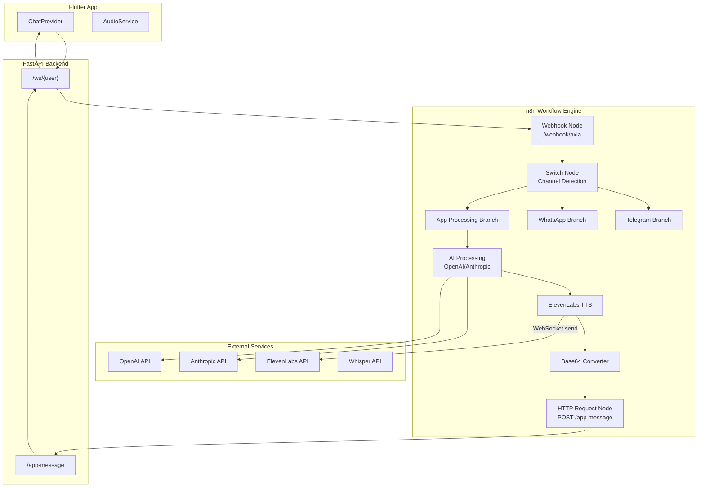
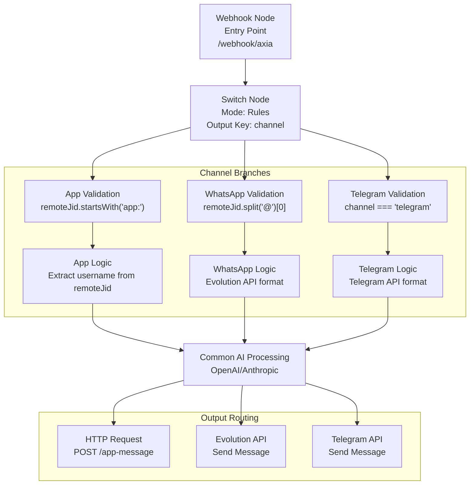
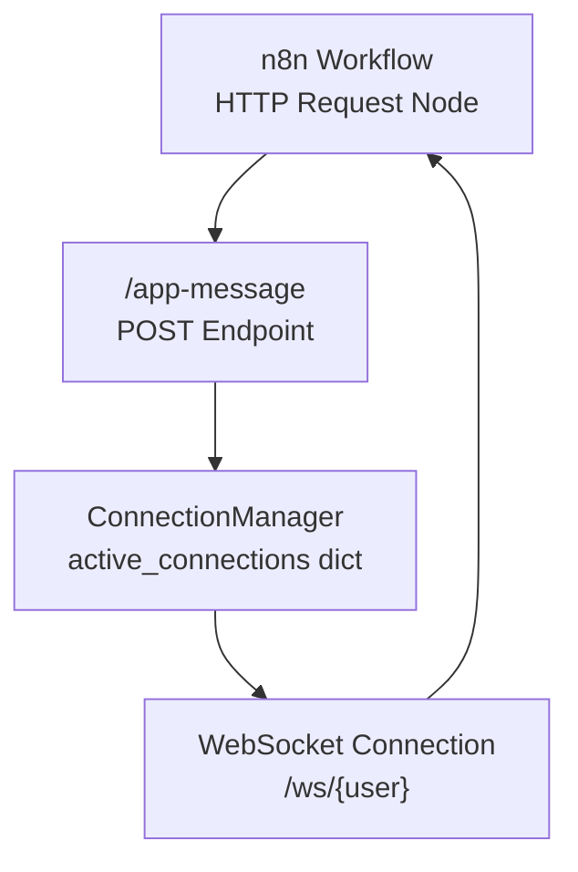
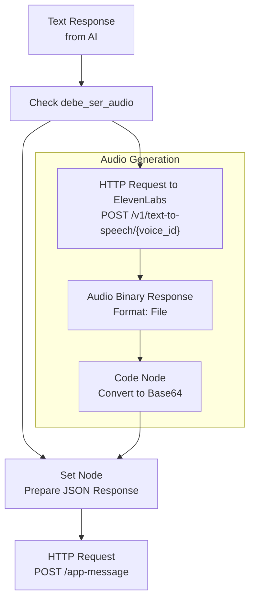

# Integración n8n

> **Archivos fuente relevantes**
> * [N8N_CONFIGURACIÓN_FINAL.md](https://github.com/axchisan/AxIA/blob/1fe26c44/N8N_CONFIGURATION_FINAL.md)
> * [GUÍA DE CONFIGURACIÓN N8N.md](https://github.com/axchisan/AxIA/blob/1fe26c44/N8N_CONFIGURATION_GUIDE.md)
> * [GUÍA DE INTEGRACIÓN N8N.md](https://github.com/axchisan/AxIA/blob/1fe26c44/N8N_INTEGRATION_GUIDE.md)

## Propósito y alcance

Este documento describe la integración del motor de flujo de trabajo n8n en el sistema AxIA. n8n funciona como la capa de procesamiento de IA, recibiendo mensajes de múltiples canales (aplicación AxIA, WhatsApp, Telegram), orquestando las interacciones del modelo de IA y generando respuestas. Esta integración permite al backend delegar el procesamiento complejo de IA, la transcripción de audio y la conversión de texto a voz a una plataforma dedicada a la automatización del flujo de trabajo.

Para obtener más información sobre el backend de FastAPI que envía mensajes a n8n, consulte [Backend de FastAPI](/axchisan/AxIA/3.2-fastapi-backend) . Para obtener información específica sobre la comunicación WebSocket, consulte [Comunicación WebSocket](/axchisan/AxIA/5.1-websocket-communication) . Para el procesamiento de audio en flujos de trabajo de n8n, consulte [Integración del backend de audio](/axchisan/AxIA/6.3-audio-backend-integration) .

## Descripción general de la arquitectura

La integración de n8n funciona como un motor de flujo de trabajo basado en webhooks que se ubica entre el backend de FastAPI y los servicios de IA externos. El backend reenvía los mensajes entrantes a n8n, que los procesa mediante diversos modelos y servicios de IA y devuelve respuestas estructuradas.



**Fuentes:** [N8N_CONFIGURATION_FINAL.md L1-L182](https://github.com/axchisan/AxIA/blob/1fe26c44/N8N_CONFIGURATION_FINAL.md#L1-L182)

 [GU L1-L353](https://github.com/axchisan/AxIA/blob/1fe26c44/N8N_CONFIGURATION_GUIDE.md#L1-L353)

## Arquitectura del flujo de mensajes

El flujo de mensajes a través de n8n sigue un protocolo webhook estandarizado compatible con el formato API de Evolution, lo que permite soporte multicanal.

```sql
"FastAPI/app-message""ElevenLabs TTS""AI ProcessingOpenAI/Anthropic""Switch NodeChannel Routing""n8n Webhook/webhook/axia""FastAPI WebSocket/ws/{user}""Flutter AppChatProvider""FastAPI/app-message""ElevenLabs TTS""AI ProcessingOpenAI/Anthropic""Switch NodeChannel Routing""n8n Webhook/webhook/axia""FastAPI WebSocket/ws/{user}""Flutter AppChatProvider"#mermaid-9zoqu3lz3o{font-family:ui-sans-serif,-apple-system,system-ui,Segoe UI,Helvetica;font-size:16px;fill:#333;}@keyframes edge-animation-frame{from{stroke-dashoffset:0;}}@keyframes dash{to{stroke-dashoffset:0;}}#mermaid-9zoqu3lz3o .edge-animation-slow{stroke-dasharray:9,5!important;stroke-dashoffset:900;animation:dash 50s linear infinite;stroke-linecap:round;}#mermaid-9zoqu3lz3o .edge-animation-fast{stroke-dasharray:9,5!important;stroke-dashoffset:900;animation:dash 20s linear infinite;stroke-linecap:round;}#mermaid-9zoqu3lz3o .error-icon{fill:#dddddd;}#mermaid-9zoqu3lz3o .error-text{fill:#222222;stroke:#222222;}#mermaid-9zoqu3lz3o .edge-thickness-normal{stroke-width:1px;}#mermaid-9zoqu3lz3o .edge-thickness-thick{stroke-width:3.5px;}#mermaid-9zoqu3lz3o .edge-pattern-solid{stroke-dasharray:0;}#mermaid-9zoqu3lz3o .edge-thickness-invisible{stroke-width:0;fill:none;}#mermaid-9zoqu3lz3o .edge-pattern-dashed{stroke-dasharray:3;}#mermaid-9zoqu3lz3o .edge-pattern-dotted{stroke-dasharray:2;}#mermaid-9zoqu3lz3o .marker{fill:#999;stroke:#999;}#mermaid-9zoqu3lz3o .marker.cross{stroke:#999;}#mermaid-9zoqu3lz3o svg{font-family:ui-sans-serif,-apple-system,system-ui,Segoe UI,Helvetica;font-size:16px;}#mermaid-9zoqu3lz3o p{margin:0;}#mermaid-9zoqu3lz3o .actor{stroke:#cccccc;fill:#ffffff;}#mermaid-9zoqu3lz3o text.actor>tspan{fill:#333;stroke:none;}#mermaid-9zoqu3lz3o .actor-line{stroke:#cccccc;}#mermaid-9zoqu3lz3o .messageLine0{stroke-width:1.5;stroke-dasharray:none;stroke:#999999;}#mermaid-9zoqu3lz3o .messageLine1{stroke-width:1.5;stroke-dasharray:2,2;stroke:#999999;}#mermaid-9zoqu3lz3o #arrowhead path{fill:#999999;stroke:#999999;}#mermaid-9zoqu3lz3o .sequenceNumber{fill:#666666;}#mermaid-9zoqu3lz3o #sequencenumber{fill:#999999;}#mermaid-9zoqu3lz3o #crosshead path{fill:#999999;stroke:#999999;}#mermaid-9zoqu3lz3o .messageText{fill:#333333;stroke:none;}#mermaid-9zoqu3lz3o .labelBox{stroke:#dddddd;fill:#ffffff;}#mermaid-9zoqu3lz3o .labelText,#mermaid-9zoqu3lz3o .labelText>tspan{fill:#333;stroke:none;}#mermaid-9zoqu3lz3o .loopText,#mermaid-9zoqu3lz3o .loopText>tspan{fill:#333;stroke:none;}#mermaid-9zoqu3lz3o .loopLine{stroke-width:2px;stroke-dasharray:2,2;stroke:#dddddd;fill:#dddddd;}#mermaid-9zoqu3lz3o .note{stroke:#e6d280;fill:#fff5ad;}#mermaid-9zoqu3lz3o .noteText,#mermaid-9zoqu3lz3o .noteText>tspan{fill:#333;stroke:none;}#mermaid-9zoqu3lz3o .activation0{fill:hsl(-120, 0%, 91.7647058824%);stroke:hsl(-120, 0%, 81.7647058824%);}#mermaid-9zoqu3lz3o .activation1{fill:hsl(-120, 0%, 91.7647058824%);stroke:hsl(-120, 0%, 81.7647058824%);}#mermaid-9zoqu3lz3o .activation2{fill:hsl(-120, 0%, 91.7647058824%);stroke:hsl(-120, 0%, 81.7647058824%);}#mermaid-9zoqu3lz3o .actorPopupMenu{position:absolute;}#mermaid-9zoqu3lz3o .actorPopupMenuPanel{position:absolute;fill:#ffffff;box-shadow:0px 8px 16px 0px rgba(0,0,0,0.2);filter:drop-shadow(3px 5px 2px rgb(0 0 0 / 0.4));}#mermaid-9zoqu3lz3o .actor-man line{stroke:#cccccc;fill:#ffffff;}#mermaid-9zoqu3lz3o .actor-man circle,#mermaid-9zoqu3lz3o line{stroke:#cccccc;fill:#ffffff;stroke-width:2px;}#mermaid-9zoqu3lz3o :root{--mermaid-font-family:"trebuchet ms",verdana,arial,sans-serif;}alt["TextMessage"]["AudioMessage"]alt["debe_ser_audio: true"]"WebSocket send{type, text/audio_base64, session_id}""POST webhook{channel: 'app', data: {...}}""Detect channel field""Route to app branch""Process with LLM""Transcribe audio first""Process transcription""Generate response""Convert to speech""Audio binary""Convert to Base64""POST /app-message{username, session_id, output, type, audio_base64}""Find active WebSocket""WebSocket send response"
```

**Fuentes:** [N8N_CONFIGURATION_FINAL.md L151-L182](https://github.com/axchisan/AxIA/blob/1fe26c44/N8N_CONFIGURATION_FINAL.md#L151-L182)

 [GU L6-L64](https://github.com/axchisan/AxIA/blob/1fe26c44/N8N_CONFIGURATION_GUIDE.md#L6-L64)

 [GU L1-L256](https://github.com/axchisan/AxIA/blob/1fe26c44/N8N_INTEGRATION_GUIDE.md#L1-L256)

## Especificación del formato del mensaje

El webhook n8n espera mensajes en formato compatible con la API de Evolution e identificador de canal. Esto permite que el mismo flujo de trabajo gestione múltiples orígenes de mensajes.

### Estructura del mensaje de texto

```go
{
  "event": "messages.upsert",
  "instance": "AxIAPersonal",
  "channel": "app",
  "data": {
    "key": {
      "remoteJid": "app:AxchiSan@axia.app",
      "fromMe": false,
      "id": "1764210412809"
    },
    "pushName": "AxchiSan",
    "message": {
      "conversation": "Dime que eventos tengo para mi agenda"
    },
    "messageType": "conversation",
    "messageTimestamp": 1764210411,
    "source": "flutter_app"
  }
}
```

**Fuentes:** [GU L19-L40](https://github.com/axchisan/AxIA/blob/1fe26c44/N8N_CONFIGURATION_GUIDE.md#L19-L40)

 [GU L9-L34](https://github.com/axchisan/AxIA/blob/1fe26c44/N8N_INTEGRATION_GUIDE.md#L9-L34)

### Estructura del mensaje de audio

```json
{
  "event": "messages.upsert",
  "instance": "AxIAPersonal",
  "channel": "app",
  "data": {
    "key": {
      "remoteJid": "app:AxchiSan@axia.app",
      "fromMe": false,
      "id": "1764210412809"
    },
    "pushName": "AxchiSan",
    "message": {
      "base64": "[BASE64_AUDIO_DATA]"
    },
    "messageType": "audioMessage",
    "messageTimestamp": 1764210411,
    "source": "flutter_app"
  }
}
```

**Fuentes:** [GU L42-L63](https://github.com/axchisan/AxIA/blob/1fe26c44/N8N_CONFIGURATION_GUIDE.md#L42-L63)

 [GU L36-L61](https://github.com/axchisan/AxIA/blob/1fe26c44/N8N_INTEGRATION_GUIDE.md#L36-L61)

### Campos de identificación del canal

| Campo | Valor de WhatsApp | Valor de la aplicación AxIA | Objetivo |
| --- | --- | --- | --- |
| `channel` | `undefined` | `"app"` | Identificador de canal principal |
| `data.key.remoteJid` | `573183038190:24@s.whatsapp.net` | `app:AxchiSan@axia.app` | Identificación de usuario con prefijo de canal |
| `data.source` | `"android"` | `"flutter_app"` | Identificador de la fuente del mensaje |
| `data.messageType` | `"conversation"`o`"audioMessage"` | `"conversation"`o`"audioMessage"` | Tipo de contenido del mensaje |

**Fuentes:** [GU L64-L71](https://github.com/axchisan/AxIA/blob/1fe26c44/N8N_INTEGRATION_GUIDE.md#L64-L71)

## Detección y enrutamiento de canales

El flujo de trabajo n8n utiliza un nodo Switch para enrutar mensajes según el `channel`campo. Esto permite que un único punto final de webhook gestione múltiples orígenes de mensajes con diferente lógica de procesamiento.



**Fuentes:** [GU L67-L94](https://github.com/axchisan/AxIA/blob/1fe26c44/N8N_CONFIGURATION_GUIDE.md#L67-L94)

 [N8N_CONFIGURATION_FINAL.md L23-L40](https://github.com/axchisan/AxIA/blob/1fe26c44/N8N_CONFIGURATION_FINAL.md#L23-L40)

## Lógica de extracción de nombre de usuario

Different channels use different `remoteJid` formats. The n8n workflow must extract the username appropriately for each channel.

### WhatsApp Format

```
// remoteJid: "573183038190:24@s.whatsapp.net"
{{ $('Webhook').item.json.body.data.key.remoteJid.split("@")[0].split(":")[0] }}
// Result: "573183038190"
```

### AxIA App Format

```
// remoteJid: "app:AxchiSan@axia.app"
{{ $('Webhook').item.json.data.key.remoteJid.split(":")[1].split("@")[0] }}
// Result: "AxchiSan"
```

### Unified Extraction

```javascript
{{
  $if($('Webhook').isExecuted, 
    (() => {
      const remoteJid = $('Webhook').item.json.body.data.key.remoteJid;
      const channel = $('Webhook').item.json.body.channel;
      
      if (channel === 'app' || remoteJid.startsWith('app:')) {
        return remoteJid.split(':')[1].split('@')[0];
      }
      
      return remoteJid.split('@')[0].split(':')[0];
    })(), 
    ''
  )
}}
```

**Sources:** [N8N_INTEGRATION_GUIDE.md L88-L138](https://github.com/axchisan/AxIA/blob/1fe26c44/N8N_INTEGRATION_GUIDE.md#L88-L138)

 [N8N_CONFIGURATION_GUIDE.md L95-L112](https://github.com/axchisan/AxIA/blob/1fe26c44/N8N_CONFIGURATION_GUIDE.md#L95-L112)

 [N8N_CONFIGURATION_FINAL.md L49-L74](https://github.com/axchisan/AxIA/blob/1fe26c44/N8N_CONFIGURATION_FINAL.md#L49-L74)

## Response Format Specification

The n8n workflow must return responses in a standardized format. For app messages, responses are sent to the `/app-message` endpoint, which forwards them to the appropriate WebSocket connection.

### Text Response Format

```json
{
  "username": "AxchiSan",
  "session_id": "e15c2816-135e-45d7-9b58-a6c307f1b5b3",
  "output": "Hola, estos son tus eventos de la semana:\n\n- Lunes: Reunión con el equipo\n- Miércoles: Presentación del proyecto",
  "type": "text",
  "debe_ser_audio": false,
  "audio_url": null,
  "audio_base64": null
}
```

### Audio Response Format

```json
{
  "username": "AxchiSan",
  "session_id": "e15c2816-135e-45d7-9b58-a6c307f1b5b3",
  "output": "Tienes 3 eventos esta semana",
  "type": "audio",
  "debe_ser_audio": true,
  "audio_url": null,
  "audio_base64": "UklGRiQAAABXQVZFZm10IBAAAAABAAEAQB8AAEAfAAABAAgAZGF0YQAAAAA="
}
```

**Sources:** [N8N_CONFIGURATION_FINAL.md L184-L210](https://github.com/axchisan/AxIA/blob/1fe26c44/N8N_CONFIGURATION_FINAL.md#L184-L210)

 [N8N_CONFIGURATION_GUIDE.md L152-L174](https://github.com/axchisan/AxIA/blob/1fe26c44/N8N_CONFIGURATION_GUIDE.md#L152-L174)

## Backend Integration Endpoint

The FastAPI backend provides the `/app-message` endpoint specifically for n8n to deliver processed responses back to connected WebSocket clients.



### HTTP Request Node Configuration

**Method:** `POST`
**URL:** `https://apiaxia.axchisan.com/app-message`
**Authentication:** None (internal endpoint)
**Content-Type:** `application/json`

**Body:**

```
{
  "username": "{{ $json.username }}",
  "session_id": "{{ $json.session_id }}",
  "output": "{{ $json.output }}",
  "type": "{{ $json.type }}",
  "debe_ser_audio": {{ $json.debe_ser_audio }},
  "audio_url": {{ $json.audio_url || null }},
  "audio_base64": "{{ $json.audio_base64 }}"
}
```

**Important:** This endpoint does not require JWT authentication because it is called by n8n, not by the user client.

**Sources:** [N8N_CONFIGURATION_FINAL.md L3-L19](https://github.com/axchisan/AxIA/blob/1fe26c44/N8N_CONFIGURATION_FINAL.md#L3-L19)

 [N8N_CONFIGURATION_FINAL.md L122-L149](https://github.com/axchisan/AxIA/blob/1fe26c44/N8N_CONFIGURATION_FINAL.md#L122-L149)

## Audio Processing Pipeline

When `debe_ser_audio` is `true`, the n8n workflow converts the text response to audio using ElevenLabs TTS and encodes it as Base64.



### ElevenLabs TTS Configuration

**Endpoint:** `POST https://api.elevenlabs.io/v1/text-to-speech/{voice_id}`

**Headers:**

```json
{
  "xi-api-key": "tu_api_key_elevenlabs",
  "Content-Type": "application/json"
}
```

**Body:**

```json
{
  "text": "{{ $json.output }}",
  "model_id": "eleven_multilingual_v2",
  "voice_settings": {
    "stability": 0.5,
    "similarity_boost": 0.75
  }
}
```

**Response Format:** `File`

### Base64 Conversion Code

```javascript
const audioBuffer = $input.first().binary.data;
const audioBase64 = audioBuffer.toString('base64');

return {
  ...$json,
  audio_base64: audioBase64,
  audio_url: null
};
```

**Sources:** [N8N_CONFIGURATION_FINAL.md L76-L120](https://github.com/axchisan/AxIA/blob/1fe26c44/N8N_CONFIGURATION_FINAL.md#L76-L120)

## Session and User Identification

The n8n workflow must extract and preserve session identifiers to ensure responses are routed to the correct conversation context.

| Field | Source | Usage |
| --- | --- | --- |
| `username` | Extracted from `remoteJid` | Identifies WebSocket connection target |
| `session_id` | `data.key.id` from webhook | Links request to response in chat UI |
| `remoteJid` | `data.key.remoteJid` | Channel-prefixed user identifier |

### Data Preparation Node

```javascript
// Extraer username desde el remoteJid
const remoteJid = $('Webhook').item.json.body.data.key.remoteJid;
const username = remoteJid.split(':')[1].split('@')[0];

// Extraer session_id
const sessionId = $('Webhook').item.json.body.data.key.id;

// Respuesta de AxIA (asumiendo que viene del nodo anterior)
const axiaResponse = $json.output || $json.text || '';

// Determinar si debe ser audio
const debeSerAudio = $json.debe_ser_audio || false;

return {
  username: username,
  session_id: sessionId,
  output: axiaResponse,
  type: debeSerAudio ? 'audio' : 'text',
  debe_ser_audio: debeSerAudio,
  audio_url: null,
  audio_base64: null
};
```

**Sources:** [N8N_CONFIGURATION_FINAL.md L49-L74](https://github.com/axchisan/AxIA/blob/1fe26c44/N8N_CONFIGURATION_FINAL.md#L49-L74)

## Testing and Validation

### Direct Endpoint Testing

```
curl -X POST https://apiaxia.axchisan.com/app-message \
  -H "Content-Type: application/json" \
  -d '{
    "username": "AxchiSan",
    "session_id": "test-123",
    "output": "Hola desde n8n",
    "type": "text",
    "debe_ser_audio": false,
    "audio_url": null,
    "audio_base64": null
  }'
```

Expected response when user is connected:

```json
{
  "status": "message_sent",
  "username": "AxchiSan"
}
```

Expected response when no active connections:

```json
{
  "status": "no_active_connections"
}
```

**Sources:** [N8N_CONFIGURATION_FINAL.md L212-L230](https://github.com/axchisan/AxIA/blob/1fe26c44/N8N_CONFIGURATION_FINAL.md#L212-L230)

## Important Constraints

1. The `username` field must match exactly the username that authenticated with the WebSocket connection
2. The backend automatically routes messages to all active WebSocket connections for the specified user
3. If no WebSocket connections are active, the endpoint returns `status: "no_active_connections"` but does not queue the message
4. Audio responses can include both `audio_base64` and `audio_url`, but `audio_base64` takes precedence in the Flutter app
5. The `session_id` must match the `id` from the original webhook message to maintain conversation context

**Sources:** [N8N_CONFIGURATION_FINAL.md L232-L237](https://github.com/axchisan/AxIA/blob/1fe26c44/N8N_CONFIGURATION_FINAL.md#L232-L237)

## Configuration Requirements

### Environment Variables

The n8n webhook URL should be configured in the FastAPI backend environment:

```
N8N_WEBHOOK_URL=https://n8n.axchisan.com/webhook/15f68f4b-70e3-48eb-ae7d-d36d0a630118
```

### Webhook Security

The webhook endpoint accepts unauthenticated POST requests. Security is maintained through:

* Private webhook URL (UUID-based path)
* Internal network communication between backend and n8n
* User validation within the n8n workflow based on `remoteJid`

**Sources:** [N8N_INTEGRATION_GUIDE.md L190-L197](https://github.com/axchisan/AxIA/blob/1fe26c44/N8N_INTEGRATION_GUIDE.md#L190-L197)

 [N8N_CONFIGURATION_FINAL.md L3-L19](https://github.com/axchisan/AxIA/blob/1fe26c44/N8N_CONFIGURATION_FINAL.md#L3-L19)

## Multi-Channel Architecture Benefits

The unified webhook approach provides several advantages:

1. **Single Workflow:** One n8n workflow handles app, WhatsApp, and Telegram messages
2. **Lógica de IA compartida:** los nodos de procesamiento de IA comunes sirven a todos los canales
3. **Formato específico del canal:** los nodos de conmutación permiten un formato de salida personalizado por canal
4. **Actualizaciones centralizadas:** los cambios en las indicaciones o modelos de IA se aplican en todos los canales
5. **Optimización de costos:** uso compartido de API de IA en múltiples fuentes de mensajes

**Fuentes:** [GU L204-L223](https://github.com/axchisan/AxIA/blob/1fe26c44/N8N_CONFIGURATION_GUIDE.md#L204-L223)

 [GU L164-L174](https://github.com/axchisan/AxIA/blob/1fe26c44/N8N_INTEGRATION_GUIDE.md#L164-L174)