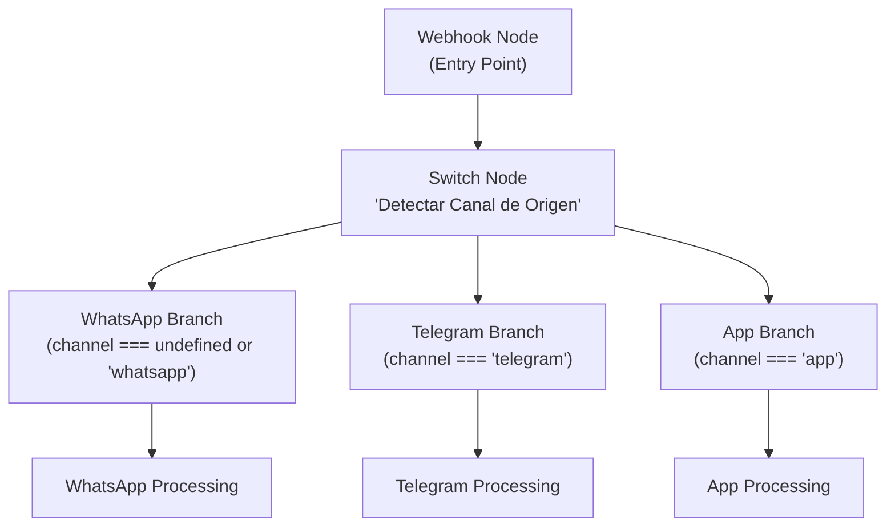
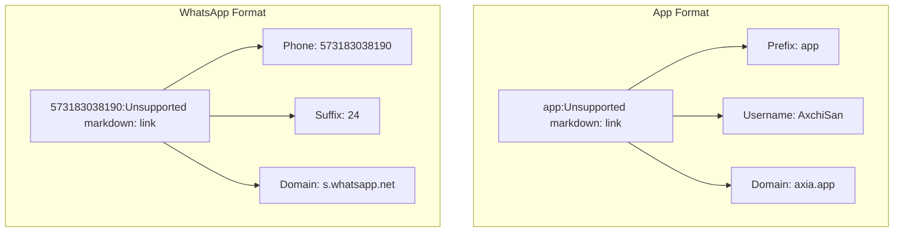
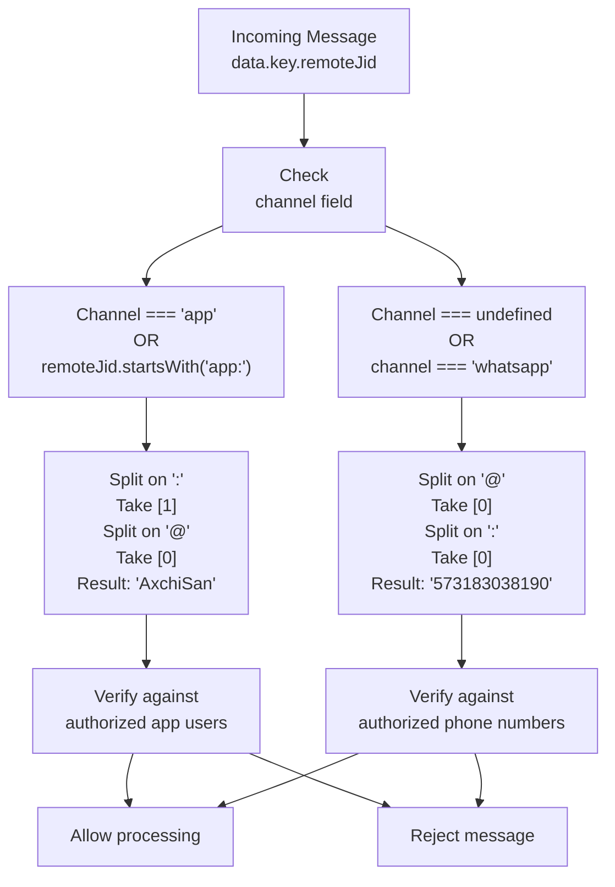
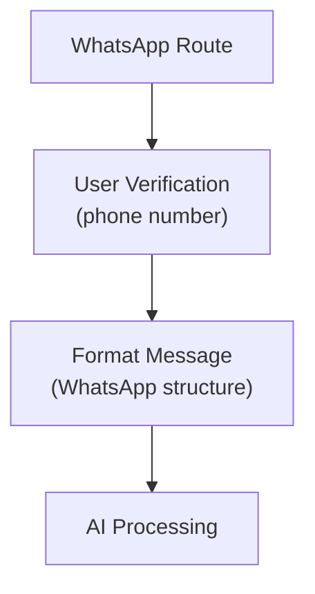
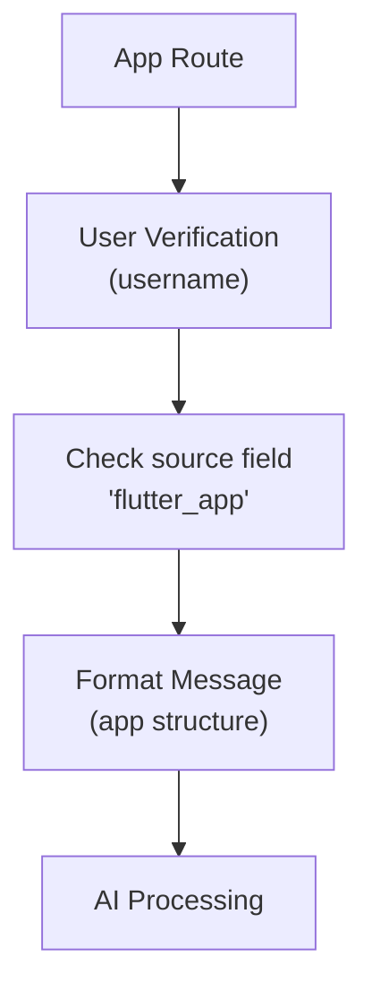
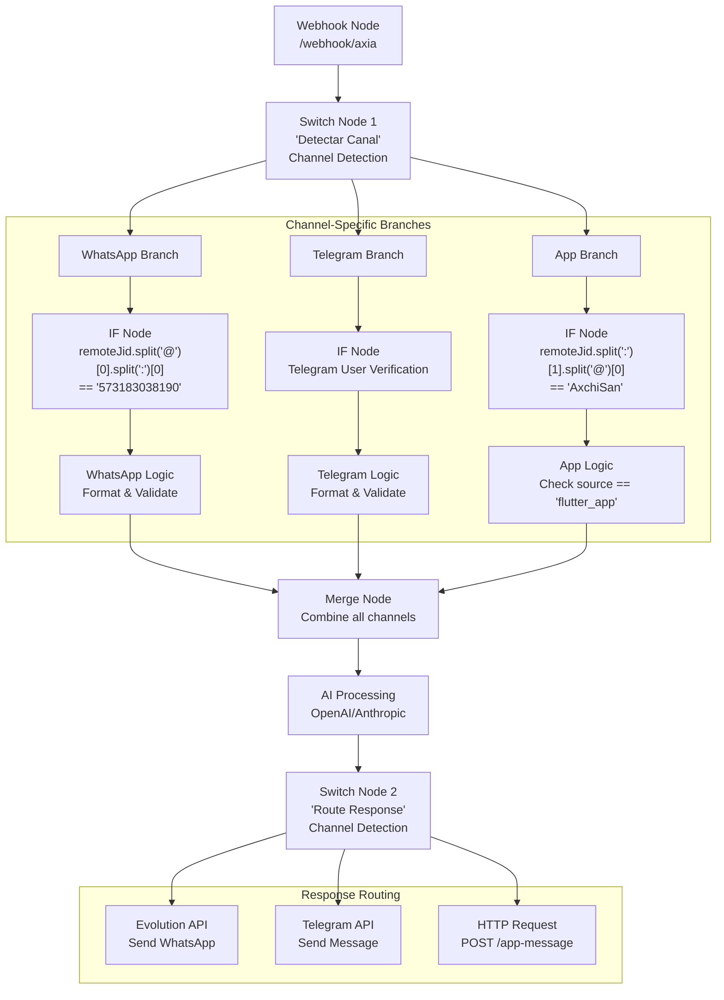
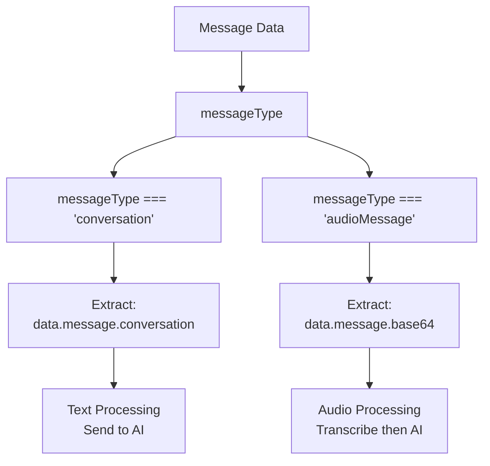

# Message Routing

> **Relevant source files**
> * [N8N_CONFIGURATION_GUIDE.md](https://github.com/axchisan/AxIA/blob/1fe26c44/N8N_CONFIGURATION_GUIDE.md)
> * [N8N_INTEGRATION_GUIDE.md](https://github.com/axchisan/AxIA/blob/1fe26c44/N8N_INTEGRATION_GUIDE.md)

**Purpose**: This document describes the n8n Switch node logic used to route incoming messages based on their source channel (app, WhatsApp, Telegram). It covers channel detection rules, `remoteJid` format parsing, and user verification expressions for each communication channel.

For information about webhook configuration and incoming message formats, see [Webhook Configuration](/axchisan/AxIA/7.1-webhook-configuration). For AI processing and response formatting after routing, see [Response Generation](/axchisan/AxIA/7.3-response-generation).

---

## Channel Detection Strategy

The n8n workflow uses a **Switch node** immediately after the webhook to detect the message source channel. This node examines the `channel` field and routes messages to channel-specific processing branches.

### Switch Node Configuration

| Setting | Value |
| --- | --- |
| Node Type | Switch |
| Mode | Rules |
| Name | "Detectar Canal de Origen" |
| Evaluation | Execute in order, stop at first match |

**Sources**: [N8N_CONFIGURATION_GUIDE.md L69-L93](https://github.com/axchisan/AxIA/blob/1fe26c44/N8N_CONFIGURATION_GUIDE.md#L69-L93)

### Detection Rules

The Switch node implements three routing rules executed in order:

```
// Rule 1 - WhatsApp Detection
{{ $json.channel === undefined || $json.channel === 'whatsapp' }}

// Rule 2 - Telegram Detection  
{{ $json.channel === 'telegram' }}

// Rule 3 - App Detection
{{ $json.channel === 'app' }}
```

**Sources**: [N8N_CONFIGURATION_GUIDE.md L77-L93](https://github.com/axchisan/AxIA/blob/1fe26c44/N8N_CONFIGURATION_GUIDE.md#L77-L93)

### Channel Detection Flow



**Sources**: [N8N_CONFIGURATION_GUIDE.md L204-L223](https://github.com/axchisan/AxIA/blob/1fe26c44/N8N_CONFIGURATION_GUIDE.md#L204-L223)

---

## RemoteJid Format Analysis

Each channel uses a different `remoteJid` format to identify users. Understanding these formats is critical for proper user verification.

### Format Comparison

| Channel | RemoteJid Format | Example | Extraction Pattern |
| --- | --- | --- | --- |
| **WhatsApp** | `{phone}:{suffix}@s.whatsapp.net` | `573183038190:24@s.whatsapp.net` | Split on `@`, then `:` |
| **App** | `app:{username}@{domain}` | `app:AxchiSan@axia.app` | Split on `:`, extract username |
| **Telegram** | `telegram:{user_id}@{domain}` | `telegram:123456@tg.com` | Split on `:`, extract user_id |

**Sources**: [N8N_INTEGRATION_GUIDE.md L63-L71](https://github.com/axchisan/AxIA/blob/1fe26c44/N8N_INTEGRATION_GUIDE.md#L63-L71)

 [N8N_CONFIGURATION_GUIDE.md L27](https://github.com/axchisan/AxIA/blob/1fe26c44/N8N_CONFIGURATION_GUIDE.md#L27-L27)

 [N8N_CONFIGURATION_GUIDE.md L50](https://github.com/axchisan/AxIA/blob/1fe26c44/N8N_CONFIGURATION_GUIDE.md#L50-L50)

### RemoteJid Structure Diagram



**Sources**: [N8N_INTEGRATION_GUIDE.md L63-L71](https://github.com/axchisan/AxIA/blob/1fe26c44/N8N_INTEGRATION_GUIDE.md#L63-L71)

 [N8N_CONFIGURATION_GUIDE.md L18-L63](https://github.com/axchisan/AxIA/blob/1fe26c44/N8N_CONFIGURATION_GUIDE.md#L18-L63)

---

## User Verification Expressions

Each channel requires different n8n expressions to extract and verify the user identifier.

### WhatsApp User Extraction

The WhatsApp verification extracts the phone number from the `remoteJid`:

```
// Expression
{{ $if($('Webhook').isExecuted, 
   $('Webhook').item.json.body.data.key.remoteJid.split("@")[0].split(":")[0], 
   '') 
}}

// Expected result: '573183038190'
// Validation: Equals to '573183038190'
```

**Processing steps**:

1. Split on `@` → `['573183038190:24', 's.whatsapp.net']`
2. Take first element → `'573183038190:24'`
3. Split on `:` → `['573183038190', '24']`
4. Take first element → `'573183038190'`

**Sources**: [N8N_CONFIGURATION_GUIDE.md L97-L102](https://github.com/axchisan/AxIA/blob/1fe26c44/N8N_CONFIGURATION_GUIDE.md#L97-L102)

### App User Extraction

The app verification extracts the username after the `app:` prefix:

```
// Expression - Method 1: Full extraction
{{ $if($('Webhook').isExecuted, 
   $('Webhook').item.json.data.key.remoteJid.split(":")[1].split("@")[0], 
   '') 
}}

// Expected result: 'AxchiSan'
// Validation: Equals to 'AxchiSan@axia.app' (or just 'AxchiSan')
```

**Processing steps**:

1. Split on `:` → `['app', 'AxchiSan@axia.app']`
2. Take second element → `'AxchiSan@axia.app'`
3. Split on `@` → `['AxchiSan', 'axia.app']`
4. Take first element → `'AxchiSan'`

**Sources**: [N8N_CONFIGURATION_GUIDE.md L104-L108](https://github.com/axchisan/AxIA/blob/1fe26c44/N8N_CONFIGURATION_GUIDE.md#L104-L108)

### Prefix-Based Detection

A simpler approach for app messages uses prefix detection:

```
// Expression - Method 2: Prefix check
{{ $json.data.key.remoteJid.startsWith('app:') }}

// Returns: true for app messages, false otherwise
```

**Sources**: [N8N_CONFIGURATION_GUIDE.md L110-L113](https://github.com/axchisan/AxIA/blob/1fe26c44/N8N_CONFIGURATION_GUIDE.md#L110-L113)

 [N8N_INTEGRATION_GUIDE.md L83-L84](https://github.com/axchisan/AxIA/blob/1fe26c44/N8N_INTEGRATION_GUIDE.md#L83-L84)

### Combined Verification Logic

For workflows handling multiple channels, use a unified verification expression:

```javascript
// Multi-channel user verification
{{
  $if($('Webhook').isExecuted, 
    (() => {
      const remoteJid = $('Webhook').item.json.body.data.key.remoteJid;
      const channel = $('Webhook').item.json.body.channel;
      
      // App channel
      if (channel === 'app' || remoteJid.startsWith('app:')) {
        return remoteJid.split(':')[1].split('@')[0];
      }
      
      // WhatsApp channel
      return remoteJid.split('@')[0].split(':')[0];
    })(), 
    ''
  )
}}
```

**Sources**: [N8N_INTEGRATION_GUIDE.md L99-L117](https://github.com/axchisan/AxIA/blob/1fe26c44/N8N_INTEGRATION_GUIDE.md#L99-L117)

### Verification Flow Diagram



**Sources**: [N8N_INTEGRATION_GUIDE.md L99-L138](https://github.com/axchisan/AxIA/blob/1fe26c44/N8N_INTEGRATION_GUIDE.md#L99-L138)

 [N8N_CONFIGURATION_GUIDE.md L97-L113](https://github.com/axchisan/AxIA/blob/1fe26c44/N8N_CONFIGURATION_GUIDE.md#L97-L113)

---

## Channel-Specific Processing Branches

After routing, each channel has dedicated processing logic before converging at the AI processing stage.

### WhatsApp Branch Logic



### App Branch Logic



**Sources**: [N8N_CONFIGURATION_GUIDE.md L204-L223](https://github.com/axchisan/AxIA/blob/1fe26c44/N8N_CONFIGURATION_GUIDE.md#L204-L223)

 [N8N_INTEGRATION_GUIDE.md L162-L174](https://github.com/axchisan/AxIA/blob/1fe26c44/N8N_INTEGRATION_GUIDE.md#L162-L174)

---

## Complete Routing Architecture

The complete message routing system connects incoming webhooks through channel detection, user verification, and processing branches.

### End-to-End Routing Flow



**Sources**: [N8N_CONFIGURATION_GUIDE.md L204-L223](https://github.com/axchisan/AxIA/blob/1fe26c44/N8N_CONFIGURATION_GUIDE.md#L204-L223)

 [N8N_INTEGRATION_GUIDE.md L162-L189](https://github.com/axchisan/AxIA/blob/1fe26c44/N8N_INTEGRATION_GUIDE.md#L162-L189)

---

## Message Content Extraction

Each channel requires different n8n expressions to extract message content based on message type.

### Text Message Extraction

```
// App source detection and text extraction
{{ $json.data.source === 'flutter_app' ? 
   $json.data.message.conversation : 
   $json.body.data.message.conversation 
}}
```

**Sources**: [N8N_CONFIGURATION_GUIDE.md L118-L124](https://github.com/axchisan/AxIA/blob/1fe26c44/N8N_CONFIGURATION_GUIDE.md#L118-L124)

### Audio Message Detection

```
// Condition to detect audio message type
{{ $json.data.messageType === 'audioMessage' }}

// Audio data extraction (Base64)
{{ $json.data.messageType === 'audioMessage' ? 
   $json.data.message.base64 : 
   null 
}}
```

**Sources**: [N8N_CONFIGURATION_GUIDE.md L126-L143](https://github.com/axchisan/AxIA/blob/1fe26c44/N8N_CONFIGURATION_GUIDE.md#L126-L143)

### Message Type Routing



**Sources**: [N8N_CONFIGURATION_GUIDE.md L132-L143](https://github.com/axchisan/AxIA/blob/1fe26c44/N8N_CONFIGURATION_GUIDE.md#L132-L143)

---

## Implementation Checklist

When implementing message routing in n8n, verify the following components:

| Component | Configuration Required | Validation |
| --- | --- | --- |
| **Switch Node 1** | Channel detection rules | 3 outputs (WhatsApp, Telegram, App) |
| **WhatsApp IF** | Phone number verification | Split `@` then `:`, check first segment |
| **App IF** | Username verification | Split `:` then `@`, check segments |
| **Telegram IF** | User ID verification | Split `:`, extract user_id |
| **Merge Node** | Combine branches | Before AI processing |
| **Switch Node 2** | Response routing | 3 outputs (same channels) |

**Sources**: [N8N_CONFIGURATION_GUIDE.md L314-L324](https://github.com/axchisan/AxIA/blob/1fe26c44/N8N_CONFIGURATION_GUIDE.md#L314-L324)

---

## Troubleshooting Routing Issues

### Messages Not Routing to App Branch

**Symptoms**: App messages processed as WhatsApp messages

**Diagnosis**:

1. Verify `channel: "app"` field exists in webhook payload
2. Check Switch node rule order (app rule should be Rule 3)
3. Verify `remoteJid` has `app:` prefix

**Sources**: [N8N_CONFIGURATION_GUIDE.md L340-L344](https://github.com/axchisan/AxIA/blob/1fe26c44/N8N_CONFIGURATION_GUIDE.md#L340-L344)

### User Verification Failing

**Symptoms**: Messages rejected despite valid user

**Diagnosis**:

1. Log `remoteJid` value: `{{ $json.data.key.remoteJid }}`
2. Test extraction expression in n8n's expression editor
3. Verify format matches expected pattern

**Common mistakes**:

* Using wrong split order (`:` before `@` or vice versa)
* Accessing wrong array index after split
* Case sensitivity in username comparison

**Sources**: [N8N_INTEGRATION_GUIDE.md L88-L115](https://github.com/axchisan/AxIA/blob/1fe26c44/N8N_INTEGRATION_GUIDE.md#L88-L115)

### Channel Field Missing

**Symptoms**: WhatsApp rule catches app messages

**Solution**: Update webhook payload to always include `channel` field. WhatsApp messages from Evolution API do not include this field, so detect them with `channel === undefined`.

**Sources**: [N8N_CONFIGURATION_GUIDE.md L77-L81](https://github.com/axchisan/AxIA/blob/1fe26c44/N8N_CONFIGURATION_GUIDE.md#L77-L81)

 [N8N_INTEGRATION_GUIDE.md L63-L71](https://github.com/axchisan/AxIA/blob/1fe26c44/N8N_INTEGRATION_GUIDE.md#L63-L71)