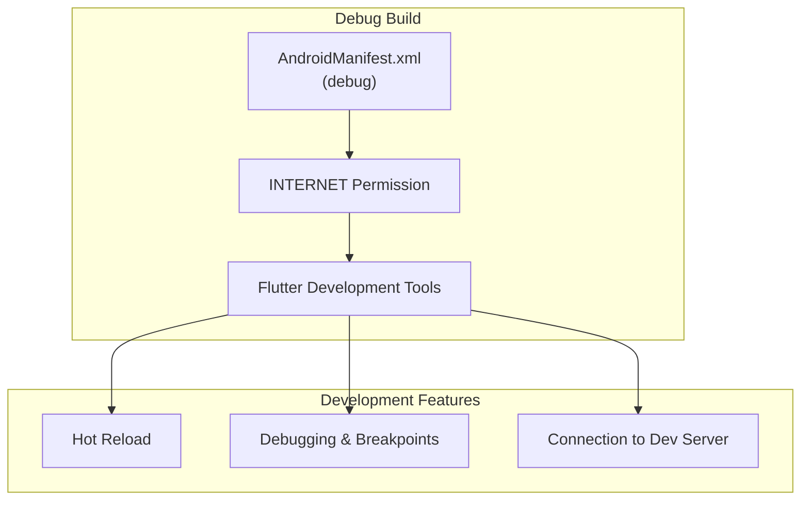
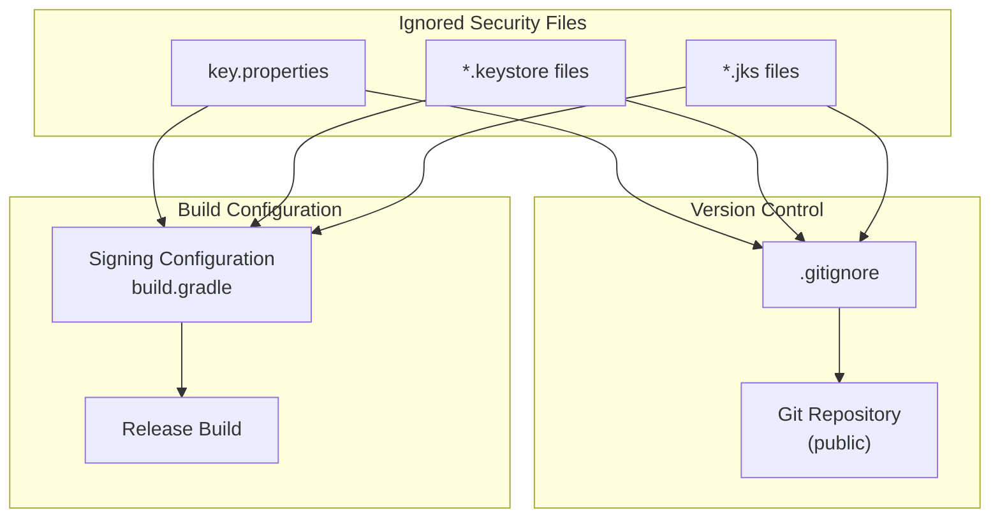
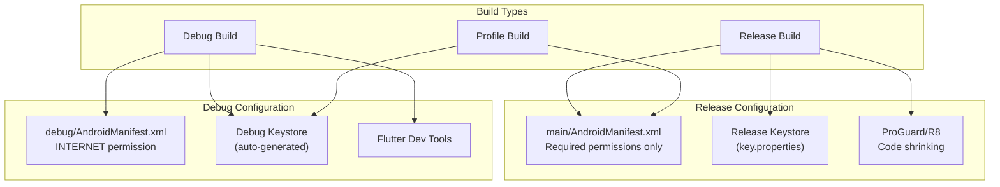

# Platform Configuration

> **Relevant source files**
> * [android/.gitignore](https://github.com/axchisan/AxIA/blob/1fe26c44/android/.gitignore)
> * [android/app/src/debug/AndroidManifest.xml](https://github.com/axchisan/AxIA/blob/1fe26c44/android/app/src/debug/AndroidManifest.xml)

## Purpose and Scope

This document covers platform-specific configuration for the AxIA Flutter application, including Android build settings, permissions, manifest files, and security-related configurations. Platform configuration ensures proper integration with native operating system features such as secure storage (Keychain/Keystore), audio recording, and network communication.

For environment variables and credentials management, see [Environment Setup](/axchisan/AxIA/2.2-environment-setup). For Flutter project-level configuration, see [Project Configuration](/axchisan/AxIA/2.1-project-configuration). For Android-specific development setup, see [Android Setup](/axchisan/AxIA/9.1-android-setup).

---

## Platform Configuration Overview

The AxIA application requires platform-specific configuration for both Android and iOS to enable:

* Network communication (REST API and WebSocket)
* Secure credential storage (Keychain on iOS, Keystore on Android)
* Audio recording permissions
* Debug vs. release build configurations

```

```

**Sources:** [android/.gitignore L1-L15](https://github.com/axchisan/AxIA/blob/1fe26c44/android/.gitignore#L1-L15)

 [android/app/src/debug/AndroidManifest.xml L1-L8](https://github.com/axchisan/AxIA/blob/1fe26c44/android/app/src/debug/AndroidManifest.xml#L1-L8)

---

## Android Configuration Structure

The Android platform configuration is organized in the standard Android application structure:

| Directory/File | Purpose |
| --- | --- |
| `android/` | Root directory for Android platform code |
| `android/app/` | Main application module |
| `android/app/build.gradle` | Application-level build configuration |
| `android/build.gradle` | Project-level build configuration |
| `android/app/src/main/AndroidManifest.xml` | Main manifest with production permissions |
| `android/app/src/debug/AndroidManifest.xml` | Debug-specific manifest overlay |
| `android/.gitignore` | Android build artifacts exclusion patterns |

**Sources:** [android/.gitignore L1-L15](https://github.com/axchisan/AxIA/blob/1fe26c44/android/.gitignore#L1-L15)

 [android/app/src/debug/AndroidManifest.xml L1-L8](https://github.com/axchisan/AxIA/blob/1fe26c44/android/app/src/debug/AndroidManifest.xml#L1-L8)

---

## Android Manifest Configuration

### Debug Manifest

The debug manifest provides additional permissions required during development but not needed in production builds.



The debug manifest at [android/app/src/debug/AndroidManifest.xml L1-L8](https://github.com/axchisan/AxIA/blob/1fe26c44/android/app/src/debug/AndroidManifest.xml#L1-L8)

 declares:

```
<uses-permission android:name="android.permission.INTERNET"/>
```

This permission is explicitly required for:

* Flutter development tools communication
* Hot reload functionality
* Debugger connection
* Development server connectivity

The manifest includes a detailed comment explaining that the `INTERNET` permission is required for development specifically to allow the Flutter tool to communicate with the running application for setting breakpoints and providing hot reload [android/app/src/debug/AndroidManifest.xml L2-L5](https://github.com/axchisan/AxIA/blob/1fe26c44/android/app/src/debug/AndroidManifest.xml#L2-L5)

**Sources:** [android/app/src/debug/AndroidManifest.xml L1-L8](https://github.com/axchisan/AxIA/blob/1fe26c44/android/app/src/debug/AndroidManifest.xml#L1-L8)

### Main Manifest (Expected)

While not present in the provided files, the main manifest (`android/app/src/main/AndroidManifest.xml`) typically includes:

| Permission/Feature | Purpose | Required By |
| --- | --- | --- |
| `INTERNET` | Network communication for API calls | ApiService, WebSocket |
| `RECORD_AUDIO` | Audio message recording | AudioService, record package |
| `WRITE_EXTERNAL_STORAGE` | Temporary audio file storage | AudioService (API < 29) |
| `READ_EXTERNAL_STORAGE` | Audio file access | AudioService (API < 29) |
| Application class | Main application entry point | Flutter engine |
| Activity configuration | Screen orientation, themes | Flutter UI |

**Sources:** [android/app/src/debug/AndroidManifest.xml L1-L8](https://github.com/axchisan/AxIA/blob/1fe26c44/android/app/src/debug/AndroidManifest.xml#L1-L8)

---

## Android Security Configuration

### Keystore and Signing

The Android platform uses keystores for application signing and release builds. The `.gitignore` file explicitly protects these sensitive files:



The `.gitignore` file at [android/.gitignore L12-L14](https://github.com/axchisan/AxIA/blob/1fe26c44/android/.gitignore#L12-L14)

 includes:

```
key.properties
**/*.keystore
**/*.jks
```

This prevents accidental commits of:

* `key.properties`: Contains keystore path, alias, and password references
* `*.keystore`: Binary keystore files containing private keys
* `*.jks`: Java KeyStore files (same as `.keystore`)

The comment at [android/.gitignore L10-L11](https://github.com/axchisan/AxIA/blob/1fe26c44/android/.gitignore#L10-L11)

 explicitly warns: "Remember to never publicly share your keystore."

**Sources:** [android/.gitignore L10-L15](https://github.com/axchisan/AxIA/blob/1fe26c44/android/.gitignore#L10-L15)

---

## Android Build Artifacts

The `.gitignore` configuration excludes Android build artifacts and generated files to keep the repository clean:

| Pattern | Description | Purpose |
| --- | --- | --- |
| `gradle-wrapper.jar` | Gradle wrapper executable | Generated by Gradle |
| `/.gradle` | Gradle build cache | Local build metadata |
| `/captures/` | Performance captures | Development diagnostics |
| `/gradlew` | Gradle wrapper script (Unix) | Generated wrapper |
| `/gradlew.bat` | Gradle wrapper script (Windows) | Generated wrapper |
| `/local.properties` | Local SDK paths | Machine-specific config |
| `GeneratedPluginRegistrant.java` | Flutter plugin registration | Auto-generated code |
| `.cxx/` | C++ build outputs | Native build artifacts |

**Sources:** [android/.gitignore L1-L9](https://github.com/axchisan/AxIA/blob/1fe26c44/android/.gitignore#L1-L9)

---

## Platform-Specific Plugin Configuration

### Secure Storage (Android Keystore)

The `flutter_secure_storage` plugin requires Android Keystore configuration to securely store credentials. On Android, this is handled automatically by the plugin, but requires:

* Minimum SDK version typically 18 or higher
* Android Keystore system access
* Hardware-backed encryption when available

This enables secure storage of:

* `credentials.json` - Static authentication credentials
* `token.json` - Dynamic JWT access tokens

For more details on credential storage, see [Secure Credential Storage](/axchisan/AxIA/4.2-secure-credential-storage).

### Audio Recording (Microphone)

The audio recording feature requires microphone permissions, typically declared in the main manifest:

```
<uses-permission android:name="android.permission.RECORD_AUDIO" />
```

This permission is requested at runtime by the `record` package when the user first attempts to record audio. For audio implementation details, see [Audio Recording](/axchisan/AxIA/6.1-audio-recording).

**Sources:** [android/app/src/debug/AndroidManifest.xml L1-L8](https://github.com/axchisan/AxIA/blob/1fe26c44/android/app/src/debug/AndroidManifest.xml#L1-L8)

---

## iOS Configuration (Overview)

While iOS configuration files are not provided in the current file set, the iOS platform typically requires:

### Info.plist Entries

| Key | Purpose | Related Feature |
| --- | --- | --- |
| `NSMicrophoneUsageDescription` | Microphone permission justification | Audio recording |
| `NSLocalNetworkUsageDescription` | Local network access | WebSocket connections |
| `NSAppTransportSecurity` | HTTPS configuration | API communication |

### Keychain Access

iOS uses Keychain Services for secure credential storage, configured automatically by `flutter_secure_storage`. Keychain access groups may be defined in `Runner.entitlements`.

For iOS-specific setup details, refer to the Flutter documentation and the `flutter_secure_storage` plugin configuration.

---

## Build Type Configuration



| Build Type | Manifest Source | Signing | Optimization | Use Case |
| --- | --- | --- | --- | --- |
| **Debug** | `debug/AndroidManifest.xml` + `main/AndroidManifest.xml` | Debug keystore | Disabled | Development |
| **Profile** | `main/AndroidManifest.xml` | Debug keystore | Enabled | Performance testing |
| **Release** | `main/AndroidManifest.xml` | Release keystore | Enabled | Production |

The debug manifest at [android/app/src/debug/AndroidManifest.xml L1-L8](https://github.com/axchisan/AxIA/blob/1fe26c44/android/app/src/debug/AndroidManifest.xml#L1-L8)

 is automatically merged with the main manifest during debug builds, adding development-specific permissions.

**Sources:** [android/.gitignore L1-L15](https://github.com/axchisan/AxIA/blob/1fe26c44/android/.gitignore#L1-L15)

 [android/app/src/debug/AndroidManifest.xml L1-L8](https://github.com/axchisan/AxIA/blob/1fe26c44/android/app/src/debug/AndroidManifest.xml#L1-L8)

---

## Platform Configuration Checklist

### Android Setup Requirements

* Main `AndroidManifest.xml` with required permissions (`INTERNET`, `RECORD_AUDIO`)
* Debug `AndroidManifest.xml` configured [android/app/src/debug/AndroidManifest.xml L1-L8](https://github.com/axchisan/AxIA/blob/1fe26c44/android/app/src/debug/AndroidManifest.xml#L1-L8)
* `.gitignore` properly excludes keystores and sensitive files [android/.gitignore L10-L15](https://github.com/axchisan/AxIA/blob/1fe26c44/android/.gitignore#L10-L15)
* `key.properties` configured for release builds (not committed)
* Release keystore generated and stored securely
* Minimum SDK version set appropriately for `flutter_secure_storage`
* Build type configurations defined in `build.gradle`

### iOS Setup Requirements

* `Info.plist` with required usage descriptions
* `Runner.entitlements` for Keychain access
* Provisioning profiles configured
* Code signing identities set up
* Build configurations for Debug/Release

### Cross-Platform Verification

* Secure storage working on both platforms
* Audio recording permissions requested correctly
* Network communication functional
* WebSocket connections establish successfully
* JWT tokens persist across app restarts

**Sources:** [android/.gitignore L1-L15](https://github.com/axchisan/AxIA/blob/1fe26c44/android/.gitignore#L1-L15)

 [android/app/src/debug/AndroidManifest.xml L1-L8](https://github.com/axchisan/AxIA/blob/1fe26c44/android/app/src/debug/AndroidManifest.xml#L1-L8)