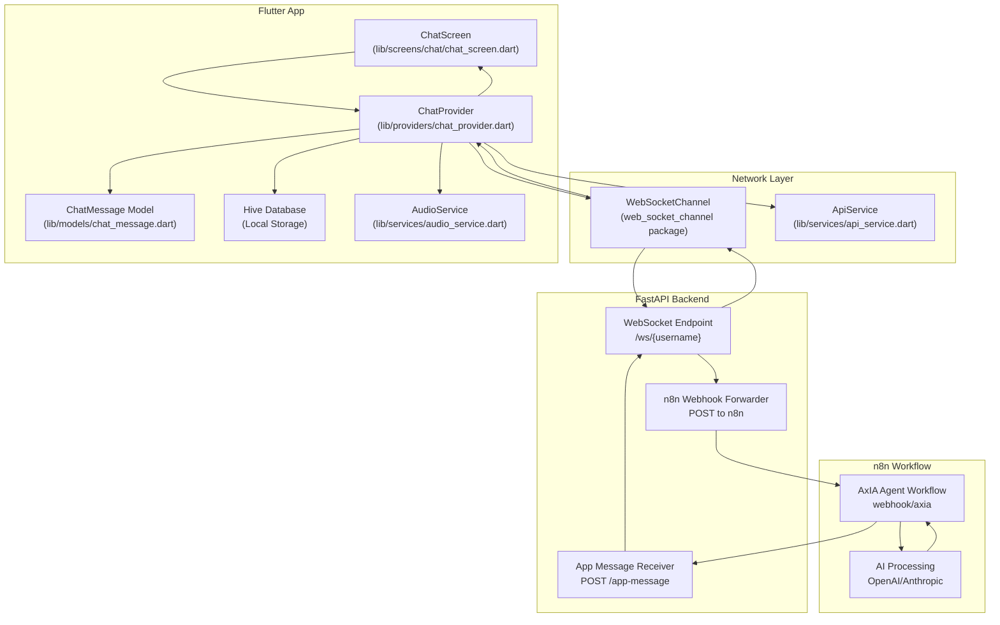
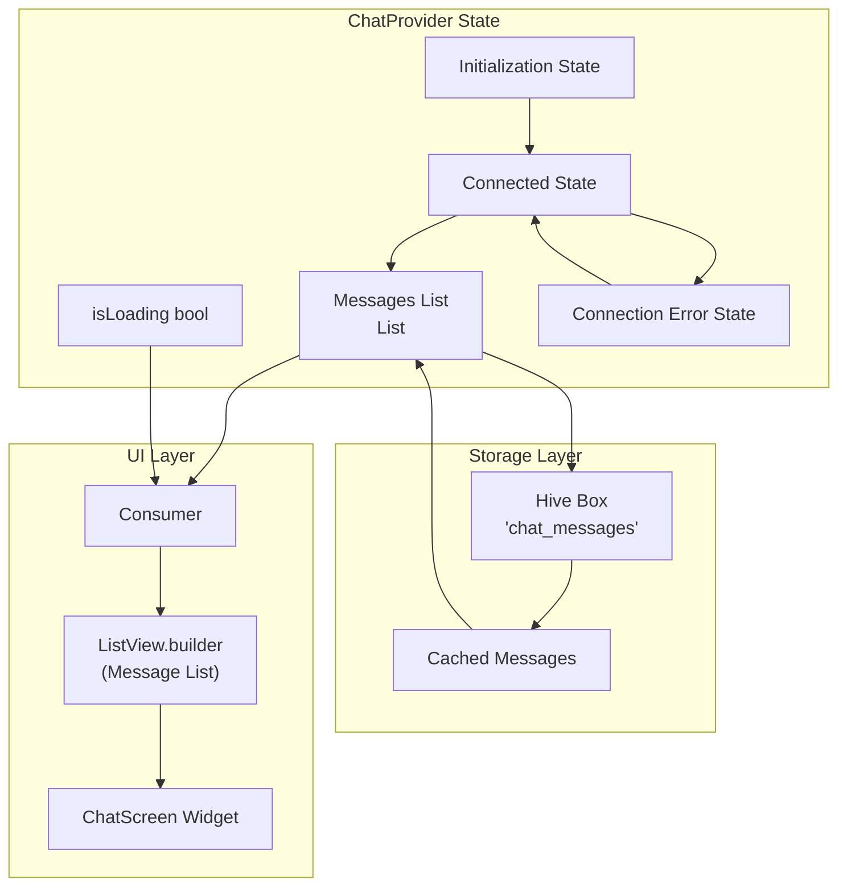
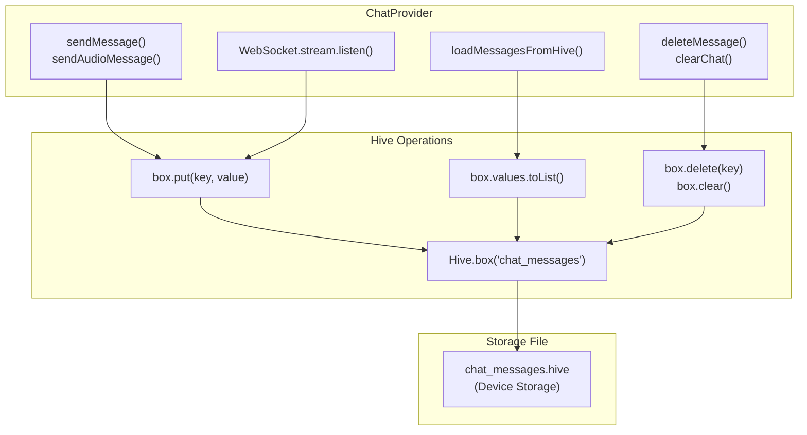
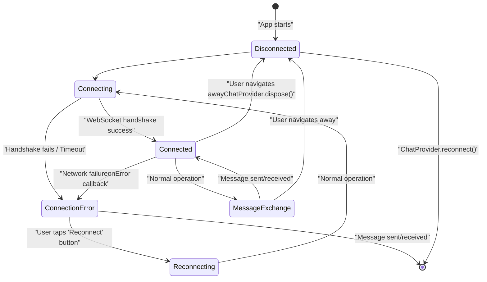
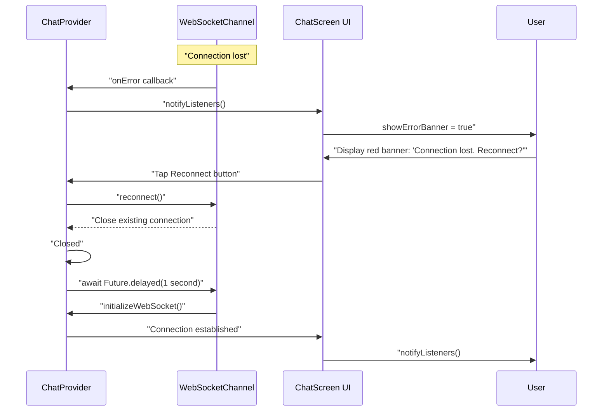
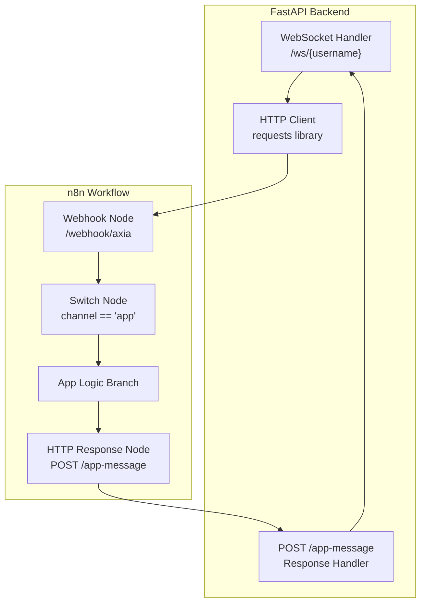

# Real-time Chat System

> **Relevant source files**
> * [ARCHITECTURE.md](https://github.com/axchisan/AxIA/blob/1fe26c44/ARCHITECTURE.md)
> * [CHANGELOG_MEJORAS_CHAT.md](https://github.com/axchisan/AxIA/blob/1fe26c44/CHANGELOG_MEJORAS_CHAT.md)

## Purpose and Scope

This document provides an overview of the real-time chat system in AxIA, which enables bidirectional communication between the Flutter mobile application and the AI backend. The chat system uses WebSocket connections for low-latency message delivery and supports both text and audio messages.

For detailed information about specific subsystems, see:

* WebSocket connection lifecycle and protocols: [WebSocket Communication](/axchisan/AxIA/5.1-websocket-communication)
* Message deletion, chat clearing, and local storage: [Message Management](/axchisan/AxIA/5.2-message-management)
* UI improvements and performance optimizations: [Chat UI Enhancements](/axchisan/AxIA/5.3-chat-ui-enhancements)
* Authentication mechanisms: [Authentication & Security](/axchisan/AxIA/4-authentication-and-security)
* Audio recording and playback features: [Audio System](/axchisan/AxIA/6-audio-system)

## System Overview

The real-time chat system connects users to the AxIA AI assistant through a persistent WebSocket connection. Messages flow from the Flutter app through a FastAPI backend, which forwards them to an n8n workflow for AI processing. Responses return through the same WebSocket channel, enabling real-time conversational interactions.

The system supports:

* Text messages with Markdown rendering
* Audio messages with Base64 encoding
* Message history with local caching
* Message deletion and chat clearing
* Offline message queue
* Automatic reconnection on failure

## Core Architecture



**Sources:** [ARCHITECTURE.md L1-L241](https://github.com/axchisan/AxIA/blob/1fe26c44/ARCHITECTURE.md#L1-L241)

 [CHANGELOG_MEJORAS_CHAT.md L1-L200](https://github.com/axchisan/AxIA/blob/1fe26c44/CHANGELOG_MEJORAS_CHAT.md#L1-L200)

## Message Flow Architecture

### Text Message Flow

```mermaid
sequenceDiagram
  participant User
  participant ChatScreen
  participant (chat_screen.dart)
  participant ChatProvider
  participant (chat_provider.dart)
  participant WebSocketChannel
  participant FastAPI
  participant /ws/{username}
  participant n8n Workflow
  participant /webhook/axia
  participant AI Model
  participant Hive Database

  User->>ChatScreen: "Type text in TextField"
  User->>ChatScreen: "Press send button"
  ChatScreen->>ChatProvider: "sendMessage(text)"
  ChatProvider->>Hive Database: "Save message locally"
  ChatProvider->>WebSocketChannel: "sink.add(jsonEncode({...}))"
  note over WebSocketChannel,/ws/{username}: "WebSocket payload:
  WebSocketChannel->>FastAPI: "WebSocket message"
  FastAPI->>n8n Workflow: "POST webhook/axia
  n8n Workflow->>AI Model: {channel: 'app', ...}"
  AI Model->>n8n Workflow: "Process text input"
  n8n Workflow->>FastAPI: "Generate text response"
  FastAPI->>WebSocketChannel: "POST /app-message
  WebSocketChannel->>ChatProvider: {output: '...', type: 'text'}"
  ChatProvider->>Hive Database: "WebSocket response"
  ChatProvider->>ChatScreen: "stream.listen callback"
  ChatScreen->>User: "Save response"
```

**Sources:** [ARCHITECTURE.md L37-L45](https://github.com/axchisan/AxIA/blob/1fe26c44/ARCHITECTURE.md#L37-L45)

 [ARCHITECTURE.md L99-L117](https://github.com/axchisan/AxIA/blob/1fe26c44/ARCHITECTURE.md#L99-L117)

### Audio Message Flow

```mermaid
sequenceDiagram
  participant User
  participant ChatScreen
  participant (chat_screen.dart)
  participant AudioService
  participant (audio_service.dart)
  participant ChatProvider
  participant (chat_provider.dart)
  participant WebSocketChannel
  participant FastAPI
  participant /ws/{username}
  participant n8n Workflow
  participant Whisper STT
  participant AI Model
  participant ElevenLabs TTS

  User->>ChatScreen: "Press & hold mic button"
  ChatScreen->>AudioService: "startRecording()"
  note over AudioService,(audio_service.dart): "AAC encoding
  User->>ChatScreen: "Release button"
  ChatScreen->>AudioService: "stopRecording()"
  AudioService->>AudioService: "Convert to Base64"
  AudioService-->>ChatScreen: "Return base64 string"
  ChatScreen->>ChatProvider: "sendAudioMessage(base64)"
  ChatProvider->>WebSocketChannel: "sink.add({type: 'audio', audio_base64: '...'})"
  WebSocketChannel->>FastAPI: "WebSocket message"
  FastAPI->>n8n Workflow: "POST webhook/axia"
  n8n Workflow->>Whisper STT: "Transcribe audio"
  Whisper STT->>n8n Workflow: "Text transcript"
  n8n Workflow->>AI Model: "Process transcript"
  AI Model->>n8n Workflow: "Generate response"
  n8n Workflow->>ElevenLabs TTS: "Convert to speech"
  ElevenLabs TTS->>n8n Workflow: "Audio binary"
  n8n Workflow->>n8n Workflow: "Convert to Base64"
  n8n Workflow->>FastAPI: "POST /app-message
  FastAPI->>WebSocketChannel: {audio_base64: '...', debe_ser_audio: true}"
  WebSocketChannel->>ChatProvider: "WebSocket response"
  ChatProvider->>AudioService: "stream.listen callback"
  AudioService->>User: "playAudio(base64)"
```

**Sources:** [ARCHITECTURE.md L46-L52](https://github.com/axchisan/AxIA/blob/1fe26c44/ARCHITECTURE.md#L46-L52)

 [CHANGELOG_MEJORAS_CHAT.md L7-L17](https://github.com/axchisan/AxIA/blob/1fe26c44/CHANGELOG_MEJORAS_CHAT.md#L7-L17)

 [CHANGELOG_MEJORAS_CHAT.md L145-L156](https://github.com/axchisan/AxIA/blob/1fe26c44/CHANGELOG_MEJORAS_CHAT.md#L145-L156)

## State Management

The chat system uses the Provider pattern for state management, with `ChatProvider` as the central state manager.

### ChatProvider Responsibilities

| Responsibility | Methods | Description |
| --- | --- | --- |
| **WebSocket Connection** | `initializeWebSocket()`, `reconnect()`, `dispose()` | Manages WebSocket lifecycle and connection state |
| **Message Transmission** | `sendMessage(text)`, `sendAudioMessage(base64)` | Sends text and audio messages through WebSocket |
| **Message Storage** | `_saveToHive()`, `loadMessagesFromHive()` | Persists messages locally using Hive database |
| **Message Management** | `deleteMessage(id)`, `clearChat()` | Handles message deletion and chat clearing |
| **State Notifications** | `notifyListeners()` | Updates UI when state changes |
| **Error Handling** | `onError`, `onDone` callbacks | Handles connection failures and reconnection |

### State Flow Diagram



**Sources:** [ARCHITECTURE.md L148-L189](https://github.com/axchisan/AxIA/blob/1fe26c44/ARCHITECTURE.md#L148-L189)

 [CHANGELOG_MEJORAS_CHAT.md L67-L78](https://github.com/axchisan/AxIA/blob/1fe26c44/CHANGELOG_MEJORAS_CHAT.md#L67-L78)

## WebSocket Protocol

The WebSocket connection is established at app startup when entering `ChatScreen` and uses JWT authentication.

### Connection Details

| Parameter | Value |
| --- | --- |
| **Endpoint** | `wss://apiaxia.axchisan.com/ws/{username}` |
| **Authentication** | JWT token in query parameter: `?token={JWT}` |
| **Protocol** | WebSocket Secure (WSS) |
| **Package** | `web_socket_channel` (Flutter) |
| **Connection Type** | Persistent, bidirectional |

### Message Payload Structure

#### Outgoing Message (Flutter → Backend)

```json
{
  "session_id": "uuid-string",
  "type": "text|audio",
  "text": "message content (for text messages)",
  "audio_base64": "base64-encoded-audio (for audio messages)",
  "timestamp": "2024-11-26T12:00:00Z",
  "user": "username"
}
```

#### Incoming Message (Backend → Flutter)

```
{
  "session_id": "uuid-string",
  "output": "response text or transcript",
  "type": "text|audio",
  "debe_ser_audio": true|false,
  "audio_base64": "base64-encoded-audio (if debe_ser_audio=true)",
  "audio_url": null,
  "timestamp": "2024-11-26T12:00:01Z"
}
```

**Sources:** [ARCHITECTURE.md L19-L33](https://github.com/axchisan/AxIA/blob/1fe26c44/ARCHITECTURE.md#L19-L33)

 [ARCHITECTURE.md L61-L65](https://github.com/axchisan/AxIA/blob/1fe26c44/ARCHITECTURE.md#L61-L65)

 [ARCHITECTURE.md L99-L117](https://github.com/axchisan/AxIA/blob/1fe26c44/ARCHITECTURE.md#L99-L117)

## Local Storage with Hive

The chat system uses Hive, a lightweight NoSQL database, for local message persistence.

### Storage Architecture



### Hive Box Operations

| Operation | Method | Purpose |
| --- | --- | --- |
| **Initialize** | `Hive.initFlutter()` | Initialize Hive with Flutter storage path |
| **Open Box** | `Hive.openBox('chat_messages')` | Open or create messages box |
| **Save Message** | `box.put(message.id, message.toJson())` | Persist message to disk |
| **Load Messages** | `box.values.map((e) => ChatMessage.fromJson(e))` | Restore messages on app start |
| **Delete Message** | `box.delete(messageId)` | Remove single message |
| **Clear All** | `box.clear()` | Remove all messages |

**Sources:** [ARCHITECTURE.md L238-L240](https://github.com/axchisan/AxIA/blob/1fe26c44/ARCHITECTURE.md#L238-L240)

 [CHANGELOG_MEJORAS_CHAT.md L33-L42](https://github.com/axchisan/AxIA/blob/1fe26c44/CHANGELOG_MEJORAS_CHAT.md#L33-L42)

## Key Code Entities

### Primary Files

| File Path | Primary Classes/Functions | Purpose |
| --- | --- | --- |
| `lib/screens/chat/chat_screen.dart` | `ChatScreen` widget | Main chat UI with message list, input field, and audio controls |
| `lib/providers/chat_provider.dart` | `ChatProvider` class | State management for chat messages and WebSocket connection |
| `lib/models/chat_message.dart` | `ChatMessage` model | Data structure for individual messages |
| `lib/services/audio_service.dart` | `AudioService` class | Audio recording and playback functionality |
| `lib/services/api_service.dart` | `ApiService` class | HTTP client with JWT authentication |
| `backend/main.py` | `/ws/{username}` endpoint | FastAPI WebSocket server |
| `backend/main.py` | `/app-message` endpoint | Receives responses from n8n |

### ChatMessage Model Structure

The `ChatMessage` model represents individual messages in the chat:

```python
class ChatMessage {
  String id;              // Unique identifier (UUID)
  String text;            // Message content or transcript
  bool isUser;            // true = user message, false = AI response
  DateTime timestamp;     // Message creation time
  String? audioBase64;    // Base64-encoded audio (optional)
  String? type;           // "text" or "audio"
  String? sessionId;      // Links messages to conversation session
}
```

**Sources:** [ARCHITECTURE.md L148-L189](https://github.com/axchisan/AxIA/blob/1fe26c44/ARCHITECTURE.md#L148-L189)

 [CHANGELOG_MEJORAS_CHAT.md L64-L89](https://github.com/axchisan/AxIA/blob/1fe26c44/CHANGELOG_MEJORAS_CHAT.md#L64-L89)

## Connection Lifecycle



### Connection States

| State | Indicator | User Action Available |
| --- | --- | --- |
| **Disconnected** | No connection banner | Navigate to ChatScreen to connect |
| **Connecting** | Loading indicator | Wait for connection |
| **Connected** | No indicator (normal operation) | Send messages, record audio |
| **MessageExchange** | Message bubbles appear | Continue conversation |
| **ConnectionError** | Red banner: "Connection lost" | Tap "Reconnect" button |
| **Reconnecting** | Loading indicator on banner | Wait for reconnection |

**Sources:** [ARCHITECTURE.md L131-L146](https://github.com/axchisan/AxIA/blob/1fe26c44/ARCHITECTURE.md#L131-L146)

## Error Handling and Recovery

### Error Types

| Error Type | Detection | Recovery Mechanism |
| --- | --- | --- |
| **WebSocket Disconnection** | `onError` callback fires | Display banner with "Reconnect" button |
| **Token Expiration** | 401 response from backend | Redirect to LoginScreen, clear token |
| **Network Timeout** | No response within timeout | Automatic retry with exponential backoff |
| **Message Send Failure** | WebSocket closed before send | Queue message, retry on reconnection |
| **Audio Encoding Error** | Exception in AudioService | Show error dialog, cancel recording |

### Reconnection Flow



**Sources:** [ARCHITECTURE.md L131-L146](https://github.com/axchisan/AxIA/blob/1fe26c44/ARCHITECTURE.md#L131-L146)

 [CHANGELOG_MEJORAS_CHAT.md L67-L78](https://github.com/axchisan/AxIA/blob/1fe26c44/CHANGELOG_MEJORAS_CHAT.md#L67-L78)

## Integration with n8n

The chat system communicates with n8n for AI processing through a webhook-based architecture.

### n8n Integration Points



### Webhook Payload Structure (FastAPI → n8n)

```json
{
  "channel": "app",
  "session_id": "uuid-string",
  "user": "username",
  "timestamp": "ISO-8601-timestamp",
  "type": "text|audio",
  "text": "message content (if text)",
  "audio_base64": "base64-string (if audio)",
  "remoteJid": "app:username@domain"
}
```

### Response Payload Structure (n8n → FastAPI)

```
{
  "username": "AxchiSan",
  "session_id": "uuid-string",
  "output": "AI response or transcript",
  "type": "text|audio",
  "debe_ser_audio": true|false,
  "audio_url": null,
  "audio_base64": "base64-string (if audio response)"
}
```

**Sources:** [ARCHITECTURE.md L91-L117](https://github.com/axchisan/AxIA/blob/1fe26c44/ARCHITECTURE.md#L91-L117)

 [CHANGELOG_MEJORAS_CHAT.md L126-L156](https://github.com/axchisan/AxIA/blob/1fe26c44/CHANGELOG_MEJORAS_CHAT.md#L126-L156)

## Performance Optimizations

The chat system includes several performance optimizations to ensure smooth operation:

### Optimization Summary

| Optimization | Implementation | Impact |
| --- | --- | --- |
| **Lazy Loading** | `ListView.builder` with itemBuilder | Only renders visible messages |
| **Simplified Animations** | Removed complex fade animations | Eliminates frame drops |
| **Jump vs Animate** | Changed `animateTo()` to `jumpTo()` | Instant scroll without lag |
| **Reduced Logging** | Removed debug print statements | Cleaner console, less overhead |
| **Singleton WebSocket** | Single persistent connection | Avoids reconnection overhead |
| **Local Caching** | Hive database for message history | Instant load on app restart |
| **Base64 Encoding** | Encode audio client-side | Reduces server processing time |

### Before and After Performance

| Metric | Before Optimization | After Optimization |
| --- | --- | --- |
| **Scroll Lag** | Noticeable lag with 50+ messages | Smooth scrolling |
| **Frame Drops** | 39+ frames during animations | <5 frames |
| **Console Saturation** | 100+ debug prints per message | Only critical logs |
| **Memory Usage** | All messages in memory | Only visible messages rendered |

**Sources:** [CHANGELOG_MEJORAS_CHAT.md L49-L63](https://github.com/axchisan/AxIA/blob/1fe26c44/CHANGELOG_MEJORAS_CHAT.md#L49-L63)

 [CHANGELOG_MEJORAS_CHAT.md L158-L169](https://github.com/axchisan/AxIA/blob/1fe26c44/CHANGELOG_MEJORAS_CHAT.md#L158-L169)

## Message Types and Rendering

The chat system supports two primary message types with different rendering strategies:

### Message Type Comparison

| Feature | Text Message | Audio Message |
| --- | --- | --- |
| **Input Method** | TextField typing | Microphone button (press & hold) |
| **Encoding** | Plain text (UTF-8) | AAC audio → Base64 |
| **Transmission Size** | 1-2 KB typical | 50-200 KB typical |
| **Server Processing** | Direct to AI model | Whisper transcription → AI |
| **Response Format** | Markdown text | Text + optional audio Base64 |
| **UI Rendering** | `flutter_markdown` widget | `just_audio` player widget |
| **Playback Controls** | N/A | Play/pause, seek, speed (0.5x-2x) |
| **Storage** | Text in Hive | Base64 string in Hive |

### Time Format Display

All messages display timestamps in 12-hour format with AM/PM:

```
// Example: 11:49 PM instead of 23:49
DateFormat('h:mm a').format(message.timestamp)
```

**Sources:** [CHANGELOG_MEJORAS_CHAT.md L19-L31](https://github.com/axchisan/AxIA/blob/1fe26c44/CHANGELOG_MEJORAS_CHAT.md#L19-L31)

 [CHANGELOG_MEJORAS_CHAT.md L43-L48](https://github.com/axchisan/AxIA/blob/1fe26c44/CHANGELOG_MEJORAS_CHAT.md#L43-L48)