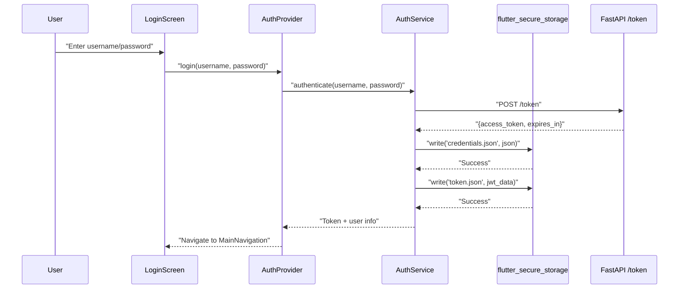
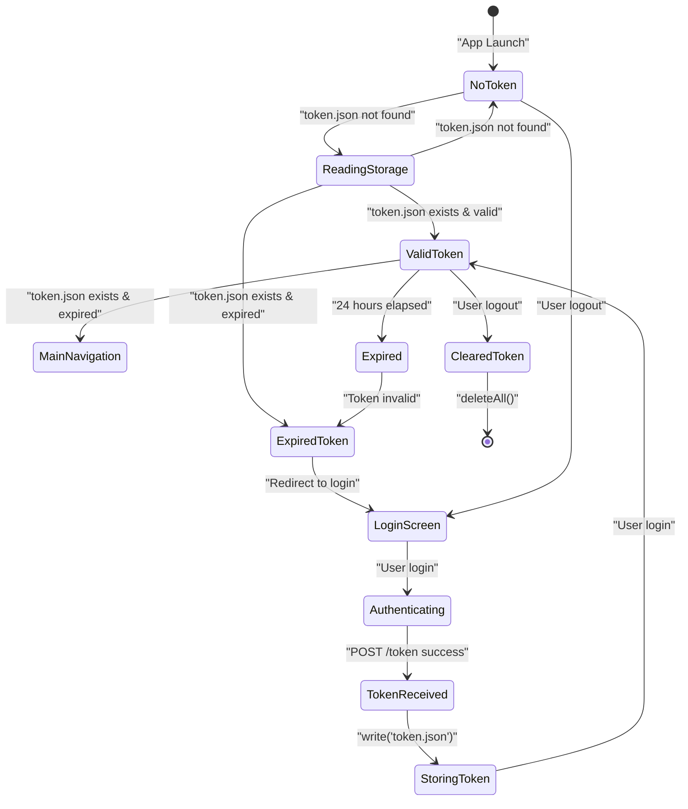
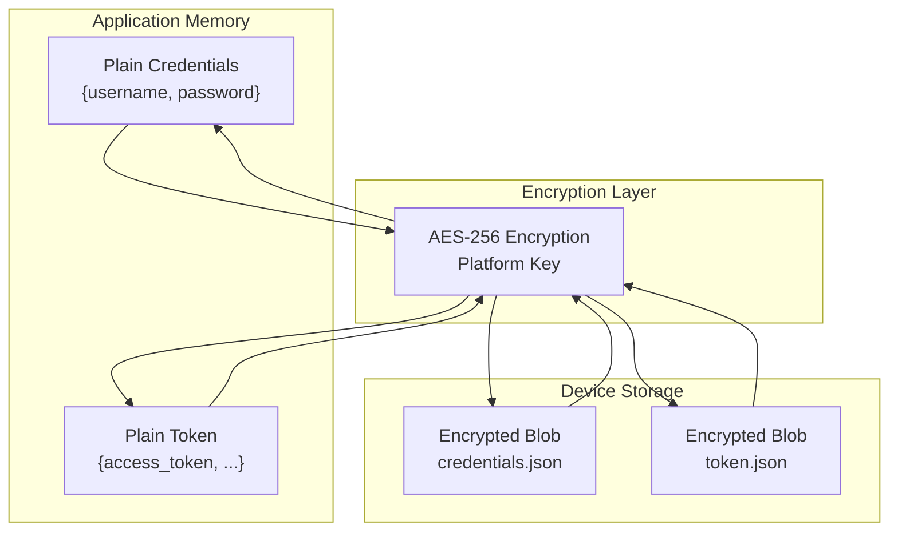
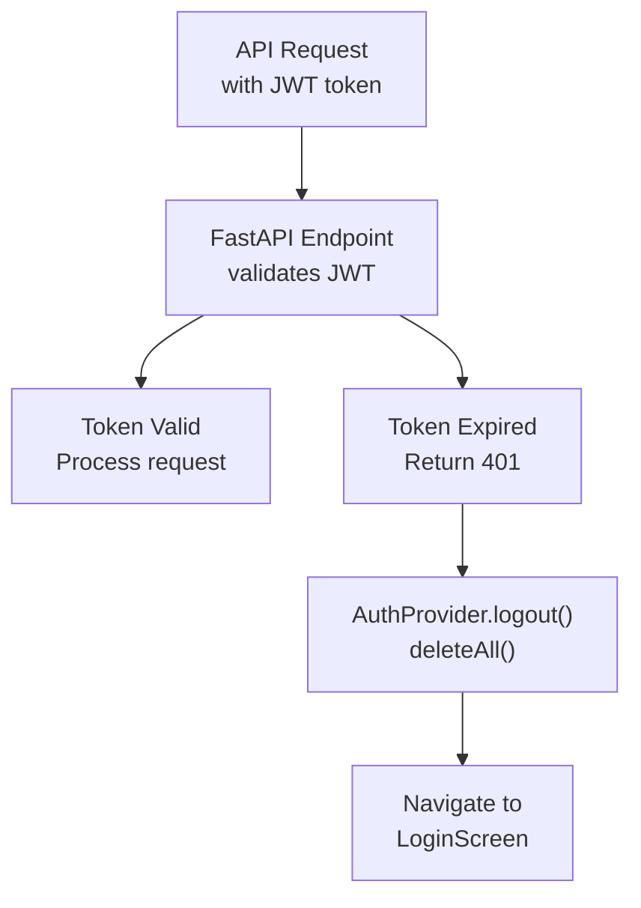

# Secure Credential Storage

> **Relevant source files**
> * [..bfg-report/2025-11-27/02-56-33/changed-files.txt](https://github.com/axchisan/AxIA/blob/1fe26c44/..bfg-report/2025-11-27/02-56-33/changed-files.txt)
> * [ARCHITECTURE.md](https://github.com/axchisan/AxIA/blob/1fe26c44/ARCHITECTURE.md)

## Purpose and Scope

This document details the secure credential storage system in AxIA, specifically how sensitive authentication data is protected using platform-specific secure storage mechanisms. It covers the implementation of `flutter_secure_storage`, the management of static credentials (`credentials.json`) and dynamic tokens (`token.json`), and platform-specific security features (iOS Keychain and Android Keystore).

For information about the JWT token authentication flow and lifecycle, see [JWT Token Flow](/axchisan/AxIA/4.1-jwt-token-flow).

**Sources:** [ARCHITECTURE.md L1-L241](https://github.com/axchisan/AxIA/blob/1fe26c44/ARCHITECTURE.md#L1-L241)

 [..bfg-report/2025-11-27/02-56-33/changed-files.txt L1-L3](https://github.com/axchisan/AxIA/blob/1fe26c44/..bfg-report/2025-11-27/02-56-33/changed-files.txt#L1-L3)

---

## System Overview

The AxIA application stores two types of sensitive data securely on the device:

| File | Purpose | Content Type | Update Frequency |
| --- | --- | --- | --- |
| `credentials.json` | Static authentication configuration | Username, password | Manual (user login) |
| `token.json` | Dynamic access tokens | JWT token, expiration, metadata | Automatic (every 24h) |

Both files are encrypted and stored using the `flutter_secure_storage` package, which provides platform-specific secure storage:

* **iOS**: Apple Keychain Services
* **Android**: Android Keystore System with AES encryption

**Sources:** [ARCHITECTURE.md L3-L15](https://github.com/axchisan/AxIA/blob/1fe26c44/ARCHITECTURE.md#L3-L15)

 [ARCHITECTURE.md L228-L234](https://github.com/axchisan/AxIA/blob/1fe26c44/ARCHITECTURE.md#L228-L234)

---

## Secure Storage Architecture

```

```

**Diagram: Secure Storage Layer Architecture**

**Sources:** [ARCHITECTURE.md L3-L15](https://github.com/axchisan/AxIA/blob/1fe26c44/ARCHITECTURE.md#L3-L15)

 [ARCHITECTURE.md L228-L234](https://github.com/axchisan/AxIA/blob/1fe26c44/ARCHITECTURE.md#L228-L234)

---

## flutter_secure_storage Package

The `flutter_secure_storage` package provides a unified API for secure credential storage across platforms. The package automatically selects the appropriate platform-specific implementation:

### Platform-Specific Implementations

**iOS - Keychain Services**

* Data stored in the system Keychain with `kSecAttrAccessible` set to `kSecAttrAccessibleWhenUnlocked`
* Provides hardware-backed encryption when available
* Automatically syncs with iCloud Keychain (can be disabled)
* Survives app uninstall (configurable)

**Android - Keystore System**

* Uses Android Keystore to generate and store AES-256 encryption keys
* Credentials encrypted with hardware-backed keys when available (TEE/Secure Element)
* Stored in encrypted SharedPreferences
* Automatically cleared on app uninstall

### Key Operations

The storage system supports four primary operations:

| Operation | Method | Description |
| --- | --- | --- |
| Write | `write(key, value)` | Encrypt and store credential |
| Read | `read(key)` | Decrypt and retrieve credential |
| Delete | `delete(key)` | Remove specific credential |
| Clear | `deleteAll()` | Remove all stored credentials |

**Sources:** [ARCHITECTURE.md L228-L234](https://github.com/axchisan/AxIA/blob/1fe26c44/ARCHITECTURE.md#L228-L234)

---

## credentials.json Management

The `credentials.json` file stores static authentication credentials entered by the user during login. This file is created only when the user explicitly logs in with username and password.

### Storage Format

```

```

### Lifecycle and Code Flow



**Diagram: credentials.json Creation Flow**

### Key Code Entities

* **AuthService**: Manages credential storage operations
* **AuthProvider**: Coordinates authentication state
* **LoginScreen**: User interface for credential entry
* **POST /token**: FastAPI endpoint that validates credentials

**Sources:** [ARCHITECTURE.md L3-L15](https://github.com/axchisan/AxIA/blob/1fe26c44/ARCHITECTURE.md#L3-L15)

 [ARCHITECTURE.md L119-L130](https://github.com/axchisan/AxIA/blob/1fe26c44/ARCHITECTURE.md#L119-L130)

 [ARCHITECTURE.md L56-L61](https://github.com/axchisan/AxIA/blob/1fe26c44/ARCHITECTURE.md#L56-L61)

---

## token.json Management

The `token.json` file stores the dynamic JWT access token obtained from the backend. Unlike `credentials.json`, this file is frequently updated as tokens expire and refresh.

### Storage Format

```

```

### Token Lifecycle



**Diagram: token.json State Machine**

### Token Validation Logic

The `AuthProvider.checkAuthentication()` method performs the following checks:

1. Read `token.json` from secure storage
2. Validate token exists and is not null
3. Check expiration time (tokens expire after 24 hours)
4. If valid, load user data and navigate to MainNavigation
5. If invalid/expired, clear storage and redirect to LoginScreen

**Sources:** [ARCHITECTURE.md L119-L130](https://github.com/axchisan/AxIA/blob/1fe26c44/ARCHITECTURE.md#L119-L130)

 [ARCHITECTURE.md L228-L234](https://github.com/axchisan/AxIA/blob/1fe26c44/ARCHITECTURE.md#L228-L234)

 [ARCHITECTURE.md L56-L61](https://github.com/axchisan/AxIA/blob/1fe26c44/ARCHITECTURE.md#L56-L61)

---

## Security Model

### Encryption at Rest

Both `credentials.json` and `token.json` are encrypted before storage:



**Diagram: Encryption Flow**

### Platform Security Features

**iOS Keychain Protection**

* Data Protection Class: `kSecAttrAccessibleWhenUnlocked`
* Credentials only accessible when device is unlocked
* Hardware-backed encryption on devices with Secure Enclave
* Biometric authentication can be enabled (Touch ID/Face ID)

**Android Keystore Protection**

* Hardware-backed keys on devices with TEE/Secure Element
* Keys never leave secure hardware
* User authentication required for key access (configurable)
* Keys invalidated on device root/unlock bootloader

### Token Expiration Strategy

The system uses a simple token expiration model without automatic refresh:

1. JWT tokens expire after 24 hours
2. On expiration, the user must re-authenticate
3. No refresh token mechanism (simpler security model)
4. Backend returns `401 Unauthorized` on expired token
5. Client clears storage and redirects to LoginScreen

**Sources:** [ARCHITECTURE.md L228-L234](https://github.com/axchisan/AxIA/blob/1fe26c44/ARCHITECTURE.md#L228-L234)

 [ARCHITECTURE.md L138-L145](https://github.com/axchisan/AxIA/blob/1fe26c44/ARCHITECTURE.md#L138-L145)

---

## Code Implementation Details

### AuthProvider Storage Operations

The `AuthProvider` class coordinates all secure storage operations through the `AuthService`:

**Key Methods:**

* `checkAuthentication()`: Read and validate token.json on app startup
* `login(username, password)`: Authenticate and store credentials + token
* `logout()`: Clear all secure storage and reset state
* `getToken()`: Read current JWT from token.json

### AuthService Implementation

The `AuthService` class provides low-level storage operations:

**Storage Keys:**

```

```

**Core Operations:**

* `saveCredentials()`: Serialize and encrypt credentials.json
* `loadCredentials()`: Decrypt and deserialize credentials.json
* `saveToken()`: Serialize and encrypt token.json
* `loadToken()`: Decrypt and deserialize token.json
* `clearAllData()`: Delete both credentials.json and token.json

### Integration with WebSocket Authentication

The stored JWT token is used for WebSocket authentication:

```
wss://apiaxia.axchisan.com/ws/{user}?token={JWT}
```

The token is retrieved from secure storage before establishing the WebSocket connection in `ChatProvider.initializeWebSocket()`.

**Sources:** [ARCHITECTURE.md L3-L15](https://github.com/axchisan/AxIA/blob/1fe26c44/ARCHITECTURE.md#L3-L15)

 [ARCHITECTURE.md L17-L33](https://github.com/axchisan/AxIA/blob/1fe26c44/ARCHITECTURE.md#L17-L33)

 [ARCHITECTURE.md L119-L130](https://github.com/axchisan/AxIA/blob/1fe26c44/ARCHITECTURE.md#L119-L130)

---

## Repository Security Remediation

### BFG Cleanup History

Both `credentials.json` and `token.json` were accidentally committed to the repository and subsequently removed using BFG Repo-Cleaner:

| File | Original Object ID | New Object ID | Status |
| --- | --- | --- | --- |
| credentials.json | `6a2a4236e08...` | `e53bdfd86d0...` | Removed from history |
| token.json | `5a24d0406f6...` | `05a4823f39b...` | Removed from history |

The cleanup affected 60 commits, rewriting Git history to eliminate all traces of these sensitive files.

### .gitignore Protection

Both files are now explicitly excluded in `.gitignore`:

```
credentials.json
token.json
*.env
```

This prevents future accidental commits of sensitive credential data.

**Sources:** [..bfg-report/2025-11-27/02-56-33/changed-files.txt L1-L3](https://github.com/axchisan/AxIA/blob/1fe26c44/..bfg-report/2025-11-27/02-56-33/changed-files.txt#L1-L3)

 [ARCHITECTURE.md L228-L234](https://github.com/axchisan/AxIA/blob/1fe26c44/ARCHITECTURE.md#L228-L234)

---

## Error Handling

### Storage Failure Scenarios

The system handles several failure modes gracefully:

| Scenario | Detection | Recovery |
| --- | --- | --- |
| Storage write failure | Exception during `write()` | Show error, retry login |
| Storage read failure | Exception during `read()` | Treat as "no credentials", redirect to login |
| Corrupted credential data | JSON parse error | Clear storage, redirect to login |
| Platform permission denied | Platform exception | Show error message, request permissions |
| Token expired | 401 from backend | Clear token, redirect to login |

### Code Flow for Token Expiration



**Diagram: Token Expiration Handling**

**Sources:** [ARCHITECTURE.md L138-L145](https://github.com/axchisan/AxIA/blob/1fe26c44/ARCHITECTURE.md#L138-L145)

---

## Best Practices

### Development Guidelines

1. **Never commit credentials to version control** * Use `.gitignore` to exclude `credentials.json` and `token.json` * Use environment variables for backend configuration
2. **Always validate tokens before use** * Check expiration time client-side before API calls * Handle 401 responses gracefully
3. **Clear storage on logout** * Call `deleteAll()` to remove both credentials and tokens * Reset all authentication state
4. **Test platform-specific behavior** * Verify Keychain access on iOS * Test Keystore encryption on various Android versions

### Security Checklist

* ✅ Credentials encrypted at rest using platform secure storage
* ✅ JWT tokens expire after 24 hours
* ✅ No credentials transmitted except during authentication
* ✅ WebSocket authenticated with token in query parameter
* ✅ Sensitive files removed from Git history
* ✅ `.gitignore` configured to prevent future commits
* ✅ Storage cleared on logout
* ✅ Failed authentication triggers storage cleanup

**Sources:** [ARCHITECTURE.md L228-L234](https://github.com/axchisan/AxIA/blob/1fe26c44/ARCHITECTURE.md#L228-L234)

 [ARCHITECTURE.md L138-L145](https://github.com/axchisan/AxIA/blob/1fe26c44/ARCHITECTURE.md#L138-L145)

---

## Related Components

This secure storage system integrates with several other AxIA components:

* **[JWT Token Flow](/axchisan/AxIA/4.1-jwt-token-flow)**: Describes the complete authentication lifecycle
* **[WebSocket Communication](/axchisan/AxIA/5.1-websocket-communication)**: Uses stored JWT for connection authentication
* **[Environment Setup](/axchisan/AxIA/2.2-environment-setup)**: Covers .gitignore configuration and secrets management
* **[BFG Repository Cleanup](/axchisan/AxIA/11.2-bfg-repository-cleanup)**: Documents the removal of committed credentials from Git history

**Sources:** [ARCHITECTURE.md L1-L241](https://github.com/axchisan/AxIA/blob/1fe26c44/ARCHITECTURE.md#L1-L241)