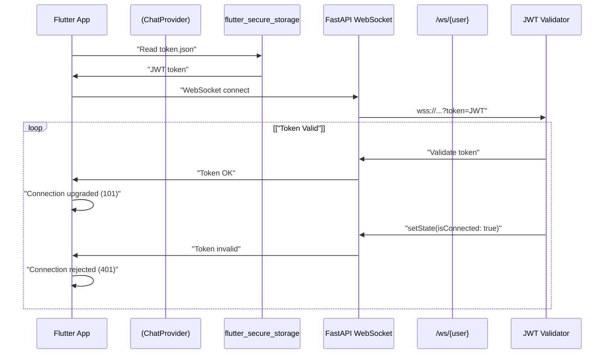
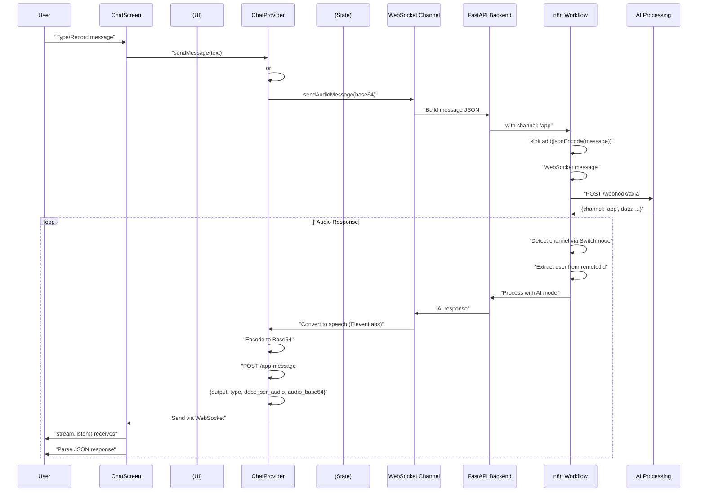
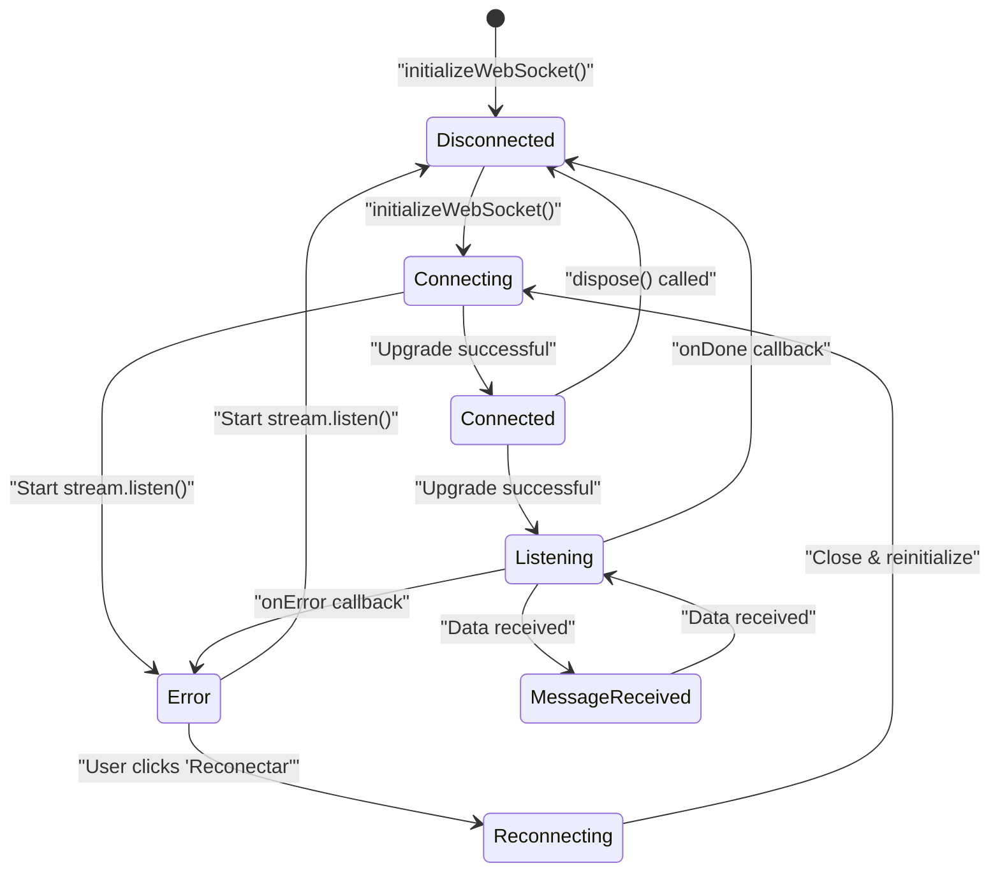
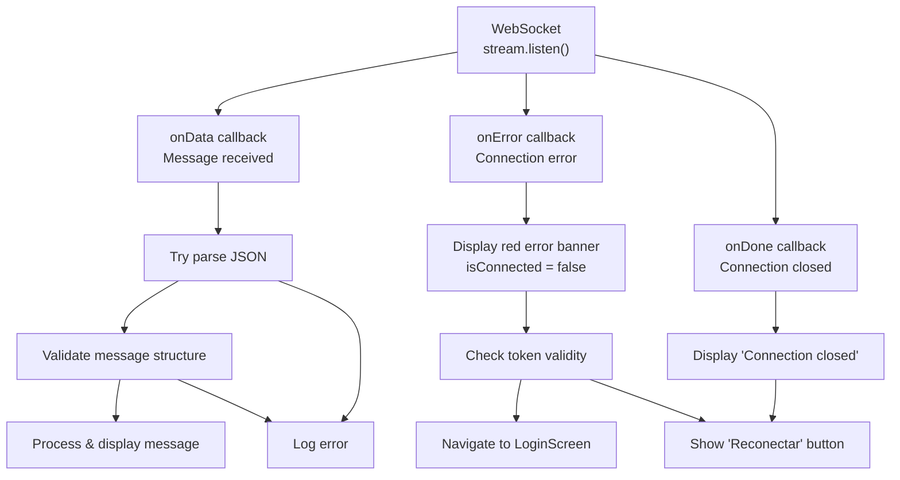

# WebSocket Protocol

> **Relevant source files**
> * [ARCHITECTURE.md](https://github.com/axchisan/AxIA/blob/1fe26c44/ARCHITECTURE.md)
> * [N8N_INTEGRATION_GUIDE.md](https://github.com/axchisan/AxIA/blob/1fe26c44/N8N_INTEGRATION_GUIDE.md)

## Purpose and Scope

This document specifies the WebSocket communication protocol used for real-time chat messaging between the Flutter client and FastAPI backend. It covers connection establishment, message formats, authentication, lifecycle management, and error handling.

For REST API endpoints, see [REST Endpoints](/axchisan/AxIA/8.1-rest-endpoints). For detailed message data structures and JSON schemas, see [Message Data Structures](/axchisan/AxIA/8.3-message-data-structures). For the overall real-time chat system architecture, see [Real-time Chat System](/axchisan/AxIA/5-real-time-chat-system).

---

## Connection Establishment

### WebSocket Endpoint

The WebSocket server is exposed at a single authenticated endpoint:

```
wss://apiaxia.axchisan.com/ws/{username}?token={jwt_token}
```

**Path Parameters:**

* `{username}`: The authenticated user's username (e.g., "duvan", "AxchiSan")

**Query Parameters:**

* `token`: JWT access token obtained from `POST /token` endpoint (see [JWT Token Flow](/axchisan/AxIA/4.1-jwt-token-flow))

**Example Connection URL:**

```yaml
wss://apiaxia.axchisan.com/ws/duvan?token=eyJhbGciOiJIUzI1NiIsInR5cCI6IkpXVCJ9...
```

Sources: [ARCHITECTURE.md L22](https://github.com/axchisan/AxIA/blob/1fe26c44/ARCHITECTURE.md#L22-L22)

 [N8N_INTEGRATION_GUIDE.md L30](https://github.com/axchisan/AxIA/blob/1fe26c44/N8N_INTEGRATION_GUIDE.md#L30-L30)

---

### Connection Sequence

**Diagram: WebSocket Connection Establishment**



Sources: [ARCHITECTURE.md L22-L33](https://github.com/axchisan/AxIA/blob/1fe26c44/ARCHITECTURE.md#L22-L33)

---

### Client Implementation

The WebSocket connection is managed by the `ChatProvider` class in the Flutter application:

* **Connection initialization**: [lib/providers/chat_provider.dart](https://github.com/axchisan/AxIA/blob/1fe26c44/lib/providers/chat_provider.dart)
* **Token retrieval**: Uses `flutter_secure_storage` to read JWT from `token.json`
* **WebSocket channel**: Created using `web_socket_channel` package
* **Connection URL**: Configured in [lib/config/api_config.dart](https://github.com/axchisan/AxIA/blob/1fe26c44/lib/config/api_config.dart)

The connection is established when the user navigates to the chat screen and remains active throughout the session.

Sources: [ARCHITECTURE.md L128-L129](https://github.com/axchisan/AxIA/blob/1fe26c44/ARCHITECTURE.md#L128-L129)

---

## Message Protocol

### Client-to-Server Messages

All messages sent from the Flutter client to the FastAPI backend follow this JSON structure:

**Text Message Format:**

```json
{
  "event": "messages.upsert",
  "instance": "AxIAPersonal",
  "channel": "app",
  "data": {
    "key": {
      "remoteJid": "app:AxchiSan@axia.app",
      "fromMe": false,
      "id": "1732659417635"
    },
    "pushName": "AxchiSan",
    "message": {
      "conversation": "que correos he recibido hoy"
    },
    "messageType": "conversation",
    "messageTimestamp": 1732659417,
    "source": "flutter_app"
  },
  "destination": "https://n8n.axchisan.com/webhook/...",
  "date_time": "2025-11-27T00:16:57.635730",
  "sender": "AxchiSan@axia.app"
}
```

**Audio Message Format:**

```json
{
  "event": "messages.upsert",
  "instance": "AxIAPersonal",
  "channel": "app",
  "data": {
    "key": {
      "remoteJid": "app:AxchiSan@axia.app",
      "fromMe": false,
      "id": "1732659500000"
    },
    "pushName": "AxchiSan",
    "message": {
      "base64": "BASE64_AUDIO_DATA_HERE"
    },
    "messageType": "audioMessage",
    "messageTimestamp": 1732659500,
    "source": "flutter_app"
  },
  "destination": "https://n8n.axchisan.com/webhook/...",
  "date_time": "2025-11-27T00:18:20.000000",
  "sender": "AxchiSan@axia.app"
}
```

Sources: [N8N_INTEGRATION_GUIDE.md L11-L61](https://github.com/axchisan/AxIA/blob/1fe26c44/N8N_INTEGRATION_GUIDE.md#L11-L61)

---

### Message Field Specifications

| Field | Type | Required | Description |
| --- | --- | --- | --- |
| `event` | string | Yes | Always `"messages.upsert"` for new messages |
| `instance` | string | Yes | Instance identifier, typically `"AxIAPersonal"` |
| `channel` | string | Yes | Always `"app"` for Flutter app messages |
| `data.key.remoteJid` | string | Yes | Format: `"app:{username}@axia.app"` |
| `data.key.fromMe` | boolean | Yes | Always `false` for user messages |
| `data.key.id` | string | Yes | Unix timestamp in milliseconds as string |
| `data.pushName` | string | Yes | Display name of the user |
| `data.message.conversation` | string | Conditional | Text content (for text messages) |
| `data.message.base64` | string | Conditional | Base64-encoded audio (for audio messages) |
| `data.messageType` | string | Yes | `"conversation"` or `"audioMessage"` |
| `data.messageTimestamp` | integer | Yes | Unix timestamp in seconds |
| `data.source` | string | Yes | Always `"flutter_app"` |
| `destination` | string | Yes | n8n webhook URL |
| `date_time` | string | Yes | ISO 8601 timestamp |
| `sender` | string | Yes | Format: `"{username}@axia.app"` |

Sources: [N8N_INTEGRATION_GUIDE.md L11-L61](https://github.com/axchisan/AxIA/blob/1fe26c44/N8N_INTEGRATION_GUIDE.md#L11-L61)

---

### Server-to-Client Messages

The FastAPI backend forwards responses from n8n back to the Flutter client via WebSocket:

**Response Format:**

```json
{
  "output": "Your AI response here",
  "type": "text",
  "debe_ser_audio": false,
  "audio_base64": null
}
```

**Audio Response Format:**

```json
{
  "output": "Text transcription of audio response",
  "type": "audio",
  "debe_ser_audio": true,
  "audio_base64": "BASE64_ENCODED_AUDIO_DATA"
}
```

| Field | Type | Description |
| --- | --- | --- |
| `output` | string | Text response or transcription |
| `type` | string | `"text"` or `"audio"` |
| `debe_ser_audio` | boolean | Whether client should auto-play audio |
| `audio_base64` | string | Base64-encoded audio data (null for text responses) |

Sources: [N8N_INTEGRATION_GUIDE.md L143-L162](https://github.com/axchisan/AxIA/blob/1fe26c44/N8N_INTEGRATION_GUIDE.md#L143-L162)

 [ARCHITECTURE.md L64](https://github.com/axchisan/AxIA/blob/1fe26c44/ARCHITECTURE.md#L64-L64)

---

### Message Flow Diagram

**Diagram: Complete Message Exchange**



Sources: [ARCHITECTURE.md L36-L53](https://github.com/axchisan/AxIA/blob/1fe26c44/ARCHITECTURE.md#L36-L53)

 [N8N_INTEGRATION_GUIDE.md L167-L174](https://github.com/axchisan/AxIA/blob/1fe26c44/N8N_INTEGRATION_GUIDE.md#L167-L174)

---

## Connection Lifecycle

### State Machine

**Diagram: WebSocket Connection State Machine**



Sources: [ARCHITECTURE.md L133-L146](https://github.com/axchisan/AxIA/blob/1fe26c44/ARCHITECTURE.md#L133-L146)

---

### Connection Management

**Initial Connection:**

* Triggered when `ChatScreen` widget initializes
* `ChatProvider.initializeWebSocket()` is called in `initState()`
* Connection persists until user navigates away or app is closed

**Heartbeat/Keepalive:**

* WebSocket protocol handles keepalive automatically
* No explicit ping/pong messages are sent by the application layer
* Connection is assumed alive until `onDone` or `onError` callbacks fire

**Disconnection Events:**

* User navigates away from `ChatScreen`: `dispose()` closes the WebSocket
* Network interruption: `onError` callback triggers error state
* Token expiration: Backend sends 401, triggers authentication flow
* Backend restart: Connection dropped, requires manual reconnection

**Reconnection Process:**

1. User sees red banner with "Reconectar" button
2. User clicks button
3. `ChatProvider.reconnect()` method executes: * Closes existing WebSocket channel * Clears error state * Calls `initializeWebSocket()` with fresh token
4. Connection re-established

Sources: [ARCHITECTURE.md L133-L146](https://github.com/axchisan/AxIA/blob/1fe26c44/ARCHITECTURE.md#L133-L146)

---

### Implementation References

| Component | Location | Purpose |
| --- | --- | --- |
| `ChatProvider` | [lib/providers/chat_provider.dart](https://github.com/axchisan/AxIA/blob/1fe26c44/lib/providers/chat_provider.dart) | Manages WebSocket connection state |
| `initializeWebSocket()` | [lib/providers/chat_provider.dart](https://github.com/axchisan/AxIA/blob/1fe26c44/lib/providers/chat_provider.dart) | Establishes connection with JWT token |
| `reconnect()` | [lib/providers/chat_provider.dart](https://github.com/axchisan/AxIA/blob/1fe26c44/lib/providers/chat_provider.dart) | Closes and reopens connection |
| `dispose()` | [lib/providers/chat_provider.dart](https://github.com/axchisan/AxIA/blob/1fe26c44/lib/providers/chat_provider.dart) | Cleans up connection on widget disposal |
| `stream.listen()` | [lib/providers/chat_provider.dart](https://github.com/axchisan/AxIA/blob/1fe26c44/lib/providers/chat_provider.dart) | Subscribes to incoming messages |
| Error banner UI | [lib/screens/chat/](https://github.com/axchisan/AxIA/blob/1fe26c44/lib/screens/chat/) | Displays connection status to user |

Sources: [ARCHITECTURE.md L128-L129](https://github.com/axchisan/AxIA/blob/1fe26c44/ARCHITECTURE.md#L128-L129)

---

## Error Handling

### Error Types

**Connection Errors:**

| Error | Cause | Client Behavior |
| --- | --- | --- |
| `WebSocketException` | Network unreachable | Display error banner, offer reconnect |
| `401 Unauthorized` | Invalid/expired JWT | Clear token, navigate to `LoginScreen` |
| `403 Forbidden` | User not authorized | Show error message, log out |
| `Connection timeout` | Backend unresponsive | Display timeout message, offer retry |
| `Connection closed` | Backend shutdown | Display disconnected banner |

**Message Errors:**

| Error | Cause | Client Behavior |
| --- | --- | --- |
| Invalid JSON | Malformed server response | Log error, ignore message |
| Missing required fields | Protocol mismatch | Log error, display generic error message |
| Unknown message type | Unsupported `type` field | Display as text fallback |

**Audio Errors:**

| Error | Cause | Client Behavior |
| --- | --- | --- |
| Base64 decode failure | Corrupted audio data | Show "Audio unavailable" message |
| Audio playback failure | Unsupported format | Display text fallback (`output` field) |

Sources: [ARCHITECTURE.md L131-L146](https://github.com/axchisan/AxIA/blob/1fe26c44/ARCHITECTURE.md#L131-L146)

---

### Error Callbacks

**Diagram: Error Handling Flow**



Sources: [ARCHITECTURE.md L133-L146](https://github.com/axchisan/AxIA/blob/1fe26c44/ARCHITECTURE.md#L133-L146)

---

## Channel Identification

The `channel` field in client messages is critical for n8n workflow routing:

**App vs. WhatsApp Differentiation:**

| Field | AxIA App | WhatsApp (Evolution API) |
| --- | --- | --- |
| `channel` | `"app"` | `undefined` |
| `data.key.remoteJid` | `"app:username@axia.app"` | `"573183038190:24@s.whatsapp.net"` |
| `data.source` | `"flutter_app"` | `"android"` |
| `sender` | `"username@axia.app"` | `"573173012598@s.whatsapp.net"` |

**n8n Switch Node Expression:**

The n8n workflow uses a Switch node to route messages based on the channel:

```
// Detect app channel
{{ $json.body.channel === 'app' }}

// Or check remoteJid prefix
{{ $json.body.data.key.remoteJid.startsWith('app:') }}
```

**User Extraction Logic:**

```javascript
// Extract username from remoteJid
{{ 
  (() => {
    const remoteJid = $('Webhook').item.json.body.data.key.remoteJid;
    const channel = $('Webhook').item.json.body.channel;
    
    // If from app
    if (channel === 'app' || remoteJid.startsWith('app:')) {
      return remoteJid.split(':')[1].split('@')[0];
    }
    
    // If from WhatsApp
    return remoteJid.split('@')[0].split(':')[0];
  })()
}}
```

Sources: [N8N_INTEGRATION_GUIDE.md L63-L138](https://github.com/axchisan/AxIA/blob/1fe26c44/N8N_INTEGRATION_GUIDE.md#L63-L138)

---

## Protocol Versioning

**Current Version:** The protocol is currently unversioned and follows the Evolution API message structure for compatibility with existing n8n workflows.

**Future Considerations:**

* Adding a `protocol_version` field to enable backward-compatible changes
* Deprecating Evolution API format in favor of a simpler app-specific protocol
* Implementing WebSocket subprotocol negotiation

Sources: [N8N_INTEGRATION_GUIDE.md L5-L61](https://github.com/axchisan/AxIA/blob/1fe26c44/N8N_INTEGRATION_GUIDE.md#L5-L61)

---

## Performance Characteristics

**Latency:**

* WebSocket eliminates HTTP polling overhead
* Typical round-trip time: < 500ms (app → backend → n8n → AI → backend → app)
* AI processing time dominates latency (2-5 seconds typical)

**Throughput:**

* Single persistent connection per user session
* No artificial rate limiting on message frequency
* Audio messages limited by encoding time (~1-2 seconds for 30-second recording)

**Connection Persistence:**

* Connection maintained for entire chat session
* No automatic reconnection on errors (user-initiated only)
* Memory footprint: ~1-2MB per active WebSocket connection

**Message Size Limits:**

* Text messages: No explicit limit (practical limit ~10KB)
* Audio messages: Base64-encoded AAC audio, typical size 100-500KB
* Backend may impose payload size limits (check FastAPI configuration)

Sources: [ARCHITECTURE.md L236-L241](https://github.com/axchisan/AxIA/blob/1fe26c44/ARCHITECTURE.md#L236-L241)

---

## Security Considerations

**Authentication:**

* JWT token passed as query parameter (WebSocket headers not universally supported)
* Token validated on initial connection only (not per-message)
* Token expiration (24h) handled by closing connection and requiring re-login

**Data Privacy:**

* All WebSocket traffic encrypted via WSS (TLS 1.2+)
* Messages not logged by FastAPI in production (check logging configuration)
* Credentials never transmitted over WebSocket (only during initial authentication)

**Message Integrity:**

* No message signing or MAC verification implemented
* Relies on TLS for tamper protection
* Message IDs generated client-side (timestamp-based, not cryptographically secure)

**Rate Limiting:**

* No application-level rate limiting currently implemented
* WebSocket connection limits depend on backend capacity
* Potential for DoS via message flooding (future enhancement needed)

Sources: [ARCHITECTURE.md L227-L234](https://github.com/axchisan/AxIA/blob/1fe26c44/ARCHITECTURE.md#L227-L234)

---

## Related Pages

* [WebSocket Communication](/axchisan/AxIA/5.1-websocket-communication) - Real-time chat implementation details
* [Message Data Structures](/axchisan/AxIA/8.3-message-data-structures) - Complete JSON schemas
* [n8n Workflow Engine](/axchisan/AxIA/3.3-n8n-workflow-engine) - Backend message processing
* [JWT Token Flow](/axchisan/AxIA/4.1-jwt-token-flow) - Authentication mechanism
* [Audio Backend Integration](/axchisan/AxIA/6.3-audio-backend-integration) - Base64 audio encoding