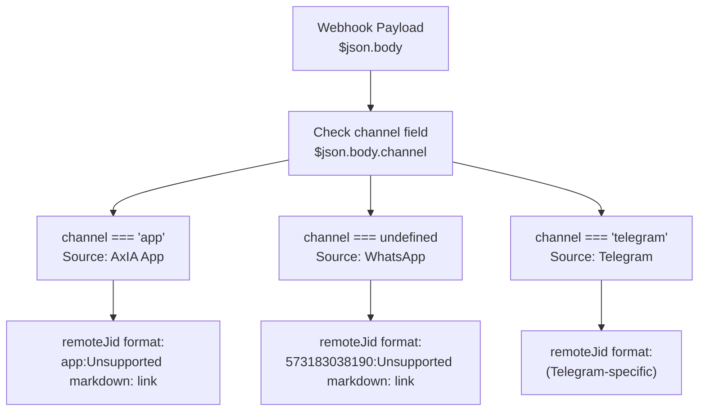
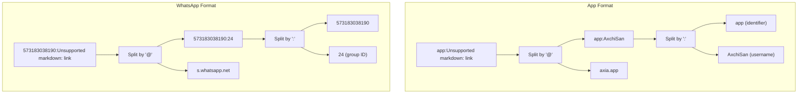
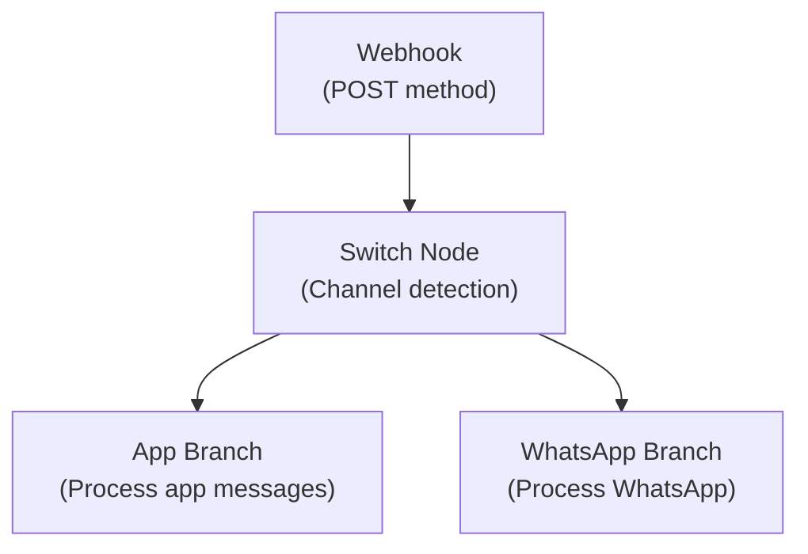

# Webhook Configuration

> **Relevant source files**
> * [AxIA.json](https://github.com/axchisan/AxIA/blob/1fe26c44/AxIA.json)
> * [N8N_INTEGRATION_GUIDE.md](https://github.com/axchisan/AxIA/blob/1fe26c44/N8N_INTEGRATION_GUIDE.md)

## Purpose

This page documents the n8n webhook configuration for receiving messages from multiple channels (AxIA App and WhatsApp). It covers the webhook endpoint structure, incoming message formats, and the channel detection mechanism that enables multi-source message routing.

For message routing logic and Switch node configuration, see [Message Routing](/axchisan/AxIA/7.2-message-routing). For AI processing and response formatting, see [Response Generation](/axchisan/AxIA/7.3-response-generation). For real-world payload examples, see [Webhook Event Examples](/axchisan/AxIA/7.4-webhook-event-examples).

---

## Webhook Endpoint

The n8n workflow receives all incoming messages through a single webhook endpoint with the following structure:

```yaml
https://n8n.axchisan.com/webhook/15f68f4b-70e3-48eb-ae7d-d36d0a630118
```

**Endpoint Components:**

* **Base URL:** `https://n8n.axchisan.com`
* **Path Prefix:** `/webhook/`
* **Workflow ID:** `15f68f4b-70e3-48eb-ae7d-d36d0a630118` (unique per n8n workflow)

This endpoint is configured in the backend and referenced in the Flutter app's API service for sending messages to n8n for AI processing.

Sources: [N8N_INTEGRATION_GUIDE.md L30-L31](https://github.com/axchisan/AxIA/blob/1fe26c44/N8N_INTEGRATION_GUIDE.md#L30-L31)

 [N8N_INTEGRATION_GUIDE.md L195](https://github.com/axchisan/AxIA/blob/1fe26c44/N8N_INTEGRATION_GUIDE.md#L195-L195)

---

## Message Flow Architecture

```

```

**Flow Description:**

1. AxIA App sends messages via WebSocket to FastAPI backend
2. Backend forwards to n8n webhook with `channel: "app"` field
3. WhatsApp messages arrive directly at n8n webhook from Evolution API
4. n8n webhook receives both sources at the same endpoint
5. Channel detection logic differentiates message sources

Sources: [N8N_INTEGRATION_GUIDE.md L1-L33](https://github.com/axchisan/AxIA/blob/1fe26c44/N8N_INTEGRATION_GUIDE.md#L1-L33)

 [AxIA.json L1-L223](https://github.com/axchisan/AxIA/blob/1fe26c44/AxIA.json#L1-L223)

---

## Incoming Message Format

### Text Message Structure

The webhook receives text messages in the following JSON structure:

```

```

**Field Mapping in n8n:**

* Access webhook body: `$json.body`
* Extract channel: `$json.body.channel`
* Extract message text: `$json.body.data.message.conversation`
* Extract sender ID: `$json.body.data.key.remoteJid`
* Extract timestamp: `$json.body.data.messageTimestamp`

Sources: [N8N_INTEGRATION_GUIDE.md L11-L34](https://github.com/axchisan/AxIA/blob/1fe26c44/N8N_INTEGRATION_GUIDE.md#L11-L34)

---

### Audio Message Structure

Audio messages use a similar structure with Base64-encoded audio data:

```

```

**Audio-Specific Fields:**

* Audio data: `$json.body.data.message.base64`
* Message type: `$json.body.data.messageType` = `"audioMessage"`
* Format: AAC/M4A encoded as Base64 string

Sources: [N8N_INTEGRATION_GUIDE.md L36-L61](https://github.com/axchisan/AxIA/blob/1fe26c44/N8N_INTEGRATION_GUIDE.md#L36-L61)

---

## Channel Detection Mechanism

The `channel` field is the primary mechanism for distinguishing message sources:



**Detection Logic in n8n:**

```

```

**Switch Node Configuration:**

* **Rule 1 (App):** `{{ $json.body.channel === 'app' }}`
* **Rule 2 (WhatsApp):** `{{ !$json.body.channel || $json.body.channel !== 'app' }}`

Sources: [N8N_INTEGRATION_GUIDE.md L76-L87](https://github.com/axchisan/AxIA/blob/1fe26c44/N8N_INTEGRATION_GUIDE.md#L76-L87)

 [N8N_INTEGRATION_GUIDE.md L176-L188](https://github.com/axchisan/AxIA/blob/1fe26c44/N8N_INTEGRATION_GUIDE.md#L176-L188)

---

## Message Source Comparison

| Field | WhatsApp (Evolution API) | AxIA App |
| --- | --- | --- |
| **channel** | Not present (undefined) | `"app"` |
| **data.key.remoteJid** | `573183038190:24@s.whatsapp.net` | `app:AxchiSan@axia.app` |
| **data.source** | `"android"` | `"flutter_app"` |
| **sender** | `573173012598@s.whatsapp.net` | `AxchiSan@axia.app"` |
| **event** | `"messages.upsert"` | `"messages.upsert"` |
| **instance** | `"AxIAPersonal"` | `"AxIAPersonal"` |

**RemoteJid Format Breakdown:**



Sources: [N8N_INTEGRATION_GUIDE.md L63-L71](https://github.com/axchisan/AxIA/blob/1fe26c44/N8N_INTEGRATION_GUIDE.md#L63-L71)

 [AxIA.json L47-L50](https://github.com/axchisan/AxIA/blob/1fe26c44/AxIA.json#L47-L50)

 [N8N_INTEGRATION_GUIDE.md L18-L19](https://github.com/axchisan/AxIA/blob/1fe26c44/N8N_INTEGRATION_GUIDE.md#L18-L19)

---

## User Extraction Logic

To extract the username/phone number from different `remoteJid` formats, use this n8n expression:

```

```

**Extraction Results:**

* **WhatsApp:** `573183038190:24@s.whatsapp.net` → `573183038190`
* **AxIA App:** `app:AxchiSan@axia.app` → `AxchiSan`

**User Verification Example:**

```

```

Sources: [N8N_INTEGRATION_GUIDE.md L88-L138](https://github.com/axchisan/AxIA/blob/1fe26c44/N8N_INTEGRATION_GUIDE.md#L88-L138)

---

## Webhook Headers

The webhook receives standard HTTP headers from the proxy or direct source:

### Headers from AxIA App (via FastAPI Proxy)

| Header | Value |
| --- | --- |
| **user-agent** | `axios/1.12.2` |
| **content-type** | `application/json` |
| **accept** | `application/json, text/plain, */*` |
| **accept-encoding** | `gzip, compress, deflate, br` |

### Headers from WhatsApp (via Evolution API)

| Header | Value |
| --- | --- |
| **host** | `n8n.axchisan.com` |
| **user-agent** | `axios/1.12.2` |
| **content-type** | `application/json` |
| **x-forwarded-for** | Client IP address |
| **x-forwarded-proto** | `https` |
| **x-real-ip** | Original client IP |

Sources: [AxIA.json L4-L29](https://github.com/axchisan/AxIA/blob/1fe26c44/AxIA.json#L4-L29)

---

## Message Type Detection

The `messageType` field indicates the content type:

| messageType | Description | Content Location |
| --- | --- | --- |
| **conversation** | Plain text message | `data.message.conversation` |
| **audioMessage** | Base64-encoded audio | `data.message.base64` |
| **extendedTextMessage** | Text with formatting/links | `data.message.extendedTextMessage` |

**n8n Expression for Message Type:**

```

```

**Content Extraction by Type:**

```

```

Sources: [N8N_INTEGRATION_GUIDE.md L24-L28](https://github.com/axchisan/AxIA/blob/1fe26c44/N8N_INTEGRATION_GUIDE.md#L24-L28)

 [N8N_INTEGRATION_GUIDE.md L51-L53](https://github.com/axchisan/AxIA/blob/1fe26c44/N8N_INTEGRATION_GUIDE.md#L51-L53)

 [AxIA.json L198-L199](https://github.com/axchisan/AxIA/blob/1fe26c44/AxIA.json#L198-L199)

---

## Required n8n Workflow Nodes



**Webhook Node Configuration:**

* **Method:** POST
* **Path:** `/webhook/15f68f4b-70e3-48eb-ae7d-d36d0a630118`
* **Response Mode:** Respond to webhook
* **Response Data:** JSON format (see [Response Generation](/axchisan/AxIA/7.3-response-generation))

**Switch Node Configuration:**

* **Mode:** Rules
* **Output Key:** `channel`
* **Rule 1:** `{{ $json.body.channel === 'app' }}` → Output 0 (App Branch)
* **Rule 2:** `{{ !$json.body.channel }}` → Output 1 (WhatsApp Branch)

Sources: [N8N_INTEGRATION_GUIDE.md L166-L174](https://github.com/axchisan/AxIA/blob/1fe26c44/N8N_INTEGRATION_GUIDE.md#L166-L174)

 [N8N_INTEGRATION_GUIDE.md L176-L188](https://github.com/axchisan/AxIA/blob/1fe26c44/N8N_INTEGRATION_GUIDE.md#L176-L188)

---

## Environment Variables

The webhook URL must be configured in the backend environment:

```

```

This variable is used by the FastAPI backend to forward messages from the AxIA app to n8n for AI processing.

Sources: [N8N_INTEGRATION_GUIDE.md L193-L197](https://github.com/axchisan/AxIA/blob/1fe26c44/N8N_INTEGRATION_GUIDE.md#L193-L197)

---

## Common Webhook Fields Reference

| Field Path | Type | Description | Example |
| --- | --- | --- | --- |
| `event` | string | Event type identifier | `"messages.upsert"` |
| `instance` | string | Bot instance name | `"AxIAPersonal"` |
| `channel` | string | Message source identifier | `"app"` or undefined |
| `data.key.remoteJid` | string | Sender unique identifier | `"app:user@axia.app"` |
| `data.key.fromMe` | boolean | Outgoing message flag | `false` |
| `data.key.id` | string | Message unique ID | `"1732659417635"` |
| `data.pushName` | string | Sender display name | `"AxchiSan"` |
| `data.messageType` | string | Content type | `"conversation"` or `"audioMessage"` |
| `data.messageTimestamp` | number | Unix timestamp | `1732659417` |
| `data.source` | string | Client platform | `"flutter_app"` or `"android"` |
| `destination` | string | Webhook URL | Full n8n webhook URL |
| `date_time` | string | ISO 8601 timestamp | `"2025-11-27T00:16:57.635730"` |
| `sender` | string | Sender identifier | `"AxchiSan@axia.app"` |

Sources: [N8N_INTEGRATION_GUIDE.md L11-L61](https://github.com/axchisan/AxIA/blob/1fe26c44/N8N_INTEGRATION_GUIDE.md#L11-L61)

 [AxIA.json L39-L206](https://github.com/axchisan/AxIA/blob/1fe26c44/AxIA.json#L39-L206)