# Webhook Event Examples

> **Relevant source files**
> * [AxIA.json](https://github.com/axchisan/AxIA/blob/1fe26c44/AxIA.json)
> * [N8N_INTEGRATION_GUIDE.md](https://github.com/axchisan/AxIA/blob/1fe26c44/N8N_INTEGRATION_GUIDE.md)

## Purpose and Scope

This page provides real-world examples of webhook payloads received by the n8n workflow from different message sources. These examples demonstrate the data structures, field formats, and distinguishing characteristics of messages originating from the AxIA mobile app, WhatsApp (via Evolution API), and other channels.

For configuration details about setting up the webhook endpoint, see [Webhook Configuration](/axchisan/AxIA/7.1-webhook-configuration). For information about how these messages are routed after reception, see [Message Routing](/axchisan/AxIA/7.2-message-routing). For details on how responses are generated and returned, see [Response Generation](/axchisan/AxIA/7.3-response-generation).

---

## WhatsApp Message Example

The following example shows a real webhook event received from Evolution API when a user sends a WhatsApp message. This payload structure represents the standard format for WhatsApp messages.

### Complete WhatsApp Payload

```go
{
  "headers": {
    "host": "n8n.axchisan.com",
    "user-agent": "axios/1.12.2",
    "content-length": "1396",
    "accept": "application/json, text/plain, */*",
    "accept-encoding": "gzip, compress, deflate, br",
    "content-type": "application/json",
    "x-forwarded-for": "10.0.1.1",
    "x-forwarded-host": "n8n.axchisan.com",
    "x-forwarded-port": "443",
    "x-forwarded-proto": "https"
  },
  "params": {},
  "query": {},
  "body": {
    "event": "messages.upsert",
    "instance": "AxIAPersonal",
    "data": {
      "key": {
        "remoteJid": "573183038190:24@s.whatsapp.net",
        "fromMe": false,
        "id": "ACB8005DDE470045C26153EF2C7B125D"
      },
      "pushName": "Axchi Software Dev👁️‍🗨️∆",
      "status": "DELIVERY_ACK",
      "message": {
        "conversation": "Que tengo para mi agenda de mañana"
      },
      "messageType": "conversation",
      "messageTimestamp": 1764199880,
      "instanceId": "a0affeb9-d2e6-41db-b035-d6607cd46e4d",
      "source": "android"
    },
    "destination": "https://n8n.axchisan.com/webhook/15f68f4b-70e3-48eb-ae7d-d36d0a630118",
    "date_time": "2025-11-26T20:31:21.058Z",
    "sender": "573173012598@s.whatsapp.net",
    "server_url": "https://evolutionapi.axchisan.com",
    "apikey": "8C068058972F-4C8A-9613-D0E844911491"
  },
  "webhookUrl": "https://n8n.axchisan.com/webhook/15f68f4b-70e3-48eb-ae7d-d36d0a630118",
  "executionMode": "production"
}
```

### WhatsApp Payload Structure Diagram

```mermaid
flowchart TD

ROOT["Webhook Root"]
HEADERS["headers"]
BODY["body"]
EVENT["event: 'messages.upsert'"]
INSTANCE["instance: 'AxIAPersonal'"]
CHANNEL_MISSING["channel: undefined"]
DATA["data"]
KEY["key"]
REMOTEJID["remoteJid: '573183038190:Unsupported markdown: link'"]
FROMME["fromMe: false"]
MSGID["id: 'ACB8005DDE470045C26153EF2C7B125D'"]
PUSHNAME["pushName: 'Axchi Software Dev👁️‍🗨️∆'"]
MESSAGE["message"]
CONVERSATION["conversation: 'Que tengo para mi agenda de mañana'"]
MSGTYPE["messageType: 'conversation'"]
TIMESTAMP["messageTimestamp: 1764199880"]
SOURCE["source: 'android'"]
SENDER["sender: 'Unsupported markdown: link'"]
DESTINATION["destination: 'Unsupported markdown: link...'"]

ROOT --> HEADERS
ROOT --> BODY
BODY --> EVENT
BODY --> INSTANCE
BODY --> CHANNEL_MISSING
BODY --> DATA
BODY --> SENDER
BODY --> DESTINATION
DATA --> KEY
DATA --> PUSHNAME
DATA --> MESSAGE
DATA --> MSGTYPE
DATA --> TIMESTAMP
DATA --> SOURCE
KEY --> REMOTEJID
KEY --> FROMME
KEY --> MSGID
MESSAGE --> CONVERSATION
```



**Sources:** [AxIA.json L1-L224](https://github.com/axchisan/AxIA/blob/1fe26c44/AxIA.json#L1-L224)

### Key WhatsApp Fields

| Field | Value | Description |
| --- | --- | --- |
| `body.event` | `"messages.upsert"` | Event type indicating a new message |
| `body.instance` | `"AxIAPersonal"` | Evolution API instance name |
| `body.channel` | **undefined** | No channel field - identifies WhatsApp messages |
| `body.data.key.remoteJid` | `"573183038190:24@s.whatsapp.net"` | WhatsApp format: `phone:groupId@s.whatsapp.net` |
| `body.data.source` | `"android"` | Platform where message originated |
| `body.data.messageType` | `"conversation"` | Type of WhatsApp message |
| `body.sender` | `"573173012598@s.whatsapp.net"` | WhatsApp sender identifier |

**Sources:** [AxIA.json L39-L206](https://github.com/axchisan/AxIA/blob/1fe26c44/AxIA.json#L39-L206)

 [N8N_INTEGRATION_GUIDE.md L63-L70](https://github.com/axchisan/AxIA/blob/1fe26c44/N8N_INTEGRATION_GUIDE.md#L63-L70)

---

## AxIA App Message Examples

Messages from the AxIA mobile app use a similar structure but include distinguishing fields to differentiate them from WhatsApp messages.

### App Text Message

```json
{
  "event": "messages.upsert",
  "instance": "AxIAPersonal",
  "channel": "app",
  "data": {
    "key": {
      "remoteJid": "app:AxchiSan@axia.app",
      "fromMe": false,
      "id": "1732659417635"
    },
    "pushName": "AxchiSan",
    "message": {
      "conversation": "que correos he recibido hoy"
    },
    "messageType": "conversation",
    "messageTimestamp": 1732659417,
    "source": "flutter_app"
  },
  "destination": "https://n8n.axchisan.com/webhook/15f68f4b-70e3-48eb-ae7d-d36d0a630118",
  "date_time": "2025-11-27T00:16:57.635730",
  "sender": "AxchiSan@axia.app"
}
```

**Sources:** [N8N_INTEGRATION_GUIDE.md L11-L34](https://github.com/axchisan/AxIA/blob/1fe26c44/N8N_INTEGRATION_GUIDE.md#L11-L34)

### App Audio Message

```json
{
  "event": "messages.upsert",
  "instance": "AxIAPersonal",
  "channel": "app",
  "data": {
    "key": {
      "remoteJid": "app:AxchiSan@axia.app",
      "fromMe": false,
      "id": "1732659500000"
    },
    "pushName": "AxchiSan",
    "message": {
      "base64": "BASE64_AUDIO_DATA_HERE"
    },
    "messageType": "audioMessage",
    "messageTimestamp": 1732659500,
    "source": "flutter_app"
  },
  "destination": "https://n8n.axchisan.com/webhook/15f68f4b-70e3-48eb-ae7d-d36d0a630118",
  "date_time": "2025-11-27T00:18:20.000000",
  "sender": "AxchiSan@axia.app"
}
```

**Sources:** [N8N_INTEGRATION_GUIDE.md L38-L61](https://github.com/axchisan/AxIA/blob/1fe26c44/N8N_INTEGRATION_GUIDE.md#L38-L61)

---

## Channel Comparison

The following table highlights the key differences between WhatsApp and AxIA App message formats. These differences are used by the n8n Switch node for routing decisions.

| Field | WhatsApp Value | AxIA App Value | Detection Logic |
| --- | --- | --- | --- |
| `channel` | **undefined** (field absent) | `"app"` | Presence check: `{{ $json.body.channel }}` |
| `data.key.remoteJid` | `"573183038190:24@s.whatsapp.net"` | `"app:AxchiSan@axia.app"` | Prefix check: `remoteJid.startsWith('app:')` |
| `data.source` | `"android"` or `"ios"` | `"flutter_app"` | Value check for additional validation |
| `sender` | `"573173012598@s.whatsapp.net"` | `"AxchiSan@axia.app"` | Domain check: contains `@axia.app` |

**Sources:** [N8N_INTEGRATION_GUIDE.md L63-L70](https://github.com/axchisan/AxIA/blob/1fe26c44/N8N_INTEGRATION_GUIDE.md#L63-L70)

### Channel Detection Flow


**Sources:** [N8N_INTEGRATION_GUIDE.md L73-L116](https://github.com/axchisan/AxIA/blob/1fe26c44/N8N_INTEGRATION_GUIDE.md#L73-L116)

---

## Message Type Variations

### Text Message Structure

Both WhatsApp and AxIA App use the same structure for text messages:

```json
{
  "message": {
    "conversation": "text content here"
  },
  "messageType": "conversation"
}
```

**Sources:** [AxIA.json L60-L63](https://github.com/axchisan/AxIA/blob/1fe26c44/AxIA.json#L60-L63)

 [N8N_INTEGRATION_GUIDE.md L23-L25](https://github.com/axchisan/AxIA/blob/1fe26c44/N8N_INTEGRATION_GUIDE.md#L23-L25)

### Audio Message Structure

Audio messages differ in their `message` object structure:

**AxIA App Audio:**

```json
{
  "message": {
    "base64": "BASE64_ENCODED_AUDIO_DATA"
  },
  "messageType": "audioMessage"
}
```

**WhatsApp Audio** (typical structure):

```json
{
  "message": {
    "audioMessage": {
      "url": "https://...",
      "mimetype": "audio/ogg; codecs=opus",
      "fileLength": 12345
    }
  },
  "messageType": "audioMessage"
}
```

**Sources:** [N8N_INTEGRATION_GUIDE.md L50-L52](https://github.com/axchisan/AxIA/blob/1fe26c44/N8N_INTEGRATION_GUIDE.md#L50-L52)

---

## Parsing User Identity

Extracting the user identifier requires different logic depending on the message source.

### RemoteJid Format Comparison


**Sources:** [N8N_INTEGRATION_GUIDE.md L88-L138](https://github.com/axchisan/AxIA/blob/1fe26c44/N8N_INTEGRATION_GUIDE.md#L88-L138)

### n8n Expression for User Extraction

The following n8n expression handles both formats:

```javascript
{{
  $if($('Webhook').isExecuted, 
    (() => {
      const remoteJid = $('Webhook').item.json.body.data.key.remoteJid;
      const channel = $('Webhook').item.json.body.channel;
      
      // App format: app:AxchiSan@axia.app
      if (channel === 'app' || remoteJid.startsWith('app:')) {
        return remoteJid.split(':')[1].split('@')[0];
      }
      
      // WhatsApp format: 573183038190:24@s.whatsapp.net
      return remoteJid.split('@')[0].split(':')[0];
    })(), 
    ''
  )
}}
```

**Sources:** [N8N_INTEGRATION_GUIDE.md L98-L116](https://github.com/axchisan/AxIA/blob/1fe26c44/N8N_INTEGRATION_GUIDE.md#L98-L116)

---

## Field-by-Field Breakdown

### Common Fields (Present in All Messages)

| Field Path | Type | Description | Example Value |
| --- | --- | --- | --- |
| `body.event` | string | Event type from Evolution API | `"messages.upsert"` |
| `body.instance` | string | Evolution API instance identifier | `"AxIAPersonal"` |
| `body.data.key.remoteJid` | string | Unique identifier for conversation | See format comparison above |
| `body.data.key.fromMe` | boolean | Whether message sent by bot | `false` |
| `body.data.key.id` | string | Unique message identifier | `"ACB8005DDE470045C26153EF2C7B125D"` |
| `body.data.pushName` | string | Display name of sender | `"AxchiSan"` |
| `body.data.messageTimestamp` | integer | Unix timestamp in seconds | `1732659417` |
| `body.destination` | string | Webhook URL | `"https://n8n.axchisan.com/webhook/..."` |

**Sources:** [AxIA.json L39-L217](https://github.com/axchisan/AxIA/blob/1fe26c44/AxIA.json#L39-L217)

 [N8N_INTEGRATION_GUIDE.md L16-L32](https://github.com/axchisan/AxIA/blob/1fe26c44/N8N_INTEGRATION_GUIDE.md#L16-L32)

### Channel-Specific Fields

| Field Path | WhatsApp | AxIA App | Notes |
| --- | --- | --- | --- |
| `body.channel` | **undefined** | `"app"` | Primary differentiator |
| `body.data.source` | `"android"` | `"flutter_app"` | Platform identifier |
| `body.data.status` | `"DELIVERY_ACK"` | **undefined** | WhatsApp delivery status |
| `body.data.instanceId` | UUID string | **undefined** | Evolution API instance UUID |
| `body.sender` | WhatsApp JID | Simple email format | Sender identifier |
| `body.server_url` | Evolution API URL | **undefined** | WhatsApp server reference |
| `body.apikey` | API key string | **undefined** | Evolution API authentication |

**Sources:** [AxIA.json L42-L217](https://github.com/axchisan/AxIA/blob/1fe26c44/AxIA.json#L42-L217)

 [N8N_INTEGRATION_GUIDE.md L16-L32](https://github.com/axchisan/AxIA/blob/1fe26c44/N8N_INTEGRATION_GUIDE.md#L16-L32)

---

## Message Content Access Patterns

### Accessing Text Content

For both WhatsApp and AxIA App text messages:

```
// n8n expression
{{ $json.body.data.message.conversation }}
```

**Sources:** [AxIA.json L62-L63](https://github.com/axchisan/AxIA/blob/1fe26c44/AxIA.json#L62-L63)

 [N8N_INTEGRATION_GUIDE.md L24](https://github.com/axchisan/AxIA/blob/1fe26c44/N8N_INTEGRATION_GUIDE.md#L24-L24)

### Accessing Audio Content

For AxIA App audio messages:

```
// n8n expression for Base64 audio
{{ $json.body.data.message.base64 }}
```

For WhatsApp audio messages:

```
// n8n expression for audio URL
{{ $json.body.data.message.audioMessage.url }}
```

**Sources:** [N8N_INTEGRATION_GUIDE.md L51](https://github.com/axchisan/AxIA/blob/1fe26c44/N8N_INTEGRATION_GUIDE.md#L51-L51)

---

## Complete Message Flow Example

The following diagram shows how a specific webhook payload flows through the n8n system:


**Sources:** [N8N_INTEGRATION_GUIDE.md L8-L61](https://github.com/axchisan/AxIA/blob/1fe26c44/N8N_INTEGRATION_GUIDE.md#L8-L61)

 [N8N_INTEGRATION_GUIDE.md L166-L174](https://github.com/axchisan/AxIA/blob/1fe26c44/N8N_INTEGRATION_GUIDE.md#L166-L174)

---

## Testing Payloads

When testing webhook integration, you can use these example payloads with tools like `curl` or Postman.

### Minimal AxIA App Test Payload

```json
{
  "event": "messages.upsert",
  "instance": "AxIAPersonal",
  "channel": "app",
  "data": {
    "key": {
      "remoteJid": "app:testuser@axia.app",
      "fromMe": false,
      "id": "1234567890"
    },
    "pushName": "Test User",
    "message": {
      "conversation": "Hello world"
    },
    "messageType": "conversation",
    "messageTimestamp": 1732659417,
    "source": "flutter_app"
  },
  "destination": "https://n8n.axchisan.com/webhook/YOUR-WEBHOOK-ID",
  "sender": "testuser@axia.app"
}
```

### Minimal WhatsApp Test Payload

```python
{
  "event": "messages.upsert",
  "instance": "AxIAPersonal",
  "data": {
    "key": {
      "remoteJid": "5491112345678@s.whatsapp.net",
      "fromMe": false,
      "id": "ABCD1234"
    },
    "pushName": "Test WhatsApp User",
    "message": {
      "conversation": "Hello from WhatsApp"
    },
    "messageType": "conversation",
    "messageTimestamp": 1764199880,
    "source": "android"
  },
  "destination": "https://n8n.axchisan.com/webhook/YOUR-WEBHOOK-ID",
  "sender": "5491112345678@s.whatsapp.net"
}
```

**Sources:** [N8N_INTEGRATION_GUIDE.md L11-L61](https://github.com/axchisan/AxIA/blob/1fe26c44/N8N_INTEGRATION_GUIDE.md#L11-L61)

 [AxIA.json L38-L218](https://github.com/axchisan/AxIA/blob/1fe26c44/AxIA.json#L38-L218)

---

## Webhook Headers

Evolution API includes standard HTTP headers with every webhook request:

| Header | Example Value | Purpose |
| --- | --- | --- |
| `host` | `"n8n.axchisan.com"` | Target webhook host |
| `user-agent` | `"axios/1.12.2"` | HTTP client identifier |
| `content-type` | `"application/json"` | Payload format |
| `content-length` | `"1396"` | Payload size in bytes |
| `accept-encoding` | `"gzip, compress, deflate, br"` | Supported compression |
| `x-forwarded-for` | `"10.0.1.1"` | Original client IP (if proxied) |
| `x-forwarded-proto` | `"https"` | Original protocol (if proxied) |

**Sources:** [AxIA.json L4-L29](https://github.com/axchisan/AxIA/blob/1fe26c44/AxIA.json#L4-L29)

---

## Summary

This page documented the three primary webhook payload formats:

1. **WhatsApp Messages**: Identified by absence of `channel` field and `remoteJid` format `phone:groupId@s.whatsapp.net`
2. **AxIA App Text Messages**: Identified by `channel: "app"` and `remoteJid` format `app:username@axia.app`
3. **AxIA App Audio Messages**: Same structure as text but with `message.base64` field and `messageType: "audioMessage"`

The key differentiators are the `channel` field, `remoteJid` prefix, and `source` field. These are used by the n8n Switch node to route messages to appropriate processing branches.

**Sources:** [AxIA.json L1-L224](https://github.com/axchisan/AxIA/blob/1fe26c44/AxIA.json#L1-L224)

 [N8N_INTEGRATION_GUIDE.md L1-L256](https://github.com/axchisan/AxIA/blob/1fe26c44/N8N_INTEGRATION_GUIDE.md#L1-L256)