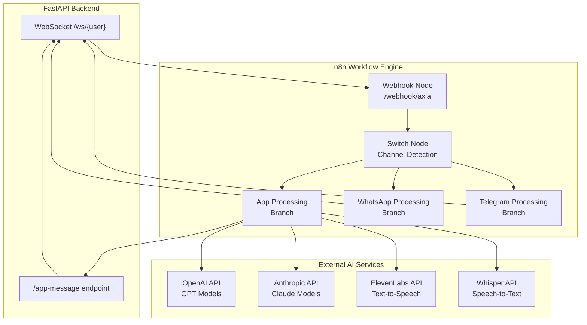
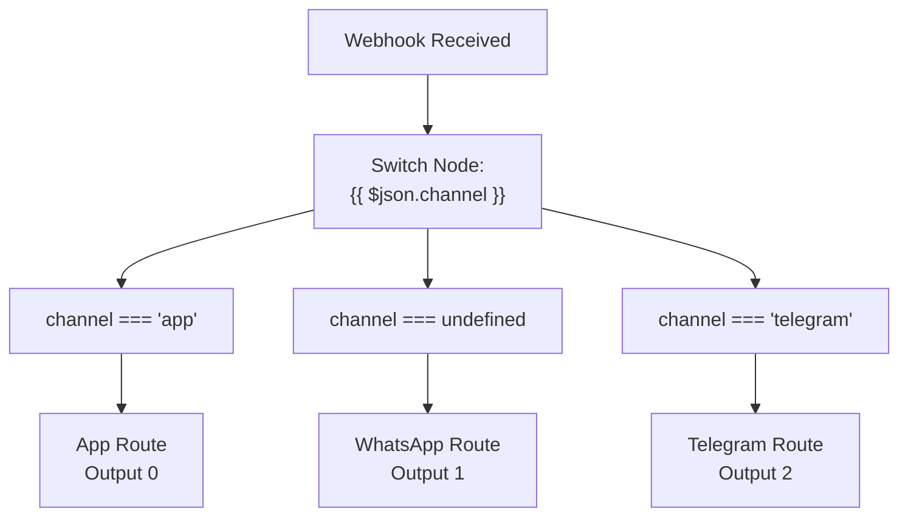
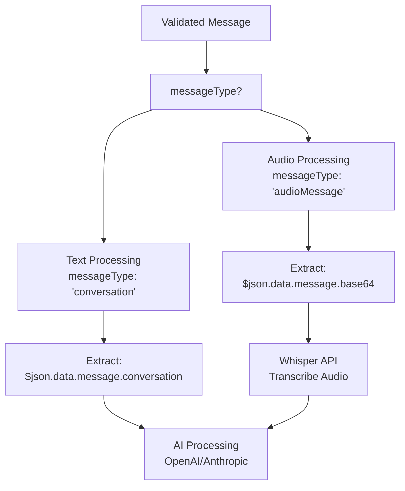
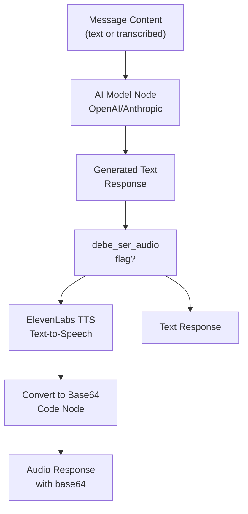
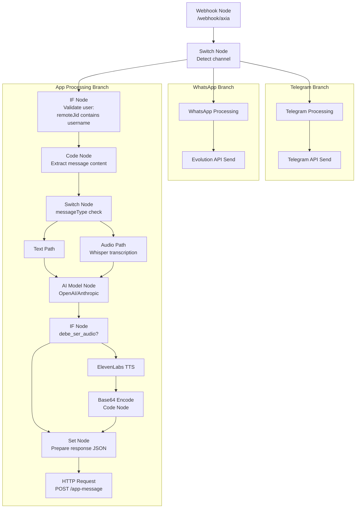

# n8n Workflow Engine

> **Relevant source files**
> * [N8N_CONFIGURATION_FINAL.md](https://github.com/axchisan/AxIA/blob/1fe26c44/N8N_CONFIGURATION_FINAL.md)
> * [N8N_CONFIGURATION_GUIDE.md](https://github.com/axchisan/AxIA/blob/1fe26c44/N8N_CONFIGURATION_GUIDE.md)
> * [N8N_INTEGRATION_GUIDE.md](https://github.com/axchisan/AxIA/blob/1fe26c44/N8N_INTEGRATION_GUIDE.md)

## Purpose and Scope

This document explains the n8n workflow automation engine's role in the AxIA system as the AI processing layer. n8n orchestrates message processing, AI model interactions, audio transcription/synthesis, and multi-channel response routing. It receives messages from the FastAPI backend via webhook, processes them through AI models (OpenAI/Anthropic), and returns formatted responses.

For WebSocket communication details, see [WebSocket Communication](/axchisan/AxIA/5.1-websocket-communication). For backend API integration, see [FastAPI Backend](/axchisan/AxIA/3.2-fastapi-backend). For audio processing in the Flutter client, see [Audio System](/axchisan/AxIA/6-audio-system).

---

## System Overview

n8n functions as the intelligence layer between the FastAPI backend and external AI services. It receives webhook requests, determines the message source channel, processes content through AI models, optionally converts responses to audio, and routes output back to the originating platform.

### n8n in the Architecture



Sources: [N8N_CONFIGURATION_FINAL.md L1-L182](https://github.com/axchisan/AxIA/blob/1fe26c44/N8N_CONFIGURATION_FINAL.md#L1-L182)

 [N8N_CONFIGURATION_GUIDE.md L1-L353](https://github.com/axchisan/AxIA/blob/1fe26c44/N8N_CONFIGURATION_GUIDE.md#L1-L353)

---

## Webhook Entry Point

The n8n workflow begins with a webhook node that receives messages from multiple sources. The FastAPI backend forwards all incoming messages to this endpoint.

### Webhook Configuration

| Property | Value |
| --- | --- |
| Method | POST |
| Path | `/webhook/axia` or `/webhook/15f68f4b-70e3-48eb-ae7d-d36d0a630118` |
| Authentication | None (called by backend) |
| Response Mode | Respond to Webhook |

### Incoming Message Structure

The webhook receives messages in Evolution API format with an additional `channel` field for source identification.

**Text Message from App:**

```go
{
  "event": "messages.upsert",
  "instance": "AxIAPersonal",
  "channel": "app",
  "data": {
    "key": {
      "remoteJid": "app:AxchiSan@axia.app",
      "fromMe": false,
      "id": "1764210412809"
    },
    "pushName": "AxchiSan",
    "message": {
      "conversation": "Dime que eventos tengo para mi agenda"
    },
    "messageType": "conversation",
    "messageTimestamp": 1764210411,
    "source": "flutter_app"
  }
}
```

**Audio Message from App:**

```json
{
  "event": "messages.upsert",
  "instance": "AxIAPersonal",
  "channel": "app",
  "data": {
    "key": {
      "remoteJid": "app:AxchiSan@axia.app",
      "fromMe": false,
      "id": "1764210412809"
    },
    "pushName": "AxchiSan",
    "message": {
      "base64": "[BASE64_AUDIO_DATA]"
    },
    "messageType": "audioMessage",
    "messageTimestamp": 1764210411,
    "source": "flutter_app"
  }
}
```

Sources: [N8N_CONFIGURATION_GUIDE.md L15-L63](https://github.com/axchisan/AxIA/blob/1fe26c44/N8N_CONFIGURATION_GUIDE.md#L15-L63)

 [N8N_INTEGRATION_GUIDE.md L8-L61](https://github.com/axchisan/AxIA/blob/1fe26c44/N8N_INTEGRATION_GUIDE.md#L8-L61)

---

## Channel Detection and Routing

The workflow uses a Switch node immediately after the webhook to route messages based on their source channel. This enables platform-specific processing while sharing common AI logic.

### Channel Identification Logic



**Switch Node Configuration:**

| Rule | Condition | Output |
| --- | --- | --- |
| Rule 1 (App) | `{{ $json.channel === 'app' }}` | 0 |
| Rule 2 (WhatsApp) | `{{ $json.channel === undefined }}` | 1 |
| Rule 3 (Telegram) | `{{ $json.channel === 'telegram' }}` | 2 |

Sources: [N8N_CONFIGURATION_GUIDE.md L66-L95](https://github.com/axchisan/AxIA/blob/1fe26c44/N8N_CONFIGURATION_GUIDE.md#L66-L95)

 [N8N_CONFIGURATION_FINAL.md L22-L39](https://github.com/axchisan/AxIA/blob/1fe26c44/N8N_CONFIGURATION_FINAL.md#L22-L39)

### remoteJid Format by Channel

The `remoteJid` field structure differs by platform, enabling secondary validation:

| Channel | remoteJid Format | Example |
| --- | --- | --- |
| App | `app:username@domain` | `app:AxchiSan@axia.app` |
| WhatsApp | `phone:id@s.whatsapp.net` | `573183038190:24@s.whatsapp.net` |
| Telegram | `telegram:user_id` | `telegram:123456789` |

**User Extraction Expression for App:**

```
{{ $json.data.key.remoteJid.split(':')[1].split('@')[0] }}
// Returns: "AxchiSan"
```

**User Extraction Expression for WhatsApp:**

```
{{ $json.data.key.remoteJid.split('@')[0].split(':')[0] }}
// Returns: "573183038190"
```

Sources: [N8N_INTEGRATION_GUIDE.md L63-L71](https://github.com/axchisan/AxIA/blob/1fe26c44/N8N_INTEGRATION_GUIDE.md#L63-L71)

 [N8N_CONFIGURATION_GUIDE.md L96-L113](https://github.com/axchisan/AxIA/blob/1fe26c44/N8N_CONFIGURATION_GUIDE.md#L96-L113)

---

## User Verification

After channel routing, the workflow validates that the message originates from an authorized user. This prevents unauthorized access to AI processing resources.

### Multi-Channel User Validation

```javascript
{{
  $if($('Webhook').isExecuted, 
    (() => {
      const remoteJid = $('Webhook').item.json.data.key.remoteJid;
      const channel = $('Webhook').item.json.channel;
      
      // App channel: extract username after 'app:'
      if (channel === 'app' || remoteJid.startsWith('app:')) {
        return remoteJid.split(':')[1].split('@')[0];
      }
      
      // WhatsApp channel: extract phone number
      return remoteJid.split('@')[0].split(':')[0];
    })(), 
    ''
  )
}}
```

This expression is used in an IF node with an equality check against authorized usernames (e.g., `AxchiSan`) or phone numbers (e.g., `573183038190`).

Sources: [N8N_INTEGRATION_GUIDE.md L87-L138](https://github.com/axchisan/AxIA/blob/1fe26c44/N8N_INTEGRATION_GUIDE.md#L87-L138)

---

## Message Processing Pipeline

Once a message is validated and routed, the workflow processes its content based on message type (text or audio).

### Message Type Detection



**IF Node Configuration:**

```
// Text message detection
{{ $json.data.messageType === 'conversation' }}

// Audio message detection
{{ $json.data.messageType === 'audioMessage' }}
```

Sources: [N8N_CONFIGURATION_GUIDE.md L116-L143](https://github.com/axchisan/AxIA/blob/1fe26c44/N8N_CONFIGURATION_GUIDE.md#L116-L143)

---

## AI Response Generation

After extracting message content, the workflow sends it to AI models for processing. The response may be text-only or include audio synthesis.

### AI Processing Flow



### Response Preparation Node

After AI processing, a Set/Code node prepares the response payload:

```javascript
// Extract webhook data
const remoteJid = $('Webhook').item.json.data.key.remoteJid;
const username = remoteJid.split(':')[1].split('@')[0];
const sessionId = $('Webhook').item.json.data.key.id;

// AI response
const axiaResponse = $json.output || $json.text || '';

// Determine audio requirement
const debeSerAudio = $json.debe_ser_audio || false;

return {
  username: username,
  session_id: sessionId,
  output: axiaResponse,
  type: debeSerAudio ? 'audio' : 'text',
  debe_ser_audio: debeSerAudio,
  audio_url: null,
  audio_base64: null
};
```

Sources: [N8N_CONFIGURATION_FINAL.md L42-L74](https://github.com/axchisan/AxIA/blob/1fe26c44/N8N_CONFIGURATION_FINAL.md#L42-L74)

---

## Audio Synthesis Pipeline

When `debe_ser_audio` is true, the workflow converts text responses to audio using ElevenLabs and encodes them in Base64 for transmission.

### ElevenLabs Integration

**HTTP Request Node Configuration:**

| Property | Value |
| --- | --- |
| Method | POST |
| URL | `https://api.elevenlabs.io/v1/text-to-speech/{voice_id}` |
| Authentication | Header Auth (`xi-api-key`) |
| Response Format | File |

**Request Body:**

```json
{
  "text": "{{ $json.output }}",
  "model_id": "eleven_multilingual_v2",
  "voice_settings": {
    "stability": 0.5,
    "similarity_boost": 0.75
  }
}
```

### Base64 Conversion

A Code node converts the binary audio response to Base64 string:

```javascript
const audioBuffer = $input.first().binary.data;
const audioBase64 = audioBuffer.toString('base64');

return {
  ...​$json,
  audio_base64: audioBase64,
  audio_url: null
};
```

Sources: [N8N_CONFIGURATION_FINAL.md L76-L120](https://github.com/axchisan/AxIA/blob/1fe26c44/N8N_CONFIGURATION_FINAL.md#L76-L120)

---

## Response Transmission

The final step sends the processed response back to the FastAPI backend, which forwards it to the user's WebSocket connection.

### /app-message Endpoint Integration

**HTTP Request Node Configuration:**

| Property | Value |
| --- | --- |
| Method | POST |
| URL | `https://apiaxia.axchisan.com/app-message` |
| Authentication | None |
| Content-Type | application/json |

**Request Body:**

```
{
  "username": "{{ $json.username }}",
  "session_id": "{{ $json.session_id }}",
  "output": "{{ $json.output }}",
  "type": "{{ $json.type }}",
  "debe_ser_audio": {{ $json.debe_ser_audio }},
  "audio_url": {{ $json.audio_url || null }},
  "audio_base64": "{{ $json.audio_base64 }}"
}
```

### Response Payload Examples

**Text Response:**

```css
{
  "username": "AxchiSan",
  "session_id": "e15c2816-135e-45d7-9b58-a6c307f1b5b3",
  "output": "### 📋 Eventos de la Semana\n\n**Lunes:**\n✅ Reunión - 2:00 PM",
  "type": "text",
  "debe_ser_audio": false,
  "audio_url": null,
  "audio_base64": null
}
```

**Audio Response:**

```json
{
  "username": "AxchiSan",
  "session_id": "e15c2816-135e-45d7-9b58-a6c307f1b5b3",
  "output": "Tienes 3 eventos esta semana",
  "type": "audio",
  "debe_ser_audio": true,
  "audio_url": null,
  "audio_base64": "UklGRiQAAABXQVZFZm10IBAAAAABAAEAQB8AAEAfAAABAAgAZGF0YQAAAAA="
}
```

Sources: [N8N_CONFIGURATION_FINAL.md L122-L210](https://github.com/axchisan/AxIA/blob/1fe26c44/N8N_CONFIGURATION_FINAL.md#L122-L210)

 [N8N_CONFIGURATION_GUIDE.md L146-L198](https://github.com/axchisan/AxIA/blob/1fe26c44/N8N_CONFIGURATION_GUIDE.md#L146-L198)

---

## Complete Workflow Structure

The entire n8n workflow follows this node sequence:



Sources: [N8N_CONFIGURATION_FINAL.md L151-L182](https://github.com/axchisan/AxIA/blob/1fe26c44/N8N_CONFIGURATION_FINAL.md#L151-L182)

 [N8N_CONFIGURATION_GUIDE.md L202-L223](https://github.com/axchisan/AxIA/blob/1fe26c44/N8N_CONFIGURATION_GUIDE.md#L202-L223)

---

## Message Field Reference

### Webhook Input Fields

| Field Path | Type | Description |
| --- | --- | --- |
| `channel` | string | Source platform: `"app"`, `"telegram"`, or `undefined` (WhatsApp) |
| `data.key.remoteJid` | string | User identifier with platform prefix |
| `data.key.id` | string | Unique message/session ID |
| `data.key.fromMe` | boolean | Always `false` for incoming messages |
| `data.pushName` | string | User's display name |
| `data.message.conversation` | string | Text message content (if `messageType: "conversation"`) |
| `data.message.base64` | string | Base64-encoded audio (if `messageType: "audioMessage"`) |
| `data.messageType` | string | `"conversation"` or `"audioMessage"` |
| `data.messageTimestamp` | integer | Unix timestamp |
| `data.source` | string | `"flutter_app"` for app messages |

### Response Output Fields

| Field | Type | Required | Description |
| --- | --- | --- | --- |
| `username` | string | Yes | Target user (extracted from `remoteJid`) |
| `session_id` | string | Yes | Original message ID for correlation |
| `output` | string | Yes | Text response (displayed or transcribed) |
| `type` | string | Yes | `"text"` or `"audio"` |
| `debe_ser_audio` | boolean | Yes | Whether response should be played as audio |
| `audio_url` | string\|null | No | URL to hosted audio file (optional) |
| `audio_base64` | string\|null | Yes* | Base64-encoded audio (* required if `type: "audio"`) |

Sources: [N8N_INTEGRATION_GUIDE.md L63-L71](https://github.com/axchisan/AxIA/blob/1fe26c44/N8N_INTEGRATION_GUIDE.md#L63-L71)

 [N8N_CONFIGURATION_GUIDE.md L18-L64](https://github.com/axchisan/AxIA/blob/1fe26c44/N8N_CONFIGURATION_GUIDE.md#L18-L64)

---

## Testing and Debugging

### Manual Endpoint Testing

Test the `/app-message` endpoint directly with curl:

```
curl -X POST https://apiaxia.axchisan.com/app-message \
  -H "Content-Type: application/json" \
  -d '{
    "username": "AxchiSan",
    "session_id": "test-123",
    "output": "Hola desde n8n",
    "type": "text",
    "debe_ser_audio": false,
    "audio_url": null,
    "audio_base64": null
  }'
```

Expected response if user is connected:

```json
{
  "status": "sent",
  "connections": 1
}
```

Expected response if user is offline:

```json
{
  "status": "no_active_connections"
}
```

### n8n Execution Logs

Monitor workflow execution in the n8n UI:

1. Open the workflow in n8n
2. Click "Executions" tab
3. Review input/output for each node
4. Check for error states in Switch nodes
5. Verify AI model responses
6. Confirm HTTP Request node receives 200 status

Sources: [N8N_CONFIGURATION_FINAL.md L212-L230](https://github.com/axchisan/AxIA/blob/1fe26c44/N8N_CONFIGURATION_FINAL.md#L212-L230)

---

## Configuration Checklist

* Webhook node created with public URL
* Switch node added after webhook for channel detection
* App branch includes user validation (username check)
* Message type detection (conversation vs audioMessage)
* Whisper API node configured for audio transcription
* AI model node configured (OpenAI or Anthropic)
* Audio decision logic implemented (debe_ser_audio flag)
* ElevenLabs TTS node configured with API key
* Base64 conversion node added for audio responses
* Response preparation node formats correct JSON structure
* HTTP Request node targets `/app-message` endpoint
* WhatsApp and Telegram branches route to correct APIs
* Workflow is activated and running

Sources: [N8N_CONFIGURATION_GUIDE.md L314-L324](https://github.com/axchisan/AxIA/blob/1fe26c44/N8N_CONFIGURATION_GUIDE.md#L314-L324)

---

## Integration Notes

### Backend Requirements

The FastAPI backend must:

* Forward WebSocket messages to n8n webhook URL
* Expose `/app-message` endpoint without authentication (called by n8n)
* Maintain WebSocket connections for real-time response delivery
* Handle `no_active_connections` status gracefully

### Environment Variables

n8n workflow may reference:

| Variable | Purpose |
| --- | --- |
| `ELEVENLABS_API_KEY` | ElevenLabs authentication |
| `OPENAI_API_KEY` | OpenAI model access |
| `ANTHROPIC_API_KEY` | Claude model access |
| `BACKEND_URL` | Base URL for `/app-message` endpoint |

### Security Considerations

1. The `/app-message` endpoint does not require Bearer token authentication because it is called by n8n, not by end users
2. User validation occurs within the n8n workflow based on `remoteJid` matching
3. Webhook URL should be treated as sensitive (contains workflow identifier)
4. Audio Base64 data can be large (several MB); ensure HTTP timeout limits accommodate this

Sources: [N8N_CONFIGURATION_FINAL.md L18-L19](https://github.com/axchisan/AxIA/blob/1fe26c44/N8N_CONFIGURATION_FINAL.md#L18-L19)

 [N8N_INTEGRATION_GUIDE.md L189-L196](https://github.com/axchisan/AxIA/blob/1fe26c44/N8N_INTEGRATION_GUIDE.md#L189-L196)

 [N8N_CONFIGURATION_FINAL.md L232-L237](https://github.com/axchisan/AxIA/blob/1fe26c44/N8N_CONFIGURATION_FINAL.md#L232-L237)