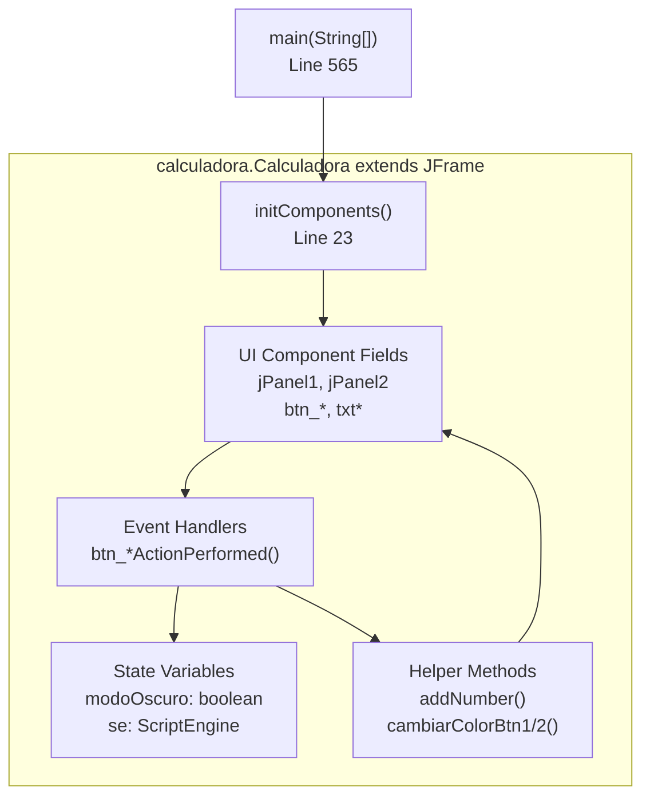
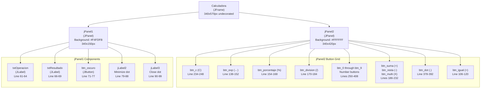
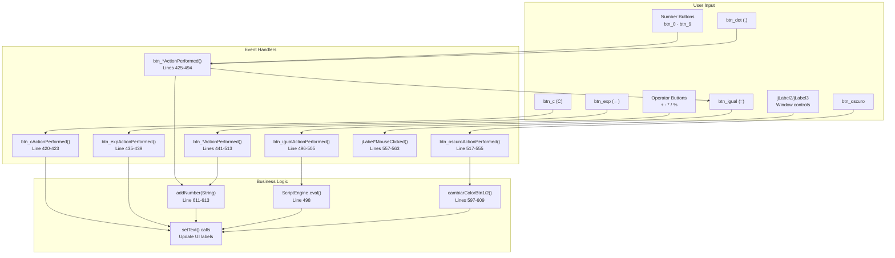
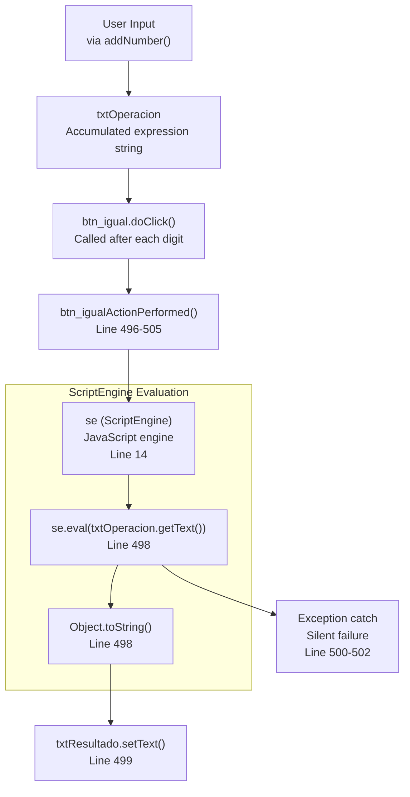
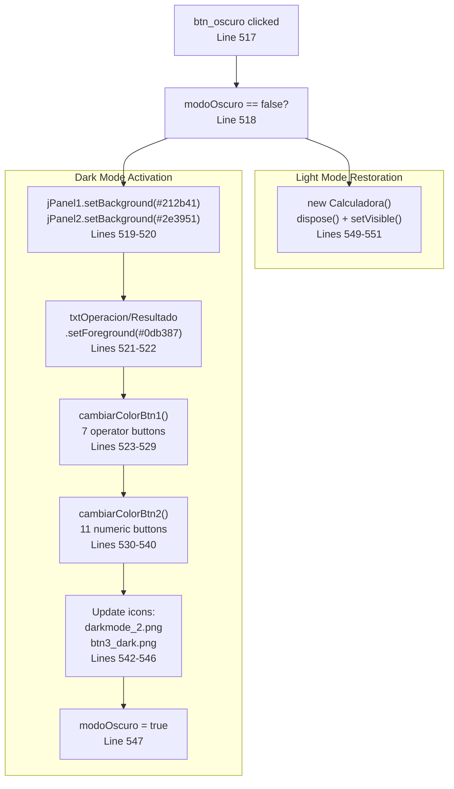

# Architecture

> **Relevant source files**
> * [README.md](https://github.com/ricardo-alan/SimpleCalculator/blob/e9524f29/README.md)
> * [dist/Calculadora.jar](https://github.com/ricardo-alan/SimpleCalculator/blob/e9524f29/dist/Calculadora.jar)
> * [src/calculadora/Calculadora.java](https://github.com/ricardo-alan/SimpleCalculator/blob/e9524f29/src/calculadora/Calculadora.java)

This page documents the technical architecture of the SimpleCalculator application, including its component organization, event-driven execution model, calculation engine integration, and theme management system. For instructions on running or building the application, see [Getting Started](/ricardo-alan/SimpleCalculator/2-getting-started). For user-facing feature descriptions, see [Features](/ricardo-alan/SimpleCalculator/3-features). For build system details, see [Build System](/ricardo-alan/SimpleCalculator/5-build-system).

## Overall Design Pattern

SimpleCalculator implements a **monolithic desktop application** pattern where all functionality resides within a single `Calculadora` class that extends `javax.swing.JFrame`. The architecture follows an event-driven model with direct event handler methods responding to user interactions.



**Sources:** [src/calculadora/Calculadora.java L11-L643](https://github.com/ricardo-alan/SimpleCalculator/blob/e9524f29/src/calculadora/Calculadora.java#L11-L643)

## Component Hierarchy

The application uses a two-panel layout structure with `AbsoluteLayout` positioning for pixel-perfect component placement.



**Sources:** [src/calculadora/Calculadora.java L23-L413](https://github.com/ricardo-alan/SimpleCalculator/blob/e9524f29/src/calculadora/Calculadora.java#L23-L413)

## Component Specification Table

| Component | Type | Purpose | Key Properties |
| --- | --- | --- | --- |
| `jPanel1` | JPanel | Display area | Background color varies by theme |
| `txtOperacion` | JLabel | Shows input expression | Right-aligned, Montserrat Alternates Light 18pt |
| `txtResultado` | JLabel | Shows calculated result | Right-aligned, Montserrat Alternates SemiBold 48pt |
| `btn_oscuro` | JButton | Theme toggle | Icon-only, switches between light/dark |
| `jLabel2` / `jLabel3` | JLabel | Window controls | Minimize (orange dot) / Close (red dot) |
| `jPanel2` | JPanel | Button grid | Contains all calculator buttons |
| `btn_0` - `btn_9` | JButton | Number input | Font: Montserrat Medium 24pt |
| `btn_suma`, `btn_resta`, `btn_multi`, `btn_division` | JButton | Operators | Trigger `addNumber()` with operator symbol |
| `btn_igual` | JButton | Evaluate | Triggers `btn_igualActionPerformed()` |
| `btn_c` | JButton | Clear | Clears both text labels |
| `btn_exp` | JButton | Backspace | Removes last character |
| `btn_dot` | JButton | Decimal point | Adds "." to expression |

**Sources:** [src/calculadora/Calculadora.java L25-L410](https://github.com/ricardo-alan/SimpleCalculator/blob/e9524f29/src/calculadora/Calculadora.java#L25-L410)

 [src/calculadora/Calculadora.java L615-L642](https://github.com/ricardo-alan/SimpleCalculator/blob/e9524f29/src/calculadora/Calculadora.java#L615-L642)

## System Initialization Flow

```mermaid
sequenceDiagram
  participant main()
  participant EventQueue
  participant Calculadora()
  participant initComponents()
  participant ScriptEngineManager

  main()->>EventQueue: invokeLater()
  EventQueue->>Calculadora(): new Calculadora()
  Calculadora()->>ScriptEngineManager: new ScriptEngineManager()
  ScriptEngineManager-->>Calculadora(): sem
  Calculadora()->>ScriptEngineManager: getEngineByName("JavaScript")
  ScriptEngineManager-->>Calculadora(): se (ScriptEngine)
  Calculadora()->>initComponents(): initComponents()
  initComponents()->>initComponents(): Create all UI components
  initComponents()->>initComponents(): Set AbsoluteLayout positions
  initComponents()->>initComponents(): Attach event listeners
  initComponents()-->>Calculadora(): return
  Calculadora()->>Calculadora(): setLocationRelativeTo(null)
  Calculadora()->>Calculadora(): setVisible(true)
```

**Key initialization steps:**

1. **Lines 13-14:** `ScriptEngineManager` and `ScriptEngine` instantiated at class level
2. **Line 16-19:** Constructor calls `initComponents()` and centers window
3. **Lines 23-413:** `initComponents()` creates all Swing components with AbsoluteLayout constraints
4. **Line 565-595:** `main()` sets Nimbus L&F and launches on Event Dispatch Thread

**Sources:** [src/calculadora/Calculadora.java L13-L19](https://github.com/ricardo-alan/SimpleCalculator/blob/e9524f29/src/calculadora/Calculadora.java#L13-L19)

 [src/calculadora/Calculadora.java L23-L413](https://github.com/ricardo-alan/SimpleCalculator/blob/e9524f29/src/calculadora/Calculadora.java#L23-L413)

 [src/calculadora/Calculadora.java L565-L595](https://github.com/ricardo-alan/SimpleCalculator/blob/e9524f29/src/calculadora/Calculadora.java#L565-L595)

## Event Processing Architecture

The application uses direct ActionListener implementations for button events, with each handler calling helper methods or manipulating state directly.



**Event handler patterns:**

| Handler Type | Pattern | Example |
| --- | --- | --- |
| Number buttons | `addNumber(digit)` + `btn_igual.doClick()` | [Line 426-428](https://github.com/ricardo-alan/SimpleCalculator/blob/e9524f29/Line 426-428) |
| Operator buttons | `addNumber(operator)` | [Line 442-443](https://github.com/ricardo-alan/SimpleCalculator/blob/e9524f29/Line 442-443) |
| Equals button | `ScriptEngine.eval()` + error handling | [Line 496-505](https://github.com/ricardo-alan/SimpleCalculator/blob/e9524f29/Line 496-505) |
| Clear button | `setText("")` on both labels | [Line 421-422](https://github.com/ricardo-alan/SimpleCalculator/blob/e9524f29/Line 421-422) |
| Backspace | Substring manipulation + re-evaluate | [Line 436-438](https://github.com/ricardo-alan/SimpleCalculator/blob/e9524f29/Line 436-438) |
| Theme toggle | Conditional color/icon updates | [Line 518-552](https://github.com/ricardo-alan/SimpleCalculator/blob/e9524f29/Line 518-552) |

**Sources:** [src/calculadora/Calculadora.java L415-L563](https://github.com/ricardo-alan/SimpleCalculator/blob/e9524f29/src/calculadora/Calculadora.java#L415-L563)

 [src/calculadora/Calculadora.java L597-L613](https://github.com/ricardo-alan/SimpleCalculator/blob/e9524f29/src/calculadora/Calculadora.java#L597-L613)

## Calculation Engine Integration

SimpleCalculator delegates all arithmetic evaluation to the `javax.script.ScriptEngine` API with the JavaScript engine.



**Calculation flow details:**

1. **Expression Building:** Each button press calls `addNumber(String)` which appends to `txtOperacion`
2. **Real-time Evaluation:** Number buttons trigger `btn_igual.doClick()` immediately after adding digit
3. **Engine Execution:** `ScriptEngine.eval()` parses and evaluates the JavaScript expression
4. **Result Display:** Successful evaluation updates `txtResultado` via `setText()`
5. **Error Handling:** Exceptions are caught but silently ignored (commented clear action at line 501)

**Sources:** [src/calculadora/Calculadora.java L13-L14](https://github.com/ricardo-alan/SimpleCalculator/blob/e9524f29/src/calculadora/Calculadora.java#L13-L14)

 [src/calculadora/Calculadora.java L496-L505](https://github.com/ricardo-alan/SimpleCalculator/blob/e9524f29/src/calculadora/Calculadora.java#L496-L505)

 [src/calculadora/Calculadora.java L611-L613](https://github.com/ricardo-alan/SimpleCalculator/blob/e9524f29/src/calculadora/Calculadora.java#L611-L613)

## Theme Management System

The theme system uses a boolean flag (`modoOscuro`) to toggle between light and dark color schemes, with helper methods to update button appearance.



**Theme helper method signatures:**

| Method | Target Buttons | Icon Changes | Text Color |
| --- | --- | --- | --- |
| `cambiarColorBtn1(JButton)` | Operators (btn_multi, btn_suma, btn_resta, btn_division, btn_exp, btn_c, btn_porcentaje) | btn1_dark.png, btn1_pressed_dark.png | #0db387 |
| `cambiarColorBtn2(JButton)` | Numbers (btn_0-9, btn_dot) | btn2_dark.png, btn1_pressed_dark.png | #96a8a0 |

**Color palette:**

| Element | Light Mode | Dark Mode |
| --- | --- | --- |
| Display panel (jPanel1) | #F4FDFB | #212b41 |
| Button panel (jPanel2) | #FFFFFF | #2e3951 |
| Text (operation/result) | #373E47 | #0db387 |
| Operator buttons | Various | #0db387 |
| Number buttons | #373E47 | #96a8a0 |
| Equals button text | #FFFFFF | #2e3951 |

**Sources:** [src/calculadora/Calculadora.java L515-L555](https://github.com/ricardo-alan/SimpleCalculator/blob/e9524f29/src/calculadora/Calculadora.java#L515-L555)

 [src/calculadora/Calculadora.java L597-L609](https://github.com/ricardo-alan/SimpleCalculator/blob/e9524f29/src/calculadora/Calculadora.java#L597-L609)

## Icon Asset Management

Button appearance is controlled through icon sets loaded from the `/images/` directory using `getClass().getResource()`.

```mermaid
flowchart TD

BTN1_L["/images/btn1.png"]
BTN1_P_L["/images/btn1_pressed.png"]
BTN2_L["/images/btn2.png"]
BTN3_L["/images/btn3.png"]
DARK1_L["/images/darkmode_1.png"]
BTN1_D["/images/btn1_dark.png"]
BTN1_P_D["/images/btn1_pressed_dark.png"]
BTN2_D["/images/btn2_dark.png"]
BTN3_D["/images/btn3_dark.png"]
BTN3_P_D["/images/btn3_pressed_dark.png"]
DARK2_D["/images/darkmode_2.png"]
ICON["setIcon()"]
PRESSED["setPressedIcon()"]
ROLLOVER["setRolloverIcon()"]

BTN1_L --> ICON
BTN1_D --> ICON
BTN1_P_L --> PRESSED
BTN1_P_D --> PRESSED
BTN1_P_L --> ROLLOVER
BTN1_P_D --> ROLLOVER

subgraph subGraph2 ["JButton Properties"]
    ICON
    PRESSED
    ROLLOVER
end

subgraph subGraph1 ["Dark Mode Icons"]
    BTN1_D
    BTN1_P_D
    BTN2_D
    BTN3_D
    BTN3_P_D
    DARK2_D
end

subgraph subGraph0 ["Light Mode Icons"]
    BTN1_L
    BTN1_P_L
    BTN2_L
    BTN3_L
    DARK1_L
end
```



**Icon-to-button mapping:**

| Icon File | Usage | Dimensions | Applied To |
| --- | --- | --- | --- |
| btn1.png | Operator button default | 50x50px | btn_division, btn_multi, btn_resta, btn_suma, btn_c, btn_exp, btn_porcentaje |
| btn1_pressed.png | Operator button hover/press | 50x50px | Same as above (rollover/pressed) |
| btn2.png | Number button default | 50x50px | btn_0 through btn_9, btn_dot |
| btn3.png | Equals button default | 50x50px | btn_igual |
| btn1_dark.png | Dark mode operators | 50x50px | Applied via `cambiarColorBtn1()` |
| btn2_dark.png | Dark mode numbers | 50x50px | Applied via `cambiarColorBtn2()` |
| btn3_dark.png | Dark mode equals | 50x50px | btn_igual in dark mode |
| darkmode_1.png | Theme toggle (light mode) | 20x20px | btn_oscuro |
| darkmode_2.png | Theme toggle (dark mode) | 20x20px | btn_oscuro |

**Icon loading pattern:**

```
new ImageIcon(getClass().getResource("/images/btn1.png"))
```

This loads icons from the classpath, which are bundled into the JAR during compilation.

**Sources:** [src/calculadora/Calculadora.java L71-L120](https://github.com/ricardo-alan/SimpleCalculator/blob/e9524f29/src/calculadora/Calculadora.java#L71-L120)

 [src/calculadora/Calculadora.java L542-L546](https://github.com/ricardo-alan/SimpleCalculator/blob/e9524f29/src/calculadora/Calculadora.java#L542-L546)

 [src/calculadora/Calculadora.java L597-L609](https://github.com/ricardo-alan/SimpleCalculator/blob/e9524f29/src/calculadora/Calculadora.java#L597-L609)