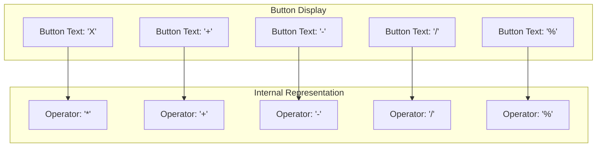
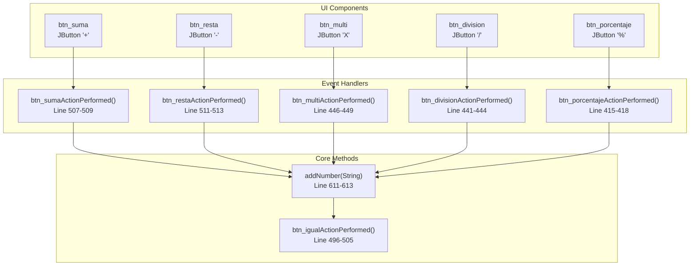

# Arithmetic Operations

> **Relevant source files**
> * [README.md](https://github.com/ricardo-alan/SimpleCalculator/blob/e9524f29/README.md)
> * [dist/Calculadora.jar](https://github.com/ricardo-alan/SimpleCalculator/blob/e9524f29/dist/Calculadora.jar)
> * [src/calculadora/Calculadora.java](https://github.com/ricardo-alan/SimpleCalculator/blob/e9524f29/src/calculadora/Calculadora.java)

## Purpose and Scope

This document describes the arithmetic operations supported by the SimpleCalculator application and their implementation. The calculator supports five basic mathematical operations: addition, subtraction, multiplication, division, and percentage. For information about how results are computed in real-time as the user types, see [Real-time Results](/ricardo-alan/SimpleCalculator/3.2-real-time-results). For details about the underlying expression evaluation engine, see [Calculation Engine](/ricardo-alan/SimpleCalculator/4.3-calculation-engine).

## Supported Operations

The SimpleCalculator implements the following arithmetic operations:

| Operation | Symbol | Button | Handler Method |
| --- | --- | --- | --- |
| Addition | `+` | `btn_suma` | `btn_sumaActionPerformed()` |
| Subtraction | `-` | `btn_resta` | `btn_restaActionPerformed()` |
| Multiplication | `*` (internally) / `X` (display) | `btn_multi` | `btn_multiActionPerformed()` |
| Division | `/` | `btn_division` | `btn_divisionActionPerformed()` |
| Percentage | `%` | `btn_porcentaje` | `btn_porcentajeActionPerformed()` |

**Sources:** [README.md L13](https://github.com/ricardo-alan/SimpleCalculator/blob/e9524f29/README.md#L13-L13)

 [src/calculadora/Calculadora.java L36-L39](https://github.com/ricardo-alan/SimpleCalculator/blob/e9524f29/src/calculadora/Calculadora.java#L36-L39)

## Operation Input Flow

The following diagram illustrates how user input flows through the system when performing arithmetic operations:

```

```

**Sources:** [src/calculadora/Calculadora.java L415-L513](https://github.com/ricardo-alan/SimpleCalculator/blob/e9524f29/src/calculadora/Calculadora.java#L415-L513)

 [src/calculadora/Calculadora.java L611-L613](https://github.com/ricardo-alan/SimpleCalculator/blob/e9524f29/src/calculadora/Calculadora.java#L611-L613)

## Implementation Details

### Operator Symbol Mapping

The calculator uses specific internal representations for operators that differ from their display symbols:



**Sources:** [src/calculadora/Calculadora.java L189](https://github.com/ricardo-alan/SimpleCalculator/blob/e9524f29/src/calculadora/Calculadora.java#L189-L189)

 [src/calculadora/Calculadora.java L221](https://github.com/ricardo-alan/SimpleCalculator/blob/e9524f29/src/calculadora/Calculadora.java#L221-L221)

 [src/calculadora/Calculadora.java L205](https://github.com/ricardo-alan/SimpleCalculator/blob/e9524f29/src/calculadora/Calculadora.java#L205-L205)

 [src/calculadora/Calculadora.java L173](https://github.com/ricardo-alan/SimpleCalculator/blob/e9524f29/src/calculadora/Calculadora.java#L173-L173)

 [src/calculadora/Calculadora.java L157](https://github.com/ricardo-alan/SimpleCalculator/blob/e9524f29/src/calculadora/Calculadora.java#L157-L157)

### Addition Operation

Addition is triggered by the `btn_suma` button which appends the `+` symbol to the expression.

**Implementation:** [src/calculadora/Calculadora.java L507-L509](https://github.com/ricardo-alan/SimpleCalculator/blob/e9524f29/src/calculadora/Calculadora.java#L507-L509)

```

```

The addition operator is passed directly to the JavaScript ScriptEngine without modification.

**Sources:** [src/calculadora/Calculadora.java L218-L232](https://github.com/ricardo-alan/SimpleCalculator/blob/e9524f29/src/calculadora/Calculadora.java#L218-L232)

### Subtraction Operation

Subtraction is triggered by the `btn_resta` button which appends the `-` symbol to the expression.

**Implementation:** [src/calculadora/Calculadora.java L511-L513](https://github.com/ricardo-alan/SimpleCalculator/blob/e9524f29/src/calculadora/Calculadora.java#L511-L513)

```

```

**Sources:** [src/calculadora/Calculadora.java L202-L216](https://github.com/ricardo-alan/SimpleCalculator/blob/e9524f29/src/calculadora/Calculadora.java#L202-L216)

### Multiplication Operation

Multiplication is triggered by the `btn_multi` button. The button displays "X" to the user but internally uses the `*` symbol for JavaScript evaluation.

**Implementation:** [src/calculadora/Calculadora.java L446-L449](https://github.com/ricardo-alan/SimpleCalculator/blob/e9524f29/src/calculadora/Calculadora.java#L446-L449)

```

```

**Sources:** [src/calculadora/Calculadora.java L186-L200](https://github.com/ricardo-alan/SimpleCalculator/blob/e9524f29/src/calculadora/Calculadora.java#L186-L200)

### Division Operation

Division is triggered by the `btn_division` button which appends the `/` symbol to the expression.

**Implementation:** [src/calculadora/Calculadora.java L441-L444](https://github.com/ricardo-alan/SimpleCalculator/blob/e9524f29/src/calculadora/Calculadora.java#L441-L444)

```

```

**Sources:** [src/calculadora/Calculadora.java L170-L184](https://github.com/ricardo-alan/SimpleCalculator/blob/e9524f29/src/calculadora/Calculadora.java#L170-L184)

### Percentage Operation

Percentage is triggered by the `btn_porcentaje` button which appends the `%` symbol to the expression. JavaScript interprets `%` as the modulo operator.

**Implementation:** [src/calculadora/Calculadora.java L415-L418](https://github.com/ricardo-alan/SimpleCalculator/blob/e9524f29/src/calculadora/Calculadora.java#L415-L418)

```

```

**Sources:** [src/calculadora/Calculadora.java L154-L168](https://github.com/ricardo-alan/SimpleCalculator/blob/e9524f29/src/calculadora/Calculadora.java#L154-L168)

## Expression Building and Evaluation

### Expression Construction

All arithmetic operations use the `addNumber()` method to append operator symbols to the `txtOperacion` JLabel text:

**Method Definition:** [src/calculadora/Calculadora.java L611-L613](https://github.com/ricardo-alan/SimpleCalculator/blob/e9524f29/src/calculadora/Calculadora.java#L611-L613)

```

```

This method builds a string expression by concatenating the current text with the new operator or digit. For example, entering "5 + 3" results in the string `"5+3"` being stored in `txtOperacion`.

**Sources:** [src/calculadora/Calculadora.java L611-L613](https://github.com/ricardo-alan/SimpleCalculator/blob/e9524f29/src/calculadora/Calculadora.java#L611-L613)

### JavaScript ScriptEngine Evaluation

The evaluation of arithmetic expressions is delegated to the JavaScript ScriptEngine, which is initialized when the `Calculadora` instance is created:

**Initialization:** [src/calculadora/Calculadora.java L13-L14](https://github.com/ricardo-alan/SimpleCalculator/blob/e9524f29/src/calculadora/Calculadora.java#L13-L14)

```

```

**Evaluation:** [src/calculadora/Calculadora.java L496-L505](https://github.com/ricardo-alan/SimpleCalculator/blob/e9524f29/src/calculadora/Calculadora.java#L496-L505)

```

```

The ScriptEngine:

1. Receives the complete expression string from `txtOperacion`
2. Parses and evaluates the JavaScript expression
3. Returns the result as a string
4. Updates `txtResultado` with the computed value

Error handling silently catches any evaluation exceptions (such as division by zero or syntax errors) without clearing the display.

**Sources:** [src/calculadora/Calculadora.java L13-L14](https://github.com/ricardo-alan/SimpleCalculator/blob/e9524f29/src/calculadora/Calculadora.java#L13-L14)

 [src/calculadora/Calculadora.java L496-L505](https://github.com/ricardo-alan/SimpleCalculator/blob/e9524f29/src/calculadora/Calculadora.java#L496-L505)

## Operation Precedence

The calculator follows standard JavaScript operator precedence rules enforced by the ScriptEngine:

| Precedence | Operators | Associativity |
| --- | --- | --- |
| Highest | `%` (modulo) | Left-to-right |
| Higher | `*`, `/` | Left-to-right |
| Lower | `+`, `-` | Left-to-right |

For example:

* `2 + 3 * 4` evaluates to `14` (multiplication before addition)
* `10 / 2 - 3` evaluates to `2` (division before subtraction)
* `5 % 3 + 1` evaluates to `3` (modulo before addition)

**Sources:** [src/calculadora/Calculadora.java L13-L14](https://github.com/ricardo-alan/SimpleCalculator/blob/e9524f29/src/calculadora/Calculadora.java#L13-L14)

 [src/calculadora/Calculadora.java L498](https://github.com/ricardo-alan/SimpleCalculator/blob/e9524f29/src/calculadora/Calculadora.java#L498-L498)

## Button-to-Handler Mapping

The following diagram shows the relationship between UI components and their handler methods:



**Sources:** [src/calculadora/Calculadora.java L218-L232](https://github.com/ricardo-alan/SimpleCalculator/blob/e9524f29/src/calculadora/Calculadora.java#L218-L232)

 [src/calculadora/Calculadora.java L202-L216](https://github.com/ricardo-alan/SimpleCalculator/blob/e9524f29/src/calculadora/Calculadora.java#L202-L216)

 [src/calculadora/Calculadora.java L186-L200](https://github.com/ricardo-alan/SimpleCalculator/blob/e9524f29/src/calculadora/Calculadora.java#L186-L200)

 [src/calculadora/Calculadora.java L170-L184](https://github.com/ricardo-alan/SimpleCalculator/blob/e9524f29/src/calculadora/Calculadora.java#L170-L184)

 [src/calculadora/Calculadora.java L154-L168](https://github.com/ricardo-alan/SimpleCalculator/blob/e9524f29/src/calculadora/Calculadora.java#L154-L168)

## Clear Operation

While not an arithmetic operation, the Clear function (`btn_c`) is essential for resetting the calculator state:

**Implementation:** [src/calculadora/Calculadora.java L420-L423](https://github.com/ricardo-alan/SimpleCalculator/blob/e9524f29/src/calculadora/Calculadora.java#L420-L423)

```

```

This method clears both the operation display (`txtOperacion`) and the result display (`txtResultado`), allowing the user to start a new calculation.

**Sources:** [src/calculadora/Calculadora.java L234-L248](https://github.com/ricardo-alan/SimpleCalculator/blob/e9524f29/src/calculadora/Calculadora.java#L234-L248)

 [src/calculadora/Calculadora.java L420-L423](https://github.com/ricardo-alan/SimpleCalculator/blob/e9524f29/src/calculadora/Calculadora.java#L420-L423)

## Limitations and Considerations

### Expression Format

The calculator builds expressions as simple strings without parentheses support. Users cannot group operations with parentheses, as the expression is evaluated as-is by the ScriptEngine.

### Error Handling

Error handling is minimal. When the ScriptEngine encounters an invalid expression (e.g., `"5++3"` or `"10/0"`), the exception is caught but no error message is displayed to the user. The previous result remains visible in `txtResultado`.

**Error Handling Code:** [src/calculadora/Calculadora.java L500-L502](https://github.com/ricardo-alan/SimpleCalculator/blob/e9524f29/src/calculadora/Calculadora.java#L500-L502)

### Percentage Behavior

The `%` operator functions as JavaScript's modulo operator, not as a traditional percentage calculation. For example, `50 % 10` yields `0` (the remainder of 50 divided by 10), not `5` (50% of 10).

**Sources:** [src/calculadora/Calculadora.java L496-L505](https://github.com/ricardo-alan/SimpleCalculator/blob/e9524f29/src/calculadora/Calculadora.java#L496-L505)

 [src/calculadora/Calculadora.java L415-L418](https://github.com/ricardo-alan/SimpleCalculator/blob/e9524f29/src/calculadora/Calculadora.java#L415-L418)