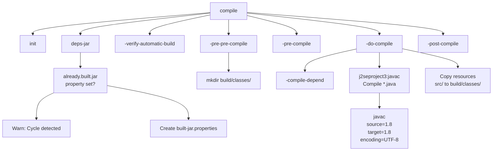
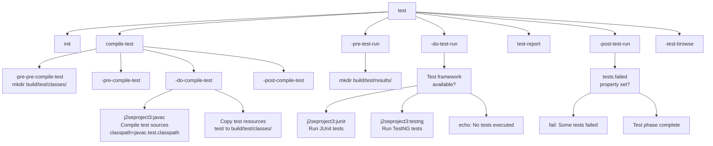
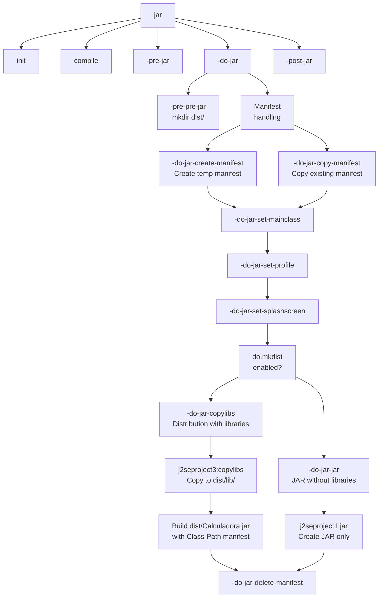
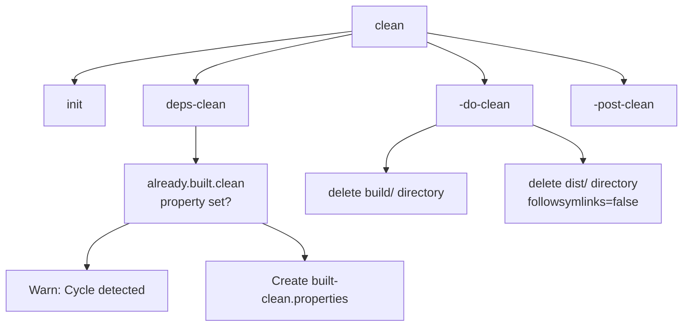

# Build Lifecycle

> **Relevant source files**
> * [build.xml](https://github.com/ricardo-alan/SimpleCalculator/blob/e9524f29/build.xml)
> * [nbproject/build-impl.xml](https://github.com/ricardo-alan/SimpleCalculator/blob/e9524f29/nbproject/build-impl.xml)
> * [nbproject/project.properties](https://github.com/ricardo-alan/SimpleCalculator/blob/e9524f29/nbproject/project.properties)

## Purpose and Scope

This document describes the complete build lifecycle of the SimpleCalculator project, detailing each phase from initialization through final distribution artifact creation. The lifecycle is implemented using Apache Ant and is defined in [nbproject/build-impl.xml](https://github.com/ricardo-alan/SimpleCalculator/blob/e9524f29/nbproject/build-impl.xml)

 and [build.xml](https://github.com/ricardo-alan/SimpleCalculator/blob/e9524f29/build.xml)

For information about configuring build properties, see [Project Properties](/ricardo-alan/SimpleCalculator/6.1-project-properties). For details on how JAR files are packaged and libraries are distributed, see [Distribution and Packaging](/ricardo-alan/SimpleCalculator/5.3-distribution-and-packaging). For NetBeans-specific build integration, see [NetBeans Integration](/ricardo-alan/SimpleCalculator/5.4-netbeans-integration).

---

## Build Lifecycle Overview

The SimpleCalculator build follows a standard Apache Ant lifecycle managed by NetBeans. The build process is divided into distinct phases, each with pre/post customization hooks. The default build target executes the entire lifecycle including compilation, testing, and documentation generation.

### Default Build Target

The default target is defined at [nbproject/build-impl.xml L30](https://github.com/ricardo-alan/SimpleCalculator/blob/e9524f29/nbproject/build-impl.xml#L30-L30)

 and executes three major phases:

```
<target depends="test,jar,javadoc" description="Build and test whole project." name="default"/>
```

**Sources:** [nbproject/build-impl.xml L30](https://github.com/ricardo-alan/SimpleCalculator/blob/e9524f29/nbproject/build-impl.xml#L30-L30)

---

## Complete Build Lifecycle Flow

```mermaid
flowchart TD

START["Build Invocation"]
INIT["Initialization Phase"]
INIT_PRE["-pre-init"]
INIT_PRIVATE["-init-private<br>Load Private Properties"]
INIT_USER["-init-user<br>Load User Properties"]
INIT_PROJECT["-init-project<br>Load Project Properties"]
DO_INIT["-do-init<br>Property Resolution"]
INIT_POST["-post-init"]
INIT_CHECK["-init-check<br>Validate Properties"]
INIT_MACROS["-init-macrodef-*<br>Define Build Macros"]
COMPILE_PHASE["Compilation Phase"]
DEPS_JAR["deps-jar<br>Handle Dependencies"]
PRE_PRE_COMPILE["-pre-pre-compile<br>Create build/classes/"]
PRE_COMPILE["-pre-compile"]
COMPILE_DEPEND["-compile-depend<br>Check Dependencies"]
DO_COMPILE["-do-compile<br>javac Compilation"]
COPY_RESOURCES["Copy Resources<br>Images to build/classes/"]
POST_COMPILE["-post-compile"]
COMPILE_DONE["compile target complete"]
TEST_PHASE["Test Phase"]
PRE_PRE_COMPILE_TEST["-pre-pre-compile-test<br>Create build/test/classes/"]
PRE_COMPILE_TEST["-pre-compile-test"]
DO_COMPILE_TEST["-do-compile-test<br>Compile Test Sources"]
POST_COMPILE_TEST["-post-compile-test"]
PRE_TEST_RUN["-pre-test-run<br>Create test/results/"]
DO_TEST_RUN["-do-test-run<br>Execute Tests"]
POST_TEST_RUN["-post-test-run<br>Check Test Results"]
TEST_DONE["test target complete"]
JAR_PHASE["JAR Building Phase"]
PRE_PRE_JAR["-pre-pre-jar<br>Create dist/ Directory"]
PRE_JAR["-pre-jar"]
JAR_MANIFEST["Manifest Processing"]
CREATE_MANIFEST["-do-jar-create-manifest"]
COPY_MANIFEST["-do-jar-copy-manifest"]
SET_MAINCLASS["-do-jar-set-mainclass<br>Main-Class: calculadora.Calculadora"]
MKDIST_CHECK["do.mkdist<br>property set?"]
DO_JAR_COPYLIBS["-do-jar-copylibs<br>Copy Libraries to dist/lib/"]
DO_JAR_JAR["-do-jar-jar<br>Create JAR Only"]
DELETE_MANIFEST["-do-jar-delete-manifest"]
POST_JAR["-post-jar"]
JAR_DONE["jar target complete"]
JAVADOC_PHASE["Javadoc Phase"]
JAVADOC_BUILD["-javadoc-build<br>Generate API Docs"]
JAVADOC_BROWSE["-javadoc-browse"]
BUILD_COMPLETE["Build Complete"]

START --> INIT
INIT --> INIT_PRE
INIT_PRE --> INIT_PRIVATE
INIT_PRIVATE --> INIT_USER
INIT_USER --> INIT_PROJECT
INIT_PROJECT --> DO_INIT
DO_INIT --> INIT_POST
INIT_POST --> INIT_CHECK
INIT_CHECK --> INIT_MACROS
INIT_MACROS --> COMPILE_PHASE
COMPILE_PHASE --> DEPS_JAR
DEPS_JAR --> PRE_PRE_COMPILE
PRE_PRE_COMPILE --> PRE_COMPILE
PRE_COMPILE --> COMPILE_DEPEND
COMPILE_DEPEND --> DO_COMPILE
DO_COMPILE --> COPY_RESOURCES
COPY_RESOURCES --> POST_COMPILE
POST_COMPILE --> COMPILE_DONE
COMPILE_DONE --> TEST_PHASE
TEST_PHASE --> PRE_PRE_COMPILE_TEST
PRE_PRE_COMPILE_TEST --> PRE_COMPILE_TEST
PRE_COMPILE_TEST --> DO_COMPILE_TEST
DO_COMPILE_TEST --> POST_COMPILE_TEST
POST_COMPILE_TEST --> PRE_TEST_RUN
PRE_TEST_RUN --> DO_TEST_RUN
DO_TEST_RUN --> POST_TEST_RUN
POST_TEST_RUN --> TEST_DONE
TEST_DONE --> JAR_PHASE
JAR_PHASE --> PRE_PRE_JAR
PRE_PRE_JAR --> PRE_JAR
PRE_JAR --> JAR_MANIFEST
JAR_MANIFEST --> CREATE_MANIFEST
JAR_MANIFEST --> COPY_MANIFEST
CREATE_MANIFEST --> SET_MAINCLASS
COPY_MANIFEST --> SET_MAINCLASS
SET_MAINCLASS --> MKDIST_CHECK
MKDIST_CHECK --> DO_JAR_COPYLIBS
MKDIST_CHECK --> DO_JAR_JAR
DO_JAR_COPYLIBS --> DELETE_MANIFEST
DO_JAR_JAR --> DELETE_MANIFEST
DELETE_MANIFEST --> POST_JAR
POST_JAR --> JAR_DONE
JAR_DONE --> JAVADOC_PHASE
JAVADOC_PHASE --> JAVADOC_BUILD
JAVADOC_BUILD --> JAVADOC_BROWSE
JAVADOC_BROWSE --> BUILD_COMPLETE
```



**Sources:** [nbproject/build-impl.xml L30](https://github.com/ricardo-alan/SimpleCalculator/blob/e9524f29/nbproject/build-impl.xml#L30-L30)

 [nbproject/build-impl.xml L36-L885](https://github.com/ricardo-alan/SimpleCalculator/blob/e9524f29/nbproject/build-impl.xml#L36-L885)

 [nbproject/build-impl.xml L914-L945](https://github.com/ricardo-alan/SimpleCalculator/blob/e9524f29/nbproject/build-impl.xml#L914-L945)

 [nbproject/build-impl.xml L965-L1033](https://github.com/ricardo-alan/SimpleCalculator/blob/e9524f29/nbproject/build-impl.xml#L965-L1033)

 [nbproject/build-impl.xml L1246-L1300](https://github.com/ricardo-alan/SimpleCalculator/blob/e9524f29/nbproject/build-impl.xml#L1246-L1300)

---

## Initialization Phase

The initialization phase loads configuration properties, validates required settings, and defines build macros. This phase executes before any actual compilation or packaging occurs.

### Initialization Target Dependencies

```mermaid
flowchart TD

INIT["init"]
PRE_INIT["-pre-init"]
INIT_PRIVATE["-init-private"]
INIT_USER["-init-user"]
INIT_PROJECT["-init-project"]
DO_INIT["-do-init"]
POST_INIT["-post-init"]
INIT_CHECK["-init-check"]
MACRODEF_PROPERTY["-init-macrodef-property"]
MACRODEF_JAVAC["-init-macrodef-javac"]
MACRODEF_TEST["-init-macrodef-test"]
MACRODEF_TEST_DEBUG["-init-macrodef-test-debug"]
MACRODEF_NBJPDA["-init-macrodef-nbjpda"]
MACRODEF_DEBUG["-init-macrodef-debug"]
MACRODEF_JAVA["-init-macrodef-java"]
PRESETDEF_JAR["-init-presetdef-jar"]
INIT_AP_CMDLINE["-init-ap-cmdline"]

INIT --> PRE_INIT
INIT --> INIT_PRIVATE
INIT --> INIT_USER
INIT --> INIT_PROJECT
INIT --> DO_INIT
INIT --> POST_INIT
INIT --> INIT_CHECK
INIT --> MACRODEF_PROPERTY
INIT --> MACRODEF_JAVAC
INIT --> MACRODEF_TEST
INIT --> MACRODEF_TEST_DEBUG
INIT --> MACRODEF_NBJPDA
INIT --> MACRODEF_DEBUG
INIT --> MACRODEF_JAVA
INIT --> PRESETDEF_JAR
INIT --> INIT_AP_CMDLINE
```



**Sources:** [nbproject/build-impl.xml L885](https://github.com/ricardo-alan/SimpleCalculator/blob/e9524f29/nbproject/build-impl.xml#L885-L885)

### Property Loading Sequence

Properties are loaded in a specific order, with later properties overriding earlier ones:

| **Order** | **Target** | **Property File** | **Purpose** |
| --- | --- | --- | --- |
| 1 | `-init-private` | `nbproject/private/config.properties` | Configuration-specific private settings |
| 2 | `-init-private` | `nbproject/private/configs/${config}.properties` | Named configuration private settings |
| 3 | `-init-private` | `nbproject/private/private.properties` | User-specific private settings |
| 4 | `-init-user` | `${user.properties.file}` | Global user properties from NetBeans |
| 5 | `-init-project` | `nbproject/configs/${config}.properties` | Configuration-specific project settings |
| 6 | `-init-project` | `nbproject/project.properties` | Main project configuration |

**Sources:** [nbproject/build-impl.xml L40-L55](https://github.com/ricardo-alan/SimpleCalculator/blob/e9524f29/nbproject/build-impl.xml#L40-L55)

### Key Properties Set During Initialization

The `-do-init` target sets numerous properties used throughout the build:

| **Property** | **Default Value** | **Purpose** |
| --- | --- | --- |
| `platform.java` | `${java.home}/bin/java` | Java executable path |
| `javac.debug` | `true` | Enable debug symbols in compiled classes |
| `source.encoding` | `${file.encoding}` | Source file encoding (UTF-8) |
| `runtime.encoding` | `${source.encoding}` | Runtime encoding |
| `jar.index` | `false` | Whether to create JAR index |
| `copylibs.rebase` | `true` | Rebase library paths in copied JARs |
| `work.dir` | `${basedir}` | Working directory for execution |

**Sources:** [nbproject/build-impl.xml L145-L203](https://github.com/ricardo-alan/SimpleCalculator/blob/e9524f29/nbproject/build-impl.xml#L145-L203)

### Validation Checks

The `-init-check` target validates that required properties are set:

```xml
<fail unless="src.dir">Must set src.dir</fail>
<fail unless="test.src.dir">Must set test.src.dir</fail>
<fail unless="build.dir">Must set build.dir</fail>
<fail unless="dist.dir">Must set dist.dir</fail>
<fail unless="build.classes.dir">Must set build.classes.dir</fail>
<fail unless="dist.javadoc.dir">Must set dist.javadoc.dir</fail>
<fail unless="build.test.classes.dir">Must set build.test.classes.dir</fail>
<fail unless="build.test.results.dir">Must set build.test.results.dir</fail>
```

**Sources:** [nbproject/build-impl.xml L232-L243](https://github.com/ricardo-alan/SimpleCalculator/blob/e9524f29/nbproject/build-impl.xml#L232-L243)

---

## Compilation Phase

The compilation phase transforms Java source files into bytecode and copies resources into the build directory.

### Compilation Target Flow



**Sources:** [nbproject/build-impl.xml L945](https://github.com/ricardo-alan/SimpleCalculator/blob/e9524f29/nbproject/build-impl.xml#L945-L945)

 [nbproject/build-impl.xml L891-L906](https://github.com/ricardo-alan/SimpleCalculator/blob/e9524f29/nbproject/build-impl.xml#L891-L906)

 [nbproject/build-impl.xml L914-L934](https://github.com/ricardo-alan/SimpleCalculator/blob/e9524f29/nbproject/build-impl.xml#L914-L934)

### Compilation Inputs and Outputs

| **Input** | **Source** | **Output** | **Destination** |
| --- | --- | --- | --- |
| Java sources | `src/calculadora/*.java` | Compiled classes | `build/classes/calculadora/*.class` |
| GUI forms | `src/calculadora/*.form` | (Excluded from copy) | N/A |
| Image resources | `src/images/*.png` | Copied images | `build/classes/images/*.png` |

**Sources:** [nbproject/build-impl.xml L931-L933](https://github.com/ricardo-alan/SimpleCalculator/blob/e9524f29/nbproject/build-impl.xml#L931-L933)

 [nbproject/project.properties L7-L8](https://github.com/ricardo-alan/SimpleCalculator/blob/e9524f29/nbproject/project.properties#L7-L8)

 [nbproject/project.properties L74](https://github.com/ricardo-alan/SimpleCalculator/blob/e9524f29/nbproject/project.properties#L74-L74)

### Java Compilation Settings

The `javac` macro is defined with specific parameters at [nbproject/build-impl.xml L253-L326](https://github.com/ricardo-alan/SimpleCalculator/blob/e9524f29/nbproject/build-impl.xml#L253-L326)

:

```
<javac 
    debug="${javac.debug}"
    deprecation="${javac.deprecation}"
    destdir="@{destdir}"
    encoding="${source.encoding}"
    fork="${javac.fork}"
    includeantruntime="false"
    source="${javac.source}"
    target="${javac.target}"
    tempdir="${java.io.tmpdir}">
```

Key settings from [nbproject/project.properties L40-L41](https://github.com/ricardo-alan/SimpleCalculator/blob/e9524f29/nbproject/project.properties#L40-L41)

:

* `javac.source=1.8` - Java 8 source compatibility
* `javac.target=1.8` - Java 8 bytecode target

**Sources:** [nbproject/build-impl.xml L270](https://github.com/ricardo-alan/SimpleCalculator/blob/e9524f29/nbproject/build-impl.xml#L270-L270)

 [nbproject/project.properties L40-L41](https://github.com/ricardo-alan/SimpleCalculator/blob/e9524f29/nbproject/project.properties#L40-L41)

### Resource Copying

After compilation, non-Java resources are copied to the build directory:

```xml
<copy todir="${build.classes.dir}">
    <fileset dir="${src.dir}" 
             excludes="${build.classes.excludes},${excludes}" 
             includes="${includes}"/>
</copy>
```

The `build.classes.excludes` property at [nbproject/project.properties L8](https://github.com/ricardo-alan/SimpleCalculator/blob/e9524f29/nbproject/project.properties#L8-L8)

 specifies:

```
build.classes.excludes=**/*.java,**/*.form
```

This ensures `.form` files and source `.java` files are not included in the JAR.

**Sources:** [nbproject/build-impl.xml L931-L933](https://github.com/ricardo-alan/SimpleCalculator/blob/e9524f29/nbproject/build-impl.xml#L931-L933)

 [nbproject/project.properties L8](https://github.com/ricardo-alan/SimpleCalculator/blob/e9524f29/nbproject/project.properties#L8-L8)

---

## Test Compilation and Execution

The test phase compiles test sources and executes them using JUnit or TestNG frameworks.

### Test Phase Flow



**Sources:** [nbproject/build-impl.xml L1300](https://github.com/ricardo-alan/SimpleCalculator/blob/e9524f29/nbproject/build-impl.xml#L1300-L1300)

 [nbproject/build-impl.xml L1246-L1266](https://github.com/ricardo-alan/SimpleCalculator/blob/e9524f29/nbproject/build-impl.xml#L1246-L1266)

 [nbproject/build-impl.xml L1289-L1297](https://github.com/ricardo-alan/SimpleCalculator/blob/e9524f29/nbproject/build-impl.xml#L1289-L1297)

### Test Framework Detection

The build system automatically detects available test frameworks at [nbproject/build-impl.xml L205-L225](https://github.com/ricardo-alan/SimpleCalculator/blob/e9524f29/nbproject/build-impl.xml#L205-L225)

:

```xml
<condition property="junit.available">
    <or>
        <available classname="org.junit.Test" classpath="${run.test.classpath}"/>
        <available classname="junit.framework.Test" classpath="${run.test.classpath}"/>
    </or>
</condition>
<condition property="testng.available">
    <available classname="org.testng.annotations.Test" classpath="${run.test.classpath}"/>
</condition>
```

**Sources:** [nbproject/build-impl.xml L205-L213](https://github.com/ricardo-alan/SimpleCalculator/blob/e9524f29/nbproject/build-impl.xml#L205-L213)

### Test Compilation Classpath

Test classes are compiled with the main classes already on the classpath, defined at [nbproject/project.properties L42-L44](https://github.com/ricardo-alan/SimpleCalculator/blob/e9524f29/nbproject/project.properties#L42-L44)

:

```
javac.test.classpath=\
    ${javac.classpath}:\
    ${build.classes.dir}
```

**Sources:** [nbproject/project.properties L42-L44](https://github.com/ricardo-alan/SimpleCalculator/blob/e9524f29/nbproject/project.properties#L42-L44)

---

## JAR Building Phase

The JAR building phase packages compiled classes, resources, and libraries into distributable artifacts.

### JAR Building Target Dependencies



**Sources:** [nbproject/build-impl.xml L1033](https://github.com/ricardo-alan/SimpleCalculator/blob/e9524f29/nbproject/build-impl.xml#L1033-L1033)

 [nbproject/build-impl.xml L965-L1027](https://github.com/ricardo-alan/SimpleCalculator/blob/e9524f29/nbproject/build-impl.xml#L965-L1027)

### Manifest Generation

The Main-Class attribute is set at [nbproject/build-impl.xml L981-L985](https://github.com/ricardo-alan/SimpleCalculator/blob/e9524f29/nbproject/build-impl.xml#L981-L985)

:

```sql
<manifest encoding="UTF-8" file="${tmp.manifest.file}" mode="update">
    <attribute name="Main-Class" value="${main.class}"/>
</manifest>
```

Where `main.class` is defined at [nbproject/project.properties L58](https://github.com/ricardo-alan/SimpleCalculator/blob/e9524f29/nbproject/project.properties#L58-L58)

:

```
main.class=calculadora.Calculadora
```

**Sources:** [nbproject/build-impl.xml L981-L985](https://github.com/ricardo-alan/SimpleCalculator/blob/e9524f29/nbproject/build-impl.xml#L981-L985)

 [nbproject/project.properties L58](https://github.com/ricardo-alan/SimpleCalculator/blob/e9524f29/nbproject/project.properties#L58-L58)

### Distribution with Libraries (do.mkdist)

When `do.mkdist` is enabled (controlled by [nbproject/build-impl.xml L90-L98](https://github.com/ricardo-alan/SimpleCalculator/blob/e9524f29/nbproject/build-impl.xml#L90-L98)

), the build uses the `copylibs` task at [nbproject/build-impl.xml L999-L1004](https://github.com/ricardo-alan/SimpleCalculator/blob/e9524f29/nbproject/build-impl.xml#L999-L1004)

:

```
<j2seproject3:copylibs manifest="${tmp.manifest.file}"/>
```

The `copylibs` macro is defined at [nbproject/build-impl.xml L823-L852](https://github.com/ricardo-alan/SimpleCalculator/blob/e9524f29/nbproject/build-impl.xml#L823-L852)

 and:

1. Copies the application classes to `dist/Calculadora.jar`
2. Copies library JARs to `dist/lib/`
3. Sets the Class-Path manifest attribute to reference `lib/*.jar`

The Class-Path is constructed at [nbproject/build-impl.xml L833-L842](https://github.com/ricardo-alan/SimpleCalculator/blob/e9524f29/nbproject/build-impl.xml#L833-L842)

:

```html
<pathconvert pathsep=" " property="jar.classpath">
    <path path="${run.classpath.without.build.classes.dir}"/>
    <chainedmapper>
        <flattenmapper/>
        <filtermapper>
            <replacestring from=" " to="%20"/>
        </filtermapper>
        <globmapper from="*" to="lib/*"/>
    </chainedmapper>
</pathconvert>
```

**Sources:** [nbproject/build-impl.xml L90-L98](https://github.com/ricardo-alan/SimpleCalculator/blob/e9524f29/nbproject/build-impl.xml#L90-L98)

 [nbproject/build-impl.xml L823-L852](https://github.com/ricardo-alan/SimpleCalculator/blob/e9524f29/nbproject/build-impl.xml#L823-L852)

 [nbproject/build-impl.xml L999-L1004](https://github.com/ricardo-alan/SimpleCalculator/blob/e9524f29/nbproject/build-impl.xml#L999-L1004)

---

## Cleanup Phase

The cleanup phase removes generated build artifacts and distribution files.

### Clean Target Flow



**Sources:** [nbproject/build-impl.xml L1400](https://github.com/ricardo-alan/SimpleCalculator/blob/e9524f29/nbproject/build-impl.xml#L1400-L1400)

 [nbproject/build-impl.xml L1383-L1395](https://github.com/ricardo-alan/SimpleCalculator/blob/e9524f29/nbproject/build-impl.xml#L1383-L1395)

The `-do-clean` target removes:

* `build/` directory (all compiled classes, test results, generated sources)
* `dist/` directory (JAR files, libraries, javadoc)

```sql
<delete dir="${build.dir}"/>
<delete dir="${dist.dir}" followsymlinks="false" includeemptydirs="true"/>
```

**Sources:** [nbproject/build-impl.xml L1392-L1394](https://github.com/ricardo-alan/SimpleCalculator/blob/e9524f29/nbproject/build-impl.xml#L1392-L1394)

---

## Customization Hooks

The build system provides numerous empty placeholder targets that can be overridden in [build.xml](https://github.com/ricardo-alan/SimpleCalculator/blob/e9524f29/build.xml)

 for custom build logic:

### Pre/Post Hook Targets

| **Hook Target** | **Execution Point** | **Use Case** |
| --- | --- | --- |
| `-pre-init` | Before property initialization | Set up custom properties |
| `-post-init` | After property initialization | Adjust loaded properties |
| `-pre-compile` | Before Java compilation | Generate additional sources |
| `-post-compile` | After Java compilation | Bytecode enhancement, obfuscation |
| `-pre-jar` | Before JAR creation | Modify manifest or classes |
| `-post-jar` | After JAR creation | Sign JAR, create installers |
| `-post-clean` | After cleanup | Remove additional generated files |

**Sources:** [build.xml L13-L72](https://github.com/ricardo-alan/SimpleCalculator/blob/e9524f29/build.xml#L13-L72)

 [nbproject/build-impl.xml L36-L39](https://github.com/ricardo-alan/SimpleCalculator/blob/e9524f29/nbproject/build-impl.xml#L36-L39)

 [nbproject/build-impl.xml L228-L231](https://github.com/ricardo-alan/SimpleCalculator/blob/e9524f29/nbproject/build-impl.xml#L228-L231)

 [nbproject/build-impl.xml L917-L920](https://github.com/ricardo-alan/SimpleCalculator/blob/e9524f29/nbproject/build-impl.xml#L917-L920)

 [nbproject/build-impl.xml L941-L944](https://github.com/ricardo-alan/SimpleCalculator/blob/e9524f29/nbproject/build-impl.xml#L941-L944)

 [nbproject/build-impl.xml L969-L972](https://github.com/ricardo-alan/SimpleCalculator/blob/e9524f29/nbproject/build-impl.xml#L969-L972)

 [nbproject/build-impl.xml L1028-L1031](https://github.com/ricardo-alan/SimpleCalculator/blob/e9524f29/nbproject/build-impl.xml#L1028-L1031)

 [nbproject/build-impl.xml L1396-L1399](https://github.com/ricardo-alan/SimpleCalculator/blob/e9524f29/nbproject/build-impl.xml#L1396-L1399)

### Customization Example from build.xml

The [build.xml L13-L72](https://github.com/ricardo-alan/SimpleCalculator/blob/e9524f29/build.xml#L13-L72)

 file documents how to use these hooks:

```xml
<!-- Example of inserting an obfuscator after compilation -->
<target name="-post-compile">
    <obfuscate>
        <fileset dir="${build.classes.dir}"/>
    </obfuscate>
</target>
```

**Sources:** [build.xml L13-L72](https://github.com/ricardo-alan/SimpleCalculator/blob/e9524f29/build.xml#L13-L72)

---

## Build Target Summary

### Primary Targets

| **Target** | **Dependencies** | **Purpose** |
| --- | --- | --- |
| `default` | `test, jar, javadoc` | Complete build with tests and documentation |
| `compile` | `init, deps-jar, -verify-automatic-build, -pre-pre-compile, -pre-compile, -do-compile, -post-compile` | Compile source code |
| `test` | `init, compile-test, -pre-test-run, -do-test-run, test-report, -post-test-run, -test-browse` | Compile and run tests |
| `jar` | `init, compile, -pre-jar, -do-jar, -post-jar` | Build JAR file |
| `javadoc` | `init, -javadoc-build, -javadoc-browse` | Generate API documentation |
| `clean` | `init, deps-clean, -do-clean, -post-clean` | Remove build artifacts |
| `run` | `init, compile` | Execute the application |

**Sources:** [nbproject/build-impl.xml L30](https://github.com/ricardo-alan/SimpleCalculator/blob/e9524f29/nbproject/build-impl.xml#L30-L30)

 [nbproject/build-impl.xml L945](https://github.com/ricardo-alan/SimpleCalculator/blob/e9524f29/nbproject/build-impl.xml#L945-L945)

 [nbproject/build-impl.xml L1300](https://github.com/ricardo-alan/SimpleCalculator/blob/e9524f29/nbproject/build-impl.xml#L1300-L1300)

 [nbproject/build-impl.xml L1033](https://github.com/ricardo-alan/SimpleCalculator/blob/e9524f29/nbproject/build-impl.xml#L1033-L1033)

 [nbproject/build-impl.xml L1240](https://github.com/ricardo-alan/SimpleCalculator/blob/e9524f29/nbproject/build-impl.xml#L1240-L1240)

 [nbproject/build-impl.xml L1400](https://github.com/ricardo-alan/SimpleCalculator/blob/e9524f29/nbproject/build-impl.xml#L1400-L1400)

 [nbproject/build-impl.xml L1039](https://github.com/ricardo-alan/SimpleCalculator/blob/e9524f29/nbproject/build-impl.xml#L1039-L1039)

### IDE-Invoked Targets

| **Target** | **Purpose** |
| --- | --- |
| `compile-single` | Compile a single selected file |
| `run-single` | Run a single class with a main method |
| `test-single` | Run a single test class |
| `debug` | Run application in debug mode |
| `debug-test` | Run tests in debug mode |
| `profile` | Profile application performance |

**Sources:** [nbproject/build-impl.xml L959](https://github.com/ricardo-alan/SimpleCalculator/blob/e9524f29/nbproject/build-impl.xml#L959-L959)

 [nbproject/build-impl.xml L1049](https://github.com/ricardo-alan/SimpleCalculator/blob/e9524f29/nbproject/build-impl.xml#L1049-L1049)

 [nbproject/build-impl.xml L1311](https://github.com/ricardo-alan/SimpleCalculator/blob/e9524f29/nbproject/build-impl.xml#L1311-L1311)

 [nbproject/build-impl.xml L1075](https://github.com/ricardo-alan/SimpleCalculator/blob/e9524f29/nbproject/build-impl.xml#L1075-L1075)

 [nbproject/build-impl.xml L1338](https://github.com/ricardo-alan/SimpleCalculator/blob/e9524f29/nbproject/build-impl.xml#L1338-L1338)

 [nbproject/build-impl.xml L1172](https://github.com/ricardo-alan/SimpleCalculator/blob/e9524f29/nbproject/build-impl.xml#L1172-L1172)

---

## Build Lifecycle State Management

The build system tracks build state to prevent cycles and enable incremental builds.

### Build State Files

| **File** | **Location** | **Purpose** |
| --- | --- | --- |
| `built-jar.properties` | `build/built-jar.properties` | Tracks JAR build state for dependency checking |
| `built-clean.properties` | `build/built-clean.properties` | Tracks clean state for cycle detection |
| `.netbeans_automatic_build` | `build/classes/.netbeans_automatic_build` | Marks automatic builds requiring clean |

**Sources:** [nbproject/build-impl.xml L891-L906](https://github.com/ricardo-alan/SimpleCalculator/blob/e9524f29/nbproject/build-impl.xml#L891-L906)

 [nbproject/build-impl.xml L1376-L1391](https://github.com/ricardo-alan/SimpleCalculator/blob/e9524f29/nbproject/build-impl.xml#L1376-L1391)

 [nbproject/build-impl.xml L907-L913](https://github.com/ricardo-alan/SimpleCalculator/blob/e9524f29/nbproject/build-impl.xml#L907-L913)

### Automatic Build Detection

When NetBeans performs an automatic build (Compile on Save), a marker file is created. The next Ant build detects this and automatically cleans before building:

```xml
<target depends="init" name="-check-automatic-build">
    <available file="${build.classes.dir}/.netbeans_automatic_build" 
               property="netbeans.automatic.build"/>
</target>

<target depends="init" if="netbeans.automatic.build" 
        name="-clean-after-automatic-build">
    <antcall target="clean"/>
</target>
```

**Sources:** [nbproject/build-impl.xml L908-L913](https://github.com/ricardo-alan/SimpleCalculator/blob/e9524f29/nbproject/build-impl.xml#L908-L913)