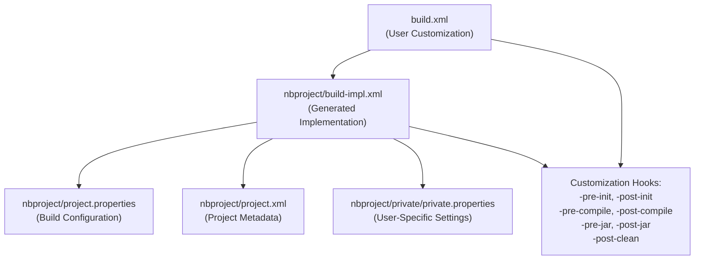
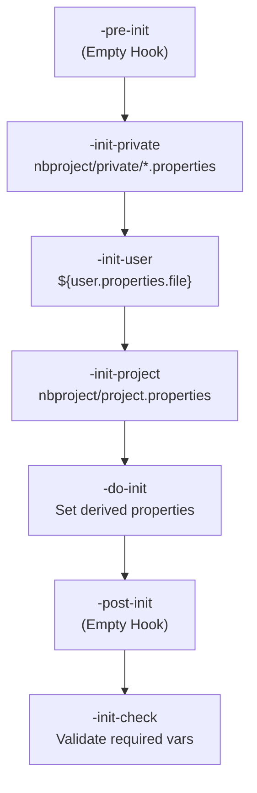
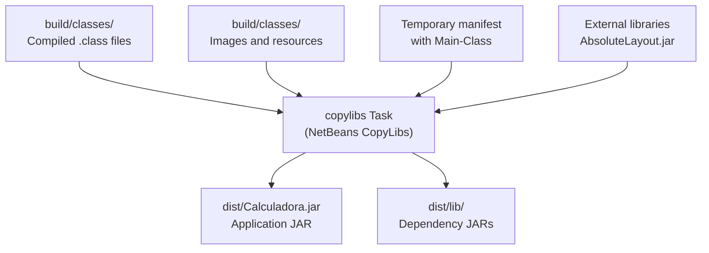
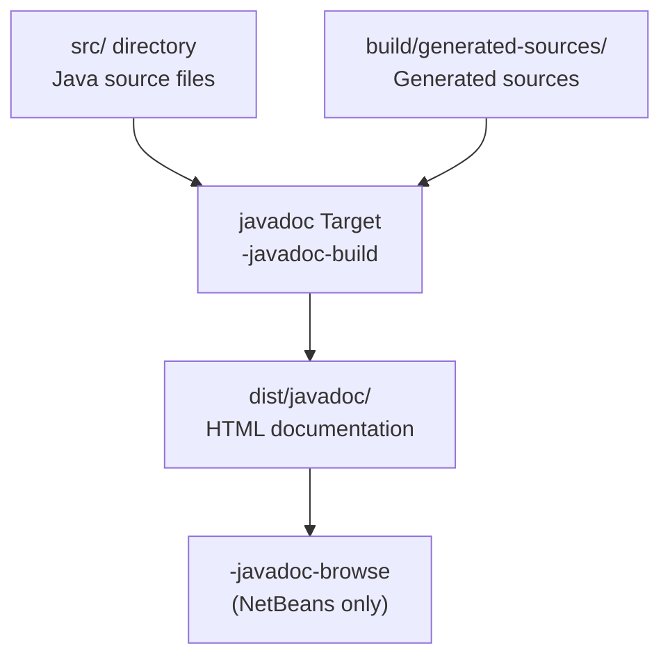

# Build System

> **Relevant source files**
> * [README.md](https://github.com/ricardo-alan/SimpleCalculator/blob/e9524f29/README.md)
> * [build.xml](https://github.com/ricardo-alan/SimpleCalculator/blob/e9524f29/build.xml)
> * [nbproject/build-impl.xml](https://github.com/ricardo-alan/SimpleCalculator/blob/e9524f29/nbproject/build-impl.xml)

## Purpose and Scope

This document provides a comprehensive overview of the SimpleCalculator's Apache Ant-based build system, including its architecture, lifecycle, and key targets. The build system is configured through NetBeans-generated files and handles compilation, testing, packaging, and distribution of the calculator application.

For detailed information on specific aspects of the build system:

* Build file structure and customization points: see [Build Configuration](/ricardo-alan/SimpleCalculator/5.1-build-configuration)
* Detailed phase-by-phase execution flow: see [Build Lifecycle](/ricardo-alan/SimpleCalculator/5.2-build-lifecycle)
* JAR packaging and library management: see [Distribution and Packaging](/ricardo-alan/SimpleCalculator/5.3-distribution-and-packaging)
* NetBeans IDE integration details: see [NetBeans Integration](/ricardo-alan/SimpleCalculator/5.4-netbeans-integration)

**Sources:** [README.md L16-L23](https://github.com/ricardo-alan/SimpleCalculator/blob/e9524f29/README.md#L16-L23)

 [build.xml L1-L73](https://github.com/ricardo-alan/SimpleCalculator/blob/e9524f29/build.xml#L1-L73)

 [nbproject/build-impl.xml L1-L30](https://github.com/ricardo-alan/SimpleCalculator/blob/e9524f29/nbproject/build-impl.xml#L1-L30)

---

## Build System Architecture

The SimpleCalculator uses Apache Ant 1.8.0+ as its build automation tool, following the NetBeans Java SE project structure. The build system consists of two primary XML files that work in tandem:

| File | Purpose | Editability |
| --- | --- | --- |
| `build.xml` | User customization hooks and overrides | User-editable |
| `nbproject/build-impl.xml` | Generated build logic and targets | Auto-generated, do not edit |

The `build.xml` file imports `build-impl.xml` and provides pre-defined extension points (e.g., `-pre-compile`, `-post-jar`) where developers can inject custom build logic without modifying the generated implementation.

**Sources:** [build.xml L1-L12](https://github.com/ricardo-alan/SimpleCalculator/blob/e9524f29/build.xml#L1-L12)

 [nbproject/build-impl.xml L1-L5](https://github.com/ricardo-alan/SimpleCalculator/blob/e9524f29/nbproject/build-impl.xml#L1-L5)

---

## Build File Relationship



**Sources:** [build.xml L10-L12](https://github.com/ricardo-alan/SimpleCalculator/blob/e9524f29/build.xml#L10-L12)

 [nbproject/build-impl.xml L40-L54](https://github.com/ricardo-alan/SimpleCalculator/blob/e9524f29/nbproject/build-impl.xml#L40-L54)

 [build.xml L13-L72](https://github.com/ricardo-alan/SimpleCalculator/blob/e9524f29/build.xml#L13-L72)

---

## Primary Build Targets

The build system exposes the following primary targets for developers and the NetBeans IDE:

### Core Build Targets

| Target | Description | Dependencies |
| --- | --- | --- |
| `default` | Builds, tests, and generates documentation | `test`, `jar`, `javadoc` |
| `init` | Initializes build properties and validates configuration | Multiple initialization sub-targets |
| `compile` | Compiles Java source files to `build/classes/` | `init`, `deps-jar` |
| `jar` | Packages compiled classes into `dist/Calculadora.jar` | `init`, `compile` |
| `test` | Runs JUnit/TestNG unit tests | `compile-test` |
| `clean` | Removes `build/` and `dist/` directories | `init`, `deps-clean` |

**Sources:** [nbproject/build-impl.xml L30](https://github.com/ricardo-alan/SimpleCalculator/blob/e9524f29/nbproject/build-impl.xml#L30-L30)

 [nbproject/build-impl.xml L885](https://github.com/ricardo-alan/SimpleCalculator/blob/e9524f29/nbproject/build-impl.xml#L885-L885)

 [nbproject/build-impl.xml L945](https://github.com/ricardo-alan/SimpleCalculator/blob/e9524f29/nbproject/build-impl.xml#L945-L945)

 [nbproject/build-impl.xml L1033](https://github.com/ricardo-alan/SimpleCalculator/blob/e9524f29/nbproject/build-impl.xml#L1033-L1033)

 [nbproject/build-impl.xml L1300](https://github.com/ricardo-alan/SimpleCalculator/blob/e9524f29/nbproject/build-impl.xml#L1300-L1300)

 [nbproject/build-impl.xml L1400](https://github.com/ricardo-alan/SimpleCalculator/blob/e9524f29/nbproject/build-impl.xml#L1400-L1400)

### Execution and Development Targets

| Target | Description | Key Parameters |
| --- | --- | --- |
| `run` | Executes the compiled application | Uses `main.class` property |
| `debug` | Launches application with JPDA debugger attached | Requires NetBeans IDE |
| `javadoc` | Generates API documentation in `dist/javadoc/` | Uses `javadoc.*` properties |
| `profile` | Profiles application performance | Requires NetBeans profiler |

**Sources:** [nbproject/build-impl.xml L1039-L1045](https://github.com/ricardo-alan/SimpleCalculator/blob/e9524f29/nbproject/build-impl.xml#L1039-L1045)

 [nbproject/build-impl.xml L1075](https://github.com/ricardo-alan/SimpleCalculator/blob/e9524f29/nbproject/build-impl.xml#L1075-L1075)

 [nbproject/build-impl.xml L1240](https://github.com/ricardo-alan/SimpleCalculator/blob/e9524f29/nbproject/build-impl.xml#L1240-L1240)

 [nbproject/build-impl.xml L1172-L1175](https://github.com/ricardo-alan/SimpleCalculator/blob/e9524f29/nbproject/build-impl.xml#L1172-L1175)

---

## Build Lifecycle Flow

```mermaid
flowchart TD

START["Build Invocation<br>(ant jar)"]
INIT_PHASE["Initialization Phase<br>Target: init"]
INIT_PRIVATE["-init-private<br>Load private.properties"]
INIT_USER["-init-user<br>Load user.properties"]
INIT_PROJECT["-init-project<br>Load project.properties"]
INIT_CHECK["-init-check<br>Validate required properties"]
COMPILE_PHASE["Compilation Phase<br>Target: compile"]
PRE_COMPILE["-pre-compile<br>(Customization Hook)"]
DO_COMPILE["-do-compile<br>javac compilation"]
COPY_RESOURCES["Copy resources from src/<br>to build/classes/"]
POST_COMPILE["-post-compile<br>(Customization Hook)"]
JAR_PHASE["Packaging Phase<br>Target: jar"]
PRE_JAR["-pre-jar<br>(Customization Hook)"]
MANIFEST["Generate/Copy Manifest<br>Set Main-Class attribute"]
COPYLIBS["-do-jar-copylibs<br>Package JAR + dependencies"]
CREATE_JAR["Create dist/Calculadora.jar<br>Copy lib/AbsoluteLayout.jar"]
POST_JAR["-post-jar<br>(Customization Hook)"]
END["Build Complete<br>dist/Calculadora.jar"]

START --> INIT_PHASE
INIT_PHASE --> INIT_PRIVATE
INIT_PRIVATE --> INIT_USER
INIT_USER --> INIT_PROJECT
INIT_PROJECT --> INIT_CHECK
INIT_CHECK --> COMPILE_PHASE
COMPILE_PHASE --> PRE_COMPILE
PRE_COMPILE --> DO_COMPILE
DO_COMPILE --> COPY_RESOURCES
COPY_RESOURCES --> POST_COMPILE
POST_COMPILE --> JAR_PHASE
JAR_PHASE --> PRE_JAR
PRE_JAR --> MANIFEST
MANIFEST --> COPYLIBS
COPYLIBS --> CREATE_JAR
CREATE_JAR --> POST_JAR
POST_JAR --> END
```



**Sources:** [nbproject/build-impl.xml L36-L231](https://github.com/ricardo-alan/SimpleCalculator/blob/e9524f29/nbproject/build-impl.xml#L36-L231)

 [nbproject/build-impl.xml L914-L944](https://github.com/ricardo-alan/SimpleCalculator/blob/e9524f29/nbproject/build-impl.xml#L914-L944)

 [nbproject/build-impl.xml L965-L1032](https://github.com/ricardo-alan/SimpleCalculator/blob/e9524f29/nbproject/build-impl.xml#L965-L1032)

---

## Initialization Targets

The initialization phase establishes the build environment by loading properties and validating configuration. This phase executes multiple sub-targets in a specific order:

### Property Loading Sequence



Key properties established during initialization:

| Property | Example Value | Description |
| --- | --- | --- |
| `src.dir` | `src` | Source code directory |
| `build.dir` | `build` | Temporary build output directory |
| `build.classes.dir` | `build/classes` | Compiled bytecode location |
| `dist.dir` | `dist` | Final distribution directory |
| `dist.jar` | `dist/Calculadora.jar` | Output JAR file path |
| `main.class` | `calculadora.Calculadora` | Application entry point |
| `javac.source` | `1.8` | Java source compatibility |
| `javac.target` | `1.8` | Java target compatibility |

**Sources:** [nbproject/build-impl.xml L40-L55](https://github.com/ricardo-alan/SimpleCalculator/blob/e9524f29/nbproject/build-impl.xml#L40-L55)

 [nbproject/build-impl.xml L232-L242](https://github.com/ricardo-alan/SimpleCalculator/blob/e9524f29/nbproject/build-impl.xml#L232-L242)

---

## Compilation Process

The compilation phase transforms Java source files and resources into executable bytecode:

### Compilation Macros

The build system uses custom Ant macros defined in the `j2seproject3` namespace:

**`j2seproject3:javac`** - Invokes the Java compiler with project-specific settings:

* Source directory: `${src.dir}` (default: `src`)
* Destination: `${build.classes.dir}` (default: `build/classes`)
* Classpath: `${javac.classpath}` (includes external libraries)
* Encoding: `${source.encoding}` (typically UTF-8)
* Debug symbols: `${javac.debug}` (default: `true`)

**Sources:** [nbproject/build-impl.xml L253-L292](https://github.com/ricardo-alan/SimpleCalculator/blob/e9524f29/nbproject/build-impl.xml#L253-L292)

 [nbproject/build-impl.xml L929-L933](https://github.com/ricardo-alan/SimpleCalculator/blob/e9524f29/nbproject/build-impl.xml#L929-L933)

### Resource Copying

After Java compilation, the build system copies non-Java resources (images, form files) from the source tree to the build output:

```xml
<copy todir="${build.classes.dir}">
    <fileset dir="${src.dir}" 
             excludes="${build.classes.excludes},${excludes}" 
             includes="${includes}"/>
</copy>
```

This ensures that image assets in [src/images/](https://github.com/ricardo-alan/SimpleCalculator/blob/e9524f29/src/images/)

 are bundled into the final JAR.

**Sources:** [nbproject/build-impl.xml L931-L933](https://github.com/ricardo-alan/SimpleCalculator/blob/e9524f29/nbproject/build-impl.xml#L931-L933)

---

## JAR Packaging Strategy

The packaging phase creates the distributable `Calculadora.jar` file using the `do.mkdist` distribution strategy, which packages the application JAR and copies dependency JARs to `dist/lib/`.

### Manifest Generation

The build system generates or modifies the JAR manifest through the following sequence:

1. **Create/Copy Base Manifest** (`-do-jar-create-manifest` or `-do-jar-copy-manifest`) * Creates temporary manifest file in `${build.dir}` * If `manifest.file` exists, copies it as the base
2. **Set Main-Class Attribute** (`-do-jar-set-mainclass`) * Adds `Main-Class: calculadora.Calculadora` to manifest * Only executes if `main.class` property is set
3. **Set Class-Path Attribute** (within `-do-jar-copylibs`) * Constructs relative classpath: `lib/AbsoluteLayout.jar` * Enables JAR to locate dependencies at runtime

**Sources:** [nbproject/build-impl.xml L973-L998](https://github.com/ricardo-alan/SimpleCalculator/blob/e9524f29/nbproject/build-impl.xml#L973-L998)

 [nbproject/build-impl.xml L981-L984](https://github.com/ricardo-alan/SimpleCalculator/blob/e9524f29/nbproject/build-impl.xml#L981-L984)

### CopyLibs Task

The `copylibs` macro packages the application and manages dependencies:



The `copylibs` task is defined as an Ant macro at [nbproject/build-impl.xml L823-L852](https://github.com/ricardo-alan/SimpleCalculator/blob/e9524f29/nbproject/build-impl.xml#L823-L852)

 and invoked at [nbproject/build-impl.xml L999-L1003](https://github.com/ricardo-alan/SimpleCalculator/blob/e9524f29/nbproject/build-impl.xml#L999-L1003)

 It uses the NetBeans `CopyLibs` library to:

1. Create the main JAR from `build/classes/` contents
2. Copy runtime dependencies to `dist/lib/`
3. Rebase classpath references to relative paths
4. Generate proper manifest with `Class-Path` attribute

**Sources:** [nbproject/build-impl.xml L823-L852](https://github.com/ricardo-alan/SimpleCalculator/blob/e9524f29/nbproject/build-impl.xml#L823-L852)

 [nbproject/build-impl.xml L999-L1003](https://github.com/ricardo-alan/SimpleCalculator/blob/e9524f29/nbproject/build-impl.xml#L999-L1003)

 [nbproject/build-impl.xml L843-L850](https://github.com/ricardo-alan/SimpleCalculator/blob/e9524f29/nbproject/build-impl.xml#L843-L850)

---

## Distribution Configuration

The build system determines whether to use the `mkdist` strategy (JAR + lib directory) or standalone JAR based on the `do.mkdist` property:

```xml
<condition property="do.mkdist">
    <and>
        <isset property="do.archive"/>
        <isset property="libs.CopyLibs.classpath"/>
        <not>
            <istrue value="${mkdist.disabled}"/>
        </not>
    </and>
</condition>
```

For SimpleCalculator, this condition evaluates to `true`, resulting in:

* `dist/Calculadora.jar` - Application JAR with manifest
* `dist/lib/AbsoluteLayout.jar` - NetBeans layout library

The JAR can be executed with: `java -jar dist/Calculadora.jar`

**Sources:** [nbproject/build-impl.xml L90-L98](https://github.com/ricardo-alan/SimpleCalculator/blob/e9524f29/nbproject/build-impl.xml#L90-L98)

 [nbproject/build-impl.xml L1001-L1003](https://github.com/ricardo-alan/SimpleCalculator/blob/e9524f29/nbproject/build-impl.xml#L1001-L1003)

---

## Customization Hooks

The `build.xml` file provides empty placeholder targets that developers can override to inject custom build logic without modifying the generated `build-impl.xml`:

### Available Hook Targets

| Hook Target | Execution Point | Common Use Cases |
| --- | --- | --- |
| `-pre-init` | Before property initialization | Set custom property files |
| `-post-init` | After property initialization | Override computed properties |
| `-pre-compile` | Before Java compilation | Code generation, preprocessing |
| `-post-compile` | After Java compilation | Bytecode manipulation, obfuscation |
| `-pre-jar` | Before JAR creation | Additional resource bundling |
| `-post-jar` | After JAR creation | Signing, native launcher creation |
| `-post-clean` | After clean operation | Remove additional build artifacts |

Example customization from [build.xml L37-L41](https://github.com/ricardo-alan/SimpleCalculator/blob/e9524f29/build.xml#L37-L41)

:

```xml
<target name="-post-compile">
    <obfuscate>
        <fileset dir="${build.classes.dir}"/>
    </obfuscate>
</target>
```

**Sources:** [build.xml L13-L44](https://github.com/ricardo-alan/SimpleCalculator/blob/e9524f29/build.xml#L13-L44)

 [build.xml L36-L41](https://github.com/ricardo-alan/SimpleCalculator/blob/e9524f29/build.xml#L36-L41)

---

## Testing Support

The build system includes comprehensive testing infrastructure supporting both JUnit and TestNG frameworks:

### Test Compilation

Test sources in `${test.src.dir}` are compiled to `${build.test.classes.dir}` with classpath including:

* Application classes from `${build.classes.dir}`
* Test libraries (JUnit/TestNG)
* Runtime dependencies

**Sources:** [nbproject/build-impl.xml L1246-L1265](https://github.com/ricardo-alan/SimpleCalculator/blob/e9524f29/nbproject/build-impl.xml#L1246-L1265)

### Test Execution Targets

| Target | Purpose | Usage |
| --- | --- | --- |
| `test` | Runs all unit tests matching `**/*Test.java` | `ant test` |
| `test-single` | Runs tests matching `${test.includes}` | Set `test.includes` property |
| `test-single-method` | Runs a specific test method | Set `test.class` and `test.method` |

The test framework is auto-detected based on classpath availability:

* JUnit detection: [nbproject/build-impl.xml L205-L209](https://github.com/ricardo-alan/SimpleCalculator/blob/e9524f29/nbproject/build-impl.xml#L205-L209)
* TestNG detection: [nbproject/build-impl.xml L211-L213](https://github.com/ricardo-alan/SimpleCalculator/blob/e9524f29/nbproject/build-impl.xml#L211-L213)

**Sources:** [nbproject/build-impl.xml L1289-L1320](https://github.com/ricardo-alan/SimpleCalculator/blob/e9524f29/nbproject/build-impl.xml#L1289-L1320)

 [nbproject/build-impl.xml L1292-L1293](https://github.com/ricardo-alan/SimpleCalculator/blob/e9524f29/nbproject/build-impl.xml#L1292-L1293)

---

## Clean Target

The `clean` target removes all build artifacts to ensure a fresh build:

```sql
<target name="-do-clean">
    <delete dir="${build.dir}"/>
    <delete dir="${dist.dir}" followsymlinks="false" includeemptydirs="true"/>
</target>
```

This removes:

* `build/` - All compiled classes and intermediate build files
* `dist/` - The packaged JAR and copied libraries

The `followsymlinks="false"` attribute prevents deletion of files outside the project directory if symlinks are present.

**Sources:** [nbproject/build-impl.xml L1392-L1395](https://github.com/ricardo-alan/SimpleCalculator/blob/e9524f29/nbproject/build-impl.xml#L1392-L1395)

 [nbproject/build-impl.xml L1400](https://github.com/ricardo-alan/SimpleCalculator/blob/e9524f29/nbproject/build-impl.xml#L1400-L1400)

---

## Debug and Run Targets

### Run Target

The `run` target executes the compiled application without packaging:

```xml
<target name="run" depends="init,compile">
    <j2seproject1:java>
        <customize>
            <arg line="${application.args}"/>
        </customize>
    </j2seproject1:java>
</target>
```

This uses the `j2seproject1:java` macro which:

1. Sets the classpath to `${run.classpath}`
2. Executes `${main.class}` (i.e., `calculadora.Calculadora`)
3. Applies JVM arguments from `${run.jvmargs}`
4. Passes command-line arguments from `${application.args}`

**Sources:** [nbproject/build-impl.xml L1039-L1045](https://github.com/ricardo-alan/SimpleCalculator/blob/e9524f29/nbproject/build-impl.xml#L1039-L1045)

 [nbproject/build-impl.xml L798-L821](https://github.com/ricardo-alan/SimpleCalculator/blob/e9524f29/nbproject/build-impl.xml#L798-L821)

### Debug Target

The `debug` target launches the application with JPDA debugging support:

```
<target name="debug" depends="init,compile,-debug-start-debugger,-debug-start-debuggee" 
        if="netbeans.home">
```

This establishes a two-part debugging session:

1. **`-debug-start-debugger`** - Starts NetBeans JPDA listener on `${jpda.address}`
2. **`-debug-start-debuggee`** - Launches application with debug flags: * `-Xdebug` * `-Xrunjdwp:transport=${debug-transport},address=${jpda.address}`

**Sources:** [nbproject/build-impl.xml L1075](https://github.com/ricardo-alan/SimpleCalculator/blob/e9524f29/nbproject/build-impl.xml#L1075-L1075)

 [nbproject/build-impl.xml L1062-L1074](https://github.com/ricardo-alan/SimpleCalculator/blob/e9524f29/nbproject/build-impl.xml#L1062-L1074)

 [nbproject/build-impl.xml L772-L796](https://github.com/ricardo-alan/SimpleCalculator/blob/e9524f29/nbproject/build-impl.xml#L772-L796)

---

## Javadoc Generation

The `javadoc` target generates API documentation for the project:



Key javadoc parameters:

* **Source encoding**: `${javadoc.encoding.used}` (typically UTF-8)
* **Source version**: `${javac.source}` (Java 1.8)
* **Output directory**: `${dist.javadoc.dir}` (`dist/javadoc/`)
* **Window title**: `${javadoc.windowtitle}`

**Sources:** [nbproject/build-impl.xml L1202-L1236](https://github.com/ricardo-alan/SimpleCalculator/blob/e9524f29/nbproject/build-impl.xml#L1202-L1236)

 [nbproject/build-impl.xml L1240](https://github.com/ricardo-alan/SimpleCalculator/blob/e9524f29/nbproject/build-impl.xml#L1240-L1240)

---

## Build System Properties

Critical build properties are defined in `nbproject/project.properties` and control compilation, packaging, and execution behavior. These properties can be overridden via:

1. `nbproject/private/private.properties` (user-specific, not version-controlled)
2. `nbproject/private/config.properties` (build configuration-specific)
3. Command line: `ant -Dproperty=value target`

### Property Precedence

Properties are loaded in this order (later overrides earlier):

1. [nbproject/build-impl.xml L40-L43](https://github.com/ricardo-alan/SimpleCalculator/blob/e9524f29/nbproject/build-impl.xml#L40-L43)  - `nbproject/private/*.properties`
2. [nbproject/build-impl.xml L45-L50](https://github.com/ricardo-alan/SimpleCalculator/blob/e9524f29/nbproject/build-impl.xml#L45-L50)  - `${user.properties.file}`
3. [nbproject/build-impl.xml L52-L54](https://github.com/ricardo-alan/SimpleCalculator/blob/e9524f29/nbproject/build-impl.xml#L52-L54)  - `nbproject/project.properties`

**Sources:** [nbproject/build-impl.xml L40-L54](https://github.com/ricardo-alan/SimpleCalculator/blob/e9524f29/nbproject/build-impl.xml#L40-L54)

---

## Ant Version Requirement

The build system requires Apache Ant 1.8.0 or higher:

```xml
<fail message="Please build using Ant 1.8.0 or higher.">
    <condition>
        <not>
            <antversion atleast="1.8.0"/>
        </not>
    </condition>
</fail>
```

This check occurs at the beginning of `build-impl.xml` to ensure compatibility with features like annotation processing support and updated macro definitions.

**Sources:** [nbproject/build-impl.xml L23-L29](https://github.com/ricardo-alan/SimpleCalculator/blob/e9524f29/nbproject/build-impl.xml#L23-L29)