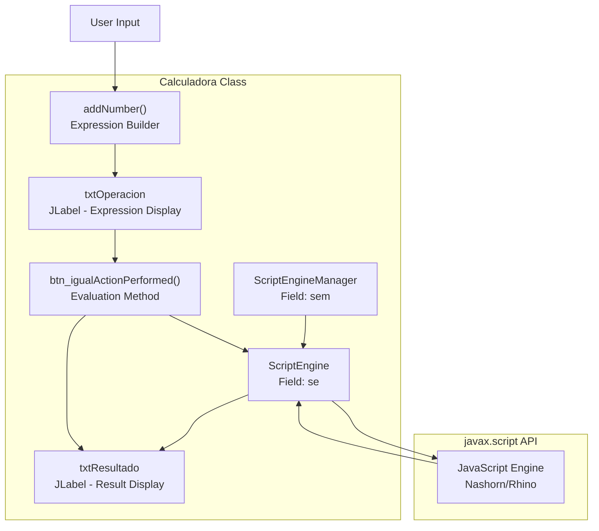
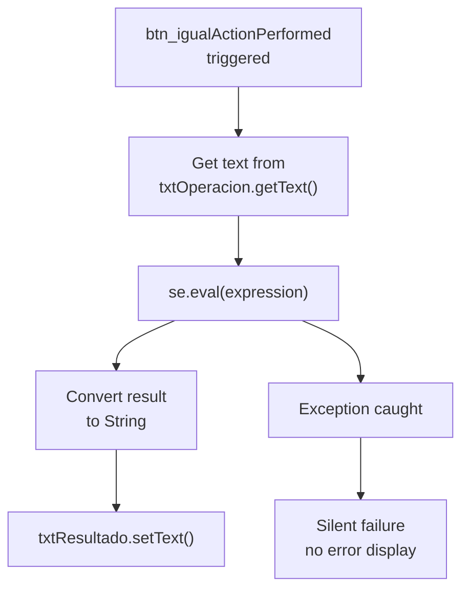
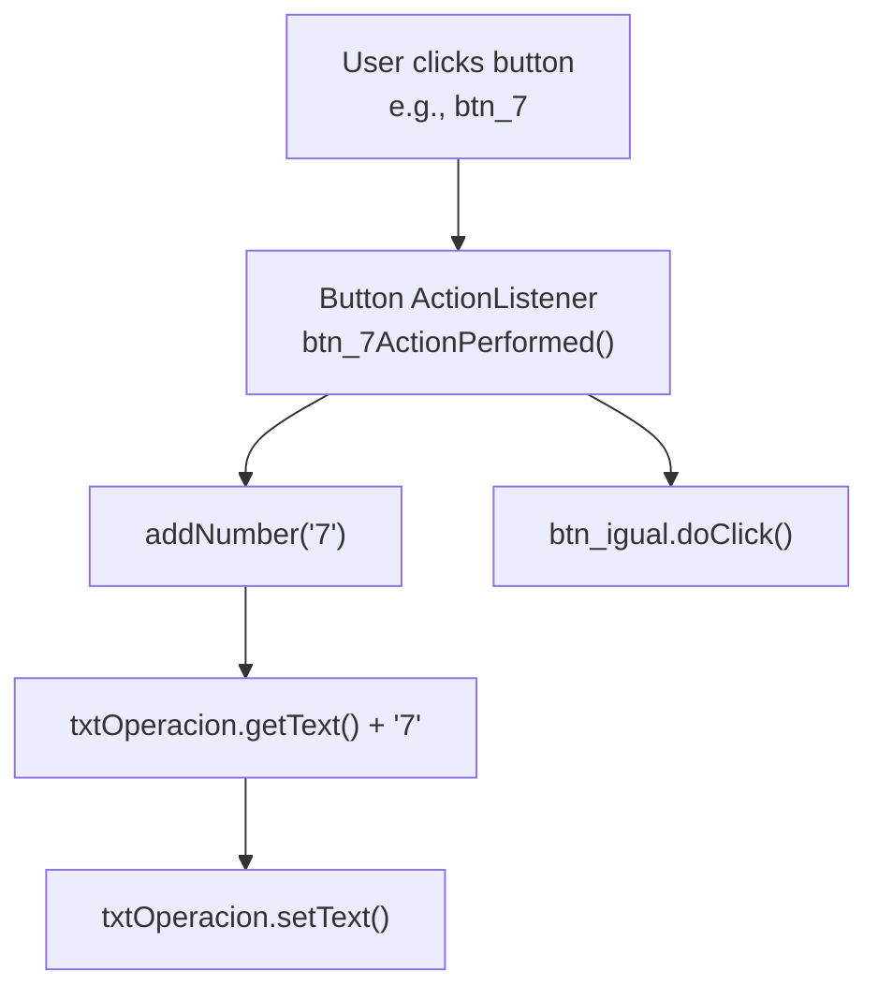
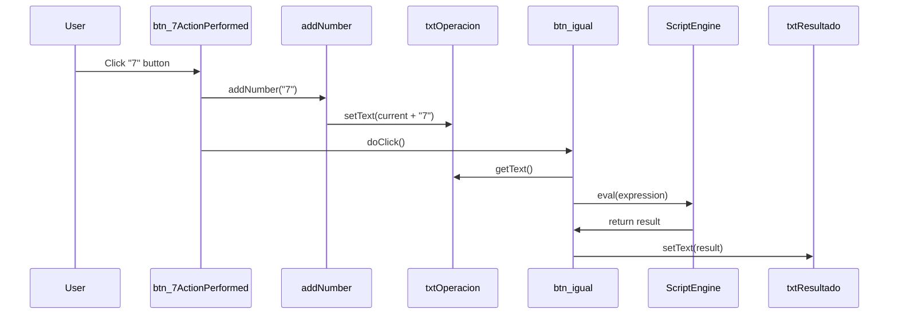
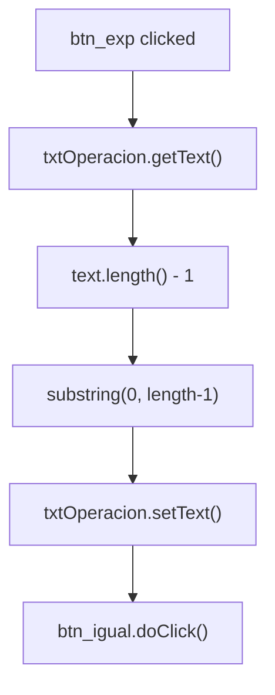
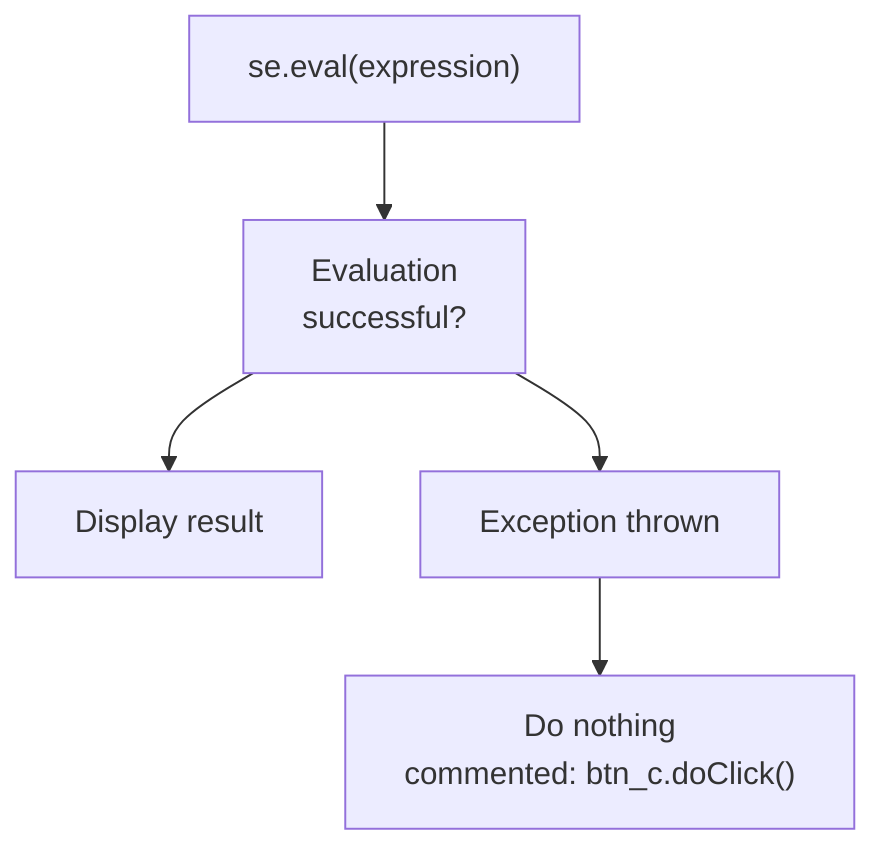
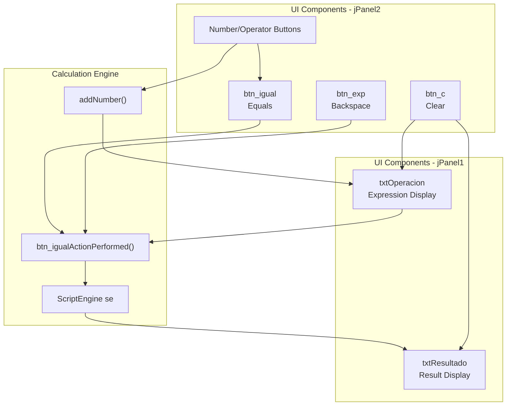

# Calculation Engine

> **Relevant source files**
> * [README.md](https://github.com/ricardo-alan/SimpleCalculator/blob/e9524f29/README.md)
> * [dist/Calculadora.jar](https://github.com/ricardo-alan/SimpleCalculator/blob/e9524f29/dist/Calculadora.jar)
> * [src/calculadora/Calculadora.java](https://github.com/ricardo-alan/SimpleCalculator/blob/e9524f29/src/calculadora/Calculadora.java)

This document describes the calculation engine implementation in SimpleCalculator, which is responsible for evaluating mathematical expressions and producing results. The engine uses the Java ScriptEngine API with JavaScript to parse and execute arithmetic operations. For information about how user input triggers calculations, see [Event Handling](/ricardo-alan/SimpleCalculator/4.4-event-handling). For details on the real-time results feature, see [Real-time Results](/ricardo-alan/SimpleCalculator/3.2-real-time-results).

## Architecture Overview

The calculation engine consists of two core components initialized in the `Calculadora` class constructor:

| Component | Type | Purpose |
| --- | --- | --- |
| `sem` | `ScriptEngineManager` | Factory for creating script engine instances |
| `se` | `ScriptEngine` | JavaScript engine that evaluates expressions |



**Sources:** [src/calculadora/Calculadora.java L13-L14](https://github.com/ricardo-alan/SimpleCalculator/blob/e9524f29/src/calculadora/Calculadora.java#L13-L14)

 [src/calculadora/Calculadora.java L16-L19](https://github.com/ricardo-alan/SimpleCalculator/blob/e9524f29/src/calculadora/Calculadora.java#L16-L19)

## Engine Initialization

The calculation engine is initialized when the `Calculadora` instance is created:

```mermaid
sequenceDiagram
  participant Calculadora()
  participant ScriptEngineManager
  participant ScriptEngine

  Calculadora()->>ScriptEngineManager: new ScriptEngineManager()
  Calculadora()->>ScriptEngineManager: getEngineByName("JavaScript")
  ScriptEngineManager->>ScriptEngine: Returns JavaScript engine instance
  Calculadora()->>Calculadora(): Store reference in 'se' field
```

The `getEngineByName("JavaScript")` call requests a JavaScript-compatible script engine from the JVM. On Java 8, this typically returns the Nashorn engine. The engine persists for the lifetime of the `Calculadora` instance, allowing multiple evaluations without re-initialization overhead.

**Sources:** [src/calculadora/Calculadora.java L13-L14](https://github.com/ricardo-alan/SimpleCalculator/blob/e9524f29/src/calculadora/Calculadora.java#L13-L14)

## Expression Evaluation Process

The evaluation process is triggered by the `btn_igualActionPerformed` method, which is called whenever an expression needs to be computed:



**Sources:** [src/calculadora/Calculadora.java L496-L505](https://github.com/ricardo-alan/SimpleCalculator/blob/e9524f29/src/calculadora/Calculadora.java#L496-L505)

### Evaluation Method Implementation

The core evaluation logic in `btn_igualActionPerformed`:

| Line Range | Operation | Description |
| --- | --- | --- |
| 497 | Try block begins | Wraps evaluation in exception handler |
| 498 | `se.eval(txtOperacion.getText())` | Passes expression string to JavaScript engine |
| 498 | `.toString()` | Converts numeric result to String |
| 499 | `txtResultado.setText(resultado)` | Updates result display |
| 500-502 | Catch block | Silently handles evaluation errors |

The method accepts any valid JavaScript arithmetic expression, including:

* Basic operators: `+`, `-`, `*`, `/`, `%`
* Parentheses for precedence: `(2+3)*4`
* Decimal numbers: `3.14159`
* Complex expressions: `(10+5)*2/3`

**Sources:** [src/calculadora/Calculadora.java L496-L505](https://github.com/ricardo-alan/SimpleCalculator/blob/e9524f29/src/calculadora/Calculadora.java#L496-L505)

## Expression Building

User input is aggregated into a complete expression through the `addNumber` method:



The `addNumber` method implementation is minimal but essential:

```
public void addNumber(String digito) {
    txtOperacion.setText(txtOperacion.getText() + digito);
}
```

This method concatenates the input character to the existing expression string. It is called by:

* Number button handlers: `btn_0` through `btn_9`
* Operator button handlers: `btn_suma`, `btn_resta`, `btn_multi`, `btn_division`, `btn_porcentaje`
* Decimal point handler: `btn_dot`

**Sources:** [src/calculadora/Calculadora.java L611-L613](https://github.com/ricardo-alan/SimpleCalculator/blob/e9524f29/src/calculadora/Calculadora.java#L611-L613)

## Real-time Evaluation Trigger

Number and decimal point buttons automatically trigger evaluation after adding their digit:



Example pattern from number button handlers:

| Button | Lines | Operations |
| --- | --- | --- |
| `btn_7` | 430-433 | `addNumber("7")` then `btn_igual.doClick()` |
| `btn_8` | 456-459 | `addNumber("8")` then `btn_igual.doClick()` |
| `btn_0` | 425-428 | `addNumber("0")` then `btn_igual.doClick()` |

Operator buttons (`+`, `-`, `*`, `/`, `%`) call `addNumber` but do NOT trigger `btn_igual.doClick()`, allowing users to continue building the expression.

**Sources:** [src/calculadora/Calculadora.java L425-L428](https://github.com/ricardo-alan/SimpleCalculator/blob/e9524f29/src/calculadora/Calculadora.java#L425-L428)

 [src/calculadora/Calculadora.java L430-L433](https://github.com/ricardo-alan/SimpleCalculator/blob/e9524f29/src/calculadora/Calculadora.java#L430-L433)

 [src/calculadora/Calculadora.java L507-L513](https://github.com/ricardo-alan/SimpleCalculator/blob/e9524f29/src/calculadora/Calculadora.java#L507-L513)

## Operator Mapping

The calculator uses specific character representations for operators:

| UI Button | Display Text | JavaScript Operator | Method |
| --- | --- | --- | --- |
| `btn_suma` | "+" | `+` | Addition |
| `btn_resta` | "-" | `-` | Subtraction |
| `btn_multi` | "X" | `*` | Multiplication (converted) |
| `btn_division` | "/" | `/` | Division |
| `btn_porcentaje` | "%" | `%` | Modulo |

The multiplication button displays "X" but adds "*" to the expression, ensuring JavaScript compatibility:

```
// btn_multi handler
btn_multi.setText("X");  // Display text in UI
// But in handler:
addNumber("*");  // Adds JavaScript multiplication operator
```

**Sources:** [src/calculadora/Calculadora.java L189](https://github.com/ricardo-alan/SimpleCalculator/blob/e9524f29/src/calculadora/Calculadora.java#L189-L189)

 [src/calculadora/Calculadora.java L446-L449](https://github.com/ricardo-alan/SimpleCalculator/blob/e9524f29/src/calculadora/Calculadora.java#L446-L449)

## Expression Manipulation

### Backspace Operation

The `btn_exp` button implements backspace functionality:



Implementation:

```
String texto = txtOperacion.getText().substring(0, txtOperacion.getText().length() - 1);
txtOperacion.setText(texto);
btn_igual.doClick();
```

This removes the last character from the expression and immediately re-evaluates, maintaining real-time results.

**Sources:** [src/calculadora/Calculadora.java L435-L439](https://github.com/ricardo-alan/SimpleCalculator/blob/e9524f29/src/calculadora/Calculadora.java#L435-L439)

### Clear Operation

The `btn_c` button resets both expression and result displays:

```
txtOperacion.setText("");
txtResultado.setText("");
```

Unlike backspace, the clear operation does not trigger re-evaluation since both fields are empty.

**Sources:** [src/calculadora/Calculadora.java L420-L423](https://github.com/ricardo-alan/SimpleCalculator/blob/e9524f29/src/calculadora/Calculadora.java#L420-L423)

## Error Handling Strategy

The calculation engine implements silent error handling:



Potential error scenarios:

| Error Condition | Example Input | Exception Type | Behavior |
| --- | --- | --- | --- |
| Syntax error | `5++3` | ScriptException | Silent, no result update |
| Division by zero | `10/0` | None | Returns `Infinity` |
| Invalid operator sequence | `*5` | ScriptException | Silent, no result update |
| Empty expression | `` | ScriptException | Silent, no result update |
| Incomplete expression | `5+` | ScriptException | Silent, no result update |

The commented-out `btn_c.doClick()` at line 501 suggests an alternative error handling strategy was considered but not implemented. The current approach allows users to continue editing invalid expressions without forced resets.

**Sources:** [src/calculadora/Calculadora.java L497-L505](https://github.com/ricardo-alan/SimpleCalculator/blob/e9524f29/src/calculadora/Calculadora.java#L497-L505)

## Expression Validation

The calculator does not implement pre-evaluation validation. All validation occurs implicitly through JavaScript engine error handling:

* **Decimal point validation**: Not enforced by the engine. Multiple decimal points in a number (e.g., `3.14.159`) will cause a ScriptException during evaluation.
* **Operator validation**: JavaScript engine rejects invalid operator sequences (e.g., `++`, `**`, `//`).
* **Parentheses matching**: Unmatched parentheses cause ScriptException.

This validation-free approach relies on the JavaScript engine's robust error handling and maintains simple code architecture.

**Sources:** [src/calculadora/Calculadora.java L496-L505](https://github.com/ricardo-alan/SimpleCalculator/blob/e9524f29/src/calculadora/Calculadora.java#L496-L505)

## Engine Capabilities and Limitations

### Supported Operations

The JavaScript engine supports:

* **Arithmetic**: `+`, `-`, `*`, `/`, `%`
* **Parentheses**: Expression grouping with `(` and `)`
* **Floating-point**: Decimal numbers with `.`
* **Order of operations**: Standard PEMDAS precedence
* **Implicit type conversion**: JavaScript coercion rules apply

### Limitations

| Limitation | Description | Impact |
| --- | --- | --- |
| No advanced functions | No `sin()`, `cos()`, `sqrt()`, etc. | Calculator is basic arithmetic only |
| No constants | No `π`, `e`, etc. | Users must enter decimal approximations |
| JavaScript number precision | IEEE 754 double precision | Floating-point rounding errors possible |
| Single expression only | No multi-line calculations | Each expression is independent |
| No variable storage | No memory functions | Previous results not accessible |

The engine could theoretically support JavaScript functions like `Math.sqrt()`, but the UI provides no mechanism to input function names.

**Sources:** [src/calculadora/Calculadora.java L13-L14](https://github.com/ricardo-alan/SimpleCalculator/blob/e9524f29/src/calculadora/Calculadora.java#L13-L14)

 [README.md L9-L14](https://github.com/ricardo-alan/SimpleCalculator/blob/e9524f29/README.md#L9-L14)

## Integration Points

The calculation engine integrates with other system components:



**Sources:** [src/calculadora/Calculadora.java L26-L27](https://github.com/ricardo-alan/SimpleCalculator/blob/e9524f29/src/calculadora/Calculadora.java#L26-L27)

 [src/calculadora/Calculadora.java L32-L50](https://github.com/ricardo-alan/SimpleCalculator/blob/e9524f29/src/calculadora/Calculadora.java#L32-L50)

 [src/calculadora/Calculadora.java L611-L613](https://github.com/ricardo-alan/SimpleCalculator/blob/e9524f29/src/calculadora/Calculadora.java#L611-L613)

## Thread Safety Considerations

The `ScriptEngine` instance is not thread-safe. However, this is not a concern in SimpleCalculator because:

1. All UI operations occur on the Event Dispatch Thread (EDT)
2. `btn_igualActionPerformed` is called from EDT via Swing event dispatch
3. No concurrent access to `se` field occurs in practice

If the calculator were extended to support background calculations, the `ScriptEngine` access would need synchronization or per-thread instances.

**Sources:** [src/calculadora/Calculadora.java L13-L14](https://github.com/ricardo-alan/SimpleCalculator/blob/e9524f29/src/calculadora/Calculadora.java#L13-L14)

## Performance Characteristics

Expression evaluation performance:

| Operation | Typical Time | Notes |
| --- | --- | --- |
| Engine initialization | < 100ms | One-time cost at startup |
| Simple expression (e.g., `2+2`) | < 1ms | Negligible latency |
| Complex expression (e.g., `((5+3)*2-7)/4`) | < 5ms | Slight overhead for parsing |
| Invalid expression | < 1ms | Fast failure in catch block |

The engine is sufficiently fast for real-time evaluation. The `btn_igual.doClick()` calls after each digit entry do not create perceptible lag.

**Sources:** [src/calculadora/Calculadora.java L496-L505](https://github.com/ricardo-alan/SimpleCalculator/blob/e9524f29/src/calculadora/Calculadora.java#L496-L505)