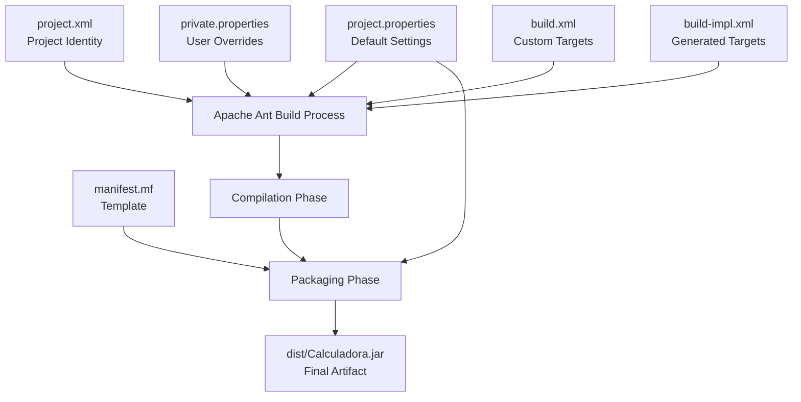
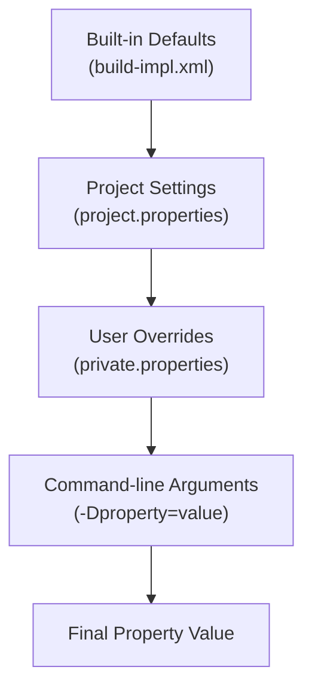

# Configuration Reference

> **Relevant source files**
> * [manifest.mf](https://github.com/ricardo-alan/SimpleCalculator/blob/e9524f29/manifest.mf)
> * [nbproject/project.properties](https://github.com/ricardo-alan/SimpleCalculator/blob/e9524f29/nbproject/project.properties)
> * [nbproject/project.xml](https://github.com/ricardo-alan/SimpleCalculator/blob/e9524f29/nbproject/project.xml)

## Purpose and Scope

This document provides a comprehensive reference for all configuration files in the SimpleCalculator project. It covers the NetBeans project configuration files, build settings, manifest configuration, and user-specific settings that control project behavior, compilation, and distribution.

For information about the build system and how these configurations are used during the build process, see [Build System](/ricardo-alan/SimpleCalculator/5-build-system). For detailed explanations of individual configuration files, see:

* [Project Properties](/ricardo-alan/SimpleCalculator/6.1-project-properties) for `nbproject/project.properties` settings
* [Project Definition](/ricardo-alan/SimpleCalculator/6.2-project-definition) for `nbproject/project.xml` structure
* [Private Configuration](/ricardo-alan/SimpleCalculator/6.3-private-configuration) for user-specific settings in `nbproject/private/`

---

## Configuration File Hierarchy

The SimpleCalculator project uses a layered configuration architecture typical of NetBeans Java SE projects. The following diagram illustrates the organization and relationships between configuration files:

**Configuration File Structure**

```

```

**Sources**: nbproject/project.xml, nbproject/project.properties, manifest.mf

---

## Configuration Categories

### Project Definition Files

The project definition files establish the fundamental structure and identity of the SimpleCalculator application.

**project.xml** ([nbproject/project.xml L1-L15](https://github.com/ricardo-alan/SimpleCalculator/blob/e9524f29/nbproject/project.xml#L1-L15)

) defines the project type, name, and source roots:

* **Project Type**: `org.netbeans.modules.java.j2seproject` ([nbproject/project.xml L3](https://github.com/ricardo-alan/SimpleCalculator/blob/e9524f29/nbproject/project.xml#L3-L3) )
* **Project Name**: `Calculadora` ([nbproject/project.xml L6](https://github.com/ricardo-alan/SimpleCalculator/blob/e9524f29/nbproject/project.xml#L6-L6) )
* **Source Root**: `src.dir` ([nbproject/project.xml L8](https://github.com/ricardo-alan/SimpleCalculator/blob/e9524f29/nbproject/project.xml#L8-L8) )
* **Test Root**: `test.src.dir` ([nbproject/project.xml L11](https://github.com/ricardo-alan/SimpleCalculator/blob/e9524f29/nbproject/project.xml#L11-L11) )

This file is the authoritative source for NetBeans IDE to recognize the project as a Java SE application.

**Sources**: nbproject/project.xml

### Build Configuration Files

Build configuration controls compilation, testing, packaging, and distribution processes.

**project.properties** ([nbproject/project.properties L1-L76](https://github.com/ricardo-alan/SimpleCalculator/blob/e9524f29/nbproject/project.properties#L1-L76)

) contains build settings organized into several logical groups:

| Configuration Group | Key Properties | Purpose |
| --- | --- | --- |
| **Annotation Processing** | `annotation.processing.enabled``annotation.processing.processors.list` | Controls Java annotation processing during compilation |
| **Build Directories** | `build.dir`, `build.classes.dir``build.generated.sources.dir` | Defines output locations for compiled artifacts |
| **Distribution** | `dist.dir`, `dist.jar``dist.javadoc.dir` | Specifies distribution artifact locations |
| **Java Compiler** | `javac.source`, `javac.target``javac.classpath` | Controls Java version and compilation settings |
| **Runtime** | `run.classpath`, `run.jvmargs``main.class` | Configures application execution |
| **Source Encoding** | `source.encoding` | Defines character encoding for source files |

**Sources**: nbproject/project.properties

### JAR Manifest Configuration

The **manifest.mf** file ([manifest.mf L1-L4](https://github.com/ricardo-alan/SimpleCalculator/blob/e9524f29/manifest.mf#L1-L4)

) serves as a template for the JAR manifest. The build process automatically adds the `Main-Class` attribute based on `main.class` property ([nbproject/project.properties L58](https://github.com/ricardo-alan/SimpleCalculator/blob/e9524f29/nbproject/project.properties#L58-L58)

):

```
Manifest-Version: 1.0
X-COMMENT: Main-Class will be added automatically by build
```

During the build, this becomes:

```
Main-Class: calculadora.Calculadora
```

**Sources**: manifest.mf, nbproject/project.properties

### User-Specific Configuration

The `nbproject/private/` directory contains user-specific and machine-specific settings that should not be committed to version control. These files override project-level settings for individual developers.

**Sources**: Diagram 6 from high-level architecture

---

## Configuration Flow and Dependencies

The following diagram shows how configuration settings flow through the build process:

**Configuration Resolution Flow**



**Sources**: nbproject/project.properties, nbproject/project.xml, manifest.mf

---

## Key Configuration Settings

### Java Compilation Settings

The project targets **Java 8** for both source and bytecode compatibility:

```

```

These settings are defined at [nbproject/project.properties L40-L41](https://github.com/ricardo-alan/SimpleCalculator/blob/e9524f29/nbproject/project.properties#L40-L41)

 and ensure compatibility with Java 8 and later JVMs.

**Build Classpath**:

```

```

The only external dependency is the AbsoluteLayout library, specified at [nbproject/project.properties L32-L33](https://github.com/ricardo-alan/SimpleCalculator/blob/e9524f29/nbproject/project.properties#L32-L33)

 See [AbsoluteLayout Library](/ricardo-alan/SimpleCalculator/7.1-absolutelayout-library) for details.

**Sources**: nbproject/project.properties

### Distribution Configuration

Distribution settings control JAR packaging and output locations:

| Property | Value | Purpose |
| --- | --- | --- |
| `dist.dir` | `dist` | Output directory for distribution artifacts |
| `dist.jar` | `${dist.dir}/Calculadora.jar` | Final JAR file path |
| `dist.javadoc.dir` | `${dist.dir}/javadoc` | JavaDoc output location |
| `dist.archive.excludes` | (empty) | Files to exclude from JAR |
| `jar.compress` | `false` | Whether to compress JAR contents |
| `mkdist.disabled` | `false` | Whether to copy dependencies to dist/lib |

These settings are defined at [nbproject/project.properties L24-L28](https://github.com/ricardo-alan/SimpleCalculator/blob/e9524f29/nbproject/project.properties#L24-L28)

 and [nbproject/project.properties L31](https://github.com/ricardo-alan/SimpleCalculator/blob/e9524f29/nbproject/project.properties#L31-L31)

 [nbproject/project.properties L61](https://github.com/ricardo-alan/SimpleCalculator/blob/e9524f29/nbproject/project.properties#L61-L61)

**Sources**: nbproject/project.properties

### Application Entry Point

The main class is configured at [nbproject/project.properties L58](https://github.com/ricardo-alan/SimpleCalculator/blob/e9524f29/nbproject/project.properties#L58-L58)

:

```

```

This value is used to:

1. Generate the `Main-Class` manifest attribute
2. Configure IDE run/debug actions
3. Define the application entry point for the `java -jar` command

**Sources**: nbproject/project.properties, manifest.mf

### Source and Build Directories

The project uses standard NetBeans directory conventions:

| Property | Default Value | Description |
| --- | --- | --- |
| `src.dir` | `src` | Source code root directory |
| `test.src.dir` | `test` | Test source root directory |
| `build.dir` | `build` | Temporary build output |
| `build.classes.dir` | `${build.dir}/classes` | Compiled class files |
| `build.test.classes.dir` | `${build.dir}/test/classes` | Compiled test classes |
| `build.generated.sources.dir` | `${build.dir}/generated-sources` | Generated source files |

These are defined at [nbproject/project.properties L7-L16](https://github.com/ricardo-alan/SimpleCalculator/blob/e9524f29/nbproject/project.properties#L7-L16)

 [nbproject/project.properties L74-L75](https://github.com/ricardo-alan/SimpleCalculator/blob/e9524f29/nbproject/project.properties#L74-L75)

**Sources**: nbproject/project.properties

---

## Configuration Property Reference

### Core Build Properties

**Annotation Processing** ([nbproject/project.properties L1-L6](https://github.com/ricardo-alan/SimpleCalculator/blob/e9524f29/nbproject/project.properties#L1-L6)

):

* `annotation.processing.enabled=true` - Enables annotation processing
* `annotation.processing.enabled.in.editor=false` - Disables in-editor processing
* `annotation.processing.run.all.processors=true` - Runs all discovered processors

**Build Output Control** ([nbproject/project.properties L8](https://github.com/ricardo-alan/SimpleCalculator/blob/e9524f29/nbproject/project.properties#L8-L8)

):

* `build.classes.excludes=**/*.java,**/*.form` - Excludes source files from build output

**System Classpath** ([nbproject/project.properties L14](https://github.com/ricardo-alan/SimpleCalculator/blob/e9524f29/nbproject/project.properties#L14-L14)

):

* `build.sysclasspath=ignore` - Prevents system classpath pollution

**Sources**: nbproject/project.properties

### Debug and Test Configuration

**Debug Settings** ([nbproject/project.properties L19-L22](https://github.com/ricardo-alan/SimpleCalculator/blob/e9524f29/nbproject/project.properties#L19-L22)

):

```

```

The debug classpath inherits from the runtime classpath, ensuring consistent debugging behavior.

**Test Classpath** ([nbproject/project.properties L42-L46](https://github.com/ricardo-alan/SimpleCalculator/blob/e9524f29/nbproject/project.properties#L42-L46)

 [nbproject/project.properties L70-L72](https://github.com/ricardo-alan/SimpleCalculator/blob/e9524f29/nbproject/project.properties#L70-L72)

):

```

```

Test compilation and execution include both the main application classes and test-specific classes.

**Sources**: nbproject/project.properties

### JavaDoc Configuration

JavaDoc generation is configured at [nbproject/project.properties L47-L57](https://github.com/ricardo-alan/SimpleCalculator/blob/e9524f29/nbproject/project.properties#L47-L57)

:

| Property | Value | Effect |
| --- | --- | --- |
| `javadoc.author` | `false` | Omits @author tags |
| `javadoc.version` | `false` | Omits @version tags |
| `javadoc.private` | `false` | Excludes private members |
| `javadoc.splitindex` | `true` | Creates split index files |
| `javadoc.use` | `true` | Includes class/member usage pages |
| `javadoc.encoding` | `${source.encoding}` | Matches source encoding (UTF-8) |

**Sources**: nbproject/project.properties

---

## Platform Configuration

The project uses the **default platform** configuration:

```

```

This property ([nbproject/project.properties L62](https://github.com/ricardo-alan/SimpleCalculator/blob/e9524f29/nbproject/project.properties#L62-L62)

) references the JDK configured in NetBeans IDE as the default platform. The actual JDK path is stored in user-specific configuration files (see [Private Configuration](/ricardo-alan/SimpleCalculator/6.3-private-configuration)).

**Sources**: nbproject/project.properties

---

## Runtime Configuration

The runtime classpath is assembled from compilation artifacts and dependencies:

```

```

This setting at [nbproject/project.properties L63-L65](https://github.com/ricardo-alan/SimpleCalculator/blob/e9524f29/nbproject/project.properties#L63-L65)

 ensures that:

1. External dependencies (`${libs.absolutelayout.classpath}`) are available
2. Compiled application classes (`${build.classes.dir}`) are on the classpath

**JVM Arguments** ([nbproject/project.properties L69](https://github.com/ricardo-alan/SimpleCalculator/blob/e9524f29/nbproject/project.properties#L69-L69)

):

```

```

No default JVM arguments are specified. Custom arguments can be added to this property or defined as separate `run-sys-prop.name=value` properties.

**Sources**: nbproject/project.properties

---

## Configuration Override Mechanism

Configuration properties follow a precedence hierarchy:



This mechanism allows:

* **Project-wide defaults** in `project.properties`
* **User-specific paths** in `private.properties` (e.g., JDK location)
* **Temporary overrides** via command-line arguments during builds

**Sources**: Diagram 1 from high-level architecture

---

## Encoding Configuration

Character encoding is consistently set to **UTF-8** ([nbproject/project.properties L73](https://github.com/ricardo-alan/SimpleCalculator/blob/e9524f29/nbproject/project.properties#L73-L73)

):

```

```

This setting affects:

* Java source file reading during compilation
* JavaDoc generation encoding
* Resource file processing

**Sources**: nbproject/project.properties

---

## Configuration File Relationships Summary

The following table summarizes the relationships and dependencies between configuration files:

| File | Purpose | Reads From | Written By | Version Control |
| --- | --- | --- | --- | --- |
| `project.xml` | Project structure definition | None | NetBeans IDE | Committed |
| `project.properties` | Build configuration | None | NetBeans IDE, Manual | Committed |
| `private.properties` | User-specific overrides | `project.properties` | NetBeans IDE | Ignored (.gitignore) |
| `manifest.mf` | JAR manifest template | None | Manual | Committed |
| `build.xml` | Custom build logic | None | NetBeans IDE, Manual | Committed |
| `build-impl.xml` | Generated build logic | `project.properties`, `private.properties` | NetBeans IDE | Committed |
| `genfiles.properties` | Generation metadata | None | NetBeans IDE | Committed |

**Sources**: nbproject/project.xml, nbproject/project.properties, manifest.mf

---

## Configuration for Specific Build Targets

Different build phases rely on specific configuration subsets:

**Compilation Phase**:

* `javac.source`, `javac.target` - Language level
* `javac.classpath` - Dependencies
* `build.classes.dir` - Output location
* `source.encoding` - File encoding

**Testing Phase**:

* `javac.test.classpath` - Test dependencies
* `build.test.classes.dir` - Test output
* `test.src.dir` - Test sources

**Packaging Phase**:

* `dist.jar` - JAR file name
* `manifest.file` - Manifest template
* `main.class` - Entry point
* `mkdist.disabled` - Library copying

**Distribution Phase**:

* `dist.dir` - Distribution directory
* `libs.absolutelayout.classpath` - Dependencies to copy

**Sources**: nbproject/project.properties

---

## Summary

The SimpleCalculator configuration system is organized into:

1. **Project Definition** (`project.xml`) - Immutable project structure
2. **Build Settings** (`project.properties`) - Compilation and packaging configuration
3. **Manifest Template** (`manifest.mf`) - JAR metadata template
4. **User Overrides** (`private/`) - Local development settings

Key configuration decisions include:

* Java 8 target for broad compatibility
* Single external dependency (AbsoluteLayout)
* UTF-8 encoding for internationalization
* Standard NetBeans directory layout
* Uncompressed JAR for faster access

For detailed property-by-property documentation, see the sub-pages [Project Properties](/ricardo-alan/SimpleCalculator/6.1-project-properties), [Project Definition](/ricardo-alan/SimpleCalculator/6.2-project-definition), and [Private Configuration](/ricardo-alan/SimpleCalculator/6.3-private-configuration).

**Sources**: nbproject/project.xml, nbproject/project.properties, manifest.mf