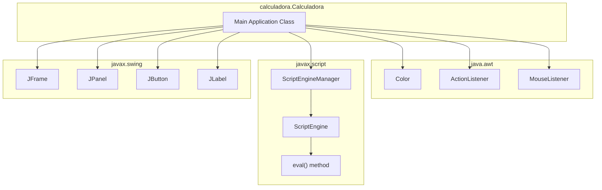
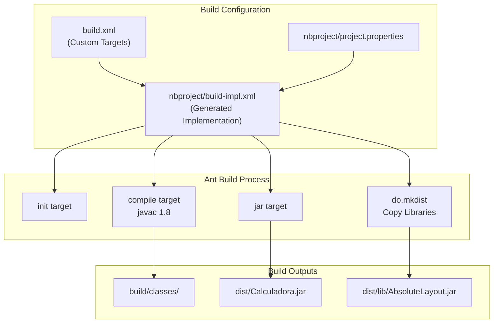
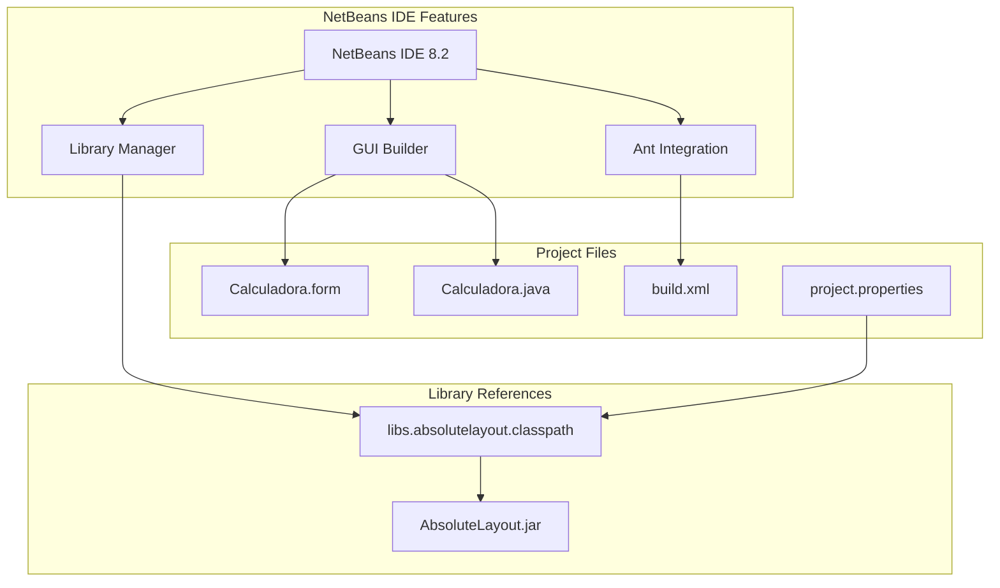

# Dependencies

> **Relevant source files**
> * [README.md](https://github.com/ricardo-alan/SimpleCalculator/blob/e9524f29/README.md)
> * [dist/lib/AbsoluteLayout.jar](https://github.com/ricardo-alan/SimpleCalculator/blob/e9524f29/dist/lib/AbsoluteLayout.jar)
> * [nbproject/project.properties](https://github.com/ricardo-alan/SimpleCalculator/blob/e9524f29/nbproject/project.properties)

This page documents all external libraries, APIs, and tools required by the SimpleCalculator project. Dependencies are categorized by their role in the application lifecycle: runtime dependencies packaged with the application, Java SE APIs provided by the JVM, build-time tools, and development environment requirements.

For detailed documentation of the AbsoluteLayout library specifically, see [AbsoluteLayout Library](/ricardo-alan/SimpleCalculator/7.1-absolutelayout-library).

## Dependency Overview

The SimpleCalculator project has a minimal dependency footprint, consisting of one external JAR library and several Java SE platform APIs.

| Dependency Type | Component | Version/Requirement | Purpose |
| --- | --- | --- | --- |
| **External Library** | AbsoluteLayout.jar | NetBeans lib | Pixel-perfect UI component positioning |
| **Java SE API** | javax.swing | Java 8+ | GUI framework and components |
| **Java SE API** | javax.script | Java 8+ | Expression evaluation engine |
| **Java SE API** | java.awt | Java 8+ | Graphics and event handling |
| **Build Tool** | Apache Ant | NetBeans bundled | Compilation and packaging |
| **Development IDE** | NetBeans IDE | 8.2 recommended | Project management and GUI builder |

**Sources:** [README.md L1-L32](https://github.com/ricardo-alan/SimpleCalculator/blob/e9524f29/README.md#L1-L32)

 [nbproject/project.properties L1-L76](https://github.com/ricardo-alan/SimpleCalculator/blob/e9524f29/nbproject/project.properties#L1-L76)

## Runtime Dependencies

### External Library: AbsoluteLayout

The sole external library dependency is `AbsoluteLayout.jar`, located in [dist/lib/AbsoluteLayout.jar](https://github.com/ricardo-alan/SimpleCalculator/blob/e9524f29/dist/lib/AbsoluteLayout.jar)

 This library provides the `org.netbeans.lib.awtextra.AbsoluteLayout` layout manager.

```

```

**Package Structure:**

* `org.netbeans.lib.awtextra.AbsoluteLayout`: Main layout manager class
* `org.netbeans.lib.awtextra.AbsoluteConstraints`: Constraint specification for component positioning

The library is declared in the classpath at [nbproject/project.properties L32-L33](https://github.com/ricardo-alan/SimpleCalculator/blob/e9524f29/nbproject/project.properties#L32-L33)

:

```
javac.classpath=\
    ${libs.absolutelayout.classpath}
```

**Distribution:** The library is copied to `dist/lib/` during the build process and must be present in the classpath when executing `Calculadora.jar`.

**Sources:** [dist/lib/AbsoluteLayout.jar L1-L40](https://github.com/ricardo-alan/SimpleCalculator/blob/e9524f29/dist/lib/AbsoluteLayout.jar#L1-L40)

 [nbproject/project.properties L32-L33](https://github.com/ricardo-alan/SimpleCalculator/blob/e9524f29/nbproject/project.properties#L32-L33)

### Java SE APIs

The application relies on three core Java SE APIs, all available in Java 8+ runtime environments:



#### javax.swing API

Provides the GUI framework. The `calculadora.Calculadora` class extends `javax.swing.JFrame` and uses standard Swing components:

* `JPanel` for layout containers
* `JButton` for calculator buttons
* `JLabel` for text display fields

#### javax.script API

Enables JavaScript expression evaluation without a custom parser. The application uses:

* `javax.script.ScriptEngineManager` to obtain a JavaScript engine
* `ScriptEngine.eval(String)` to evaluate mathematical expressions

This API is part of Java SE 8+ and requires no external dependencies.

#### java.awt API

Provides core graphics and event handling:

* `java.awt.Color` for theme color management
* `java.awt.event.ActionListener` for button click handling
* `java.awt.event.MouseListener` for mouse interaction events

**Sources:** [README.md L13-L14](https://github.com/ricardo-alan/SimpleCalculator/blob/e9524f29/README.md#L13-L14)

 [nbproject/project.properties L40-L41](https://github.com/ricardo-alan/SimpleCalculator/blob/e9524f29/nbproject/project.properties#L40-L41)

## Build System Dependencies

### Apache Ant

The project uses Apache Ant for compilation, resource processing, and distribution packaging. The build system is configured through:

| File | Purpose |
| --- | --- |
| `build.xml` | Custom build targets and entry point |
| `nbproject/build-impl.xml` | Generated build implementation |
| `nbproject/project.properties` | Build configuration properties |



**Java Compiler Configuration:**
The build targets Java 1.8 bytecode as specified in [nbproject/project.properties L40-L41](https://github.com/ricardo-alan/SimpleCalculator/blob/e9524f29/nbproject/project.properties#L40-L41)

:

```
javac.source=1.8
javac.target=1.8
```

**Library Distribution:**
The `mkdist.disabled=false` property at [nbproject/project.properties L61](https://github.com/ricardo-alan/SimpleCalculator/blob/e9524f29/nbproject/project.properties#L61-L61)

 enables automatic copying of classpath libraries to `dist/lib/` during the build.

**Sources:** [nbproject/project.properties L40-L41](https://github.com/ricardo-alan/SimpleCalculator/blob/e9524f29/nbproject/project.properties#L40-L41)

 [nbproject/project.properties L61](https://github.com/ricardo-alan/SimpleCalculator/blob/e9524f29/nbproject/project.properties#L61-L61)

## Development Dependencies

### NetBeans IDE

While not strictly required for building the project, NetBeans IDE 8.2 is the recommended development environment. The IDE provides:

1. **GUI Builder Integration:** Visual editing of `Calculadora.form` with automatic code generation
2. **Build System Management:** Direct integration with Ant build scripts
3. **AbsoluteLayout Library:** Built-in library reference via `${libs.absolutelayout.classpath}`
4. **Project Configuration:** Management of `nbproject/` metadata files



**Library Reference Resolution:**
The `${libs.absolutelayout.classpath}` variable at [nbproject/project.properties L33](https://github.com/ricardo-alan/SimpleCalculator/blob/e9524f29/nbproject/project.properties#L33-L33)

 is resolved by NetBeans to point to its bundled AbsoluteLayout library. When building outside NetBeans, this variable must be defined or the JAR path must be specified directly.

**Alternative Development:**
The project can be developed in other Java IDEs (Eclipse, IntelliJ IDEA) by:

1. Importing as a standard Java project
2. Manually adding `dist/lib/AbsoluteLayout.jar` to the classpath
3. Using Ant or an alternative build system

**Sources:** [README.md L20-L21](https://github.com/ricardo-alan/SimpleCalculator/blob/e9524f29/README.md#L20-L21)

 [nbproject/project.properties L32-L33](https://github.com/ricardo-alan/SimpleCalculator/blob/e9524f29/nbproject/project.properties#L32-L33)

## Dependency Management

### Classpath Configuration

The complete runtime classpath is assembled from two sources:

1. **Compile Classpath** (defined at [nbproject/project.properties L32-L33](https://github.com/ricardo-alan/SimpleCalculator/blob/e9524f29/nbproject/project.properties#L32-L33) ): ``` javac.classpath=\     ${libs.absolutelayout.classpath} ```
2. **Runtime Classpath** (defined at [nbproject/project.properties L63-L65](https://github.com/ricardo-alan/SimpleCalculator/blob/e9524f29/nbproject/project.properties#L63-L65) ): ``` run.classpath=\     ${javac.classpath}:\     ${build.classes.dir} ```

This configuration ensures the AbsoluteLayout library is available both during compilation and runtime.

### Distribution Strategy

The distribution JAR (`dist/Calculadora.jar`) does not bundle the AbsoluteLayout library internally. Instead:

1. The library is copied to `dist/lib/AbsoluteLayout.jar` during build
2. The JAR manifest should reference the external library (Class-Path entry)
3. Both JARs must be distributed together for execution

**Execution Requirements:**

```

```

**Sources:** [nbproject/project.properties L32-L33](https://github.com/ricardo-alan/SimpleCalculator/blob/e9524f29/nbproject/project.properties#L32-L33)

 [nbproject/project.properties L61](https://github.com/ricardo-alan/SimpleCalculator/blob/e9524f29/nbproject/project.properties#L61-L61)

 [nbproject/project.properties L63-L65](https://github.com/ricardo-alan/SimpleCalculator/blob/e9524f29/nbproject/project.properties#L63-L65)

## Version Requirements

| Component | Minimum Version | Configured Version | Notes |
| --- | --- | --- | --- |
| Java Runtime (JRE) | 8 | 8+ | Required for javax.script API |
| Java Compiler (JDK) | 1.8 | 1.8 | Source and target compatibility |
| AbsoluteLayout | NetBeans lib | Included in dist/ | No versioning in JAR |
| Apache Ant | 1.7+ | NetBeans bundled | Standard Ant installation sufficient |

The application is compiled with `-source 1.8 -target 1.8` flags, ensuring compatibility with Java 8 and all later versions.

**Sources:** [nbproject/project.properties L40-L41](https://github.com/ricardo-alan/SimpleCalculator/blob/e9524f29/nbproject/project.properties#L40-L41)