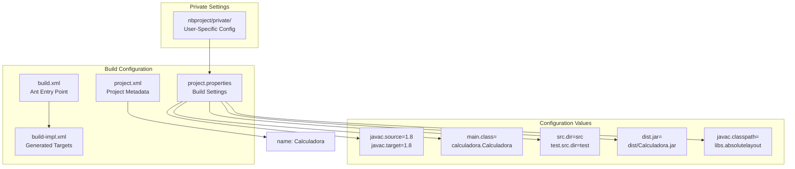
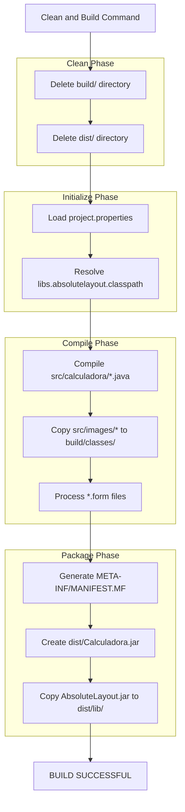

# Development Setup

> **Relevant source files**
> * [README.md](https://github.com/ricardo-alan/SimpleCalculator/blob/e9524f29/README.md)
> * [nbproject/project.properties](https://github.com/ricardo-alan/SimpleCalculator/blob/e9524f29/nbproject/project.properties)
> * [nbproject/project.xml](https://github.com/ricardo-alan/SimpleCalculator/blob/e9524f29/nbproject/project.xml)

This page covers setting up the development environment for working on the SimpleCalculator source code, including IDE installation, project import, and initial build verification. For instructions on running the pre-built application, see [Running the Application](/ricardo-alan/SimpleCalculator/2.1-running-the-application). For detailed information about the build system internals, see [Build System](/ricardo-alan/SimpleCalculator/5-build-system).

## Prerequisites

The following software is required to develop SimpleCalculator:

| Component | Version | Purpose |
| --- | --- | --- |
| Java Development Kit (JDK) | 8 or later | Compilation and runtime environment |
| NetBeans IDE | 8.2+ recommended | Primary development environment |
| Apache Ant | Bundled with NetBeans | Build automation |
| Git | Optional | Source code management |

The project is configured to compile with Java 8 compatibility ([nbproject/project.properties L40-L41](https://github.com/ricardo-alan/SimpleCalculator/blob/e9524f29/nbproject/project.properties#L40-L41)

). While newer JDK versions can be used for development, the compiled bytecode will target Java 1.8 to maintain compatibility.

**Sources**: [nbproject/project.properties](https://github.com/ricardo-alan/SimpleCalculator/blob/e9524f29/nbproject/project.properties)

 [README.md](https://github.com/ricardo-alan/SimpleCalculator/blob/e9524f29/README.md)

## Obtaining the Source Code

### Option 1: Clone with Git

```

```

### Option 2: Download ZIP Archive

1. Navigate to the GitHub repository
2. Click "Code" → "Download ZIP"
3. Extract the archive to your desired location

**Sources**: [README.md L18-L19](https://github.com/ricardo-alan/SimpleCalculator/blob/e9524f29/README.md#L18-L19)

## Importing the Project into NetBeans

### NetBeans Project Recognition

```

```

**NetBeans Project Detection Diagram** - This diagram shows the key files NetBeans uses to recognize and configure the SimpleCalculator project. The presence of `nbproject/project.xml` with type `org.netbeans.modules.java.j2seproject` identifies it as a Java SE project.

**Sources**: [nbproject/project.xml L2-L5](https://github.com/ricardo-alan/SimpleCalculator/blob/e9524f29/nbproject/project.xml#L2-L5)

 [nbproject/project.properties L58](https://github.com/ricardo-alan/SimpleCalculator/blob/e9524f29/nbproject/project.properties#L58-L58)

### Import Steps

1. **Open NetBeans IDE**
2. **Select File → Open Project**
3. **Navigate to Repository Directory** * Browse to the `SimpleCalculator` folder * NetBeans will display a distinct project icon if the project structure is recognized
4. **Verify Project Recognition** * The project should appear as "Calculadora" (as defined in [nbproject/project.xml L6](https://github.com/ricardo-alan/SimpleCalculator/blob/e9524f29/nbproject/project.xml#L6-L6) ) * The icon should indicate a Java Application project type
5. **Open the Project** * Select the project and click "Open Project" * NetBeans will load the project configuration from [nbproject/project.properties](https://github.com/ricardo-alan/SimpleCalculator/blob/e9524f29/nbproject/project.properties)

**Sources**: [README.md L20](https://github.com/ricardo-alan/SimpleCalculator/blob/e9524f29/README.md#L20-L20)

 [nbproject/project.xml L6](https://github.com/ricardo-alan/SimpleCalculator/blob/e9524f29/nbproject/project.xml#L6-L6)

## Project Configuration Details

### Key Configuration Files



**Project Configuration Mapping** - This diagram maps configuration files to their key settings. The `javac.classpath` reference to `libs.absolutelayout` is critical for the AbsoluteLayout dependency.

**Sources**: [nbproject/project.properties L27-L74](https://github.com/ricardo-alan/SimpleCalculator/blob/e9524f29/nbproject/project.properties#L27-L74)

 [nbproject/project.xml L6](https://github.com/ricardo-alan/SimpleCalculator/blob/e9524f29/nbproject/project.xml#L6-L6)

### Critical Configuration Properties

| Property | Value | Description |
| --- | --- | --- |
| `javac.source` | `1.8` | Java source compatibility level |
| `javac.target` | `1.8` | Java bytecode target version |
| `main.class` | `calculadora.Calculadora` | Entry point for execution |
| `src.dir` | `src` | Source code root directory |
| `dist.jar` | `dist/Calculadora.jar` | Output JAR file path |
| `javac.classpath` | `${libs.absolutelayout.classpath}` | Compile-time dependencies |

The `libs.absolutelayout.classpath` variable references the NetBeans AbsoluteLayout library, which must be available in the IDE's library manager. See [AbsoluteLayout Library](/ricardo-alan/SimpleCalculator/7.1-absolutelayout-library) for details on this dependency.

**Sources**: [nbproject/project.properties L27-L74](https://github.com/ricardo-alan/SimpleCalculator/blob/e9524f29/nbproject/project.properties#L27-L74)

## Initial Build

### Using NetBeans

1. **Clean and Build** * Right-click the project in the Projects view * Select "Clean and Build" * This executes the Ant `clean` and `jar` targets
2. **Build Output Locations** ```python build/ ├── classes/           # Compiled .class files │   └── calculadora/ │       └── Calculadora.class └── empty/             # Placeholder directories dist/ ├── Calculadora.jar    # Executable application JAR ├── lib/               # Packaged dependencies │   └── AbsoluteLayout.jar └── README.TXT         # Distribution readme ```
3. **Verify Build Success** * Check the Output window for "BUILD SUCCESSFUL" * Verify [dist/Calculadora.jar](https://github.com/ricardo-alan/SimpleCalculator/blob/e9524f29/dist/Calculadora.jar)  exists * Confirm [dist/lib/AbsoluteLayout.jar](https://github.com/ricardo-alan/SimpleCalculator/blob/e9524f29/dist/lib/AbsoluteLayout.jar)  is present

**Sources**: [nbproject/project.properties L10-L27](https://github.com/ricardo-alan/SimpleCalculator/blob/e9524f29/nbproject/project.properties#L10-L27)

### Build Process Flow



**Build Process Flow Diagram** - This shows the sequence of operations when building the project. Each phase corresponds to Ant targets defined in [nbproject/build-impl.xml](https://github.com/ricardo-alan/SimpleCalculator/blob/e9524f29/nbproject/build-impl.xml)

**Sources**: [nbproject/project.properties L10-L26](https://github.com/ricardo-alan/SimpleCalculator/blob/e9524f29/nbproject/project.properties#L10-L26)

 [README.md L21](https://github.com/ricardo-alan/SimpleCalculator/blob/e9524f29/README.md#L21-L21)

## Running from the IDE

### Execution Methods

1. **Press F6** - Runs the project with default configuration
2. **Click Run Project (▶️)** - In the toolbar
3. **Right-click Project → Run** - From context menu

All methods execute the `calculadora.Calculadora` class specified in [nbproject/project.properties L58](https://github.com/ricardo-alan/SimpleCalculator/blob/e9524f29/nbproject/project.properties#L58-L58)

### Run Configuration

The run configuration uses these settings from [nbproject/project.properties](https://github.com/ricardo-alan/SimpleCalculator/blob/e9524f29/nbproject/project.properties)

:

* **Classpath**: Includes compiled classes and AbsoluteLayout.jar ([nbproject/project.properties L63-L65](https://github.com/ricardo-alan/SimpleCalculator/blob/e9524f29/nbproject/project.properties#L63-L65) )
* **JVM Arguments**: None by default ([nbproject/project.properties L69](https://github.com/ricardo-alan/SimpleCalculator/blob/e9524f29/nbproject/project.properties#L69-L69) )
* **Working Directory**: Project root

### Expected Behavior

When run successfully, the application should:

1. Launch without console output (GUI application)
2. Display a 340×570 pixel calculator window
3. Start in light mode by default
4. Show all calculator buttons and displays

If the window does not appear, check the Output window in NetBeans for error messages.

**Sources**: [nbproject/project.properties L58-L69](https://github.com/ricardo-alan/SimpleCalculator/blob/e9524f29/nbproject/project.properties#L58-L69)

## Workspace Layout

### NetBeans Project View

After importing, the NetBeans Projects view displays:

```
Calculadora
├── Source Packages
│   ├── calculadora
│   │   ├── Calculadora.java
│   │   └── <default package>
│   └── images (resources)
├── Test Packages
│   └── <default package>
├── Libraries
│   ├── JDK 1.8 (or configured JDK)
│   └── AbsoluteLayout
└── Test Libraries
```

### Files View

The complete repository structure:

```markdown
SimpleCalculator/
├── build/                 # Temporary build artifacts (gitignored)
├── dist/                  # Distribution outputs
│   ├── Calculadora.jar
│   └── lib/
│       └── AbsoluteLayout.jar
├── nbproject/             # NetBeans configuration
│   ├── build-impl.xml     # Generated build script
│   ├── genfiles.properties
│   ├── project.properties # Main configuration
│   ├── project.xml        # Project definition
│   └── private/           # User-specific settings (gitignored)
├── screenshots/           # Documentation images
├── src/                   # Source code
│   ├── calculadora/
│   │   ├── Calculadora.form
│   │   └── Calculadora.java
│   └── images/            # UI assets (PNG icons)
├── build.xml              # Ant build script
├── LICENSE.md
├── manifest.mf
└── README.md
```

**Sources**: [nbproject/project.properties L74-L75](https://github.com/ricardo-alan/SimpleCalculator/blob/e9524f29/nbproject/project.properties#L74-L75)

 [nbproject/project.xml L7-L12](https://github.com/ricardo-alan/SimpleCalculator/blob/e9524f29/nbproject/project.xml#L7-L12)

## Verification Checklist

After setup, verify the following:

* Project opens without errors in NetBeans
* No red exclamation marks on project icon (indicating missing dependencies)
* Build completes with "BUILD SUCCESSFUL" message
* `dist/Calculadora.jar` is created
* `dist/lib/AbsoluteLayout.jar` is present
* F6 launches the calculator application
* Application displays in light mode by default
* All calculator buttons are visible and clickable

**Sources**: [README.md L21-L23](https://github.com/ricardo-alan/SimpleCalculator/blob/e9524f29/README.md#L21-L23)

## Troubleshooting

### AbsoluteLayout Library Not Found

**Symptom**: Build fails with error about `libs.absolutelayout.classpath` not being defined.

**Solution**:

1. Open **Tools → Libraries** in NetBeans
2. Verify "AbsoluteLayout" library exists
3. If missing, NetBeans 8.2 should provide it by default
4. Alternatively, the library is available in [dist/lib/AbsoluteLayout.jar](https://github.com/ricardo-alan/SimpleCalculator/blob/e9524f29/dist/lib/AbsoluteLayout.jar)

For details on this dependency, see [AbsoluteLayout Library](/ricardo-alan/SimpleCalculator/7.1-absolutelayout-library).

### Java Version Mismatch

**Symptom**: Compiler warnings about source/target version or unsupported class file version.

**Solution**:

1. Verify JDK 8 or later is installed
2. In NetBeans, right-click project → Properties → Sources
3. Set "Source/Binary Format" to "1.8" (matches [nbproject/project.properties L40-L41](https://github.com/ricardo-alan/SimpleCalculator/blob/e9524f29/nbproject/project.properties#L40-L41) )
4. Rebuild the project

### Main Class Not Found

**Symptom**: "Could not find or load main class calculadora.Calculadora"

**Solution**:

1. Verify [src/calculadora/Calculadora.java](https://github.com/ricardo-alan/SimpleCalculator/blob/e9524f29/src/calculadora/Calculadora.java)  exists
2. Check that package declaration is `package calculadora;`
3. Confirm `main.class=calculadora.Calculadora` in [nbproject/project.properties L58](https://github.com/ricardo-alan/SimpleCalculator/blob/e9524f29/nbproject/project.properties#L58-L58)
4. Clean and rebuild the project

### Images Not Loading

**Symptom**: Calculator displays but button icons are missing.

**Solution**:

1. Verify [src/images/](https://github.com/ricardo-alan/SimpleCalculator/blob/e9524f29/src/images/)  directory contains PNG files
2. Check that images are being copied to `build/classes/images/`
3. Ensure the build process includes the resource copy step
4. Rebuild to re-copy resources

See [UI Assets and Icons](/ricardo-alan/SimpleCalculator/4.5-ui-assets-and-icons) for details on image resources.

**Sources**: [nbproject/project.properties L32-L58](https://github.com/ricardo-alan/SimpleCalculator/blob/e9524f29/nbproject/project.properties#L32-L58)

## Next Steps

After successful setup:

1. **Explore the Code**: Open [src/calculadora/Calculadora.java](https://github.com/ricardo-alan/SimpleCalculator/blob/e9524f29/src/calculadora/Calculadora.java)  to review the main application class
2. **GUI Editor**: Double-click [src/calculadora/Calculadora.form](https://github.com/ricardo-alan/SimpleCalculator/blob/e9524f29/src/calculadora/Calculadora.form)  to open the NetBeans GUI Builder
3. **Understand Architecture**: Review [Application Structure](/ricardo-alan/SimpleCalculator/4.1-application-structure) for component organization
4. **Build System**: See [Build System](/ricardo-alan/SimpleCalculator/5-build-system) for advanced build customization

**Sources**: [README.md L20-L23](https://github.com/ricardo-alan/SimpleCalculator/blob/e9524f29/README.md#L20-L23)