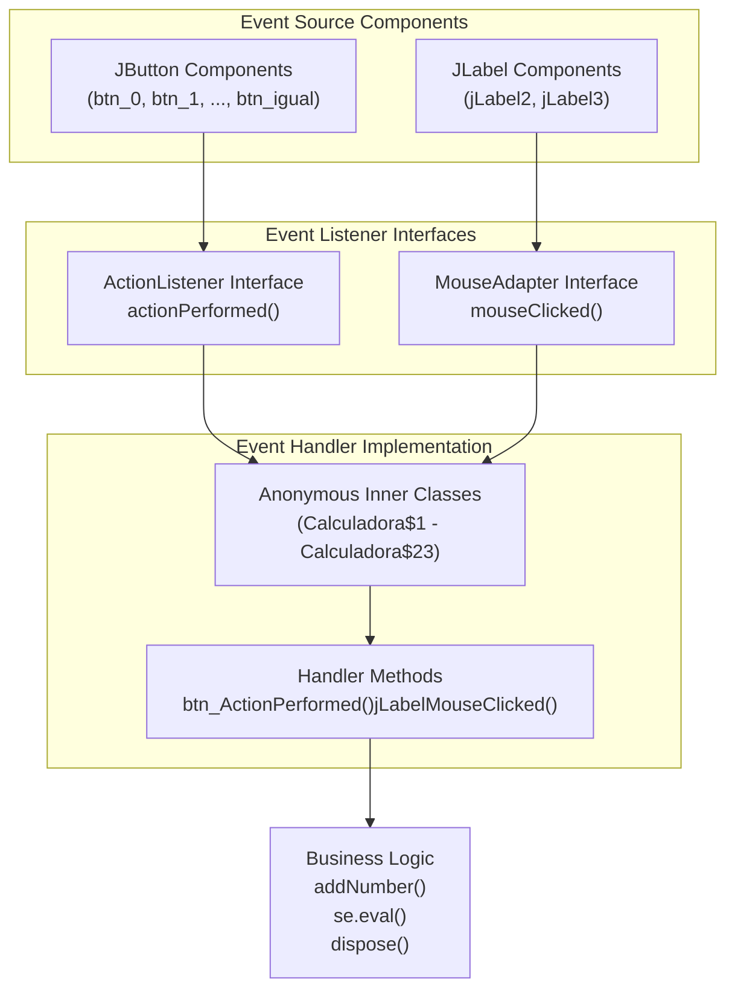
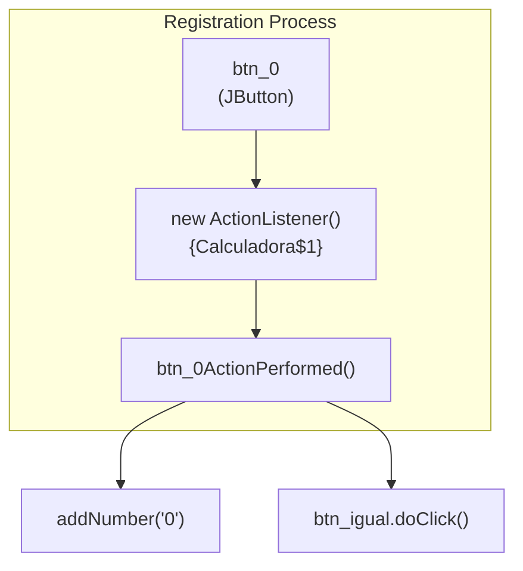
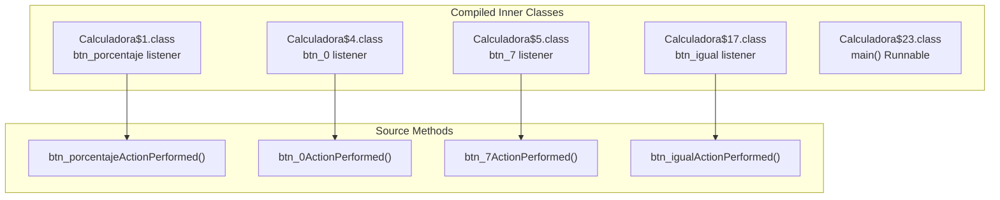
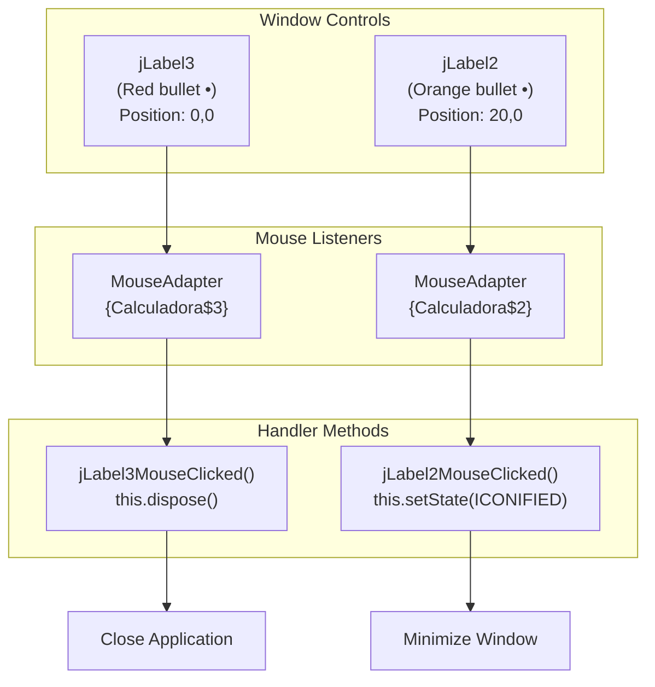
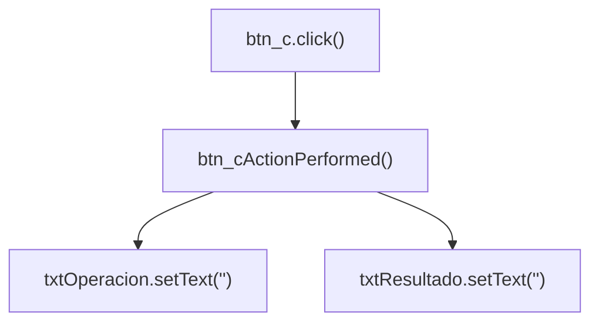
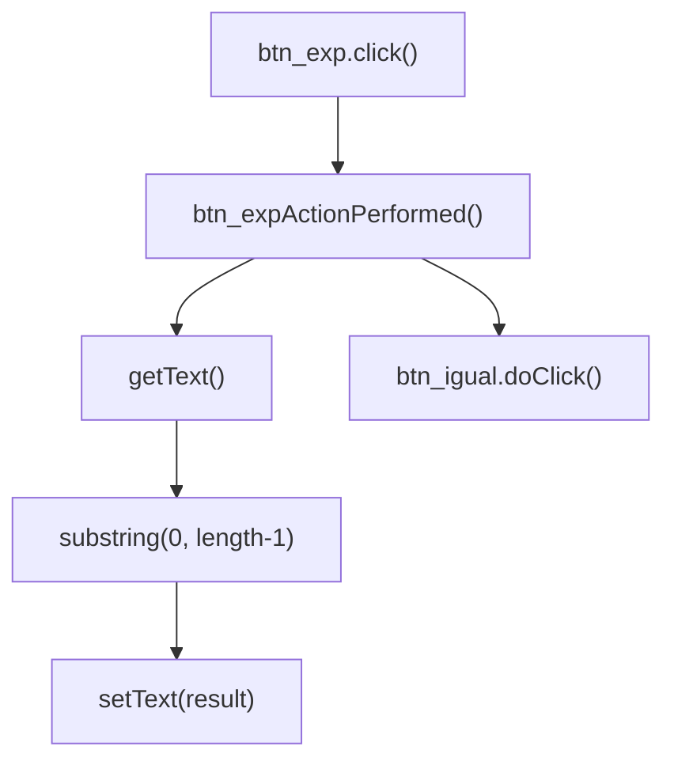
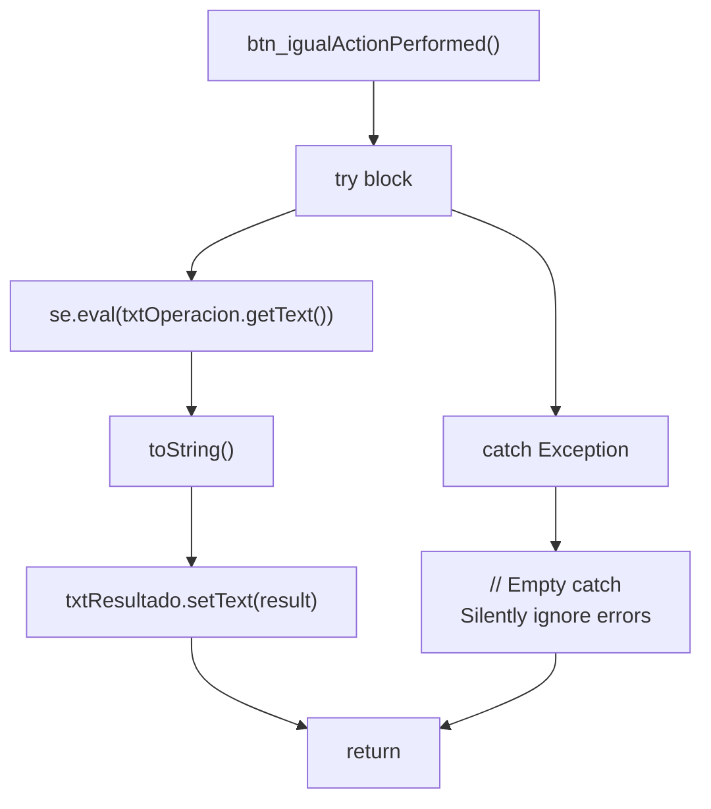
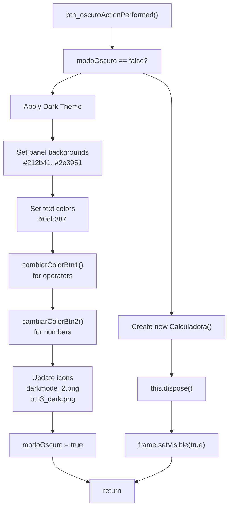
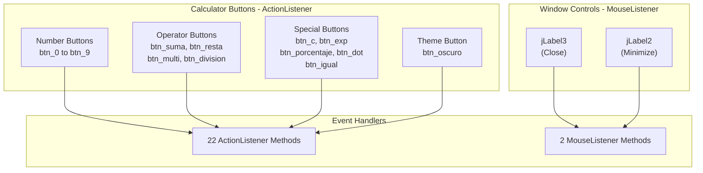

# Event Handling

> **Relevant source files**
> * [dist/Calculadora.jar](https://github.com/ricardo-alan/SimpleCalculator/blob/e9524f29/dist/Calculadora.jar)
> * [src/calculadora/Calculadora.form](https://github.com/ricardo-alan/SimpleCalculator/blob/e9524f29/src/calculadora/Calculadora.form)
> * [src/calculadora/Calculadora.java](https://github.com/ricardo-alan/SimpleCalculator/blob/e9524f29/src/calculadora/Calculadora.java)

## Purpose and Scope

This document describes the event-driven architecture of the SimpleCalculator application, detailing how user interactions with GUI components are captured and processed through event listeners and handlers. This includes both button click events (ActionListener) and mouse events (MouseListener) for window controls.

For information about the UI components that generate these events, see [User Interface Components](/ricardo-alan/SimpleCalculator/4.2-user-interface-components). For details on the business logic executed by event handlers, see [Calculation Engine](/ricardo-alan/SimpleCalculator/4.3-calculation-engine).

---

## Event Listener Architecture

The SimpleCalculator uses Java Swing's event delegation model, where event listeners are registered on UI components to respond to user interactions. The application employs two primary listener types:

| Listener Type | Purpose | Components |
| --- | --- | --- |
| `ActionListener` | Handle button click events | All calculator buttons (numbers, operators, special functions) |
| `MouseListener` | Handle mouse click events | Window control labels (close, minimize) |



**Sources:** [src/calculadora/Calculadora.java L72-L76](https://github.com/ricardo-alan/SimpleCalculator/blob/e9524f29/src/calculadora/Calculadora.java#L72-L76)

 [src/calculadora/Calculadora.java L83-L87](https://github.com/ricardo-alan/SimpleCalculator/blob/e9524f29/src/calculadora/Calculadora.java#L83-L87)

 [dist/Calculadora.jar L13-L23](https://github.com/ricardo-alan/SimpleCalculator/blob/e9524f29/dist/Calculadora.jar#L13-L23)

---

## Button Event Handling (ActionListener)

### Event Registration Pattern

All calculator buttons register ActionListener instances in the `initComponents()` method using anonymous inner classes. NetBeans GUI Builder generates these registrations automatically:



**Example Registration:**

* Number button 0: [src/calculadora/Calculadora.java L403-L407](https://github.com/ricardo-alan/SimpleCalculator/blob/e9524f29/src/calculadora/Calculadora.java#L403-L407)
* Equals button: [src/calculadora/Calculadora.java L115-L119](https://github.com/ricardo-alan/SimpleCalculator/blob/e9524f29/src/calculadora/Calculadora.java#L115-L119)
* Clear button: [src/calculadora/Calculadora.java L243-L247](https://github.com/ricardo-alan/SimpleCalculator/blob/e9524f29/src/calculadora/Calculadora.java#L243-L247)

**Sources:** [src/calculadora/Calculadora.java L22-L413](https://github.com/ricardo-alan/SimpleCalculator/blob/e9524f29/src/calculadora/Calculadora.java#L22-L413)

 [src/calculadora/Calculadora.form L87-L89](https://github.com/ricardo-alan/SimpleCalculator/blob/e9524f29/src/calculadora/Calculadora.form#L87-L89)

### Event Handler Categories

The application implements 22 ActionListener event handlers, categorized by function:

| Category | Buttons | Handler Pattern | Line References |
| --- | --- | --- | --- |
| **Number Input** | btn_0 to btn_9 | Append digit + auto-calculate | [425-428](https://github.com/ricardo-alan/SimpleCalculator/blob/e9524f29/425-428) <br>  [430-433](https://github.com/ricardo-alan/SimpleCalculator/blob/e9524f29/430-433) <br>  [451-494](https://github.com/ricardo-alan/SimpleCalculator/blob/e9524f29/451-494) |
| **Operators** | btn_suma, btn_resta, btn_multi, btn_division | Append operator symbol | [507-513](https://github.com/ricardo-alan/SimpleCalculator/blob/e9524f29/507-513) <br>  [441-449](https://github.com/ricardo-alan/SimpleCalculator/blob/e9524f29/441-449) |
| **Special Functions** | btn_porcentaje, btn_dot | Append % or decimal point | [415-418](https://github.com/ricardo-alan/SimpleCalculator/blob/e9524f29/415-418) <br>  [491-494](https://github.com/ricardo-alan/SimpleCalculator/blob/e9524f29/491-494) |
| **Control Actions** | btn_c, btn_exp | Clear or backspace | [420-423](https://github.com/ricardo-alan/SimpleCalculator/blob/e9524f29/420-423) <br>  [435-439](https://github.com/ricardo-alan/SimpleCalculator/blob/e9524f29/435-439) |
| **Calculation** | btn_igual | Evaluate expression | [496-505](https://github.com/ricardo-alan/SimpleCalculator/blob/e9524f29/496-505) |
| **Theme Toggle** | btn_oscuro | Switch light/dark mode | [517-555](https://github.com/ricardo-alan/SimpleCalculator/blob/e9524f29/517-555) |

**Sources:** [src/calculadora/Calculadora.java L415-L555](https://github.com/ricardo-alan/SimpleCalculator/blob/e9524f29/src/calculadora/Calculadora.java#L415-L555)

### Anonymous Inner Class Implementation

NetBeans generates anonymous inner classes for each event listener, compiled as separate class files:



**Sources:** [dist/Calculadora.jar L13-L254](https://github.com/ricardo-alan/SimpleCalculator/blob/e9524f29/dist/Calculadora.jar#L13-L254)

 [src/calculadora/Calculadora.java L72-L76](https://github.com/ricardo-alan/SimpleCalculator/blob/e9524f29/src/calculadora/Calculadora.java#L72-L76)

---

## Window Control Events (MouseListener)

### Mouse Click Handlers

The application uses two JLabel components as custom window controls, each with a MouseListener for window management operations:



**Implementation Details:**

* Close handler: [src/calculadora/Calculadora.java L557-L559](https://github.com/ricardo-alan/SimpleCalculator/blob/e9524f29/src/calculadora/Calculadora.java#L557-L559)
* Minimize handler: [src/calculadora/Calculadora.java L561-L563](https://github.com/ricardo-alan/SimpleCalculator/blob/e9524f29/src/calculadora/Calculadora.java#L561-L563)
* Listener registration: [src/calculadora/Calculadora.java L94-L98](https://github.com/ricardo-alan/SimpleCalculator/blob/e9524f29/src/calculadora/Calculadora.java#L94-L98)  [src/calculadora/Calculadora.java L83-L87](https://github.com/ricardo-alan/SimpleCalculator/blob/e9524f29/src/calculadora/Calculadora.java#L83-L87)

**Sources:** [src/calculadora/Calculadora.java L557-L563](https://github.com/ricardo-alan/SimpleCalculator/blob/e9524f29/src/calculadora/Calculadora.java#L557-L563)

 [src/calculadora/Calculadora.form L107-L114](https://github.com/ricardo-alan/SimpleCalculator/blob/e9524f29/src/calculadora/Calculadora.form#L107-L114)

 [src/calculadora/Calculadora.form L127-L134](https://github.com/ricardo-alan/SimpleCalculator/blob/e9524f29/src/calculadora/Calculadora.form#L127-L134)

---

## Event Flow and Interaction Patterns

### Real-Time Calculation Flow

The "Results as you type" feature is implemented through a cascading event pattern where number buttons programmatically trigger the equals button:

```mermaid
sequenceDiagram
  participant User
  participant btn_7
  participant (JButton)
  participant btn_7ActionPerformed()
  participant addNumber("7")
  participant txtOperacion
  participant (JLabel)
  participant btn_igual
  participant btn_igualActionPerformed()
  participant ScriptEngine
  participant txtResultado

  User->>btn_7: Click
  btn_7->>btn_7ActionPerformed(): ActionEvent
  btn_7ActionPerformed()->>addNumber("7"): Call with "7"
  addNumber("7")->>txtOperacion: setText(current + "7")
  btn_7ActionPerformed()->>btn_igual: doClick()
  btn_igual->>btn_igualActionPerformed(): ActionEvent
  btn_igualActionPerformed()->>ScriptEngine: eval(txtOp.getText())
  ScriptEngine-->>btn_igualActionPerformed(): Result
  btn_igualActionPerformed()->>txtResultado: setText(result)
```

**Key Pattern:** All number buttons ([lines 425-494](https://github.com/ricardo-alan/SimpleCalculator/blob/e9524f29/lines 425-494)

) and the dot button ([lines 491-494](https://github.com/ricardo-alan/SimpleCalculator/blob/e9524f29/lines 491-494)

) call `btn_igual.doClick()` after appending their value, triggering immediate calculation.

**Sources:** [src/calculadora/Calculadora.java L425-L494](https://github.com/ricardo-alan/SimpleCalculator/blob/e9524f29/src/calculadora/Calculadora.java#L425-L494)

 [src/calculadora/Calculadora.java L496-L505](https://github.com/ricardo-alan/SimpleCalculator/blob/e9524f29/src/calculadora/Calculadora.java#L496-L505)

 [src/calculadora/Calculadora.java L611-L613](https://github.com/ricardo-alan/SimpleCalculator/blob/e9524f29/src/calculadora/Calculadora.java#L611-L613)

### Operator Input Flow

Operator buttons follow a different pattern - they append the operator symbol but do NOT trigger automatic calculation:

```mermaid
sequenceDiagram
  participant User
  participant btn_suma
  participant (JButton)
  participant btn_sumaActionPerformed()
  participant addNumber("+")
  participant txtOperacion
  participant (JLabel)

  User->>btn_suma: Click
  btn_suma->>btn_sumaActionPerformed(): ActionEvent
  btn_sumaActionPerformed()->>addNumber("+"): Call with "+"
  addNumber("+")->>txtOperacion: setText(current + "+")
  note over btn_sumaActionPerformed(): No doClick() call
```

**Operator Handlers:**

* Addition: [src/calculadora/Calculadora.java L507-L509](https://github.com/ricardo-alan/SimpleCalculator/blob/e9524f29/src/calculadora/Calculadora.java#L507-L509)
* Subtraction: [src/calculadora/Calculadora.java L511-L513](https://github.com/ricardo-alan/SimpleCalculator/blob/e9524f29/src/calculadora/Calculadora.java#L511-L513)
* Multiplication: [src/calculadora/Calculadora.java L446-L449](https://github.com/ricardo-alan/SimpleCalculator/blob/e9524f29/src/calculadora/Calculadora.java#L446-L449)
* Division: [src/calculadora/Calculadora.java L441-L444](https://github.com/ricardo-alan/SimpleCalculator/blob/e9524f29/src/calculadora/Calculadora.java#L441-L444)

**Sources:** [src/calculadora/Calculadora.java L441-L513](https://github.com/ricardo-alan/SimpleCalculator/blob/e9524f29/src/calculadora/Calculadora.java#L441-L513)

---

## Event Handler Implementation Details

### Handler Method Signatures

All event handler methods follow NetBeans-generated naming conventions and signatures:

| Method Pattern | Parameters | Return Type | Purpose |
| --- | --- | --- | --- |
| `btn_*ActionPerformed` | `java.awt.event.ActionEvent evt` | `void` | Handle button clicks |
| `jLabel*MouseClicked` | `java.awt.event.MouseEvent evt` | `void` | Handle mouse clicks |

**Generated Markers:**

* Start marker: `//GEN-FIRST:event_<handlerName>`
* End marker: `//GEN-LAST:event_<handlerName>`

**Example:** [src/calculadora/Calculadora.java L415-L418](https://github.com/ricardo-alan/SimpleCalculator/blob/e9524f29/src/calculadora/Calculadora.java#L415-L418)

**Sources:** [src/calculadora/Calculadora.java L415-L563](https://github.com/ricardo-alan/SimpleCalculator/blob/e9524f29/src/calculadora/Calculadora.java#L415-L563)

### Special Event Handlers

#### Clear Button Handler

Resets both display fields to empty strings:



**Implementation:** [src/calculadora/Calculadora.java L420-L423](https://github.com/ricardo-alan/SimpleCalculator/blob/e9524f29/src/calculadora/Calculadora.java#L420-L423)

**Sources:** [src/calculadora/Calculadora.java L420-L423](https://github.com/ricardo-alan/SimpleCalculator/blob/e9524f29/src/calculadora/Calculadora.java#L420-L423)

#### Backspace Handler

Removes the last character from the operation display and recalculates:



**Implementation:** [src/calculadora/Calculadora.java L435-L439](https://github.com/ricardo-alan/SimpleCalculator/blob/e9524f29/src/calculadora/Calculadora.java#L435-L439)

**Sources:** [src/calculadora/Calculadora.java L435-L439](https://github.com/ricardo-alan/SimpleCalculator/blob/e9524f29/src/calculadora/Calculadora.java#L435-L439)

#### Equals Button Handler

Evaluates the expression using ScriptEngine with error handling:



**Implementation:** [src/calculadora/Calculadora.java L496-L505](https://github.com/ricardo-alan/SimpleCalculator/blob/e9524f29/src/calculadora/Calculadora.java#L496-L505)

**Error Handling:** The handler catches all exceptions and silently ignores them, leaving the previous result displayed.

**Sources:** [src/calculadora/Calculadora.java L496-L505](https://github.com/ricardo-alan/SimpleCalculator/blob/e9524f29/src/calculadora/Calculadora.java#L496-L505)

#### Theme Toggle Handler

Complex handler that switches between light and dark modes by modifying colors and icons:



**Implementation:** [src/calculadora/Calculadora.java L517-L555](https://github.com/ricardo-alan/SimpleCalculator/blob/e9524f29/src/calculadora/Calculadora.java#L517-L555)

**Helper Methods:**

* `cambiarColorBtn1()`: [src/calculadora/Calculadora.java L597-L602](https://github.com/ricardo-alan/SimpleCalculator/blob/e9524f29/src/calculadora/Calculadora.java#L597-L602)
* `cambiarColorBtn2()`: [src/calculadora/Calculadora.java L604-L609](https://github.com/ricardo-alan/SimpleCalculator/blob/e9524f29/src/calculadora/Calculadora.java#L604-L609)

**Sources:** [src/calculadora/Calculadora.java L517-L555](https://github.com/ricardo-alan/SimpleCalculator/blob/e9524f29/src/calculadora/Calculadora.java#L517-L555)

 [src/calculadora/Calculadora.java L597-L609](https://github.com/ricardo-alan/SimpleCalculator/blob/e9524f29/src/calculadora/Calculadora.java#L597-L609)

---

## Event Listener Registration Summary

### Complete Event-Component Mapping



**Total Event Handlers:** 24 (22 ActionListener + 2 MouseListener)

**Registration Location:** All listeners are registered in the `initComponents()` method ([src/calculadora/Calculadora.java L23-L413](https://github.com/ricardo-alan/SimpleCalculator/blob/e9524f29/src/calculadora/Calculadora.java#L23-L413)

)

**Sources:** [src/calculadora/Calculadora.java L23-L413](https://github.com/ricardo-alan/SimpleCalculator/blob/e9524f29/src/calculadora/Calculadora.java#L23-L413)

 [src/calculadora/Calculadora.form L1-L27](https://github.com/ricardo-alan/SimpleCalculator/blob/e9524f29/src/calculadora/Calculadora.form#L1-L27)