# Features

> **Relevant source files**
> * [README.md](https://github.com/ricardo-alan/SimpleCalculator/blob/e9524f29/README.md)
> * [src/calculadora/Calculadora.java](https://github.com/ricardo-alan/SimpleCalculator/blob/e9524f29/src/calculadora/Calculadora.java)

This page provides a comprehensive overview of the calculator's functional capabilities and user experience features. It documents the five primary feature categories: arithmetic operations, real-time result display, theme customization, window controls, and input handling. Each feature is explained with references to its implementation in the codebase.

For information about the underlying technical architecture that enables these features, see [Architecture](/ricardo-alan/SimpleCalculator/4-architecture). For instructions on running and using the calculator application, see [Getting Started](/ricardo-alan/SimpleCalculator/2-getting-started).

## Feature Categories Overview

The SimpleCalculator implements features across five categories:

| Feature Category | Description | Primary Component |
| --- | --- | --- |
| Arithmetic Operations | Basic mathematical operations including addition, subtraction, multiplication, division, and percentage | `ScriptEngine` evaluation |
| Real-time Results | Immediate calculation and display of results as the user types | Event-driven `btn_igual.doClick()` |
| Theme System | Light and dark mode visual themes with complete color and icon swapping | `btn_oscuroActionPerformed` handler |
| Window Controls | Custom window management with undecorated frame and minimize/close controls | Mouse event handlers on `jLabel2` and `jLabel3` |
| Input Management | Number and operator input with validation and backspace functionality | `addNumber` method and button action listeners |

**Feature-to-Code Entity Mapping**


Sources: [README.md L9-L14](https://github.com/ricardo-alan/SimpleCalculator/blob/e9524f29/README.md#L9-L14)

 [src/calculadora/Calculadora.java L13-L14](https://github.com/ricardo-alan/SimpleCalculator/blob/e9524f29/src/calculadora/Calculadora.java#L13-L14)

 [src/calculadora/Calculadora.java L415-L513](https://github.com/ricardo-alan/SimpleCalculator/blob/e9524f29/src/calculadora/Calculadora.java#L415-L513)

 [src/calculadora/Calculadora.java L515-L555](https://github.com/ricardo-alan/SimpleCalculator/blob/e9524f29/src/calculadora/Calculadora.java#L515-L555)

## Arithmetic Operations

The calculator supports five mathematical operations implemented through dedicated button components:

| Operation | Button Component | Symbol | Handler Method | Line Reference |
| --- | --- | --- | --- | --- |
| Addition | `btn_suma` | + | `btn_sumaActionPerformed` | [507-509](https://github.com/ricardo-alan/SimpleCalculator/blob/e9524f29/507-509) |
| Subtraction | `btn_resta` | - | `btn_restaActionPerformed` | [511-513](https://github.com/ricardo-alan/SimpleCalculator/blob/e9524f29/511-513) |
| Multiplication | `btn_multi` | X | `btn_multiActionPerformed` | [446-449](https://github.com/ricardo-alan/SimpleCalculator/blob/e9524f29/446-449) |
| Division | `btn_division` | / | `btn_divisionActionPerformed` | [441-444](https://github.com/ricardo-alan/SimpleCalculator/blob/e9524f29/441-444) |
| Percentage | `btn_porcentaje` | % | `btn_porcentajeActionPerformed` | [415-418](https://github.com/ricardo-alan/SimpleCalculator/blob/e9524f29/415-418) |

### Implementation Details

All arithmetic operation buttons follow the same implementation pattern:

1. User clicks an operation button (e.g., `btn_suma`)
2. The corresponding `ActionListener` invokes its handler method
3. The handler calls `addNumber(String digito)` with the operation symbol
4. The symbol is appended to the `txtOperacion` label text
5. For number buttons, `btn_igual.doClick()` is automatically triggered

The operation symbols are appended directly to the operation string without validation. The multiplication operation uses "X" in the UI but is internally converted to "*" for JavaScript evaluation. The percentage operation appends "%" which JavaScript evaluates as the modulo operator.

**Calculation Engine Integration**

```mermaid
flowchart TD

NUM_BTN["Number buttons<br>(btn_0 through btn_9)"]
OP_BTN["Operation buttons<br>(btn_suma, btn_resta, etc)"]
EQUALS["btn_igual button"]
ADD_NUM["addNumber method<br>(line 611-613)"]
IGUAL_HANDLER["btn_igualActionPerformed<br>(line 496-505)"]
SE["ScriptEngine instance<br>(line 14)"]
EVAL["se.eval method<br>(line 498)"]
TXT_OP["txtOperacion<br>(operation string)"]
TXT_RES["txtResultado<br>(result value)"]

NUM_BTN --> ADD_NUM
OP_BTN --> ADD_NUM
ADD_NUM --> TXT_OP
EQUALS --> IGUAL_HANDLER
IGUAL_HANDLER --> TXT_OP
IGUAL_HANDLER --> EVAL
TXT_OP --> EVAL
EVAL --> TXT_RES

subgraph subGraph3 ["Display Layer"]
    TXT_OP
    TXT_RES
end

subgraph subGraph2 ["Calculation Engine"]
    SE
    EVAL
    EVAL --> SE
end

subgraph subGraph1 ["Processing Layer"]
    ADD_NUM
    IGUAL_HANDLER
end

subgraph subGraph0 ["User Input Layer"]
    NUM_BTN
    OP_BTN
    EQUALS
    NUM_BTN --> EQUALS
end
```



Sources: [src/calculadora/Calculadora.java L415-L418](https://github.com/ricardo-alan/SimpleCalculator/blob/e9524f29/src/calculadora/Calculadora.java#L415-L418)

 [src/calculadora/Calculadora.java L441-L444](https://github.com/ricardo-alan/SimpleCalculator/blob/e9524f29/src/calculadora/Calculadora.java#L441-L444)

 [src/calculadora/Calculadora.java L446-L449](https://github.com/ricardo-alan/SimpleCalculator/blob/e9524f29/src/calculadora/Calculadora.java#L446-L449)

 [src/calculadora/Calculadora.java L507-L513](https://github.com/ricardo-alan/SimpleCalculator/blob/e9524f29/src/calculadora/Calculadora.java#L507-L513)

 [src/calculadora/Calculadora.java L611-L613](https://github.com/ricardo-alan/SimpleCalculator/blob/e9524f29/src/calculadora/Calculadora.java#L611-L613)

 [src/calculadora/Calculadora.java L496-L505](https://github.com/ricardo-alan/SimpleCalculator/blob/e9524f29/src/calculadora/Calculadora.java#L496-L505)

### Calculation Evaluation

The calculation engine uses the `javax.script.ScriptEngine` API with the JavaScript engine:

* **Engine initialization**: [src/calculadora/Calculadora.java L13-L14](https://github.com/ricardo-alan/SimpleCalculator/blob/e9524f29/src/calculadora/Calculadora.java#L13-L14)
* **Evaluation method**: [src/calculadora/Calculadora.java L496-L505](https://github.com/ricardo-alan/SimpleCalculator/blob/e9524f29/src/calculadora/Calculadora.java#L496-L505)

The `btn_igualActionPerformed` handler retrieves the text from `txtOperacion`, passes it to `se.eval()`, and displays the result in `txtResultado`. Error handling is implemented with a try-catch block that silently ignores exceptions (line 500-502), preventing crashes from invalid expressions.

Sources: [src/calculadora/Calculadora.java L13-L14](https://github.com/ricardo-alan/SimpleCalculator/blob/e9524f29/src/calculadora/Calculadora.java#L13-L14)

 [src/calculadora/Calculadora.java L496-L505](https://github.com/ricardo-alan/SimpleCalculator/blob/e9524f29/src/calculadora/Calculadora.java#L496-L505)

 [README.md L13](https://github.com/ricardo-alan/SimpleCalculator/blob/e9524f29/README.md#L13-L13)

## Real-time Results

The "results as you type" feature automatically evaluates and displays calculations after each user input without requiring an explicit equals button press.

### Implementation Mechanism

The real-time calculation is implemented by programmatically triggering the equals button after number input:

**Number Button Pattern:**

```
btn_0ActionPerformed -> addNumber("0") -> btn_igual.doClick()
btn_1ActionPerformed -> addNumber("1") -> btn_igual.doClick()
...
btn_9ActionPerformed -> addNumber("9") -> btn_igual.doClick()
```

Each number button handler (lines 425-494) follows this three-step sequence:

1. Call `addNumber(String digito)` to append the digit to `txtOperacion`
2. Immediately invoke `btn_igual.doClick()` to trigger evaluation
3. The equals button handler evaluates the expression and updates `txtResultado`

**Operation Button Behavior:**

Operation buttons (`btn_suma`, `btn_resta`, `btn_multi`, `btn_division`, `btn_porcentaje`) do NOT trigger automatic evaluation. They only append their symbol via `addNumber()`. This allows users to construct multi-operation expressions like "5+3*2".

### Event Flow Sequence

```mermaid
sequenceDiagram
  participant User
  participant btn_7 button
  participant addNumber method
  participant txtOperacion label
  participant btn_igual.doClick()
  participant btn_igualActionPerformed
  participant ScriptEngine.eval
  participant txtResultado label

  User->>btn_7 button: Click "7"
  btn_7 button->>addNumber method: addNumber("7")
  addNumber method->>txtOperacion label: Append "7"
  btn_7 button->>btn_igual.doClick(): Trigger evaluation
  btn_igual.doClick()->>btn_igualActionPerformed: Invoke handler
  btn_igualActionPerformed->>txtOperacion label: Get text
  btn_igualActionPerformed->>ScriptEngine.eval: eval(expression)
  ScriptEngine.eval->>btn_igualActionPerformed: Return result
  btn_igualActionPerformed->>txtResultado label: Display result
  txtResultado label->>User: Show "7"
```

Sources: [src/calculadora/Calculadora.java L425-L494](https://github.com/ricardo-alan/SimpleCalculator/blob/e9524f29/src/calculadora/Calculadora.java#L425-L494)

 [src/calculadora/Calculadora.java L496-L505](https://github.com/ricardo-alan/SimpleCalculator/blob/e9524f29/src/calculadora/Calculadora.java#L496-L505)

 [src/calculadora/Calculadora.java L611-L613](https://github.com/ricardo-alan/SimpleCalculator/blob/e9524f29/src/calculadora/Calculadora.java#L611-L613)

 [README.md L14](https://github.com/ricardo-alan/SimpleCalculator/blob/e9524f29/README.md#L14-L14)

### Decimal Point Handling

The decimal point button (`btn_dot`) also triggers automatic evaluation:

* Handler: [src/calculadora/Calculadora.java L491-L494](https://github.com/ricardo-alan/SimpleCalculator/blob/e9524f29/src/calculadora/Calculadora.java#L491-L494)
* Behavior: Appends "." and calls `btn_igual.doClick()`

No validation prevents multiple decimal points in a number segment. The JavaScript engine handles invalid expressions by throwing exceptions caught in the equals handler.

Sources: [src/calculadora/Calculadora.java L491-L494](https://github.com/ricardo-alan/SimpleCalculator/blob/e9524f29/src/calculadora/Calculadora.java#L491-L494)

 [src/calculadora/Calculadora.java L500-L502](https://github.com/ricardo-alan/SimpleCalculator/blob/e9524f29/src/calculadora/Calculadora.java#L500-L502)

## Theme System

The calculator supports two visual themes: light mode (default) and dark mode. The theme system modifies colors for panels, text labels, and button icons while preserving all functionality.

### Theme Toggle Implementation

**Theme State Management:**

* State variable: `boolean modoOscuro` [src/calculadora/Calculadora.java L515](https://github.com/ricardo-alan/SimpleCalculator/blob/e9524f29/src/calculadora/Calculadora.java#L515-L515)
* Toggle button: `btn_oscuro` [src/calculadora/Calculadora.java L71-L77](https://github.com/ricardo-alan/SimpleCalculator/blob/e9524f29/src/calculadora/Calculadora.java#L71-L77)
* Handler method: `btn_oscuroActionPerformed` [src/calculadora/Calculadora.java L517-L555](https://github.com/ricardo-alan/SimpleCalculator/blob/e9524f29/src/calculadora/Calculadora.java#L517-L555)

**Toggle Behavior:**

1. **Light to Dark** (when `modoOscuro == false`): * Updates panel backgrounds, text colors, and all button icons * Sets `modoOscuro = true`
2. **Dark to Light** (when `modoOscuro == true`): * Creates a new `Calculadora` instance (which defaults to light mode) * Disposes the current frame * Displays the new frame

### Color Schemes

| Component | Light Mode Color | Dark Mode Color | Code Reference |
| --- | --- | --- | --- |
| Top Panel (`jPanel1`) | `#f4fdFB` (Light cyan) | `#212b41` (Dark blue) | [519](https://github.com/ricardo-alan/SimpleCalculator/blob/e9524f29/519) |
| Button Panel (`jPanel2`) | `#ffffff` (White) | `#2e3951` (Dark gray-blue) | [520](https://github.com/ricardo-alan/SimpleCalculator/blob/e9524f29/520) |
| Operation Text (`txtOperacion`) | `#373e47` (Dark gray) | `#0db387` (Cyan) | [521](https://github.com/ricardo-alan/SimpleCalculator/blob/e9524f29/521) |
| Result Text (`txtResultado`) | `#373e47` (Dark gray) | `#0db387` (Cyan) | [522](https://github.com/ricardo-alan/SimpleCalculator/blob/e9524f29/522) |

### Button Icon Updates

The theme system uses three helper methods to update button icons:

**Method 1: `cambiarColorBtn1(JButton btn)`** [src/calculadora/Calculadora.java L597-L602](https://github.com/ricardo-alan/SimpleCalculator/blob/e9524f29/src/calculadora/Calculadora.java#L597-L602)

* Applied to: Operation buttons (`btn_multi`, `btn_suma`, `btn_resta`, `btn_exp`, `btn_division`, `btn_c`, `btn_porcentaje`)
* Icon set: `btn1_dark.png`, `btn1_pressed_dark.png`
* Text color: `#0db387` (cyan)

**Method 2: `cambiarColorBtn2(JButton btn)`** [src/calculadora/Calculadora.java L604-L609](https://github.com/ricardo-alan/SimpleCalculator/blob/e9524f29/src/calculadora/Calculadora.java#L604-L609)

* Applied to: Number buttons (`btn_0` through `btn_9`, `btn_dot`)
* Icon set: `btn2_dark.png`, `btn1_pressed_dark.png`
* Text color: `#96a8a0` (gray-green)

**Method 3: Equals Button (inline)**

* Handled directly in `btn_oscuroActionPerformed` [src/calculadora/Calculadora.java L543-L546](https://github.com/ricardo-alan/SimpleCalculator/blob/e9524f29/src/calculadora/Calculadora.java#L543-L546)
* Icon set: `btn3_dark.png`, `btn3_pressed_dark.png`
* Text color: `#2e3951` (matches dark panel background)

**Theme Mode Button Icon:**

* Light mode icon: `darkmode_1.png` [src/calculadora/Calculadora.java L71](https://github.com/ricardo-alan/SimpleCalculator/blob/e9524f29/src/calculadora/Calculadora.java#L71-L71)
* Dark mode icon: `darkmode_2.png` [src/calculadora/Calculadora.java L542](https://github.com/ricardo-alan/SimpleCalculator/blob/e9524f29/src/calculadora/Calculadora.java#L542-L542)

### Theme System Architecture

```

```

Sources: [src/calculadora/Calculadora.java L515-L555](https://github.com/ricardo-alan/SimpleCalculator/blob/e9524f29/src/calculadora/Calculadora.java#L515-L555)

 [src/calculadora/Calculadora.java L597-L609](https://github.com/ricardo-alan/SimpleCalculator/blob/e9524f29/src/calculadora/Calculadora.java#L597-L609)

 [README.md L12](https://github.com/ricardo-alan/SimpleCalculator/blob/e9524f29/README.md#L12-L12)

## Window Controls

The calculator uses an undecorated `JFrame` [src/calculadora/Calculadora.java L54](https://github.com/ricardo-alan/SimpleCalculator/blob/e9524f29/src/calculadora/Calculadora.java#L54-L54)

 with custom window controls implemented via mouse event handlers on label components.

### Control Components

| Control | Component | Visual | Mouse Handler | Action | Line Reference |
| --- | --- | --- | --- | --- | --- |
| Close | `jLabel3` | Red dot (•) | `jLabel3MouseClicked` | `this.dispose()` | [557-559](https://github.com/ricardo-alan/SimpleCalculator/blob/e9524f29/557-559) |
| Minimize | `jLabel2` | Orange dot (•) | `jLabel2MouseClicked` | `this.setState(Frame.ICONIFIED)` | [561-563](https://github.com/ricardo-alan/SimpleCalculator/blob/e9524f29/561-563) |
| Dark Mode Toggle | `btn_oscuro` | Icon button | `btn_oscuroActionPerformed` | Toggle theme | [517-555](https://github.com/ricardo-alan/SimpleCalculator/blob/e9524f29/517-555) |

**Label Configuration:**

* Close button: [src/calculadora/Calculadora.java L90-L99](https://github.com/ricardo-alan/SimpleCalculator/blob/e9524f29/src/calculadora/Calculadora.java#L90-L99) * Position: (0, 0, 20, 20) * Color: `#ff3333` (red) * Font: Open Sans, Bold, 36pt
* Minimize button: [src/calculadora/Calculadora.java L79-L88](https://github.com/ricardo-alan/SimpleCalculator/blob/e9524f29/src/calculadora/Calculadora.java#L79-L88) * Position: (20, 0, 20, 20) * Color: `#ff9900` (orange) * Font: Open Sans, Bold, 36pt

### Window Properties

The main window is configured with the following properties:

* **Undecorated**: `setUndecorated(true)` [src/calculadora/Calculadora.java L54](https://github.com/ricardo-alan/SimpleCalculator/blob/e9524f29/src/calculadora/Calculadora.java#L54-L54)
* **Non-resizable**: `setResizable(false)` [src/calculadora/Calculadora.java L55](https://github.com/ricardo-alan/SimpleCalculator/blob/e9524f29/src/calculadora/Calculadora.java#L55-L55)
* **Centered**: `setLocationRelativeTo(null)` [src/calculadora/Calculadora.java L18](https://github.com/ricardo-alan/SimpleCalculator/blob/e9524f29/src/calculadora/Calculadora.java#L18-L18)
* **Fixed size**: 340x570 pixels (determined by component layout)

Sources: [src/calculadora/Calculadora.java L54-L55](https://github.com/ricardo-alan/SimpleCalculator/blob/e9524f29/src/calculadora/Calculadora.java#L54-L55)

 [src/calculadora/Calculadora.java L79-L99](https://github.com/ricardo-alan/SimpleCalculator/blob/e9524f29/src/calculadora/Calculadora.java#L79-L99)

 [src/calculadora/Calculadora.java L557-L563](https://github.com/ricardo-alan/SimpleCalculator/blob/e9524f29/src/calculadora/Calculadora.java#L557-L563)

## Input Management

Input management encompasses number entry, operation symbols, decimal points, backspace, and clear functionality.

### Input Components

**Number Buttons:**

* Components: `btn_0` through `btn_9` [src/calculadora/Calculadora.java L330-L408](https://github.com/ricardo-alan/SimpleCalculator/blob/e9524f29/src/calculadora/Calculadora.java#L330-L408)
* Handler pattern: `addNumber(digit)` + `btn_igual.doClick()`
* Layout: Standard calculator grid arrangement

**Special Input Buttons:**

* Decimal point: `btn_dot` [src/calculadora/Calculadora.java L378-L392](https://github.com/ricardo-alan/SimpleCalculator/blob/e9524f29/src/calculadora/Calculadora.java#L378-L392)
* Clear: `btn_c` [src/calculadora/Calculadora.java L234-L248](https://github.com/ricardo-alan/SimpleCalculator/blob/e9524f29/src/calculadora/Calculadora.java#L234-L248)
* Backspace: `btn_exp` [src/calculadora/Calculadora.java L138-L152](https://github.com/ricardo-alan/SimpleCalculator/blob/e9524f29/src/calculadora/Calculadora.java#L138-L152)

### Clear Functionality

The clear button (`btn_c`) resets both display labels:

```yaml
Handler: btn_cActionPerformed (lines 420-423)
Action 1: txtOperacion.setText("")
Action 2: txtResultado.setText("")
```

This clears the operation string and result display, allowing the user to start a new calculation.

Sources: [src/calculadora/Calculadora.java L420-L423](https://github.com/ricardo-alan/SimpleCalculator/blob/e9524f29/src/calculadora/Calculadora.java#L420-L423)

### Backspace Implementation

The backspace button (`btn_exp`, labeled "<-") removes the last character from the operation string:

**Implementation:** [src/calculadora/Calculadora.java L435-L439](https://github.com/ricardo-alan/SimpleCalculator/blob/e9524f29/src/calculadora/Calculadora.java#L435-L439)

1. Extract substring from index 0 to `length - 1` of `txtOperacion` text
2. Set the truncated string back to `txtOperacion`
3. Trigger `btn_igual.doClick()` to re-evaluate the expression

**Edge Case:** If the operation string is empty or has only one character, calling `substring(0, length-1)` will throw a `StringIndexOutOfBoundsException`. This is not handled, resulting in potential runtime errors.

Sources: [src/calculadora/Calculadora.java L435-L439](https://github.com/ricardo-alan/SimpleCalculator/blob/e9524f29/src/calculadora/Calculadora.java#L435-L439)

### Input Aggregation

The `addNumber(String digito)` method [src/calculadora/Calculadora.java L611-L613](https://github.com/ricardo-alan/SimpleCalculator/blob/e9524f29/src/calculadora/Calculadora.java#L611-L613)

 is the central input aggregation point:

```
public void addNumber(String digito) {
    txtOperacion.setText(txtOperacion.getText() + digito);
}
```

This method:

* Accepts any string (not just single digits)
* Appends the input to the existing `txtOperacion` text
* Performs no validation on the input
* Is called by all number buttons, operation buttons, and the decimal point button

**Input Flow Diagram:**


Sources: [src/calculadora/Calculadora.java L611-L613](https://github.com/ricardo-alan/SimpleCalculator/blob/e9524f29/src/calculadora/Calculadora.java#L611-L613)

 [src/calculadora/Calculadora.java L425-L494](https://github.com/ricardo-alan/SimpleCalculator/blob/e9524f29/src/calculadora/Calculadora.java#L425-L494)

 [src/calculadora/Calculadora.java L415-L513](https://github.com/ricardo-alan/SimpleCalculator/blob/e9524f29/src/calculadora/Calculadora.java#L415-L513)

## Feature Interaction Matrix

The following table shows how features interact with each other:

| Feature | Triggers Real-time Eval | Affected by Theme | Modifies txtOperacion | Modifies txtResultado |
| --- | --- | --- | --- | --- |
| Number Input | Yes | Yes (icons/colors) | Yes (append) | Yes (via eval) |
| Operation Input | No | Yes (icons/colors) | Yes (append) | No |
| Decimal Point | Yes | Yes (icons/colors) | Yes (append) | Yes (via eval) |
| Equals Button | N/A | Yes (icon) | No | Yes (direct) |
| Clear Button | No | Yes (colors) | Yes (reset) | Yes (reset) |
| Backspace | Yes | Yes (colors) | Yes (truncate) | Yes (via eval) |
| Theme Toggle | No | N/A | No | No |
| Window Controls | No | No | No | No |

Sources: [src/calculadora/Calculadora.java L415-L563](https://github.com/ricardo-alan/SimpleCalculator/blob/e9524f29/src/calculadora/Calculadora.java#L415-L563)

 [src/calculadora/Calculadora.java L597-L609](https://github.com/ricardo-alan/SimpleCalculator/blob/e9524f29/src/calculadora/Calculadora.java#L597-L609)

 [src/calculadora/Calculadora.java L611-L613](https://github.com/ricardo-alan/SimpleCalculator/blob/e9524f29/src/calculadora/Calculadora.java#L611-L613)