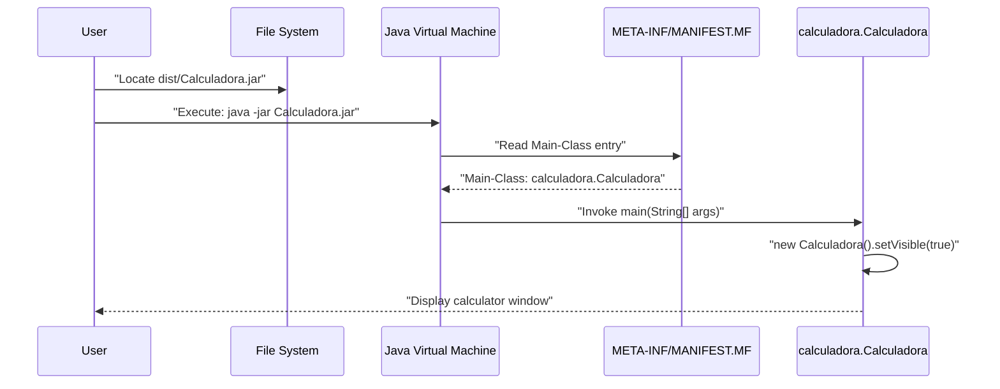
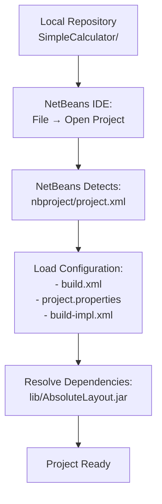
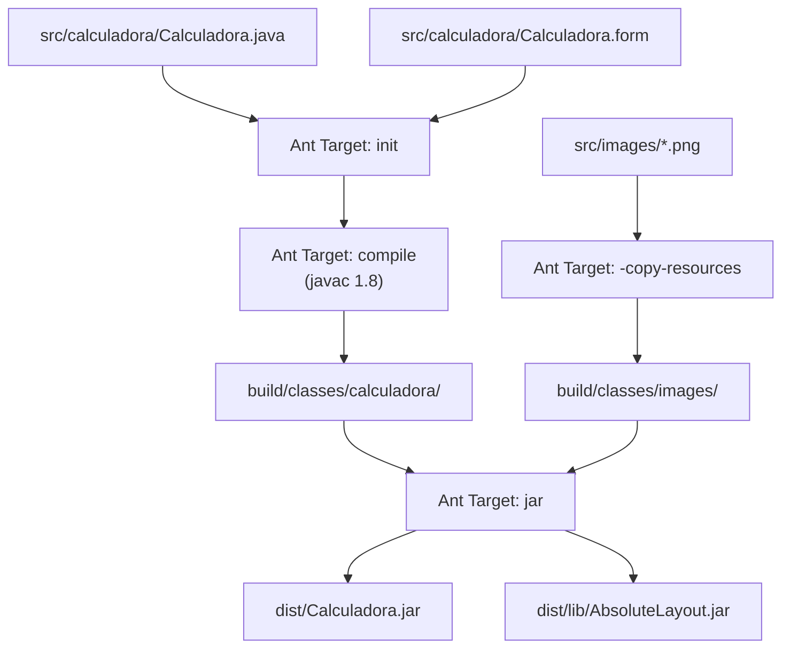
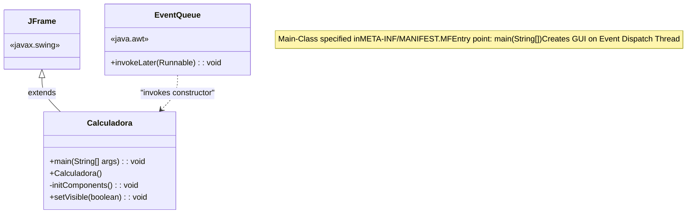

# Getting Started

> **Relevant source files**
> * [README.md](https://github.com/ricardo-alan/SimpleCalculator/blob/e9524f29/README.md)
> * [dist/Calculadora.jar](https://github.com/ricardo-alan/SimpleCalculator/blob/e9524f29/dist/Calculadora.jar)
> * [nbproject/project.xml](https://github.com/ricardo-alan/SimpleCalculator/blob/e9524f29/nbproject/project.xml)

This page provides instructions for running the SimpleCalculator application and setting up the development environment. It covers two primary paths: executing the pre-built application for end users, and configuring NetBeans IDE for developers who want to modify or build the project.

For detailed information about the application's features, see [Features](/ricardo-alan/SimpleCalculator/3-features). For build system configuration, see [Build System](/ricardo-alan/SimpleCalculator/5-build-system).

---

## Overview of Execution Paths

The SimpleCalculator can be launched in two ways, depending on whether you are an end user or a developer:

```

```

**Sources**: [README.md L16-L23](https://github.com/ricardo-alan/SimpleCalculator/blob/e9524f29/README.md#L16-L23)

 [dist/Calculadora.jar L3-L9](https://github.com/ricardo-alan/SimpleCalculator/blob/e9524f29/dist/Calculadora.jar#L3-L9)

 [nbproject/project.xml L1-L15](https://github.com/ricardo-alan/SimpleCalculator/blob/e9524f29/nbproject/project.xml#L1-L15)

---

## Prerequisites

Before running or developing SimpleCalculator, ensure your system meets these requirements:

| Requirement | Version | Purpose |
| --- | --- | --- |
| **Java Runtime Environment (JRE)** | 8 or higher | Required to execute `Calculadora.jar` |
| **Java Development Kit (JDK)** | 1.8 | Required for development and compilation |
| **NetBeans IDE** | 8.2 (recommended) | Required for development workflow |
| **Apache Ant** | 1.9.7+ | Build system (bundled with NetBeans) |
| **Git** | Any recent version | Required to clone repository |

The application was built targeting Java 1.8 compatibility, ensuring it runs on Java 8 and all subsequent versions.

**Sources**: [README.md L18-L21](https://github.com/ricardo-alan/SimpleCalculator/blob/e9524f29/README.md#L18-L21)

 [dist/Calculadora.jar L5](https://github.com/ricardo-alan/SimpleCalculator/blob/e9524f29/dist/Calculadora.jar#L5-L5)

---

## Running the Pre-built Application

The simplest way to run SimpleCalculator is to execute the pre-built JAR file located in the `dist/` directory.

### Execution Steps



**Sources**: [dist/Calculadora.jar L3-L9](https://github.com/ricardo-alan/SimpleCalculator/blob/e9524f29/dist/Calculadora.jar#L3-L9)

 [README.md L23](https://github.com/ricardo-alan/SimpleCalculator/blob/e9524f29/README.md#L23-L23)

### Command-Line Execution

Navigate to the repository root directory and execute:

```

```

Alternatively, on systems with proper JAR file associations, double-click `dist/Calculadora.jar` in your file manager.

### Application Launch Process

When `Calculadora.jar` is executed, the following sequence occurs:

1. **JVM Initialization**: The Java Virtual Machine reads [dist/Calculadora.jar](https://github.com/ricardo-alan/SimpleCalculator/blob/e9524f29/dist/Calculadora.jar)
2. **Manifest Parsing**: The JVM reads `META-INF/MANIFEST.MF` which specifies: * `Main-Class: calculadora.Calculadora` * `Class-Path: lib/AbsoluteLayout.jar`
3. **Class Loading**: The JVM loads the `calculadora.Calculadora` class
4. **Main Method Invocation**: The `main(String[])` method is invoked
5. **GUI Initialization**: A new `Calculadora` instance is created and made visible

The `AbsoluteLayout.jar` library in `dist/lib/` is automatically loaded via the classpath entry in the manifest.

**Sources**: [dist/Calculadora.jar L3-L9](https://github.com/ricardo-alan/SimpleCalculator/blob/e9524f29/dist/Calculadora.jar#L3-L9)

 [README.md L23](https://github.com/ricardo-alan/SimpleCalculator/blob/e9524f29/README.md#L23-L23)

---

## Development Setup

For developers who want to modify, build, or contribute to SimpleCalculator, follow these instructions to set up the development environment.

### Repository Acquisition

Clone the repository using Git:

```

```

This creates a local copy of the project with the following structure:

```markdown
SimpleCalculator/
├── src/                    # Source code
│   └── calculadora/        # Main package
├── dist/                   # Pre-built distribution
├── nbproject/              # NetBeans configuration
├── build.xml               # Ant build script
└── README.md               # Project documentation
```

**Sources**: [README.md L18-L19](https://github.com/ricardo-alan/SimpleCalculator/blob/e9524f29/README.md#L18-L19)

 [nbproject/project.xml L6](https://github.com/ricardo-alan/SimpleCalculator/blob/e9524f29/nbproject/project.xml#L6-L6)

### NetBeans IDE Import Process



**Sources**: [README.md L20](https://github.com/ricardo-alan/SimpleCalculator/blob/e9524f29/README.md#L20-L20)

 [nbproject/project.xml L1-L15](https://github.com/ricardo-alan/SimpleCalculator/blob/e9524f29/nbproject/project.xml#L1-L15)

### NetBeans Import Steps

1. **Launch NetBeans IDE 8.2**
2. **Open Project**: * Navigate to `File → Open Project` (or press `Ctrl+Shift+O`) * Browse to the cloned `SimpleCalculator` directory * NetBeans will recognize it as a Java SE project via [nbproject/project.xml](https://github.com/ricardo-alan/SimpleCalculator/blob/e9524f29/nbproject/project.xml)
3. **Project Recognition**: NetBeans identifies the project configuration: * Project name: `Calculadora` (specified in [nbproject/project.xml L6](https://github.com/ricardo-alan/SimpleCalculator/blob/e9524f29/nbproject/project.xml#L6-L6) ) * Project type: `org.netbeans.modules.java.j2seproject` ([nbproject/project.xml L3](https://github.com/ricardo-alan/SimpleCalculator/blob/e9524f29/nbproject/project.xml#L3-L3) ) * Source root: `src.dir` ([nbproject/project.xml L8](https://github.com/ricardo-alan/SimpleCalculator/blob/e9524f29/nbproject/project.xml#L8-L8) )
4. **Automatic Dependency Resolution**: NetBeans locates `lib/AbsoluteLayout.jar`

**Sources**: [README.md L20](https://github.com/ricardo-alan/SimpleCalculator/blob/e9524f29/README.md#L20-L20)

 [nbproject/project.xml L1-L15](https://github.com/ricardo-alan/SimpleCalculator/blob/e9524f29/nbproject/project.xml#L1-L15)

### Project Structure in IDE

Once imported, NetBeans presents this project structure:

| Node | Description | Corresponds To |
| --- | --- | --- |
| **Source Packages** | `calculadora` package | [src/calculadora/](https://github.com/ricardo-alan/SimpleCalculator/blob/e9524f29/src/calculadora/) |
| **Libraries** | `AbsoluteLayout.jar` | [dist/lib/AbsoluteLayout.jar](https://github.com/ricardo-alan/SimpleCalculator/blob/e9524f29/dist/lib/AbsoluteLayout.jar) |
| **Test Packages** | Unit test sources | [test.src.dir](https://github.com/ricardo-alan/SimpleCalculator/blob/e9524f29/test.src.dir) <br>  (if present) |
| **Configuration Files** | Build and project files | [nbproject/](https://github.com/ricardo-alan/SimpleCalculator/blob/e9524f29/nbproject/) <br>  [build.xml](https://github.com/ricardo-alan/SimpleCalculator/blob/e9524f29/build.xml) |

**Sources**: [nbproject/project.xml L7-L12](https://github.com/ricardo-alan/SimpleCalculator/blob/e9524f29/nbproject/project.xml#L7-L12)

---

## Building and Running from IDE

### Build Process

NetBeans uses Apache Ant as the build system. The build process is defined in [build.xml](https://github.com/ricardo-alan/SimpleCalculator/blob/e9524f29/build.xml)

 and [nbproject/build-impl.xml](https://github.com/ricardo-alan/SimpleCalculator/blob/e9524f29/nbproject/build-impl.xml)



**Sources**: [README.md L21](https://github.com/ricardo-alan/SimpleCalculator/blob/e9524f29/README.md#L21-L21)

 [dist/Calculadora.jar L4-L6](https://github.com/ricardo-alan/SimpleCalculator/blob/e9524f29/dist/Calculadora.jar#L4-L6)

### Build and Run Operations

| Operation | NetBeans Action | Ant Target | Result |
| --- | --- | --- | --- |
| **Clean** | `Run → Clean Project` | `clean` | Removes `build/` and `dist/` directories |
| **Build** | `Run → Build Project` (F11) | `jar` | Compiles sources, creates `dist/Calculadora.jar` |
| **Run** | `Run → Run Project` (F6) | `run` | Builds and executes `calculadora.Calculadora.main()` |
| **Clean & Build** | `Run → Clean and Build Project` | `clean jar` | Full rebuild from scratch |

**Sources**: [README.md L21](https://github.com/ricardo-alan/SimpleCalculator/blob/e9524f29/README.md#L21-L21)

### Running from NetBeans

To run the application from NetBeans:

1. **Ensure Project is Built**: Press `F11` or select `Run → Build Project`
2. **Execute Main Class**: Press `F6` or select `Run → Run Project`
3. **Alternative**: Right-click `Calculadora.java` → `Run File` (Shift+F6)

The application window will appear with the calculator interface in light mode by default.

**Sources**: [README.md L21](https://github.com/ricardo-alan/SimpleCalculator/blob/e9524f29/README.md#L21-L21)

 [dist/Calculadora.jar L8](https://github.com/ricardo-alan/SimpleCalculator/blob/e9524f29/dist/Calculadora.jar#L8-L8)

---

## Main Class Execution Entry Point

The application's entry point is the `main` method in the `calculadora.Calculadora` class:



The `main` method uses `EventQueue.invokeLater()` to create the calculator instance on the Event Dispatch Thread, ensuring thread-safe GUI initialization.

**Sources**: [dist/Calculadora.jar L8](https://github.com/ricardo-alan/SimpleCalculator/blob/e9524f29/dist/Calculadora.jar#L8-L8)

---

## Verification Checklist

After completing setup, verify your installation:

| Check | Expected Result |
| --- | --- |
| **JRE Version** | `java -version` shows 1.8.0 or higher |
| **JAR Execution** | `java -jar dist/Calculadora.jar` opens calculator window |
| **NetBeans Project** | Project opens without errors, all source files visible |
| **Build Success** | `Run → Build Project` completes with "BUILD SUCCESSFUL" |
| **IDE Execution** | `Run → Run Project` launches calculator application |
| **Window Display** | Calculator window appears with all buttons and displays |

If the calculator window does not appear, verify that your system supports GUI applications (X11 on Linux, display server on Windows/macOS).

**Sources**: [README.md L16-L23](https://github.com/ricardo-alan/SimpleCalculator/blob/e9524f29/README.md#L16-L23)

 [dist/Calculadora.jar L1-L9](https://github.com/ricardo-alan/SimpleCalculator/blob/e9524f29/dist/Calculadora.jar#L1-L9)

---

## Next Steps

After successfully running the application or setting up the development environment:

* **Explore Features**: See [Features](/ricardo-alan/SimpleCalculator/3-features) for detailed functionality documentation
* **Understand Architecture**: Review [Architecture](/ricardo-alan/SimpleCalculator/4-architecture) for component design
* **Modify Build**: See [Build System](/ricardo-alan/SimpleCalculator/5-build-system) for customization options
* **Review Dependencies**: See [Dependencies](/ricardo-alan/SimpleCalculator/7-dependencies) for library information

**Sources**: [README.md L9-L31](https://github.com/ricardo-alan/SimpleCalculator/blob/e9524f29/README.md#L9-L31)