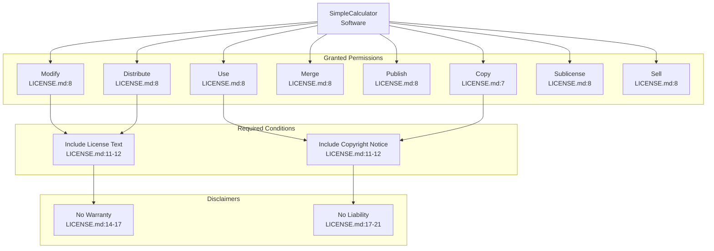
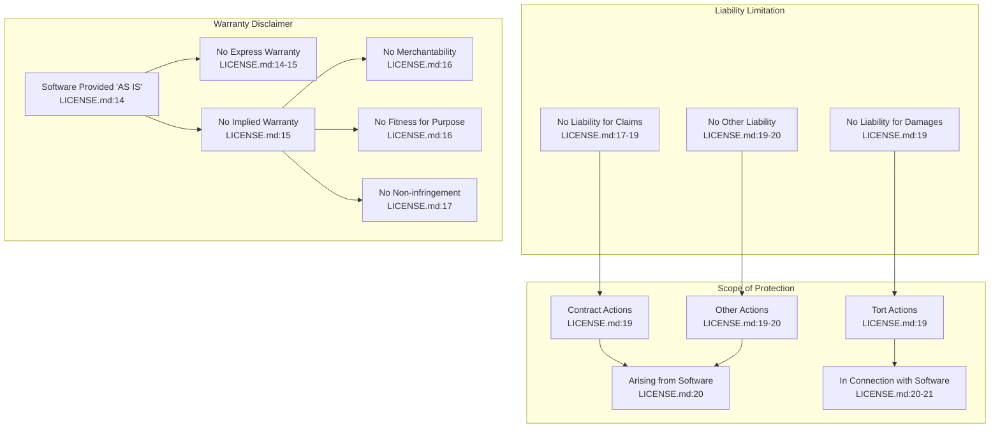

# License

> **Relevant source files**
> * [LICENSE.md](https://github.com/ricardo-alan/SimpleCalculator/blob/e9524f29/LICENSE.md)
> * [README.md](https://github.com/ricardo-alan/SimpleCalculator/blob/e9524f29/README.md)

This page documents the licensing terms under which the SimpleCalculator project is distributed. It covers the MIT License, copyright information, permissions, and obligations for users and contributors of the codebase.

For general project information and features, see [Overview](/ricardo-alan/SimpleCalculator/1-overview). For information about the project's dependencies, see [Dependencies](/ricardo-alan/SimpleCalculator/7-dependencies).

## License Overview

The SimpleCalculator project is distributed under the MIT License, a permissive open-source license that allows broad freedom in usage, modification, and distribution. The license information is declared in two locations:

| Location | Purpose | Content |
| --- | --- | --- |
| [README.md L29-L31](https://github.com/ricardo-alan/SimpleCalculator/blob/e9524f29/README.md#L29-L31) | License declaration | References MIT License and links to full text |
| [LICENSE.md L1-L22](https://github.com/ricardo-alan/SimpleCalculator/blob/e9524f29/LICENSE.md#L1-L22) | Full license text | Complete MIT License with copyright notice |

The MIT License is one of the most permissive open-source licenses, imposing minimal restrictions on reuse while requiring preservation of copyright and license notices.

**Sources:** README.md, LICENSE.md

## Copyright Information

The project copyright is held by:

```
Copyright (c) 2020 Ricardo Hernandez
```

This copyright notice appears at [LICENSE.md L3](https://github.com/ricardo-alan/SimpleCalculator/blob/e9524f29/LICENSE.md#L3-L3)

 and establishes the original author and year of publication. The copyright holder retains moral rights to the work while granting extensive permissions through the MIT License terms.

**Sources:** LICENSE.md

## License Documentation Structure

```

```

**Sources:** README.md, LICENSE.md

## Full License Text

The complete MIT License as it appears in [LICENSE.md L1-L22](https://github.com/ricardo-alan/SimpleCalculator/blob/e9524f29/LICENSE.md#L1-L22)

:

```
MIT License

Copyright (c) 2020 Ricardo Hernandez

Permission is hereby granted, free of charge, to any person obtaining a copy
of this software and associated documentation files (the "Software"), to deal
in the Software without restriction, including without limitation the rights
to use, copy, modify, merge, publish, distribute, sublicense, and/or sell
copies of the Software, and to permit persons to whom the Software is
furnished to do so, subject to the following conditions:

The above copyright notice and this permission notice shall be included in all
copies or substantial portions of the Software.

THE SOFTWARE IS PROVIDED "AS IS", WITHOUT WARRANTY OF ANY KIND, EXPRESS OR
IMPLIED, INCLUDING BUT NOT LIMITED TO THE WARRANTIES OF MERCHANTABILITY,
FITNESS FOR A PARTICULAR PURPOSE AND NONINFRINGEMENT. IN NO EVENT SHALL THE
AUTHORS OR COPYRIGHT HOLDERS BE LIABLE FOR ANY CLAIM, DAMAGES OR OTHER
LIABILITY, WHETHER IN AN ACTION OF CONTRACT, TORT OR OTHERWISE, ARISING FROM,
OUT OF OR IN CONNECTION WITH THE SOFTWARE OR THE USE OR OTHER DEALINGS IN THE
SOFTWARE.
```

**Sources:** LICENSE.md

## Permissions and Conditions

The MIT License grants extensive permissions while imposing minimal conditions:



**Sources:** LICENSE.md

## Permissions Breakdown

The license explicitly grants the following rights without restriction ([LICENSE.md L5-L9](https://github.com/ricardo-alan/SimpleCalculator/blob/e9524f29/LICENSE.md#L5-L9)

):

| Permission | Description | Applies To |
| --- | --- | --- |
| **Use** | Execute and run the software | `dist/Calculadora.jar`, all source files |
| **Copy** | Create copies of the software | Entire repository contents |
| **Modify** | Change and adapt the source code | `src/calculadora/Calculadora.java`, all source files |
| **Merge** | Combine with other software | Integration projects using SimpleCalculator |
| **Publish** | Make available to others | Public repositories, websites |
| **Distribute** | Share copies with others | Binary distributions, forks |
| **Sublicense** | Grant rights to downstream users | Derivative works, embedded applications |
| **Sell** | Commercial use and sale | Commercial products incorporating the calculator |

**Sources:** LICENSE.md

## Attribution Requirements

The only mandatory obligation under the MIT License is preservation of attribution ([LICENSE.md L11-L13](https://github.com/ricardo-alan/SimpleCalculator/blob/e9524f29/LICENSE.md#L11-L13)

):

### Required in All Copies

Both the copyright notice and license text must be included in:

* **Substantial portions of the Software**: Any distribution containing significant code from SimpleCalculator
* **All copies**: Complete reproductions of the software
* **Derivative works**: Modified versions and adaptations

### Practical Implementation

Attribution can be satisfied by:

1. Including the original `LICENSE.md` file in distributions
2. Preserving the copyright notice in source file headers (if added)
3. Documenting the use of SimpleCalculator in project documentation or README files
4. Including license text in application "About" dialogs or documentation

**Sources:** LICENSE.md

## Warranty Disclaimer and Liability Limitation

The MIT License includes comprehensive disclaimers ([LICENSE.md L14-L21](https://github.com/ricardo-alan/SimpleCalculator/blob/e9524f29/LICENSE.md#L14-L21)

):



**Sources:** LICENSE.md

## License File References in Codebase

The license is referenced in the following locations:

| File | Line Range | Reference Type |
| --- | --- | --- |
| `README.md` | [29-31](https://github.com/ricardo-alan/SimpleCalculator/blob/e9524f29/29-31) | Textual declaration and link |
| `LICENSE.md` | [1-22](https://github.com/ricardo-alan/SimpleCalculator/blob/e9524f29/1-22) | Complete license text |

The project follows standard open-source practices by:

1. Placing the full license text in a dedicated `LICENSE.md` file at the repository root
2. Referencing the license in the `README.md` with a direct link
3. Identifying the license type explicitly ("MIT License")

**Sources:** README.md, LICENSE.md

## Implications for Usage

### For End Users

Running the calculator application (`dist/Calculadora.jar`) does not impose any obligations. Users are free to:

* Execute the application without restrictions
* Use it for personal or commercial purposes
* Modify their local copy as needed

No attribution is required for merely running the software.

### For Developers and Redistributors

When modifying, forking, or redistributing SimpleCalculator:

**Required Actions:**

* Preserve the copyright notice from [LICENSE.md L3](https://github.com/ricardo-alan/SimpleCalculator/blob/e9524f29/LICENSE.md#L3-L3)
* Include the full license text from [LICENSE.md L1-L22](https://github.com/ricardo-alan/SimpleCalculator/blob/e9524f29/LICENSE.md#L1-L22)
* Retain these in all copies and substantial portions

**Permitted Actions:**

* Create derivative works
* Integrate into commercial products
* Distribute modified versions
* Relicense derivative works (while preserving MIT notice for original code)

**Not Required:**

* Disclosing source code of modifications
* Using the same license for derivative works
* Seeking permission from the copyright holder
* Paying royalties or fees

### For Contributors

Contributors to the SimpleCalculator project implicitly agree to have their contributions distributed under the same MIT License terms. The copyright holder (Ricardo Hernandez) retains copyright on the original work, while contributors retain copyright on their specific contributions, all licensed under MIT terms.

**Sources:** LICENSE.md, README.md

## Comparison with Project Dependencies

The SimpleCalculator project includes the AbsoluteLayout library ([dist/lib/AbsoluteLayout.jar](https://github.com/ricardo-alan/SimpleCalculator/blob/e9524f29/dist/lib/AbsoluteLayout.jar)

). The MIT License terms of SimpleCalculator do not automatically extend to this dependency, which has its own licensing terms. See [Dependencies](/ricardo-alan/SimpleCalculator/7-dependencies) and [AbsoluteLayout Library](/ricardo-alan/SimpleCalculator/7.1-absolutelayout-library) for information about third-party library licensing.

**Sources:** README.md, LICENSE.md