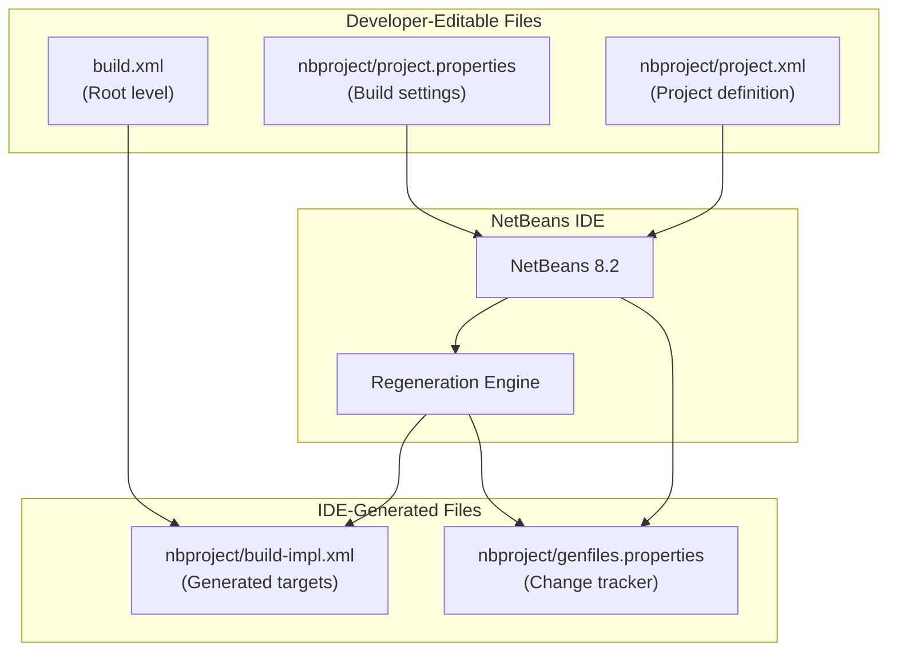
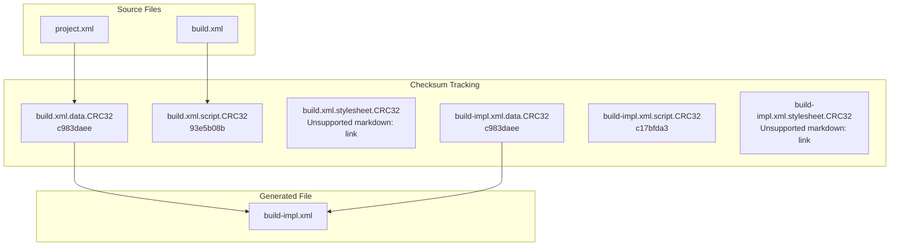
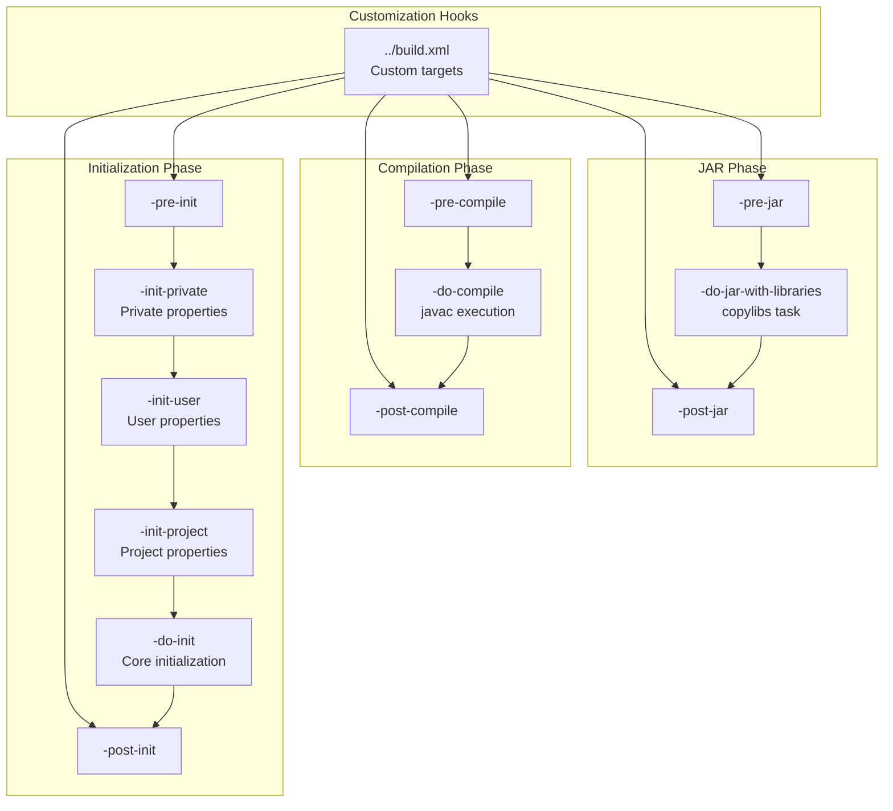
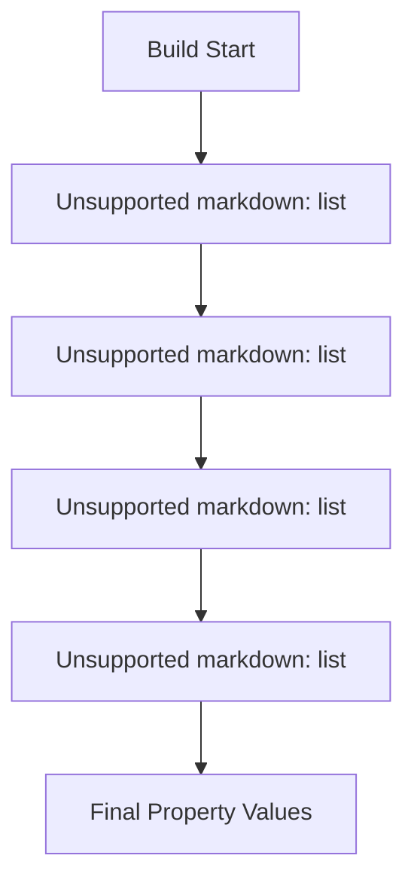
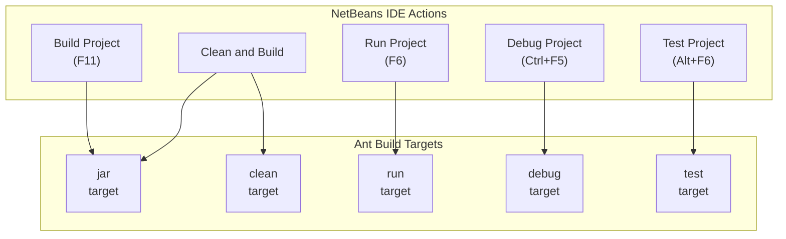
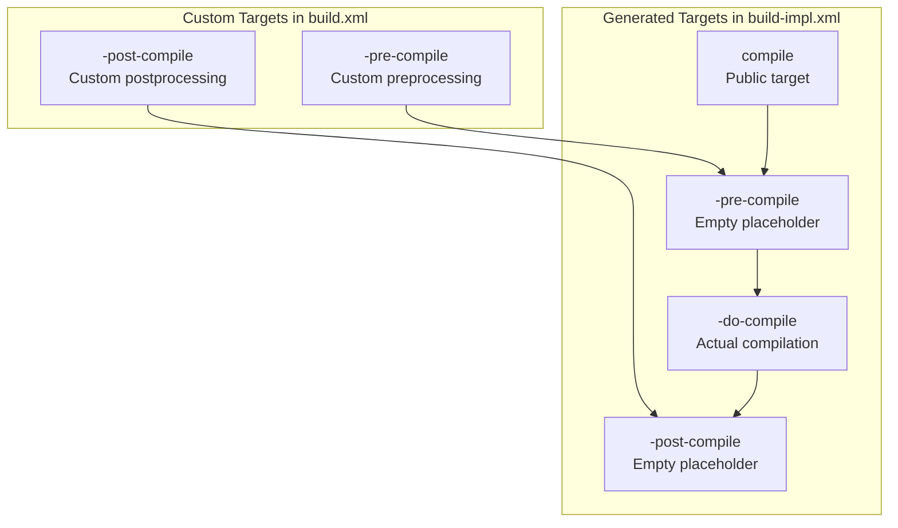

# NetBeans Integration

> **Relevant source files**
> * [nbproject/build-impl.xml](https://github.com/ricardo-alan/SimpleCalculator/blob/e9524f29/nbproject/build-impl.xml)
> * [nbproject/genfiles.properties](https://github.com/ricardo-alan/SimpleCalculator/blob/e9524f29/nbproject/genfiles.properties)
> * [nbproject/project.xml](https://github.com/ricardo-alan/SimpleCalculator/blob/e9524f29/nbproject/project.xml)

## Purpose and Scope

This document explains how NetBeans IDE integrates with the SimpleCalculator project through its build system management, file generation tracking, and project configuration mechanisms. It covers the generated build files, the `genfiles.properties` tracking system, and the relationship between IDE-managed and developer-editable files.

For general build system architecture and the Apache Ant build lifecycle, see [Build Configuration](/ricardo-alan/SimpleCalculator/5.1-build-configuration) and [Build Lifecycle](/ricardo-alan/SimpleCalculator/5.2-build-lifecycle). For details on the distribution artifacts produced by the build system, see [Distribution and Packaging](/ricardo-alan/SimpleCalculator/5.3-distribution-and-packaging).

---

## File Organization and Ownership

NetBeans maintains a clear separation between IDE-generated files and developer-editable files in the `nbproject/` directory. Understanding this distinction is critical for proper project maintenance.



**Sources:** [nbproject/build-impl.xml L1-L21](https://github.com/ricardo-alan/SimpleCalculator/blob/e9524f29/nbproject/build-impl.xml#L1-L21)

 [nbproject/genfiles.properties L1-L9](https://github.com/ricardo-alan/SimpleCalculator/blob/e9524f29/nbproject/genfiles.properties#L1-L9)

 [nbproject/project.xml L1-L16](https://github.com/ricardo-alan/SimpleCalculator/blob/e9524f29/nbproject/project.xml#L1-L16)

### File Classification Table

| File | Type | Safe to Edit | Purpose |
| --- | --- | --- | --- |
| `build.xml` | Developer | Yes | Custom build targets and overrides |
| `nbproject/project.xml` | Developer | Yes | Project type and structure definition |
| `nbproject/project.properties` | Developer | Yes | Build configuration properties |
| `nbproject/build-impl.xml` | Generated | **No** | Complete Ant build implementation |
| `nbproject/genfiles.properties` | Generated | **No** | Change tracking checksums |

**Sources:** [nbproject/build-impl.xml L2-L5](https://github.com/ricardo-alan/SimpleCalculator/blob/e9524f29/nbproject/build-impl.xml#L2-L5)

---

## Generated Files Management

NetBeans uses CRC32 checksums to track whether generated files need regeneration. This mechanism is implemented in `genfiles.properties`.

### genfiles.properties Structure



The file contains three types of checksums for each build file:

1. **Data CRC32**: Checksums the project data (from `project.xml`)
2. **Script CRC32**: Checksums the build script content
3. **Stylesheet CRC32**: References the NetBeans platform version and stylesheet

**Sources:** [nbproject/genfiles.properties L1-L9](https://github.com/ricardo-alan/SimpleCalculator/blob/e9524f29/nbproject/genfiles.properties#L1-L9)

### Regeneration Trigger Mechanism

When NetBeans opens the project, it:

1. Computes CRC32 checksums of current `project.xml` and `build.xml`
2. Compares against stored checksums in `genfiles.properties`
3. If mismatches are detected, regenerates `build-impl.xml`
4. Updates `genfiles.properties` with new checksums

The stylesheet version `@1.80.1.48` indicates the NetBeans 8.2 platform version used to generate the files.

**Sources:** [nbproject/genfiles.properties L1-L9](https://github.com/ricardo-alan/SimpleCalculator/blob/e9524f29/nbproject/genfiles.properties#L1-L9)

---

## Build Implementation Generation

The `build-impl.xml` file is a comprehensive, IDE-generated Ant build script containing all standard build targets. It is explicitly marked as **generated and should not be edited**.

### Warning Header

The file begins with a clear warning:

```
*** GENERATED FROM project.xml - DO NOT EDIT  ***
***         EDIT ../build.xml INSTEAD         ***
```

**Sources:** [nbproject/build-impl.xml L2-L5](https://github.com/ricardo-alan/SimpleCalculator/blob/e9524f29/nbproject/build-impl.xml#L2-L5)

### Build Implementation Structure



**Sources:** [nbproject/build-impl.xml L36-L228](https://github.com/ricardo-alan/SimpleCalculator/blob/e9524f29/nbproject/build-impl.xml#L36-L228)

 [nbproject/build-impl.xml L914-L945](https://github.com/ricardo-alan/SimpleCalculator/blob/e9524f29/nbproject/build-impl.xml#L914-L945)

 [nbproject/build-impl.xml L965-L1033](https://github.com/ricardo-alan/SimpleCalculator/blob/e9524f29/nbproject/build-impl.xml#L965-L1033)

### Key Sections in build-impl.xml

| Line Range | Section | Purpose |
| --- | --- | --- |
| [1-21](https://github.com/ricardo-alan/SimpleCalculator/blob/e9524f29/1-21) | Header Comments | Documentation and warnings |
| [23-29](https://github.com/ricardo-alan/SimpleCalculator/blob/e9524f29/23-29) | Project Declaration | Defines project with namespaces |
| [36-228](https://github.com/ricardo-alan/SimpleCalculator/blob/e9524f29/36-228) | Initialization | Property loading and environment setup |
| [253-326](https://github.com/ricardo-alan/SimpleCalculator/blob/e9524f29/253-326) | Javac Macros | Compilation macrodefs with/without annotation processing |
| [361-435](https://github.com/ricardo-alan/SimpleCalculator/blob/e9524f29/361-435) | JUnit Macros | Test execution macrodefs |
| [436-463](https://github.com/ricardo-alan/SimpleCalculator/blob/e9524f29/436-463) | TestNG Macros | TestNG test execution |
| [728-771](https://github.com/ricardo-alan/SimpleCalculator/blob/e9524f29/728-771) | Debug Macros | JPDA debugging support |
| [823-853](https://github.com/ricardo-alan/SimpleCalculator/blob/e9524f29/823-853) | CopyLibs Macro | Library packaging for distribution |
| [891-960](https://github.com/ricardo-alan/SimpleCalculator/blob/e9524f29/891-960) | Compilation Targets | Source compilation and resource copying |
| [965-1033](https://github.com/ricardo-alan/SimpleCalculator/blob/e9524f29/965-1033) | JAR Building | Manifest creation, JAR packaging, library distribution |

**Sources:** [nbproject/build-impl.xml L1-L1033](https://github.com/ricardo-alan/SimpleCalculator/blob/e9524f29/nbproject/build-impl.xml#L1-L1033)

### Property Loading Cascade

The initialization follows a specific property precedence order:



**Sources:** [nbproject/build-impl.xml L40-L55](https://github.com/ricardo-alan/SimpleCalculator/blob/e9524f29/nbproject/build-impl.xml#L40-L55)

---

## Project Definition

The `project.xml` file defines the fundamental project structure for NetBeans.

### Project Structure

```mermaid
flowchart TD

ROOT["element<br>NetBeans namespace"]
TYPE["<br>org.netbeans.modules.java.j2seproject"]
CONFIG[""]
DATA["j2se-project/3 namespace"]
NAME["Calculadora"]
SRCROOTS[""]
TESTROOTS[""]
SRCDIR[""]
TESTDIR[""]

subgraph project.xml ["project.xml"]
    ROOT
    TYPE
    CONFIG
    DATA
    NAME
    SRCROOTS
    TESTROOTS
    SRCDIR
    TESTDIR
    ROOT --> TYPE
    ROOT --> CONFIG
    CONFIG --> DATA
    DATA --> NAME
    DATA --> SRCROOTS
    DATA --> TESTROOTS
    SRCROOTS --> SRCDIR
    TESTROOTS --> TESTDIR
end
```

**Sources:** [nbproject/project.xml L1-L16](https://github.com/ricardo-alan/SimpleCalculator/blob/e9524f29/nbproject/project.xml#L1-L16)

### XML Structure Details

The project definition uses two XML namespaces:

1. **Project namespace**: `http://www.netbeans.org/ns/project/1`
2. **J2SE project namespace**: `http://www.netbeans.org/ns/j2se-project/3`

The `<type>` element `org.netbeans.modules.java.j2seproject` tells NetBeans this is a Java SE application project, which determines:

* Available IDE features (GUI builder, profiler, etc.)
* Build script generation templates
* Project-specific actions and menus

**Sources:** [nbproject/project.xml L2-L5](https://github.com/ricardo-alan/SimpleCalculator/blob/e9524f29/nbproject/project.xml#L2-L5)

### Source Root Configuration

The `<source-roots>` and `<test-roots>` sections use symbolic IDs:

* `src.dir` - Resolved from `project.properties` to actual source path
* `test.src.dir` - Resolved from `project.properties` to test source path

These IDs are referenced throughout `build-impl.xml` in property resolution.

**Sources:** [nbproject/project.xml L7-L12](https://github.com/ricardo-alan/SimpleCalculator/blob/e9524f29/nbproject/project.xml#L7-L12)

---

## NetBeans IDE Integration Points

NetBeans integrates with the build system through several mechanisms that coordinate IDE actions with Ant targets.

### IDE Action to Build Target Mapping



**Sources:** [nbproject/build-impl.xml L30](https://github.com/ricardo-alan/SimpleCalculator/blob/e9524f29/nbproject/build-impl.xml#L30-L30)

 [nbproject/build-impl.xml L1033](https://github.com/ricardo-alan/SimpleCalculator/blob/e9524f29/nbproject/build-impl.xml#L1033-L1033)

 [nbproject/build-impl.xml L1039-L1045](https://github.com/ricardo-alan/SimpleCalculator/blob/e9524f29/nbproject/build-impl.xml#L1039-L1045)

### Automatic Build Detection

NetBeans marks automatic builds by creating a marker file:

```
${build.classes.dir}/.netbeans_automatic_build
```

The build system checks for this marker and triggers a full clean if detected, ensuring IDE-driven incremental builds don't conflict with command-line builds.

**Sources:** [nbproject/build-impl.xml L908-L913](https://github.com/ricardo-alan/SimpleCalculator/blob/e9524f29/nbproject/build-impl.xml#L908-L913)

---

## Customization and Override Mechanism

While `build-impl.xml` is generated and should not be edited, NetBeans provides explicit customization hooks through the root-level `build.xml`.

### Override Target Pattern



**Sources:** [nbproject/build-impl.xml L917-L920](https://github.com/ricardo-alan/SimpleCalculator/blob/e9524f29/nbproject/build-impl.xml#L917-L920)

 [nbproject/build-impl.xml L941-L944](https://github.com/ricardo-alan/SimpleCalculator/blob/e9524f29/nbproject/build-impl.xml#L941-L944)

### Standard Customization Points

The following targets are explicitly designed for override in `build.xml`:

| Target Name | Phase | Purpose |
| --- | --- | --- |
| `-pre-init` | Initialization | Execute before property loading |
| `-post-init` | Initialization | Execute after all initialization |
| `-pre-compile` | Compilation | Preprocess sources before compilation |
| `-post-compile` | Compilation | Post-process compiled classes |
| `-pre-jar` | Packaging | Prepare for JAR creation |
| `-post-jar` | Packaging | Modify JAR after creation |

**Sources:** [nbproject/build-impl.xml L36-L39](https://github.com/ricardo-alan/SimpleCalculator/blob/e9524f29/nbproject/build-impl.xml#L36-L39)

 [nbproject/build-impl.xml L228-L231](https://github.com/ricardo-alan/SimpleCalculator/blob/e9524f29/nbproject/build-impl.xml#L228-L231)

 [nbproject/build-impl.xml L917-L920](https://github.com/ricardo-alan/SimpleCalculator/blob/e9524f29/nbproject/build-impl.xml#L917-L920)

 [nbproject/build-impl.xml L941-L944](https://github.com/ricardo-alan/SimpleCalculator/blob/e9524f29/nbproject/build-impl.xml#L941-L944)

 [nbproject/build-impl.xml L969-L972](https://github.com/ricardo-alan/SimpleCalculator/blob/e9524f29/nbproject/build-impl.xml#L969-L972)

 [nbproject/build-impl.xml L1028-L1031](https://github.com/ricardo-alan/SimpleCalculator/blob/e9524f29/nbproject/build-impl.xml#L1028-L1031)

### Comment Markers for Customization

Each customization target includes a comment:

```
<!-- Empty placeholder for easier customization. -->
<!-- You can override this target in the ../build.xml file. -->
```

This pattern appears throughout `build-impl.xml` to indicate safe override points.

**Sources:** [nbproject/build-impl.xml L37-L38](https://github.com/ricardo-alan/SimpleCalculator/blob/e9524f29/nbproject/build-impl.xml#L37-L38)

 [nbproject/build-impl.xml L918-L919](https://github.com/ricardo-alan/SimpleCalculator/blob/e9524f29/nbproject/build-impl.xml#L918-L919)

---

## Ant Version Requirements

NetBeans enforces minimum Ant version requirements in the generated build file:

```xml
<fail message="Please build using Ant 1.8.0 or higher.">
    <condition>
        <not>
            <antversion atleast="1.8.0"/>
        </not>
    </condition>
</fail>
```

This ensures that the build file features (such as advanced macrodefs and property resolution) are supported by the Ant runtime.

**Sources:** [nbproject/build-impl.xml L23-L29](https://github.com/ricardo-alan/SimpleCalculator/blob/e9524f29/nbproject/build-impl.xml#L23-L29)

---

## Summary

NetBeans integration in the SimpleCalculator project relies on:

1. **Separation of concerns**: Generated files (`build-impl.xml`) vs. developer files (`build.xml`, `project.xml`)
2. **Change tracking**: CRC32 checksums in `genfiles.properties` trigger regeneration
3. **Customization hooks**: Pre/post targets allow safe build customization
4. **Property cascading**: Multiple property files with clear precedence order
5. **IDE action mapping**: Direct mapping from IDE actions to Ant targets

This architecture allows developers to customize the build process without modifying generated files, ensuring IDE updates don't overwrite customizations.

**Sources:** [nbproject/build-impl.xml L1-L2200](https://github.com/ricardo-alan/SimpleCalculator/blob/e9524f29/nbproject/build-impl.xml#L1-L2200)

 [nbproject/genfiles.properties L1-L9](https://github.com/ricardo-alan/SimpleCalculator/blob/e9524f29/nbproject/genfiles.properties#L1-L9)

 [nbproject/project.xml L1-L16](https://github.com/ricardo-alan/SimpleCalculator/blob/e9524f29/nbproject/project.xml#L1-L16)