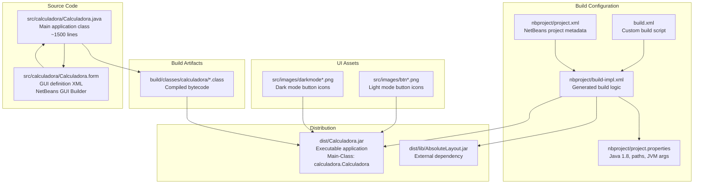

# Overview

> **Relevant source files**
> * [README.md](https://github.com/ricardo-alan/SimpleCalculator/blob/e9524f29/README.md)

This document provides a comprehensive introduction to the SimpleCalculator project, covering its purpose, architectural design, and major components. It serves as the entry point for understanding the codebase structure and implementation approach.

For instructions on running the application or setting up the development environment, see [Getting Started](/ricardo-alan/SimpleCalculator/2-getting-started). For detailed feature documentation, see [Features](/ricardo-alan/SimpleCalculator/3-features). For in-depth architectural analysis, see [Architecture](/ricardo-alan/SimpleCalculator/4-architecture).

---

## Purpose and Scope

SimpleCalculator is a desktop calculator application written in Java that provides a modern, user-friendly interface for performing basic arithmetic operations. The application emphasizes real-time calculation feedback and visual customization through light and dark themes.

The project is built using the NetBeans IDE 8.2 platform and leverages Java Swing for its graphical user interface. It demonstrates a complete Java desktop application workflow, including GUI design, event handling, expression evaluation, and theme management.

**Sources:** [README.md L1-L31](https://github.com/ricardo-alan/SimpleCalculator/blob/e9524f29/README.md#L1-L31)

---

## Key Features Summary

| Feature | Description | Implementation |
| --- | --- | --- |
| **Arithmetic Operations** | Addition, subtraction, multiplication, division, percentage | JavaScript `ScriptEngine` evaluation |
| **Real-time Results** | Immediate calculation feedback as user types | Event-driven display updates |
| **Theme System** | Light and dark mode support | Dynamic color and icon switching |
| **Fixed Window Design** | Undecorated, non-resizable 340x570px window | `AbsoluteLayout` positioning |
| **Custom Window Controls** | Integrated close and minimize buttons | Custom title bar implementation |

**Sources:** [README.md L9-L14](https://github.com/ricardo-alan/SimpleCalculator/blob/e9524f29/README.md#L9-L14)

---

## High-Level Architecture

The following diagram illustrates the major components of the SimpleCalculator application and their relationships, using actual code entities from the codebase:

```

```

**Diagram: Component Architecture with Code Entity Mapping**

This architecture follows a layered design pattern where the UI layer handles presentation and user input, the business logic layer processes calculations and manages state, and the presentation layer controls visual theming.

**Sources:** [src/calculadora/Calculadora.java

1](https://github.com/ricardo-alan/SimpleCalculator/blob/e9524f29/src/calculadora/Calculadora.java#L1-LNaN)

 [src/calculadora/Calculadora.form

1](https://github.com/ricardo-alan/SimpleCalculator/blob/e9524f29/src/calculadora/Calculadora.form#L1-LNaN)

---

## Core Components and Files

The following diagram maps the logical components to their physical file locations in the repository:



**Diagram: File Organization and Build Artifact Flow**

The codebase is organized around a single main class (`calculadora.Calculadora`) with dual representations: the `.java` source file containing logic and event handlers, and the `.form` file containing the GUI layout definition managed by NetBeans GUI Builder.

**Sources:** [src/calculadora/Calculadora.java

1](https://github.com/ricardo-alan/SimpleCalculator/blob/e9524f29/src/calculadora/Calculadora.java#L1-LNaN)

 [src/calculadora/Calculadora.form

1](https://github.com/ricardo-alan/SimpleCalculator/blob/e9524f29/src/calculadora/Calculadora.form#L1-LNaN)

 [nbproject/build-impl.xml

1](https://github.com/ricardo-alan/SimpleCalculator/blob/e9524f29/nbproject/build-impl.xml#L1-LNaN)

 [nbproject/project.properties

1](https://github.com/ricardo-alan/SimpleCalculator/blob/e9524f29/nbproject/project.properties#L1-LNaN)

---

## Technology Stack

| Layer | Technology | Version/Details | Purpose |
| --- | --- | --- | --- |
| **Runtime Environment** | Java Virtual Machine | Java SE 8+ | Application execution platform |
| **GUI Framework** | Swing | `javax.swing.*` | User interface components |
| **Layout Manager** | AbsoluteLayout | NetBeans library | Pixel-perfect component positioning |
| **Expression Evaluator** | ScriptEngine | `javax.script.ScriptEngineManager` | JavaScript-based calculation engine |
| **Build System** | Apache Ant | 1.9+ | Compilation and packaging |
| **IDE** | NetBeans | 8.2 | Development environment |
| **Language Level** | Java | Source/Target: 1.8 | Compatibility level |

The application's calculation engine uses the `javax.script.ScriptEngine` with JavaScript as the scripting language, which allows complex mathematical expressions to be evaluated without implementing a custom parser. This is instantiated in the main class and used throughout the calculation lifecycle.

**Sources:** [nbproject/project.properties

1](https://github.com/ricardo-alan/SimpleCalculator/blob/e9524f29/nbproject/project.properties#L1-LNaN)

 [src/calculadora/Calculadora.java

1](https://github.com/ricardo-alan/SimpleCalculator/blob/e9524f29/src/calculadora/Calculadora.java#L1-LNaN)

 [dist/lib/AbsoluteLayout.jar

1](https://github.com/ricardo-alan/SimpleCalculator/blob/e9524f29/dist/lib/AbsoluteLayout.jar#L1-LNaN)

---

## Project Structure

```python
SimpleCalculator/
├── src/                          # Source code directory
│   └── calculadora/              # Main package
│       ├── Calculadora.java      # Application class (extends JFrame)
│       ├── Calculadora.form      # GUI builder definition
│       └── images/               # Image resources
│           ├── btn*.png          # Light mode icons
│           └── darkmode*.png     # Dark mode icons
├── nbproject/                    # NetBeans project configuration
│   ├── build-impl.xml            # Generated build implementation
│   ├── project.properties        # Build properties and paths
│   ├── project.xml               # Project metadata
│   └── private/                  # User-specific settings (not in VCS)
├── build/                        # Temporary build artifacts
│   └── classes/                  # Compiled .class files
├── dist/                         # Distribution directory
│   ├── Calculadora.jar           # Executable JAR
│   └── lib/                      # Runtime dependencies
│       └── AbsoluteLayout.jar    # Layout library
├── build.xml                     # Custom Ant build script
├── README.md                     # Project documentation
├── LICENSE.md                    # MIT License
└── screenshots/                  # Application screenshots
    ├── light.png                 # Light mode appearance
    └── dark.png                  # Dark mode appearance
```

The project follows the standard NetBeans Java SE Application structure, with clear separation between source code (`src/`), build configuration (`nbproject/`), temporary artifacts (`build/`), and distributable outputs (`dist/`).

**Sources:** [README.md L1-L31](https://github.com/ricardo-alan/SimpleCalculator/blob/e9524f29/README.md#L1-L31)

 [nbproject/project.xml

1](https://github.com/ricardo-alan/SimpleCalculator/blob/e9524f29/nbproject/project.xml#L1-LNaN)

---

## Application Entry Point

The application's main entry point is defined in the JAR manifest:

```
Main-Class: calculadora.Calculadora
```

The `calculadora.Calculadora` class extends `javax.swing.JFrame` and contains:

* **UI Component Declarations**: All Swing components (panels, buttons, labels)
* **Event Handlers**: Methods like `btn_0ActionPerformed`, `btn_sumaActionPerformed`, etc.
* **Business Logic**: The `addNumber` method for input aggregation
* **Calculation Logic**: `ScriptEngine` instantiation and expression evaluation
* **Theme Management**: The `modoOscuro` boolean flag and color switching logic
* **Window Management**: Custom close/minimize button implementations

The class is primarily generated by the NetBeans GUI Builder but includes hand-written business logic sections.

**Sources:** [src/calculadora/Calculadora.java

1](https://github.com/ricardo-alan/SimpleCalculator/blob/e9524f29/src/calculadora/Calculadora.java#L1-LNaN)

 [dist/Calculadora.jar](https://github.com/ricardo-alan/SimpleCalculator/blob/e9524f29/dist/Calculadora.jar#LNaN-LNaN)

---

## Development Workflow

The typical development workflow involves:

1. **GUI Design**: Use NetBeans GUI Builder to modify [src/calculadora/Calculadora.form](https://github.com/ricardo-alan/SimpleCalculator/blob/e9524f29/src/calculadora/Calculadora.form)
2. **Code Generation**: NetBeans automatically updates [src/calculadora/Calculadora.java](https://github.com/ricardo-alan/SimpleCalculator/blob/e9524f29/src/calculadora/Calculadora.java)  with UI initialization code
3. **Business Logic**: Manually implement event handlers and calculation logic in protected sections
4. **Asset Management**: Add/modify PNG icons in [src/calculadora/images/](https://github.com/ricardo-alan/SimpleCalculator/blob/e9524f29/src/calculadora/images/)
5. **Build**: Execute Ant targets defined in [build.xml](https://github.com/ricardo-alan/SimpleCalculator/blob/e9524f29/build.xml)  and [nbproject/build-impl.xml](https://github.com/ricardo-alan/SimpleCalculator/blob/e9524f29/nbproject/build-impl.xml)
6. **Test**: Run the application from [dist/Calculadora.jar](https://github.com/ricardo-alan/SimpleCalculator/blob/e9524f29/dist/Calculadora.jar)

For detailed development setup instructions, see [Development Setup](/ricardo-alan/SimpleCalculator/2.2-development-setup). For build system details, see [Build System](/ricardo-alan/SimpleCalculator/5-build-system).

**Sources:** [README.md L16-L23](https://github.com/ricardo-alan/SimpleCalculator/blob/e9524f29/README.md#L16-L23)

 [build.xml

1](https://github.com/ricardo-alan/SimpleCalculator/blob/e9524f29/build.xml#L1-LNaN)

---

## External Dependencies

The application has a single external runtime dependency:

| Library | Location | Purpose | Provided By |
| --- | --- | --- | --- |
| `AbsoluteLayout.jar` | `dist/lib/` | Provides `org.netbeans.lib.awtextra.AbsoluteLayout` for pixel-perfect component positioning | NetBeans IDE |

This library enables the fixed-size, non-resizable window design where all components are positioned at absolute coordinates. The dependency is copied to the distribution directory during the build process and must be present in the classpath at runtime.

For detailed information about this dependency, see [AbsoluteLayout Library](/ricardo-alan/SimpleCalculator/7.1-absolutelayout-library).

**Sources:** [dist/lib/AbsoluteLayout.jar

1](https://github.com/ricardo-alan/SimpleCalculator/blob/e9524f29/dist/lib/AbsoluteLayout.jar#L1-LNaN)

 [nbproject/project.properties

1](https://github.com/ricardo-alan/SimpleCalculator/blob/e9524f29/nbproject/project.properties#L1-LNaN)

---

## Licensing

SimpleCalculator is licensed under the MIT License, allowing free use, modification, and distribution. The full license text is available in [LICENSE.md](https://github.com/ricardo-alan/SimpleCalculator/blob/e9524f29/LICENSE.md)

The project acknowledges design inspiration from [Wenhui Yu](https://dribbble.com/whyinteraction) for the base visual design concept.

**Sources:** [README.md L26-L31](https://github.com/ricardo-alan/SimpleCalculator/blob/e9524f29/README.md#L26-L31)

 [LICENSE.md

1](https://github.com/ricardo-alan/SimpleCalculator/blob/e9524f29/LICENSE.md#L1-LNaN)