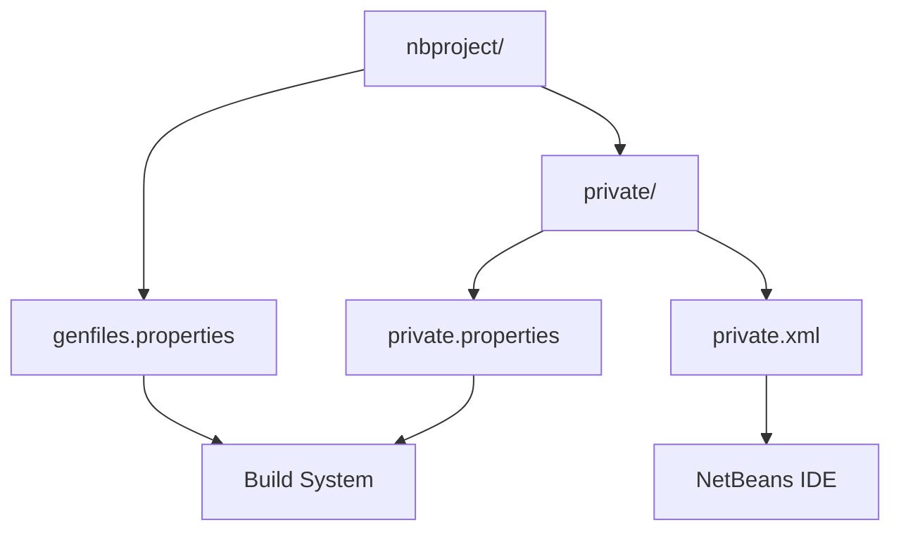
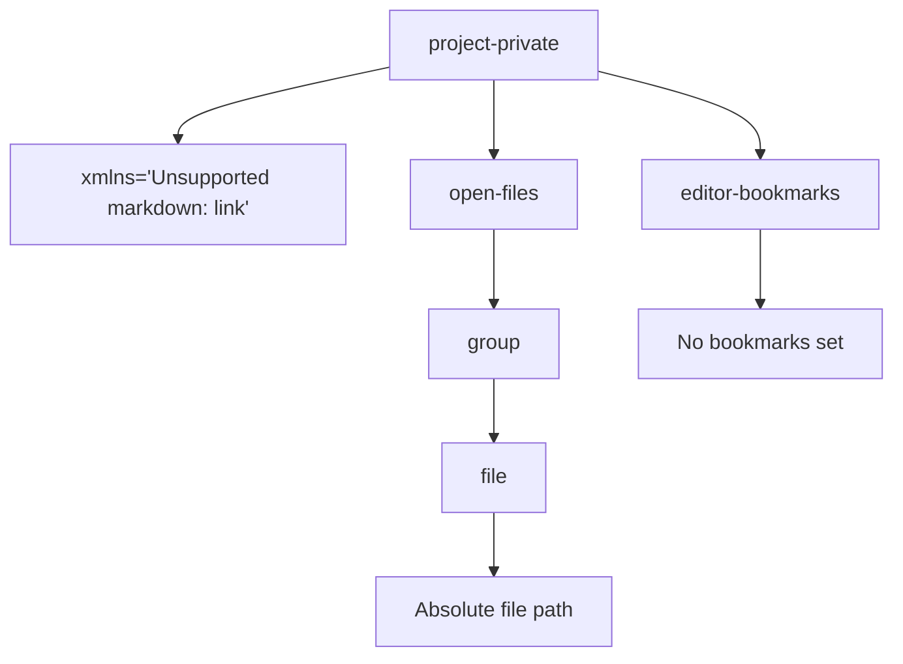
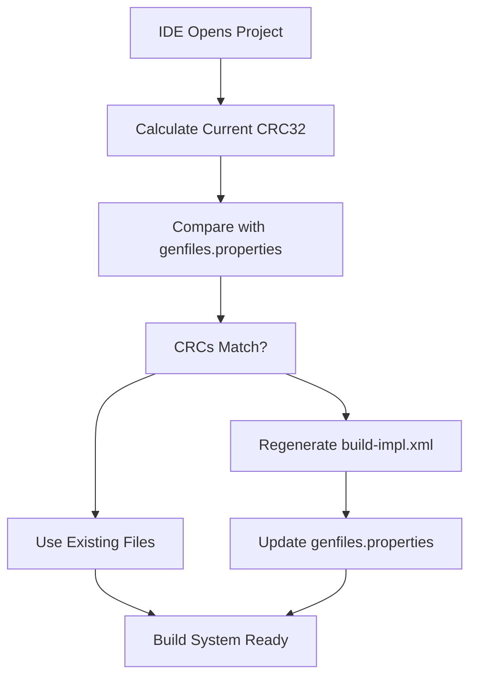
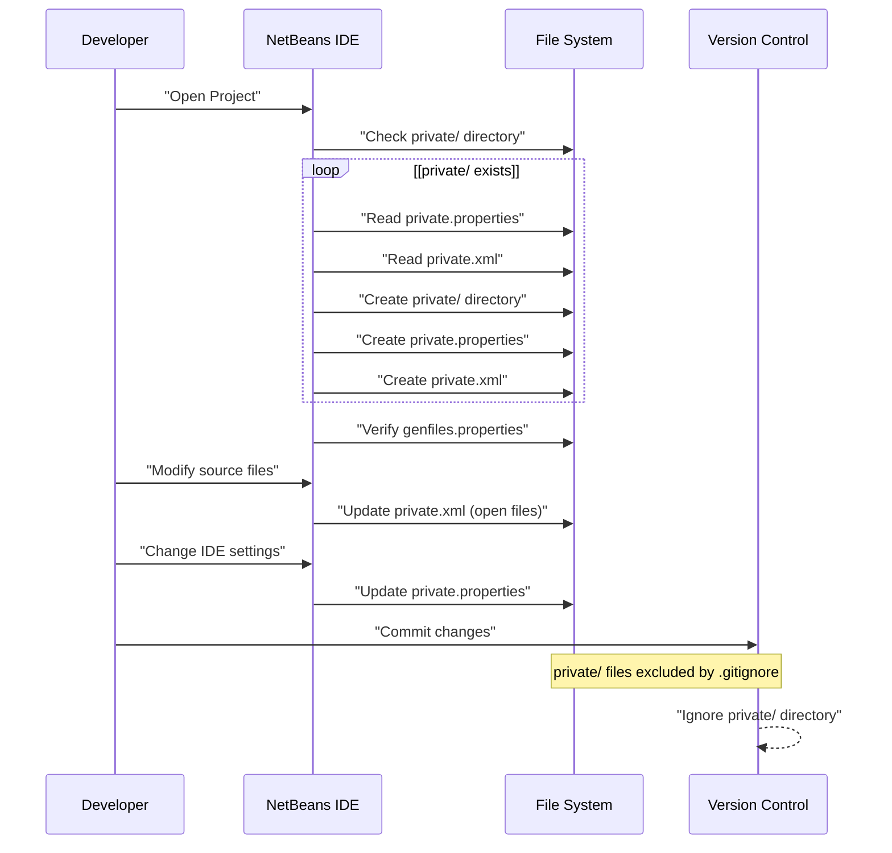
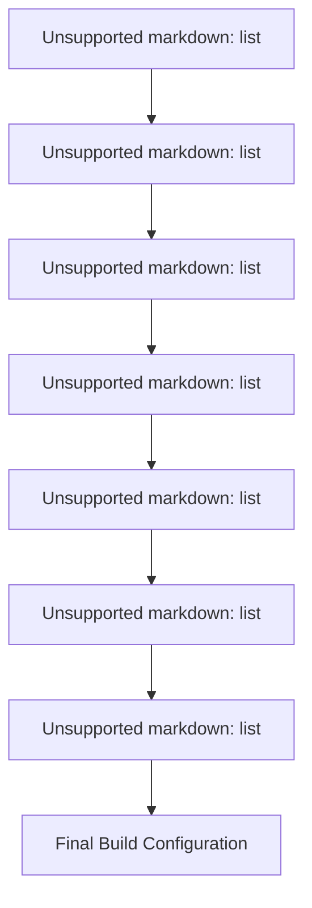
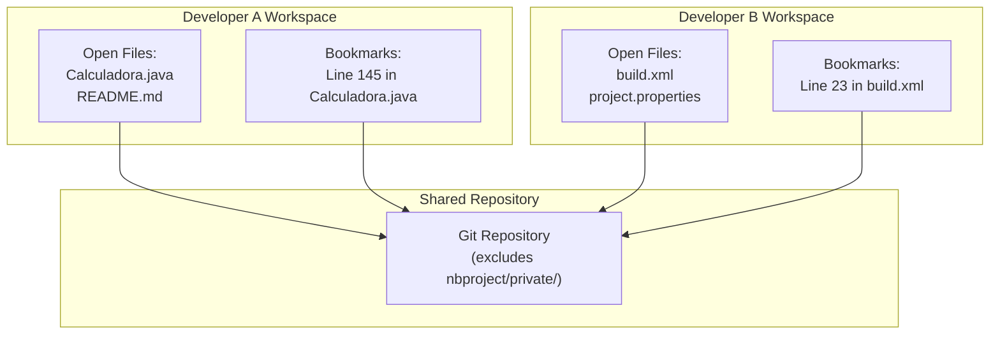
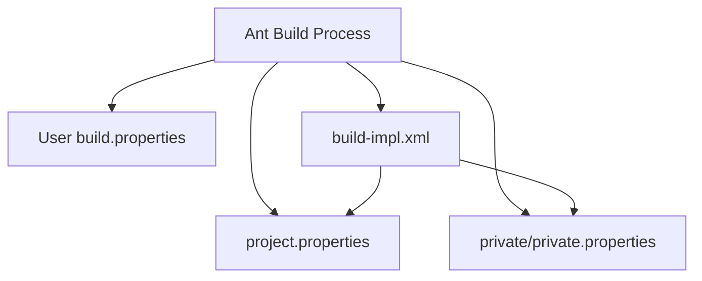

# Private Configuration

> **Relevant source files**
> * [nbproject/genfiles.properties](https://github.com/ricardo-alan/SimpleCalculator/blob/e9524f29/nbproject/genfiles.properties)
> * [nbproject/private/private.properties](https://github.com/ricardo-alan/SimpleCalculator/blob/e9524f29/nbproject/private/private.properties)
> * [nbproject/private/private.xml](https://github.com/ricardo-alan/SimpleCalculator/blob/e9524f29/nbproject/private/private.xml)

## Purpose and Scope

This document covers user-specific and machine-specific configuration files stored in the `nbproject/private/` directory. These files contain settings that vary between developers and development environments, such as IDE state, local file paths, and user preferences.

For project-wide shared configuration, see [Project Properties](/ricardo-alan/SimpleCalculator/6.1-project-properties) and [Project Definition](/ricardo-alan/SimpleCalculator/6.2-project-definition). For build system configuration, see [Build Configuration](/ricardo-alan/SimpleCalculator/5.1-build-configuration).

**Sources:** nbproject/private/private.properties, nbproject/private/private.xml

---

## Private Configuration Overview

The `nbproject/private/` directory contains configuration files that are specific to individual developers and should not be committed to version control. These files allow each developer to maintain their own IDE state, local paths, and preferences without affecting other team members.

### Directory Structure



**Purpose by File:**

| File | Location | Purpose | Version Control |
| --- | --- | --- | --- |
| `private.properties` | `nbproject/private/` | User-specific build settings and paths | Excluded |
| `private.xml` | `nbproject/private/` | IDE state (open files, bookmarks) | Excluded |
| `genfiles.properties` | `nbproject/` | Generated file tracking and CRC validation | Included |

**Sources:** nbproject/private/private.properties, nbproject/private/private.xml, nbproject/genfiles.properties

---

## private.properties File

The `private.properties` file stores user-specific and machine-specific build configuration that overrides or supplements the shared `project.properties` file. This file is automatically created and maintained by NetBeans IDE.

### File Structure

[nbproject/private/private.properties L1-L3](https://github.com/ricardo-alan/SimpleCalculator/blob/e9524f29/nbproject/private/private.properties#L1-L3)

### Configuration Properties

| Property | Value | Description |
| --- | --- | --- |
| `compile.on.save` | `true` | Enables automatic compilation when source files are saved |
| `user.properties.file` | `C:\Users\RicardoHdez\...` | Path to user's global NetBeans properties file |

### Property Details

#### compile.on.save

Controls whether NetBeans automatically compiles Java source files upon saving. When enabled (`true`), the IDE performs incremental compilation, allowing faster development iteration without explicit build commands.

**Behavior:**

* `true`: Automatic compilation on file save
* `false`: Manual build required (via Ant or IDE build commands)

#### user.properties.file

Points to the user's global NetBeans configuration file. This file contains IDE-wide settings that apply across all projects for the current user.

**Typical Locations:**

* Windows: `%APPDATA%\NetBeans\8.2\build.properties`
* Linux: `~/.netbeans/8.2/build.properties`
* macOS: `~/Library/Application Support/NetBeans/8.2/build.properties`

This property allows NetBeans to locate and apply global settings such as:

* Default Java platform paths
* Global library definitions
* IDE-wide compiler options
* Custom Ant property definitions

**Sources:** nbproject/private/private.properties

---

## private.xml File

The `private.xml` file maintains IDE-specific state information that persists across IDE sessions. This includes editor bookmarks, open file tabs, and debugging configurations.

### File Structure

[nbproject/private/private.xml L1-L10](https://github.com/ricardo-alan/SimpleCalculator/blob/e9524f29/nbproject/private/private.xml#L1-L10)

### XML Schema and Namespaces



### Component Breakdown

#### project-private Root Element

Defines the private configuration namespace and contains all IDE-specific state information.

**Namespace:** `http://www.netbeans.org/ns/project-private/1`

#### editor-bookmarks Element

[nbproject/private/private.xml L3](https://github.com/ricardo-alan/SimpleCalculator/blob/e9524f29/nbproject/private/private.xml#L3-L3)

Stores numbered bookmarks that developers can set in the code editor for quick navigation.

**Attributes:**

* `xmlns`: Namespace for bookmark schema (`http://www.netbeans.org/ns/editor-bookmarks/2`)
* `lastBookmarkId`: Highest bookmark ID currently in use (0 = no bookmarks)

#### open-files Element

[nbproject/private/private.xml L4-L9](https://github.com/ricardo-alan/SimpleCalculator/blob/e9524f29/nbproject/private/private.xml#L4-L9)

Tracks which source files are currently open in the IDE, allowing the IDE to restore the workspace state when the project is reopened.

**Structure:**

| Element | Purpose | Example |
| --- | --- | --- |
| `group` | Organizes open files into tab groups | Default unnamed group |
| `file` | Absolute file path to an open source file | `file:/C:/Users/.../Calculadora.java` |

**Current Open Files:**

* `src/calculadora/Calculadora.java` (main application class)

**Sources:** nbproject/private/private.xml

---

## genfiles.properties File

While not located in the `private/` directory, `genfiles.properties` serves a related purpose: tracking the integrity of IDE-generated files to determine when regeneration is necessary.

### File Structure

[nbproject/genfiles.properties L1-L9](https://github.com/ricardo-alan/SimpleCalculator/blob/e9524f29/nbproject/genfiles.properties#L1-L9)

### CRC32 Checksums

The file uses CRC32 checksums to detect modifications to generated files. NetBeans uses these checksums to determine whether generated files (like `build-impl.xml`) are out of sync with their source templates.

#### Tracked Files and Components

| Property | Target File | Component Tracked |
| --- | --- | --- |
| `build.xml.data.CRC32` | `build.xml` | Project configuration data |
| `build.xml.script.CRC32` | `build.xml` | Custom build script content |
| `build.xml.stylesheet.CRC32` | `build.xml` | NetBeans stylesheet version |
| `nbproject/build-impl.xml.data.CRC32` | `nbproject/build-impl.xml` | Generated build data |
| `nbproject/build-impl.xml.script.CRC32` | `nbproject/build-impl.xml` | Generated build script |
| `nbproject/build-impl.xml.stylesheet.CRC32` | `nbproject/build-impl.xml` | Stylesheet version |

### Regeneration Logic



### Stylesheet Versions

The `@` notation indicates the NetBeans platform version that generated the file:

* `@1.80.1.48` - NetBeans 8.2 build 48 stylesheet

If a developer opens the project in a different NetBeans version, these checksums will likely mismatch, triggering regeneration with the new version's templates.

**Sources:** nbproject/genfiles.properties

---

## Configuration Lifecycle and Workflow

Understanding how private configuration files interact with the development workflow is essential for troubleshooting IDE issues and understanding project portability.

### Creation and Maintenance



### Property Resolution Hierarchy

When NetBeans builds the project, properties are resolved in the following order (later sources override earlier ones):



### Version Control Exclusion

The `.gitignore` file (or equivalent VCS configuration) should exclude private configuration to prevent conflicts:

```java
# NetBeans private configuration
nbproject/private/
```

**Rationale:**

* **private.properties**: Contains absolute file paths specific to each developer's machine
* **private.xml**: Contains workspace state that differs between developers
* Committing these files causes merge conflicts and forces developers to use identical paths

**Sources:** nbproject/private/private.properties, nbproject/private/private.xml, nbproject/genfiles.properties

---

## Private Configuration in Multi-Developer Environments

### Developer-Specific Path Mapping

Different developers working on the same project will have different absolute paths to their NetBeans user properties:

| Developer | Operating System | user.properties.file Path |
| --- | --- | --- |
| RicardoHdez | Windows 10 | `C:\Users\RicardoHdez\AppData\Roaming\NetBeans\8.2\build.properties` |
| Developer2 | Windows 11 | `C:\Users\Developer2\AppData\Roaming\NetBeans\8.2\build.properties` |
| Developer3 | Linux | `/home/developer3/.netbeans/8.2/build.properties` |
| Developer4 | macOS | `/Users/developer4/Library/Application Support/NetBeans/8.2/build.properties` |

Each developer's `private.properties` file will automatically point to their system-specific location.

### Workspace State Independence

The `private.xml` file allows each developer to maintain their own workspace state:



**Sources:** nbproject/private/private.properties, nbproject/private/private.xml

---

## Troubleshooting Private Configuration

### Common Issues and Solutions

| Issue | Symptom | Solution |
| --- | --- | --- |
| Compile-on-save not working | Changes not reflected until manual build | Set `compile.on.save=true` in private.properties |
| Project won't open | NetBeans errors on project load | Delete `private/` directory, let IDE regenerate |
| Build-impl.xml out of date | Build failures with "target not found" errors | Delete `genfiles.properties`, let IDE regenerate |
| Wrong user properties file | Global settings not applied | Verify `user.properties.file` path is correct |

### Resetting Private Configuration

To reset all IDE-specific configuration to defaults:

1. Close the project in NetBeans
2. Delete the `nbproject/private/` directory
3. Delete `nbproject/genfiles.properties` (optional, for full reset)
4. Reopen the project in NetBeans

NetBeans will automatically recreate these files with default settings based on the current environment.

### Manual Inspection

To inspect current private configuration:

```java
# View private properties
cat nbproject/private/private.properties

# View IDE state
cat nbproject/private/private.xml

# View generated file checksums
cat nbproject/genfiles.properties
```

**Sources:** nbproject/private/private.properties, nbproject/private/private.xml, nbproject/genfiles.properties

---

## Integration with Build System

### Ant Property Access

Properties defined in `private.properties` are accessible to Ant targets defined in `build.xml` and `build-impl.xml`. The build system loads these properties automatically.



### Compile-on-Save Implementation

The `compile.on.save` property affects how NetBeans handles file save operations:

**When enabled (`true`):**

1. Developer saves a `.java` file
2. NetBeans invokes `javac` directly (bypasses Ant for speed)
3. Compiled `.class` file written to `build/classes/`
4. IDE updates internal class cache
5. Running application can hot-swap classes (if debugging)

**When disabled (`false`):**

1. Developer saves a `.java` file
2. No automatic compilation occurs
3. Developer must manually trigger build (F11 or Build menu)
4. Full Ant build process executes

**Sources:** nbproject/private/private.properties, nbproject/genfiles.properties

---

## Summary

The private configuration system in SimpleCalculator provides:

1. **User-specific paths**: Each developer maintains their own path to NetBeans global properties
2. **IDE state persistence**: Open files and bookmarks survive IDE restarts
3. **Build optimizations**: Compile-on-save enabled for faster development iteration
4. **Version control safety**: Private files excluded from repository to prevent conflicts
5. **File integrity tracking**: CRC32 checksums ensure generated files remain synchronized

These files work together with the shared project configuration ([Project Properties](/ricardo-alan/SimpleCalculator/6.1-project-properties), [Project Definition](/ricardo-alan/SimpleCalculator/6.2-project-definition)) to provide a flexible development environment that accommodates multiple developers while maintaining consistent build behavior.

**Sources:** nbproject/private/private.properties, nbproject/private/private.xml, nbproject/genfiles.properties